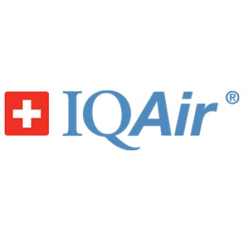
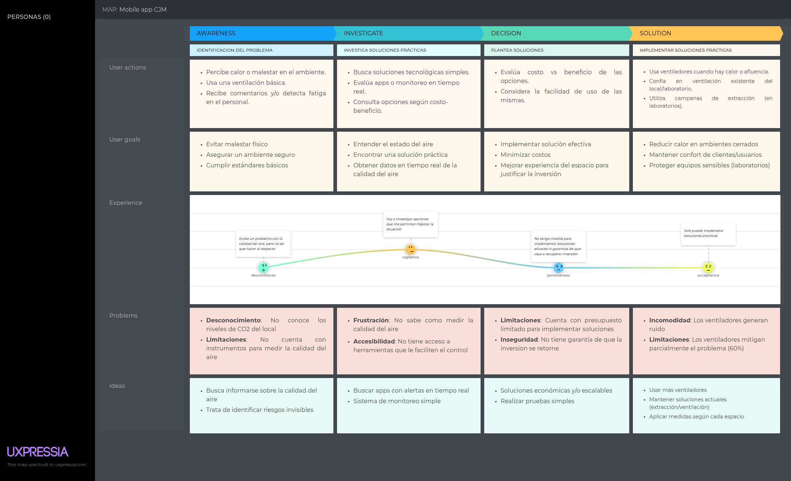
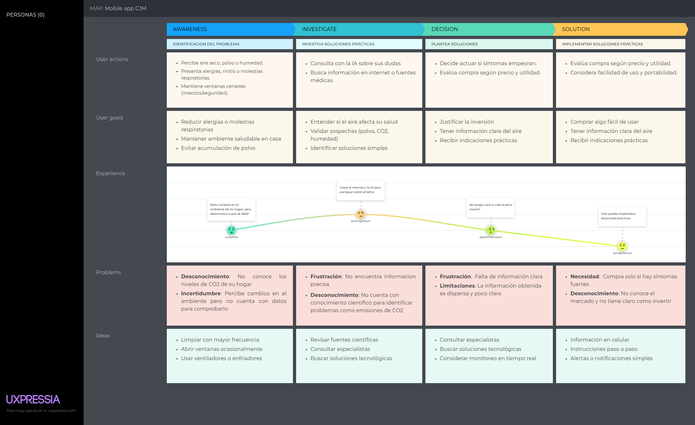
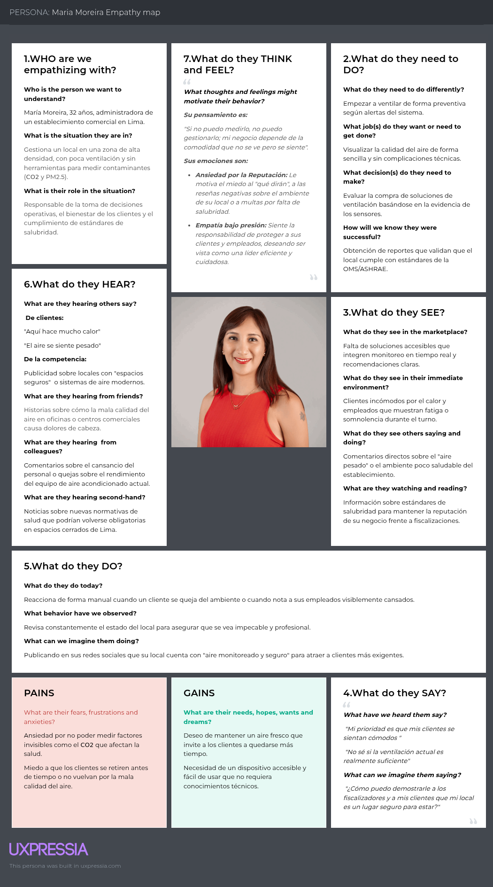
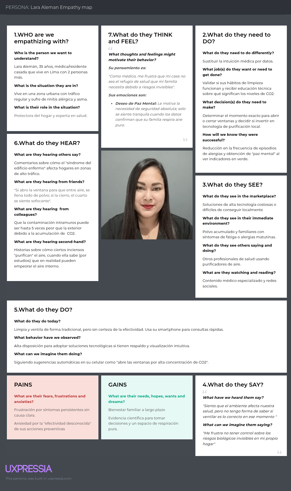
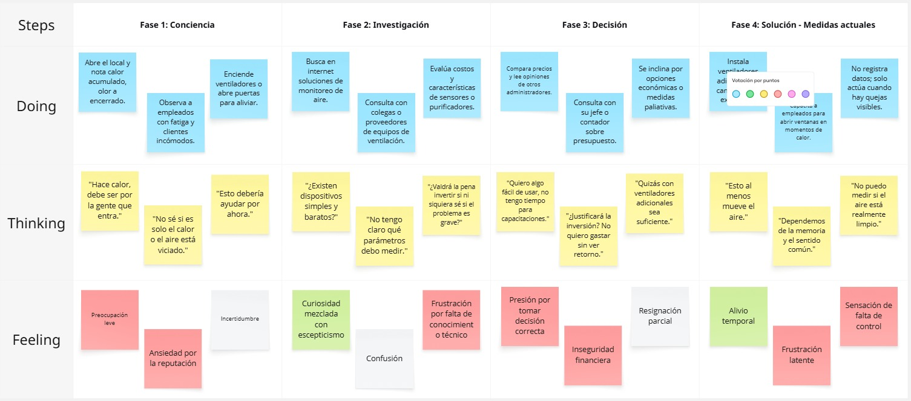
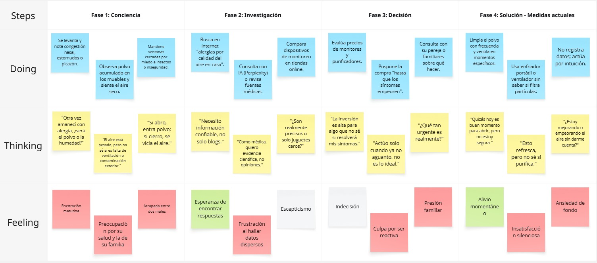

# Capítulo II: Requirements Elicitation & Analysis

## 2.1. Competidores.

En esta sección se identifican y describen los principales competidores directos (mínimo 3) con modelos de negocio basados en productos digitales similares, o en su defecto competidores indirectos con ofertas parcialmente similares.

- **Airly**: Empresa de origen polaco que ha consolidado una de las redes de monitoreo de calidad del aire más extensas a nivel global. Su propuesta se basa en sensores de alta resistencia para exteriores e inteligencia artificial para pronósticos y mapas de calor comunitarios. En Lima Metropolitana se han posicionado como referente para municipalidades (B2G) mediante una estrategia de *Open Data*, que les da visibilidad y facilita la venta de soluciones privadas al sector retail y corporativo.

- **IQAir**: Organización suiza considerada el estándar de oro en purificación y monitoreo. Su base de datos de calidad del aire es la más consultada del mundo. Su línea AirVisual está orientada a un segmento premium: instituciones de salud privadas, embajadas y corporaciones. Integra verticalmente dispositivos de monitoreo con purificadores y usa su plataforma móvil como canal de marketing directo.

- **Kaiterra**: Compañía especializada en B2B y *Smart Buildings*. Ofrece hardware modular como el sistema Sensedge, que se integra con infraestructura HVAC. Su ventaja competitiva es el cumplimiento normativo: sus dispositivos permiten obtener puntajes para certificaciones LEED, WELL y RESET. Se dirige a desarrolladoras inmobiliarias y gestores de infraestructura que buscan edificios de clase A+.

### 2.1.1. Análisis competitivo.

<table style="border-collapse:collapse; width:100%; font-family:Arial, sans-serif; font-size:14px;">
  <tr>
    <th colspan="6" style="border:1px solid #ccc; padding:10px; background-color:#f2f2f2; text-align:center;">Competitive Analysis Landscape</th>
  </tr>
  <tr>
    <td colspan="2" style="border:1px solid #ccc; padding:10px; vertical-align:top;"><strong>¿Por qué llevar a cabo este análisis?</strong></td>
    <td colspan="4" style="border:1px solid #ccc; padding:10px; vertical-align:top;">El objetivo es identificar las brechas tecnológicas y de experiencia de usuario en las plataformas actuales de monitoreo de aire en Perú, para validar que la integración de alertas personalizadas de Clair responde a una demanda insatisfecha en espacios cerrados.</td>
  </tr>
  <tr>
    <td colspan="2" style="border:1px solid #ccc; padding:10px; vertical-align:top;">(En la cabecera colocar por cada competidor nombre y logo)</td>
    <td style="border:1px solid #ccc; padding:10px; vertical-align:top;">Clair </td>
    <td style="border:1px solid #ccc; padding:10px; vertical-align:top;">Airly </td>
    <td style="border:1px solid #ccc; padding:10px; vertical-align:top;">IQAir </td>
    <td style="border:1px solid #ccc; padding:10px; vertical-align:top;">Kaiterra </td>
  </tr>
  <tr>
    <td rowspan="2" style="border:1px solid #ccc; padding:10px; vertical-align:top; background-color:#fafafa; font-weight:bold;">Perfil</td>
    <td style="border:1px solid #ccc; padding:10px; vertical-align:top;">Overview</td>
    <td style="border:1px solid #ccc; padding:10px; vertical-align:top;">Clair se enfoca en el microclima de espacios comerciales cerrados, integrando sensores PM2.5/CO₂ con una plataforma que prioriza la interpretabilidad visual y la acción correctiva.</td>
    <td style="border:1px solid #ccc; padding:10px; vertical-align:top;">Empresa polaca con una de las redes de sensores de aire más grandes del mundo. En Lima, son el referente en monitoreo de exteriores (calle) mediante mapas de calor comunitarios y datos abiertos.</td>
    <td style="border:1px solid #ccc; padding:10px; vertical-align:top;">Estándar de oro global en tecnología de purificación y monitoreo. Su serie Visual es el dispositivo de referencia para oficinas de alto nivel y sedes corporativas que buscan prestigio y precisión suiza.</td>
    <td style="border:1px solid #ccc; padding:10px; vertical-align:top;">Empresa enfocada exclusivamente en el sector B2B y Smart Buildings. Sus dispositivos, como el Sensedge, están diseñados para ser empotrados en paredes y techos, integrándose directamente con los sistemas de aire acondicionado (HVAC).</td>
  </tr>
  <tr>
    <td style="border:1px solid #ccc; padding:10px; vertical-align:top;">Ventaja competitiva ¿Qué valor ofrece a los clientes?</td>
    <td style="border:1px solid #ccc; padding:10px; vertical-align:top;">Gestión Basada en Evidencia: Ofrece reportes históricos semanales que transforman suposiciones en decisiones de gestión de aforo y ventilación.   Accesibilidad Operativa: Diseñado para administradores que no son expertos en calidad del aire, facilitando una tasa de respuesta del 40% ante alertas.</td>
    <td style="border:1px solid #ccc; padding:10px; vertical-align:top;">Efecto de Red: Sus datos son utilizados por municipalidades y medios de comunicación, lo que les da una visibilidad de marca masiva.   Familiaridad: Los usuarios de Lima ya reconocen sus estaciones en distritos como Miraflores o San Borja.</td>
    <td style="border:1px solid #ccc; padding:10px; vertical-align:top;">Autoridad de Marca: Poseen la base de datos de calidad del aire más consultada del mundo; aparecer en su ranking otorga validación internacional.   Certificación de Datos: Sus sensores están validados para auditorías de salud ambiental de alto rigor.</td>
    <td style="border:1px solid #ccc; padding:10px; vertical-align:top;">Cumplimiento Normativo: Sus productos son los únicos que garantizan puntos directos para certificaciones internacionales de edificios verdes como LEED, WELL y RESET.   Integración BMS: Se comunica mediante protocolos industriales (BACnet, Modbus) con la infraestructura inteligente del edificio.</td>
  </tr>
  <tr>
    <td rowspan="2" style="border:1px solid #ccc; padding:10px; vertical-align:top; background-color:#fafafa; font-weight:bold;">Perfil de Marketing</td>
    <td style="border:1px solid #ccc; padding:10px; vertical-align:top;">Mercado objetivo</td>
    <td style="border:1px solid #ccc; padding:10px; vertical-align:top;">Primario: Administradores de centros comerciales, gimnasios, oficinas y restaurantes en Lima.   Secundario: Personas preocupadas por la calidad del aire en el Hogar. </td>
    <td style="border:1px solid #ccc; padding:10px; vertical-align:top;">Gobiernos municipales, ONG ambientales y empresas de Retail con fuertes políticas de responsabilidad social (ESG) que operan principalmente en Lima (Miraflores, San Isidro).</td>
    <td style="border:1px solid #ccc; padding:10px; vertical-align:top;">Consumidores de lujo, instituciones de salud privadas y embajadas en Perú que no escatiman en costos para garantizar pureza total.</td>
    <td style="border:1px solid #ccc; padding:10px; vertical-align:top;">Desarrolladoras inmobiliarias corporativas y administradores de Centros Comerciales que necesitan cumplir con estándares internacionales de construcción sostenible.</td>
  </tr>
  <tr>
    <td style="border:1px solid #ccc; padding:10px; vertical-align:top;">Estrategias de marketing</td>
    <td style="border:1px solid #ccc; padding:10px; vertical-align:top;">Estrategia de Gamificación y Reportes: Envío de un "Reporte de Salud Semanal" a los administradores.</td>
    <td style="border:1px solid #ccc; padding:10px; vertical-align:top;">Open Data: Mantener un mapa de acceso gratuito para el ciudadano común, lo que sirve como "caballo de Troya" para vender soluciones privadas a las empresas del entorno.</td>
    <td style="border:1px solid #ccc; padding:10px; vertical-align:top;">Inbound Marketing Global: Uso de su App para enviar notificaciones de alerta de polución en Lima, sugiriendo la compra de sus equipos como solución inmediata.</td>
    <td style="border:1px solid #ccc; padding:10px; vertical-align:top;">Account-Based Marketing (ABM): Campañas dirigidas específicamente a arquitectos y gestores de infraestructura para que incluyan sus sensores en los planos de nuevos proyectos desde la fase de diseño.</td>
  </tr>
  <tr>
    <td rowspan="3" style="border:1px solid #ccc; padding:10px; vertical-align:top; background-color:#fafafa; font-weight:bold;">Perfil de Producto</td>
    <td style="border:1px solid #ccc; padding:10px; vertical-align:top;">Productos &amp; Servicios</td>
    <td style="border:1px solid #ccc; padding:10px; vertical-align:top;">Hardware: Sensor "Clair-V1".   Software: App móvil para usuarios/clientes y Dashboard Web para administradores con reportes históricos semanales.   Servicio: Sistema de alertas inteligentes vía Notificaciones con recomendaciones de ventilación basadas en niveles de ocupación. </td>
    <td style="border:1px solid #ccc; padding:10px; vertical-align:top;">Hardware: Sensores de exterior de alta resistencia y sensores de interior simplificados.  Software: Mapa global de calidad del aire (Airly Map) y API de datos para integración en pantallas publicitarias o webs municipales.  Servicio: Pronóstico de calidad del aire a 24h mediante Inteligencia Artificial.</td>
    <td style="border:1px solid #ccc; padding:10px; vertical-align:top;">Hardware: Monitor AirVisual Pro (pantalla a color de alta resolución incorporada).   Software: Integración con la red global AirVisual.   Servicio: Sincronización automática con purificadores de aire de la misma marca.</td>
    <td style="border:1px solid #ccc; padding:10px; vertical-align:top;">Hardware: Sensedge y Sensedge Mini (sensores modulares calibrables).   Software: Dashboard de nivel industrial con protocolos de seguridad de datos para empresas.   Servicio: Consultoría para obtención de certificaciones WELL, LEED y RESET. Integración total con sistemas HVAC (Aire acondicionado centralizado).</td>
  </tr>
  <tr>
    <td style="border:1px solid #ccc; padding:10px; vertical-align:top;">Precios &amp; Costos</td>
    <td style="border:1px solid #ccc; padding:10px; vertical-align:top;">Modelo Híbrido: Venta del hardware (pago único accesible) + Suscripción mensual "Clair Pro" para acceso a analítica avanzada y reportes históricos (SaaS).</td>
    <td style="border:1px solid #ccc; padding:10px; vertical-align:top;">Modelo B2B/B2G: Contratos anuales de "Aire como Servicio" (Air as a Service) que incluyen mantenimiento y acceso a la plataforma de datos.   Costo Estimado: Suscripciones anuales desde $500 - $1,000 USD por punto de monitoreo.</td>
    <td style="border:1px solid #ccc; padding:10px; vertical-align:top;">Modelo Retail Premium: Venta directa de hardware de alto costo. No suele requerir suscripción para funciones básicas, pero el equipo es costoso.   Costo Estimado: Hardware $280 - $350 USD por unidad.</td>
    <td style="border:1px solid #ccc; padding:10px; vertical-align:top;">Modelo de Proyecto: Presupuestos por volumen para edificios completos o centros comerciales. Incluye planes de reemplazo de módulos de sensores cada 2 años.   Costo Estimado: Proyectos desde $1,500 USD en adelante según la escala del edificio.</td>
  </tr>
  <tr>
    <td style="border:1px solid #ccc; padding:10px; vertical-align:top;">Canales de distribución (Web y/o Móvil)</td>
    <td style="border:1px solid #ccc; padding:10px; vertical-align:top;">Web: Plataforma de gestión centralizada para administradores de múltiples locales.   Móvil: App (iOS/Android) para monitoreo en tiempo real y recepción de alertas.</td>
    <td style="border:1px solid #ccc; padding:10px; vertical-align:top;">Web: Mapa interactivo público y panel de control para clientes corporativos.   Móvil: App Airly (enfocada en el ciudadano que consulta el aire de su zona).</td>
    <td style="border:1px solid #ccc; padding:10px; vertical-align:top;">Web: E-commerce global y base de datos de consulta mundial.   Móvil: App AirVisual (líder en descargas, usada como canal de marketing para vender sus purificadores).</td>
    <td style="border:1px solid #ccc; padding:10px; vertical-align:top;">Web: Dashboard empresarial compatible con protocolos industriales (BACnet, Modbus).   Móvil: App de visualización técnica para gestores de mantenimiento de edificios (Facility Managers).</td>
  </tr>
  <tr>
    <td rowspan="4" style="border:1px solid #ccc; padding:10px; vertical-align:top; background-color:#fafafa; font-weight:bold;">Análisis SWOT</td>
    <td style="border:1px solid #ccc; padding:10px; vertical-align:top;">Fortalezas</td>
    <td style="border:1px solid #ccc; padding:10px; vertical-align:top;">Profundo conocimiento del contexto de Lima; interfaz intuitiva basada en Lean UX; bajo costo de implementación.</td>
    <td style="border:1px solid #ccc; padding:10px; vertical-align:top;">Red de sensores ya establecida en distritos clave de Lima; algoritmos de IA predictiva muy avanzados; fuerte presencia en medios de comunicación.</td>
    <td style="border:1px solid #ccc; padding:10px; vertical-align:top;">Marca número 1 a nivel mundial en confianza; ecosistema completo que conecta monitores con purificadores de aire.</td>
    <td style="border:1px solid #ccc; padding:10px; vertical-align:top;">Único que garantiza puntos para certificaciones LEED/WELL; diseño modular que facilita el mantenimiento en grandes infraestructuras.</td>
  </tr>
  <tr>
    <td style="border:1px solid #ccc; padding:10px; vertical-align:top;">Debilidades</td>
    <td style="border:1px solid #ccc; padding:10px; vertical-align:top;">Marca nueva en el mercado; recursos limitados para I+D comparado con globales; dependencia inicial de la adopción de los administradores.</td>
    <td style="border:1px solid #ccc; padding:10px; vertical-align:top;">Su enfoque principal es el exterior (calle), perdiendo precisión en las dinámicas de flujo de personas dentro de comercios cerrados.</td>
    <td style="border:1px solid #ccc; padding:10px; vertical-align:top;">Precios muy elevados para el mercado promedio peruano; soporte técnico remoto o inexistente en Lima (depende de distribuidores).</td>
    <td style="border:1px solid #ccc; padding:10px; vertical-align:top;">Demasiado complejo y caro para un comercio mediano o pequeño; requiere instalación técnica especializada.</td>
  </tr>
  <tr>
    <td style="border:1px solid #ccc; padding:10px; vertical-align:top;">Oportunidades</td>
    <td style="border:1px solid #ccc; padding:10px; vertical-align:top;">Creciente preocupación por la salud pospandemia en Lima; falta de soluciones específicas para el sector comercial peruano; posibilidad de crear un "Sello de Calidad de Aire" local.</td>
    <td style="border:1px solid #ccc; padding:10px; vertical-align:top;">Alianzas con municipalidades para integrar datos de interiores en proyectos de "Smart Cities".</td>
    <td style="border:1px solid #ccc; padding:10px; vertical-align:top;">Capturar el mercado de lujo y corporativos transnacionales en San Isidro y Miraflores.</td>
    <td style="border:1px solid #ccc; padding:10px; vertical-align:top;">Crecimiento de la construcción de edificios de oficinas clase A+ en el centro financiero de Lima.</td>
  </tr>
  <tr>
    <td style="border:1px solid #ccc; padding:10px; vertical-align:top;">Amenazas</td>
    <td style="border:1px solid #ccc; padding:10px; vertical-align:top;">Ingreso de clones económicos de China; cambios bruscos en las normativas de salud del gobierno peruano que favorezcan certificaciones internacionales caras.</td>
    <td style="border:1px solid #ccc; padding:10px; vertical-align:top;">Saturación de datos públicos gratuitos que hagan que las empresas no quieran pagar por una versión privada.</td>
    <td style="border:1px solid #ccc; padding:10px; vertical-align:top;">Aparición de sensores de bajo costo con precisión "suficiente" para el usuario común que no requiere estándares suizos.</td>
    <td style="border:1px solid #ccc; padding:10px; vertical-align:top;">Crisis en el sector inmobiliario comercial que detenga la construcción de nuevos edificios "Smart".</td>
  </tr>
</table>

### 2.1.2. Estrategias y tácticas frente a competidores.

### 2.1.2 Estrategias y tácticas frente a competidores

Para afrontar de manera estratégica el panorama competitivo en Lima Metropolitana, **Clair** implementará una serie de tácticas ofensivas y defensivas diseñadas para capitalizar las brechas de servicio de los actores globales y mitigar las amenazas del mercado local.

1. **Especialización en microclima de interiores**  
   Nos diferenciaremos de competidores como Airly (enfocado en exteriores) mediante un ecosistema de alertas inteligentes y reportes de gestión de aforo que transforman datos crudos en decisiones operativas inmediatas para administradores de espacios cerrados.

2. **Alta precisión técnica con baja barrera de entrada**  
   Frente a la autoridad de marca de IQAir o la complejidad técnica de Kaiterra, Clair se posicionará como una solución de precisión técnica, pero con un modelo de costos híbrido: hardware accesible + suscripción SaaS de analítica avanzada, eliminando grandes inversiones iniciales y la necesidad de personal especializado.

3. **Sello de Calidad de Aire local y soporte presencial**  
   Para neutralizar la amenaza de dispositivos genéricos de bajo costo, fortaleceremos la propuesta de valor con un “Sello de Calidad de Aire” y soporte técnico presencial garantizado en menos de 24 horas, aprovechando nuestra ubicación en Lima para ofrecer cercanía y confianza que los proveedores internacionales no pueden replicar.

4. **Marketing de contenidos y alianzas estratégicas**  
   Aprovecharemos la creciente preocupación pospandemia por la salud ambiental para ejecutar tácticas de marketing de contenidos y alianzas con gremios comerciales, posicionando a Clair no solo como un sensor IoT, sino como herramienta de responsabilidad social y seguridad laboral que protege activamente la salud de la comunidad peruana.

5. **Soluciones personalizadas y accionables**  
   Ofreceremos recomendaciones prácticas en la aplicación móvil para que locales u hogares que usen Clair tomen acciones concretas. El resultado de dichas acciones se reflejará en los reportes históricos semanales, cerrando el ciclo de mejora continua.

## 2.2. Entrevistas.

En esta sección se aborda la investigación tomando como base la recolección de información basándonos en entrevistas a representantes de los segmentos objetivo.

### 2.2.1. Diseño de entrevistas.

| Segmento Objetivo #1: | Administradores de Establecimientos Públicos y Privados |
| -------------------------- | -------------------------------------------------------------------------------------------------------------------------------------------------------------------------------------------------------------------------------------------------------------------------------------------------------------------------------------------------------------------------------------------------------------------------------------------------------------------------------------------------------------------------------------------------------------------------------------------------------------------------------------------------------------------------------------------------------------------------------------------------- |
| Datos Demográficos | ¿Cuál es su nombre completo y edad? ¿En qué distrito se ubica su establecimiento? ¿Cuál es su cargo actual? |
| Ocupación y Background | ¿Qué tipo de establecimiento administra y cuántas personas lo frecuentan en un día típico? ¿Cuántos empleados trabajan en el local? ¿Cuánto tiempo lleva administrando este tipo de espacio? |
| Perfil Psicográfico | ¿Cómo toma decisiones cuando detecta un problema que afecta la experiencia de sus clientes o empleados? ¿Qué herramientas digitales usa actualmente para gestionar el local? ¿Qué tan abierto se considera a adoptar nueva tecnología si resuelve un problema concreto? |
| Calidad del Aire | ¿Tiene algún sistema o práctica para controlar la ventilación del local actualmente? ¿Confía en que el aire acondicionado o la ventilación existente es suficiente para mantener un ambiente saludable? ¿Ha recibido quejas de clientes o empleados sobre sensación de calor, aire viciado o incomodidad dentro del local? ¿Ha notado que sus empleados se fatigan, pierden concentración o se quejan de malestar físico durante el horario laboral sin una causa clara? ¿Sabía que en espacios cerrados con alta ocupación el CO2 y las partículas en suspensión pueden superar los límites recomendados por la OMS sin que nadie lo note? ¿Cómo sabría hoy si la calidad del aire de su local está dentro de rangos seguros? |
| Objetivos y Frustraciones | ¿Qué tan importante considera el bienestar físico de sus clientes y empleados dentro del local para la reputación de su negocio? ¿Existe algún aspecto del ambiente interior que sienta que no puede controlar ni medir actualmente? ¿Cumpliría con estándares de salubridad del aire si existiera una forma sencilla de demostrarlo? ¿Qué tan dispuesto estaría a usar una solución que monitoree el aire en tiempo real y le indique cuándo actuar? ¿Qué condiciones económicas o técnicas tendría que cumplir para considerarla viable? |
| Tecnología y Canales | ¿Qué dispositivos usa a diario para gestionar el local? ¿Usaría una aplicación que le muestre en tiempo real el estado del aire de su local y le envíe alertas cuando haya riesgo? ¿Le resultaría útil poder generar reportes históricos de calidad del aire para demostrar que su espacio es seguro? |
| Comportamiento de Decisión | ¿Qué lo lleva a invertir en una mejora para el local? ¿Quién más participa en decisiones de equipamiento o tecnología? ¿Recomendaría a otros administradores una solución que le haya dado resultados concretos? |

| Segmento Objetivo #2: | Personas preocupadas por la calidad del aire en el hogar |
| -------------------------- | -------------------------------------------------------------------------------------------------------------------------------------------------------------------------------------------------------------------------------------------------------------------------------------------------------------------------------------------------------------------------------------------------------------------------------------------------------------------------------------------------------------------------------------------------------------------------------------------------------------------------------------------------------------------------------------- |
| Datos Demográficos | ¿Cuál es su nombre completo y edad? ¿En qué distrito reside? ¿Cuántas personas viven en su hogar y hay niños pequeños o adultos mayores entre ellos? |
| Ocupación y Background | ¿A qué se dedica actualmente? ¿Cuánto tiempo lleva viviendo en su hogar? ¿Cómo describiría su zona en cuanto a tráfico vehicular o densidad urbana? |
| Perfil Psicográfico | ¿Qué tan activo es en tomar decisiones preventivas sobre la salud de su familia? ¿Qué dispositivos tecnológicos usa en casa? ¿Dónde busca información cuando tiene dudas sobre salud o bienestar? |
| Calidad del Aire | ¿Ha sentido que el aire dentro de su hogar se siente cargado o incómodo sin una causa evidente? ¿Alguien en su hogar ha tenido dolores de cabeza frecuentes, cansancio sin razón clara o problemas respiratorios recurrentes? ¿Alguna vez asoció esos síntomas con el ambiente dentro de la casa? ¿Sabe si en su zona los niveles de contaminación exterior afectan también el interior de su hogar? ¿Sabía que el aire interior puede concentrar contaminantes como CO2 o partículas finas por encima de lo recomendado por la OMS, incluso con las ventanas cerradas? ¿Qué hace actualmente para cuidar el ambiente de su hogar y cómo sabe si está funciónando? |
| Objetivos y Frustraciones | ¿Cuál es su mayor preocupación respecto al ambiente en el que vive su familia? ¿Siente que tiene control real sobre la calidad del aire dentro de su hogar o actúa más por intuición? ¿Qué tendría que pasar para que tomara una acción concreta al respecto? Si pudiera ver en tiempo real cómo está el aire de su casa y recibir recomendaciones simples sobre qué hacer, ¿le resultaría útil? ¿Qué condiciones tendría que cumplir ese dispositivo para que lo considerara una compra justificada? |
| Tecnología y Canales | ¿Qué dispositivos usa más durante el día? ¿Usa alguna app relaciónada con salud, bienestar o el hogar? ¿Preferiría ver la información del aire mediante colores, gráficos o notificaciones en su celular? ¿Le resultaría cómodo que el dispositivo le sugiera automáticamente si abrir ventanas, encender ventilación o tomar otra acción? |
| Comportamiento de Decisión | ¿Qué lo llevaría a comprar un dispositivo de monitoreo de aire para su hogar? ¿Ha comprado antes productos orientados a la salud o bienestar del hogar? ¿Quién en su familia participaría en esa decisión? ¿Recomendaría este tipo de solución a alguien cercano? |

### 2.2.2. Registro de entrevistas.

<table style="border-collapse: collapse; width: 100%; font-family: Arial, sans-serif; font-size: 14px;">
  <thead>
    <tr>
      <th style="border: 1px solid #ccc; padding: 8px; background-color: #f2f2f2; text-align: left; width: 20%;">Segmento objetivo: Administradores de Establecimientos Públicos y Privados</th>
      <th style="border: 1px solid #ccc; padding: 8px; background-color: #f2f2f2; text-align: left; width: 60%;">Resumen</th>
      <th style="border: 1px solid #ccc; padding: 8px; background-color: #f2f2f2; text-align: left; width: 20%;">Video</th>
    </tr>
  </thead>
  <tbody>
    <tr>
      <td style="border: 1px solid #ccc; padding: 8px; vertical-align: top;">
        <strong>Santiago Temoche</strong> 
        
      </td>
      <td style="border: 1px solid #ccc; padding: 8px; vertical-align: top;">
        <strong>Datos Demográficos:</strong> 18 años. Establecimiento en el Centro Comercial Arenales, sótano.  
        <strong>Ocupación y Background:</strong> Atención, ventas y entrega en tienda de coleccionables. 20–30 personas/día. 2–3 años en el puesto.  
        <strong>Perfil Psicográfico:</strong> Busca soluciones inmediatas; abierto a tecnología "de vez en cuando" si mejora ventilación.  
        <strong>Calidad del Aire:</strong> Usa ventiladores. Confía en ventilación actual. No sabía del CO2. No sabe cómo medir seguridad del aire.  
        <strong>Objetivos y Frustraciones:</strong> Bienestar del cliente importante. Dispuesto a usar monitoreo si hay buena relación calidad‑precio.  
        <strong>Tecnología y Canales:</strong> Usa PC y POS. Le serviría app con alertas y reportes históricos.  
        <strong>Comportamiento de Decisión:</strong> Recomendaría soluciones con resultados concretos.
      </td>
      <td style="border: 1px solid #ccc; padding: 8px; vertical-align: top;">
        URL: <a href="https://goo.su/KKwEhz4">https://goo.su/KKwEhz4</a> 
        Inicio: 0:00:06 
        Fin: 0:05:52
      </td>
    </tr>
    <tr>
      <td style="border: 1px solid #ccc; padding: 8px; vertical-align: top;">
        <strong>Rafael Barraza</strong> 
        
      </td>
      <td style="border: 1px solid #ccc; padding: 8px; vertical-align: top;">
        <strong>Datos Demográficos:</strong> 39 años. Tienda en el Centro Comercial Arenales, Lince. Dueño.  
        <strong>Ocupación y Background:</strong> Venta de juguetería (peluches, llaveros, blindboxes). 30–40 personas/día en días bajos, hasta 120 fines de semana. 1 año y medio administrando.  
        <strong>Perfil Psicográfico:</strong> Usa POS del BCP, tablets y celulares. Dispuesto a recibir sugerencias tecnológicas.  
        <strong>Calidad del Aire:</strong> No cuenta con sistema de ventilación. No confía en que sea suficiente. Ha notado fatiga o malestar en empleados.  
        <strong>Objetivos y Frustraciones:</strong> Siente que no puede controlar aspectos del ambiente. Cumpliría estándares si hubiera forma sencilla de demostrarlo. Dispuesto a usar monitoreo si es fácil de funcionar y con buena relación calidad‑precio.  
        <strong>Tecnología y Canales:</strong> Celular, tablets, equipos de pago. Interesado en apps que reporten estado del aire.  
        <strong>Comportamiento de Decisión:</strong> Recomendaría soluciones con resultados concretos.
      </td>
      <td style="border: 1px solid #ccc; padding: 8px; vertical-align: top;">
        URL: <a href="https://goo.su/KKwEhz4">https://goo.su/KKwEhz4</a> 
        Inicio: 0:05:52 
        Fin: 0:10:46
      </td>
    </tr>
    <tr>
      <td style="border: 1px solid #ccc; padding: 8px; vertical-align: top;">
        <strong>Paul Eslava</strong> 
        
      </td>
      <td style="border: 1px solid #ccc; padding: 8px; vertical-align: top;">
        <strong>Datos Demográficos:</strong> Paul Heineck Eslava Escobedo, masculino. Ingeniero electrónico de la UPAO. Encargado de 49 laboratorios de la Facultad de Ciencias de la Salud en la Universidad César Vallejo.  
        <strong>Ocupación y Background:</strong> Administra laboratorios de cirugía, simulación, histología, patología, química, microbiología y biología.  
        <strong>Perfil Psicográfico:</strong> Pragmático, enfocado en operatividad y mantenimiento preventivo. Motivado por bioseguridad y protección de equipos. Comprensivo con limitaciones presupuestales, dispuesto a soluciones intermedias.  
        <strong>Calidad del Aire:</strong> No aplican normativa estricta. Usan campanas de extracción para químicos. Problema central: temperatura y ventilación por hacinamiento (17 personas/sala) y calor de equipos (hasta 3 pantallas de 75").  
        <strong>Objetivos y Frustraciones:</strong> Meta: climatización óptima y uniforme. Frustración: costo de aire acondicionado. Usan ventiladores ruidosos que solo mitigan 60% del problema.  
        <strong>Tecnología y Canales:</strong> Campanas de extracción, ventiladores mecánicos, AA en laboratorios críticos. Evalúan sistema centralizado con mangas. Ideal: monitoreo automatizado en tiempo real con redundancia (aún sin infraestructura).  
        <strong>Comportamiento de Decisión:</strong> Identifica necesidades y plantea propuestas, pero la decisión final es de gerencia general. Priorización por urgencia técnica.
      </td>
      <td style="border: 1px solid #ccc; padding: 8px; vertical-align: top;">
        URL: <a href="https://goo.su/KKwEhz4">https://goo.su/KKwEhz4</a> 
        Inicio: 0:10:46 
        Fin: 0:24:54
      </td>
    </tr>
    <tr>
      <td style="border: 1px solid #ccc; padding: 8px; vertical-align: top;">
        <strong>Nicolas Mayo</strong> 
        
      </td>
      <td style="border: 1px solid #ccc; padding: 8px; vertical-align: top;">
        <strong>Datos Demográficos:</strong> Coordinador de Operaciones en UPC campus San Isidro. Reside en Lima.  
        <strong>Ocupación y Background:</strong> Nicolás Mayo Reyes, Ingeniero Industrial y Comercial, Magíster en Ciencias Empresariales. Gestiona servicios generales y mantenimiento de sede con capacidad para 5000 personas.  
        <strong>Perfil Psicográfico:</strong> Estructurado, analítico, enfocado en procesos. Se guía por ISO y Reglamento Nacional de Edificaciones. Mentalidad sostenible.  
        <strong>Calidad del Aire:</strong> Cumplen límites de CO2 y tienen extractores en estacionamientos. Desafío real: estrés térmico en aulas. Usan manómetros para mantener 22–24 °C.  
        <strong>Objetivos y Frustraciones:</strong> Asegurar confort térmico eficiente. Frustración: falta de cultura (puertas abiertas en ambientes climatizados) que causa sobrecostos y quejas subjetivas.  
        <strong>Tecnología y Canales:</strong> Manómetros, aire acondicionado, extracción. Evalúan ventilación natural cruzada (rediseño de ventanales).  
        <strong>Comportamiento de Decisión:</strong> Identifica necesidades y documenta estudio preliminar; decisión final en Infraestructura y Proyectos.
      </td>
      <td style="border: 1px solid #ccc; padding: 8px; vertical-align: top;">
        URL: <a href="https://goo.su/KKwEhz4">https://goo.su/KKwEhz4</a> 
        Inicio: 0:24:54 
        Fin: 0:37:50
      </td>
    </tr>
  </tbody>
</table>

 

<table style="border-collapse: collapse; width: 100%; font-family: Arial, sans-serif; font-size: 14px;">
  <thead>
    <tr>
      <th style="border: 1px solid #ccc; padding: 8px; background-color: #f2f2f2; text-align: left; width: 20%;">Segmento objetivo: Personas preocupadas por la calidad del aire en el hogar</th>
      <th style="border: 1px solid #ccc; padding: 8px; background-color: #f2f2f2; text-align: left; width: 60%;">Resumen</th>
      <th style="border: 1px solid #ccc; padding: 8px; background-color: #f2f2f2; text-align: left; width: 20%;">Video</th>
    </tr>
  </thead>
  <tbody>
    <tr>
      <td style="border: 1px solid #ccc; padding: 8px; vertical-align: top;">
        <strong>Guliana Nisbet Curipaco Huayllani</strong> 
        
      </td>
      <td style="border: 1px solid #ccc; padding: 8px; vertical-align: top;">
        <strong>Datos Demográficos:</strong> 29 años. Vive en Chorrillos con otra persona adulta; sin niños ni adultos mayores.  
        <strong>Ocupación y Background:</strong> Médico residente de psiquiatría en el Hospital San José. 4 meses en su vivienda actual; antes en Bellavista, Callao. Describe su zona con tráfico fatal y alta densidad.  
        <strong>Perfil Psicográfico:</strong> Regularmente activa en decisiones preventivas. Usa TV inteligente, laptops, tablets, celulares, lavadora Wi‑Fi. Busca información en fuentes científicas y redes sociales.  
        <strong>Calidad del Aire:</strong> Percibe aire seco, caliente y con polvo desde que se mudó. Rinitis alérgica activada; su acompañante tiene asma. Mantiene ventanas cerradas por insectos, sospecha concentración de contaminantes. Usa ventiladores y enfriador portátil sin saber si funcionan.  
        <strong>Objetivos y Frustraciones:</strong> Preocupación por polvo y CO2. Actúa por intuición. Tomaría acción si aumentan síntomas. Valora ver calidad del aire en tiempo real con dispositivo portátil y fácil de entender.  
        <strong>Tecnología y Canales:</strong> Usa celular y TV inteligente. No usa apps de salud. Preferiría notificaciones y colorimetría. Quiere lenguaje coloquial y sugerencias automáticas.  
        <strong>Comportamiento de Decisión:</strong> Compraría si precio adecuado, portátil y simple. Recomendaría en Perú, notando que en Corea o Japón es práctica común.
      </td>
      <td style="border: 1px solid #ccc; padding: 8px; vertical-align: top;">
        URL: <a href="https://goo.su/KKwEhz4">https://goo.su/KKwEhz4</a> 
        Inicio: 0:37:57 
        Fin: 0:48:48
      </td>
    </tr>
    <tr>
      <td style="border: 1px solid #ccc; padding: 8px; vertical-align: top;">
        <strong>Geraldine Curipaco</strong> 
        
      </td>
      <td style="border: 1px solid #ccc; padding: 8px; vertical-align: top;">
        <strong>Datos Demográficos:</strong> 26 años. Reside en Jesús María con 3 personas; sin niños ni adultos mayores.  
        <strong>Ocupación y Background:</strong> Ingeniera de software en entidad bancaria. 6 años en su vivienda. Zona con tráfico en horas punta, edificio grande.  
        <strong>Perfil Psicográfico:</strong> No muy activa en decisiones preventivas. Usa celular, laptop, TV inteligente. Busca información en Internet o IA Perplexity.  
        <strong>Calidad del Aire:</strong> Nota olores extraños algunos días. Alergias matutinas por humedad/cambios de estación. Consciente de que contaminación exterior afecta interior. No usa purificadores ni humidificadores.  
        <strong>Objetivos y Frustraciones:</strong> Preocupación moderada; controla alergias con medicamentos. Tomaría acción si alergias persisten todo el día. Útil ver contaminación en tiempo real.  
        <strong>Tecnología y Canales:</strong> Celular y laptop. No usa apps de salud. Prefiere notificaciones y sugerencias automáticas.  
        <strong>Comportamiento de Decisión:</strong> Compraría si es accesible y con instrucciones paso a paso. Decisión individual. Recomendaría a familiares con alergias.
      </td>
      <td style="border: 1px solid #ccc; padding: 8px; vertical-align: top;">
        URL: <a href="https://goo.su/KKwEhz4">https://goo.su/KKwEhz4</a> 
        Inicio: 0:48:48 
        Fin: 0:57:18
      </td>
    </tr>
    <tr>
      <td style="border: 1px solid #ccc; padding: 8px; vertical-align: top;">
        <strong>Dana Sofía Cabrera Sosa</strong> 
        
      </td>
      <td style="border: 1px solid #ccc; padding: 8px; vertical-align: top;">
        <strong>Datos Demográficos:</strong> 27 años. Reside en Ayacucho con 2 personas; sin niños ni adultos mayores.  
        <strong>Ocupación y Background:</strong> Médico en hospital. 1 año y medio en su vivienda. Zona con tráfico y densidad regulares.  
        <strong>Perfil Psicográfico:</strong> Activa en decisiones preventivas. Usa celulares, laptops, parlantes. Busca información en guías médicas y papers.  
        <strong>Calidad del Aire:</strong> No siente aire cargado. Nadie en casa con síntomas. Sabe que interiores pueden concentrar contaminantes. Acciones actuales: limpieza y abrir ventanas, sin control técnico.  
        <strong>Objetivos y Frustraciones:</strong> Preocupación por contaminación sonora (centro de convenciones). No tiene control real del aire. Considera útil monitoreo en tiempo real con recomendaciones.  
        <strong>Tecnología y Canales:</strong> Laptop y celular. Prefiere colores y notificaciones. Cómoda con sugerencias automáticas.  
        <strong>Comportamiento de Decisión:</strong> Motivación: prevención de salud. No ha comprado antes por desconocimiento. Recomendaría tras conocer la propuesta.
      </td>
      <td style="border: 1px solid #ccc; padding: 8px; vertical-align: top;">
        URL: <a href="https://goo.su/KKwEhz4">https://goo.su/KKwEhz4</a> 
        Inicio: 0:57:18 
        Fin: 1:02:45
      </td>
    </tr>
  </tbody>
</table>

### 2.2.3. Análisis de entrevistas.

<table style="border-collapse: collapse; width: 100%; font-family: Arial, sans-serif; font-size: 14px;">
  <thead>
    <tr>
      <th style="border: 1px solid #ccc; padding: 8px; background-color: #f2f2f2; text-align: left; width: 20%;">Segmento objetivo</th>
      <th style="border: 1px solid #ccc; padding: 8px; background-color: #f2f2f2; text-align: left; width: 40%;">Características objetivas</th>
      <th style="border: 1px solid #ccc; padding: 8px; background-color: #f2f2f2; text-align: left; width: 40%;">Características subjetivas</th>
    </tr>
  </thead>
  <tbody>
    <tr>
      <td style="border: 1px solid #ccc; padding: 8px; vertical-align: top; background-color: #fafafa; font-weight: bold;">Administradores de Establecimientos Públicos y Privados</td>
      <td style="border: 1px solid #ccc; padding: 8px; vertical-align: top;">
        <ul style="margin: 0; padding-left: 20px;">
          <li><strong>Localización del segmento:</strong> alrededor del 67% de los administradores entrevistados operan en zonas urbanas de Lima Metropolitana, en entornos comerciales de alta concurrencia.</li>
          <li><strong>Tipo de establecimiento:</strong> cerca del 67% administra negocios de retail presencial (tiendas con atención al público).</li>
          <li><strong>Flujo de personas:</strong> aproximadamente el 67% reporta una afluencia base de 20 a 40 clientes por día, y cerca del 33% registra picos de alta demanda en días punta.</li>
          <li><strong>Antigüedad en el rol:</strong> cerca del 67% tiene entre 1 y 3 años de experiencia gestionando su local.</li>
          <li><strong>Uso de herramientas digitales:</strong> alrededor del 67% utiliza de forma cotidiana celular y sistemas POS para operar el negocio.</li>
          <li><strong>Manejo de ventilación:</strong> cerca del 67% no cuenta con un protocolo técnico formal para control de aire interior; alrededor del 33% aplica medidas reactivas (por ejemplo, ventiladores).</li>
          <li><strong>Capacidad de medición del aire:</strong> aproximadamente el 67% reconoce que hoy no dispone de indicadores objetivos para verificar si la calidad del aire está en rangos seguros.</li>
          <li><strong>Impacto en personal/operación:</strong> cerca del 33% reporta fatiga o malestar en colaboradores asociado al ambiente interior.</li>
          <li><strong>Apertura a solución tecnológica:</strong> alrededor del 67% muestra disposición a usar monitoreo en tiempo real, condicionado a facilidad de uso y precio accesible.</li>
          <li><strong>Difusión por recomendación:</strong> cerca del 67% afirma que recomendaría la solución si observa resultados concretos.</li>
        </ul>
      </td>
      <td style="border: 1px solid #ccc; padding: 8px; vertical-align: top;">
        <ul style="margin: 0; padding-left: 20px;">
          <li><strong>Orientación a la resolución inmediata de problemas:</strong> alrededor del 67% prioriza acciones rápidas cuando percibe afectación en la experiencia del cliente.</li>
          <li><strong>Apertura a adoptar tecnología útil:</strong> aproximadamente el 67% muestra disposición a incorporar nuevas soluciones si resuelven un problema concreto del local.</li>
          <li><strong>Valoración del bienestar como parte de la experiencia del cliente:</strong> cerca del 67% considera que mantener comodidad térmica y ambiente agradable impacta positivamente en la percepción del negocio.</li>
          <li><strong>Percepción de bajo control sobre la calidad del aire:</strong> alrededor del 67% siente que existen variables del ambiente interior que no puede controlar con precisión.</li>
          <li><strong>Conciencia parcial del riesgo invisible (CO₂/partículas):</strong> aproximadamente el 67% evidencia conocimiento limitado o incompleto sobre contaminación interior no perceptible.</li>
          <li><strong>Confianza heterogénea en la ventilación actual:</strong> se observa una percepción dividida; cerca del 33% confía en la ventilación existente, mientras que otro 33% expresa desconfianza.</li>
          <li><strong>Sensibilidad a la relación valor-precio:</strong> alrededor del 67% condiciona la adopción de la solución a que sea económicamente viable y fácil de justificar.</li>
          <li><strong>Preferencia por soluciones simples y accionables:</strong> aproximadamente el 67% valora herramientas que indiquen claramente cuándo actuar, sin requerir conocimientos técnicos avanzados.</li>
          <li><strong>Disposición a recomendar por evidencia de resultados:</strong> cerca del 67% afirma que recomendaría la solución solo si observa mejoras concretas en su operación.</li>
        </ul>
      </td>
    </tr>
  </tbody>
</table>

 

<table style="border-collapse: collapse; width: 100%; font-family: Arial, sans-serif; font-size: 14px;">
  <thead>
    <tr>
      <th style="border: 1px solid #ccc; padding: 8px; background-color: #f2f2f2; text-align: left; width: 20%;">Segmento objetivo</th>
      <th style="border: 1px solid #ccc; padding: 8px; background-color: #f2f2f2; text-align: left; width: 40%;">Características objetivas</th>
      <th style="border: 1px solid #ccc; padding: 8px; background-color: #f2f2f2; text-align: left; width: 40%;">Características subjetivas</th>
    </tr>
  </thead>
  <tbody>
    <tr>
      <td style="border: 1px solid #ccc; padding: 8px; vertical-align: top; background-color: #fafafa; font-weight: bold;">Personas preocupadas por la calidad del aire en el hogar</td>
      <td style="border: 1px solid #ccc; padding: 8px; vertical-align: top;">
        <ul style="margin: 0; padding-left: 20px;">
          <li><strong>Rango etario:</strong> el segmento entrevistado se concentra en adultos jóvenes, entre 26 y 29 años.</li>
          <li><strong>Distribución geográfica:</strong> aproximadamente 67% reside en distritos urbanos de Lima Metropolitana y alrededor de 33% en provincia (Ayacucho).</li>
          <li><strong>Composición del hogar:</strong> cerca del 67% vive en hogares de 2 a 3 personas.</li>
          <li><strong>Presencia de población vulnerable en casa:</strong> en torno al 100% reporta hogares sin niños pequeños ni adultos mayores.</li>
          <li><strong>Perfil ocupacional:</strong> alrededor del 67% trabaja en el sector salud y aproximadamente 33% en el sector tecnológico.</li>
          <li><strong>Dispositivos de uso diario:</strong> cerca del 100% utiliza celular y laptop como dispositivos principales.</li>
          <li><strong>Condición ambiental del entorno residencial:</strong> aproximadamente 67% reporta zonas con tráfico vehicular alto o moderado y densidad urbana relevante.</li>
          <li><strong>Síntomas respiratorios/alérgicos en el hogar:</strong> cerca del 67% reporta alergias, rinitis o sensibilidad respiratoria asociada al ambiente.</li>
          <li><strong>Monitoreo técnico del aire en casa:</strong> alrededor del 100% no cuenta con dispositivos especializados (monitor, purificador/humidificador con medición).</li>
          <li><strong>Prácticas actuales de manejo ambiental:</strong> cerca del 67% aplica medidas domésticas no instrumentadas (ventilación manual, limpieza, ventiladores/enfriador).</li>
          <li><strong>Uso de apps específicas de salud/aire en el hogar:</strong> aproximadamente 67% no utiliza aplicaciones dedicadas a este fin.</li>
          <li><strong>Canal preferido de visualización de datos:</strong> alrededor del 100% prefiere recibir información mediante celular (notificaciones y/o códigos de color).</li>
        </ul>
      </td>
      <td style="border: 1px solid #ccc; padding: 8px; vertical-align: top;">
        <ul style="margin: 0; padding-left: 20px;">
          <li><strong>Percepción de control limitado sobre la calidad del aire:</strong> alrededor del 100% expresa que actualmente actúa sin una medición clara y siente bajo control real del ambiente interior.</li>
          <li><strong>Motivación principal de adopción:</strong> cerca del 67% se activa por síntomas respiratorios/alérgicos propios o de convivientes; aproximadamente 33% lo enfoca en prevención general.</li>
          <li><strong>Nivel de preocupación heterogéneo:</strong> alrededor del 67% muestra preocupación media-alta por el aire interior, mientras cerca del 33% reporta preocupación baja hasta que aparezcan síntomas persistentes.</li>
          <li><strong>Actitud frente a soluciones tecnológicas:</strong> aproximadamente 100% valora positivamente una solución si entrega información comprensible y recomendaciones accionables.</li>
          <li><strong>Preferencia por simplicidad cognitiva:</strong> cerca del 100% prefiere interpretación simple (colores/notificaciones/lenguaje claro) en lugar de datos técnicos complejos.</li>
          <li><strong>Barreras de adopción percibidas:</strong> alrededor del 67% condiciona la compra a precio accesible y facilidad de uso; el valor percibido aumenta cuando hay evidencia de utilidad práctica.</li>
          <li><strong>Disparadores de decisión de compra:</strong> cerca del 67% compraría ante agravamiento de síntomas o impacto directo en salud diaria; aproximadamente 33% compraría por criterio preventivo.</li>
          <li><strong>Disposición a recomendación social:</strong> alrededor del 100% manifiesta intención de recomendar la solución si observa resultados concretos en bienestar o control del hogar.</li>
          <li><strong>Fuentes de confianza para decidir:</strong> cerca del 67% prioriza evidencia técnica/científica para validar utilidad; alrededor del 33% combina fuentes generales digitales.</li>
          <li><strong>Expectativa sobre la propuesta de valor:</strong> aproximadamente 100% espera que la herramienta no solo informe, sino que también indique qué hacer y cuándo actuar.</li>
        </ul>
      </td>
    </tr>
  </tbody>
</table>

## 2.3. Needfinding.

### 2.3.1 User Personas

Esta sección presenta los perfiles de usuario diseñados para guiar el desarrollo de **Clair**. Estos artefactos son el resultado de un análisis cruzado entre las carencias identificadas en la competencia y los puntos de dolor específicos extraídos de las entrevistas. Se han priorizado características como la necesidad de **interpretabilidad visual inmediata**, la **accesibilidad económica** y la **capacidad de respuesta** ante síntomas de salud o fatiga laboral.

#### Segmento objetivo 1: Administradores de Establecimientos Públicos y Privados

  

**Resumen del arquetipo:**
- **Datos clave:** Mujer, 32 años, administradora de un local comercial en Lima.
- **Objetivos:** Garantizar el confort y bienestar de clientes y empleados, mantener una buena reputación del negocio.
- **Frustraciones:** Falta de control y desconocimiento técnico sobre la medición de la calidad del aire; soluciones actuales costosas o difíciles de usar.
- **Motivaciones:** Herramientas eficientes, accionables y económicas que le permitan tomar decisiones rápidas.

#### Segmento objetivo 2: Personas preocupadas por la calidad del aire en el hogar

  

**Resumen del arquetipo:**
- **Datos clave:** Mujer, 35 años, profesional de la salud, vive en un departamento en Lima.
- **Objetivos:** Proteger la salud respiratoria de sus pacientes, especialmente de personas sensibles.
- **Frustraciones:** Falta de soluciones locales; actúa por intuición.
- **Motivaciones:** Evidencia clara y recomendaciones automáticas para mejorar el ambiente.

### 2.3.2. User Task Matrix.

<table style="border-collapse: collapse; width: 100%; font-family: Arial, sans-serif; font-size: 14px;">
  <thead>
    <tr>
      <th rowspan="2" style="border: 1px solid #ccc; padding: 8px; background-color: #f2f2f2; text-align: center;">N°</th>
      <th rowspan="2" style="border: 1px solid #ccc; padding: 8px; background-color: #f2f2f2; text-align: left;">Tarea (Task)</th>
      <th colspan="2" style="border: 1px solid #ccc; padding: 8px; background-color: #f2f2f2; text-align: center;">María Moreira</th>
      <th colspan="2" style="border: 1px solid #ccc; padding: 8px; background-color: #f2f2f2; text-align: center;">Lara Alemán</th>
    </tr>
    <tr>
      <th style="border: 1px solid #ccc; padding: 8px; background-color: #f2f2f2; text-align: center;">Frecuencia</th>
      <th style="border: 1px solid #ccc; padding: 8px; background-color: #f2f2f2; text-align: center;">Importancia</th>
      <th style="border: 1px solid #ccc; padding: 8px; background-color: #f2f2f2; text-align: center;">Frecuencia</th>
      <th style="border: 1px solid #ccc; padding: 8px; background-color: #f2f2f2; text-align: center;">Importancia</th>
    </tr>
  </thead>
  <tbody>
    <tr>
      <td style="border: 1px solid #ccc; padding: 8px; text-align: center;">1</td>
      <td style="border: 1px solid #ccc; padding: 8px;">Abrir ventanas o puertas para ventilación natural</td>
      <td style="border: 1px solid #ccc; padding: 8px; text-align: center;">Alta</td>
      <td style="border: 1px solid #ccc; padding: 8px; text-align: center;">Alta</td>
      <td style="border: 1px solid #ccc; padding: 8px; text-align: center;">Alta</td>
      <td style="border: 1px solid #ccc; padding: 8px; text-align: center;">Alta</td>
    </tr>
    <tr>
      <td style="border: 1px solid #ccc; padding: 8px; text-align: center;">2</td>
      <td style="border: 1px solid #ccc; padding: 8px;">Encender sistemas de ventilación mecánica o enfriadores</td>
      <td style="border: 1px solid #ccc; padding: 8px; text-align: center;">Alta</td>
      <td style="border: 1px solid #ccc; padding: 8px; text-align: center;">Alta</td>
      <td style="border: 1px solid #ccc; padding: 8px; text-align: center;">Media</td>
      <td style="border: 1px solid #ccc; padding: 8px; text-align: center;">Media</td>
    </tr>
    <tr>
      <td style="border: 1px solid #ccc; padding: 8px; text-align: center;">3</td>
      <td style="border: 1px solid #ccc; padding: 8px;">Evaluar el bienestar físico de los ocupantes (fatiga o alergias)</td>
      <td style="border: 1px solid #ccc; padding: 8px; text-align: center;">Media</td>
      <td style="border: 1px solid #ccc; padding: 8px; text-align: center;">Alta</td>
      <td style="border: 1px solid #ccc; padding: 8px; text-align: center;">Alta</td>
      <td style="border: 1px solid #ccc; padding: 8px; text-align: center;">Alta</td>
    </tr>
    <tr>
      <td style="border: 1px solid #ccc; padding: 8px; text-align: center;">4</td>
      <td style="border: 1px solid #ccc; padding: 8px;">Realizar limpieza profunda para eliminar polvo y alérgenos</td>
      <td style="border: 1px solid #ccc; padding: 8px; text-align: center;">Media</td>
      <td style="border: 1px solid #ccc; padding: 8px; text-align: center;">Media</td>
      <td style="border: 1px solid #ccc; padding: 8px; text-align: center;">Alta</td>
      <td style="border: 1px solid #ccc; padding: 8px; text-align: center;">Alta</td>
    </tr>
    <tr>
      <td style="border: 1px solid #ccc; padding: 8px; text-align: center;">5</td>
      <td style="border: 1px solid #ccc; padding: 8px;">Gestionar el aforo de personas para reducir el aire viciado</td>
      <td style="border: 1px solid #ccc; padding: 8px; text-align: center;">Alta</td>
      <td style="border: 1px solid #ccc; padding: 8px; text-align: center;">Alta</td>
      <td style="border: 1px solid #ccc; padding: 8px; text-align: center;">—</td>
      <td style="border: 1px solid #ccc; padding: 8px; text-align: center;">—</td>
    </tr>
    <tr>
      <td style="border: 1px solid #ccc; padding: 8px; text-align: center;">6</td>
      <td style="border: 1px solid #ccc; padding: 8px;">Consultar guías médicas o evidencia científica ambiental</td>
      <td style="border: 1px solid #ccc; padding: 8px; text-align: center;">Baja</td>
      <td style="border: 1px solid #ccc; padding: 8px; text-align: center;">Media</td>
      <td style="border: 1px solid #ccc; padding: 8px; text-align: center;">Media</td>
      <td style="border: 1px solid #ccc; padding: 8px; text-align: center;">Alta</td>
    </tr>
    <tr>
      <td style="border: 1px solid #ccc; padding: 8px; text-align: center;">7</td>
      <td style="border: 1px solid #ccc; padding: 8px;">Buscar soporte técnico o asesoría para mejoras del local</td>
      <td style="border: 1px solid #ccc; padding: 8px; text-align: center;">Baja</td>
      <td style="border: 1px solid #ccc; padding: 8px; text-align: center;">Media</td>
      <td style="border: 1px solid #ccc; padding: 8px; text-align: center;">Baja</td>
      <td style="border: 1px solid #ccc; padding: 8px; text-align: center;">Media</td>
    </tr>
  </tbody>
</table>

### 2.3.3 User Journey Mapping

Los siguientes diagramas ilustran el recorrido integral (*end-to-end journey*) que cada User Persona realiza actualmente, sin la intervención de una solución tecnológica como **Clair**. Estos mapas permiten identificar los puntos de fricción, las emociones dominantes y las oportunidades de mejora en cada etapa del proceso, desde la detección de un ambiente incómodo hasta la búsqueda de una solución o la resignación ante la falta de control.

 

  <h4>1. User Journey Mapping - Administradores de Establecimientos Públicos y Privados</h4>
  

 

  <h4>2. User Journey Mapping - Personas preocupadas por la calidad del aire en el hogar</h4>
  

### 2.3.4 Empathy Mapping

Los Empathy Maps presentados a continuación sintetizan las observaciones del equipo durante las entrevistas y el análisis de las necesidades de cada User Persona. Para su elaboración, se colocó al centro a cada arquetipo y se respondieron preguntas clave como: **¿Qué está viendo?, ¿Qué está escuchando?, ¿Qué está diciendo y haciendo?, ¿Cómo se siente y qué piensa?**. A partir de estas respuestas, se identificaron los principales **Pains** (frustraciones y riesgos) y **Gains** (beneficios esperados y motivaciones), lo que permite orientar el diseño de la solución **Clair** hacia las necesidades reales de los usuarios.

 

  <h4>1. Empathy Mapping - Administradores de Establecimientos Públicos y Privados</h4>
  

 

  <h4>2. Empathy Mapping - Personas preocupadas por la calidad del aire en el hogar</h4>
  

### 2.3.5. As-is Scenario Mapping.

Los As-Is Scenario Maps representan el recorrido actual de cada User Persona al enfrentar situaciones relacionadas con la calidad del aire. Para su elaboración, el equipo realizó una lluvia de ideas individual, agrupó observaciones y definió fases clave. Se identificaron áreas positivas y negativas, así como *blank areas* que requieren mayor investigación.

  <h4>1. As-Is Scenario Mapping - María Moreira</h4>
  

 

  <h4>2. As-Is Scenario Mapping - Lara Alemán</h4>
  

## 2.4 Ubiquitous Language

<table style="border-collapse: collapse; width: 100%; font-family: Arial, sans-serif; font-size: 14px;">
  <thead>
    <tr>
      <th style="border: 1px solid #ccc; padding: 8px; background-color: #f2f2f2; text-align: left; width: 30%;">Término</th>
      <th style="border: 1px solid #ccc; padding: 8px; background-color: #f2f2f2; text-align: left; width: 70%;">Definición</th>
    </tr>
  </thead>
  <tbody>
    <tr>
      <td style="border: 1px solid #ccc; padding: 8px; vertical-align: top;"><strong>Clair</strong></td>
      <td style="border: 1px solid #ccc; padding: 8px; vertical-align: top;">Producto IoT orientado al monitoreo y mejora de la calidad del aire interior.</td>
    </tr>
    <tr>
      <td style="border: 1px solid #ccc; padding: 8px; vertical-align: top;"><strong>Home User (usuario del hogar)</strong></td>
      <td style="border: 1px solid #ccc; padding: 8px; vertical-align: top;">Persona que usa Clair en una vivienda para monitorear el ambiente y recibir alertas.</td>
    </tr>
    <tr>
      <td style="border: 1px solid #ccc; padding: 8px; vertical-align: top;"><strong>Facility Admin (administrador de establecimiento)</strong></td>
      <td style="border: 1px solid #ccc; padding: 8px; vertical-align: top;">Persona responsable de supervisar uno o varios espacios donde opera Clair.</td>
    </tr>
    <tr>
      <td style="border: 1px solid #ccc; padding: 8px; vertical-align: top;"><strong>Customer</strong></td>
      <td style="border: 1px solid #ccc; padding: 8px; vertical-align: top;">Persona, ya sea Home User o Facility Admin. Término para referirse a ambos usuarios, ya que el producto provee características compartidas en escenarios.</td>
    </tr>
    <tr>
      <td style="border: 1px solid #ccc; padding: 8px; vertical-align: top;"><strong>Facility (establecimiento)</strong></td>
      <td style="border: 1px solid #ccc; padding: 8px; vertical-align: top;">Entorno administrado donde se despliegan dispositivos Clair (hogar, oficina o local).</td>
    </tr>
    <tr>
      <td style="border: 1px solid #ccc; padding: 8px; vertical-align: top;"><strong>Space (espacio)</strong></td>
      <td style="border: 1px solid #ccc; padding: 8px; vertical-align: top;">Área específica dentro de una facility donde se instala y opera un dispositivo.</td>
    </tr>
    <tr>
      <td style="border: 1px solid #ccc; padding: 8px; vertical-align: top;"><strong>Air Quality Sensor (sensor de calidad del aire)</strong></td>
      <td style="border: 1px solid #ccc; padding: 8px; vertical-align: top;">Dispositivo físico que captura mediciones ambientales en el espacio monitoreado.</td>
    </tr>
    <tr>
      <td style="border: 1px solid #ccc; padding: 8px; vertical-align: top;"><strong>Device Pairing (emparejamiento de dispositivo)</strong></td>
      <td style="border: 1px solid #ccc; padding: 8px; vertical-align: top;">Proceso de vinculación inicial entre el dispositivo Clair y la cuenta del usuario.</td>
    </tr>
    <tr>
      <td style="border: 1px solid #ccc; padding: 8px; vertical-align: top;"><strong>Device Registration (registro de dispositivo)</strong></td>
      <td style="border: 1px solid #ccc; padding: 8px; vertical-align: top;">Alta formal del dispositivo dentro del sistema para habilitar su operación.</td>
    </tr>
    <tr>
      <td style="border: 1px solid #ccc; padding: 8px; vertical-align: top;"><strong>Telemetry (telemetría)</strong></td>
      <td style="border: 1px solid #ccc; padding: 8px; vertical-align: top;">Conjunto de datos ambientales enviados periódicamente por el dispositivo.</td>
    </tr>
    <tr>
      <td style="border: 1px solid #ccc; padding: 8px; vertical-align: top;"><strong>Reading (lectura)</strong></td>
      <td style="border: 1px solid #ccc; padding: 8px; vertical-align: top;">Medición individual de una variable ambiental, por ejemplo CO₂, PM, temperatura o humedad.</td>
    </tr>
    <tr>
      <td style="border: 1px solid #ccc; padding: 8px; vertical-align: top;"><strong>Time Series History (historial temporal)</strong></td>
      <td style="border: 1px solid #ccc; padding: 8px; vertical-align: top;">Registro cronológico de lecturas para analizar el comportamiento del aire.</td>
    </tr>
    <tr>
      <td style="border: 1px solid #ccc; padding: 8px; vertical-align: top;"><strong>Air Quality Index (índice de calidad del aire)</strong></td>
      <td style="border: 1px solid #ccc; padding: 8px; vertical-align: top;">Valor compuesto que resume el estado general del aire interior.</td>
    </tr>
    <tr>
      <td style="border: 1px solid #ccc; padding: 8px; vertical-align: top;"><strong>Air Quality State (estado de calidad del aire)</strong></td>
      <td style="border: 1px solid #ccc; padding: 8px; vertical-align: top;">Clasificación del ambiente según el índice y los umbrales definidos.</td>
    </tr>
    <tr>
      <td style="border: 1px solid #ccc; padding: 8px; vertical-align: top;"><strong>Threshold (umbral)</strong></td>
      <td style="border: 1px solid #ccc; padding: 8px; vertical-align: top;">Valor límite usado para decidir cuándo una condición requiere atención.</td>
    </tr>
    <tr>
      <td style="border: 1px solid #ccc; padding: 8px; vertical-align: top;"><strong>Default Threshold (umbral por defecto)</strong></td>
      <td style="border: 1px solid #ccc; padding: 8px; vertical-align: top;">Valor inicial propuesto por Clair cuando el usuario aún no personaliza reglas.</td>
    </tr>
    <tr>
      <td style="border: 1px solid #ccc; padding: 8px; vertical-align: top;"><strong>Custom Threshold (umbral personalizado)</strong></td>
      <td style="border: 1px solid #ccc; padding: 8px; vertical-align: top;">Valor configurado por el usuario según necesidades del espacio.</td>
    </tr>
    <tr>
      <td style="border: 1px solid #ccc; padding: 8px; vertical-align: top;"><strong>Critical Alert (alerta crítica)</strong></td>
      <td style="border: 1px solid #ccc; padding: 8px; vertical-align: top;">Aviso generado cuando se detecta una condición ambiental de riesgo o incomodidad alta.</td>
    </tr>
    <tr>
      <td style="border: 1px solid #ccc; padding: 8px; vertical-align: top;"><strong>Alert Reminder (recordatorio de alerta)</strong></td>
      <td style="border: 1px solid #ccc; padding: 8px; vertical-align: top;">Reaviso enviado cuando una condición crítica continúa sin resolverse.</td>
    </tr>
    <tr>
      <td style="border: 1px solid #ccc; padding: 8px; vertical-align: top;"><strong>Alert Fatigue Prevention (prevención de fatiga de alertas)</strong></td>
      <td style="border: 1px solid #ccc; padding: 8px; vertical-align: top;">Reglas para limitar la frecuencia de notificaciones y evitar saturación del usuario.</td>
    </tr>
    <tr>
      <td style="border: 1px solid #ccc; padding: 8px; vertical-align: top;"><strong>Corrective Action (acción correctiva)</strong></td>
      <td style="border: 1px solid #ccc; padding: 8px; vertical-align: top;">Medida sugerida o ejecutada para mejorar la calidad del aire.</td>
    </tr>
    <tr>
      <td style="border: 1px solid #ccc; padding: 8px; vertical-align: top;"><strong>Automatic Corrective Action (acción correctiva automática)</strong></td>
      <td style="border: 1px solid #ccc; padding: 8px; vertical-align: top;">Ejecución automática de una acción correctiva cuando se cumplen condiciones predefinidas.</td>
    </tr>
    <tr>
      <td style="border: 1px solid #ccc; padding: 8px; vertical-align: top;"><strong>HVAC Controller (controlador HVAC)</strong></td>
      <td style="border: 1px solid #ccc; padding: 8px; vertical-align: top;">Sistema externo utilizado para activar ventilación, calefacción o aire acondicionado.</td>
    </tr>
    <tr>
      <td style="border: 1px solid #ccc; padding: 8px; vertical-align: top;"><strong>Smart Window Actuator (actuador de ventana inteligente)</strong></td>
      <td style="border: 1px solid #ccc; padding: 8px; vertical-align: top;">Sistema externo que permite abrir ventanas automáticamente para ventilar.</td>
    </tr>
    <tr>
      <td style="border: 1px solid #ccc; padding: 8px; vertical-align: top;"><strong>Notification Preferences (preferencias de notificación)</strong></td>
      <td style="border: 1px solid #ccc; padding: 8px; vertical-align: top;">Configuración de canales y frecuencia con la que el usuario desea recibir alertas.</td>
    </tr>
    <tr>
      <td style="border: 1px solid #ccc; padding: 8px; vertical-align: top;"><strong>Trial Subscription (suscripción de prueba)</strong></td>
      <td style="border: 1px solid #ccc; padding: 8px; vertical-align: top;">Periodo inicial de acceso sin costo para evaluar funcionalidades premium.</td>
    </tr>
    <tr>
      <td style="border: 1px solid #ccc; padding: 8px; vertical-align: top;"><strong>Freemium Plan (plan freemium)</strong></td>
      <td style="border: 1px solid #ccc; padding: 8px; vertical-align: top;">Modalidad gratuita con funcionalidades limitadas de monitoreo e historial.</td>
    </tr>
    <tr>
      <td style="border: 1px solid #ccc; padding: 8px; vertical-align: top;"><strong>Premium Plan (plan premium)</strong></td>
      <td style="border: 1px solid #ccc; padding: 8px; vertical-align: top;">Modalidad de pago con funcionalidades avanzadas, reportes completos y mayor capacidad de análisis.</td>
    </tr>
  </tbody>
</table>