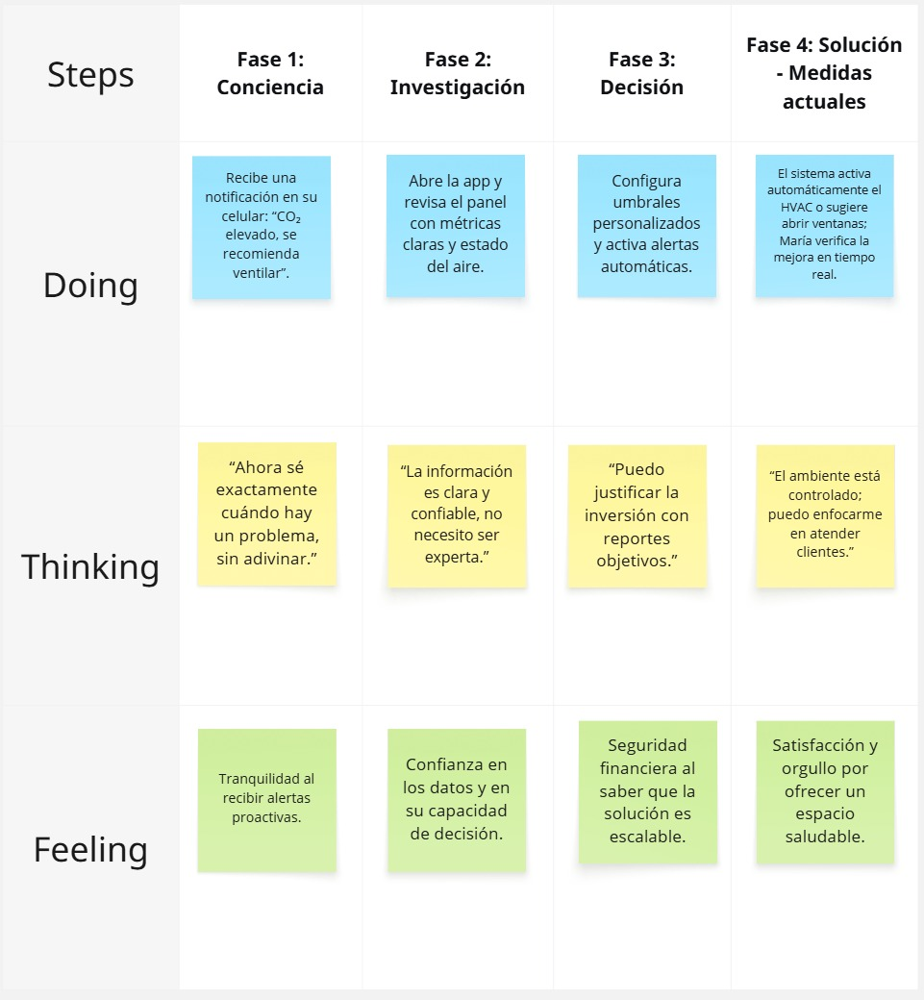
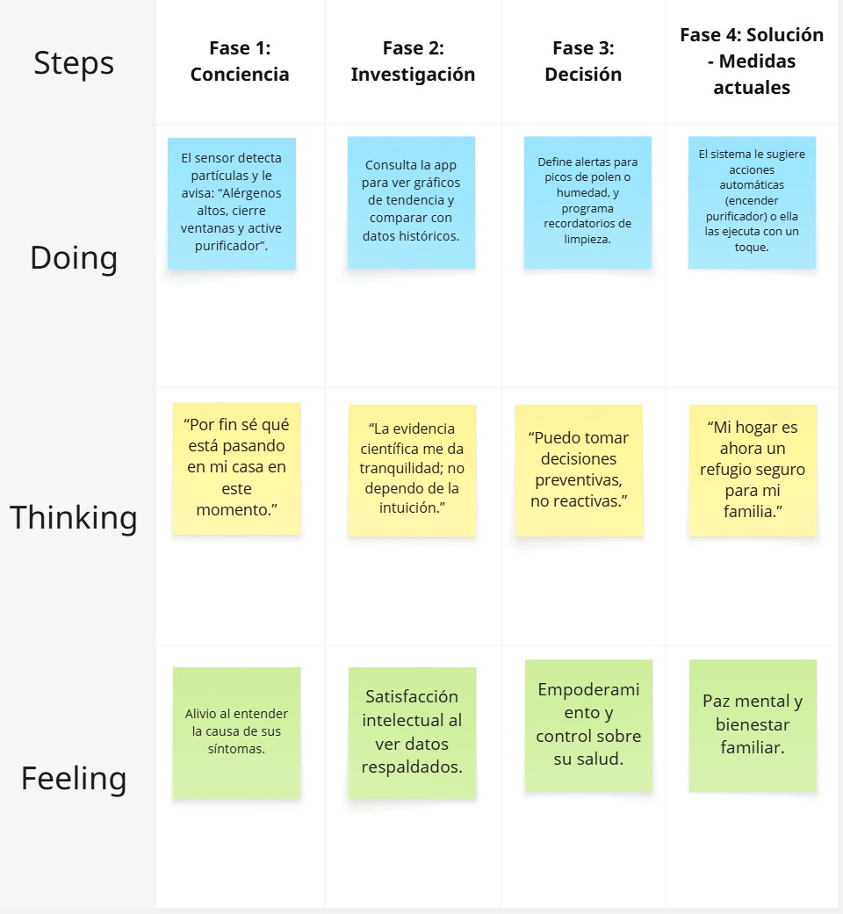
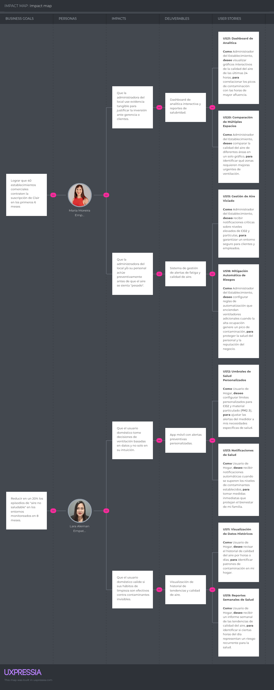

# Capítulo III: Requirements Specification

## 3.1. To-Be Scenario Mapping.

Los To-Be Scenario Maps ilustran la experiencia futura de cada User Persona al incorporar **Clair** en su rutina. Para su elaboración, el equipo tomó como base los As-Is Scenario Maps y realizó una lluvia de ideas individual sobre los cambios esperados en cada fase. Se identificaron mejoras en la toma de decisiones, la reducción de fricciones y el empoderamiento del usuario mediante datos objetivos, comparando cada etapa con el mapa As-Is para evidenciar el impacto de la solución.

  <h4>1. To-Be Scenario Mapping - María Moreira</h4>
  

 

  <h4>2. To-Be Scenario Mapping - Lara Alemán</h4>
  

## 3.2. User Stories.

### 3.2.1 Landing Page User Stories

Esta sección presenta las Épicas e Historias de Usuario esenciales identificadas para la landing page de Clair. Cada historia está estructurada para definir las necesidades informativas de los visitantes comerciales y potenciales clientes, detallando la propuesta de valor del dispositivo Clair Alpha, sus especificaciones técnicas de sensado sin pantallas molestas, la comparación clara entre planes de precios y el acceso a canales de soporte preventa, estableciendo una narrativa de marca confiable respaldada por el equipo fundador.

**Épicas**

<table style="border-collapse: collapse; width: 100%; font-family: Arial, sans-serif; font-size: 14px;">
  <thead>
    <tr>
      <th style="border: 1px solid #ccc; padding: 8px; background-color: #f2f2f2; text-align: left;">Epic / Story ID</th>
      <th style="border: 1px solid #ccc; padding: 8px; background-color: #f2f2f2; text-align: left;">Título</th>
      <th style="border: 1px solid #ccc; padding: 8px; background-color: #f2f2f2; text-align: left;">Descripción</th>
    </tr>
  </thead>
  <tbody>
    <tr>
      <td style="border: 1px solid #ccc; padding: 8px; vertical-align: top;">LP-EP-01</td>
      <td style="border: 1px solid #ccc; padding: 8px; vertical-align: top;">Gestión Informativa y Comercial de Clair Alpha</td>
      <td style="border: 1px solid #ccc; padding: 8px; vertical-align: top;">Como Visitante, quiero conocer la propuesta de valor, especificaciones técnicas, planes de suscripción y canales de contacto de Clair Alpha, para que cuando evalúe adquirir el servicio pueda tomar una decisión informada.</td>
    </tr>
  </tbody>
</table>

 

**Historias de Usuario**

<!-- ========== HISTORIA LP-US-01 ========== -->
<table style="border-collapse: collapse; width: 100%; font-family: Arial, sans-serif; font-size: 14px; margin-bottom: 20px;">
  <tr>
    <td style="border: 1px solid #ccc; padding: 8px; background-color: #f2f2f2; font-weight: bold; width: 15%;">Story ID</td>
    <td style="border: 1px solid #ccc; padding: 8px; background-color: #f2f2f2; font-weight: bold; width: 35%;">User</td>
    <td style="border: 1px solid #ccc; padding: 8px; background-color: #f2f2f2; font-weight: bold; width: 20%;">Priority</td>
    <td style="border: 1px solid #ccc; padding: 8px; background-color: #f2f2f2; font-weight: bold; width: 30%;">Epic</td>
  </tr>
  <tr>
    <td style="border: 1px solid #ccc; padding: 8px;">LP-US-01</td>
    <td style="border: 1px solid #ccc; padding: 8px;">Visitante</td>
    <td style="border: 1px solid #ccc; padding: 8px;">Alta</td>
    <td style="border: 1px solid #ccc; padding: 8px;">LP-EP-01</td>
  </tr>
  <tr>
    <td style="border: 1px solid #ccc; padding: 8px; background-color: #fafafa; font-weight: bold; width: 15%;">Title</td>
    <td style="border: 1px solid #ccc; padding: 8px; background-color: #fafafa;" colspan="3">Conocer la propuesta de valor y precio base</td>
  </tr>
  <tr>
    <td style="border: 1px solid #ccc; padding: 8px; background-color: #fafafa; font-weight: bold;" colspan="4">Description</td>
  </tr>
  <tr>
    <td style="border: 1px solid #ccc; padding: 8px;" colspan="4">Como Visitante, quiero conocer el nombre del dispositivo, su beneficio de sensado y su costo inicial, para que pueda comprender el propósito de Clair Alpha de inmediato.</td>
  </tr>
  <tr>
    <td style="border: 1px solid #ccc; padding: 8px; background-color: #fafafa; font-weight: bold;" colspan="4">Acceptance Criteria</td>
  </tr>
  <tr>
    <td style="border: 1px solid #ccc; padding: 8px;" colspan="4">
      <ul style="margin: 0; padding-left: 20px;">
        <li>Dado que el Visitante solicita la información de Clair Alpha, cuando el sistema responde, entonces el sistema muestra el nombre comercial del dispositivo, su beneficio de monitoreo ambiental y su precio base.</li>
      </ul>
    </td>
  </tr>
</table>

<!-- ========== HISTORIA LP-US-02 ========== -->
<table style="border-collapse: collapse; width: 100%; font-family: Arial, sans-serif; font-size: 14px; margin-bottom: 20px;">
  <tr>
    <td style="border: 1px solid #ccc; padding: 8px; background-color: #f2f2f2; font-weight: bold; width: 15%;">Story ID</td>
    <td style="border: 1px solid #ccc; padding: 8px; background-color: #f2f2f2; font-weight: bold; width: 35%;">User</td>
    <td style="border: 1px solid #ccc; padding: 8px; background-color: #f2f2f2; font-weight: bold; width: 20%;">Priority</td>
    <td style="border: 1px solid #ccc; padding: 8px; background-color: #f2f2f2; font-weight: bold; width: 30%;">Epic</td>
  </tr>
  <tr>
    <td style="border: 1px solid #ccc; padding: 8px;">LP-US-02</td>
    <td style="border: 1px solid #ccc; padding: 8px;">Visitante</td>
    <td style="border: 1px solid #ccc; padding: 8px;">Alta</td>
    <td style="border: 1px solid #ccc; padding: 8px;">LP-EP-01</td>
  </tr>
  <tr>
    <td style="border: 1px solid #ccc; padding: 8px; background-color: #fafafa; font-weight: bold; width: 15%;">Title</td>
    <td style="border: 1px solid #ccc; padding: 8px; background-color: #fafafa;" colspan="3">Evaluar las especificaciones del dispositivo y su diseño</td>
  </tr>
  <tr>
    <td style="border: 1px solid #ccc; padding: 8px; background-color: #fafafa; font-weight: bold;" colspan="4">Description</td>
  </tr>
  <tr>
    <td style="border: 1px solid #ccc; padding: 8px;" colspan="4">Como Visitante, quiero conocer el rendimiento de sensado y la ausencia de pantallas en el dispositivo, para que pueda evaluar su funcionalidad e integración estética en mi espacio.</td>
  </tr>
  <tr>
    <td style="border: 1px solid #ccc; padding: 8px; background-color: #fafafa; font-weight: bold;" colspan="4">Acceptance Criteria</td>
  </tr>
  <tr>
    <td style="border: 1px solid #ccc; padding: 8px;" colspan="4">
      <ul style="margin: 0; padding-left: 20px;">
        <li>Dado que el Visitante solicita las características de Clair Alpha, cuando el sistema responde, entonces el sistema detalla el método de detección de partículas, las variables de calidad del aire medidas y describe el concepto estético sin pantallas emisoras de luz tradicionales.</li>
      </ul>
    </td>
  </tr>
</table>

<!-- ========== HISTORIA LP-US-03 ========== -->
<table style="border-collapse: collapse; width: 100%; font-family: Arial, sans-serif; font-size: 14px; margin-bottom: 20px;">
  <tr>
    <td style="border: 1px solid #ccc; padding: 8px; background-color: #f2f2f2; font-weight: bold; width: 15%;">Story ID</td>
    <td style="border: 1px solid #ccc; padding: 8px; background-color: #f2f2f2; font-weight: bold; width: 35%;">User</td>
    <td style="border: 1px solid #ccc; padding: 8px; background-color: #f2f2f2; font-weight: bold; width: 20%;">Priority</td>
    <td style="border: 1px solid #ccc; padding: 8px; background-color: #f2f2f2; font-weight: bold; width: 30%;">Epic</td>
  </tr>
  <tr>
    <td style="border: 1px solid #ccc; padding: 8px;">LP-US-03</td>
    <td style="border: 1px solid #ccc; padding: 8px;">Visitante</td>
    <td style="border: 1px solid #ccc; padding: 8px;">Alta</td>
    <td style="border: 1px solid #ccc; padding: 8px;">LP-EP-01</td>
  </tr>
  <tr>
    <td style="border: 1px solid #ccc; padding: 8px; background-color: #fafafa; font-weight: bold; width: 15%;">Title</td>
    <td style="border: 1px solid #ccc; padding: 8px; background-color: #fafafa;" colspan="3">Comparar las opciones de precios y suscripciones</td>
  </tr>
  <tr>
    <td style="border: 1px solid #ccc; padding: 8px; background-color: #fafafa; font-weight: bold;" colspan="4">Description</td>
  </tr>
  <tr>
    <td style="border: 1px solid #ccc; padding: 8px;" colspan="4">Como Visitante, quiero comparar el costo de adquisición frente a los beneficios de los planes básico y multi-dispositivo, para que pueda elegir la opción que se ajuste a mi presupuesto y cantidad de sensores.</td>
  </tr>
  <tr>
    <td style="border: 1px solid #ccc; padding: 8px; background-color: #fafafa; font-weight: bold;" colspan="4">Acceptance Criteria</td>
  </tr>
  <tr>
    <td style="border: 1px solid #ccc; padding: 8px;" colspan="4">
      <ul style="margin: 0; padding-left: 20px;">
        <li>Dado que el Visitante solicita información de costos, cuando el sistema responde, entonces el sistema detalla el precio de la unidad física y los beneficios incluidos en el plan sin costo frente al plan de red de sensores (incluyendo cantidad de dispositivos admitidos y herramientas de análisis histórico).</li>
      </ul>
    </td>
  </tr>
</table>

<!-- ========== HISTORIA LP-US-04 ========== -->
<table style="border-collapse: collapse; width: 100%; font-family: Arial, sans-serif; font-size: 14px; margin-bottom: 20px;">
  <tr>
    <td style="border: 1px solid #ccc; padding: 8px; background-color: #f2f2f2; font-weight: bold; width: 15%;">Story ID</td>
    <td style="border: 1px solid #ccc; padding: 8px; background-color: #f2f2f2; font-weight: bold; width: 35%;">User</td>
    <td style="border: 1px solid #ccc; padding: 8px; background-color: #f2f2f2; font-weight: bold; width: 20%;">Priority</td>
    <td style="border: 1px solid #ccc; padding: 8px; background-color: #f2f2f2; font-weight: bold; width: 30%;">Epic</td>
  </tr>
  <tr>
    <td style="border: 1px solid #ccc; padding: 8px;">LP-US-04</td>
    <td style="border: 1px solid #ccc; padding: 8px;">Visitante</td>
    <td style="border: 1px solid #ccc; padding: 8px;">Alta</td>
    <td style="border: 1px solid #ccc; padding: 8px;">LP-EP-01</td>
  </tr>
  <tr>
    <td style="border: 1px solid #ccc; padding: 8px; background-color: #fafafa; font-weight: bold; width: 15%;">Title</td>
    <td style="border: 1px solid #ccc; padding: 8px; background-color: #fafafa;" colspan="3">Conocer la trayectoria y los profesionales detrás del proyecto</td>
  </tr>
  <tr>
    <td style="border: 1px solid #ccc; padding: 8px; background-color: #fafafa; font-weight: bold;" colspan="4">Description</td>
  </tr>
  <tr>
    <td style="border: 1px solid #ccc; padding: 8px;" colspan="4">Como Visitante, quiero conocer la misión de la marca y la experiencia del equipo de desarrollo, para que pueda confiar en la calidad del sensor.</td>
  </tr>
  <tr>
    <td style="border: 1px solid #ccc; padding: 8px; background-color: #fafafa; font-weight: bold;" colspan="4">Acceptance Criteria</td>
  </tr>
  <tr>
    <td style="border: 1px solid #ccc; padding: 8px;" colspan="4">
      <ul style="margin: 0; padding-left: 20px;">
        <li>Dado que el Visitante solicita la información corporativa de Clair, cuando el sistema responde, entonces el sistema presenta la visión de salud ambiental de la marca y describe las especialidades profesionales de los miembros del equipo fundador.</li>
      </ul>
    </td>
  </tr>
</table>

<!-- ========== HISTORIA LP-US-05 ========== -->
<table style="border-collapse: collapse; width: 100%; font-family: Arial, sans-serif; font-size: 14px; margin-bottom: 20px;">
  <tr>
    <td style="border: 1px solid #ccc; padding: 8px; background-color: #f2f2f2; font-weight: bold; width: 15%;">Story ID</td>
    <td style="border: 1px solid #ccc; padding: 8px; background-color: #f2f2f2; font-weight: bold; width: 35%;">User</td>
    <td style="border: 1px solid #ccc; padding: 8px; background-color: #f2f2f2; font-weight: bold; width: 20%;">Priority</td>
    <td style="border: 1px solid #ccc; padding: 8px; background-color: #f2f2f2; font-weight: bold; width: 30%;">Epic</td>
  </tr>
  <tr>
    <td style="border: 1px solid #ccc; padding: 8px;">LP-US-05</td>
    <td style="border: 1px solid #ccc; padding: 8px;">Visitante</td>
    <td style="border: 1px solid #ccc; padding: 8px;">Alta</td>
    <td style="border: 1px solid #ccc; padding: 8px;">LP-EP-01</td>
  </tr>
  <tr>
    <td style="border: 1px solid #ccc; padding: 8px; background-color: #fafafa; font-weight: bold; width: 15%;">Title</td>
    <td style="border: 1px solid #ccc; padding: 8px; background-color: #fafafa;" colspan="3">Obtener canales de atención comercial y horarios</td>
  </tr>
  <tr>
    <td style="border: 1px solid #ccc; padding: 8px; background-color: #fafafa; font-weight: bold;" colspan="4">Description</td>
  </tr>
  <tr>
    <td style="border: 1px solid #ccc; padding: 8px;" colspan="4">Como Visitante, quiero conocer los medios de contacto y disponibilidad del equipo de ventas, para que pueda planificar mis consultas preventa.</td>
  </tr>
  <tr>
    <td style="border: 1px solid #ccc; padding: 8px; background-color: #fafafa; font-weight: bold;" colspan="4">Acceptance Criteria</td>
  </tr>
  <tr>
    <td style="border: 1px solid #ccc; padding: 8px;" colspan="4">
      <ul style="margin: 0; padding-left: 20px;">
        <li>Dado que el Visitante requiere comunicarse con Clair, cuando el sistema responde, entonces el sistema detalla la dirección de correo electrónico disponible para consultas, el número telefónico y el huso horario junto con los días y horas laborables de disponibilidad del equipo comercial.</li>
      </ul>
    </td>
  </tr>
</table>

### 3.2.2 Web Application User Stories

Esta sección detalla las Épicas e Historias de Usuario correspondientes a la aplicación web (frontend) de la plataforma Clair. Se abordan los flujos clave de usuario para la gestión de identidad y seguridad de sesión con Google SSO, el control administrativo de organizaciones, espacios y red de sensores (incluyendo comandos remotos y configuración de umbrales), la visualización y paginación de alertas críticas, el análisis gráfico de tendencias con variaciones porcentuales (delta) y la suscripción y facturación del plan Mesh Network Premium integrado con Stripe.

**Épicas**

<table style="border-collapse: collapse; width: 100%; font-family: Arial, sans-serif; font-size: 14px;">
  <thead>
    <tr>
      <th style="border: 1px solid #ccc; padding: 8px; background-color: #f2f2f2; text-align: left;">Epic / Story ID</th>
      <th style="border: 1px solid #ccc; padding: 8px; background-color: #f2f2f2; text-align: left;">Título</th>
      <th style="border: 1px solid #ccc; padding: 8px; background-color: #f2f2f2; text-align: left;">Descripción</th>
    </tr>
  </thead>
  <tbody>
    <tr>
      <td style="border: 1px solid #ccc; padding: 8px; vertical-align: top;">WA-EP-01</td>
      <td style="border: 1px solid #ccc; padding: 8px; vertical-align: top;">Gestión de Identidad, Acceso y Seguridad de Sesión</td>
      <td style="border: 1px solid #ccc; padding: 8px; vertical-align: top;">Como Visitante o Usuario, quiero registrar una cuenta, verificar mi dirección de correo electrónico, iniciar sesión mediante credenciales o Google SSO, y contar con protección de rutas y refresco de tokens, para que cuando acceda a la plataforma tenga el acceso controlado y la privacidad de mis datos garantizados.</td>
    </tr>
    <tr>
      <td style="border: 1px solid #ccc; padding: 8px; vertical-align: top;">WA-EP-02</td>
      <td style="border: 1px solid #ccc; padding: 8px; vertical-align: top;">Gestión de Organizaciones, Espacios, Dispositivos, Controles y Umbrales</td>
      <td style="border: 1px solid #ccc; padding: 8px; vertical-align: top;">Como Usuario, quiero crear y administrar mis organizaciones y espacios, registrar dispositivos físicos asignándolos a mis zonas, monitorear su estado y telemetría en tiempo real, enviarles comandos de control remoto (standby, wake, restart), y configurar límites de umbrales para las variables del aire, para que cuando gestione mi red de sensores pueda administrarla y supervisarla de forma integral.</td>
    </tr> 
    <tr>
      <td style="border: 1px solid #ccc; padding: 8px; vertical-align: top;">WA-EP-03</td>
      <td style="border: 1px solid #ccc; padding: 8px; vertical-align: top;">Visualización, Seguimiento e Historial de Alertas</td>
      <td style="border: 1px solid #ccc; padding: 8px; vertical-align: top;">Como Usuario, quiero consultar las alertas activas e inactivas de mis dispositivos con su nivel de gravedad, paginar los listados e identificar los volúmenes de alertas diarias históricas, para que cuando se produzca una anomalía pueda responder oportunamente y evaluar incidentes pasados de calidad del aire.</td>
    </tr>
    <tr>
      <td style="border: 1px solid #ccc; padding: 8px; vertical-align: top;">WA-EP-04</td>
      <td style="border: 1px solid #ccc; padding: 8px; vertical-align: top;">Consulta de Consolidado, Métricas y Tendencias Históricas</td>
      <td style="border: 1px solid #ccc; padding: 8px; vertical-align: top;">Como Usuario, quiero consultar el resumen general del sistema, las métricas actuales del dispositivo y su variación porcentual delta, la serie de datos históricos filtrada por métrica y periodo, la última telemetría reportada, y navegar jerárquicamente por organizaciones, espacios y sensores, para que cuando analice la calidad del aire pueda evaluar tendencias y la escala de mi red de dispositivos.</td>
    </tr>
    <tr>
      <td style="border: 1px solid #ccc; padding: 8px; vertical-align: top;">WA-EP-05</td>
      <td style="border: 1px solid #ccc; padding: 8px; vertical-align: top;">Selección de Planes, Suscripción y Facturación</td>
      <td style="border: 1px solid #ccc; padding: 8px; vertical-align: top;">Como Usuario, quiero comparar los planes de precios disponibles, iniciar y completar el pago de la suscripción Premium a través de Stripe con el consentimiento de autorenovación, y consultar mi estado de suscripción activo, para que cuando requiera funciones avanzadas de monitoreo pueda acceder a ellas de forma flexible.</td>
    </tr>
  </tbody>
</table>

**Historias de Usuario**

<!-- ====== HISTORIA WA-US-01 ====== -->
<table style="border-collapse: collapse; width: 100%; font-family: Arial, sans-serif; font-size: 14px; margin-bottom: 20px;">
  <tr>
    <td style="border: 1px solid #ccc; padding: 8px; background-color: #f2f2f2; font-weight: bold; width: 15%;">Story ID</td>
    <td style="border: 1px solid #ccc; padding: 8px; background-color: #f2f2f2; font-weight: bold; width: 35%;">User</td>
    <td style="border: 1px solid #ccc; padding: 8px; background-color: #f2f2f2; font-weight: bold; width: 20%;">Priority</td>
    <td style="border: 1px solid #ccc; padding: 8px; background-color: #f2f2f2; font-weight: bold; width: 30%;">Epic</td>
  </tr>
  <tr>
    <td style="border: 1px solid #ccc; padding: 8px;">WA-US-01</td>
    <td style="border: 1px solid #ccc; padding: 8px;">Visitante</td>
    <td style="border: 1px solid #ccc; padding: 8px;">Alta</td>
    <td style="border: 1px solid #ccc; padding: 8px;">WA-EP-01</td>
  </tr>
  <tr>
    <td style="border: 1px solid #ccc; padding: 8px; background-color: #fafafa; font-weight: bold; width: 15%;">Title</td>
    <td style="border: 1px solid #ccc; padding: 8px; background-color: #fafafa;" colspan="3">Registro con Correo y Contraseña</td>
  </tr>
  <tr>
    <td style="border: 1px solid #ccc; padding: 8px; background-color: #fafafa; font-weight: bold;" colspan="4">Description</td>
  </tr>
  <tr>
    <td style="border: 1px solid #ccc; padding: 8px;" colspan="4">Como Visitante, quiero registrar una cuenta nueva proporcionando mi correo electrónico y una contraseña, para iniciar mi registro en la plataforma.</td>
  </tr>
  <tr>
    <td style="border: 1px solid #ccc; padding: 8px; background-color: #fafafa; font-weight: bold;" colspan="4">Acceptance Criteria</td>
  </tr>
  <tr>
    <td style="border: 1px solid #ccc; padding: 8px;" colspan="4">
      <ul style="margin: 0; padding-left: 20px;">
        <li>Dado que el Visitante no está registrado, cuando proporciona un correo electrónico válido y no registrado previamente, una contraseña de al menos 8 caracteres, acepta los términos de servicio y solicita el registro, entonces el sistema inicia el proceso y genera una sesión de verificación.</li>
        <li>Dado que el correo tiene un formato incorrecto o la contraseña es de menos de 8 caracteres, cuando intenta registrarse, entonces el sistema rechaza la solicitud e indica el motivo del fallo.</li>
        <li>Dado que no se aceptan los términos de servicio, cuando se intenta registrar, entonces el sistema bloquea el registro.</li>
      </ul>
    </td>
  </tr>
</table>

<!-- ====== HISTORIA WA-US-02 ====== -->
<table style="border-collapse: collapse; width: 100%; font-family: Arial, sans-serif; font-size: 14px; margin-bottom: 20px;">
  <tr>
    <td style="border: 1px solid #ccc; padding: 8px; background-color: #f2f2f2; font-weight: bold; width: 15%;">Story ID</td>
    <td style="border: 1px solid #ccc; padding: 8px; background-color: #f2f2f2; font-weight: bold; width: 35%;">User</td>
    <td style="border: 1px solid #ccc; padding: 8px; background-color: #f2f2f2; font-weight: bold; width: 20%;">Priority</td>
    <td style="border: 1px solid #ccc; padding: 8px; background-color: #f2f2f2; font-weight: bold; width: 30%;">Epic</td>
  </tr>
  <tr>
    <td style="border: 1px solid #ccc; padding: 8px;">WA-US-02</td>
    <td style="border: 1px solid #ccc; padding: 8px;">Visitante</td>
    <td style="border: 1px solid #ccc; padding: 8px;">Alta</td>
    <td style="border: 1px solid #ccc; padding: 8px;">WA-EP-01</td>
  </tr>
  <tr>
    <td style="border: 1px solid #ccc; padding: 8px; background-color: #fafafa; font-weight: bold; width: 15%;">Title</td>
    <td style="border: 1px solid #ccc; padding: 8px; background-color: #fafafa;" colspan="3">Verificación de Cuenta</td>
  </tr>
  <tr>
    <td style="border: 1px solid #ccc; padding: 8px; background-color: #fafafa; font-weight: bold;" colspan="4">Description</td>
  </tr>
  <tr>
    <td style="border: 1px solid #ccc; padding: 8px;" colspan="4">Como Visitante, quiero introducir el código enviado a mi correo electrónico, para confirmar mi dirección y activar mi cuenta.</td>
  </tr>
  <tr>
    <td style="border: 1px solid #ccc; padding: 8px; background-color: #fafafa; font-weight: bold;" colspan="4">Acceptance Criteria</td>
  </tr>
  <tr>
    <td style="border: 1px solid #ccc; padding: 8px;" colspan="4">
      <ul style="margin: 0; padding-left: 20px;">
        <li>Dado que el Visitante ha completado el formulario de registro, cuando introduce el código de verificación de 8 caracteres (formato XXXX-XXXX) y solicita la confirmación, entonces el sistema valida el código, activa la cuenta y le permite proceder al inicio de sesión.</li>
        <li>Dado que el identificador de sesión de registro no existe o es inválido, cuando se intenta confirmar, entonces el sistema notifica que la sesión no es válida.</li>
        <li>Dado que el código introducido es incorrecto o ha expirado, cuando se solicita la confirmación, entonces el sistema indica el error y le permite reintentarlo.</li>
      </ul>
    </td>
  </tr>
</table>

<!-- ====== HISTORIA WA-US-03 ====== -->
<table style="border-collapse: collapse; width: 100%; font-family: Arial, sans-serif; font-size: 14px; margin-bottom: 20px;">
  <tr>
    <td style="border: 1px solid #ccc; padding: 8px; background-color: #f2f2f2; font-weight: bold; width: 15%;">Story ID</td>
    <td style="border: 1px solid #ccc; padding: 8px; background-color: #f2f2f2; font-weight: bold; width: 35%;">User</td>
    <td style="border: 1px solid #ccc; padding: 8px; background-color: #f2f2f2; font-weight: bold; width: 20%;">Priority</td>
    <td style="border: 1px solid #ccc; padding: 8px; background-color: #f2f2f2; font-weight: bold; width: 30%;">Epic</td>
  </tr>
  <tr>
    <td style="border: 1px solid #ccc; padding: 8px;">WA-US-03</td>
    <td style="border: 1px solid #ccc; padding: 8px;">Visitante</td>
    <td style="border: 1px solid #ccc; padding: 8px;">Alta</td>
    <td style="border: 1px solid #ccc; padding: 8px;">WA-EP-01</td>
  </tr>
  <tr>
    <td style="border: 1px solid #ccc; padding: 8px; background-color: #fafafa; font-weight: bold; width: 15%;">Title</td>
    <td style="border: 1px solid #ccc; padding: 8px; background-color: #fafafa;" colspan="3">Inicio de Sesión con Credenciales</td>
  </tr>
  <tr>
    <td style="border: 1px solid #ccc; padding: 8px; background-color: #fafafa; font-weight: bold;" colspan="4">Description</td>
  </tr>
  <tr>
    <td style="border: 1px solid #ccc; padding: 8px;" colspan="4">Como Visitante, quiero iniciar sesión con mi correo electrónico y contraseña, para acceder a la plataforma como Usuario.</td>
  </tr>
  <tr>
    <td style="border: 1px solid #ccc; padding: 8px; background-color: #fafafa; font-weight: bold;" colspan="4">Acceptance Criteria</td>
  </tr>
  <tr>
    <td style="border: 1px solid #ccc; padding: 8px;" colspan="4">
      <ul style="margin: 0; padding-left: 20px;">
        <li>Dado que el Visitante desea acceder a su cuenta, cuando proporciona su correo electrónico registrado, la contraseña correcta y solicita el ingreso, entonces el sistema autentica las credenciales, almacena la sesión y le permite el acceso a las funciones del panel de control general.</li>
        <li>Dado que el correo o la contraseña son incorrectos, cuando intenta iniciar sesión, entonces el sistema indica que las credenciales no son válidas.</li>
        <li>Dado que los servicios de autenticación no responden, cuando intenta iniciar sesión, entonces el sistema indica la falla de comunicación.</li>
      </ul>
    </td>
  </tr>
</table>

<!-- ====== HISTORIA WA-US-04 ====== -->
<table style="border-collapse: collapse; width: 100%; font-family: Arial, sans-serif; font-size: 14px; margin-bottom: 20px;">
  <tr>
    <td style="border: 1px solid #ccc; padding: 8px; background-color: #f2f2f2; font-weight: bold; width: 15%;">Story ID</td>
    <td style="border: 1px solid #ccc; padding: 8px; background-color: #f2f2f2; font-weight: bold; width: 35%;">User</td>
    <td style="border: 1px solid #ccc; padding: 8px; background-color: #f2f2f2; font-weight: bold; width: 20%;">Priority</td>
    <td style="border: 1px solid #ccc; padding: 8px; background-color: #f2f2f2; font-weight: bold; width: 30%;">Epic</td>
  </tr>
  <tr>
    <td style="border: 1px solid #ccc; padding: 8px;">WA-US-04</td>
    <td style="border: 1px solid #ccc; padding: 8px;">Visitante o Usuario</td>
    <td style="border: 1px solid #ccc; padding: 8px;">Alta</td>
    <td style="border: 1px solid #ccc; padding: 8px;">WA-EP-01</td>
  </tr>
  <tr>
    <td style="border: 1px solid #ccc; padding: 8px; background-color: #fafafa; font-weight: bold; width: 15%;">Title</td>
    <td style="border: 1px solid #ccc; padding: 8px; background-color: #fafafa;" colspan="3">Alternar Visibilidad de Contraseña</td>
  </tr>
  <tr>
    <td style="border: 1px solid #ccc; padding: 8px; background-color: #fafafa; font-weight: bold;" colspan="4">Description</td>
  </tr>
  <tr>
    <td style="border: 1px solid #ccc; padding: 8px;" colspan="4">Como Visitante o Usuario, quiero poder visualizar u ocultar los caracteres de mi contraseña al escribirla, para verificar que es correcta.</td>
  </tr>
  <tr>
    <td style="border: 1px solid #ccc; padding: 8px; background-color: #fafafa; font-weight: bold;" colspan="4">Acceptance Criteria</td>
  </tr>
  <tr>
    <td style="border: 1px solid #ccc; padding: 8px;" colspan="4">
      <ul style="margin: 0; padding-left: 20px;">
        <li>Dado que el Visitante o Usuario está introduciendo su contraseña, cuando solicita mostrar la contraseña, entonces el sistema revela los caracteres de forma legible.</li>
        <li>Dado que la contraseña es legible, cuando solicita ocultarla, entonces el sistema enmascara nuevamente los caracteres.</li>
      </ul>
    </td>
  </tr>
</table>

<!-- ====== HISTORIA WA-US-05 ====== -->
<table style="border-collapse: collapse; width: 100%; font-family: Arial, sans-serif; font-size: 14px; margin-bottom: 20px;">
  <tr>
    <td style="border: 1px solid #ccc; padding: 8px; background-color: #f2f2f2; font-weight: bold; width: 15%;">Story ID</td>
    <td style="border: 1px solid #ccc; padding: 8px; background-color: #f2f2f2; font-weight: bold; width: 35%;">User</td>
    <td style="border: 1px solid #ccc; padding: 8px; background-color: #f2f2f2; font-weight: bold; width: 20%;">Priority</td>
    <td style="border: 1px solid #ccc; padding: 8px; background-color: #f2f2f2; font-weight: bold; width: 30%;">Epic</td>
  </tr>
  <tr>
    <td style="border: 1px solid #ccc; padding: 8px;">WA-US-05</td>
    <td style="border: 1px solid #ccc; padding: 8px;">Visitante</td>
    <td style="border: 1px solid #ccc; padding: 8px;">Alta</td>
    <td style="border: 1px solid #ccc; padding: 8px;">WA-EP-01</td>
  </tr>
  <tr>
    <td style="border: 1px solid #ccc; padding: 8px; background-color: #fafafa; font-weight: bold; width: 15%;">Title</td>
    <td style="border: 1px solid #ccc; padding: 8px; background-color: #fafafa;" colspan="3">Autenticación con Google (SSO)</td>
  </tr>
  <tr>
    <td style="border: 1px solid #ccc; padding: 8px; background-color: #fafafa; font-weight: bold;" colspan="4">Description</td>
  </tr>
  <tr>
    <td style="border: 1px solid #ccc; padding: 8px;" colspan="4">Como Visitante, quiero iniciar sesión o registrarme usando mi cuenta de Google, para acceder a la plataforma de forma rápida.</td>
  </tr>
  <tr>
    <td style="border: 1px solid #ccc; padding: 8px; background-color: #fafafa; font-weight: bold;" colspan="4">Acceptance Criteria</td>
  </tr>
  <tr>
    <td style="border: 1px solid #ccc; padding: 8px;" colspan="4">
      <ul style="margin: 0; padding-left: 20px;">
        <li>Dado que el Visitante desea acceder mediante su cuenta externa, cuando selecciona la opción de autenticarse con Google, entonces el sistema delega la verificación al proveedor externo.</li>
        <li>Dado que el proveedor valida la identidad con éxito, cuando el flujo retorna a la plataforma, entonces el sistema asocia la cuenta, inicia la sesión y le permite el acceso al panel de control general.</li>
        <li>Dado que la autenticación externa falla o es cancelada, cuando el flujo retorna a la plataforma, entonces el sistema indica el error y le permite reintentar el ingreso.</li>
      </ul>
    </td>
  </tr>
</table>

<!-- ====== HISTORIA WA-US-06 ====== -->
<table style="border-collapse: collapse; width: 100%; font-family: Arial, sans-serif; font-size: 14px; margin-bottom: 20px;">
  <tr>
    <td style="border: 1px solid #ccc; padding: 8px; background-color: #f2f2f2; font-weight: bold; width: 15%;">Story ID</td>
    <td style="border: 1px solid #ccc; padding: 8px; background-color: #f2f2f2; font-weight: bold; width: 35%;">User</td>
    <td style="border: 1px solid #ccc; padding: 8px; background-color: #f2f2f2; font-weight: bold; width: 20%;">Priority</td>
    <td style="border: 1px solid #ccc; padding: 8px; background-color: #f2f2f2; font-weight: bold; width: 30%;">Epic</td>
  </tr>
  <tr>
    <td style="border: 1px solid #ccc; padding: 8px;">WA-US-06</td>
    <td style="border: 1px solid #ccc; padding: 8px;">Usuario</td>
    <td style="border: 1px solid #ccc; padding: 8px;">Alta</td>
    <td style="border: 1px solid #ccc; padding: 8px;">WA-EP-01</td>
  </tr>
  <tr>
    <td style="border: 1px solid #ccc; padding: 8px; background-color: #fafafa; font-weight: bold; width: 15%;">Title</td>
    <td style="border: 1px solid #ccc; padding: 8px; background-color: #fafafa;" colspan="3">Renovación Automática de Sesión</td>
  </tr>
  <tr>
    <td style="border: 1px solid #ccc; padding: 8px; background-color: #fafafa; font-weight: bold;" colspan="4">Description</td>
  </tr>
  <tr>
    <td style="border: 1px solid #ccc; padding: 8px;" colspan="4">Como Usuario, quiero que mi sesión se renueve de forma automática antes de expirar, para poder continuar con mis actividades sin interrupciones.</td>
  </tr>
  <tr>
    <td style="border: 1px solid #ccc; padding: 8px; background-color: #fafafa; font-weight: bold;" colspan="4">Acceptance Criteria</td>
  </tr>
  <tr>
    <td style="border: 1px solid #ccc; padding: 8px;" colspan="4">
      <ul style="margin: 0; padding-left: 20px;">
        <li>Dado que el Usuario tiene una sesión activa y realiza una petición de datos a la plataforma, cuando el tiempo de expiración de la sesión está próximo, entonces el sistema renueva el acceso de forma transparente en segundo plano.</li>
        <li>Dado que la sesión ha expirado por completo o las credenciales no son válidas, cuando el sistema intenta renovar la sesión, entonces invalida el acceso local, cierra la sesión del usuario y le requiere autenticarse de nuevo.</li>
      </ul>
    </td>
  </tr>
</table>

<!-- ====== HISTORIA WA-US-07 ====== -->
<table style="border-collapse: collapse; width: 100%; font-family: Arial, sans-serif; font-size: 14px; margin-bottom: 20px;">
  <tr>
    <td style="border: 1px solid #ccc; padding: 8px; background-color: #f2f2f2; font-weight: bold; width: 15%;">Story ID</td>
    <td style="border: 1px solid #ccc; padding: 8px; background-color: #f2f2f2; font-weight: bold; width: 35%;">User</td>
    <td style="border: 1px solid #ccc; padding: 8px; background-color: #f2f2f2; font-weight: bold; width: 20%;">Priority</td>
    <td style="border: 1px solid #ccc; padding: 8px; background-color: #f2f2f2; font-weight: bold; width: 30%;">Epic</td>
  </tr>
  <tr>
    <td style="border: 1px solid #ccc; padding: 8px;">WA-US-07</td>
    <td style="border: 1px solid #ccc; padding: 8px;">Usuario</td>
    <td style="border: 1px solid #ccc; padding: 8px;">Alta</td>
    <td style="border: 1px solid #ccc; padding: 8px;">WA-EP-01</td>
  </tr>
  <tr>
    <td style="border: 1px solid #ccc; padding: 8px; background-color: #fafafa; font-weight: bold; width: 15%;">Title</td>
    <td style="border: 1px solid #ccc; padding: 8px; background-color: #fafafa;" colspan="3">Restricción de Acceso a Secciones Privadas</td>
  </tr>
  <tr>
    <td style="border: 1px solid #ccc; padding: 8px; background-color: #fafafa; font-weight: bold;" colspan="4">Description</td>
  </tr>
  <tr>
    <td style="border: 1px solid #ccc; padding: 8px;" colspan="4">Como Usuario, quiero que las secciones de la plataforma estén protegidas contra accesos no autorizados, para asegurar que nadie pueda ver mi información sin iniciar sesión.</td>
  </tr>
  <tr>
    <td style="border: 1px solid #ccc; padding: 8px; background-color: #fafafa; font-weight: bold;" colspan="4">Acceptance Criteria</td>
  </tr>
  <tr>
    <td style="border: 1px solid #ccc; padding: 8px;" colspan="4">
      <ul style="margin: 0; padding-left: 20px;">
        <li>Dado que un visitante intenta acceder directamente a recursos de paneles de control, dispositivos, alertas, analíticas o facturación, cuando el sistema evalúa la solicitud, entonces se deniega el acceso y se le redirige al inicio de sesión.</li>
        <li>Dado que el Usuario está autenticado, cuando accede a estas secciones, entonces se le permite la visualización y uso de las mismas.</li>
      </ul>
    </td>
  </tr>
</table>

<!-- ====== HISTORIA WA-US-08 ====== -->
<table style="border-collapse: collapse; width: 100%; font-family: Arial, sans-serif; font-size: 14px; margin-bottom: 20px;">
  <tr>
    <td style="border: 1px solid #ccc; padding: 8px; background-color: #f2f2f2; font-weight: bold; width: 15%;">Story ID</td>
    <td style="border: 1px solid #ccc; padding: 8px; background-color: #f2f2f2; font-weight: bold; width: 35%;">User</td>
    <td style="border: 1px solid #ccc; padding: 8px; background-color: #f2f2f2; font-weight: bold; width: 20%;">Priority</td>
    <td style="border: 1px solid #ccc; padding: 8px; background-color: #f2f2f2; font-weight: bold; width: 30%;">Epic</td>
  </tr>
  <tr>
    <td style="border: 1px solid #ccc; padding: 8px;">WA-US-08</td>
    <td style="border: 1px solid #ccc; padding: 8px;">Usuario</td>
    <td style="border: 1px solid #ccc; padding: 8px;">Alta</td>
    <td style="border: 1px solid #ccc; padding: 8px;">WA-EP-01</td>
  </tr>
  <tr>
    <td style="border: 1px solid #ccc; padding: 8px; background-color: #fafafa; font-weight: bold; width: 15%;">Title</td>
    <td style="border: 1px solid #ccc; padding: 8px; background-color: #fafafa;" colspan="3">Cierre de Sesión Seguro</td>
  </tr>
  <tr>
    <td style="border: 1px solid #ccc; padding: 8px; background-color: #fafafa; font-weight: bold;" colspan="4">Description</td>
  </tr>
  <tr>
    <td style="border: 1px solid #ccc; padding: 8px;" colspan="4">Como Usuario, quiero cerrar mi sesión activa, para asegurar que mis datos queden protegidos al dejar de usar la plataforma.</td>
  </tr>
  <tr>
    <td style="border: 1px solid #ccc; padding: 8px; background-color: #fafafa; font-weight: bold;" colspan="4">Acceptance Criteria</td>
  </tr>
  <tr>
    <td style="border: 1px solid #ccc; padding: 8px;" colspan="4">
      <ul style="margin: 0; padding-left: 20px;">
        <li>Dado que el Usuario desea salir del sistema, cuando solicita cerrar sesión, entonces el sistema invalida la sesión en el servidor, elimina los datos de acceso local y le redirige a la sección de inicio de sesión.</li>
        <li>Dado que ocurre un error de comunicación con el servidor al cerrar sesión, cuando el Usuario solicita la salida, entonces el sistema limpia la sesión de forma local y le redirige a la sección de inicio de sesión.</li>
      </ul>
    </td>
  </tr>
</table>

<!-- ====== HISTORIA WA-US-09 ====== -->
<table style="border-collapse: collapse; width: 100%; font-family: Arial, sans-serif; font-size: 14px; margin-bottom: 20px;">
  <tr>
    <td style="border: 1px solid #ccc; padding: 8px; background-color: #f2f2f2; font-weight: bold; width: 15%;">Story ID</td>
    <td style="border: 1px solid #ccc; padding: 8px; background-color: #f2f2f2; font-weight: bold; width: 35%;">User</td>
    <td style="border: 1px solid #ccc; padding: 8px; background-color: #f2f2f2; font-weight: bold; width: 20%;">Priority</td>
    <td style="border: 1px solid #ccc; padding: 8px; background-color: #f2f2f2; font-weight: bold; width: 30%;">Epic</td>
  </tr>
  <tr>
    <td style="border: 1px solid #ccc; padding: 8px;">WA-US-09</td>
    <td style="border: 1px solid #ccc; padding: 8px;">Usuario</td>
    <td style="border: 1px solid #ccc; padding: 8px;">Alta</td>
    <td style="border: 1px solid #ccc; padding: 8px;">WA-EP-02</td>
  </tr>
  <tr>
    <td style="border: 1px solid #ccc; padding: 8px; background-color: #fafafa; font-weight: bold; width: 15%;">Title</td>
    <td style="border: 1px solid #ccc; padding: 8px; background-color: #fafafa;" colspan="3">Crear Organización</td>
  </tr>
  <tr>
    <td style="border: 1px solid #ccc; padding: 8px; background-color: #fafafa; font-weight: bold;" colspan="4">Description</td>
  </tr>
  <tr>
    <td style="border: 1px solid #ccc; padding: 8px;" colspan="4">Como Usuario, quiero crear una organización nueva proporcionando un nombre, para agrupar mis espacios y dispositivos bajo una entidad.</td>
  </tr>
  <tr>
    <td style="border: 1px solid #ccc; padding: 8px; background-color: #fafafa; font-weight: bold;" colspan="4">Acceptance Criteria</td>
  </tr>
  <tr>
    <td style="border: 1px solid #ccc; padding: 8px;" colspan="4">
      <ul style="margin: 0; padding-left: 20px;">
        <li>Dado que el Usuario es propietario de una cuenta, cuando proporciona un nombre de organización válido y solicita su creación, entonces el sistema registra la organización y la asocia a su cuenta asignando un identificador único y una fecha de registro.</li>
        <li>Dado que el Usuario proporciona un nombre vacío o inválido, cuando solicita la creación, entonces el sistema rechaza la operación e indica que el nombre es obligatorio.</li>
      </ul>
    </td>
  </tr>
</table>

<!-- ====== HISTORIA WA-US-10 ====== -->
<table style="border-collapse: collapse; width: 100%; font-family: Arial, sans-serif; font-size: 14px; margin-bottom: 20px;">
  <tr>
    <td style="border: 1px solid #ccc; padding: 8px; background-color: #f2f2f2; font-weight: bold; width: 15%;">Story ID</td>
    <td style="border: 1px solid #ccc; padding: 8px; background-color: #f2f2f2; font-weight: bold; width: 35%;">User</td>
    <td style="border: 1px solid #ccc; padding: 8px; background-color: #f2f2f2; font-weight: bold; width: 20%;">Priority</td>
    <td style="border: 1px solid #ccc; padding: 8px; background-color: #f2f2f2; font-weight: bold; width: 30%;">Epic</td>
  </tr>
  <tr>
    <td style="border: 1px solid #ccc; padding: 8px;">WA-US-10</td>
    <td style="border: 1px solid #ccc; padding: 8px;">Usuario</td>
    <td style="border: 1px solid #ccc; padding: 8px;">Alta</td>
    <td style="border: 1px solid #ccc; padding: 8px;">WA-EP-02</td>
  </tr>
  <tr>
    <td style="border: 1px solid #ccc; padding: 8px; background-color: #fafafa; font-weight: bold; width: 15%;">Title</td>
    <td style="border: 1px solid #ccc; padding: 8px; background-color: #fafafa;" colspan="3">Renombrar Organización</td>
  </tr>
  <tr>
    <td style="border: 1px solid #ccc; padding: 8px; background-color: #fafafa; font-weight: bold;" colspan="4">Description</td>
  </tr>
  <tr>
    <td style="border: 1px solid #ccc; padding: 8px;" colspan="4">Como Usuario, quiero actualizar el nombre de una de mis organizaciones, para mantener precisa la información de mi cuenta.</td>
  </tr>
  <tr>
    <td style="border: 1px solid #ccc; padding: 8px; background-color: #fafafa; font-weight: bold;" colspan="4">Acceptance Criteria</td>
  </tr>
  <tr>
    <td style="border: 1px solid #ccc; padding: 8px;" colspan="4">
      <ul style="margin: 0; padding-left: 20px;">
        <li>Dado que el Usuario es propietario de la organización, cuando proporciona un nuevo nombre válido para la organización seleccionada y solicita el cambio, entonces el sistema actualiza el nombre en los registros y registra la fecha de modificación.</li>
        <li>Dado que proporciona un nombre vacío, cuando solicita el cambio, entonces el sistema rechaza la modificación.</li>
      </ul>
    </td>
  </tr>
</table>

<!-- ====== HISTORIA WA-US-11 ====== -->
<table style="border-collapse: collapse; width: 100%; font-family: Arial, sans-serif; font-size: 14px; margin-bottom: 20px;">
  <tr>
    <td style="border: 1px solid #ccc; padding: 8px; background-color: #f2f2f2; font-weight: bold; width: 15%;">Story ID</td>
    <td style="border: 1px solid #ccc; padding: 8px; background-color: #f2f2f2; font-weight: bold; width: 35%;">User</td>
    <td style="border: 1px solid #ccc; padding: 8px; background-color: #f2f2f2; font-weight: bold; width: 20%;">Priority</td>
    <td style="border: 1px solid #ccc; padding: 8px; background-color: #f2f2f2; font-weight: bold; width: 30%;">Epic</td>
  </tr>
  <tr>
    <td style="border: 1px solid #ccc; padding: 8px;">WA-US-11</td>
    <td style="border: 1px solid #ccc; padding: 8px;">Usuario</td>
    <td style="border: 1px solid #ccc; padding: 8px;">Alta</td>
    <td style="border: 1px solid #ccc; padding: 8px;">WA-EP-02</td>
  </tr>
  <tr>
    <td style="border: 1px solid #ccc; padding: 8px; background-color: #fafafa; font-weight: bold; width: 15%;">Title</td>
    <td style="border: 1px solid #ccc; padding: 8px; background-color: #fafafa;" colspan="3">Eliminar Organización</td>
  </tr>
  <tr>
    <td style="border: 1px solid #ccc; padding: 8px; background-color: #fafafa; font-weight: bold;" colspan="4">Description</td>
  </tr>
  <tr>
    <td style="border: 1px solid #ccc; padding: 8px;" colspan="4">Como Usuario, quiero eliminar una organización de mi cuenta, para quitar las agrupaciones que ya no son necesarias.</td>
  </tr>
  <tr>
    <td style="border: 1px solid #ccc; padding: 8px; background-color: #fafafa; font-weight: bold;" colspan="4">Acceptance Criteria</td>
  </tr>
  <tr>
    <td style="border: 1px solid #ccc; padding: 8px;" colspan="4">
      <ul style="margin: 0; padding-left: 20px;">
        <li>Dado que el Usuario es propietario de la organización y esta no contiene espacios físicos en su interior, cuando solicita eliminar la organización, entonces el sistema borra de forma permanente el registro.</li>
        <li>Dado que la organización contiene espacios físicos, cuando el Usuario solicita su eliminación, entonces el sistema rechaza la operación e indica que la organización debe estar vacía antes de ser borrada.</li>
      </ul>
    </td>
  </tr>
</table>

<!-- ====== HISTORIA WA-US-12 ====== -->
<table style="border-collapse: collapse; width: 100%; font-family: Arial, sans-serif; font-size: 14px; margin-bottom: 20px;">
  <tr>
    <td style="border: 1px solid #ccc; padding: 8px; background-color: #f2f2f2; font-weight: bold; width: 15%;">Story ID</td>
    <td style="border: 1px solid #ccc; padding: 8px; background-color: #f2f2f2; font-weight: bold; width: 35%;">User</td>
    <td style="border: 1px solid #ccc; padding: 8px; background-color: #f2f2f2; font-weight: bold; width: 20%;">Priority</td>
    <td style="border: 1px solid #ccc; padding: 8px; background-color: #f2f2f2; font-weight: bold; width: 30%;">Epic</td>
  </tr>
  <tr>
    <td style="border: 1px solid #ccc; padding: 8px;">WA-US-12</td>
    <td style="border: 1px solid #ccc; padding: 8px;">Usuario</td>
    <td style="border: 1px solid #ccc; padding: 8px;">Alta</td>
    <td style="border: 1px solid #ccc; padding: 8px;">WA-EP-02</td>
  </tr>
  <tr>
    <td style="border: 1px solid #ccc; padding: 8px; background-color: #fafafa; font-weight: bold; width: 15%;">Title</td>
    <td style="border: 1px solid #ccc; padding: 8px; background-color: #fafafa;" colspan="3">Ver Mis Organizaciones</td>
  </tr>
  <tr>
    <td style="border: 1px solid #ccc; padding: 8px; background-color: #fafafa; font-weight: bold;" colspan="4">Description</td>
  </tr>
  <tr>
    <td style="border: 1px solid #ccc; padding: 8px;" colspan="4">Como Usuario, quiero obtener el listado de mis organizaciones asociadas, para poder seleccionar sobre cuál navegar y trabajar.</td>
  </tr>
  <tr>
    <td style="border: 1px solid #ccc; padding: 8px; background-color: #fafafa; font-weight: bold;" colspan="4">Acceptance Criteria</td>
  </tr>
  <tr>
    <td style="border: 1px solid #ccc; padding: 8px;" colspan="4">
      <ul style="margin: 0; padding-left: 20px;">
        <li>Dado que el Usuario tiene organizaciones registradas, cuando solicita ver sus organizaciones, entonces el sistema devuelve el listado completo de las organizaciones de su propiedad con su nombre, propietario e identificador de registro.</li>
        <li>Dado que no tiene organizaciones, cuando solicita el listado, entonces el sistema indica la ausencia de organizaciones.</li>
      </ul>
    </td>
  </tr>
</table>

<!-- ====== HISTORIA WA-US-13 ====== -->
<table style="border-collapse: collapse; width: 100%; font-family: Arial, sans-serif; font-size: 14px; margin-bottom: 20px;">
  <tr>
    <td style="border: 1px solid #ccc; padding: 8px; background-color: #f2f2f2; font-weight: bold; width: 15%;">Story ID</td>
    <td style="border: 1px solid #ccc; padding: 8px; background-color: #f2f2f2; font-weight: bold; width: 35%;">User</td>
    <td style="border: 1px solid #ccc; padding: 8px; background-color: #f2f2f2; font-weight: bold; width: 20%;">Priority</td>
    <td style="border: 1px solid #ccc; padding: 8px; background-color: #f2f2f2; font-weight: bold; width: 30%;">Epic</td>
  </tr>
  <tr>
    <td style="border: 1px solid #ccc; padding: 8px;">WA-US-13</td>
    <td style="border: 1px solid #ccc; padding: 8px;">Usuario</td>
    <td style="border: 1px solid #ccc; padding: 8px;">Alta</td>
    <td style="border: 1px solid #ccc; padding: 8px;">WA-EP-02</td>
  </tr>
  <tr>
    <td style="border: 1px solid #ccc; padding: 8px; background-color: #fafafa; font-weight: bold; width: 15%;">Title</td>
    <td style="border: 1px solid #ccc; padding: 8px; background-color: #fafafa;" colspan="3">Crear Espacio</td>
  </tr>
  <tr>
    <td style="border: 1px solid #ccc; padding: 8px; background-color: #fafafa; font-weight: bold;" colspan="4">Description</td>
  </tr>
  <tr>
    <td style="border: 1px solid #ccc; padding: 8px;" colspan="4">Como Usuario, quiero crear un espacio físico dentro de una organización, para agrupar mis dispositivos por área o sala de monitoreo.</td>
  </tr>
  <tr>
    <td style="border: 1px solid #ccc; padding: 8px; background-color: #fafafa; font-weight: bold;" colspan="4">Acceptance Criteria</td>
  </tr>
  <tr>
    <td style="border: 1px solid #ccc; padding: 8px;" colspan="4">
      <ul style="margin: 0; padding-left: 20px;">
        <li>Dado que el Usuario selecciona una de sus organizaciones, cuando proporciona un nombre de espacio válido y solicita su creación, entonces el sistema registra el espacio y lo vincula a dicha organización.</li>
        <li>Dado que proporciona un nombre de espacio vacío, cuando solicita su creación, entonces el sistema rechaza el registro e indica que el nombre es obligatorio.</li>
      </ul>
    </td>
  </tr>
</table>

<!-- ====== HISTORIA WA-US-14 ====== -->
<table style="border-collapse: collapse; width: 100%; font-family: Arial, sans-serif; font-size: 14px; margin-bottom: 20px;">
  <tr>
    <td style="border: 1px solid #ccc; padding: 8px; background-color: #f2f2f2; font-weight: bold; width: 15%;">Story ID</td>
    <td style="border: 1px solid #ccc; padding: 8px; background-color: #f2f2f2; font-weight: bold; width: 35%;">User</td>
    <td style="border: 1px solid #ccc; padding: 8px; background-color: #f2f2f2; font-weight: bold; width: 20%;">Priority</td>
    <td style="border: 1px solid #ccc; padding: 8px; background-color: #f2f2f2; font-weight: bold; width: 30%;">Epic</td>
  </tr>
  <tr>
    <td style="border: 1px solid #ccc; padding: 8px;">WA-US-14</td>
    <td style="border: 1px solid #ccc; padding: 8px;">Usuario</td>
    <td style="border: 1px solid #ccc; padding: 8px;">Alta</td>
    <td style="border: 1px solid #ccc; padding: 8px;">WA-EP-02</td>
  </tr>
  <tr>
    <td style="border: 1px solid #ccc; padding: 8px; background-color: #fafafa; font-weight: bold; width: 15%;">Title</td>
    <td style="border: 1px solid #ccc; padding: 8px; background-color: #fafafa;" colspan="3">Renombrar Espacio</td>
  </tr>
  <tr>
    <td style="border: 1px solid #ccc; padding: 8px; background-color: #fafafa; font-weight: bold;" colspan="4">Description</td>
  </tr>
  <tr>
    <td style="border: 1px solid #ccc; padding: 8px;" colspan="4">Como Usuario, quiero modificar el nombre de un espacio físico existente, para mantener actualizada la información de mis ubicaciones.</td>
  </tr>
  <tr>
    <td style="border: 1px solid #ccc; padding: 8px; background-color: #fafafa; font-weight: bold;" colspan="4">Acceptance Criteria</td>
  </tr>
  <tr>
    <td style="border: 1px solid #ccc; padding: 8px;" colspan="4">
      <ul style="margin: 0; padding-left: 20px;">
        <li>Dado que el Usuario es propietario del espacio, cuando proporciona un nuevo nombre válido para el mismo y solicita su modificación, entonces el sistema actualiza el nombre del espacio.</li>
        <li>Dado que proporciona un nombre vacío, cuando solicita la modificación, entonces el sistema rechaza el cambio.</li>
      </ul>
    </td>
  </tr>
</table>

<!-- ====== HISTORIA WA-US-15 ====== -->
<table style="border-collapse: collapse; width: 100%; font-family: Arial, sans-serif; font-size: 14px; margin-bottom: 20px;">
  <tr>
    <td style="border: 1px solid #ccc; padding: 8px; background-color: #f2f2f2; font-weight: bold; width: 15%;">Story ID</td>
    <td style="border: 1px solid #ccc; padding: 8px; background-color: #f2f2f2; font-weight: bold; width: 35%;">User</td>
    <td style="border: 1px solid #ccc; padding: 8px; background-color: #f2f2f2; font-weight: bold; width: 20%;">Priority</td>
    <td style="border: 1px solid #ccc; padding: 8px; background-color: #f2f2f2; font-weight: bold; width: 30%;">Epic</td>
  </tr>
  <tr>
    <td style="border: 1px solid #ccc; padding: 8px;">WA-US-15</td>
    <td style="border: 1px solid #ccc; padding: 8px;">Usuario</td>
    <td style="border: 1px solid #ccc; padding: 8px;">Alta</td>
    <td style="border: 1px solid #ccc; padding: 8px;">WA-EP-02</td>
  </tr>
  <tr>
    <td style="border: 1px solid #ccc; padding: 8px; background-color: #fafafa; font-weight: bold; width: 15%;">Title</td>
    <td style="border: 1px solid #ccc; padding: 8px; background-color: #fafafa;" colspan="3">Eliminar Espacio</td>
  </tr>
  <tr>
    <td style="border: 1px solid #ccc; padding: 8px; background-color: #fafafa; font-weight: bold;" colspan="4">Description</td>
  </tr>
  <tr>
    <td style="border: 1px solid #ccc; padding: 8px;" colspan="4">Como Usuario, quiero eliminar un espacio físico de mi organización, para quitar las ubicaciones que ya no utilizo.</td>
  </tr>
  <tr>
    <td style="border: 1px solid #ccc; padding: 8px; background-color: #fafafa; font-weight: bold;" colspan="4">Acceptance Criteria</td>
  </tr>
  <tr>
    <td style="border: 1px solid #ccc; padding: 8px;" colspan="4">
      <ul style="margin: 0; padding-left: 20px;">
        <li>Dado que el Usuario solicita eliminar un espacio que no tiene dispositivos asignados, cuando confirma la operación, entonces el sistema borra permanentemente el espacio.</li>
        <li>Dado que el espacio contiene dispositivos asociados, cuando el Usuario intenta eliminarlo, entonces el sistema rechaza la operación e indica que todos los dispositivos deben ser desasignados o retirados antes de poder borrar el espacio.</li>
      </ul>
    </td>
  </tr>
</table>

<!-- ====== HISTORIA WA-US-16 ====== -->
<table style="border-collapse: collapse; width: 100%; font-family: Arial, sans-serif; font-size: 14px; margin-bottom: 20px;">
  <tr>
    <td style="border: 1px solid #ccc; padding: 8px; background-color: #f2f2f2; font-weight: bold; width: 15%;">Story ID</td>
    <td style="border: 1px solid #ccc; padding: 8px; background-color: #f2f2f2; font-weight: bold; width: 35%;">User</td>
    <td style="border: 1px solid #ccc; padding: 8px; background-color: #f2f2f2; font-weight: bold; width: 20%;">Priority</td>
    <td style="border: 1px solid #ccc; padding: 8px; background-color: #f2f2f2; font-weight: bold; width: 30%;">Epic</td>
  </tr>
  <tr>
    <td style="border: 1px solid #ccc; padding: 8px;">WA-US-16</td>
    <td style="border: 1px solid #ccc; padding: 8px;">Usuario</td>
    <td style="border: 1px solid #ccc; padding: 8px;">Alta</td>
    <td style="border: 1px solid #ccc; padding: 8px;">WA-EP-02</td>
  </tr>
  <tr>
    <td style="border: 1px solid #ccc; padding: 8px; background-color: #fafafa; font-weight: bold; width: 15%;">Title</td>
    <td style="border: 1px solid #ccc; padding: 8px; background-color: #fafafa;" colspan="3">Ver Espacios por Organización</td>
  </tr>
  <tr>
    <td style="border: 1px solid #ccc; padding: 8px; background-color: #fafafa; font-weight: bold;" colspan="4">Description</td>
  </tr>
  <tr>
    <td style="border: 1px solid #ccc; padding: 8px;" colspan="4">Como Usuario, quiero consultar los espacios físicos que pertenecen a una organización, para poder seleccionar uno de ellos y ver sus dispositivos.</td>
  </tr>
  <tr>
    <td style="border: 1px solid #ccc; padding: 8px; background-color: #fafafa; font-weight: bold;" colspan="4">Acceptance Criteria</td>
  </tr>
  <tr>
    <td style="border: 1px solid #ccc; padding: 8px;" colspan="4">
      <ul style="margin: 0; padding-left: 20px;">
        <li>Dado que el Usuario selecciona una organización, cuando solicita sus espacios, entonces el sistema devuelve el listado de los espacios físicos asociados exclusivamente a esa organización, detallando sus nombres y el número de dispositivos de cada uno.</li>
        <li>Dado que la organización no tiene espacios creados, cuando se realiza la consulta, entonces el sistema devuelve un resultado indicando que no hay espacios asociados.</li>
      </ul>
    </td>
  </tr>
</table>

<!-- ====== HISTORIA WA-US-17 ====== -->
<table style="border-collapse: collapse; width: 100%; font-family: Arial, sans-serif; font-size: 14px; margin-bottom: 20px;">
  <tr>
    <td style="border: 1px solid #ccc; padding: 8px; background-color: #f2f2f2; font-weight: bold; width: 15%;">Story ID</td>
    <td style="border: 1px solid #ccc; padding: 8px; background-color: #f2f2f2; font-weight: bold; width: 35%;">User</td>
    <td style="border: 1px solid #ccc; padding: 8px; background-color: #f2f2f2; font-weight: bold; width: 20%;">Priority</td>
    <td style="border: 1px solid #ccc; padding: 8px; background-color: #f2f2f2; font-weight: bold; width: 30%;">Epic</td>
  </tr>
  <tr>
    <td style="border: 1px solid #ccc; padding: 8px;">WA-US-17</td>
    <td style="border: 1px solid #ccc; padding: 8px;">Usuario</td>
    <td style="border: 1px solid #ccc; padding: 8px;">Alta</td>
    <td style="border: 1px solid #ccc; padding: 8px;">WA-EP-02</td>
  </tr>
  <tr>
    <td style="border: 1px solid #ccc; padding: 8px; background-color: #fafafa; font-weight: bold; width: 15%;">Title</td>
    <td style="border: 1px solid #ccc; padding: 8px; background-color: #fafafa;" colspan="3">Reclamar Dispositivo para un Espacio</td>
  </tr>
  <tr>
    <td style="border: 1px solid #ccc; padding: 8px; background-color: #fafafa; font-weight: bold;" colspan="4">Description</td>
  </tr>
  <tr>
    <td style="border: 1px solid #ccc; padding: 8px;" colspan="4">Como Usuario, quiero reclamar un dispositivo utilizando un token de reclamo y asignarlo a un espacio, para registrarlo en mi cuenta y comenzar a monitorear la calidad del aire.</td>
  </tr>
  <tr>
    <td style="border: 1px solid #ccc; padding: 8px; background-color: #fafafa; font-weight: bold;" colspan="4">Acceptance Criteria</td>
  </tr>
  <tr>
    <td style="border: 1px solid #ccc; padding: 8px;" colspan="4">
      <ul style="margin: 0; padding-left: 20px;">
        <li>Dado que el Usuario tiene un espacio activo, cuando proporciona un token de reclamo válido y solicita la asociación del dispositivo al espacio, entonces el sistema vincula el dispositivo físico al espacio físico del usuario y marca al usuario como propietario del mismo.</li>
        <li>Dado que el token no es válido o ya ha sido utilizado por otra cuenta, cuando solicita el reclamo, entonces el sistema rechaza el registro e indica el error del token.</li>
      </ul>
    </td>
  </tr>
</table>

<!-- ====== HISTORIA WA-US-18 ====== -->
<table style="border-collapse: collapse; width: 100%; font-family: Arial, sans-serif; font-size: 14px; margin-bottom: 20px;">
  <tr>
    <td style="border: 1px solid #ccc; padding: 8px; background-color: #f2f2f2; font-weight: bold; width: 15%;">Story ID</td>
    <td style="border: 1px solid #ccc; padding: 8px; background-color: #f2f2f2; font-weight: bold; width: 35%;">User</td>
    <td style="border: 1px solid #ccc; padding: 8px; background-color: #f2f2f2; font-weight: bold; width: 20%;">Priority</td>
    <td style="border: 1px solid #ccc; padding: 8px; background-color: #f2f2f2; font-weight: bold; width: 30%;">Epic</td>
  </tr>
  <tr>
    <td style="border: 1px solid #ccc; padding: 8px;">WA-US-18</td>
    <td style="border: 1px solid #ccc; padding: 8px;">Usuario</td>
    <td style="border: 1px solid #ccc; padding: 8px;">Alta</td>
    <td style="border: 1px solid #ccc; padding: 8px;">WA-EP-02</td>
  </tr>
  <tr>
    <td style="border: 1px solid #ccc; padding: 8px; background-color: #fafafa; font-weight: bold; width: 15%;">Title</td>
    <td style="border: 1px solid #ccc; padding: 8px; background-color: #fafafa;" colspan="3">Emparejar Dispositivo por ID de Hardware</td>
  </tr>
  <tr>
    <td style="border: 1px solid #ccc; padding: 8px; background-color: #fafafa; font-weight: bold;" colspan="4">Description</td>
  </tr>
  <tr>
    <td style="border: 1px solid #ccc; padding: 8px;" colspan="4">Como Usuario, quiero vincular un dispositivo físico utilizando su identificador de hardware, para registrarlo en la plataforma.</td>
  </tr>
  <tr>
    <td style="border: 1px solid #ccc; padding: 8px; background-color: #fafafa; font-weight: bold;" colspan="4">Acceptance Criteria</td>
  </tr>
  <tr>
    <td style="border: 1px solid #ccc; padding: 8px;" colspan="4">
      <ul style="margin: 0; padding-left: 20px;">
        <li>Dado que el Usuario proporciona un identificador de hardware (Hardware ID) válido de un dispositivo físico, cuando solicita su emparejamiento, entonces el sistema valida el identificador y crea un registro de emparejamiento vinculándolo a la plataforma.</li>
        <li>Dado que proporciona un identificador malformado o incorrecto, cuando solicita el emparejamiento, entonces el sistema rechaza la operación e indica la falla del formato.</li>
      </ul>
    </td>
  </tr>
</table>

<!-- ====== HISTORIA WA-US-19 ====== -->
<table style="border-collapse: collapse; width: 100%; font-family: Arial, sans-serif; font-size: 14px; margin-bottom: 20px;">
  <tr>
    <td style="border: 1px solid #ccc; padding: 8px; background-color: #f2f2f2; font-weight: bold; width: 15%;">Story ID</td>
    <td style="border: 1px solid #ccc; padding: 8px; background-color: #f2f2f2; font-weight: bold; width: 35%;">User</td>
    <td style="border: 1px solid #ccc; padding: 8px; background-color: #f2f2f2; font-weight: bold; width: 20%;">Priority</td>
    <td style="border: 1px solid #ccc; padding: 8px; background-color: #f2f2f2; font-weight: bold; width: 30%;">Epic</td>
  </tr>
  <tr>
    <td style="border: 1px solid #ccc; padding: 8px;">WA-US-19</td>
    <td style="border: 1px solid #ccc; padding: 8px;">Usuario</td>
    <td style="border: 1px solid #ccc; padding: 8px;">Alta</td>
    <td style="border: 1px solid #ccc; padding: 8px;">WA-EP-02</td>
  </tr>
  <tr>
    <td style="border: 1px solid #ccc; padding: 8px; background-color: #fafafa; font-weight: bold; width: 15%;">Title</td>
    <td style="border: 1px solid #ccc; padding: 8px; background-color: #fafafa;" colspan="3">Renombrar Dispositivo</td>
  </tr>
  <tr>
    <td style="border: 1px solid #ccc; padding: 8px; background-color: #fafafa; font-weight: bold;" colspan="4">Description</td>
  </tr>
  <tr>
    <td style="border: 1px solid #ccc; padding: 8px;" colspan="4">Como Usuario, quiero cambiar el nombre de un dispositivo registrado, para poder identificarlo fácilmente por su ubicación o función.</td>
  </tr>
  <tr>
    <td style="border: 1px solid #ccc; padding: 8px; background-color: #fafafa; font-weight: bold;" colspan="4">Acceptance Criteria</td>
  </tr>
  <tr>
    <td style="border: 1px solid #ccc; padding: 8px;" colspan="4">
      <ul style="margin: 0; padding-left: 20px;">
        <li>Dado que el Usuario es propietario del dispositivo, cuando proporciona un nuevo nombre válido para el mismo y solicita su modificación, entonces el sistema actualiza el nombre del dispositivo en la plataforma.</li>
        <li>Dado que proporciona un nombre vacío, cuando solicita el cambio, entonces el sistema rechaza la actualización.</li>
      </ul>
    </td>
  </tr>
</table>

<!-- ====== HISTORIA WA-US-20 ====== -->
<table style="border-collapse: collapse; width: 100%; font-family: Arial, sans-serif; font-size: 14px; margin-bottom: 20px;">
  <tr>
    <td style="border: 1px solid #ccc; padding: 8px; background-color: #f2f2f2; font-weight: bold; width: 15%;">Story ID</td>
    <td style="border: 1px solid #ccc; padding: 8px; background-color: #f2f2f2; font-weight: bold; width: 35%;">User</td>
    <td style="border: 1px solid #ccc; padding: 8px; background-color: #f2f2f2; font-weight: bold; width: 20%;">Priority</td>
    <td style="border: 1px solid #ccc; padding: 8px; background-color: #f2f2f2; font-weight: bold; width: 30%;">Epic</td>
  </tr>
  <tr>
    <td style="border: 1px solid #ccc; padding: 8px;">WA-US-20</td>
    <td style="border: 1px solid #ccc; padding: 8px;">Usuario</td>
    <td style="border: 1px solid #ccc; padding: 8px;">Alta</td>
    <td style="border: 1px solid #ccc; padding: 8px;">WA-EP-02</td>
  </tr>
  <tr>
    <td style="border: 1px solid #ccc; padding: 8px; background-color: #fafafa; font-weight: bold; width: 15%;">Title</td>
    <td style="border: 1px solid #ccc; padding: 8px; background-color: #fafafa;" colspan="3">Eliminar Dispositivo</td>
  </tr>
  <tr>
    <td style="border: 1px solid #ccc; padding: 8px; background-color: #fafafa; font-weight: bold;" colspan="4">Description</td>
  </tr>
  <tr>
    <td style="border: 1px solid #ccc; padding: 8px;" colspan="4">Como Usuario, quiero dar de baja un dispositivo registrado en la plataforma, para quitar del sistema los sensores que ya no utilizo.</td>
  </tr>
  <tr>
    <td style="border: 1px solid #ccc; padding: 8px; background-color: #fafafa; font-weight: bold;" colspan="4">Acceptance Criteria</td>
  </tr>
  <tr>
    <td style="border: 1px solid #ccc; padding: 8px;" colspan="4">
      <ul style="margin: 0; padding-left: 20px;">
        <li>Dado que el Usuario selecciona un dispositivo registrado de su propiedad, cuando solicita y confirma su eliminación, entonces el sistema retira permanentemente el dispositivo y elimina su asociación con cualquier espacio físico de la plataforma.</li>
      </ul>
    </td>
  </tr>
</table>

<!-- ====== HISTORIA WA-US-21 ====== -->
<table style="border-collapse: collapse; width: 100%; font-family: Arial, sans-serif; font-size: 14px; margin-bottom: 20px;">
  <tr>
    <td style="border: 1px solid #ccc; padding: 8px; background-color: #f2f2f2; font-weight: bold; width: 15%;">Story ID</td>
    <td style="border: 1px solid #ccc; padding: 8px; background-color: #f2f2f2; font-weight: bold; width: 35%;">User</td>
    <td style="border: 1px solid #ccc; padding: 8px; background-color: #f2f2f2; font-weight: bold; width: 20%;">Priority</td>
    <td style="border: 1px solid #ccc; padding: 8px; background-color: #f2f2f2; font-weight: bold; width: 30%;">Epic</td>
  </tr>
  <tr>
    <td style="border: 1px solid #ccc; padding: 8px;">WA-US-21</td>
    <td style="border: 1px solid #ccc; padding: 8px;">Usuario</td>
    <td style="border: 1px solid #ccc; padding: 8px;">Alta</td>
    <td style="border: 1px solid #ccc; padding: 8px;">WA-EP-02</td>
  </tr>
  <tr>
    <td style="border: 1px solid #ccc; padding: 8px; background-color: #fafafa; font-weight: bold; width: 15%;">Title</td>
    <td style="border: 1px solid #ccc; padding: 8px; background-color: #fafafa;" colspan="3">Restablecer Asignación de Espacio del Dispositivo</td>
  </tr>
  <tr>
    <td style="border: 1px solid #ccc; padding: 8px; background-color: #fafafa; font-weight: bold;" colspan="4">Description</td>
  </tr>
  <tr>
    <td style="border: 1px solid #ccc; padding: 8px;" colspan="4">Como Usuario, quiero desvincular un dispositivo de su espacio actual sin eliminarlo de la plataforma, para poder reasignarlo a otro espacio en el futuro.</td>
  </tr>
  <tr>
    <td style="border: 1px solid #ccc; padding: 8px; background-color: #fafafa; font-weight: bold;" colspan="4">Acceptance Criteria</td>
  </tr>
  <tr>
    <td style="border: 1px solid #ccc; padding: 8px;" colspan="4">
      <ul style="margin: 0; padding-left: 20px;">
        <li>Dado que el Usuario tiene un dispositivo asignado a un espacio, cuando solicita restablecer su asignación, entonces el sistema remueve la asociación entre el dispositivo y el espacio físico, dejando al dispositivo en estado "Sin asignar" pero conservando su registro en la plataforma.</li>
      </ul>
    </td>
  </tr>
</table>

<!-- ====== HISTORIA WA-US-22 ====== -->
<table style="border-collapse: collapse; width: 100%; font-family: Arial, sans-serif; font-size: 14px; margin-bottom: 20px;">
  <tr>
    <td style="border: 1px solid #ccc; padding: 8px; background-color: #f2f2f2; font-weight: bold; width: 15%;">Story ID</td>
    <td style="border: 1px solid #ccc; padding: 8px; background-color: #f2f2f2; font-weight: bold; width: 35%;">User</td>
    <td style="border: 1px solid #ccc; padding: 8px; background-color: #f2f2f2; font-weight: bold; width: 20%;">Priority</td>
    <td style="border: 1px solid #ccc; padding: 8px; background-color: #f2f2f2; font-weight: bold; width: 30%;">Epic</td>
  </tr>
  <tr>
    <td style="border: 1px solid #ccc; padding: 8px;">WA-US-22</td>
    <td style="border: 1px solid #ccc; padding: 8px;">Usuario</td>
    <td style="border: 1px solid #ccc; padding: 8px;">Alta</td>
    <td style="border: 1px solid #ccc; padding: 8px;">WA-EP-02</td>
  </tr>
  <tr>
    <td style="border: 1px solid #ccc; padding: 8px; background-color: #fafafa; font-weight: bold; width: 15%;">Title</td>
    <td style="border: 1px solid #ccc; padding: 8px; background-color: #fafafa;" colspan="3">Ver Dispositivos por Espacio</td>
  </tr>
  <tr>
    <td style="border: 1px solid #ccc; padding: 8px; background-color: #fafafa; font-weight: bold;" colspan="4">Description</td>
  </tr>
  <tr>
    <td style="border: 1px solid #ccc; padding: 8px;" colspan="4">Como Usuario, quiero obtener el listado de dispositivos registrados en un espacio físico determinado, para conocer qué sensores están asignados a dicha área.</td>
  </tr>
  <tr>
    <td style="border: 1px solid #ccc; padding: 8px; background-color: #fafafa; font-weight: bold;" colspan="4">Acceptance Criteria</td>
  </tr>
  <tr>
    <td style="border: 1px solid #ccc; padding: 8px;" colspan="4">
      <ul style="margin: 0; padding-left: 20px;">
        <li>Dado que el Usuario selecciona un espacio físico, cuando solicita consultar sus dispositivos, entonces el sistema devuelve el listado de todos los dispositivos asignados a ese espacio, especificando su nombre, número de serie, estado, tipo de dispositivo, identificador de hardware y fecha de última conexión.</li>
        <li>Dado que el espacio no tiene dispositivos, cuando se realiza la consulta, entonces el sistema devuelve un resultado indicando la ausencia de dispositivos.</li>
      </ul>
    </td>
  </tr>
</table>

<!-- ====== HISTORIA WA-US-23 ====== -->
<table style="border-collapse: collapse; width: 100%; font-family: Arial, sans-serif; font-size: 14px; margin-bottom: 20px;">
  <tr>
    <td style="border: 1px solid #ccc; padding: 8px; background-color: #f2f2f2; font-weight: bold; width: 15%;">Story ID</td>
    <td style="border: 1px solid #ccc; padding: 8px; background-color: #f2f2f2; font-weight: bold; width: 35%;">User</td>
    <td style="border: 1px solid #ccc; padding: 8px; background-color: #f2f2f2; font-weight: bold; width: 20%;">Priority</td>
    <td style="border: 1px solid #ccc; padding: 8px; background-color: #f2f2f2; font-weight: bold; width: 30%;">Epic</td>
  </tr>
  <tr>
    <td style="border: 1px solid #ccc; padding: 8px;">WA-US-23</td>
    <td style="border: 1px solid #ccc; padding: 8px;">Usuario</td>
    <td style="border: 1px solid #ccc; padding: 8px;">Alta</td>
    <td style="border: 1px solid #ccc; padding: 8px;">WA-EP-02</td>
  </tr>
  <tr>
    <td style="border: 1px solid #ccc; padding: 8px; background-color: #fafafa; font-weight: bold; width: 15%;">Title</td>
    <td style="border: 1px solid #ccc; padding: 8px; background-color: #fafafa;" colspan="3">Ver Detalles del Dispositivo</td>
  </tr>
  <tr>
    <td style="border: 1px solid #ccc; padding: 8px; background-color: #fafafa; font-weight: bold;" colspan="4">Description</td>
  </tr>
  <tr>
    <td style="border: 1px solid #ccc; padding: 8px;" colspan="4">Como Usuario, quiero consultar la configuración y los parámetros del sistema de un dispositivo registrado, para evaluar sus detalles técnicos.</td>
  </tr>
  <tr>
    <td style="border: 1px solid #ccc; padding: 8px; background-color: #fafafa; font-weight: bold;" colspan="4">Acceptance Criteria</td>
  </tr>
  <tr>
    <td style="border: 1px solid #ccc; padding: 8px;" colspan="4">
      <ul style="margin: 0; padding-left: 20px;">
        <li>Dado que el Usuario solicita los detalles de un dispositivo mediante su identificador, cuando el sistema procesa la consulta, entonces devuelve el número de serie, nombre, estado, espacio asignado, tipo de dispositivo, identificador de hardware, propietario, fecha de activación y última fecha de actividad.</li>
        <li>Dado que el dispositivo no existe en la plataforma, cuando se realiza la consulta, entonces el sistema notifica que el dispositivo no fue encontrado.</li>
      </ul>
    </td>
  </tr>
</table>

<!-- ====== HISTORIA WA-US-24 ====== -->
<table style="border-collapse: collapse; width: 100%; font-family: Arial, sans-serif; font-size: 14px; margin-bottom: 20px;">
  <tr>
    <td style="border: 1px solid #ccc; padding: 8px; background-color: #f2f2f2; font-weight: bold; width: 15%;">Story ID</td>
    <td style="border: 1px solid #ccc; padding: 8px; background-color: #f2f2f2; font-weight: bold; width: 35%;">User</td>
    <td style="border: 1px solid #ccc; padding: 8px; background-color: #f2f2f2; font-weight: bold; width: 20%;">Priority</td>
    <td style="border: 1px solid #ccc; padding: 8px; background-color: #f2f2f2; font-weight: bold; width: 30%;">Epic</td>
  </tr>
  <tr>
    <td style="border: 1px solid #ccc; padding: 8px;">WA-US-24</td>
    <td style="border: 1px solid #ccc; padding: 8px;">Usuario</td>
    <td style="border: 1px solid #ccc; padding: 8px;">Alta</td>
    <td style="border: 1px solid #ccc; padding: 8px;">WA-EP-02</td>
  </tr>
  <tr>
    <td style="border: 1px solid #ccc; padding: 8px; background-color: #fafafa; font-weight: bold; width: 15%;">Title</td>
    <td style="border: 1px solid #ccc; padding: 8px; background-color: #fafafa;" colspan="3">Monitorear el Estado en Tiempo Real del Dispositivo</td>
  </tr>
  <tr>
    <td style="border: 1px solid #ccc; padding: 8px; background-color: #fafafa; font-weight: bold;" colspan="4">Description</td>
  </tr>
  <tr>
    <td style="border: 1px solid #ccc; padding: 8px;" colspan="4">Como Usuario, quiero conocer el estado de conexión actual de un dispositivo en tiempo real, para saber si está activo, inactivo o en falla.</td>
  </tr>
  <tr>
    <td style="border: 1px solid #ccc; padding: 8px; background-color: #fafafa; font-weight: bold;" colspan="4">Acceptance Criteria</td>
  </tr>
  <tr>
    <td style="border: 1px solid #ccc; padding: 8px;" colspan="4">
      <ul style="margin: 0; padding-left: 20px;">
        <li>Dado que el Usuario consulta un dispositivo, cuando el sistema recupera su estado, entonces devuelve la clasificación correspondiente: ONLINE, OFFLINE, STANDBY, ERROR, MAINTENANCE o DECOMMISSIONED, junto con la marca de tiempo de su última actividad registrada.</li>
      </ul>
    </td>
  </tr>
</table>

<!-- ====== HISTORIA WA-US-25 ====== -->
<table style="border-collapse: collapse; width: 100%; font-family: Arial, sans-serif; font-size: 14px; margin-bottom: 20px;">
  <tr>
    <td style="border: 1px solid #ccc; padding: 8px; background-color: #f2f2f2; font-weight: bold; width: 15%;">Story ID</td>
    <td style="border: 1px solid #ccc; padding: 8px; background-color: #f2f2f2; font-weight: bold; width: 35%;">User</td>
    <td style="border: 1px solid #ccc; padding: 8px; background-color: #f2f2f2; font-weight: bold; width: 20%;">Priority</td>
    <td style="border: 1px solid #ccc; padding: 8px; background-color: #f2f2f2; font-weight: bold; width: 30%;">Epic</td>
  </tr>
  <tr>
    <td style="border: 1px solid #ccc; padding: 8px;">WA-US-25</td>
    <td style="border: 1px solid #ccc; padding: 8px;">Usuario</td>
    <td style="border: 1px solid #ccc; padding: 8px;">Alta</td>
    <td style="border: 1px solid #ccc; padding: 8px;">WA-EP-02</td>
  </tr>
  <tr>
    <td style="border: 1px solid #ccc; padding: 8px; background-color: #fafafa; font-weight: bold; width: 15%;">Title</td>
    <td style="border: 1px solid #ccc; padding: 8px; background-color: #fafafa;" colspan="3">Ver Reporte de Telemetría de Dispositivo</td>
  </tr>
  <tr>
    <td style="border: 1px solid #ccc; padding: 8px; background-color: #fafafa; font-weight: bold;" colspan="4">Description</td>
  </tr>
  <tr>
    <td style="border: 1px solid #ccc; padding: 8px;" colspan="4">Como Usuario, quiero obtener las lecturas de telemetría de comunicación más recientes de un dispositivo, para evaluar la calidad de su señal Wi-Fi y su estado de salud de hardware.</td>
  </tr>
  <tr>
    <td style="border: 1px solid #ccc; padding: 8px; background-color: #fafafa; font-weight: bold;" colspan="4">Acceptance Criteria</td>
  </tr>
  <tr>
    <td style="border: 1px solid #ccc; padding: 8px;" colspan="4">
      <ul style="margin: 0; padding-left: 20px;">
        <li>Dado que el Usuario solicita la telemetría de un dispositivo, cuando el sistema recupera los datos, entonces devuelve la intensidad de la señal Wi-Fi, estado de salud física, tiempo continuo de actividad del hardware y ubicación registrada.</li>
        <li>Dado que no hay reportes de telemetría recientes del dispositivo, cuando se realiza la consulta, entonces el sistema indica que no hay telemetría disponible.</li>
      </ul>
    </td>
  </tr>
</table>

<!-- ====== HISTORIA WA-US-26 ====== -->
<table style="border-collapse: collapse; width: 100%; font-family: Arial, sans-serif; font-size: 14px; margin-bottom: 20px;">
  <tr>
    <td style="border: 1px solid #ccc; padding: 8px; background-color: #f2f2f2; font-weight: bold; width: 15%;">Story ID</td>
    <td style="border: 1px solid #ccc; padding: 8px; background-color: #f2f2f2; font-weight: bold; width: 35%;">User</td>
    <td style="border: 1px solid #ccc; padding: 8px; background-color: #f2f2f2; font-weight: bold; width: 20%;">Priority</td>
    <td style="border: 1px solid #ccc; padding: 8px; background-color: #f2f2f2; font-weight: bold; width: 30%;">Epic</td>
  </tr>
  <tr>
    <td style="border: 1px solid #ccc; padding: 8px;">WA-US-26</td>
    <td style="border: 1px solid #ccc; padding: 8px;">Usuario</td>
    <td style="border: 1px solid #ccc; padding: 8px;">Alta</td>
    <td style="border: 1px solid #ccc; padding: 8px;">WA-EP-02</td>
  </tr>
  <tr>
    <td style="border: 1px solid #ccc; padding: 8px; background-color: #fafafa; font-weight: bold; width: 15%;">Title</td>
    <td style="border: 1px solid #ccc; padding: 8px; background-color: #fafafa;" colspan="3">Ver Consolidado de Telemetría para Dispositivos de un Espacio</td>
  </tr>
  <tr>
    <td style="border: 1px solid #ccc; padding: 8px; background-color: #fafafa; font-weight: bold;" colspan="4">Description</td>
  </tr>
  <tr>
    <td style="border: 1px solid #ccc; padding: 8px;" colspan="4">Como Usuario, quiero obtener un resumen de telemetría de todos los dispositivos asignados a un espacio, para identificar rápidamente sensores con problemas de conexión o de hardware.</td>
  </tr>
  <tr>
    <td style="border: 1px solid #ccc; padding: 8px; background-color: #fafafa; font-weight: bold;" colspan="4">Acceptance Criteria</td>
  </tr>
  <tr>
    <td style="border: 1px solid #ccc; padding: 8px;" colspan="4">
      <ul style="margin: 0; padding-left: 20px;">
        <li>Dado que el Usuario solicita el listado de dispositivos de un espacio, cuando el sistema procesa la información, entonces asocia a cada dispositivo su intensidad de señal y su estado de salud de hardware correspondiente.</li>
        <li>Dado que un dispositivo específico no ha reportado telemetría, cuando se realiza la consulta, entonces el sistema lo marca como sin telemetría disponible.</li>
      </ul>
    </td>
  </tr>
</table>

<!-- ====== HISTORIA WA-US-27 ====== -->
<table style="border-collapse: collapse; width: 100%; font-family: Arial, sans-serif; font-size: 14px; margin-bottom: 20px;">
  <tr>
    <td style="border: 1px solid #ccc; padding: 8px; background-color: #f2f2f2; font-weight: bold; width: 15%;">Story ID</td>
    <td style="border: 1px solid #ccc; padding: 8px; background-color: #f2f2f2; font-weight: bold; width: 35%;">User</td>
    <td style="border: 1px solid #ccc; padding: 8px; background-color: #f2f2f2; font-weight: bold; width: 20%;">Priority</td>
    <td style="border: 1px solid #ccc; padding: 8px; background-color: #f2f2f2; font-weight: bold; width: 30%;">Epic</td>
  </tr>
  <tr>
    <td style="border: 1px solid #ccc; padding: 8px;">WA-US-27</td>
    <td style="border: 1px solid #ccc; padding: 8px;">Usuario</td>
    <td style="border: 1px solid #ccc; padding: 8px;">Alta</td>
    <td style="border: 1px solid #ccc; padding: 8px;">WA-EP-02</td>
  </tr>
  <tr>
    <td style="border: 1px solid #ccc; padding: 8px; background-color: #fafafa; font-weight: bold; width: 15%;">Title</td>
    <td style="border: 1px solid #ccc; padding: 8px; background-color: #fafafa;" colspan="3">Cambiar Dispositivo a Standby</td>
  </tr>
  <tr>
    <td style="border: 1px solid #ccc; padding: 8px; background-color: #fafafa; font-weight: bold;" colspan="4">Description</td>
  </tr>
  <tr>
    <td style="border: 1px solid #ccc; padding: 8px;" colspan="4">Como Usuario, quiero enviar un comando de reposo a un dispositivo activo, para reducir su consumo de energía cuando no se requiera monitoreo.</td>
  </tr>
  <tr>
    <td style="border: 1px solid #ccc; padding: 8px; background-color: #fafafa; font-weight: bold;" colspan="4">Acceptance Criteria</td>
  </tr>
  <tr>
    <td style="border: 1px solid #ccc; padding: 8px;" colspan="4">
      <ul style="margin: 0; padding-left: 20px;">
        <li>Dado que el dispositivo se encuentra en estado ONLINE, cuando el Usuario le envía un comando de STANDBY, entonces el sistema registra y transmite el comando de reposo al dispositivo, actualizando su estado a STANDBY una vez confirmado el recibo.</li>
        <li>Dado que el dispositivo ya está en STANDBY u OFFLINE, cuando el Usuario intenta enviar el comando, entonces el sistema rechaza la operación e indica que el dispositivo no se encuentra en el estado adecuado.</li>
      </ul>
    </td>
  </tr>
</table>

<!-- ====== HISTORIA WA-US-28 ====== -->
<table style="border-collapse: collapse; width: 100%; font-family: Arial, sans-serif; font-size: 14px; margin-bottom: 20px;">
  <tr>
    <td style="border: 1px solid #ccc; padding: 8px; background-color: #f2f2f2; font-weight: bold; width: 15%;">Story ID</td>
    <td style="border: 1px solid #ccc; padding: 8px; background-color: #f2f2f2; font-weight: bold; width: 35%;">User</td>
    <td style="border: 1px solid #ccc; padding: 8px; background-color: #f2f2f2; font-weight: bold; width: 20%;">Priority</td>
    <td style="border: 1px solid #ccc; padding: 8px; background-color: #f2f2f2; font-weight: bold; width: 30%;">Epic</td>
  </tr>
  <tr>
    <td style="border: 1px solid #ccc; padding: 8px;">WA-US-28</td>
    <td style="border: 1px solid #ccc; padding: 8px;">Usuario</td>
    <td style="border: 1px solid #ccc; padding: 8px;">Alta</td>
    <td style="border: 1px solid #ccc; padding: 8px;">WA-EP-02</td>
  </tr>
  <tr>
    <td style="border: 1px solid #ccc; padding: 8px; background-color: #fafafa; font-weight: bold; width: 15%;">Title</td>
    <td style="border: 1px solid #ccc; padding: 8px; background-color: #fafafa;" colspan="3">Despertar Dispositivo de Standby</td>
  </tr>
  <tr>
    <td style="border: 1px solid #ccc; padding: 8px; background-color: #fafafa; font-weight: bold;" colspan="4">Description</td>
  </tr>
  <tr>
    <td style="border: 1px solid #ccc; padding: 8px;" colspan="4">Como Usuario, quiero enviar un comando de activación a un dispositivo en reposo, para reanudar el monitoreo ambiental.</td>
  </tr>
  <tr>
    <td style="border: 1px solid #ccc; padding: 8px; background-color: #fafafa; font-weight: bold;" colspan="4">Acceptance Criteria</td>
  </tr>
  <tr>
    <td style="border: 1px solid #ccc; padding: 8px;" colspan="4">
      <ul style="margin: 0; padding-left: 20px;">
        <li>Dado que el dispositivo se encuentra en estado STANDBY, cuando el Usuario le envía un comando de WAKE, entonces el sistema registra y transmite el comando de activación al dispositivo, actualizando su estado a ONLINE una vez confirmado.</li>
        <li>Dado que el dispositivo ya está ONLINE u OFFLINE, cuando el Usuario intenta enviar el comando, entonces el sistema rechaza la operación.</li>
      </ul>
    </td>
  </tr>
</table>

<!-- ====== HISTORIA WA-US-29 ====== -->
<table style="border-collapse: collapse; width: 100%; font-family: Arial, sans-serif; font-size: 14px; margin-bottom: 20px;">
  <tr>
    <td style="border: 1px solid #ccc; padding: 8px; background-color: #f2f2f2; font-weight: bold; width: 15%;">Story ID</td>
    <td style="border: 1px solid #ccc; padding: 8px; background-color: #f2f2f2; font-weight: bold; width: 35%;">User</td>
    <td style="border: 1px solid #ccc; padding: 8px; background-color: #f2f2f2; font-weight: bold; width: 20%;">Priority</td>
    <td style="border: 1px solid #ccc; padding: 8px; background-color: #f2f2f2; font-weight: bold; width: 30%;">Epic</td>
  </tr>
  <tr>
    <td style="border: 1px solid #ccc; padding: 8px;">WA-US-29</td>
    <td style="border: 1px solid #ccc; padding: 8px;">Usuario</td>
    <td style="border: 1px solid #ccc; padding: 8px;">Alta</td>
    <td style="border: 1px solid #ccc; padding: 8px;">WA-EP-02</td>
  </tr>
  <tr>
    <td style="border: 1px solid #ccc; padding: 8px; background-color: #fafafa; font-weight: bold; width: 15%;">Title</td>
    <td style="border: 1px solid #ccc; padding: 8px; background-color: #fafafa;" colspan="3">Reiniciar Dispositivo</td>
  </tr>
  <tr>
    <td style="border: 1px solid #ccc; padding: 8px; background-color: #fafafa; font-weight: bold;" colspan="4">Description</td>
  </tr>
  <tr>
    <td style="border: 1px solid #ccc; padding: 8px;" colspan="4">Como Usuario, quiero enviar un comando de reinicio a un dispositivo, para intentar recuperarlo de un estado de error o falta de respuesta.</td>
  </tr>
  <tr>
    <td style="border: 1px solid #ccc; padding: 8px; background-color: #fafafa; font-weight: bold;" colspan="4">Acceptance Criteria</td>
  </tr>
  <tr>
    <td style="border: 1px solid #ccc; padding: 8px;" colspan="4">
      <ul style="margin: 0; padding-left: 20px;">
        <li>Dado que el dispositivo está registrado, cuando el Usuario solicita su reinicio, entonces el sistema registra y transmite el comando de RESTART al dispositivo, registrando la fecha de envío y de ejecución correspondientes.</li>
      </ul>
    </td>
  </tr>
</table>

<!-- ====== HISTORIA WA-US-30 ====== -->
<table style="border-collapse: collapse; width: 100%; font-family: Arial, sans-serif; font-size: 14px; margin-bottom: 20px;">
  <tr>
    <td style="border: 1px solid #ccc; padding: 8px; background-color: #f2f2f2; font-weight: bold; width: 15%;">Story ID</td>
    <td style="border: 1px solid #ccc; padding: 8px; background-color: #f2f2f2; font-weight: bold; width: 35%;">User</td>
    <td style="border: 1px solid #ccc; padding: 8px; background-color: #f2f2f2; font-weight: bold; width: 20%;">Priority</td>
    <td style="border: 1px solid #ccc; padding: 8px; background-color: #f2f2f2; font-weight: bold; width: 30%;">Epic</td>
  </tr>
  <tr>
    <td style="border: 1px solid #ccc; padding: 8px;">WA-US-30</td>
    <td style="border: 1px solid #ccc; padding: 8px;">Usuario</td>
    <td style="border: 1px solid #ccc; padding: 8px;">Alta</td>
    <td style="border: 1px solid #ccc; padding: 8px;">WA-EP-02</td>
  </tr>
  <tr>
    <td style="border: 1px solid #ccc; padding: 8px; background-color: #fafafa; font-weight: bold; width: 15%;">Title</td>
    <td style="border: 1px solid #ccc; padding: 8px; background-color: #fafafa;" colspan="3">Crear Umbral para Métrica del Dispositivo</td>
  </tr>
  <tr>
    <td style="border: 1px solid #ccc; padding: 8px; background-color: #fafafa; font-weight: bold;" colspan="4">Description</td>
  </tr>
  <tr>
    <td style="border: 1px solid #ccc; padding: 8px;" colspan="4">Como Usuario, quiero configurar un límite de alerta para una métrica del aire en un dispositivo, para que el sistema controle las condiciones ambientales de forma automática.</td>
  </tr>
  <tr>
    <td style="border: 1px solid #ccc; padding: 8px; background-color: #fafafa; font-weight: bold;" colspan="4">Acceptance Criteria</td>
  </tr>
  <tr>
    <td style="border: 1px solid #ccc; padding: 8px;" colspan="4">
      <ul style="margin: 0; padding-left: 20px;">
        <li>Dado que el Usuario desea añadir un límite a un dispositivo, cuando especifica el tipo de métrica (PM2.5, CO₂, temperatura o humedad), un valor numérico límite y un estado de habilitación, entonces el sistema crea la regla de umbral y la asocia al dispositivo asignando un identificador de umbral único.</li>
        <li>Dado que falta especificar la métrica o el valor, cuando solicita la creación, entonces el sistema rechaza la operación.</li>
      </ul>
    </td>
  </tr>
</table>

<!-- ====== HISTORIA WA-US-31 ====== -->
<table style="border-collapse: collapse; width: 100%; font-family: Arial, sans-serif; font-size: 14px; margin-bottom: 20px;">
  <tr>
    <td style="border: 1px solid #ccc; padding: 8px; background-color: #f2f2f2; font-weight: bold; width: 15%;">Story ID</td>
    <td style="border: 1px solid #ccc; padding: 8px; background-color: #f2f2f2; font-weight: bold; width: 35%;">User</td>
    <td style="border: 1px solid #ccc; padding: 8px; background-color: #f2f2f2; font-weight: bold; width: 20%;">Priority</td>
    <td style="border: 1px solid #ccc; padding: 8px; background-color: #f2f2f2; font-weight: bold; width: 30%;">Epic</td>
  </tr>
  <tr>
    <td style="border: 1px solid #ccc; padding: 8px;">WA-US-31</td>
    <td style="border: 1px solid #ccc; padding: 8px;">Usuario</td>
    <td style="border: 1px solid #ccc; padding: 8px;">Alta</td>
    <td style="border: 1px solid #ccc; padding: 8px;">WA-EP-02</td>
  </tr>
  <tr>
    <td style="border: 1px solid #ccc; padding: 8px; background-color: #fafafa; font-weight: bold; width: 15%;">Title</td>
    <td style="border: 1px solid #ccc; padding: 8px; background-color: #fafafa;" colspan="3">Actualizar Umbral de Métrica del Dispositivo</td>
  </tr>
  <tr>
    <td style="border: 1px solid #ccc; padding: 8px; background-color: #fafafa; font-weight: bold;" colspan="4">Description</td>
  </tr>
  <tr>
    <td style="border: 1px solid #ccc; padding: 8px;" colspan="4">Como Usuario, quiero modificar un límite de alerta configurado previamente, para ajustar las reglas de monitoreo ambiental.</td>
  </tr>
  <tr>
    <td style="border: 1px solid #ccc; padding: 8px; background-color: #fafafa; font-weight: bold;" colspan="4">Acceptance Criteria</td>
  </tr>
  <tr>
    <td style="border: 1px solid #ccc; padding: 8px;" colspan="4">
      <ul style="margin: 0; padding-left: 20px;">
        <li>Dado que el Usuario tiene un umbral configurado en un dispositivo, cuando proporciona un nuevo valor numérico límite y el estado de habilitación y solicita la actualización, entonces el sistema modifica el registro del umbral.</li>
        <li>Dado que el valor proporcionado no es válido para la métrica correspondiente, cuando solicita la actualización, entonces el sistema rechaza el cambio e indica el error de rango.</li>
      </ul>
    </td>
  </tr>
</table>

<!-- ====== HISTORIA WA-US-32 ====== -->
<table style="border-collapse: collapse; width: 100%; font-family: Arial, sans-serif; font-size: 14px; margin-bottom: 20px;">
  <tr>
    <td style="border: 1px solid #ccc; padding: 8px; background-color: #f2f2f2; font-weight: bold; width: 15%;">Story ID</td>
    <td style="border: 1px solid #ccc; padding: 8px; background-color: #f2f2f2; font-weight: bold; width: 35%;">User</td>
    <td style="border: 1px solid #ccc; padding: 8px; background-color: #f2f2f2; font-weight: bold; width: 20%;">Priority</td>
    <td style="border: 1px solid #ccc; padding: 8px; background-color: #f2f2f2; font-weight: bold; width: 30%;">Epic</td>
  </tr>
  <tr>
    <td style="border: 1px solid #ccc; padding: 8px;">WA-US-32</td>
    <td style="border: 1px solid #ccc; padding: 8px;">Usuario</td>
    <td style="border: 1px solid #ccc; padding: 8px;">Alta</td>
    <td style="border: 1px solid #ccc; padding: 8px;">WA-EP-02</td>
  </tr>
  <tr>
    <td style="border: 1px solid #ccc; padding: 8px; background-color: #fafafa; font-weight: bold; width: 15%;">Title</td>
    <td style="border: 1px solid #ccc; padding: 8px; background-color: #fafafa;" colspan="3">Eliminar Umbral de Métrica del Dispositivo</td>
  </tr>
  <tr>
    <td style="border: 1px solid #ccc; padding: 8px; background-color: #fafafa; font-weight: bold;" colspan="4">Description</td>
  </tr>
  <tr>
    <td style="border: 1px solid #ccc; padding: 8px;" colspan="4">Como Usuario, quiero borrar una regla de umbral configurada en un dispositivo, para quitar reglas de alertas obsoletas.</td>
  </tr>
  <tr>
    <td style="border: 1px solid #ccc; padding: 8px; background-color: #fafafa; font-weight: bold;" colspan="4">Acceptance Criteria</td>
  </tr>
  <tr>
    <td style="border: 1px solid #ccc; padding: 8px;" colspan="4">
      <ul style="margin: 0; padding-left: 20px;">
        <li>Dado que el Usuario tiene un umbral configurado en un dispositivo, cuando solicita su eliminación, entonces el sistema borra el registro de umbral de forma permanente, desactivando su evaluación.</li>
      </ul>
    </td>
  </tr>
</table>

<!-- ====== HISTORIA WA-US-33 ====== -->
<table style="border-collapse: collapse; width: 100%; font-family: Arial, sans-serif; font-size: 14px; margin-bottom: 20px;">
  <tr>
    <td style="border: 1px solid #ccc; padding: 8px; background-color: #f2f2f2; font-weight: bold; width: 15%;">Story ID</td>
    <td style="border: 1px solid #ccc; padding: 8px; background-color: #f2f2f2; font-weight: bold; width: 35%;">User</td>
    <td style="border: 1px solid #ccc; padding: 8px; background-color: #f2f2f2; font-weight: bold; width: 20%;">Priority</td>
    <td style="border: 1px solid #ccc; padding: 8px; background-color: #f2f2f2; font-weight: bold; width: 30%;">Epic</td>
  </tr>
  <tr>
    <td style="border: 1px solid #ccc; padding: 8px;">WA-US-33</td>
    <td style="border: 1px solid #ccc; padding: 8px;">Usuario</td>
    <td style="border: 1px solid #ccc; padding: 8px;">Alta</td>
    <td style="border: 1px solid #ccc; padding: 8px;">WA-EP-02</td>
  </tr>
  <tr>
    <td style="border: 1px solid #ccc; padding: 8px; background-color: #fafafa; font-weight: bold; width: 15%;">Title</td>
    <td style="border: 1px solid #ccc; padding: 8px; background-color: #fafafa;" colspan="3">Ver Umbrales del Dispositivo</td>
  </tr>
  <tr>
    <td style="border: 1px solid #ccc; padding: 8px; background-color: #fafafa; font-weight: bold;" colspan="4">Description</td>
  </tr>
  <tr>
    <td style="border: 1px solid #ccc; padding: 8px;" colspan="4">Como Usuario, quiero consultar todas las reglas de umbrales configuradas en un dispositivo, para revisar las reglas de alerta activas para PM2.5, CO₂, temperatura y humedad.</td>
  </tr>
  <tr>
    <td style="border: 1px solid #ccc; padding: 8px; background-color: #fafafa; font-weight: bold;" colspan="4">Acceptance Criteria</td>
  </tr>
  <tr>
    <td style="border: 1px solid #ccc; padding: 8px;" colspan="4">
      <ul style="margin: 0; padding-left: 20px;">
        <li>Dado que el Usuario solicita los umbrales de un dispositivo, cuando el sistema procesa la consulta, entonces devuelve todas las reglas de umbral asociadas a ese dispositivo, detallando el identificador del umbral, tipo de métrica, unidad, valor límite y si la regla está habilitada o no.</li>
        <li>Dado que el dispositivo no tiene umbrales configurados, cuando se realiza la consulta, entonces el sistema indica la ausencia de umbrales configurados.</li>
      </ul>
    </td>
  </tr>
</table>

<!-- ====== HISTORIA WA-US-34 ====== -->
<table style="border-collapse: collapse; width: 100%; font-family: Arial, sans-serif; font-size: 14px; margin-bottom: 20px;">
  <tr>
    <td style="border: 1px solid #ccc; padding: 8px; background-color: #f2f2f2; font-weight: bold; width: 15%;">Story ID</td>
    <td style="border: 1px solid #ccc; padding: 8px; background-color: #f2f2f2; font-weight: bold; width: 35%;">User</td>
    <td style="border: 1px solid #ccc; padding: 8px; background-color: #f2f2f2; font-weight: bold; width: 20%;">Priority</td>
    <td style="border: 1px solid #ccc; padding: 8px; background-color: #f2f2f2; font-weight: bold; width: 30%;">Epic</td>
  </tr>
  <tr>
    <td style="border: 1px solid #ccc; padding: 8px;">WA-US-34</td>
    <td style="border: 1px solid #ccc; padding: 8px;">Usuario</td>
    <td style="border: 1px solid #ccc; padding: 8px;">Alta</td>
    <td style="border: 1px solid #ccc; padding: 8px;">WA-EP-03</td>
  </tr>
  <tr>
    <td style="border: 1px solid #ccc; padding: 8px; background-color: #fafafa; font-weight: bold; width: 15%;">Title</td>
    <td style="border: 1px solid #ccc; padding: 8px; background-color: #fafafa;" colspan="3">Ver Alertas Activas</td>
  </tr>
  <tr>
    <td style="border: 1px solid #ccc; padding: 8px; background-color: #fafafa; font-weight: bold;" colspan="4">Description</td>
  </tr>
  <tr>
    <td style="border: 1px solid #ccc; padding: 8px;" colspan="4">Como Usuario, quiero consultar las alertas que se encuentran activas en la plataforma, para identificar qué dispositivos están superando actualmente los límites de calidad del aire configurados.</td>
  </tr>
  <tr>
    <td style="border: 1px solid #ccc; padding: 8px; background-color: #fafafa; font-weight: bold;" colspan="4">Acceptance Criteria</td>
  </tr>
  <tr>
    <td style="border: 1px solid #ccc; padding: 8px;" colspan="4">
      <ul style="margin: 0; padding-left: 20px;">
        <li>Dado que el Usuario solicita la información de alertas activas, cuando el sistema procesa la consulta, entonces devuelve los registros de alerta cuyo estado sea ACTIVE o ACKNOWLEDGED, incluyendo el ID de la alerta, el nombre del dispositivo, el nombre del espacio, la métrica involucrada, el umbral de alerta configurado, el valor medido que disparó la alerta, el mensaje explicativo, la severidad, el estado y la fecha de ocurrencia.</li>
        <li>Dado que no existen alertas activas en el sistema, cuando se realiza la consulta, entonces el sistema devuelve un resultado indicando que no hay alertas pendientes de atención.</li>
      </ul>
    </td>
  </tr>
</table>

<!-- ====== HISTORIA WA-US-35 ====== -->
<table style="border-collapse: collapse; width: 100%; font-family: Arial, sans-serif; font-size: 14px; margin-bottom: 20px;">
  <tr>
    <td style="border: 1px solid #ccc; padding: 8px; background-color: #f2f2f2; font-weight: bold; width: 15%;">Story ID</td>
    <td style="border: 1px solid #ccc; padding: 8px; background-color: #f2f2f2; font-weight: bold; width: 35%;">User</td>
    <td style="border: 1px solid #ccc; padding: 8px; background-color: #f2f2f2; font-weight: bold; width: 20%;">Priority</td>
    <td style="border: 1px solid #ccc; padding: 8px; background-color: #f2f2f2; font-weight: bold; width: 30%;">Epic</td>
  </tr>
  <tr>
    <td style="border: 1px solid #ccc; padding: 8px;">WA-US-35</td>
    <td style="border: 1px solid #ccc; padding: 8px;">Usuario</td>
    <td style="border: 1px solid #ccc; padding: 8px;">Alta</td>
    <td style="border: 1px solid #ccc; padding: 8px;">WA-EP-03</td>
  </tr>
  <tr>
    <td style="border: 1px solid #ccc; padding: 8px; background-color: #fafafa; font-weight: bold; width: 15%;">Title</td>
    <td style="border: 1px solid #ccc; padding: 8px; background-color: #fafafa;" colspan="3">Identificar la Gravedad de la Alerta</td>
  </tr>
  <tr>
    <td style="border: 1px solid #ccc; padding: 8px; background-color: #fafafa; font-weight: bold;" colspan="4">Description</td>
  </tr>
  <tr>
    <td style="border: 1px solid #ccc; padding: 8px;" colspan="4">Como Usuario, quiero conocer el nivel de gravedad de las alertas del sistema, para priorizar mi atención en las anomalías más críticas de la calidad del aire.</td>
  </tr>
  <tr>
    <td style="border: 1px solid #ccc; padding: 8px; background-color: #fafafa; font-weight: bold;" colspan="4">Acceptance Criteria</td>
  </tr>
  <tr>
    <td style="border: 1px solid #ccc; padding: 8px;" colspan="4">
      <ul style="margin: 0; padding-left: 20px;">
        <li>Dado que el Usuario consulta las alertas de la plataforma, cuando el sistema evalúa su severidad, entonces clasifica cada alerta en los niveles CRITICAL, WARNING o LOW. Las alertas categorizadas como CRITICAL son marcadas para priorizar su atención sobre las de severidad WARNING y LOW.</li>
      </ul>
    </td>
  </tr>
</table>

<!-- ====== HISTORIA WA-US-36 ====== -->
<table style="border-collapse: collapse; width: 100%; font-family: Arial, sans-serif; font-size: 14px; margin-bottom: 20px;">
  <tr>
    <td style="border: 1px solid #ccc; padding: 8px; background-color: #f2f2f2; font-weight: bold; width: 15%;">Story ID</td>
    <td style="border: 1px solid #ccc; padding: 8px; background-color: #f2f2f2; font-weight: bold; width: 35%;">User</td>
    <td style="border: 1px solid #ccc; padding: 8px; background-color: #f2f2f2; font-weight: bold; width: 20%;">Priority</td>
    <td style="border: 1px solid #ccc; padding: 8px; background-color: #f2f2f2; font-weight: bold; width: 30%;">Epic</td>
  </tr>
  <tr>
    <td style="border: 1px solid #ccc; padding: 8px;">WA-US-36</td>
    <td style="border: 1px solid #ccc; padding: 8px;">Usuario</td>
    <td style="border: 1px solid #ccc; padding: 8px;">Alta</td>
    <td style="border: 1px solid #ccc; padding: 8px;">WA-EP-03</td>
  </tr>
  <tr>
    <td style="border: 1px solid #ccc; padding: 8px; background-color: #fafafa; font-weight: bold; width: 15%;">Title</td>
    <td style="border: 1px solid #ccc; padding: 8px; background-color: #fafafa;" colspan="3">Navegar por la Lista de Alertas</td>
  </tr>
  <tr>
    <td style="border: 1px solid #ccc; padding: 8px; background-color: #fafafa; font-weight: bold;" colspan="4">Description</td>
  </tr>
  <tr>
    <td style="border: 1px solid #ccc; padding: 8px;" colspan="4">Como Usuario, quiero paginar los registros de la lista de alertas, para poder revisar todos los eventos cuando el volumen total supere la capacidad de visualización del sistema.</td>
  </tr>
  <tr>
    <td style="border: 1px solid #ccc; padding: 8px; background-color: #fafafa; font-weight: bold;" colspan="4">Acceptance Criteria</td>
  </tr>
  <tr>
    <td style="border: 1px solid #ccc; padding: 8px;" colspan="4">
      <ul style="margin: 0; padding-left: 20px;">
        <li>Dado que la consulta de alertas devuelve más de 20 registros, cuando el Usuario solicita el siguiente conjunto de datos, entonces el sistema devuelve las siguientes alertas manteniendo activos los filtros aplicados.</li>
        <li>Dado que el Usuario está al inicio de la lista, cuando solicita la sección anterior de datos, entonces el sistema mantiene el primer conjunto sin cambios.</li>
        <li>Dado que el Usuario está en el final de la lista, cuando solicita el siguiente bloque de datos, entonces el sistema mantiene el último conjunto sin realizar nuevas consultas.</li>
      </ul>
    </td>
  </tr>
</table>

<!-- ====== HISTORIA WA-US-37 ====== -->
<table style="border-collapse: collapse; width: 100%; font-family: Arial, sans-serif; font-size: 14px; margin-bottom: 20px;">
  <tr>
    <td style="border: 1px solid #ccc; padding: 8px; background-color: #f2f2f2; font-weight: bold; width: 15%;">Story ID</td>
    <td style="border: 1px solid #ccc; padding: 8px; background-color: #f2f2f2; font-weight: bold; width: 35%;">User</td>
    <td style="border: 1px solid #ccc; padding: 8px; background-color: #f2f2f2; font-weight: bold; width: 20%;">Priority</td>
    <td style="border: 1px solid #ccc; padding: 8px; background-color: #f2f2f2; font-weight: bold; width: 30%;">Epic</td>
  </tr>
  <tr>
    <td style="border: 1px solid #ccc; padding: 8px;">WA-US-37</td>
    <td style="border: 1px solid #ccc; padding: 8px;">Usuario</td>
    <td style="border: 1px solid #ccc; padding: 8px;">Alta</td>
    <td style="border: 1px solid #ccc; padding: 8px;">WA-EP-03</td>
  </tr>
  <tr>
    <td style="border: 1px solid #ccc; padding: 8px; background-color: #fafafa; font-weight: bold; width: 15%;">Title</td>
    <td style="border: 1px solid #ccc; padding: 8px; background-color: #fafafa;" colspan="3">Ver Historial de Alertas Resueltas</td>
  </tr>
  <tr>
    <td style="border: 1px solid #ccc; padding: 8px; background-color: #fafafa; font-weight: bold;" colspan="4">Description</td>
  </tr>
  <tr>
    <td style="border: 1px solid #ccc; padding: 8px;" colspan="4">Como Usuario, quiero consultar las alertas que han vuelto a condiciones normales y se encuentran resueltas, para evaluar el histórico de incidentes ambientales.</td>
  </tr>
  <tr>
    <td style="border: 1px solid #ccc; padding: 8px; background-color: #fafafa; font-weight: bold;" colspan="4">Acceptance Criteria</td>
  </tr>
  <tr>
    <td style="border: 1px solid #ccc; padding: 8px;" colspan="4">
      <ul style="margin: 0; padding-left: 20px;">
        <li>Dado que el Usuario solicita el historial de alertas, cuando el sistema procesa la consulta, entonces devuelve únicamente aquellas alertas cuyo estado sea RESOLVED, incluyendo la fecha de ocurrencia y la fecha de resolución de la alerta.</li>
        <li>Dado que no existen alertas resueltas en el sistema, cuando se realiza la consulta, entonces el sistema devuelve un resultado indicando que no hay registros en el historial.</li>
      </ul>
    </td>
  </tr>
</table>

<!-- ====== HISTORIA WA-US-38 ====== -->
<table style="border-collapse: collapse; width: 100%; font-family: Arial, sans-serif; font-size: 14px; margin-bottom: 20px;">
  <tr>
    <td style="border: 1px solid #ccc; padding: 8px; background-color: #f2f2f2; font-weight: bold; width: 15%;">Story ID</td>
    <td style="border: 1px solid #ccc; padding: 8px; background-color: #f2f2f2; font-weight: bold; width: 35%;">User</td>
    <td style="border: 1px solid #ccc; padding: 8px; background-color: #f2f2f2; font-weight: bold; width: 20%;">Priority</td>
    <td style="border: 1px solid #ccc; padding: 8px; background-color: #f2f2f2; font-weight: bold; width: 30%;">Epic</td>
  </tr>
  <tr>
    <td style="border: 1px solid #ccc; padding: 8px;">WA-US-38</td>
    <td style="border: 1px solid #ccc; padding: 8px;">Usuario</td>
    <td style="border: 1px solid #ccc; padding: 8px;">Alta</td>
    <td style="border: 1px solid #ccc; padding: 8px;">WA-EP-03</td>
  </tr>
  <tr>
    <td style="border: 1px solid #ccc; padding: 8px; background-color: #fafafa; font-weight: bold; width: 15%;">Title</td>
    <td style="border: 1px solid #ccc; padding: 8px; background-color: #fafafa;" colspan="3">Distinguir Alertas Activas de Resueltas</td>
  </tr>
  <tr>
    <td style="border: 1px solid #ccc; padding: 8px; background-color: #fafafa; font-weight: bold;" colspan="4">Description</td>
  </tr>
  <tr>
    <td style="border: 1px solid #ccc; padding: 8px;" colspan="4">Como Usuario, quiero alternar mis consultas entre alertas activas e historial de alertas resueltas, para separar las tareas pendientes de atención de los registros pasados.</td>
  </tr>
  <tr>
    <td style="border: 1px solid #ccc; padding: 8px; background-color: #fafafa; font-weight: bold;" colspan="4">Acceptance Criteria</td>
  </tr>
  <tr>
    <td style="border: 1px solid #ccc; padding: 8px;" colspan="4">
      <ul style="margin: 0; padding-left: 20px;">
        <li>Dado que el Usuario desea consultar alertas activas, cuando solicita este subconjunto, entonces el sistema filtra las alertas por estados ACTIVE o ACKNOWLEDGED.</li>
        <li>Dado que solicita el historial, cuando el sistema procesa la consulta, entonces filtra las alertas por estado RESOLVED y restablece la paginación al primer bloque de datos.</li>
      </ul>
    </td>
  </tr>
</table>

<!-- ====== HISTORIA WA-US-39 ====== -->
<table style="border-collapse: collapse; width: 100%; font-family: Arial, sans-serif; font-size: 14px; margin-bottom: 20px;">
  <tr>
    <td style="border: 1px solid #ccc; padding: 8px; background-color: #f2f2f2; font-weight: bold; width: 15%;">Story ID</td>
    <td style="border: 1px solid #ccc; padding: 8px; background-color: #f2f2f2; font-weight: bold; width: 35%;">User</td>
    <td style="border: 1px solid #ccc; padding: 8px; background-color: #f2f2f2; font-weight: bold; width: 20%;">Priority</td>
    <td style="border: 1px solid #ccc; padding: 8px; background-color: #f2f2f2; font-weight: bold; width: 30%;">Epic</td>
  </tr>
  <tr>
    <td style="border: 1px solid #ccc; padding: 8px;">WA-US-39</td>
    <td style="border: 1px solid #ccc; padding: 8px;">Usuario</td>
    <td style="border: 1px solid #ccc; padding: 8px;">Alta</td>
    <td style="border: 1px solid #ccc; padding: 8px;">WA-EP-03</td>
  </tr>
  <tr>
    <td style="border: 1px solid #ccc; padding: 8px; background-color: #fafafa; font-weight: bold; width: 15%;">Title</td>
    <td style="border: 1px solid #ccc; padding: 8px; background-color: #fafafa;" colspan="3">Ver Resumen Diario de Alertas</td>
  </tr>
  <tr>
    <td style="border: 1px solid #ccc; padding: 8px; background-color: #fafafa; font-weight: bold;" colspan="4">Description</td>
  </tr>
  <tr>
    <td style="border: 1px solid #ccc; padding: 8px;" colspan="4">Como Usuario, quiero obtener un resumen diario del recuento de alertas generadas en la plataforma, para identificar de forma global los patrones de anomalías a lo largo de los días.</td>
  </tr>
  <tr>
    <td style="border: 1px solid #ccc; padding: 8px; background-color: #fafafa; font-weight: bold;" colspan="4">Acceptance Criteria</td>
  </tr>
  <tr>
    <td style="border: 1px solid #ccc; padding: 8px;" colspan="4">
      <ul style="margin: 0; padding-left: 20px;">
        <li>Dado que el Usuario solicita el consolidado diario de alertas, cuando el sistema procesa la consulta para los últimos 30 días, entonces devuelve una serie temporal donde cada registro contiene la fecha y el número total de alertas generadas en dicho día. Si en una fecha de la serie no se registraron alertas en el sistema, entonces ese día es devuelto con un valor de recuento de cero.</li>
      </ul>
    </td>
  </tr>
</table>

<!-- ====== HISTORIA WA-US-40 ====== -->
<table style="border-collapse: collapse; width: 100%; font-family: Arial, sans-serif; font-size: 14px; margin-bottom: 20px;">
  <tr>
    <td style="border: 1px solid #ccc; padding: 8px; background-color: #f2f2f2; font-weight: bold; width: 15%;">Story ID</td>
    <td style="border: 1px solid #ccc; padding: 8px; background-color: #f2f2f2; font-weight: bold; width: 35%;">User</td>
    <td style="border: 1px solid #ccc; padding: 8px; background-color: #f2f2f2; font-weight: bold; width: 20%;">Priority</td>
    <td style="border: 1px solid #ccc; padding: 8px; background-color: #f2f2f2; font-weight: bold; width: 30%;">Epic</td>
  </tr>
  <tr>
    <td style="border: 1px solid #ccc; padding: 8px;">WA-US-40</td>
    <td style="border: 1px solid #ccc; padding: 8px;">Usuario</td>
    <td style="border: 1px solid #ccc; padding: 8px;">Alta</td>
    <td style="border: 1px solid #ccc; padding: 8px;">WA-EP-04</td>
  </tr>
  <tr>
    <td style="border: 1px solid #ccc; padding: 8px; background-color: #fafafa; font-weight: bold; width: 15%;">Title</td>
    <td style="border: 1px solid #ccc; padding: 8px; background-color: #fafafa;" colspan="3">Ver Resumen Global de ICA</td>
  </tr>
  <tr>
    <td style="border: 1px solid #ccc; padding: 8px; background-color: #fafafa; font-weight: bold;" colspan="4">Description</td>
  </tr>
  <tr>
    <td style="border: 1px solid #ccc; padding: 8px;" colspan="4">Como Usuario, quiero obtener el Índice de Calidad del Aire (ICA) promedio y los valores agregados de todos mis dispositivos, para conocer la calidad del aire global.</td>
  </tr>
  <tr>
    <td style="border: 1px solid #ccc; padding: 8px; background-color: #fafafa; font-weight: bold;" colspan="4">Acceptance Criteria</td>
  </tr>
  <tr>
    <td style="border: 1px solid #ccc; padding: 8px;" colspan="4">
      <ul style="margin: 0; padding-left: 20px;">
        <li>Dado que el Usuario solicita el resumen global, cuando el sistema ejecuta la consulta, entonces calcula y devuelve el valor promedio de ICA de todos los dispositivos activos, su clasificación cualitativa ("Bueno", "Moderado", "Dañino") y el promedio global de CO₂ (ppm), PM2.5 (µg/m³), temperatura (°C) y humedad (%).</li>
        <li>Dado que no hay mediciones disponibles de dispositivos activos en el sistema, cuando se realiza la consulta, entonces el sistema devuelve el resultado vacío e indica la ausencia de datos.</li>
      </ul>
    </td>
  </tr>
</table>

<!-- ====== HISTORIA WA-US-41 ====== -->
<table style="border-collapse: collapse; width: 100%; font-family: Arial, sans-serif; font-size: 14px; margin-bottom: 20px;">
  <tr>
    <td style="border: 1px solid #ccc; padding: 8px; background-color: #f2f2f2; font-weight: bold; width: 15%;">Story ID</td>
    <td style="border: 1px solid #ccc; padding: 8px; background-color: #f2f2f2; font-weight: bold; width: 35%;">User</td>
    <td style="border: 1px solid #ccc; padding: 8px; background-color: #f2f2f2; font-weight: bold; width: 20%;">Priority</td>
    <td style="border: 1px solid #ccc; padding: 8px; background-color: #f2f2f2; font-weight: bold; width: 30%;">Epic</td>
  </tr>
  <tr>
    <td style="border: 1px solid #ccc; padding: 8px;">WA-US-41</td>
    <td style="border: 1px solid #ccc; padding: 8px;">Usuario</td>
    <td style="border: 1px solid #ccc; padding: 8px;">Alta</td>
    <td style="border: 1px solid #ccc; padding: 8px;">WA-EP-04</td>
  </tr>
  <tr>
    <td style="border: 1px solid #ccc; padding: 8px; background-color: #fafafa; font-weight: bold; width: 15%;">Title</td>
    <td style="border: 1px solid #ccc; padding: 8px; background-color: #fafafa;" colspan="3">Ver Resumen de Infraestructura</td>
  </tr>
  <tr>
    <td style="border: 1px solid #ccc; padding: 8px; background-color: #fafafa; font-weight: bold;" colspan="4">Description</td>
  </tr>
  <tr>
    <td style="border: 1px solid #ccc; padding: 8px;" colspan="4">Como Usuario, quiero obtener los recuentos totales de mi despliegue de IoT, para conocer la escala de mi infraestructura en la plataforma.</td>
  </tr>
  <tr>
    <td style="border: 1px solid #ccc; padding: 8px; background-color: #fafafa; font-weight: bold;" colspan="4">Acceptance Criteria</td>
  </tr>
  <tr>
    <td style="border: 1px solid #ccc; padding: 8px;" colspan="4">
      <ul style="margin: 0; padding-left: 20px;">
        <li>Dado que el Usuario solicita la información de escala de la plataforma, cuando el sistema procesa la consulta, entonces devuelve el número total de organizaciones registradas del usuario, el número total de espacios físicos creados y el número total de dispositivos en propiedad.</li>
      </ul>
    </td>
  </tr>
</table>

<!-- ====== HISTORIA WA-US-42 ====== -->
<table style="border-collapse: collapse; width: 100%; font-family: Arial, sans-serif; font-size: 14px; margin-bottom: 20px;">
  <tr>
    <td style="border: 1px solid #ccc; padding: 8px; background-color: #f2f2f2; font-weight: bold; width: 15%;">Story ID</td>
    <td style="border: 1px solid #ccc; padding: 8px; background-color: #f2f2f2; font-weight: bold; width: 35%;">User</td>
    <td style="border: 1px solid #ccc; padding: 8px; background-color: #f2f2f2; font-weight: bold; width: 20%;">Priority</td>
    <td style="border: 1px solid #ccc; padding: 8px; background-color: #f2f2f2; font-weight: bold; width: 30%;">Epic</td>
  </tr>
  <tr>
    <td style="border: 1px solid #ccc; padding: 8px;">WA-US-42</td>
    <td style="border: 1px solid #ccc; padding: 8px;">Usuario</td>
    <td style="border: 1px solid #ccc; padding: 8px;">Alta</td>
    <td style="border: 1px solid #ccc; padding: 8px;">WA-EP-04</td>
  </tr>
  <tr>
    <td style="border: 1px solid #ccc; padding: 8px; background-color: #fafafa; font-weight: bold; width: 15%;">Title</td>
    <td style="border: 1px solid #ccc; padding: 8px; background-color: #fafafa;" colspan="3">Ver ICA por Espacio</td>
  </tr>
  <tr>
    <td style="border: 1px solid #ccc; padding: 8px; background-color: #fafafa; font-weight: bold;" colspan="4">Description</td>
  </tr>
  <tr>
    <td style="border: 1px solid #ccc; padding: 8px;" colspan="4">Como Usuario, quiero consultar el estado de la calidad del aire clasificado por cada uno de mis espacios físicos y organizaciones, para detectar áreas críticas de contaminación.</td>
  </tr>
  <tr>
    <td style="border: 1px solid #ccc; padding: 8px; background-color: #fafafa; font-weight: bold;" colspan="4">Acceptance Criteria</td>
  </tr>
  <tr>
    <td style="border: 1px solid #ccc; padding: 8px;" colspan="4">
      <ul style="margin: 0; padding-left: 20px;">
        <li>Dado que el Usuario solicita el estado por espacios, cuando el sistema procesa la consulta, entonces agrupa los espacios por organización, devolviendo para cada espacio su nombre, el valor actual de ICA, la categoría cualitativa del aire, la cantidad de dispositivos activos y la marca de tiempo de la última lectura.</li>
        <li>Dado que un espacio no cuenta con lecturas recientes, cuando se realiza la consulta, entonces el sistema marca dicho espacio con un estado de datos desactualizados.</li>
      </ul>
    </td>
  </tr>
</table>

<!-- ====== HISTORIA WA-US-43 ====== -->
<table style="border-collapse: collapse; width: 100%; font-family: Arial, sans-serif; font-size: 14px; margin-bottom: 20px;">
  <tr>
    <td style="border: 1px solid #ccc; padding: 8px; background-color: #f2f2f2; font-weight: bold; width: 15%;">Story ID</td>
    <td style="border: 1px solid #ccc; padding: 8px; background-color: #f2f2f2; font-weight: bold; width: 35%;">User</td>
    <td style="border: 1px solid #ccc; padding: 8px; background-color: #f2f2f2; font-weight: bold; width: 20%;">Priority</td>
    <td style="border: 1px solid #ccc; padding: 8px; background-color: #f2f2f2; font-weight: bold; width: 30%;">Epic</td>
  </tr>
  <tr>
    <td style="border: 1px solid #ccc; padding: 8px;">WA-US-43</td>
    <td style="border: 1px solid #ccc; padding: 8px;">Usuario</td>
    <td style="border: 1px solid #ccc; padding: 8px;">Alta</td>
    <td style="border: 1px solid #ccc; padding: 8px;">WA-EP-04</td>
  </tr>
  <tr>
    <td style="border: 1px solid #ccc; padding: 8px; background-color: #fafafa; font-weight: bold; width: 15%;">Title</td>
    <td style="border: 1px solid #ccc; padding: 8px; background-color: #fafafa;" colspan="3">Ver Alertas Activas en el Consolidado</td>
  </tr>
  <tr>
    <td style="border: 1px solid #ccc; padding: 8px; background-color: #fafafa; font-weight: bold;" colspan="4">Description</td>
  </tr>
  <tr>
    <td style="border: 1px solid #ccc; padding: 8px;" colspan="4">Como Usuario, quiero obtener la lista de las alertas críticas activas más recientes de mi plataforma, para estar enterado de anomalías en curso sin necesidad de ir a la sección de alertas.</td>
  </tr>
  <tr>
    <td style="border: 1px solid #ccc; padding: 8px; background-color: #fafafa; font-weight: bold;" colspan="4">Acceptance Criteria</td>
  </tr>
  <tr>
    <td style="border: 1px solid #ccc; padding: 8px;" colspan="4">
      <ul style="margin: 0; padding-left: 20px;">
        <li>Dado que el Usuario solicita el resumen de alertas y existen alertas activas en la plataforma, cuando el sistema procesa la consulta, entonces devuelve las 5 alertas activas más recientes indicando el nombre del dispositivo de origen, el espacio, el mensaje de la alerta y su severidad.</li>
        <li>Dado que no existen alertas activas en la plataforma, cuando el Usuario solicita el resumen de alertas, entonces el sistema devuelve una respuesta confirmando la ausencia de alertas activas.</li>
      </ul>
    </td>
  </tr>
</table>

<!-- ====== HISTORIA WA-US-44 ====== -->
<table style="border-collapse: collapse; width: 100%; font-family: Arial, sans-serif; font-size: 14px; margin-bottom: 20px;">
  <tr>
    <td style="border: 1px solid #ccc; padding: 8px; background-color: #f2f2f2; font-weight: bold; width: 15%;">Story ID</td>
    <td style="border: 1px solid #ccc; padding: 8px; background-color: #f2f2f2; font-weight: bold; width: 35%;">User</td>
    <td style="border: 1px solid #ccc; padding: 8px; background-color: #f2f2f2; font-weight: bold; width: 20%;">Priority</td>
    <td style="border: 1px solid #ccc; padding: 8px; background-color: #f2f2f2; font-weight: bold; width: 30%;">Epic</td>
  </tr>
  <tr>
    <td style="border: 1px solid #ccc; padding: 8px;">WA-US-44</td>
    <td style="border: 1px solid #ccc; padding: 8px;">Usuario</td>
    <td style="border: 1px solid #ccc; padding: 8px;">Alta</td>
    <td style="border: 1px solid #ccc; padding: 8px;">WA-EP-04</td>
  </tr>
  <tr>
    <td style="border: 1px solid #ccc; padding: 8px; background-color: #fafafa; font-weight: bold; width: 15%;">Title</td>
    <td style="border: 1px solid #ccc; padding: 8px; background-color: #fafafa;" colspan="3">Identificar la Frescura de los Datos</td>
  </tr>
  <tr>
    <td style="border: 1px solid #ccc; padding: 8px; background-color: #fafafa; font-weight: bold;" colspan="4">Description</td>
  </tr>
  <tr>
    <td style="border: 1px solid #ccc; padding: 8px;" colspan="4">Como Usuario, quiero conocer qué tan recientes son los datos analíticos calculados, para evaluar la confiabilidad de la información presentada.</td>
  </tr>
  <tr>
    <td style="border: 1px solid #ccc; padding: 8px; background-color: #fafafa; font-weight: bold;" colspan="4">Acceptance Criteria</td>
  </tr>
  <tr>
    <td style="border: 1px solid #ccc; padding: 8px;" colspan="4">
      <ul style="margin: 0; padding-left: 20px;">
        <li>Dado que el Usuario consulta las métricas del sistema, cuando se evalúa el tiempo transcurrido desde la última lectura de los dispositivos, entonces el sistema categoriza la frescura de los datos en: "EN VIVO" si la lectura fue recibida dentro del límite de tiempo esperado, "DESACTUALIZADO" si excede el límite y "SIN DATOS" si no existen lecturas registradas.</li>
      </ul>
    </td>
  </tr>
</table>

<!-- ====== HISTORIA WA-US-45 ====== -->
<table style="border-collapse: collapse; width: 100%; font-family: Arial, sans-serif; font-size: 14px; margin-bottom: 20px;">
  <tr>
    <td style="border: 1px solid #ccc; padding: 8px; background-color: #f2f2f2; font-weight: bold; width: 15%;">Story ID</td>
    <td style="border: 1px solid #ccc; padding: 8px; background-color: #f2f2f2; font-weight: bold; width: 35%;">User</td>
    <td style="border: 1px solid #ccc; padding: 8px; background-color: #f2f2f2; font-weight: bold; width: 20%;">Priority</td>
    <td style="border: 1px solid #ccc; padding: 8px; background-color: #f2f2f2; font-weight: bold; width: 30%;">Epic</td>
  </tr>
  <tr>
    <td style="border: 1px solid #ccc; padding: 8px;">WA-US-45</td>
    <td style="border: 1px solid #ccc; padding: 8px;">Usuario</td>
    <td style="border: 1px solid #ccc; padding: 8px;">Alta</td>
    <td style="border: 1px solid #ccc; padding: 8px;">WA-EP-04</td>
  </tr>
  <tr>
    <td style="border: 1px solid #ccc; padding: 8px; background-color: #fafafa; font-weight: bold; width: 15%;">Title</td>
    <td style="border: 1px solid #ccc; padding: 8px; background-color: #fafafa;" colspan="3">Ver Métricas Agregadas para un Dispositivo</td>
  </tr>
  <tr>
    <td style="border: 1px solid #ccc; padding: 8px; background-color: #fafafa; font-weight: bold;" colspan="4">Description</td>
  </tr>
  <tr>
    <td style="border: 1px solid #ccc; padding: 8px;" colspan="4">Como Usuario, quiero consultar las métricas de calidad del aire agregadas para un dispositivo en un período de tiempo determinado, para comprender su comportamiento.</td>
  </tr>
  <tr>
    <td style="border: 1px solid #ccc; padding: 8px; background-color: #fafafa; font-weight: bold;" colspan="4">Acceptance Criteria</td>
  </tr>
  <tr>
    <td style="border: 1px solid #ccc; padding: 8px;" colspan="4">
      <ul style="margin: 0; padding-left: 20px;">
        <li>Dado que el Usuario especifica un identificador de dispositivo y un rango de tiempo, cuando el sistema ejecuta la consulta, entonces calcula y devuelve los valores agregados de ICA (con su categoría cualitativa) y los promedios de CO₂, PM2.5, temperatura y humedad para ese dispositivo.</li>
        <li>Dado que el dispositivo no tiene lecturas para el período especificado, cuando se ejecuta la consulta, entonces el sistema devuelve valores vacíos e indica que no hay datos disponibles.</li>
      </ul>
    </td>
  </tr>
</table>

<!-- ====== HISTORIA WA-US-46 ====== -->
<table style="border-collapse: collapse; width: 100%; font-family: Arial, sans-serif; font-size: 14px; margin-bottom: 20px;">
  <tr>
    <td style="border: 1px solid #ccc; padding: 8px; background-color: #f2f2f2; font-weight: bold; width: 15%;">Story ID</td>
    <td style="border: 1px solid #ccc; padding: 8px; background-color: #f2f2f2; font-weight: bold; width: 35%;">User</td>
    <td style="border: 1px solid #ccc; padding: 8px; background-color: #f2f2f2; font-weight: bold; width: 20%;">Priority</td>
    <td style="border: 1px solid #ccc; padding: 8px; background-color: #f2f2f2; font-weight: bold; width: 30%;">Epic</td>
  </tr>
  <tr>
    <td style="border: 1px solid #ccc; padding: 8px;">WA-US-46</td>
    <td style="border: 1px solid #ccc; padding: 8px;">Usuario</td>
    <td style="border: 1px solid #ccc; padding: 8px;">Alta</td>
    <td style="border: 1px solid #ccc; padding: 8px;">WA-EP-04</td>
  </tr>
  <tr>
    <td style="border: 1px solid #ccc; padding: 8px; background-color: #fafafa; font-weight: bold; width: 15%;">Title</td>
    <td style="border: 1px solid #ccc; padding: 8px; background-color: #fafafa;" colspan="3">Consultar Variación Porcentual de Métricas</td>
  </tr>
  <tr>
    <td style="border: 1px solid #ccc; padding: 8px; background-color: #fafafa; font-weight: bold;" colspan="4">Description</td>
  </tr>
  <tr>
    <td style="border: 1px solid #ccc; padding: 8px;" colspan="4">Como Usuario, quiero conocer la variación porcentual de cada métrica en comparación con el período de tiempo anterior, para evaluar si las condiciones del aire están mejorando o empeorando.</td>
  </tr>
  <tr>
    <td style="border: 1px solid #ccc; padding: 8px; background-color: #fafafa; font-weight: bold;" colspan="4">Acceptance Criteria</td>
  </tr>
  <tr>
    <td style="border: 1px solid #ccc; padding: 8px;" colspan="4">
      <ul style="margin: 0; padding-left: 20px;">
        <li>Dado que el Usuario solicita los promedios de métricas de un dispositivo para un rango de fechas, cuando el sistema calcula los valores, entonces calcula adicionalmente el porcentaje de cambio relativo (delta) de cada métrica (CO₂, PM2.5, temperatura, humedad) comparando el promedio del período seleccionado frente al promedio del período inmediatamente anterior equivalente.</li>
        <li>Dado que el dispositivo no cuenta con datos históricos del período anterior para calcular la variación, cuando el sistema calcula los valores, entonces devuelve el promedio del período actual y marca el delta como no disponible.</li>
      </ul>
    </td>
  </tr>
</table>

<!-- ====== HISTORIA WA-US-47 ====== -->
<table style="border-collapse: collapse; width: 100%; font-family: Arial, sans-serif; font-size: 14px; margin-bottom: 20px;">
  <tr>
    <td style="border: 1px solid #ccc; padding: 8px; background-color: #f2f2f2; font-weight: bold; width: 15%;">Story ID</td>
    <td style="border: 1px solid #ccc; padding: 8px; background-color: #f2f2f2; font-weight: bold; width: 35%;">User</td>
    <td style="border: 1px solid #ccc; padding: 8px; background-color: #f2f2f2; font-weight: bold; width: 20%;">Priority</td>
    <td style="border: 1px solid #ccc; padding: 8px; background-color: #f2f2f2; font-weight: bold; width: 30%;">Epic</td>
  </tr>
  <tr>
    <td style="border: 1px solid #ccc; padding: 8px;">WA-US-47</td>
    <td style="border: 1px solid #ccc; padding: 8px;">Usuario</td>
    <td style="border: 1px solid #ccc; padding: 8px;">Alta</td>
    <td style="border: 1px solid #ccc; padding: 8px;">WA-EP-04</td>
  </tr>
  <tr>
    <td style="border: 1px solid #ccc; padding: 8px; background-color: #fafafa; font-weight: bold; width: 15%;">Title</td>
    <td style="border: 1px solid #ccc; padding: 8px; background-color: #fafafa;" colspan="3">Clasificar la Calidad del Aire por Métrica</td>
  </tr>
  <tr>
    <td style="border: 1px solid #ccc; padding: 8px; background-color: #fafafa; font-weight: bold;" colspan="4">Description</td>
  </tr>
  <tr>
    <td style="border: 1px solid #ccc; padding: 8px;" colspan="4">Como Usuario, quiero que el sistema categorice de forma lógica el nivel de seguridad de cada métrica de calidad de aire en base a umbrales, para saber si los parámetros individuales están en rangos saludables.</td>
  </tr>
  <tr>
    <td style="border: 1px solid #ccc; padding: 8px; background-color: #fafafa; font-weight: bold;" colspan="4">Acceptance Criteria</td>
  </tr>
  <tr>
    <td style="border: 1px solid #ccc; padding: 8px;" colspan="4">
      <ul style="margin: 0; padding-left: 20px;">
        <li>Dado que el Usuario consulta los promedios de métricas de un dispositivo, cuando el sistema evalúa los valores obtenidos frente a los límites de referencia establecidos, entonces asigna a cada métrica una categoría de estado de salud del aire: "SEGURO" cuando el valor está dentro de los límites saludables, "MODERADO" cuando supera el nivel óptimo pero es aceptable, o "CRÍTICO" cuando sobrepasa el límite seguro.</li>
      </ul>
    </td>
  </tr>
</table>

<!-- ====== HISTORIA WA-US-48 ====== -->
<table style="border-collapse: collapse; width: 100%; font-family: Arial, sans-serif; font-size: 14px; margin-bottom: 20px;">
  <tr>
    <td style="border: 1px solid #ccc; padding: 8px; background-color: #f2f2f2; font-weight: bold; width: 15%;">Story ID</td>
    <td style="border: 1px solid #ccc; padding: 8px; background-color: #f2f2f2; font-weight: bold; width: 35%;">User</td>
    <td style="border: 1px solid #ccc; padding: 8px; background-color: #f2f2f2; font-weight: bold; width: 20%;">Priority</td>
    <td style="border: 1px solid #ccc; padding: 8px; background-color: #f2f2f2; font-weight: bold; width: 30%;">Epic</td>
  </tr>
  <tr>
    <td style="border: 1px solid #ccc; padding: 8px;">WA-US-48</td>
    <td style="border: 1px solid #ccc; padding: 8px;">Usuario</td>
    <td style="border: 1px solid #ccc; padding: 8px;">Alta</td>
    <td style="border: 1px solid #ccc; padding: 8px;">WA-EP-04</td>
  </tr>
  <tr>
    <td style="border: 1px solid #ccc; padding: 8px; background-color: #fafafa; font-weight: bold; width: 15%;">Title</td>
    <td style="border: 1px solid #ccc; padding: 8px; background-color: #fafafa;" colspan="3">Actualización Automática de Datos</td>
  </tr>
  <tr>
    <td style="border: 1px solid #ccc; padding: 8px; background-color: #fafafa; font-weight: bold;" colspan="4">Description</td>
  </tr>
  <tr>
    <td style="border: 1px solid #ccc; padding: 8px;" colspan="4">Como Usuario, quiero que los cálculos analíticos del dispositivo se actualicen periódicamente de forma automática, para disponer de datos actualizados de calidad del aire.</td>
  </tr>
  <tr>
    <td style="border: 1px solid #ccc; padding: 8px; background-color: #fafafa; font-weight: bold;" colspan="4">Acceptance Criteria</td>
  </tr>
  <tr>
    <td style="border: 1px solid #ccc; padding: 8px;" colspan="4">
      <ul style="margin: 0; padding-left: 20px;">
        <li>Dado que el Usuario está consultando la analítica de un dispositivo, cuando transcurren 30 segundos, entonces el sistema inicia de forma automática y transparente un recálculo de los promedios y estados en base a las nuevas lecturas recibidas. Si el proceso de actualización encuentra fallos, entonces el sistema mantiene las últimas métricas válidas calculadas y registra la falla.</li>
      </ul>
    </td>
  </tr>
</table>

<!-- ====== HISTORIA WA-US-49 ====== -->
<table style="border-collapse: collapse; width: 100%; font-family: Arial, sans-serif; font-size: 14px; margin-bottom: 20px;">
  <tr>
    <td style="border: 1px solid #ccc; padding: 8px; background-color: #f2f2f2; font-weight: bold; width: 15%;">Story ID</td>
    <td style="border: 1px solid #ccc; padding: 8px; background-color: #f2f2f2; font-weight: bold; width: 35%;">User</td>
    <td style="border: 1px solid #ccc; padding: 8px; background-color: #f2f2f2; font-weight: bold; width: 20%;">Priority</td>
    <td style="border: 1px solid #ccc; padding: 8px; background-color: #f2f2f2; font-weight: bold; width: 30%;">Epic</td>
  </tr>
  <tr>
    <td style="border: 1px solid #ccc; padding: 8px;">WA-US-49</td>
    <td style="border: 1px solid #ccc; padding: 8px;">Usuario</td>
    <td style="border: 1px solid #ccc; padding: 8px;">Alta</td>
    <td style="border: 1px solid #ccc; padding: 8px;">WA-EP-04</td>
  </tr>
  <tr>
    <td style="border: 1px solid #ccc; padding: 8px; background-color: #fafafa; font-weight: bold; width: 15%;">Title</td>
    <td style="border: 1px solid #ccc; padding: 8px; background-color: #fafafa;" colspan="3">Obtener Tendencia de Métricas Históricas</td>
  </tr>
  <tr>
    <td style="border: 1px solid #ccc; padding: 8px; background-color: #fafafa; font-weight: bold;" colspan="4">Description</td>
  </tr>
  <tr>
    <td style="border: 1px solid #ccc; padding: 8px;" colspan="4">Como Usuario, quiero obtener las series temporales de datos históricos de un dispositivo para un período de tiempo, para analizar la evolución temporal de la calidad del aire.</td>
  </tr>
  <tr>
    <td style="border: 1px solid #ccc; padding: 8px; background-color: #fafafa; font-weight: bold;" colspan="4">Acceptance Criteria</td>
  </tr>
  <tr>
    <td style="border: 1px solid #ccc; padding: 8px;" colspan="4">
      <ul style="margin: 0; padding-left: 20px;">
        <li>Dado que el Usuario proporciona el ID de un dispositivo y un período de tiempo, cuando el sistema consulta la serie histórica, entonces devuelve una lista secuencial de marcas de tiempo con sus respectivos valores registrados de ICA, CO₂, PM2.5, temperatura y humedad.</li>
        <li>Dado que el dispositivo no cuenta con lecturas registradas para el período seleccionado, cuando el sistema consulta la serie histórica, entonces devuelve una lista vacía.</li>
      </ul>
    </td>
  </tr>
</table>

<!-- ====== HISTORIA WA-US-50 ====== -->
<table style="border-collapse: collapse; width: 100%; font-family: Arial, sans-serif; font-size: 14px; margin-bottom: 20px;">
  <tr>
    <td style="border: 1px solid #ccc; padding: 8px; background-color: #f2f2f2; font-weight: bold; width: 15%;">Story ID</td>
    <td style="border: 1px solid #ccc; padding: 8px; background-color: #f2f2f2; font-weight: bold; width: 35%;">User</td>
    <td style="border: 1px solid #ccc; padding: 8px; background-color: #f2f2f2; font-weight: bold; width: 20%;">Priority</td>
    <td style="border: 1px solid #ccc; padding: 8px; background-color: #f2f2f2; font-weight: bold; width: 30%;">Epic</td>
  </tr>
  <tr>
    <td style="border: 1px solid #ccc; padding: 8px;">WA-US-50</td>
    <td style="border: 1px solid #ccc; padding: 8px;">Usuario</td>
    <td style="border: 1px solid #ccc; padding: 8px;">Alta</td>
    <td style="border: 1px solid #ccc; padding: 8px;">WA-EP-04</td>
  </tr>
  <tr>
    <td style="border: 1px solid #ccc; padding: 8px; background-color: #fafafa; font-weight: bold; width: 15%;">Title</td>
    <td style="border: 1px solid #ccc; padding: 8px; background-color: #fafafa;" colspan="3">Segmentar Tendencia por Métrica Específica</td>
  </tr>
  <tr>
    <td style="border: 1px solid #ccc; padding: 8px; background-color: #fafafa; font-weight: bold;" colspan="4">Description</td>
  </tr>
  <tr>
    <td style="border: 1px solid #ccc; padding: 8px;" colspan="4">Como Usuario, quiero solicitar el histórico del dispositivo filtrando por un único indicador, para focalizar mi análisis en una métrica específica de la calidad del aire.</td>
  </tr>
  <tr>
    <td style="border: 1px solid #ccc; padding: 8px; background-color: #fafafa; font-weight: bold;" colspan="4">Acceptance Criteria</td>
  </tr>
  <tr>
    <td style="border: 1px solid #ccc; padding: 8px;" colspan="4">
      <ul style="margin: 0; padding-left: 20px;">
        <li>Dado que el Usuario solicita la serie temporal de un dispositivo, cuando especifica la métrica de interés (ICA, CO₂, PM2.5, temperatura o humedad), entonces el sistema devuelve la lista secuencial de marcas de tiempo que contiene únicamente los datos correspondientes a dicho indicador.</li>
      </ul>
    </td>
  </tr>
</table>

<!-- ====== HISTORIA WA-US-51 ====== -->
<table style="border-collapse: collapse; width: 100%; font-family: Arial, sans-serif; font-size: 14px; margin-bottom: 20px;">
  <tr>
    <td style="border: 1px solid #ccc; padding: 8px; background-color: #f2f2f2; font-weight: bold; width: 15%;">Story ID</td>
    <td style="border: 1px solid #ccc; padding: 8px; background-color: #f2f2f2; font-weight: bold; width: 35%;">User</td>
    <td style="border: 1px solid #ccc; padding: 8px; background-color: #f2f2f2; font-weight: bold; width: 20%;">Priority</td>
    <td style="border: 1px solid #ccc; padding: 8px; background-color: #f2f2f2; font-weight: bold; width: 30%;">Epic</td>
  </tr>
  <tr>
    <td style="border: 1px solid #ccc; padding: 8px;">WA-US-51</td>
    <td style="border: 1px solid #ccc; padding: 8px;">Usuario</td>
    <td style="border: 1px solid #ccc; padding: 8px;">Alta</td>
    <td style="border: 1px solid #ccc; padding: 8px;">WA-EP-04</td>
  </tr>
  <tr>
    <td style="border: 1px solid #ccc; padding: 8px; background-color: #fafafa; font-weight: bold; width: 15%;">Title</td>
    <td style="border: 1px solid #ccc; padding: 8px; background-color: #fafafa;" colspan="3">Filtrar Tendencias por Rango Predefinido</td>
  </tr>
  <tr>
    <td style="border: 1px solid #ccc; padding: 8px; background-color: #fafafa; font-weight: bold;" colspan="4">Description</td>
  </tr>
  <tr>
    <td style="border: 1px solid #ccc; padding: 8px;" colspan="4">Como Usuario, quiero solicitar el histórico del dispositivo utilizando rangos de tiempo predefinidos (en vivo, día, semana, mes), para simplificar la consulta de datos comunes.</td>
  </tr>
  <tr>
    <td style="border: 1px solid #ccc; padding: 8px; background-color: #fafafa; font-weight: bold;" colspan="4">Acceptance Criteria</td>
  </tr>
  <tr>
    <td style="border: 1px solid #ccc; padding: 8px;" colspan="4">
      <ul style="margin: 0; padding-left: 20px;">
        <li>Dado que el Usuario solicita la serie temporal de un dispositivo, cuando especifica una escala predefinida ("En Vivo", "Día", "Semana" o "Mes"), entonces el sistema calcula de forma automática las fechas límites de inicio y fin correspondientes y realiza la consulta del histórico utilizando dicha escala de tiempo.</li>
      </ul>
    </td>
  </tr>
</table>

<!-- ====== HISTORIA WA-US-52 ====== -->
<table style="border-collapse: collapse; width: 100%; font-family: Arial, sans-serif; font-size: 14px; margin-bottom: 20px;">
  <tr>
    <td style="border: 1px solid #ccc; padding: 8px; background-color: #f2f2f2; font-weight: bold; width: 15%;">Story ID</td>
    <td style="border: 1px solid #ccc; padding: 8px; background-color: #f2f2f2; font-weight: bold; width: 35%;">User</td>
    <td style="border: 1px solid #ccc; padding: 8px; background-color: #f2f2f2; font-weight: bold; width: 20%;">Priority</td>
    <td style="border: 1px solid #ccc; padding: 8px; background-color: #f2f2f2; font-weight: bold; width: 30%;">Epic</td>
  </tr>
  <tr>
    <td style="border: 1px solid #ccc; padding: 8px;">WA-US-52</td>
    <td style="border: 1px solid #ccc; padding: 8px;">Usuario</td>
    <td style="border: 1px solid #ccc; padding: 8px;">Alta</td>
    <td style="border: 1px solid #ccc; padding: 8px;">WA-EP-04</td>
  </tr>
  <tr>
    <td style="border: 1px solid #ccc; padding: 8px; background-color: #fafafa; font-weight: bold; width: 15%;">Title</td>
    <td style="border: 1px solid #ccc; padding: 8px; background-color: #fafafa;" colspan="3">Filtrar Tendencias por Rango de Fechas Personalizado</td>
  </tr>
  <tr>
    <td style="border: 1px solid #ccc; padding: 8px; background-color: #fafafa; font-weight: bold;" colspan="4">Description</td>
  </tr>
  <tr>
    <td style="border: 1px solid #ccc; padding: 8px;" colspan="4">Como Usuario, quiero definir fechas de inicio y fin específicas para consultar el histórico del dispositivo, para analizar la calidad del aire en ventanas de tiempo precisas.</td>
  </tr>
  <tr>
    <td style="border: 1px solid #ccc; padding: 8px; background-color: #fafafa; font-weight: bold;" colspan="4">Acceptance Criteria</td>
  </tr>
  <tr>
    <td style="border: 1px solid #ccc; padding: 8px;" colspan="4">
      <ul style="margin: 0; padding-left: 20px;">
        <li>Dado que el Usuario especifica una fecha de inicio y una fecha de fin válidas, cuando el sistema ejecuta la consulta del histórico, entonces devuelve las series temporales de datos comprendidas entre ambas marcas de tiempo.</li>
        <li>Dado que alguna de las fechas límites no es válida o está ausente, cuando se intenta realizar la consulta, entonces el sistema rechaza la solicitud e indica el error de parámetros de fecha.</li>
      </ul>
    </td>
  </tr>
</table>

<!-- ====== HISTORIA WA-US-53 ====== -->
<table style="border-collapse: collapse; width: 100%; font-family: Arial, sans-serif; font-size: 14px; margin-bottom: 20px;">
  <tr>
    <td style="border: 1px solid #ccc; padding: 8px; background-color: #f2f2f2; font-weight: bold; width: 15%;">Story ID</td>
    <td style="border: 1px solid #ccc; padding: 8px; background-color: #f2f2f2; font-weight: bold; width: 35%;">User</td>
    <td style="border: 1px solid #ccc; padding: 8px; background-color: #f2f2f2; font-weight: bold; width: 20%;">Priority</td>
    <td style="border: 1px solid #ccc; padding: 8px; background-color: #f2f2f2; font-weight: bold; width: 30%;">Epic</td>
  </tr>
  <tr>
    <td style="border: 1px solid #ccc; padding: 8px;">WA-US-53</td>
    <td style="border: 1px solid #ccc; padding: 8px;">Usuario</td>
    <td style="border: 1px solid #ccc; padding: 8px;">Alta</td>
    <td style="border: 1px solid #ccc; padding: 8px;">WA-EP-04</td>
  </tr>
  <tr>
    <td style="border: 1px solid #ccc; padding: 8px; background-color: #fafafa; font-weight: bold; width: 15%;">Title</td>
    <td style="border: 1px solid #ccc; padding: 8px; background-color: #fafafa;" colspan="3">Consultar Último Reporte de Telemetría</td>
  </tr>
  <tr>
    <td style="border: 1px solid #ccc; padding: 8px; background-color: #fafafa; font-weight: bold;" colspan="4">Description</td>
  </tr>
  <tr>
    <td style="border: 1px solid #ccc; padding: 8px;" colspan="4">Como Usuario, quiero obtener la telemetría más reciente registrada por el dispositivo, para evaluar su estado de comunicación física e integridad actual en paralelo a los datos históricos.</td>
  </tr>
  <tr>
    <td style="border: 1px solid #ccc; padding: 8px; background-color: #fafafa; font-weight: bold;" colspan="4">Acceptance Criteria</td>
  </tr>
  <tr>
    <td style="border: 1px solid #ccc; padding: 8px;" colspan="4">
      <ul style="margin: 0; padding-left: 20px;">
        <li>Dado que el Usuario solicita el estado de analíticas de un dispositivo, cuando el sistema procesa la consulta, entonces incluye el último reporte de telemetría registrado indicando la intensidad de señal (Wi-Fi), estado de salud física, tiempo continuo de actividad del hardware y ubicación.</li>
        <li>Dado que el Usuario solicita el estado de analíticas de un dispositivo, cuando el sistema procesa la consulta y no existen reportes de telemetría del dispositivo, entonces el sistema indica que el dispositivo se encuentra desconectado.</li>
      </ul>
    </td>
  </tr>
</table>

<!-- ====== HISTORIA WA-US-54 ====== -->
<table style="border-collapse: collapse; width: 100%; font-family: Arial, sans-serif; font-size: 14px; margin-bottom: 20px;">
  <tr>
    <td style="border: 1px solid #ccc; padding: 8px; background-color: #f2f2f2; font-weight: bold; width: 15%;">Story ID</td>
    <td style="border: 1px solid #ccc; padding: 8px; background-color: #f2f2f2; font-weight: bold; width: 35%;">User</td>
    <td style="border: 1px solid #ccc; padding: 8px; background-color: #f2f2f2; font-weight: bold; width: 20%;">Priority</td>
    <td style="border: 1px solid #ccc; padding: 8px; background-color: #f2f2f2; font-weight: bold; width: 30%;">Epic</td>
  </tr>
  <tr>
    <td style="border: 1px solid #ccc; padding: 8px;">WA-US-54</td>
    <td style="border: 1px solid #ccc; padding: 8px;">Usuario</td>
    <td style="border: 1px solid #ccc; padding: 8px;">Alta</td>
    <td style="border: 1px solid #ccc; padding: 8px;">WA-EP-04</td>
  </tr>
  <tr>
    <td style="border: 1px solid #ccc; padding: 8px; background-color: #fafafa; font-weight: bold; width: 15%;">Title</td>
    <td style="border: 1px solid #ccc; padding: 8px; background-color: #fafafa;" colspan="3">Filtrar Analíticas por Organización</td>
  </tr>
  <tr>
    <td style="border: 1px solid #ccc; padding: 8px; background-color: #fafafa; font-weight: bold;" colspan="4">Description</td>
  </tr>
  <tr>
    <td style="border: 1px solid #ccc; padding: 8px;" colspan="4">Como Usuario, quiero seleccionar una organización para limitar las búsquedas analíticas a sus elementos relacionados, para gestionar mi información de forma ordenada.</td>
  </tr>
  <tr>
    <td style="border: 1px solid #ccc; padding: 8px; background-color: #fafafa; font-weight: bold;" colspan="4">Acceptance Criteria</td>
  </tr>
  <tr>
    <td style="border: 1px solid #ccc; padding: 8px;" colspan="4">
      <ul style="margin: 0; padding-left: 20px;">
        <li>Dado que el Usuario tiene acceso a múltiples organizaciones, cuando solicita el listado de organizaciones, entonces el sistema devuelve la lista completa de las organizaciones de su propiedad y permite establecer una de ellas como el contexto activo para las siguientes búsquedas.</li>
      </ul>
    </td>
  </tr>
</table>

<!-- ====== HISTORIA WA-US-55 ====== -->
<table style="border-collapse: collapse; width: 100%; font-family: Arial, sans-serif; font-size: 14px; margin-bottom: 20px;">
  <tr>
    <td style="border: 1px solid #ccc; padding: 8px; background-color: #f2f2f2; font-weight: bold; width: 15%;">Story ID</td>
    <td style="border: 1px solid #ccc; padding: 8px; background-color: #f2f2f2; font-weight: bold; width: 35%;">User</td>
    <td style="border: 1px solid #ccc; padding: 8px; background-color: #f2f2f2; font-weight: bold; width: 20%;">Priority</td>
    <td style="border: 1px solid #ccc; padding: 8px; background-color: #f2f2f2; font-weight: bold; width: 30%;">Epic</td>
  </tr>
  <tr>
    <td style="border: 1px solid #ccc; padding: 8px;">WA-US-55</td>
    <td style="border: 1px solid #ccc; padding: 8px;">Usuario</td>
    <td style="border: 1px solid #ccc; padding: 8px;">Alta</td>
    <td style="border: 1px solid #ccc; padding: 8px;">WA-EP-04</td>
  </tr>
  <tr>
    <td style="border: 1px solid #ccc; padding: 8px; background-color: #fafafa; font-weight: bold; width: 15%;">Title</td>
    <td style="border: 1px solid #ccc; padding: 8px; background-color: #fafafa;" colspan="3">Filtrar Analíticas por Espacio Físico</td>
  </tr>
  <tr>
    <td style="border: 1px solid #ccc; padding: 8px; background-color: #fafafa; font-weight: bold;" colspan="4">Description</td>
  </tr>
  <tr>
    <td style="border: 1px solid #ccc; padding: 8px;" colspan="4">Como Usuario, quiero seleccionar un espacio físico perteneciente a la organización activa, para limitar las búsquedas analíticas a los sensores de esa zona.</td>
  </tr>
  <tr>
    <td style="border: 1px solid #ccc; padding: 8px; background-color: #fafafa; font-weight: bold;" colspan="4">Acceptance Criteria</td>
  </tr>
  <tr>
    <td style="border: 1px solid #ccc; padding: 8px;" colspan="4">
      <ul style="margin: 0; padding-left: 20px;">
        <li>Dado que se ha establecido una organización activa, cuando el Usuario solicita sus espacios asociados, entonces el sistema devuelve los espacios físicos pertenecientes exclusivamente a esa organización y permite definir uno de ellos como el espacio activo para el análisis.</li>
      </ul>
    </td>
  </tr>
</table>

<!-- ====== HISTORIA WA-US-56 ====== -->
<table style="border-collapse: collapse; width: 100%; font-family: Arial, sans-serif; font-size: 14px; margin-bottom: 20px;">
  <tr>
    <td style="border: 1px solid #ccc; padding: 8px; background-color: #f2f2f2; font-weight: bold; width: 15%;">Story ID</td>
    <td style="border: 1px solid #ccc; padding: 8px; background-color: #f2f2f2; font-weight: bold; width: 35%;">User</td>
    <td style="border: 1px solid #ccc; padding: 8px; background-color: #f2f2f2; font-weight: bold; width: 20%;">Priority</td>
    <td style="border: 1px solid #ccc; padding: 8px; background-color: #f2f2f2; font-weight: bold; width: 30%;">Epic</td>
  </tr>
  <tr>
    <td style="border: 1px solid #ccc; padding: 8px;">WA-US-56</td>
    <td style="border: 1px solid #ccc; padding: 8px;">Usuario</td>
    <td style="border: 1px solid #ccc; padding: 8px;">Alta</td>
    <td style="border: 1px solid #ccc; padding: 8px;">WA-EP-04</td>
  </tr>
  <tr>
    <td style="border: 1px solid #ccc; padding: 8px; background-color: #fafafa; font-weight: bold; width: 15%;">Title</td>
    <td style="border: 1px solid #ccc; padding: 8px; background-color: #fafafa;" colspan="3">Seleccionar Dispositivo para Análisis</td>
  </tr>
  <tr>
    <td style="border: 1px solid #ccc; padding: 8px; background-color: #fafafa; font-weight: bold;" colspan="4">Description</td>
  </tr>
  <tr>
    <td style="border: 1px solid #ccc; padding: 8px;" colspan="4">Como Usuario, quiero seleccionar un dispositivo específico perteneciente al espacio físico activo, para cargar toda su información de métricas y tendencias.</td>
  </tr>
  <tr>
    <td style="border: 1px solid #ccc; padding: 8px; background-color: #fafafa; font-weight: bold;" colspan="4">Acceptance Criteria</td>
  </tr>
  <tr>
    <td style="border: 1px solid #ccc; padding: 8px;" colspan="4">
      <ul style="margin: 0; padding-left: 20px;">
        <li>Dado que se ha establecido un espacio físico activo, cuando el Usuario solicita los dispositivos asignados al mismo, entonces el sistema devuelve el listado de dispositivos registrados en ese espacio y permite activar uno de ellos para realizar las consultas de analíticas y tendencias.</li>
      </ul>
    </td>
  </tr>
</table>

<!-- ====== HISTORIA WA-US-57 ====== -->
<table style="border-collapse: collapse; width: 100%; font-family: Arial, sans-serif; font-size: 14px; margin-bottom: 20px;">
  <tr>
    <td style="border: 1px solid #ccc; padding: 8px; background-color: #f2f2f2; font-weight: bold; width: 15%;">Story ID</td>
    <td style="border: 1px solid #ccc; padding: 8px; background-color: #f2f2f2; font-weight: bold; width: 35%;">User</td>
    <td style="border: 1px solid #ccc; padding: 8px; background-color: #f2f2f2; font-weight: bold; width: 20%;">Priority</td>
    <td style="border: 1px solid #ccc; padding: 8px; background-color: #f2f2f2; font-weight: bold; width: 30%;">Epic</td>
  </tr>
  <tr>
    <td style="border: 1px solid #ccc; padding: 8px;">WA-US-57</td>
    <td style="border: 1px solid #ccc; padding: 8px;">Usuario</td>
    <td style="border: 1px solid #ccc; padding: 8px;">Alta</td>
    <td style="border: 1px solid #ccc; padding: 8px;">WA-EP-05</td>
  </tr>
  <tr>
    <td style="border: 1px solid #ccc; padding: 8px; background-color: #fafafa; font-weight: bold; width: 15%;">Title</td>
    <td style="border: 1px solid #ccc; padding: 8px; background-color: #fafafa;" colspan="3">Ver Planes Disponibles</td>
  </tr>
  <tr>
    <td style="border: 1px solid #ccc; padding: 8px; background-color: #fafafa; font-weight: bold;" colspan="4">Description</td>
  </tr>
  <tr>
    <td style="border: 1px solid #ccc; padding: 8px;" colspan="4">Como Usuario, quiero ver los planes de suscripción disponibles en el sistema, para comparar sus características y precios antes de tomar una decisión.</td>
  </tr>
  <tr>
    <td style="border: 1px solid #ccc; padding: 8px; background-color: #fafafa; font-weight: bold;" colspan="4">Acceptance Criteria</td>
  </tr>
  <tr>
    <td style="border: 1px solid #ccc; padding: 8px;" colspan="4">
      <ul style="margin: 0; padding-left: 20px;">
        <li>Dado que el Usuario solicita la información de planes, cuando el sistema devuelve los planes disponibles, entonces el sistema presenta el plan Free y el plan Mesh Network Premium, cada uno con sus características y costes asociados.</li>
        <li>Dado que el Usuario ya está suscrito al plan Premium, cuando solicita ver los planes, entonces el sistema le indica que su suscripción actual corresponde al plan Premium.</li>
      </ul>
    </td>
  </tr>
</table>

<!-- ====== HISTORIA WA-US-58 ====== -->
<table style="border-collapse: collapse; width: 100%; font-family: Arial, sans-serif; font-size: 14px; margin-bottom: 20px;">
  <tr>
    <td style="border: 1px solid #ccc; padding: 8px; background-color: #f2f2f2; font-weight: bold; width: 15%;">Story ID</td>
    <td style="border: 1px solid #ccc; padding: 8px; background-color: #f2f2f2; font-weight: bold; width: 35%;">User</td>
    <td style="border: 1px solid #ccc; padding: 8px; background-color: #f2f2f2; font-weight: bold; width: 20%;">Priority</td>
    <td style="border: 1px solid #ccc; padding: 8px; background-color: #f2f2f2; font-weight: bold; width: 30%;">Epic</td>
  </tr>
  <tr>
    <td style="border: 1px solid #ccc; padding: 8px;">WA-US-58</td>
    <td style="border: 1px solid #ccc; padding: 8px;">Usuario</td>
    <td style="border: 1px solid #ccc; padding: 8px;">Alta</td>
    <td style="border: 1px solid #ccc; padding: 8px;">WA-EP-05</td>
  </tr>
  <tr>
    <td style="border: 1px solid #ccc; padding: 8px; background-color: #fafafa; font-weight: bold; width: 15%;">Title</td>
    <td style="border: 1px solid #ccc; padding: 8px; background-color: #fafafa;" colspan="3">Revisar Características del Plan Free</td>
  </tr>
  <tr>
    <td style="border: 1px solid #ccc; padding: 8px; background-color: #fafafa; font-weight: bold;" colspan="4">Description</td>
  </tr>
  <tr>
    <td style="border: 1px solid #ccc; padding: 8px;" colspan="4">Como Usuario, quiero revisar las características del plan Free, para comprender qué capacidades de monitoreo puedo acceder sin costo.</td>
  </tr>
  <tr>
    <td style="border: 1px solid #ccc; padding: 8px; background-color: #fafafa; font-weight: bold;" colspan="4">Acceptance Criteria</td>
  </tr>
  <tr>
    <td style="border: 1px solid #ccc; padding: 8px;" colspan="4">
      <ul style="margin: 0; padding-left: 20px;">
        <li>Dado que el Usuario consulta el plan Free, cuando el sistema devuelve los detalles, entonces indica que el plan es gratuito e incluye soporte para un dispositivo Clair Alpha, seguimiento en tiempo real de CO₂ y material particulado, y acceso a la visualización de datos ambientales en vivo.</li>
      </ul>
    </td>
  </tr>
</table>

<!-- ====== HISTORIA WA-US-59 ====== -->
<table style="border-collapse: collapse; width: 100%; font-family: Arial, sans-serif; font-size: 14px; margin-bottom: 20px;">
  <tr>
    <td style="border: 1px solid #ccc; padding: 8px; background-color: #f2f2f2; font-weight: bold; width: 15%;">Story ID</td>
    <td style="border: 1px solid #ccc; padding: 8px; background-color: #f2f2f2; font-weight: bold; width: 35%;">User</td>
    <td style="border: 1px solid #ccc; padding: 8px; background-color: #f2f2f2; font-weight: bold; width: 20%;">Priority</td>
    <td style="border: 1px solid #ccc; padding: 8px; background-color: #f2f2f2; font-weight: bold; width: 30%;">Epic</td>
  </tr>
  <tr>
    <td style="border: 1px solid #ccc; padding: 8px;">WA-US-59</td>
    <td style="border: 1px solid #ccc; padding: 8px;">Usuario</td>
    <td style="border: 1px solid #ccc; padding: 8px;">Alta</td>
    <td style="border: 1px solid #ccc; padding: 8px;">WA-EP-05</td>
  </tr>
  <tr>
    <td style="border: 1px solid #ccc; padding: 8px; background-color: #fafafa; font-weight: bold; width: 15%;">Title</td>
    <td style="border: 1px solid #ccc; padding: 8px; background-color: #fafafa;" colspan="3">Revisar Características del Plan Premium</td>
  </tr>
  <tr>
    <td style="border: 1px solid #ccc; padding: 8px; background-color: #fafafa; font-weight: bold;" colspan="4">Description</td>
  </tr>
  <tr>
    <td style="border: 1px solid #ccc; padding: 8px;" colspan="4">Como Usuario, quiero revisar las características del plan Premium, para evaluar si las capacidades adicionales justifican el coste mensual.</td>
  </tr>
  <tr>
    <td style="border: 1px solid #ccc; padding: 8px; background-color: #fafafa; font-weight: bold;" colspan="4">Acceptance Criteria</td>
  </tr>
  <tr>
    <td style="border: 1px solid #ccc; padding: 8px;" colspan="4">
      <ul style="margin: 0; padding-left: 20px;">
        <li>Dado que el Usuario consulta el plan Mesh Network Premium, cuando el sistema devuelve los detalles, entonces indica un coste de S/ 29.90 al mes e incluye soporte para múltiples dispositivos, visualización multi-habitación, datos históricos avanzados y gestión centralizada de sensores.</li>
      </ul>
    </td>
  </tr>
</table>

<!-- ====== HISTORIA WA-US-60 ====== -->
<table style="border-collapse: collapse; width: 100%; font-family: Arial, sans-serif; font-size: 14px; margin-bottom: 20px;">
  <tr>
    <td style="border: 1px solid #ccc; padding: 8px; background-color: #f2f2f2; font-weight: bold; width: 15%;">Story ID</td>
    <td style="border: 1px solid #ccc; padding: 8px; background-color: #f2f2f2; font-weight: bold; width: 35%;">User</td>
    <td style="border: 1px solid #ccc; padding: 8px; background-color: #f2f2f2; font-weight: bold; width: 20%;">Priority</td>
    <td style="border: 1px solid #ccc; padding: 8px; background-color: #f2f2f2; font-weight: bold; width: 30%;">Epic</td>
  </tr>
  <tr>
    <td style="border: 1px solid #ccc; padding: 8px;">WA-US-60</td>
    <td style="border: 1px solid #ccc; padding: 8px;">Usuario</td>
    <td style="border: 1px solid #ccc; padding: 8px;">Alta</td>
    <td style="border: 1px solid #ccc; padding: 8px;">WA-EP-05</td>
  </tr>
  <tr>
    <td style="border: 1px solid #ccc; padding: 8px; background-color: #fafafa; font-weight: bold; width: 15%;">Title</td>
    <td style="border: 1px solid #ccc; padding: 8px; background-color: #fafafa;" colspan="3">Iniciar Proceso de Suscripción Premium</td>
  </tr>
  <tr>
    <td style="border: 1px solid #ccc; padding: 8px; background-color: #fafafa; font-weight: bold;" colspan="4">Description</td>
  </tr>
  <tr>
    <td style="border: 1px solid #ccc; padding: 8px;" colspan="4">Como Usuario, quiero iniciar el proceso de suscripción al plan Premium, para proceder al pago y activar mi cuenta.</td>
  </tr>
  <tr>
    <td style="border: 1px solid #ccc; padding: 8px; background-color: #fafafa; font-weight: bold;" colspan="4">Acceptance Criteria</td>
  </tr>
  <tr>
    <td style="border: 1px solid #ccc; padding: 8px;" colspan="4">
      <ul style="margin: 0; padding-left: 20px;">
        <li>Dado que el Usuario ha seleccionado el plan Mesh Network Premium, cuando solicita suscribirse al mismo, entonces el sistema inicia el proceso de facturación y le presenta el resumen del pedido para su confirmación.</li>
      </ul>
    </td>
  </tr>
</table>

<!-- ====== HISTORIA WA-US-61 ====== -->
<table style="border-collapse: collapse; width: 100%; font-family: Arial, sans-serif; font-size: 14px; margin-bottom: 20px;">
  <tr>
    <td style="border: 1px solid #ccc; padding: 8px; background-color: #f2f2f2; font-weight: bold; width: 15%;">Story ID</td>
    <td style="border: 1px solid #ccc; padding: 8px; background-color: #f2f2f2; font-weight: bold; width: 35%;">User</td>
    <td style="border: 1px solid #ccc; padding: 8px; background-color: #f2f2f2; font-weight: bold; width: 20%;">Priority</td>
    <td style="border: 1px solid #ccc; padding: 8px; background-color: #f2f2f2; font-weight: bold; width: 30%;">Epic</td>
  </tr>
  <tr>
    <td style="border: 1px solid #ccc; padding: 8px;">WA-US-61</td>
    <td style="border: 1px solid #ccc; padding: 8px;">Usuario</td>
    <td style="border: 1px solid #ccc; padding: 8px;">Alta</td>
    <td style="border: 1px solid #ccc; padding: 8px;">WA-EP-05</td>
  </tr>
  <tr>
    <td style="border: 1px solid #ccc; padding: 8px; background-color: #fafafa; font-weight: bold; width: 15%;">Title</td>
    <td style="border: 1px solid #ccc; padding: 8px; background-color: #fafafa;" colspan="3">Confirmar Resumen del Pedido</td>
  </tr>
  <tr>
    <td style="border: 1px solid #ccc; padding: 8px; background-color: #fafafa; font-weight: bold;" colspan="4">Description</td>
  </tr>
  <tr>
    <td style="border: 1px solid #ccc; padding: 8px;" colspan="4">Como Usuario, quiero verificar el resumen de mi suscripción antes de realizar el pago, para confirmar el nombre del plan, el coste y el monto total debido.</td>
  </tr>
  <tr>
    <td style="border: 1px solid #ccc; padding: 8px; background-color: #fafafa; font-weight: bold;" colspan="4">Acceptance Criteria</td>
  </tr>
  <tr>
    <td style="border: 1px solid #ccc; padding: 8px;" colspan="4">
      <ul style="margin: 0; padding-left: 20px;">
        <li>Dado que el Usuario está en el proceso de pago, cuando el sistema genera los detalles de facturación, entonces especifica el coste del plan Mesh Network por un monto de S/29.90, el subtotal y el total a pagar de la transacción actual de S/29.90.</li>
      </ul>
    </td>
  </tr>
</table>

<!-- ====== HISTORIA WA-US-62 ====== -->
<table style="border-collapse: collapse; width: 100%; font-family: Arial, sans-serif; font-size: 14px; margin-bottom: 20px;">
  <tr>
    <td style="border: 1px solid #ccc; padding: 8px; background-color: #f2f2f2; font-weight: bold; width: 15%;">Story ID</td>
    <td style="border: 1px solid #ccc; padding: 8px; background-color: #f2f2f2; font-weight: bold; width: 35%;">User</td>
    <td style="border: 1px solid #ccc; padding: 8px; background-color: #f2f2f2; font-weight: bold; width: 20%;">Priority</td>
    <td style="border: 1px solid #ccc; padding: 8px; background-color: #f2f2f2; font-weight: bold; width: 30%;">Epic</td>
  </tr>
  <tr>
    <td style="border: 1px solid #ccc; padding: 8px;">WA-US-62</td>
    <td style="border: 1px solid #ccc; padding: 8px;">Usuario</td>
    <td style="border: 1px solid #ccc; padding: 8px;">Alta</td>
    <td style="border: 1px solid #ccc; padding: 8px;">WA-EP-05</td>
  </tr>
  <tr>
    <td style="border: 1px solid #ccc; padding: 8px; background-color: #fafafa; font-weight: bold; width: 15%;">Title</td>
    <td style="border: 1px solid #ccc; padding: 8px; background-color: #fafafa;" colspan="3">Ver Fecha de Auto-Renovación</td>
  </tr>
  <tr>
    <td style="border: 1px solid #ccc; padding: 8px; background-color: #fafafa; font-weight: bold;" colspan="4">Description</td>
  </tr>
  <tr>
    <td style="border: 1px solid #ccc; padding: 8px;" colspan="4">Como Usuario, quiero conocer la fecha en la que se renovará mi suscripción, para prever los cargos automáticos.</td>
  </tr>
  <tr>
    <td style="border: 1px solid #ccc; padding: 8px; background-color: #fafafa; font-weight: bold;" colspan="4">Acceptance Criteria</td>
  </tr>
  <tr>
    <td style="border: 1px solid #ccc; padding: 8px;" colspan="4">
      <ul style="margin: 0; padding-left: 20px;">
        <li>Dado que el Usuario revisa la información de su suscripción, cuando el sistema calcula los términos de renovación, entonces indica la fecha exacta de renovación automática, la cual se calcula a los 20 días a partir de la fecha de inicio.</li>
      </ul>
    </td>
  </tr>
</table>

<!-- ====== HISTORIA WA-US-63 ====== -->
<table style="border-collapse: collapse; width: 100%; font-family: Arial, sans-serif; font-size: 14px; margin-bottom: 20px;">
  <tr>
    <td style="border: 1px solid #ccc; padding: 8px; background-color: #f2f2f2; font-weight: bold; width: 15%;">Story ID</td>
    <td style="border: 1px solid #ccc; padding: 8px; background-color: #f2f2f2; font-weight: bold; width: 35%;">User</td>
    <td style="border: 1px solid #ccc; padding: 8px; background-color: #f2f2f2; font-weight: bold; width: 20%;">Priority</td>
    <td style="border: 1px solid #ccc; padding: 8px; background-color: #f2f2f2; font-weight: bold; width: 30%;">Epic</td>
  </tr>
  <tr>
    <td style="border: 1px solid #ccc; padding: 8px;">WA-US-63</td>
    <td style="border: 1px solid #ccc; padding: 8px;">Usuario</td>
    <td style="border: 1px solid #ccc; padding: 8px;">Alta</td>
    <td style="border: 1px solid #ccc; padding: 8px;">WA-EP-05</td>
  </tr>
  <tr>
    <td style="border: 1px solid #ccc; padding: 8px; background-color: #fafafa; font-weight: bold; width: 15%;">Title</td>
    <td style="border: 1px solid #ccc; padding: 8px; background-color: #fafafa;" colspan="3">Proporcionar Información de Pago</td>
  </tr>
  <tr>
    <td style="border: 1px solid #ccc; padding: 8px; background-color: #fafafa; font-weight: bold;" colspan="4">Description</td>
  </tr>
  <tr>
    <td style="border: 1px solid #ccc; padding: 8px;" colspan="4">Como Usuario, quiero ingresar los detalles de mi tarjeta de pago de manera segura, para proceder con la transacción de suscripción.</td>
  </tr>
  <tr>
    <td style="border: 1px solid #ccc; padding: 8px; background-color: #fafafa; font-weight: bold;" colspan="4">Acceptance Criteria</td>
  </tr>
  <tr>
    <td style="border: 1px solid #ccc; padding: 8px;" colspan="4">
      <ul style="margin: 0; padding-left: 20px;">
        <li>Dado que el Usuario se encuentra en la etapa de pago, cuando proporciona los datos de la tarjeta (número de tarjeta, fecha de vencimiento y código de seguridad CVC) mediante el servicio integrado de Stripe, junto con su nombre completo y dirección de facturación, entonces el sistema valida que los datos cumplan con el formato básico requerido.</li>
      </ul>
    </td>
  </tr>
</table>

<!-- ====== HISTORIA WA-US-64 ====== -->
<table style="border-collapse: collapse; width: 100%; font-family: Arial, sans-serif; font-size: 14px; margin-bottom: 20px;">
  <tr>
    <td style="border: 1px solid #ccc; padding: 8px; background-color: #f2f2f2; font-weight: bold; width: 15%;">Story ID</td>
    <td style="border: 1px solid #ccc; padding: 8px; background-color: #f2f2f2; font-weight: bold; width: 35%;">User</td>
    <td style="border: 1px solid #ccc; padding: 8px; background-color: #f2f2f2; font-weight: bold; width: 20%;">Priority</td>
    <td style="border: 1px solid #ccc; padding: 8px; background-color: #f2f2f2; font-weight: bold; width: 30%;">Epic</td>
  </tr>
  <tr>
    <td style="border: 1px solid #ccc; padding: 8px;">WA-US-64</td>
    <td style="border: 1px solid #ccc; padding: 8px;">Usuario</td>
    <td style="border: 1px solid #ccc; padding: 8px;">Alta</td>
    <td style="border: 1px solid #ccc; padding: 8px;">WA-EP-05</td>
  </tr>
  <tr>
    <td style="border: 1px solid #ccc; padding: 8px; background-color: #fafafa; font-weight: bold; width: 15%;">Title</td>
    <td style="border: 1px solid #ccc; padding: 8px; background-color: #fafafa;" colspan="3">Completar Pago de Suscripción Premium</td>
  </tr>
  <tr>
    <td style="border: 1px solid #ccc; padding: 8px; background-color: #fafafa; font-weight: bold;" colspan="4">Description</td>
  </tr>
  <tr>
    <td style="border: 1px solid #ccc; padding: 8px;" colspan="4">Como Usuario, quiero completar la transacción de pago, para activar mi suscripción Premium de inmediato.</td>
  </tr>
  <tr>
    <td style="border: 1px solid #ccc; padding: 8px; background-color: #fafafa; font-weight: bold;" colspan="4">Acceptance Criteria</td>
  </tr>
  <tr>
    <td style="border: 1px solid #ccc; padding: 8px;" colspan="4">
      <ul style="margin: 0; padding-left: 20px;">
        <li>Dado que el Usuario ha proporcionado información de pago válida, cuando confirma la transacción, entonces el sistema procesa el cargo con el proveedor de pagos (Stripe), actualiza el plan del usuario a Premium y le notifica que el proceso se ha completado con éxito.</li>
      </ul>
    </td>
  </tr>
</table>

<!-- ====== HISTORIA WA-US-65 ====== -->
<table style="border-collapse: collapse; width: 100%; font-family: Arial, sans-serif; font-size: 14px; margin-bottom: 20px;">
  <tr>
    <td style="border: 1px solid #ccc; padding: 8px; background-color: #f2f2f2; font-weight: bold; width: 15%;">Story ID</td>
    <td style="border: 1px solid #ccc; padding: 8px; background-color: #f2f2f2; font-weight: bold; width: 35%;">User</td>
    <td style="border: 1px solid #ccc; padding: 8px; background-color: #f2f2f2; font-weight: bold; width: 20%;">Priority</td>
    <td style="border: 1px solid #ccc; padding: 8px; background-color: #f2f2f2; font-weight: bold; width: 30%;">Epic</td>
  </tr>
  <tr>
    <td style="border: 1px solid #ccc; padding: 8px;">WA-US-65</td>
    <td style="border: 1px solid #ccc; padding: 8px;">Usuario</td>
    <td style="border: 1px solid #ccc; padding: 8px;">Alta</td>
    <td style="border: 1px solid #ccc; padding: 8px;">WA-EP-05</td>
  </tr>
  <tr>
    <td style="border: 1px solid #ccc; padding: 8px; background-color: #fafafa; font-weight: bold; width: 15%;">Title</td>
    <td style="border: 1px solid #ccc; padding: 8px; background-color: #fafafa;" colspan="3">Control de Fallos en el Pago</td>
  </tr>
  <tr>
    <td style="border: 1px solid #ccc; padding: 8px; background-color: #fafafa; font-weight: bold;" colspan="4">Description</td>
  </tr>
  <tr>
    <td style="border: 1px solid #ccc; padding: 8px;" colspan="4">Como Usuario, quiero recibir detalles sobre fallos en mi transacción de pago, para poder corregir la información o utilizar otro medio.</td>
  </tr>
  <tr>
    <td style="border: 1px solid #ccc; padding: 8px; background-color: #fafafa; font-weight: bold;" colspan="4">Acceptance Criteria</td>
  </tr>
  <tr>
    <td style="border: 1px solid #ccc; padding: 8px;" colspan="4">
      <ul style="margin: 0; padding-left: 20px;">
        <li>Dado que el pago es procesado con datos inválidos, fondos insuficientes o tarjeta expirada, cuando el proveedor de pagos rechaza la transacción, entonces el sistema indica el motivo específico del fallo y le permite reintentar la operación.</li>
        <li>Dado que el identificador de sesión del usuario no es válido, cuando se intenta realizar el pago, entonces el sistema cancela la operación y le requiere iniciar sesión de nuevo.</li>
      </ul>
    </td>
  </tr>
</table>

<!-- ====== HISTORIA WA-US-66 ====== -->
<table style="border-collapse: collapse; width: 100%; font-family: Arial, sans-serif; font-size: 14px; margin-bottom: 20px;">
  <tr>
    <td style="border: 1px solid #ccc; padding: 8px; background-color: #f2f2f2; font-weight: bold; width: 15%;">Story ID</td>
    <td style="border: 1px solid #ccc; padding: 8px; background-color: #f2f2f2; font-weight: bold; width: 35%;">User</td>
    <td style="border: 1px solid #ccc; padding: 8px; background-color: #f2f2f2; font-weight: bold; width: 20%;">Priority</td>
    <td style="border: 1px solid #ccc; padding: 8px; background-color: #f2f2f2; font-weight: bold; width: 30%;">Epic</td>
  </tr>
  <tr>
    <td style="border: 1px solid #ccc; padding: 8px;">WA-US-66</td>
    <td style="border: 1px solid #ccc; padding: 8px;">Usuario</td>
    <td style="border: 1px solid #ccc; padding: 8px;">Alta</td>
    <td style="border: 1px solid #ccc; padding: 8px;">WA-EP-05</td>
  </tr>
  <tr>
    <td style="border: 1px solid #ccc; padding: 8px; background-color: #fafafa; font-weight: bold; width: 15%;">Title</td>
    <td style="border: 1px solid #ccc; padding: 8px; background-color: #fafafa;" colspan="3">Consultar Plan de Usuario Actual</td>
  </tr>
  <tr>
    <td style="border: 1px solid #ccc; padding: 8px; background-color: #fafafa; font-weight: bold;" colspan="4">Description</td>
  </tr>
  <tr>
    <td style="border: 1px solid #ccc; padding: 8px;" colspan="4">Como Usuario, quiero comprobar mi tipo de plan activo y su estado de validez, para saber si mi cuenta se encuentra en el nivel Free, Freemium o Premium.</td>
  </tr>
  <tr>
    <td style="border: 1px solid #ccc; padding: 8px; background-color: #fafafa; font-weight: bold;" colspan="4">Acceptance Criteria</td>
  </tr>
  <tr>
    <td style="border: 1px solid #ccc; padding: 8px;" colspan="4">
      <ul style="margin: 0; padding-left: 20px;">
        <li>Dado que el Usuario solicita la información de su cuenta, cuando el sistema recupera la suscripción, entonces devuelve el tipo de plan actual (VISITOR, FREEMIUM o PREMIUM) y el estado de validez de la suscripción.</li>
      </ul>
    </td>
  </tr>
</table>

### 3.2.3. Web Service User Stories.

Esta sección consolida las Épicas e Historias Técnicas que rigen el comportamiento del backend central (Core API) del sistema. Define la implementación a nivel de servicios REST de los mecanismos de seguridad e IAM (Identity and Access Management), el aprovisionamiento, registro e inventario de dispositivos físicos, la evaluación automática de telemetrías entrantes, la ingesta y persistencia histórica de datos ambientales, y la integración técnica con proveedores críticos como Stripe para cobros y Resend para notificaciones por correo.

**Epics**

<table style="border-collapse: collapse; width: 100%; font-family: Arial, sans-serif; font-size: 14px;">
  <thead>
    <tr>
      <th style="border: 1px solid #ccc; padding: 8px; background-color: #f2f2f2; text-align: left;">Epic / Story ID</th>
      <th style="border: 1px solid #ccc; padding: 8px; background-color: #f2f2f2; text-align: left;">Título</th>
      <th style="border: 1px solid #ccc; padding: 8px; background-color: #f2f2f2; text-align: left;">Descripción</th>
    </tr>
  </thead>
  <tbody>
    <tr>
      <td style="border: 1px solid #ccc; padding: 8px; vertical-align: top;">WS-EP-01</td>
      <td style="border: 1px solid #ccc; padding: 8px; vertical-align: top;">Gestión de Identidad y Acceso</td>
      <td style="border: 1px solid #ccc; padding: 8px; vertical-align: top;">Como Visitante o Usuario, quiero registrarme y autenticarme en la plataforma, para poder acceder de forma segura a mis dispositivos y configuraciones.</td>
    </tr>
    <tr>
      <td style="border: 1px solid #ccc; padding: 8px; vertical-align: top;">WS-EP-02</td>
      <td style="border: 1px solid #ccc; padding: 8px; vertical-align: top;">Gestionar Ciclo de Vida del Dispositivo</td>
      <td style="border: 1px solid #ccc; padding: 8px; vertical-align: top;">Como Usuario, quiero gestionar el emparejamiento, registro y monitoreo del estado de mis dispositivos físicos, para poder hacer un seguimiento de la operación de mis dispositivos.</td>
    </tr> 
    <tr>
      <td style="border: 1px solid #ccc; padding: 8px; vertical-align: top;">WS-EP-03</td>
      <td style="border: 1px solid #ccc; padding: 8px; vertical-align: top;">Gestionar Umbrales del Dispositivo</td>
      <td style="border: 1px solid #ccc; padding: 8px; vertical-align: top;">Como Usuario, quiero configurar y gestionar los umbrales de alarma para las métricas de mis dispositivos, para que el sistema pueda alertarme cuando una métrica exceda los rangos configurados.</td>
    </tr>
    <tr>
      <td style="border: 1px solid #ccc; padding: 8px; vertical-align: top;">WS-EP-04</td>
      <td style="border: 1px solid #ccc; padding: 8px; vertical-align: top;">Controlar Comandos del Dispositivo</td>
      <td style="border: 1px solid #ccc; padding: 8px; vertical-align: top;">Como Usuario, quiero enviar comandos de control y consultar el historial de comandos de mis dispositivos, para poder operar de forma remota y verificar el estado de los comandos enviados a mis dispositivos físicos.</td>
    </tr>
    <tr>
      <td style="border: 1px solid #ccc; padding: 8px; vertical-align: top;">WS-EP-05</td>
      <td style="border: 1px solid #ccc; padding: 8px; vertical-align: top;">Gestionar Organizaciones y Espacios</td>
      <td style="border: 1px solid #ccc; padding: 8px; vertical-align: top;">Como Usuario, quiero organizar mis dispositivos en organizaciones y espacios, para poder gestionar el acceso a los dispositivos y los derechos de acceso de forma jerárquica.</td>
    </tr>
    <tr>
      <td style="border: 1px solid #ccc; padding: 8px; vertical-align: top;">WS-EP-06</td>
      <td style="border: 1px solid #ccc; padding: 8px; vertical-align: top;">Monitorear y Gestionar Alertas</td>
      <td style="border: 1px solid #ccc; padding: 8px; vertical-align: top;">Como Administrador, quiero gestionar los usuarios del sistema, para poder controlar el acceso y las permisos de los diferentes usuarios.</td>
    </tr>
    <tr>
      <td style="border: 1px solid #ccc; padding: 8px; vertical-align: top;">WS-EP-07</td>
      <td style="border: 1px solid #ccc; padding: 8px; vertical-align: top;">Visualización de Métricas y Analítica</td>
      <td style="border: 1px solid #ccc; padding: 8px; vertical-align: top;">Como Usuario, quiero visualizar métricas en tiempo real e históricas de mis dispositivos, para poder analizar el comportamiento de mi entorno e identificar tendencias.</td>
    </tr>
    <tr>
      <td style="border: 1px solid #ccc; padding: 8px; vertical-align: top;">WS-EP-08</td>
      <td style="border: 1px solid #ccc; padding: 8px; vertical-align: top;">Gestión de Planes y Facturación</td>
      <td style="border: 1px solid #ccc; padding: 8px; vertical-align: top;">Como Usuario, quiero suscribirme a planes premium y gestionar mi facturación, para poder acceder a las capacidades avanzadas de la plataforma.</td>
    </tr>
    <tr>
      <td style="border: 1px solid #ccc; padding: 8px; vertical-align: top;">WS-EP-09</td>
      <td style="border: 1px solid #ccc; padding: 8px; vertical-align: top;">Evaluación y Registro de Telemetría</td>
      <td style="border: 1px solid #ccc; padding: 8px; vertical-align: top;">Como Usuario, quiero que el sistema almacene e inspeccione las lecturas de telemetría de mis dispositivos físicos, para poder auditar el estado del aire y el rendimiento operativo.</td>
    </tr>
    <tr>
      <td style="border: 1px solid #ccc; padding: 8px; vertical-align: top;">WS-EP-10</td>
      <td style="border: 1px solid #ccc; padding: 8px; vertical-align: top;">Gestión y Logs de Notificaciones</td>
      <td style="border: 1px solid #ccc; padding: 8px; vertical-align: top;">Como Usuario, quiero visualizar el historial de notificaciones push enviadas a mi cuenta, para estar al tanto de los avisos y alertas del sistema.</td>
    </tr>
  </tbody>
</table>

**Historias de Usuario**

<!-- ====== HISTORIA WS-US-01 ====== -->
<table style="border-collapse: collapse; width: 100%; font-family: Arial, sans-serif; font-size: 14px; margin-bottom: 20px;">
  <tr>
    <td style="border: 1px solid #ccc; padding: 8px; background-color: #f2f2f2; font-weight: bold; width: 15%;">Story ID</td>
    <td style="border: 1px solid #ccc; padding: 8px; background-color: #f2f2f2; font-weight: bold; width: 35%;">User</td>
    <td style="border: 1px solid #ccc; padding: 8px; background-color: #f2f2f2; font-weight: bold; width: 20%;">Priority</td>
    <td style="border: 1px solid #ccc; padding: 8px; background-color: #f2f2f2; font-weight: bold; width: 30%;">Epic</td>
  </tr>
  <tr>
    <td style="border: 1px solid #ccc; padding: 8px;">WS-US-01</td>
    <td style="border: 1px solid #ccc; padding: 8px;">Desarrollador</td>
    <td style="border: 1px solid #ccc; padding: 8px;">Alta</td>
    <td style="border: 1px solid #ccc; padding: 8px;">WS-EP-01</td>
  </tr>
  <tr>
    <td style="border: 1px solid #ccc; padding: 8px; background-color: #fafafa; font-weight: bold; width: 15%;">Title</td>
    <td style="border: 1px solid #ccc; padding: 8px; background-color: #fafafa;" colspan="3">Iniciar Registro de Usuario</td>
  </tr>
  <tr>
    <td style="border: 1px solid #ccc; padding: 8px; background-color: #fafafa; font-weight: bold;" colspan="4">Description</td>
  </tr>
  <tr>
    <td style="border: 1px solid #ccc; padding: 8px;" colspan="4">Como Desarrollador, quiero iniciar el registro de un nuevo usuario a través de una API, para crear una sesión de validación temporal y despachar un código de verificación.</td>
  </tr>
  <tr>
    <td style="border: 1px solid #ccc; padding: 8px; background-color: #fafafa; font-weight: bold;" colspan="4">Acceptance Criteria</td>
  </tr>
  <tr>
    <td style="border: 1px solid #ccc; padding: 8px;" colspan="4">
      <ul style="margin: 0; padding-left: 20px;">
        <li>Escenario: Registrar usuario exitosamente Dado que el endpoint "/api/v1/auth/sign-up" está disponible Cuando se envía una petición POST con los campos de `firstName`, `lastName`, `email` y `password` Entonces se recibe una respuesta con estado 201 conteniendo el ID de sesión del registro en el cuerpo.</li>
        <li>Escenario: Intentar registrar con campos inválidos Dado que el endpoint "/api/v1/auth/sign-up" está disponible Cuando se envía una petición POST con un formato de email inválido o sin contraseña Entonces se recibe una respuesta con estado 400.</li>
      </ul>
    </td>
  </tr>
</table>

<!-- ====== HISTORIA WS-US-02 ====== -->
<table style="border-collapse: collapse; width: 100%; font-family: Arial, sans-serif; font-size: 14px; margin-bottom: 20px;">
  <tr>
    <td style="border: 1px solid #ccc; padding: 8px; background-color: #f2f2f2; font-weight: bold; width: 15%;">Story ID</td>
    <td style="border: 1px solid #ccc; padding: 8px; background-color: #f2f2f2; font-weight: bold; width: 35%;">User</td>
    <td style="border: 1px solid #ccc; padding: 8px; background-color: #f2f2f2; font-weight: bold; width: 20%;">Priority</td>
    <td style="border: 1px solid #ccc; padding: 8px; background-color: #f2f2f2; font-weight: bold; width: 30%;">Epic</td>
  </tr>
  <tr>
    <td style="border: 1px solid #ccc; padding: 8px;">WS-US-02</td>
    <td style="border: 1px solid #ccc; padding: 8px;">Desarrollador</td>
    <td style="border: 1px solid #ccc; padding: 8px;">Alta</td>
    <td style="border: 1px solid #ccc; padding: 8px;">WS-EP-01</td>
  </tr>
  <tr>
    <td style="border: 1px solid #ccc; padding: 8px; background-color: #fafafa; font-weight: bold; width: 15%;">Title</td>
    <td style="border: 1px solid #ccc; padding: 8px; background-color: #fafafa;" colspan="3">Confirmar Registro de Usuario</td>
  </tr>
  <tr>
    <td style="border: 1px solid #ccc; padding: 8px; background-color: #fafafa; font-weight: bold;" colspan="4">Description</td>
  </tr>
  <tr>
    <td style="border: 1px solid #ccc; padding: 8px;" colspan="4">Como Desarrollador, quiero confirmar un registro de usuario validando el código de verificación a través de una API, para persistir definitivamente la cuenta del usuario.</td>
  </tr>
  <tr>
    <td style="border: 1px solid #ccc; padding: 8px; background-color: #fafafa; font-weight: bold;" colspan="4">Acceptance Criteria</td>
  </tr>
  <tr>
    <td style="border: 1px solid #ccc; padding: 8px;" colspan="4">
      <ul style="margin: 0; padding-left: 20px;">
        <li>Escenario: Confirmar registro con código de verificación válido Dado que el endpoint "/api/v1/auth/confirm" está disponible Cuando se envía una petición POST con el `sessionId` y el `code` correcto Entonces se recibe una respuesta con estado 201 y los datos del usuario creado en el cuerpo.</li>
        <li>Escenario: Intentar confirmar con código vencido o incorrecto Dado que el endpoint "/api/v1/auth/confirm" está disponible Cuando se envía una petición POST con un `code` incorrecto o una sesión expirada Entonces se recibe una respuesta con estado 400.</li>
      </ul>
    </td>
  </tr>
</table>

<!-- ====== HISTORIA WS-US-03 ====== -->
<table style="border-collapse: collapse; width: 100%; font-family: Arial, sans-serif; font-size: 14px; margin-bottom: 20px;">
  <tr>
    <td style="border: 1px solid #ccc; padding: 8px; background-color: #f2f2f2; font-weight: bold; width: 15%;">Story ID</td>
    <td style="border: 1px solid #ccc; padding: 8px; background-color: #f2f2f2; font-weight: bold; width: 35%;">User</td>
    <td style="border: 1px solid #ccc; padding: 8px; background-color: #f2f2f2; font-weight: bold; width: 20%;">Priority</td>
    <td style="border: 1px solid #ccc; padding: 8px; background-color: #f2f2f2; font-weight: bold; width: 30%;">Epic</td>
  </tr>
  <tr>
    <td style="border: 1px solid #ccc; padding: 8px;">WS-US-03</td>
    <td style="border: 1px solid #ccc; padding: 8px;">Desarrollador</td>
    <td style="border: 1px solid #ccc; padding: 8px;">Alta</td>
    <td style="border: 1px solid #ccc; padding: 8px;">WS-EP-01</td>
  </tr>
  <tr>
    <td style="border: 1px solid #ccc; padding: 8px; background-color: #fafafa; font-weight: bold; width: 15%;">Title</td>
    <td style="border: 1px solid #ccc; padding: 8px; background-color: #fafafa;" colspan="3">Iniciar Sesión con Contraseña</td>
  </tr>
  <tr>
    <td style="border: 1px solid #ccc; padding: 8px; background-color: #fafafa; font-weight: bold;" colspan="4">Description</td>
  </tr>
  <tr>
    <td style="border: 1px solid #ccc; padding: 8px;" colspan="4">Como Desarrollador, quiero autenticar las credenciales de correo y contraseña a través de una API, para emitir los tokens de acceso JWT.</td>
  </tr>
  <tr>
    <td style="border: 1px solid #ccc; padding: 8px; background-color: #fafafa; font-weight: bold;" colspan="4">Acceptance Criteria</td>
  </tr>
  <tr>
    <td style="border: 1px solid #ccc; padding: 8px;" colspan="4">
      <ul style="margin: 0; padding-left: 20px;">
        <li>Escenario: Inicio de sesión exitoso con credenciales correctas Dado que el endpoint "/api/v1/auth/sign-in" está disponible Cuando se envía una petición POST con `email` y `password` correctos de un usuario verificado Entonces se recibe una respuesta con estado 200 conteniendo los tokens JWT de acceso y refresco.</li>
        <li>Escenario: Intentar inicio de sesión con credenciales inválidas Dado que el endpoint "/api/v1/auth/sign-in" está disponible Cuando se envía una petición POST con datos de contraseña incorrectos o cuenta no verificada Entonces se recibe una respuesta con estado 401.</li>
      </ul>
    </td>
  </tr>
</table>

<!-- ====== HISTORIA WS-US-04 ====== -->
<table style="border-collapse: collapse; width: 100%; font-family: Arial, sans-serif; font-size: 14px; margin-bottom: 20px;">
  <tr>
    <td style="border: 1px solid #ccc; padding: 8px; background-color: #f2f2f2; font-weight: bold; width: 15%;">Story ID</td>
    <td style="border: 1px solid #ccc; padding: 8px; background-color: #f2f2f2; font-weight: bold; width: 35%;">User</td>
    <td style="border: 1px solid #ccc; padding: 8px; background-color: #f2f2f2; font-weight: bold; width: 20%;">Priority</td>
    <td style="border: 1px solid #ccc; padding: 8px; background-color: #f2f2f2; font-weight: bold; width: 30%;">Epic</td>
  </tr>
  <tr>
    <td style="border: 1px solid #ccc; padding: 8px;">WS-US-04</td>
    <td style="border: 1px solid #ccc; padding: 8px;">Desarrollador</td>
    <td style="border: 1px solid #ccc; padding: 8px;">Alta</td>
    <td style="border: 1px solid #ccc; padding: 8px;">WS-EP-01</td>
  </tr>
  <tr>
    <td style="border: 1px solid #ccc; padding: 8px; background-color: #fafafa; font-weight: bold; width: 15%;">Title</td>
    <td style="border: 1px solid #ccc; padding: 8px; background-color: #fafafa;" colspan="3">Autenticar mediante Token de Google</td>
  </tr>
  <tr>
    <td style="border: 1px solid #ccc; padding: 8px; background-color: #fafafa; font-weight: bold;" colspan="4">Description</td>
  </tr>
  <tr>
    <td style="border: 1px solid #ccc; padding: 8px;" colspan="4">Como Desarrollador, quiero autenticar usuarios mediante su ID token de Google OAuth a través de una API, para permitir inicios de sesión directos federados.</td>
  </tr>
  <tr>
    <td style="border: 1px solid #ccc; padding: 8px; background-color: #fafafa; font-weight: bold;" colspan="4">Acceptance Criteria</td>
  </tr>
  <tr>
    <td style="border: 1px solid #ccc; padding: 8px;" colspan="4">
      <ul style="margin: 0; padding-left: 20px;">
        <li>Escenario: Autenticación federada exitosa con Google Dado que el endpoint "/api/v1/auth/google/sign-in" está disponible Cuando se envía una petición POST con un `idToken` de Google verificado y válido Entonces se recibe una respuesta con estado 200 y los tokens JWT de la plataforma en el cuerpo.</li>
        <li>Escenario: Autenticación de Google con token inválido Dado que el endpoint "/api/v1/auth/google/sign-in" está disponible Cuando se envía una petición POST con un token de Google inválido o vencido Entonces se recibe una respuesta con estado 401.</li>
      </ul>
    </td>
  </tr>
</table>

<!-- ====== HISTORIA WS-US-05 ====== -->
<table style="border-collapse: collapse; width: 100%; font-family: Arial, sans-serif; font-size: 14px; margin-bottom: 20px;">
  <tr>
    <td style="border: 1px solid #ccc; padding: 8px; background-color: #f2f2f2; font-weight: bold; width: 15%;">Story ID</td>
    <td style="border: 1px solid #ccc; padding: 8px; background-color: #f2f2f2; font-weight: bold; width: 35%;">User</td>
    <td style="border: 1px solid #ccc; padding: 8px; background-color: #f2f2f2; font-weight: bold; width: 20%;">Priority</td>
    <td style="border: 1px solid #ccc; padding: 8px; background-color: #f2f2f2; font-weight: bold; width: 30%;">Epic</td>
  </tr>
  <tr>
    <td style="border: 1px solid #ccc; padding: 8px;">WS-US-05</td>
    <td style="border: 1px solid #ccc; padding: 8px;">Desarrollador</td>
    <td style="border: 1px solid #ccc; padding: 8px;">Alta</td>
    <td style="border: 1px solid #ccc; padding: 8px;">WS-EP-01</td>
  </tr>
  <tr>
    <td style="border: 1px solid #ccc; padding: 8px; background-color: #fafafa; font-weight: bold; width: 15%;">Title</td>
    <td style="border: 1px solid #ccc; padding: 8px; background-color: #fafafa;" colspan="3">Iniciar Flujo de Autorización de Google</td>
  </tr>
  <tr>
    <td style="border: 1px solid #ccc; padding: 8px; background-color: #fafafa; font-weight: bold;" colspan="4">Description</td>
  </tr>
  <tr>
    <td style="border: 1px solid #ccc; padding: 8px;" colspan="4">Como Desarrollador, quiero iniciar el flujo de autorización de Google OAuth a través de una API, para redirigir al usuario al formulario de consentimiento oficial de Google.</td>
  </tr>
  <tr>
    <td style="border: 1px solid #ccc; padding: 8px; background-color: #fafafa; font-weight: bold;" colspan="4">Acceptance Criteria</td>
  </tr>
  <tr>
    <td style="border: 1px solid #ccc; padding: 8px;" colspan="4">
      <ul style="margin: 0; padding-left: 20px;">
        <li>Escenario: Redirección al consentimiento de Google exitosa Dado que el endpoint "/api/v1/auth/google/authorize" está disponible Cuando se realiza una petición GET Entonces se recibe una respuesta con estado 302 redireccionando al usuario a la URL de Google OAuth.</li>
      </ul>
    </td>
  </tr>
</table>

<!-- ====== HISTORIA WS-US-06 ====== -->
<table style="border-collapse: collapse; width: 100%; font-family: Arial, sans-serif; font-size: 14px; margin-bottom: 20px;">
  <tr>
    <td style="border: 1px solid #ccc; padding: 8px; background-color: #f2f2f2; font-weight: bold; width: 15%;">Story ID</td>
    <td style="border: 1px solid #ccc; padding: 8px; background-color: #f2f2f2; font-weight: bold; width: 35%;">User</td>
    <td style="border: 1px solid #ccc; padding: 8px; background-color: #f2f2f2; font-weight: bold; width: 20%;">Priority</td>
    <td style="border: 1px solid #ccc; padding: 8px; background-color: #f2f2f2; font-weight: bold; width: 30%;">Epic</td>
  </tr>
  <tr>
    <td style="border: 1px solid #ccc; padding: 8px;">WS-US-06</td>
    <td style="border: 1px solid #ccc; padding: 8px;">Desarrollador</td>
    <td style="border: 1px solid #ccc; padding: 8px;">Alta</td>
    <td style="border: 1px solid #ccc; padding: 8px;">WS-EP-01</td>
  </tr>
  <tr>
    <td style="border: 1px solid #ccc; padding: 8px; background-color: #fafafa; font-weight: bold; width: 15%;">Title</td>
    <td style="border: 1px solid #ccc; padding: 8px; background-color: #fafafa;" colspan="3">Procesar Callback de Google OAuth</td>
  </tr>
  <tr>
    <td style="border: 1px solid #ccc; padding: 8px; background-color: #fafafa; font-weight: bold;" colspan="4">Description</td>
  </tr>
  <tr>
    <td style="border: 1px solid #ccc; padding: 8px;" colspan="4">Como Desarrollador, quiero recibir y procesar el código devuelto por Google en el callback a través de una API, para generar las credenciales de acceso y devolver al usuario al frontend.</td>
  </tr>
  <tr>
    <td style="border: 1px solid #ccc; padding: 8px; background-color: #fafafa; font-weight: bold;" colspan="4">Acceptance Criteria</td>
  </tr>
  <tr>
    <td style="border: 1px solid #ccc; padding: 8px;" colspan="4">
      <ul style="margin: 0; padding-left: 20px;">
        <li>Escenario: Procesar callback y redirigir al frontend con éxito Dado que el endpoint "/api/v1/auth/google/callback" está disponible Cuando se recibe una petición GET con los parámetros correctos de `code` y `state` Entonces se recibe una respuesta con estado 302 redirigiendo a la pantalla del frontend con los tokens JWT en los parámetros de consulta.</li>
        <li>Escenario: Fallo en validación de callback de Google Dado que el endpoint "/api/v1/auth/google/callback" está disponible Cuando el parámetro `error` está presente o el `state` es inválido Entonces se recibe una respuesta con estado 302 que redirige a la pantalla de error del frontend.</li>
      </ul>
    </td>
  </tr>
</table>

<!-- ====== HISTORIA WS-US-07 ====== -->
<table style="border-collapse: collapse; width: 100%; font-family: Arial, sans-serif; font-size: 14px; margin-bottom: 20px;">
  <tr>
    <td style="border: 1px solid #ccc; padding: 8px; background-color: #f2f2f2; font-weight: bold; width: 15%;">Story ID</td>
    <td style="border: 1px solid #ccc; padding: 8px; background-color: #f2f2f2; font-weight: bold; width: 35%;">User</td>
    <td style="border: 1px solid #ccc; padding: 8px; background-color: #f2f2f2; font-weight: bold; width: 20%;">Priority</td>
    <td style="border: 1px solid #ccc; padding: 8px; background-color: #f2f2f2; font-weight: bold; width: 30%;">Epic</td>
  </tr>
  <tr>
    <td style="border: 1px solid #ccc; padding: 8px;">WS-US-07</td>
    <td style="border: 1px solid #ccc; padding: 8px;">Desarrollador</td>
    <td style="border: 1px solid #ccc; padding: 8px;">Alta</td>
    <td style="border: 1px solid #ccc; padding: 8px;">WS-EP-01</td>
  </tr>
  <tr>
    <td style="border: 1px solid #ccc; padding: 8px; background-color: #fafafa; font-weight: bold; width: 15%;">Title</td>
    <td style="border: 1px solid #ccc; padding: 8px; background-color: #fafafa;" colspan="3">Cerrar Sesión del Usuario</td>
  </tr>
  <tr>
    <td style="border: 1px solid #ccc; padding: 8px; background-color: #fafafa; font-weight: bold;" colspan="4">Description</td>
  </tr>
  <tr>
    <td style="border: 1px solid #ccc; padding: 8px;" colspan="4">Como Desarrollador, quiero revocar la validez de los tokens del usuario a través de una API, para asegurar el cierre de sesión de la cuenta.</td>
  </tr>
  <tr>
    <td style="border: 1px solid #ccc; padding: 8px; background-color: #fafafa; font-weight: bold;" colspan="4">Acceptance Criteria</td>
  </tr>
  <tr>
    <td style="border: 1px solid #ccc; padding: 8px;" colspan="4">
      <ul style="margin: 0; padding-left: 20px;">
        <li>Escenario: Cerrar sesión exitosamente revocando tokens Dado que el endpoint "/api/v1/auth/sign-out" está disponible Cuando se envía una petición DELETE con el encabezado de autorización conteniendo el token de acceso Bearer Entonces se recibe una respuesta con estado 204 y los tokens son inhabilitados.</li>
        <li>Escenario: Intentar cerrar sesión sin token de autorización Dado que el endpoint "/api/v1/auth/sign-out" está disponible Cuando se envía una petición DELETE sin cabecera de autorización o token inválido Entonces se recibe una respuesta con estado 401.</li>
      </ul>
    </td>
  </tr>
</table>

<!-- ====== HISTORIA WS-US-08 ====== -->
<table style="border-collapse: collapse; width: 100%; font-family: Arial, sans-serif; font-size: 14px; margin-bottom: 20px;">
  <tr>
    <td style="border: 1px solid #ccc; padding: 8px; background-color: #f2f2f2; font-weight: bold; width: 15%;">Story ID</td>
    <td style="border: 1px solid #ccc; padding: 8px; background-color: #f2f2f2; font-weight: bold; width: 35%;">User</td>
    <td style="border: 1px solid #ccc; padding: 8px; background-color: #f2f2f2; font-weight: bold; width: 20%;">Priority</td>
    <td style="border: 1px solid #ccc; padding: 8px; background-color: #f2f2f2; font-weight: bold; width: 30%;">Epic</td>
  </tr>
  <tr>
    <td style="border: 1px solid #ccc; padding: 8px;">WS-US-08</td>
    <td style="border: 1px solid #ccc; padding: 8px;">Desarrollador</td>
    <td style="border: 1px solid #ccc; padding: 8px;">Alta</td>
    <td style="border: 1px solid #ccc; padding: 8px;">WS-EP-01</td>
  </tr>
  <tr>
    <td style="border: 1px solid #ccc; padding: 8px; background-color: #fafafa; font-weight: bold; width: 15%;">Title</td>
    <td style="border: 1px solid #ccc; padding: 8px; background-color: #fafafa;" colspan="3">Refrescar Token de Acceso</td>
  </tr>
  <tr>
    <td style="border: 1px solid #ccc; padding: 8px; background-color: #fafafa; font-weight: bold;" colspan="4">Description</td>
  </tr>
  <tr>
    <td style="border: 1px solid #ccc; padding: 8px;" colspan="4">Como Desarrollador, quiero emitir un nuevo token de acceso a partir de un token de refresco válido a través de una API, para extender el tiempo de sesión del usuario.</td>
  </tr>
  <tr>
    <td style="border: 1px solid #ccc; padding: 8px; background-color: #fafafa; font-weight: bold;" colspan="4">Acceptance Criteria</td>
  </tr>
  <tr>
    <td style="border: 1px solid #ccc; padding: 8px;" colspan="4">
      <ul style="margin: 0; padding-left: 20px;">
        <li>Escenario: Rotar y refrescar token exitosamente Dado que el endpoint "/api/v1/auth/refresh" está disponible Cuando se envía una petición POST con un `refreshToken` válido Entonces se recibe una respuesta con estado 200 con el nuevo token de acceso y un nuevo token de refresco rotado.</li>
        <li>Escenario: Refrescar con token inválido o expirado Dado que el endpoint "/api/v1/auth/refresh" está disponible Cuando se envía una petición POST con un `refreshToken` vencido o inválido Entonces se recibe una respuesta con estado 401.</li>
      </ul>
    </td>
  </tr>
</table>

<!-- ====== HISTORIA WS-US-09 ====== -->
<table style="border-collapse: collapse; width: 100%; font-family: Arial, sans-serif; font-size: 14px; margin-bottom: 20px;">
  <tr>
    <td style="border: 1px solid #ccc; padding: 8px; background-color: #f2f2f2; font-weight: bold; width: 15%;">Story ID</td>
    <td style="border: 1px solid #ccc; padding: 8px; background-color: #f2f2f2; font-weight: bold; width: 35%;">User</td>
    <td style="border: 1px solid #ccc; padding: 8px; background-color: #f2f2f2; font-weight: bold; width: 20%;">Priority</td>
    <td style="border: 1px solid #ccc; padding: 8px; background-color: #f2f2f2; font-weight: bold; width: 30%;">Epic</td>
  </tr>
  <tr>
    <td style="border: 1px solid #ccc; padding: 8px;">WS-US-09</td>
    <td style="border: 1px solid #ccc; padding: 8px;">Desarrollador</td>
    <td style="border: 1px solid #ccc; padding: 8px;">Alta</td>
    <td style="border: 1px solid #ccc; padding: 8px;">WS-EP-01</td>
  </tr>
  <tr>
    <td style="border: 1px solid #ccc; padding: 8px; background-color: #fafafa; font-weight: bold; width: 15%;">Title</td>
    <td style="border: 1px solid #ccc; padding: 8px; background-color: #fafafa;" colspan="3">Verificar Validez del Token</td>
  </tr>
  <tr>
    <td style="border: 1px solid #ccc; padding: 8px; background-color: #fafafa; font-weight: bold;" colspan="4">Description</td>
  </tr>
  <tr>
    <td style="border: 1px solid #ccc; padding: 8px;" colspan="4">Como Desarrollador, quiero validar la vigencia de un token de acceso a través de una API, para permitir la verificación de sesiones en servicios externos.</td>
  </tr>
  <tr>
    <td style="border: 1px solid #ccc; padding: 8px; background-color: #fafafa; font-weight: bold;" colspan="4">Acceptance Criteria</td>
  </tr>
  <tr>
    <td style="border: 1px solid #ccc; padding: 8px;" colspan="4">
      <ul style="margin: 0; padding-left: 20px;">
        <li>Escenario: Validar token de acceso exitosamente Dado que el endpoint "/api/v1/auth/verify" está disponible con cabecera `Authorization` Bearer Cuando se envía una petición GET con un token de acceso activo Entonces se recibe una respuesta con estado 200 conteniendo los metadatos de validez, `userId` y expiración en el cuerpo.</li>
        <li>Escenario: Validar token vencido o ausente Dado que el endpoint "/api/v1/auth/verify" está disponible Cuando se envía una petición GET sin cabecera de autorización o con un token inactivo o inválido Entonces se recibe una respuesta con estado 401.</li>
      </ul>
    </td>
  </tr>
</table>

<!-- ====== HISTORIA WS-US-10 ====== -->
<table style="border-collapse: collapse; width: 100%; font-family: Arial, sans-serif; font-size: 14px; margin-bottom: 20px;">
  <tr>
    <td style="border: 1px solid #ccc; padding: 8px; background-color: #f2f2f2; font-weight: bold; width: 15%;">Story ID</td>
    <td style="border: 1px solid #ccc; padding: 8px; background-color: #f2f2f2; font-weight: bold; width: 35%;">User</td>
    <td style="border: 1px solid #ccc; padding: 8px; background-color: #f2f2f2; font-weight: bold; width: 20%;">Priority</td>
    <td style="border: 1px solid #ccc; padding: 8px; background-color: #f2f2f2; font-weight: bold; width: 30%;">Epic</td>
  </tr>
  <tr>
    <td style="border: 1px solid #ccc; padding: 8px;">WS-US-10</td>
    <td style="border: 1px solid #ccc; padding: 8px;">Desarrollador</td>
    <td style="border: 1px solid #ccc; padding: 8px;">Alta</td>
    <td style="border: 1px solid #ccc; padding: 8px;">WS-EP-02</td>
  </tr>
  <tr>
    <td style="border: 1px solid #ccc; padding: 8px; background-color: #fafafa; font-weight: bold; width: 15%;">Title</td>
    <td style="border: 1px solid #ccc; padding: 8px; background-color: #fafafa;" colspan="3">Pair Physical Device</td>
  </tr>
  <tr>
    <td style="border: 1px solid #ccc; padding: 8px; background-color: #fafafa; font-weight: bold;" colspan="4">Description</td>
  </tr>
  <tr>
    <td style="border: 1px solid #ccc; padding: 8px;" colspan="4">Como Desarrollador, quiero emparejar un dispositivo físico a través de una API, para que esté disponible para el flujo de inicialización del dispositivo.</td>
  </tr>
  <tr>
    <td style="border: 1px solid #ccc; padding: 8px; background-color: #fafafa; font-weight: bold;" colspan="4">Acceptance Criteria</td>
  </tr>
  <tr>
    <td style="border: 1px solid #ccc; padding: 8px;" colspan="4">
      <ul style="margin: 0; padding-left: 20px;">
        <li>Escenario: Emparejar dispositivo exitosamente con hardwareId válido Dado que el endpoint "/api/v1/devices/pair" está disponible Cuando se envía una petición POST con el valor de `hardwareId` Entonces se recibe una respuesta con estado 201 Y un recurso de emparejamiento es incluido en el cuerpo de la respuesta con `deviceId` y `claimToken`.</li>
        <li>Escenario: Intentar emparejar un dispositivo no registrado en el inventario Dado que el endpoint "/api/v1/devices/pair" está disponible Cuando se envía una petición POST con un `hardwareId` no registrado en fábrica Entonces se recibe una respuesta con estado 400.</li>
      </ul>
    </td>
  </tr>
</table>

<!-- ====== HISTORIA WS-US-11 ====== -->
<table style="border-collapse: collapse; width: 100%; font-family: Arial, sans-serif; font-size: 14px; margin-bottom: 20px;">
  <tr>
    <td style="border: 1px solid #ccc; padding: 8px; background-color: #f2f2f2; font-weight: bold; width: 15%;">Story ID</td>
    <td style="border: 1px solid #ccc; padding: 8px; background-color: #f2f2f2; font-weight: bold; width: 35%;">User</td>
    <td style="border: 1px solid #ccc; padding: 8px; background-color: #f2f2f2; font-weight: bold; width: 20%;">Priority</td>
    <td style="border: 1px solid #ccc; padding: 8px; background-color: #f2f2f2; font-weight: bold; width: 30%;">Epic</td>
  </tr>
  <tr>
    <td style="border: 1px solid #ccc; padding: 8px;">WS-US-11</td>
    <td style="border: 1px solid #ccc; padding: 8px;">Desarrollador</td>
    <td style="border: 1px solid #ccc; padding: 8px;">Alta</td>
    <td style="border: 1px solid #ccc; padding: 8px;">WS-EP-02</td>
  </tr>
  <tr>
    <td style="border: 1px solid #ccc; padding: 8px; background-color: #fafafa; font-weight: bold; width: 15%;">Title</td>
    <td style="border: 1px solid #ccc; padding: 8px; background-color: #fafafa;" colspan="3">Claim Device Ownership</td>
  </tr>
  <tr>
    <td style="border: 1px solid #ccc; padding: 8px; background-color: #fafafa; font-weight: bold;" colspan="4">Description</td>
  </tr>
  <tr>
    <td style="border: 1px solid #ccc; padding: 8px;" colspan="4">Como Desarrollador, quiero reclamar la propiedad de un dispositivo emparejado a través de una API, para poder asignarlo a un espacio del usuario.</td>
  </tr>
  <tr>
    <td style="border: 1px solid #ccc; padding: 8px; background-color: #fafafa; font-weight: bold;" colspan="4">Acceptance Criteria</td>
  </tr>
  <tr>
    <td style="border: 1px solid #ccc; padding: 8px;" colspan="4">
      <ul style="margin: 0; padding-left: 20px;">
        <li>Escenario: Reclamar dispositivo de forma exitosa Dado que el endpoint "/api/v1/devices/claim" está disponible Cuando se envía una petición POST con `claimToken` y `spaceId` por parte de un usuario autenticado propietario del espacio Entonces se recibe una respuesta con estado 200 y el recurso del dispositivo asignado.</li>
        <li>Escenario: Reclamar dispositivo con token inválido Dado que el endpoint "/api/v1/devices/claim" está disponible Cuando se envía una petición POST con un `claimToken` inválido o ya usado Entonces se recibe una respuesta con estado 400.</li>
        <li>Escenario: Reclamar en un espacio que no pertenece al usuario autenticado Dado que el endpoint "/api/v1/devices/claim" está disponible Cuando se envía una petición POST con un `spaceId` que no pertenece al usuario autenticado Entonces se recibe una respuesta con estado 403.</li>
      </ul>
    </td>
  </tr>
</table>

<!-- ====== HISTORIA WS-US-12 ====== -->
<table style="border-collapse: collapse; width: 100%; font-family: Arial, sans-serif; font-size: 14px; margin-bottom: 20px;">
  <tr>
    <td style="border: 1px solid #ccc; padding: 8px; background-color: #f2f2f2; font-weight: bold; width: 15%;">Story ID</td>
    <td style="border: 1px solid #ccc; padding: 8px; background-color: #f2f2f2; font-weight: bold; width: 35%;">User</td>
    <td style="border: 1px solid #ccc; padding: 8px; background-color: #f2f2f2; font-weight: bold; width: 20%;">Priority</td>
    <td style="border: 1px solid #ccc; padding: 8px; background-color: #f2f2f2; font-weight: bold; width: 30%;">Epic</td>
  </tr>
  <tr>
    <td style="border: 1px solid #ccc; padding: 8px;">WS-US-12</td>
    <td style="border: 1px solid #ccc; padding: 8px;">Desarrollador</td>
    <td style="border: 1px solid #ccc; padding: 8px;">Alta</td>
    <td style="border: 1px solid #ccc; padding: 8px;">WS-EP-02</td>
  </tr>
  <tr>
    <td style="border: 1px solid #ccc; padding: 8px; background-color: #fafafa; font-weight: bold; width: 15%;">Title</td>
    <td style="border: 1px solid #ccc; padding: 8px; background-color: #fafafa;" colspan="3">Retrieve Space Devices</td>
  </tr>
  <tr>
    <td style="border: 1px solid #ccc; padding: 8px; background-color: #fafafa; font-weight: bold;" colspan="4">Description</td>
  </tr>
  <tr>
    <td style="border: 1px solid #ccc; padding: 8px;" colspan="4">Como Desarrollador, quiero obtener la lista de dispositivos de un espacio a través de una API, para que las aplicaciones clientes puedan renderizar los dispositivos activos.</td>
  </tr>
  <tr>
    <td style="border: 1px solid #ccc; padding: 8px; background-color: #fafafa; font-weight: bold;" colspan="4">Acceptance Criteria</td>
  </tr>
  <tr>
    <td style="border: 1px solid #ccc; padding: 8px;" colspan="4">
      <ul style="margin: 0; padding-left: 20px;">
        <li>Escenario: Obtener dispositivos por spaceId de forma paginada Dado que el endpoint "/api/v1/devices" está disponible Cuando se envía una petición GET con el parámetro `spaceId`, `page` y `size` Entonces se recibe una respuesta con estado 200 y una lista paginada de recursos de dispositivos.</li>
      </ul>
    </td>
  </tr>
</table>

<!-- ====== HISTORIA WS-US-13 ====== -->
<table style="border-collapse: collapse; width: 100%; font-family: Arial, sans-serif; font-size: 14px; margin-bottom: 20px;">
  <tr>
    <td style="border: 1px solid #ccc; padding: 8px; background-color: #f2f2f2; font-weight: bold; width: 15%;">Story ID</td>
    <td style="border: 1px solid #ccc; padding: 8px; background-color: #f2f2f2; font-weight: bold; width: 35%;">User</td>
    <td style="border: 1px solid #ccc; padding: 8px; background-color: #f2f2f2; font-weight: bold; width: 20%;">Priority</td>
    <td style="border: 1px solid #ccc; padding: 8px; background-color: #f2f2f2; font-weight: bold; width: 30%;">Epic</td>
  </tr>
  <tr>
    <td style="border: 1px solid #ccc; padding: 8px;">WS-US-13</td>
    <td style="border: 1px solid #ccc; padding: 8px;">Desarrollador</td>
    <td style="border: 1px solid #ccc; padding: 8px;">Alta</td>
    <td style="border: 1px solid #ccc; padding: 8px;">WS-EP-02</td>
  </tr>
  <tr>
    <td style="border: 1px solid #ccc; padding: 8px; background-color: #fafafa; font-weight: bold; width: 15%;">Title</td>
    <td style="border: 1px solid #ccc; padding: 8px; background-color: #fafafa;" colspan="3">View Device Details</td>
  </tr>
  <tr>
    <td style="border: 1px solid #ccc; padding: 8px; background-color: #fafafa; font-weight: bold;" colspan="4">Description</td>
  </tr>
  <tr>
    <td style="border: 1px solid #ccc; padding: 8px;" colspan="4">Como Desarrollador, quiero consultar los detalles de un dispositivo por su ID a través de una API, para inspeccionar su configuración y atributos.</td>
  </tr>
  <tr>
    <td style="border: 1px solid #ccc; padding: 8px; background-color: #fafafa; font-weight: bold;" colspan="4">Acceptance Criteria</td>
  </tr>
  <tr>
    <td style="border: 1px solid #ccc; padding: 8px;" colspan="4">
      <ul style="margin: 0; padding-left: 20px;">
        <li>Escenario: Obtener detalles de un dispositivo existente Dado que el endpoint "/api/v1/devices/{deviceId}" está disponible Cuando se envía una petición GET con un `deviceId` existente Entonces se recibe una respuesta con estado 200 y los atributos detallados del dispositivo en el cuerpo.</li>
        <li>Escenario: Intentar obtener detalles de un dispositivo inexistente Dado que el endpoint "/api/v1/devices/{deviceId}" está disponible Cuando se envía una petición GET con un `deviceId` que no existe en el sistema Entonces se recibe una respuesta con estado 404.</li>
      </ul>
    </td>
  </tr>
</table>

<!-- ====== HISTORIA WS-US-14 ====== -->
<table style="border-collapse: collapse; width: 100%; font-family: Arial, sans-serif; font-size: 14px; margin-bottom: 20px;">
  <tr>
    <td style="border: 1px solid #ccc; padding: 8px; background-color: #f2f2f2; font-weight: bold; width: 15%;">Story ID</td>
    <td style="border: 1px solid #ccc; padding: 8px; background-color: #f2f2f2; font-weight: bold; width: 35%;">User</td>
    <td style="border: 1px solid #ccc; padding: 8px; background-color: #f2f2f2; font-weight: bold; width: 20%;">Priority</td>
    <td style="border: 1px solid #ccc; padding: 8px; background-color: #f2f2f2; font-weight: bold; width: 30%;">Epic</td>
  </tr>
  <tr>
    <td style="border: 1px solid #ccc; padding: 8px;">WS-US-14</td>
    <td style="border: 1px solid #ccc; padding: 8px;">Desarrollador</td>
    <td style="border: 1px solid #ccc; padding: 8px;">Alta</td>
    <td style="border: 1px solid #ccc; padding: 8px;">WS-EP-02</td>
  </tr>
  <tr>
    <td style="border: 1px solid #ccc; padding: 8px; background-color: #fafafa; font-weight: bold; width: 15%;">Title</td>
    <td style="border: 1px solid #ccc; padding: 8px; background-color: #fafafa;" colspan="3">Monitor Device Status</td>
  </tr>
  <tr>
    <td style="border: 1px solid #ccc; padding: 8px; background-color: #fafafa; font-weight: bold;" colspan="4">Description</td>
  </tr>
  <tr>
    <td style="border: 1px solid #ccc; padding: 8px;" colspan="4">Como Desarrollador, quiero consultar el estado de conexión de un dispositivo a través de una API, para verificar si se encuentra en línea.</td>
  </tr>
  <tr>
    <td style="border: 1px solid #ccc; padding: 8px; background-color: #fafafa; font-weight: bold;" colspan="4">Acceptance Criteria</td>
  </tr>
  <tr>
    <td style="border: 1px solid #ccc; padding: 8px;" colspan="4">
      <ul style="margin: 0; padding-left: 20px;">
        <li>Escenario: Obtener estado de dispositivo de forma exitosa Dado que el endpoint "/api/v1/devices/{deviceId}/status" está disponible Cuando se envía una petición GET con un `deviceId` por parte del usuario propietario Entonces se recibe una respuesta con estado 200 que incluye el `deviceId`, `status` y `lastSeenAt`.</li>
        <li>Escenario: Acceder al estado de un dispositivo de otro usuario Dado que el endpoint "/api/v1/devices/{deviceId}/status" está disponible Cuando se envía una petición GET para un `deviceId` que no pertenece al usuario autenticado Entonces se recibe una respuesta con estado 403.</li>
        <li>Escenario: Intentar obtener estado de un dispositivo inexistente Dado que el endpoint "/api/v1/devices/{deviceId}/status" está disponible Cuando se envía una petición GET con un `deviceId` inexistente Entonces se recibe una respuesta con estado 404.</li>
      </ul>
    </td>
  </tr>
</table>

<!-- ====== HISTORIA WS-US-15 ====== -->
<table style="border-collapse: collapse; width: 100%; font-family: Arial, sans-serif; font-size: 14px; margin-bottom: 20px;">
  <tr>
    <td style="border: 1px solid #ccc; padding: 8px; background-color: #f2f2f2; font-weight: bold; width: 15%;">Story ID</td>
    <td style="border: 1px solid #ccc; padding: 8px; background-color: #f2f2f2; font-weight: bold; width: 35%;">User</td>
    <td style="border: 1px solid #ccc; padding: 8px; background-color: #f2f2f2; font-weight: bold; width: 20%;">Priority</td>
    <td style="border: 1px solid #ccc; padding: 8px; background-color: #f2f2f2; font-weight: bold; width: 30%;">Epic</td>
  </tr>
  <tr>
    <td style="border: 1px solid #ccc; padding: 8px;">WS-US-15</td>
    <td style="border: 1px solid #ccc; padding: 8px;">Desarrollador</td>
    <td style="border: 1px solid #ccc; padding: 8px;">Alta</td>
    <td style="border: 1px solid #ccc; padding: 8px;">WS-EP-02</td>
  </tr>
  <tr>
    <td style="border: 1px solid #ccc; padding: 8px; background-color: #fafafa; font-weight: bold; width: 15%;">Title</td>
    <td style="border: 1px solid #ccc; padding: 8px; background-color: #fafafa;" colspan="3">Update Device Name</td>
  </tr>
  <tr>
    <td style="border: 1px solid #ccc; padding: 8px; background-color: #fafafa; font-weight: bold;" colspan="4">Description</td>
  </tr>
  <tr>
    <td style="border: 1px solid #ccc; padding: 8px;" colspan="4">Como Desarrollador, quiero actualizar el nombre de un dispositivo a través de una API, para poder reflejar cambios de identificación en el sistema.</td>
  </tr>
  <tr>
    <td style="border: 1px solid #ccc; padding: 8px; background-color: #fafafa; font-weight: bold;" colspan="4">Acceptance Criteria</td>
  </tr>
  <tr>
    <td style="border: 1px solid #ccc; padding: 8px;" colspan="4">
      <ul style="margin: 0; padding-left: 20px;">
        <li>Escenario: Actualizar nombre exitosamente Dado que el endpoint "/api/v1/devices/{deviceId}/name" está disponible Cuando se envía una petición PATCH con un cuerpo que contiene `name` Entonces se recibe una respuesta con estado 200.</li>
        <li>Escenario: Actualizar nombre con datos inválidos o vacíos Dado que el endpoint "/api/v1/devices/{deviceId}/name" está disponible Cuando se envía una petición PATCH con un valor `name` nulo o inválido Entonces se recibe una respuesta con estado 400.</li>
        <li>Escenario: Actualizar nombre de dispositivo ajeno Dado que el endpoint "/api/v1/devices/{deviceId}/name" está disponible Cuando se envía una petición PATCH para un `deviceId` que no pertenece al usuario autenticado Entonces se recibe una respuesta con estado 403.</li>
      </ul>
    </td>
  </tr>
</table>

<!-- ====== HISTORIA WS-US-16 ====== -->
<table style="border-collapse: collapse; width: 100%; font-family: Arial, sans-serif; font-size: 14px; margin-bottom: 20px;">
  <tr>
    <td style="border: 1px solid #ccc; padding: 8px; background-color: #f2f2f2; font-weight: bold; width: 15%;">Story ID</td>
    <td style="border: 1px solid #ccc; padding: 8px; background-color: #f2f2f2; font-weight: bold; width: 35%;">User</td>
    <td style="border: 1px solid #ccc; padding: 8px; background-color: #f2f2f2; font-weight: bold; width: 20%;">Priority</td>
    <td style="border: 1px solid #ccc; padding: 8px; background-color: #f2f2f2; font-weight: bold; width: 30%;">Epic</td>
  </tr>
  <tr>
    <td style="border: 1px solid #ccc; padding: 8px;">WS-US-16</td>
    <td style="border: 1px solid #ccc; padding: 8px;">Desarrollador</td>
    <td style="border: 1px solid #ccc; padding: 8px;">Alta</td>
    <td style="border: 1px solid #ccc; padding: 8px;">WS-EP-02</td>
  </tr>
  <tr>
    <td style="border: 1px solid #ccc; padding: 8px; background-color: #fafafa; font-weight: bold; width: 15%;">Title</td>
    <td style="border: 1px solid #ccc; padding: 8px; background-color: #fafafa;" colspan="3">Reset Device Assignment</td>
  </tr>
  <tr>
    <td style="border: 1px solid #ccc; padding: 8px; background-color: #fafafa; font-weight: bold;" colspan="4">Description</td>
  </tr>
  <tr>
    <td style="border: 1px solid #ccc; padding: 8px;" colspan="4">Como Desarrollador, quiero desasignar un dispositivo de su espacio actual a través de una API, para dejarlo disponible para futuras configuraciones.</td>
  </tr>
  <tr>
    <td style="border: 1px solid #ccc; padding: 8px; background-color: #fafafa; font-weight: bold;" colspan="4">Acceptance Criteria</td>
  </tr>
  <tr>
    <td style="border: 1px solid #ccc; padding: 8px;" colspan="4">
      <ul style="margin: 0; padding-left: 20px;">
        <li>Escenario: Restablecer asignación del dispositivo de forma exitosa Dado que el endpoint "/api/v1/devices/{deviceId}" está disponible Cuando se envía una petición DELETE para un dispositivo perteneciente al usuario autenticado Entonces se recibe una respuesta con estado 204.</li>
        <li>Escenario: Restablecer asignación de dispositivo ajeno Dado que el endpoint "/api/v1/devices/{deviceId}" está disponible Cuando se envía una petición DELETE para un `deviceId` que no pertenece al usuario autenticado Entonces se recibe una respuesta con estado 403.</li>
        <li>Escenario: Restablecer asignación de dispositivo no registrado Dado que el endpoint "/api/v1/devices/{deviceId}" está disponible Cuando se envía una petición DELETE con un `deviceId` que no existe Entonces se recibe una respuesta con estado 400.</li>
      </ul>
    </td>
  </tr>
</table>

<!-- ====== HISTORIA WS-US-17 ====== -->
<table style="border-collapse: collapse; width: 100%; font-family: Arial, sans-serif; font-size: 14px; margin-bottom: 20px;">
  <tr>
    <td style="border: 1px solid #ccc; padding: 8px; background-color: #f2f2f2; font-weight: bold; width: 15%;">Story ID</td>
    <td style="border: 1px solid #ccc; padding: 8px; background-color: #f2f2f2; font-weight: bold; width: 35%;">User</td>
    <td style="border: 1px solid #ccc; padding: 8px; background-color: #f2f2f2; font-weight: bold; width: 20%;">Priority</td>
    <td style="border: 1px solid #ccc; padding: 8px; background-color: #f2f2f2; font-weight: bold; width: 30%;">Epic</td>
  </tr>
  <tr>
    <td style="border: 1px solid #ccc; padding: 8px;">WS-US-17</td>
    <td style="border: 1px solid #ccc; padding: 8px;">Desarrollador</td>
    <td style="border: 1px solid #ccc; padding: 8px;">Alta</td>
    <td style="border: 1px solid #ccc; padding: 8px;">WS-EP-03</td>
  </tr>
  <tr>
    <td style="border: 1px solid #ccc; padding: 8px; background-color: #fafafa; font-weight: bold; width: 15%;">Title</td>
    <td style="border: 1px solid #ccc; padding: 8px; background-color: #fafafa;" colspan="3">View Device Thresholds</td>
  </tr>
  <tr>
    <td style="border: 1px solid #ccc; padding: 8px; background-color: #fafafa; font-weight: bold;" colspan="4">Description</td>
  </tr>
  <tr>
    <td style="border: 1px solid #ccc; padding: 8px;" colspan="4">Como Desarrollador, quiero recuperar todos los umbrales de métricas asociados a un dispositivo a través de una API, para evaluar las reglas activas de alerta.</td>
  </tr>
  <tr>
    <td style="border: 1px solid #ccc; padding: 8px; background-color: #fafafa; font-weight: bold;" colspan="4">Acceptance Criteria</td>
  </tr>
  <tr>
    <td style="border: 1px solid #ccc; padding: 8px;" colspan="4">
      <ul style="margin: 0; padding-left: 20px;">
        <li>Escenario: Obtener lista de umbrales exitosamente Dado que el endpoint "/api/v1/devices/{deviceId}/thresholds" está disponible Cuando se envía una petición GET por parte del usuario propietario del dispositivo Entonces se recibe una respuesta con estado 200 conteniendo la lista de configuraciones de umbrales.</li>
        <li>Escenario: Obtener umbrales de un dispositivo ajeno Dado que el endpoint "/api/v1/devices/{deviceId}/thresholds" está disponible Cuando se envía una petición GET para un `deviceId` que no pertenece al usuario autenticado Entonces se recibe una respuesta con estado 403.</li>
        <li>Escenario: Obtener umbrales de dispositivo inexistente Dado que el endpoint "/api/v1/devices/{deviceId}/thresholds" está disponible Cuando se envía una petición GET con un `deviceId` inexistente Entonces se recibe una respuesta con estado 404.</li>
      </ul>
    </td>
  </tr>
</table>

<!-- ====== HISTORIA WS-US-18 ====== -->
<table style="border-collapse: collapse; width: 100%; font-family: Arial, sans-serif; font-size: 14px; margin-bottom: 20px;">
  <tr>
    <td style="border: 1px solid #ccc; padding: 8px; background-color: #f2f2f2; font-weight: bold; width: 15%;">Story ID</td>
    <td style="border: 1px solid #ccc; padding: 8px; background-color: #f2f2f2; font-weight: bold; width: 35%;">User</td>
    <td style="border: 1px solid #ccc; padding: 8px; background-color: #f2f2f2; font-weight: bold; width: 20%;">Priority</td>
    <td style="border: 1px solid #ccc; padding: 8px; background-color: #f2f2f2; font-weight: bold; width: 30%;">Epic</td>
  </tr>
  <tr>
    <td style="border: 1px solid #ccc; padding: 8px;">WS-US-18</td>
    <td style="border: 1px solid #ccc; padding: 8px;">Desarrollador</td>
    <td style="border: 1px solid #ccc; padding: 8px;">Alta</td>
    <td style="border: 1px solid #ccc; padding: 8px;">WS-EP-03</td>
  </tr>
  <tr>
    <td style="border: 1px solid #ccc; padding: 8px; background-color: #fafafa; font-weight: bold; width: 15%;">Title</td>
    <td style="border: 1px solid #ccc; padding: 8px; background-color: #fafafa;" colspan="3">Create Device Threshold</td>
  </tr>
  <tr>
    <td style="border: 1px solid #ccc; padding: 8px; background-color: #fafafa; font-weight: bold;" colspan="4">Description</td>
  </tr>
  <tr>
    <td style="border: 1px solid #ccc; padding: 8px;" colspan="4">Como Desarrollador, quiero registrar un nuevo umbral de métrica para un dispositivo a través de una API, para establecer alertas automatizadas de calidad del aire.</td>
  </tr>
  <tr>
    <td style="border: 1px solid #ccc; padding: 8px; background-color: #fafafa; font-weight: bold;" colspan="4">Acceptance Criteria</td>
  </tr>
  <tr>
    <td style="border: 1px solid #ccc; padding: 8px;" colspan="4">
      <ul style="margin: 0; padding-left: 20px;">
        <li>Escenario: Registrar umbral exitosamente Dado que el endpoint "/api/v1/devices/{deviceId}/thresholds" está disponible Cuando se envía una petición POST con los valores de `metric`, `value` y `enabled` Entonces se recibe una respuesta con estado 201 y los detalles del umbral creado.</li>
        <li>Escenario: Registrar umbral duplicado o con datos inválidos Dado que el endpoint "/api/v1/devices/{deviceId}/thresholds" está disponible Cuando se envía una petición POST con una métrica que ya posee un umbral registrado o con valores fuera de rango Entonces se recibe una respuesta con estado 400.</li>
      </ul>
    </td>
  </tr>
</table>

<!-- ====== HISTORIA WS-US-19 ====== -->
<table style="border-collapse: collapse; width: 100%; font-family: Arial, sans-serif; font-size: 14px; margin-bottom: 20px;">
  <tr>
    <td style="border: 1px solid #ccc; padding: 8px; background-color: #f2f2f2; font-weight: bold; width: 15%;">Story ID</td>
    <td style="border: 1px solid #ccc; padding: 8px; background-color: #f2f2f2; font-weight: bold; width: 35%;">User</td>
    <td style="border: 1px solid #ccc; padding: 8px; background-color: #f2f2f2; font-weight: bold; width: 20%;">Priority</td>
    <td style="border: 1px solid #ccc; padding: 8px; background-color: #f2f2f2; font-weight: bold; width: 30%;">Epic</td>
  </tr>
  <tr>
    <td style="border: 1px solid #ccc; padding: 8px;">WS-US-19</td>
    <td style="border: 1px solid #ccc; padding: 8px;">Desarrollador</td>
    <td style="border: 1px solid #ccc; padding: 8px;">Alta</td>
    <td style="border: 1px solid #ccc; padding: 8px;">WS-EP-03</td>
  </tr>
  <tr>
    <td style="border: 1px solid #ccc; padding: 8px; background-color: #fafafa; font-weight: bold; width: 15%;">Title</td>
    <td style="border: 1px solid #ccc; padding: 8px; background-color: #fafafa;" colspan="3">Update Device Threshold</td>
  </tr>
  <tr>
    <td style="border: 1px solid #ccc; padding: 8px; background-color: #fafafa; font-weight: bold;" colspan="4">Description</td>
  </tr>
  <tr>
    <td style="border: 1px solid #ccc; padding: 8px;" colspan="4">Como Desarrollador, quiero actualizar un umbral de métrica existente para un dispositivo a través de una API, para modificar los límites de alerta.</td>
  </tr>
  <tr>
    <td style="border: 1px solid #ccc; padding: 8px; background-color: #fafafa; font-weight: bold;" colspan="4">Acceptance Criteria</td>
  </tr>
  <tr>
    <td style="border: 1px solid #ccc; padding: 8px;" colspan="4">
      <ul style="margin: 0; padding-left: 20px;">
        <li>Escenario: Modificar umbral exitosamente Dado que el endpoint "/api/v1/devices/{deviceId}/thresholds" está disponible Cuando se envía una petición PUT con los valores de `metric`, `value` y `enabled` Entonces se recibe una respuesta con estado 200 y el recurso de umbral actualizado en el cuerpo.</li>
      </ul>
    </td>
  </tr>
</table>

<!-- ====== HISTORIA WS-US-20 ====== -->
<table style="border-collapse: collapse; width: 100%; font-family: Arial, sans-serif; font-size: 14px; margin-bottom: 20px;">
  <tr>
    <td style="border: 1px solid #ccc; padding: 8px; background-color: #f2f2f2; font-weight: bold; width: 15%;">Story ID</td>
    <td style="border: 1px solid #ccc; padding: 8px; background-color: #f2f2f2; font-weight: bold; width: 35%;">User</td>
    <td style="border: 1px solid #ccc; padding: 8px; background-color: #f2f2f2; font-weight: bold; width: 20%;">Priority</td>
    <td style="border: 1px solid #ccc; padding: 8px; background-color: #f2f2f2; font-weight: bold; width: 30%;">Epic</td>
  </tr>
  <tr>
    <td style="border: 1px solid #ccc; padding: 8px;">WS-US-20</td>
    <td style="border: 1px solid #ccc; padding: 8px;">Desarrollador</td>
    <td style="border: 1px solid #ccc; padding: 8px;">Alta</td>
    <td style="border: 1px solid #ccc; padding: 8px;">WS-EP-03</td>
  </tr>
  <tr>
    <td style="border: 1px solid #ccc; padding: 8px; background-color: #fafafa; font-weight: bold; width: 15%;">Title</td>
    <td style="border: 1px solid #ccc; padding: 8px; background-color: #fafafa;" colspan="3">Remove Device Threshold</td>
  </tr>
  <tr>
    <td style="border: 1px solid #ccc; padding: 8px; background-color: #fafafa; font-weight: bold;" colspan="4">Description</td>
  </tr>
  <tr>
    <td style="border: 1px solid #ccc; padding: 8px;" colspan="4">Como Desarrollador, quiero eliminar un umbral de métrica de un dispositivo a través de una API, para desactivar el monitoreo de esa métrica en particular.</td>
  </tr>
  <tr>
    <td style="border: 1px solid #ccc; padding: 8px; background-color: #fafafa; font-weight: bold;" colspan="4">Acceptance Criteria</td>
  </tr>
  <tr>
    <td style="border: 1px solid #ccc; padding: 8px;" colspan="4">
      <ul style="margin: 0; padding-left: 20px;">
        <li>Escenario: Eliminar umbral de métrica exitosamente Dado que el endpoint "/api/v1/devices/{deviceId}/thresholds/{metric}" está disponible Cuando se envía una petición DELETE con un `metric` configurado Entonces se recibe una respuesta con estado 204.</li>
      </ul>
    </td>
  </tr>
</table>

<!-- ====== HISTORIA WS-US-21 ====== -->
<table style="border-collapse: collapse; width: 100%; font-family: Arial, sans-serif; font-size: 14px; margin-bottom: 20px;">
  <tr>
    <td style="border: 1px solid #ccc; padding: 8px; background-color: #f2f2f2; font-weight: bold; width: 15%;">Story ID</td>
    <td style="border: 1px solid #ccc; padding: 8px; background-color: #f2f2f2; font-weight: bold; width: 35%;">User</td>
    <td style="border: 1px solid #ccc; padding: 8px; background-color: #f2f2f2; font-weight: bold; width: 20%;">Priority</td>
    <td style="border: 1px solid #ccc; padding: 8px; background-color: #f2f2f2; font-weight: bold; width: 30%;">Epic</td>
  </tr>
  <tr>
    <td style="border: 1px solid #ccc; padding: 8px;">WS-US-21</td>
    <td style="border: 1px solid #ccc; padding: 8px;">Desarrollador</td>
    <td style="border: 1px solid #ccc; padding: 8px;">Alta</td>
    <td style="border: 1px solid #ccc; padding: 8px;">WS-EP-04</td>
  </tr>
  <tr>
    <td style="border: 1px solid #ccc; padding: 8px; background-color: #fafafa; font-weight: bold; width: 15%;">Title</td>
    <td style="border: 1px solid #ccc; padding: 8px; background-color: #fafafa;" colspan="3">Create Device Command</td>
  </tr>
  <tr>
    <td style="border: 1px solid #ccc; padding: 8px; background-color: #fafafa; font-weight: bold;" colspan="4">Description</td>
  </tr>
  <tr>
    <td style="border: 1px solid #ccc; padding: 8px;" colspan="4">Como Desarrollador, quiero enviar comandos de control a un dispositivo a través de una API, para habilitar operaciones remotas de hardware.</td>
  </tr>
  <tr>
    <td style="border: 1px solid #ccc; padding: 8px; background-color: #fafafa; font-weight: bold;" colspan="4">Acceptance Criteria</td>
  </tr>
  <tr>
    <td style="border: 1px solid #ccc; padding: 8px;" colspan="4">
      <ul style="margin: 0; padding-left: 20px;">
        <li>Escenario: Registrar comando de dispositivo exitosamente Dado que el endpoint "/api/v1/devices/{deviceId}/commands" está disponible Cuando se envía una petición POST con `type` y `payload` Entonces se recibe una respuesta con estado 201 y los detalles del comando creado.</li>
      </ul>
    </td>
  </tr>
</table>

<!-- ====== HISTORIA WS-US-22 ====== -->
<table style="border-collapse: collapse; width: 100%; font-family: Arial, sans-serif; font-size: 14px; margin-bottom: 20px;">
  <tr>
    <td style="border: 1px solid #ccc; padding: 8px; background-color: #f2f2f2; font-weight: bold; width: 15%;">Story ID</td>
    <td style="border: 1px solid #ccc; padding: 8px; background-color: #f2f2f2; font-weight: bold; width: 35%;">User</td>
    <td style="border: 1px solid #ccc; padding: 8px; background-color: #f2f2f2; font-weight: bold; width: 20%;">Priority</td>
    <td style="border: 1px solid #ccc; padding: 8px; background-color: #f2f2f2; font-weight: bold; width: 30%;">Epic</td>
  </tr>
  <tr>
    <td style="border: 1px solid #ccc; padding: 8px;">WS-US-22</td>
    <td style="border: 1px solid #ccc; padding: 8px;">Desarrollador</td>
    <td style="border: 1px solid #ccc; padding: 8px;">Alta</td>
    <td style="border: 1px solid #ccc; padding: 8px;">WS-EP-04</td>
  </tr>
  <tr>
    <td style="border: 1px solid #ccc; padding: 8px; background-color: #fafafa; font-weight: bold; width: 15%;">Title</td>
    <td style="border: 1px solid #ccc; padding: 8px; background-color: #fafafa;" colspan="3">Retrieve Device Command</td>
  </tr>
  <tr>
    <td style="border: 1px solid #ccc; padding: 8px; background-color: #fafafa; font-weight: bold;" colspan="4">Description</td>
  </tr>
  <tr>
    <td style="border: 1px solid #ccc; padding: 8px;" colspan="4">Como Desarrollador, quiero consultar el estado de un comando por su ID a través de una API, para verificar el estado de ejecución en el hardware.</td>
  </tr>
  <tr>
    <td style="border: 1px solid #ccc; padding: 8px; background-color: #fafafa; font-weight: bold;" colspan="4">Acceptance Criteria</td>
  </tr>
  <tr>
    <td style="border: 1px solid #ccc; padding: 8px;" colspan="4">
      <ul style="margin: 0; padding-left: 20px;">
        <li>Escenario: Obtener estado de comando por ID Dado que el endpoint "/api/v1/devices/{deviceId}/commands/{commandId}" está disponible Cuando se envía una petición GET con un `commandId` existente Entonces se recibe una respuesta con estado 200 y los campos de ejecución y fallo del comando en el cuerpo.</li>
      </ul>
    </td>
  </tr>
</table>

<!-- ====== HISTORIA WS-US-23 ====== -->
<table style="border-collapse: collapse; width: 100%; font-family: Arial, sans-serif; font-size: 14px; margin-bottom: 20px;">
  <tr>
    <td style="border: 1px solid #ccc; padding: 8px; background-color: #f2f2f2; font-weight: bold; width: 15%;">Story ID</td>
    <td style="border: 1px solid #ccc; padding: 8px; background-color: #f2f2f2; font-weight: bold; width: 35%;">User</td>
    <td style="border: 1px solid #ccc; padding: 8px; background-color: #f2f2f2; font-weight: bold; width: 20%;">Priority</td>
    <td style="border: 1px solid #ccc; padding: 8px; background-color: #f2f2f2; font-weight: bold; width: 30%;">Epic</td>
  </tr>
  <tr>
    <td style="border: 1px solid #ccc; padding: 8px;">WS-US-23</td>
    <td style="border: 1px solid #ccc; padding: 8px;">Desarrollador</td>
    <td style="border: 1px solid #ccc; padding: 8px;">Alta</td>
    <td style="border: 1px solid #ccc; padding: 8px;">WS-EP-04</td>
  </tr>
  <tr>
    <td style="border: 1px solid #ccc; padding: 8px; background-color: #fafafa; font-weight: bold; width: 15%;">Title</td>
    <td style="border: 1px solid #ccc; padding: 8px; background-color: #fafafa;" colspan="3">Retrieve Latest Command</td>
  </tr>
  <tr>
    <td style="border: 1px solid #ccc; padding: 8px; background-color: #fafafa; font-weight: bold;" colspan="4">Description</td>
  </tr>
  <tr>
    <td style="border: 1px solid #ccc; padding: 8px;" colspan="4">Como Desarrollador, quiero obtener el último comando enviado a un dispositivo a través de una API, para comprobar la instrucción activa más reciente.</td>
  </tr>
  <tr>
    <td style="border: 1px solid #ccc; padding: 8px; background-color: #fafafa; font-weight: bold;" colspan="4">Acceptance Criteria</td>
  </tr>
  <tr>
    <td style="border: 1px solid #ccc; padding: 8px;" colspan="4">
      <ul style="margin: 0; padding-left: 20px;">
        <li>Escenario: Obtener último comando enviado al dispositivo Dado que el endpoint "/api/v1/devices/{deviceId}/commands/latest" está disponible Cuando se envía una petición GET por parte del usuario propietario del dispositivo Entonces se recibe una respuesta con estado 200 conteniendo los detalles del último comando.</li>
      </ul>
    </td>
  </tr>
</table>

<!-- ====== HISTORIA WS-US-24 ====== -->
<table style="border-collapse: collapse; width: 100%; font-family: Arial, sans-serif; font-size: 14px; margin-bottom: 20px;">
  <tr>
    <td style="border: 1px solid #ccc; padding: 8px; background-color: #f2f2f2; font-weight: bold; width: 15%;">Story ID</td>
    <td style="border: 1px solid #ccc; padding: 8px; background-color: #f2f2f2; font-weight: bold; width: 35%;">User</td>
    <td style="border: 1px solid #ccc; padding: 8px; background-color: #f2f2f2; font-weight: bold; width: 20%;">Priority</td>
    <td style="border: 1px solid #ccc; padding: 8px; background-color: #f2f2f2; font-weight: bold; width: 30%;">Epic</td>
  </tr>
  <tr>
    <td style="border: 1px solid #ccc; padding: 8px;">WS-US-24</td>
    <td style="border: 1px solid #ccc; padding: 8px;">Desarrollador</td>
    <td style="border: 1px solid #ccc; padding: 8px;">Alta</td>
    <td style="border: 1px solid #ccc; padding: 8px;">WS-EP-05</td>
  </tr>
  <tr>
    <td style="border: 1px solid #ccc; padding: 8px; background-color: #fafafa; font-weight: bold; width: 15%;">Title</td>
    <td style="border: 1px solid #ccc; padding: 8px; background-color: #fafafa;" colspan="3">Create Organization</td>
  </tr>
  <tr>
    <td style="border: 1px solid #ccc; padding: 8px; background-color: #fafafa; font-weight: bold;" colspan="4">Description</td>
  </tr>
  <tr>
    <td style="border: 1px solid #ccc; padding: 8px;" colspan="4">Como Desarrollador, quiero crear una organización a través de una API, para poder estructurar y segmentar los espacios de trabajo de los usuarios.</td>
  </tr>
  <tr>
    <td style="border: 1px solid #ccc; padding: 8px; background-color: #fafafa; font-weight: bold;" colspan="4">Acceptance Criteria</td>
  </tr>
  <tr>
    <td style="border: 1px solid #ccc; padding: 8px;" colspan="4">
      <ul style="margin: 0; padding-left: 20px;">
        <li>Escenario: Registrar nueva organización de forma exitosa Dado que el endpoint "/api/v1/organizations" está disponible Cuando se envía una petición POST con el parámetro `name` Entonces se recibe una respuesta con estado 201 y el recurso de la organización creada.</li>
      </ul>
    </td>
  </tr>
</table>

<!-- ====== HISTORIA WS-US-25 ====== -->
<table style="border-collapse: collapse; width: 100%; font-family: Arial, sans-serif; font-size: 14px; margin-bottom: 20px;">
  <tr>
    <td style="border: 1px solid #ccc; padding: 8px; background-color: #f2f2f2; font-weight: bold; width: 15%;">Story ID</td>
    <td style="border: 1px solid #ccc; padding: 8px; background-color: #f2f2f2; font-weight: bold; width: 35%;">User</td>
    <td style="border: 1px solid #ccc; padding: 8px; background-color: #f2f2f2; font-weight: bold; width: 20%;">Priority</td>
    <td style="border: 1px solid #ccc; padding: 8px; background-color: #f2f2f2; font-weight: bold; width: 30%;">Epic</td>
  </tr>
  <tr>
    <td style="border: 1px solid #ccc; padding: 8px;">WS-US-25</td>
    <td style="border: 1px solid #ccc; padding: 8px;">Desarrollador</td>
    <td style="border: 1px solid #ccc; padding: 8px;">Alta</td>
    <td style="border: 1px solid #ccc; padding: 8px;">WS-EP-05</td>
  </tr>
  <tr>
    <td style="border: 1px solid #ccc; padding: 8px; background-color: #fafafa; font-weight: bold; width: 15%;">Title</td>
    <td style="border: 1px solid #ccc; padding: 8px; background-color: #fafafa;" colspan="3">Retrieve Organization Details</td>
  </tr>
  <tr>
    <td style="border: 1px solid #ccc; padding: 8px; background-color: #fafafa; font-weight: bold;" colspan="4">Description</td>
  </tr>
  <tr>
    <td style="border: 1px solid #ccc; padding: 8px;" colspan="4">Como Desarrollador, quiero obtener los detalles de una organización por su ID a través de una API, para inspeccionar sus atributos de auditoría y propiedad.</td>
  </tr>
  <tr>
    <td style="border: 1px solid #ccc; padding: 8px; background-color: #fafafa; font-weight: bold;" colspan="4">Acceptance Criteria</td>
  </tr>
  <tr>
    <td style="border: 1px solid #ccc; padding: 8px;" colspan="4">
      <ul style="margin: 0; padding-left: 20px;">
        <li>Escenario: Obtener organización por ID de forma exitosa Dado que el endpoint "/api/v1/organizations/{organizationId}" está disponible Cuando se envía una petición GET con un `organizationId` existente Entonces se recibe una respuesta con estado 200 y los campos detallados en el cuerpo.</li>
      </ul>
    </td>
  </tr>
</table>

<!-- ====== HISTORIA WS-US-26 ====== -->
<table style="border-collapse: collapse; width: 100%; font-family: Arial, sans-serif; font-size: 14px; margin-bottom: 20px;">
  <tr>
    <td style="border: 1px solid #ccc; padding: 8px; background-color: #f2f2f2; font-weight: bold; width: 15%;">Story ID</td>
    <td style="border: 1px solid #ccc; padding: 8px; background-color: #f2f2f2; font-weight: bold; width: 35%;">User</td>
    <td style="border: 1px solid #ccc; padding: 8px; background-color: #f2f2f2; font-weight: bold; width: 20%;">Priority</td>
    <td style="border: 1px solid #ccc; padding: 8px; background-color: #f2f2f2; font-weight: bold; width: 30%;">Epic</td>
  </tr>
  <tr>
    <td style="border: 1px solid #ccc; padding: 8px;">WS-US-26</td>
    <td style="border: 1px solid #ccc; padding: 8px;">Desarrollador</td>
    <td style="border: 1px solid #ccc; padding: 8px;">Alta</td>
    <td style="border: 1px solid #ccc; padding: 8px;">WS-EP-05</td>
  </tr>
  <tr>
    <td style="border: 1px solid #ccc; padding: 8px; background-color: #fafafa; font-weight: bold; width: 15%;">Title</td>
    <td style="border: 1px solid #ccc; padding: 8px; background-color: #fafafa;" colspan="3">Retrieve User Organizations</td>
  </tr>
  <tr>
    <td style="border: 1px solid #ccc; padding: 8px; background-color: #fafafa; font-weight: bold;" colspan="4">Description</td>
  </tr>
  <tr>
    <td style="border: 1px solid #ccc; padding: 8px;" colspan="4">Como Desarrollador, quiero listar las organizaciones pertenecientes a un usuario a través de una API, para permitir la navegación multi-inquilino en la aplicación cliente.</td>
  </tr>
  <tr>
    <td style="border: 1px solid #ccc; padding: 8px; background-color: #fafafa; font-weight: bold;" colspan="4">Acceptance Criteria</td>
  </tr>
  <tr>
    <td style="border: 1px solid #ccc; padding: 8px;" colspan="4">
      <ul style="margin: 0; padding-left: 20px;">
        <li>Escenario: Obtener organizaciones asociadas al usuario autenticado Dado que el endpoint "/api/v1/organizations" está disponible Cuando se envía una petición GET con la sesión del usuario Entonces se recibe una respuesta con estado 200 con la lista de organizaciones.</li>
      </ul>
    </td>
  </tr>
</table>

<!-- ====== HISTORIA WS-US-27 ====== -->
<table style="border-collapse: collapse; width: 100%; font-family: Arial, sans-serif; font-size: 14px; margin-bottom: 20px;">
  <tr>
    <td style="border: 1px solid #ccc; padding: 8px; background-color: #f2f2f2; font-weight: bold; width: 15%;">Story ID</td>
    <td style="border: 1px solid #ccc; padding: 8px; background-color: #f2f2f2; font-weight: bold; width: 35%;">User</td>
    <td style="border: 1px solid #ccc; padding: 8px; background-color: #f2f2f2; font-weight: bold; width: 20%;">Priority</td>
    <td style="border: 1px solid #ccc; padding: 8px; background-color: #f2f2f2; font-weight: bold; width: 30%;">Epic</td>
  </tr>
  <tr>
    <td style="border: 1px solid #ccc; padding: 8px;">WS-US-27</td>
    <td style="border: 1px solid #ccc; padding: 8px;">Desarrollador</td>
    <td style="border: 1px solid #ccc; padding: 8px;">Alta</td>
    <td style="border: 1px solid #ccc; padding: 8px;">WS-EP-05</td>
  </tr>
  <tr>
    <td style="border: 1px solid #ccc; padding: 8px; background-color: #fafafa; font-weight: bold; width: 15%;">Title</td>
    <td style="border: 1px solid #ccc; padding: 8px; background-color: #fafafa;" colspan="3">Delete Organization</td>
  </tr>
  <tr>
    <td style="border: 1px solid #ccc; padding: 8px; background-color: #fafafa; font-weight: bold;" colspan="4">Description</td>
  </tr>
  <tr>
    <td style="border: 1px solid #ccc; padding: 8px;" colspan="4">Como Desarrollador, quiero eliminar una organización a través de una API, para poder depurar espacios obsoletos.</td>
  </tr>
  <tr>
    <td style="border: 1px solid #ccc; padding: 8px; background-color: #fafafa; font-weight: bold;" colspan="4">Acceptance Criteria</td>
  </tr>
  <tr>
    <td style="border: 1px solid #ccc; padding: 8px;" colspan="4">
      <ul style="margin: 0; padding-left: 20px;">
        <li>Escenario: Eliminar organización sin dispositivos asociados Dado que el endpoint "/api/v1/organizations/{organizationId}" está disponible Cuando se envía una petición DELETE con una organización sin dependencias de hardware Entonces se recibe una respuesta con estado 204.</li>
        <li>Escenario: Intentar eliminar organización con dispositivos asignados Dado que el endpoint "/api/v1/organizations/{organizationId}" está disponible Cuando se envía una petición DELETE para una organización que contiene dispositivos activos en sus espacios Entonces se recibe una respuesta con estado 409.</li>
      </ul>
    </td>
  </tr>
</table>

<!-- ====== HISTORIA WS-US-28 ====== -->
<table style="border-collapse: collapse; width: 100%; font-family: Arial, sans-serif; font-size: 14px; margin-bottom: 20px;">
  <tr>
    <td style="border: 1px solid #ccc; padding: 8px; background-color: #f2f2f2; font-weight: bold; width: 15%;">Story ID</td>
    <td style="border: 1px solid #ccc; padding: 8px; background-color: #f2f2f2; font-weight: bold; width: 35%;">User</td>
    <td style="border: 1px solid #ccc; padding: 8px; background-color: #f2f2f2; font-weight: bold; width: 20%;">Priority</td>
    <td style="border: 1px solid #ccc; padding: 8px; background-color: #f2f2f2; font-weight: bold; width: 30%;">Epic</td>
  </tr>
  <tr>
    <td style="border: 1px solid #ccc; padding: 8px;">WS-US-28</td>
    <td style="border: 1px solid #ccc; padding: 8px;">Desarrollador</td>
    <td style="border: 1px solid #ccc; padding: 8px;">Alta</td>
    <td style="border: 1px solid #ccc; padding: 8px;">WS-EP-05</td>
  </tr>
  <tr>
    <td style="border: 1px solid #ccc; padding: 8px; background-color: #fafafa; font-weight: bold; width: 15%;">Title</td>
    <td style="border: 1px solid #ccc; padding: 8px; background-color: #fafafa;" colspan="3">Update Organization Name</td>
  </tr>
  <tr>
    <td style="border: 1px solid #ccc; padding: 8px; background-color: #fafafa; font-weight: bold;" colspan="4">Description</td>
  </tr>
  <tr>
    <td style="border: 1px solid #ccc; padding: 8px;" colspan="4">Como Desarrollador, quiero renombrar una organización a través de una API, para mantener actualizada su identificación en la plataforma.</td>
  </tr>
  <tr>
    <td style="border: 1px solid #ccc; padding: 8px; background-color: #fafafa; font-weight: bold;" colspan="4">Acceptance Criteria</td>
  </tr>
  <tr>
    <td style="border: 1px solid #ccc; padding: 8px;" colspan="4">
      <ul style="margin: 0; padding-left: 20px;">
        <li>Escenario: Renombrar organización exitosamente Dado que el endpoint "/api/v1/organizations/{organizationId}" está disponible Cuando se envía una petición PATCH con un cuerpo conteniendo `name` Entonces se recibe una respuesta con estado 200.</li>
      </ul>
    </td>
  </tr>
</table>

<!-- ====== HISTORIA WS-US-29 ====== -->
<table style="border-collapse: collapse; width: 100%; font-family: Arial, sans-serif; font-size: 14px; margin-bottom: 20px;">
  <tr>
    <td style="border: 1px solid #ccc; padding: 8px; background-color: #f2f2f2; font-weight: bold; width: 15%;">Story ID</td>
    <td style="border: 1px solid #ccc; padding: 8px; background-color: #f2f2f2; font-weight: bold; width: 35%;">User</td>
    <td style="border: 1px solid #ccc; padding: 8px; background-color: #f2f2f2; font-weight: bold; width: 20%;">Priority</td>
    <td style="border: 1px solid #ccc; padding: 8px; background-color: #f2f2f2; font-weight: bold; width: 30%;">Epic</td>
  </tr>
  <tr>
    <td style="border: 1px solid #ccc; padding: 8px;">WS-US-29</td>
    <td style="border: 1px solid #ccc; padding: 8px;">Desarrollador</td>
    <td style="border: 1px solid #ccc; padding: 8px;">Alta</td>
    <td style="border: 1px solid #ccc; padding: 8px;">WS-EP-05</td>
  </tr>
  <tr>
    <td style="border: 1px solid #ccc; padding: 8px; background-color: #fafafa; font-weight: bold; width: 15%;">Title</td>
    <td style="border: 1px solid #ccc; padding: 8px; background-color: #fafafa;" colspan="3">Create Space</td>
  </tr>
  <tr>
    <td style="border: 1px solid #ccc; padding: 8px; background-color: #fafafa; font-weight: bold;" colspan="4">Description</td>
  </tr>
  <tr>
    <td style="border: 1px solid #ccc; padding: 8px;" colspan="4">Como Desarrollador, quiero crear un espacio físico dentro de una organización a través de una API, para agrupar y ubicar los dispositivos sensores.</td>
  </tr>
  <tr>
    <td style="border: 1px solid #ccc; padding: 8px; background-color: #fafafa; font-weight: bold;" colspan="4">Acceptance Criteria</td>
  </tr>
  <tr>
    <td style="border: 1px solid #ccc; padding: 8px;" colspan="4">
      <ul style="margin: 0; padding-left: 20px;">
        <li>Escenario: Registrar espacio dentro de organización de forma exitosa Dado que el endpoint "/api/v1/spaces" está disponible Cuando se envía una petición POST con el parámetro `organizationId` y cuerpo con `name` Entonces se recibe una respuesta con estado 201 y el recurso del espacio creado en el cuerpo.</li>
      </ul>
    </td>
  </tr>
</table>

<!-- ====== HISTORIA WS-US-30 ====== -->
<table style="border-collapse: collapse; width: 100%; font-family: Arial, sans-serif; font-size: 14px; margin-bottom: 20px;">
  <tr>
    <td style="border: 1px solid #ccc; padding: 8px; background-color: #f2f2f2; font-weight: bold; width: 15%;">Story ID</td>
    <td style="border: 1px solid #ccc; padding: 8px; background-color: #f2f2f2; font-weight: bold; width: 35%;">User</td>
    <td style="border: 1px solid #ccc; padding: 8px; background-color: #f2f2f2; font-weight: bold; width: 20%;">Priority</td>
    <td style="border: 1px solid #ccc; padding: 8px; background-color: #f2f2f2; font-weight: bold; width: 30%;">Epic</td>
  </tr>
  <tr>
    <td style="border: 1px solid #ccc; padding: 8px;">WS-US-30</td>
    <td style="border: 1px solid #ccc; padding: 8px;">Desarrollador</td>
    <td style="border: 1px solid #ccc; padding: 8px;">Alta</td>
    <td style="border: 1px solid #ccc; padding: 8px;">WS-EP-05</td>
  </tr>
  <tr>
    <td style="border: 1px solid #ccc; padding: 8px; background-color: #fafafa; font-weight: bold; width: 15%;">Title</td>
    <td style="border: 1px solid #ccc; padding: 8px; background-color: #fafafa;" colspan="3">Retrieve Space Details</td>
  </tr>
  <tr>
    <td style="border: 1px solid #ccc; padding: 8px; background-color: #fafafa; font-weight: bold;" colspan="4">Description</td>
  </tr>
  <tr>
    <td style="border: 1px solid #ccc; padding: 8px;" colspan="4">Como Desarrollador, quiero obtener los detalles de un espacio específico a través de una API, para validar su relación de pertenencia organizacional.</td>
  </tr>
  <tr>
    <td style="border: 1px solid #ccc; padding: 8px; background-color: #fafafa; font-weight: bold;" colspan="4">Acceptance Criteria</td>
  </tr>
  <tr>
    <td style="border: 1px solid #ccc; padding: 8px;" colspan="4">
      <ul style="margin: 0; padding-left: 20px;">
        <li>Escenario: Obtener espacio por ID de forma exitosa Dado que el endpoint "/api/v1/spaces/{spaceId}" está disponible Cuando se envía una petición GET con un `spaceId` existente Entonces se recibe una respuesta con estado 200 con los campos del espacio.</li>
      </ul>
    </td>
  </tr>
</table>

<!-- ====== HISTORIA WS-US-31 ====== -->
<table style="border-collapse: collapse; width: 100%; font-family: Arial, sans-serif; font-size: 14px; margin-bottom: 20px;">
  <tr>
    <td style="border: 1px solid #ccc; padding: 8px; background-color: #f2f2f2; font-weight: bold; width: 15%;">Story ID</td>
    <td style="border: 1px solid #ccc; padding: 8px; background-color: #f2f2f2; font-weight: bold; width: 35%;">User</td>
    <td style="border: 1px solid #ccc; padding: 8px; background-color: #f2f2f2; font-weight: bold; width: 20%;">Priority</td>
    <td style="border: 1px solid #ccc; padding: 8px; background-color: #f2f2f2; font-weight: bold; width: 30%;">Epic</td>
  </tr>
  <tr>
    <td style="border: 1px solid #ccc; padding: 8px;">WS-US-31</td>
    <td style="border: 1px solid #ccc; padding: 8px;">Desarrollador</td>
    <td style="border: 1px solid #ccc; padding: 8px;">Alta</td>
    <td style="border: 1px solid #ccc; padding: 8px;">WS-EP-05</td>
  </tr>
  <tr>
    <td style="border: 1px solid #ccc; padding: 8px; background-color: #fafafa; font-weight: bold; width: 15%;">Title</td>
    <td style="border: 1px solid #ccc; padding: 8px; background-color: #fafafa;" colspan="3">Retrieve Spaces by Organization</td>
  </tr>
  <tr>
    <td style="border: 1px solid #ccc; padding: 8px; background-color: #fafafa; font-weight: bold;" colspan="4">Description</td>
  </tr>
  <tr>
    <td style="border: 1px solid #ccc; padding: 8px;" colspan="4">Como Desarrollador, quiero obtener la lista de espacios asociados a una organización a través de una API, para estructurar los selectores en las pantallas de administración.</td>
  </tr>
  <tr>
    <td style="border: 1px solid #ccc; padding: 8px; background-color: #fafafa; font-weight: bold;" colspan="4">Acceptance Criteria</td>
  </tr>
  <tr>
    <td style="border: 1px solid #ccc; padding: 8px;" colspan="4">
      <ul style="margin: 0; padding-left: 20px;">
        <li>Escenario: Obtener espacios filtrados por organización Dado que el endpoint "/api/v1/spaces" está disponible Cuando se envía una petición GET con el parámetro de consulta `organizationId` Entonces se recibe una respuesta con estado 200 con la lista de espacios asociados.</li>
      </ul>
    </td>
  </tr>
</table>

<!-- ====== HISTORIA WS-US-32 ====== -->
<table style="border-collapse: collapse; width: 100%; font-family: Arial, sans-serif; font-size: 14px; margin-bottom: 20px;">
  <tr>
    <td style="border: 1px solid #ccc; padding: 8px; background-color: #f2f2f2; font-weight: bold; width: 15%;">Story ID</td>
    <td style="border: 1px solid #ccc; padding: 8px; background-color: #f2f2f2; font-weight: bold; width: 35%;">User</td>
    <td style="border: 1px solid #ccc; padding: 8px; background-color: #f2f2f2; font-weight: bold; width: 20%;">Priority</td>
    <td style="border: 1px solid #ccc; padding: 8px; background-color: #f2f2f2; font-weight: bold; width: 30%;">Epic</td>
  </tr>
  <tr>
    <td style="border: 1px solid #ccc; padding: 8px;">WS-US-32</td>
    <td style="border: 1px solid #ccc; padding: 8px;">Desarrollador</td>
    <td style="border: 1px solid #ccc; padding: 8px;">Alta</td>
    <td style="border: 1px solid #ccc; padding: 8px;">WS-EP-05</td>
  </tr>
  <tr>
    <td style="border: 1px solid #ccc; padding: 8px; background-color: #fafafa; font-weight: bold; width: 15%;">Title</td>
    <td style="border: 1px solid #ccc; padding: 8px; background-color: #fafafa;" colspan="3">Delete Space</td>
  </tr>
  <tr>
    <td style="border: 1px solid #ccc; padding: 8px; background-color: #fafafa; font-weight: bold;" colspan="4">Description</td>
  </tr>
  <tr>
    <td style="border: 1px solid #ccc; padding: 8px;" colspan="4">Como Desarrollador, quiero eliminar un espacio a través de una API, para permitir la limpieza de zonas de monitoreo inactivas.</td>
  </tr>
  <tr>
    <td style="border: 1px solid #ccc; padding: 8px; background-color: #fafafa; font-weight: bold;" colspan="4">Acceptance Criteria</td>
  </tr>
  <tr>
    <td style="border: 1px solid #ccc; padding: 8px;" colspan="4">
      <ul style="margin: 0; padding-left: 20px;">
        <li>Escenario: Eliminar espacio sin dispositivos asociados de forma exitosa Dado que el endpoint "/api/v1/spaces/{spaceId}" está disponible Cuando se envía una petición DELETE con un espacio sin sensores registrados Entonces se recibe una respuesta con estado 204.</li>
        <li>Escenario: Intentar eliminar espacio con sensores registrados Dado que el endpoint "/api/v1/spaces/{spaceId}" está disponible Cuando se envía una petición DELETE para un espacio con sensores activos asignados Entonces se recibe una respuesta con estado 409.</li>
      </ul>
    </td>
  </tr>
</table>

<!-- ====== HISTORIA WS-US-33 ====== -->
<table style="border-collapse: collapse; width: 100%; font-family: Arial, sans-serif; font-size: 14px; margin-bottom: 20px;">
  <tr>
    <td style="border: 1px solid #ccc; padding: 8px; background-color: #f2f2f2; font-weight: bold; width: 15%;">Story ID</td>
    <td style="border: 1px solid #ccc; padding: 8px; background-color: #f2f2f2; font-weight: bold; width: 35%;">User</td>
    <td style="border: 1px solid #ccc; padding: 8px; background-color: #f2f2f2; font-weight: bold; width: 20%;">Priority</td>
    <td style="border: 1px solid #ccc; padding: 8px; background-color: #f2f2f2; font-weight: bold; width: 30%;">Epic</td>
  </tr>
  <tr>
    <td style="border: 1px solid #ccc; padding: 8px;">WS-US-33</td>
    <td style="border: 1px solid #ccc; padding: 8px;">Desarrollador</td>
    <td style="border: 1px solid #ccc; padding: 8px;">Alta</td>
    <td style="border: 1px solid #ccc; padding: 8px;">WS-EP-05</td>
  </tr>
  <tr>
    <td style="border: 1px solid #ccc; padding: 8px; background-color: #fafafa; font-weight: bold; width: 15%;">Title</td>
    <td style="border: 1px solid #ccc; padding: 8px; background-color: #fafafa;" colspan="3">Update Space Name</td>
  </tr>
  <tr>
    <td style="border: 1px solid #ccc; padding: 8px; background-color: #fafafa; font-weight: bold;" colspan="4">Description</td>
  </tr>
  <tr>
    <td style="border: 1px solid #ccc; padding: 8px;" colspan="4">Como Desarrollador, quiero cambiar el nombre de un espacio a través de una API, para corregir o actualizar la etiqueta de ubicación física.</td>
  </tr>
  <tr>
    <td style="border: 1px solid #ccc; padding: 8px; background-color: #fafafa; font-weight: bold;" colspan="4">Acceptance Criteria</td>
  </tr>
  <tr>
    <td style="border: 1px solid #ccc; padding: 8px;" colspan="4">
      <ul style="margin: 0; padding-left: 20px;">
        <li>Escenario: Actualizar nombre del espacio de forma exitosa Dado que el endpoint "/api/v1/spaces/{spaceId}" está disponible Cuando se envía una petición PATCH con un cuerpo conteniendo `name` Entonces se recibe una respuesta con estado 200.</li>
      </ul>
    </td>
  </tr>
</table>

<!-- ====== HISTORIA WS-US-34 ====== -->
<table style="border-collapse: collapse; width: 100%; font-family: Arial, sans-serif; font-size: 14px; margin-bottom: 20px;">
  <tr>
    <td style="border: 1px solid #ccc; padding: 8px; background-color: #f2f2f2; font-weight: bold; width: 15%;">Story ID</td>
    <td style="border: 1px solid #ccc; padding: 8px; background-color: #f2f2f2; font-weight: bold; width: 35%;">User</td>
    <td style="border: 1px solid #ccc; padding: 8px; background-color: #f2f2f2; font-weight: bold; width: 20%;">Priority</td>
    <td style="border: 1px solid #ccc; padding: 8px; background-color: #f2f2f2; font-weight: bold; width: 30%;">Epic</td>
  </tr>
  <tr>
    <td style="border: 1px solid #ccc; padding: 8px;">WS-US-34</td>
    <td style="border: 1px solid #ccc; padding: 8px;">Desarrollador</td>
    <td style="border: 1px solid #ccc; padding: 8px;">Alta</td>
    <td style="border: 1px solid #ccc; padding: 8px;">WS-EP-06</td>
  </tr>
  <tr>
    <td style="border: 1px solid #ccc; padding: 8px; background-color: #fafafa; font-weight: bold; width: 15%;">Title</td>
    <td style="border: 1px solid #ccc; padding: 8px; background-color: #fafafa;" colspan="3">Obtener Alertas del Usuario</td>
  </tr>
  <tr>
    <td style="border: 1px solid #ccc; padding: 8px; background-color: #fafafa; font-weight: bold;" colspan="4">Description</td>
  </tr>
  <tr>
    <td style="border: 1px solid #ccc; padding: 8px;" colspan="4">Como Desarrollador, quiero obtener la lista de alertas del usuario autenticado a través de una API, para poder visualizarlas en el panel de notificaciones principal.</td>
  </tr>
  <tr>
    <td style="border: 1px solid #ccc; padding: 8px; background-color: #fafafa; font-weight: bold;" colspan="4">Acceptance Criteria</td>
  </tr>
  <tr>
    <td style="border: 1px solid #ccc; padding: 8px;" colspan="4">
      <ul style="margin: 0; padding-left: 20px;">
        <li>Escenario: Obtener alertas asociadas a los dispositivos del usuario de forma exitosa Dado que el endpoint "/api/v1/alerts" está disponible Cuando se envía una petición GET por parte de un usuario autenticado con parámetros opcionales de estado `status`, `page` y `size` Entonces se recibe una respuesta con estado 200 y una lista paginada de recursos de alertas ordenada por fecha descendente.</li>
      </ul>
    </td>
  </tr>
</table>

<!-- ====== HISTORIA WS-US-35 ====== -->
<table style="border-collapse: collapse; width: 100%; font-family: Arial, sans-serif; font-size: 14px; margin-bottom: 20px;">
  <tr>
    <td style="border: 1px solid #ccc; padding: 8px; background-color: #f2f2f2; font-weight: bold; width: 15%;">Story ID</td>
    <td style="border: 1px solid #ccc; padding: 8px; background-color: #f2f2f2; font-weight: bold; width: 35%;">User</td>
    <td style="border: 1px solid #ccc; padding: 8px; background-color: #f2f2f2; font-weight: bold; width: 20%;">Priority</td>
    <td style="border: 1px solid #ccc; padding: 8px; background-color: #f2f2f2; font-weight: bold; width: 30%;">Epic</td>
  </tr>
  <tr>
    <td style="border: 1px solid #ccc; padding: 8px;">WS-US-35</td>
    <td style="border: 1px solid #ccc; padding: 8px;">Desarrollador</td>
    <td style="border: 1px solid #ccc; padding: 8px;">Alta</td>
    <td style="border: 1px solid #ccc; padding: 8px;">WS-EP-06</td>
  </tr>
  <tr>
    <td style="border: 1px solid #ccc; padding: 8px; background-color: #fafafa; font-weight: bold; width: 15%;">Title</td>
    <td style="border: 1px solid #ccc; padding: 8px; background-color: #fafafa;" colspan="3">Obtener Resumen Diario de Alertas del Usuario</td>
  </tr>
  <tr>
    <td style="border: 1px solid #ccc; padding: 8px; background-color: #fafafa; font-weight: bold;" colspan="4">Description</td>
  </tr>
  <tr>
    <td style="border: 1px solid #ccc; padding: 8px;" colspan="4">Como Desarrollador, quiero obtener un resumen diario de ocurrencia de alertas del usuario a través de una API, para alimentar gráficos de volumen de fallos históricos.</td>
  </tr>
  <tr>
    <td style="border: 1px solid #ccc; padding: 8px; background-color: #fafafa; font-weight: bold;" colspan="4">Acceptance Criteria</td>
  </tr>
  <tr>
    <td style="border: 1px solid #ccc; padding: 8px;" colspan="4">
      <ul style="margin: 0; padding-left: 20px;">
        <li>Escenario: Obtener resumen diario de alertas de forma exitosa Dado que el endpoint "/api/v1/alerts/daily-summary" está disponible Cuando se envía una petición GET por parte de un usuario autenticado con el parámetro opcional `days` Entonces se recibe una respuesta con estado 200 y una lista de agregaciones diarias con campos de fecha y cantidad de alertas.</li>
      </ul>
    </td>
  </tr>
</table>

<!-- ====== HISTORIA WS-US-36 ====== -->
<table style="border-collapse: collapse; width: 100%; font-family: Arial, sans-serif; font-size: 14px; margin-bottom: 20px;">
  <tr>
    <td style="border: 1px solid #ccc; padding: 8px; background-color: #f2f2f2; font-weight: bold; width: 15%;">Story ID</td>
    <td style="border: 1px solid #ccc; padding: 8px; background-color: #f2f2f2; font-weight: bold; width: 35%;">User</td>
    <td style="border: 1px solid #ccc; padding: 8px; background-color: #f2f2f2; font-weight: bold; width: 20%;">Priority</td>
    <td style="border: 1px solid #ccc; padding: 8px; background-color: #f2f2f2; font-weight: bold; width: 30%;">Epic</td>
  </tr>
  <tr>
    <td style="border: 1px solid #ccc; padding: 8px;">WS-US-36</td>
    <td style="border: 1px solid #ccc; padding: 8px;">Desarrollador</td>
    <td style="border: 1px solid #ccc; padding: 8px;">Alta</td>
    <td style="border: 1px solid #ccc; padding: 8px;">WS-EP-06</td>
  </tr>
  <tr>
    <td style="border: 1px solid #ccc; padding: 8px; background-color: #fafafa; font-weight: bold; width: 15%;">Title</td>
    <td style="border: 1px solid #ccc; padding: 8px; background-color: #fafafa;" colspan="3">Obtener Alertas por Dispositivo</td>
  </tr>
  <tr>
    <td style="border: 1px solid #ccc; padding: 8px; background-color: #fafafa; font-weight: bold;" colspan="4">Description</td>
  </tr>
  <tr>
    <td style="border: 1px solid #ccc; padding: 8px;" colspan="4">Como Desarrollador, quiero obtener las alertas pertenecientes a un dispositivo específico a través de una API, para permitir diagnósticos detallados por hardware en la aplicación cliente.</td>
  </tr>
  <tr>
    <td style="border: 1px solid #ccc; padding: 8px; background-color: #fafafa; font-weight: bold;" colspan="4">Acceptance Criteria</td>
  </tr>
  <tr>
    <td style="border: 1px solid #ccc; padding: 8px;" colspan="4">
      <ul style="margin: 0; padding-left: 20px;">
        <li>Escenario: Filtrar alertas por dispositivo de forma exitosa Dado que el endpoint "/api/v1/devices/{deviceId}/alerts" está disponible Cuando se envía una petición GET con un `deviceId` perteneciente al usuario autenticado, `page` y `size` Entonces se recibe una respuesta con estado 200 y los registros de alertas del dispositivo.</li>
        <li>Escenario: Intentar obtener alertas de un dispositivo que pertenece a otro usuario Dado que el endpoint "/api/v1/devices/{deviceId}/alerts" está disponible Cuando se envía una petición GET para un `deviceId` ajeno al usuario autenticado Entonces se recibe una respuesta con estado 403.</li>
      </ul>
    </td>
  </tr>
</table>

<!-- ====== HISTORIA WS-US-37 ====== -->
<table style="border-collapse: collapse; width: 100%; font-family: Arial, sans-serif; font-size: 14px; margin-bottom: 20px;">
  <tr>
    <td style="border: 1px solid #ccc; padding: 8px; background-color: #f2f2f2; font-weight: bold; width: 15%;">Story ID</td>
    <td style="border: 1px solid #ccc; padding: 8px; background-color: #f2f2f2; font-weight: bold; width: 35%;">User</td>
    <td style="border: 1px solid #ccc; padding: 8px; background-color: #f2f2f2; font-weight: bold; width: 20%;">Priority</td>
    <td style="border: 1px solid #ccc; padding: 8px; background-color: #f2f2f2; font-weight: bold; width: 30%;">Epic</td>
  </tr>
  <tr>
    <td style="border: 1px solid #ccc; padding: 8px;">WS-US-37</td>
    <td style="border: 1px solid #ccc; padding: 8px;">Desarrollador</td>
    <td style="border: 1px solid #ccc; padding: 8px;">Alta</td>
    <td style="border: 1px solid #ccc; padding: 8px;">WS-EP-06</td>
  </tr>
  <tr>
    <td style="border: 1px solid #ccc; padding: 8px; background-color: #fafafa; font-weight: bold; width: 15%;">Title</td>
    <td style="border: 1px solid #ccc; padding: 8px; background-color: #fafafa;" colspan="3">Obtener Alertas por Espacio</td>
  </tr>
  <tr>
    <td style="border: 1px solid #ccc; padding: 8px; background-color: #fafafa; font-weight: bold;" colspan="4">Description</td>
  </tr>
  <tr>
    <td style="border: 1px solid #ccc; padding: 8px;" colspan="4">Como Desarrollador, quiero obtener las alertas de un espacio a través de una API, para que los usuarios puedan identificar problemas en ubicaciones físicas particulares.</td>
  </tr>
  <tr>
    <td style="border: 1px solid #ccc; padding: 8px; background-color: #fafafa; font-weight: bold;" colspan="4">Acceptance Criteria</td>
  </tr>
  <tr>
    <td style="border: 1px solid #ccc; padding: 8px;" colspan="4">
      <ul style="margin: 0; padding-left: 20px;">
        <li>Escenario: Filtrar alertas por espacio de forma exitosa Dado que el endpoint "/api/v1/spaces/{spaceId}/alerts" está disponible Cuando se envía una petición GET con un `spaceId` perteneciente al usuario autenticado, `page` y `size` Entonces se recibe una respuesta con estado 200 y las alertas del espacio.</li>
        <li>Escenario: Intentar obtener alertas de un espacio ajeno Dado que el endpoint "/api/v1/spaces/{spaceId}/alerts" está disponible Cuando se envía una petición GET para un `spaceId` que no pertenece al usuario autenticado Entonces se recibe una respuesta con estado 403.</li>
      </ul>
    </td>
  </tr>
</table>

<!-- ====== HISTORIA WS-US-38 ====== -->
<table style="border-collapse: collapse; width: 100%; font-family: Arial, sans-serif; font-size: 14px; margin-bottom: 20px;">
  <tr>
    <td style="border: 1px solid #ccc; padding: 8px; background-color: #f2f2f2; font-weight: bold; width: 15%;">Story ID</td>
    <td style="border: 1px solid #ccc; padding: 8px; background-color: #f2f2f2; font-weight: bold; width: 35%;">User</td>
    <td style="border: 1px solid #ccc; padding: 8px; background-color: #f2f2f2; font-weight: bold; width: 20%;">Priority</td>
    <td style="border: 1px solid #ccc; padding: 8px; background-color: #f2f2f2; font-weight: bold; width: 30%;">Epic</td>
  </tr>
  <tr>
    <td style="border: 1px solid #ccc; padding: 8px;">WS-US-38</td>
    <td style="border: 1px solid #ccc; padding: 8px;">Desarrollador</td>
    <td style="border: 1px solid #ccc; padding: 8px;">Alta</td>
    <td style="border: 1px solid #ccc; padding: 8px;">WS-EP-06</td>
  </tr>
  <tr>
    <td style="border: 1px solid #ccc; padding: 8px; background-color: #fafafa; font-weight: bold; width: 15%;">Title</td>
    <td style="border: 1px solid #ccc; padding: 8px; background-color: #fafafa;" colspan="3">Obtener Resumen Diario de Alertas por Espacio</td>
  </tr>
  <tr>
    <td style="border: 1px solid #ccc; padding: 8px; background-color: #fafafa; font-weight: bold;" colspan="4">Description</td>
  </tr>
  <tr>
    <td style="border: 1px solid #ccc; padding: 8px;" colspan="4">Como Desarrollador, quiero obtener el resumen diario agregador de alertas de un espacio a través de una API, para alimentar los gráficos de métricas físicas locales.</td>
  </tr>
  <tr>
    <td style="border: 1px solid #ccc; padding: 8px; background-color: #fafafa; font-weight: bold;" colspan="4">Acceptance Criteria</td>
  </tr>
  <tr>
    <td style="border: 1px solid #ccc; padding: 8px;" colspan="4">
      <ul style="margin: 0; padding-left: 20px;">
        <li>Escenario: Obtener resumen diario del espacio exitosamente Dado que el endpoint "/api/v1/spaces/{spaceId}/alerts/daily-summary" está disponible Cuando se envía una petición GET con un `spaceId` válido y del usuario autenticado, y el parámetro `days` Entonces se recibe una respuesta con estado 200 conteniendo los registros agregados.</li>
        <li>Escenario: Obtener resumen diario de espacio ajeno Dado que el endpoint "/api/v1/spaces/{spaceId}/alerts/daily-summary" está disponible Cuando se envía una petición GET para un `spaceId` que no pertenece al usuario autenticado Entonces se recibe una respuesta con estado 403.</li>
      </ul>
    </td>
  </tr>
</table>

<!-- ====== HISTORIA WS-US-39 ====== -->
<table style="border-collapse: collapse; width: 100%; font-family: Arial, sans-serif; font-size: 14px; margin-bottom: 20px;">
  <tr>
    <td style="border: 1px solid #ccc; padding: 8px; background-color: #f2f2f2; font-weight: bold; width: 15%;">Story ID</td>
    <td style="border: 1px solid #ccc; padding: 8px; background-color: #f2f2f2; font-weight: bold; width: 35%;">User</td>
    <td style="border: 1px solid #ccc; padding: 8px; background-color: #f2f2f2; font-weight: bold; width: 20%;">Priority</td>
    <td style="border: 1px solid #ccc; padding: 8px; background-color: #f2f2f2; font-weight: bold; width: 30%;">Epic</td>
  </tr>
  <tr>
    <td style="border: 1px solid #ccc; padding: 8px;">WS-US-39</td>
    <td style="border: 1px solid #ccc; padding: 8px;">Desarrollador</td>
    <td style="border: 1px solid #ccc; padding: 8px;">Alta</td>
    <td style="border: 1px solid #ccc; padding: 8px;">WS-EP-07</td>
  </tr>
  <tr>
    <td style="border: 1px solid #ccc; padding: 8px; background-color: #fafafa; font-weight: bold; width: 15%;">Title</td>
    <td style="border: 1px solid #ccc; padding: 8px; background-color: #fafafa;" colspan="3">Obtener Métricas en Tiempo Real</td>
  </tr>
  <tr>
    <td style="border: 1px solid #ccc; padding: 8px; background-color: #fafafa; font-weight: bold;" colspan="4">Description</td>
  </tr>
  <tr>
    <td style="border: 1px solid #ccc; padding: 8px;" colspan="4">Como Desarrollador, quiero obtener las métricas clave de rendimiento en tiempo real a través de una API, para poder renderizar inmediatamente los valores de telemetría en el panel de control.</td>
  </tr>
  <tr>
    <td style="border: 1px solid #ccc; padding: 8px; background-color: #fafafa; font-weight: bold;" colspan="4">Acceptance Criteria</td>
  </tr>
  <tr>
    <td style="border: 1px solid #ccc; padding: 8px;" colspan="4">
      <ul style="margin: 0; padding-left: 20px;">
        <li>Escenario: Obtener métricas KPI en vivo exitosamente Dado que el endpoint "/api/v1/analytics/devices/{deviceId}/live" está disponible Cuando se envía una petición GET con un `deviceId` existente Entonces se recibe una respuesta con estado 200 conteniendo los datos de telemetría en vivo.</li>
        <li>Escenario: Intentar obtener métricas en vivo sin telemetría disponible Dado que el endpoint "/api/v1/analytics/devices/{deviceId}/live" está disponible Cuando se envía una petición GET con un `deviceId` que no tiene registros de telemetría recientes Entonces se recibe una respuesta con estado 404.</li>
      </ul>
    </td>
  </tr>
</table>

<!-- ====== HISTORIA WS-US-40 ====== -->
<table style="border-collapse: collapse; width: 100%; font-family: Arial, sans-serif; font-size: 14px; margin-bottom: 20px;">
  <tr>
    <td style="border: 1px solid #ccc; padding: 8px; background-color: #f2f2f2; font-weight: bold; width: 15%;">Story ID</td>
    <td style="border: 1px solid #ccc; padding: 8px; background-color: #f2f2f2; font-weight: bold; width: 35%;">User</td>
    <td style="border: 1px solid #ccc; padding: 8px; background-color: #f2f2f2; font-weight: bold; width: 20%;">Priority</td>
    <td style="border: 1px solid #ccc; padding: 8px; background-color: #f2f2f2; font-weight: bold; width: 30%;">Epic</td>
  </tr>
  <tr>
    <td style="border: 1px solid #ccc; padding: 8px;">WS-US-40</td>
    <td style="border: 1px solid #ccc; padding: 8px;">Desarrollador</td>
    <td style="border: 1px solid #ccc; padding: 8px;">Alta</td>
    <td style="border: 1px solid #ccc; padding: 8px;">WS-EP-07</td>
  </tr>
  <tr>
    <td style="border: 1px solid #ccc; padding: 8px; background-color: #fafafa; font-weight: bold; width: 15%;">Title</td>
    <td style="border: 1px solid #ccc; padding: 8px; background-color: #fafafa;" colspan="3">Transmitir Telemetría en Vivo mediante SSE</td>
  </tr>
  <tr>
    <td style="border: 1px solid #ccc; padding: 8px; background-color: #fafafa; font-weight: bold;" colspan="4">Description</td>
  </tr>
  <tr>
    <td style="border: 1px solid #ccc; padding: 8px;" colspan="4">Como Desarrollador, quiero establecer un canal de Server-Sent Events (SSE) para un dispositivo a través de una API, para transmitir flujos de datos en tiempo real al navegador.</td>
  </tr>
  <tr>
    <td style="border: 1px solid #ccc; padding: 8px; background-color: #fafafa; font-weight: bold;" colspan="4">Acceptance Criteria</td>
  </tr>
  <tr>
    <td style="border: 1px solid #ccc; padding: 8px;" colspan="4">
      <ul style="margin: 0; padding-left: 20px;">
        <li>Escenario: Establecer transmisión SSE exitosamente Dado que el endpoint "/api/v1/analytics/devices/{deviceId}/live/stream" está disponible Cuando se inicia una conexión GET con tipo de medio `text/event-stream` Entonces se recibe una respuesta con estado 200 y el canal SSE queda establecido.</li>
      </ul>
    </td>
  </tr>
</table>

<!-- ====== HISTORIA WS-US-41 ====== -->
<table style="border-collapse: collapse; width: 100%; font-family: Arial, sans-serif; font-size: 14px; margin-bottom: 20px;">
  <tr>
    <td style="border: 1px solid #ccc; padding: 8px; background-color: #f2f2f2; font-weight: bold; width: 15%;">Story ID</td>
    <td style="border: 1px solid #ccc; padding: 8px; background-color: #f2f2f2; font-weight: bold; width: 35%;">User</td>
    <td style="border: 1px solid #ccc; padding: 8px; background-color: #f2f2f2; font-weight: bold; width: 20%;">Priority</td>
    <td style="border: 1px solid #ccc; padding: 8px; background-color: #f2f2f2; font-weight: bold; width: 30%;">Epic</td>
  </tr>
  <tr>
    <td style="border: 1px solid #ccc; padding: 8px;">WS-US-41</td>
    <td style="border: 1px solid #ccc; padding: 8px;">Desarrollador</td>
    <td style="border: 1px solid #ccc; padding: 8px;">Alta</td>
    <td style="border: 1px solid #ccc; padding: 8px;">WS-EP-07</td>
  </tr>
  <tr>
    <td style="border: 1px solid #ccc; padding: 8px; background-color: #fafafa; font-weight: bold; width: 15%;">Title</td>
    <td style="border: 1px solid #ccc; padding: 8px; background-color: #fafafa;" colspan="3">Obtener Métricas Históricas</td>
  </tr>
  <tr>
    <td style="border: 1px solid #ccc; padding: 8px; background-color: #fafafa; font-weight: bold;" colspan="4">Description</td>
  </tr>
  <tr>
    <td style="border: 1px solid #ccc; padding: 8px;" colspan="4">Como Desarrollador, quiero consultar métricas de rendimiento históricas agrupadas por períodos a través de una API, para permitir análisis retrospectivos del entorno físico.</td>
  </tr>
  <tr>
    <td style="border: 1px solid #ccc; padding: 8px; background-color: #fafafa; font-weight: bold;" colspan="4">Acceptance Criteria</td>
  </tr>
  <tr>
    <td style="border: 1px solid #ccc; padding: 8px;" colspan="4">
      <ul style="margin: 0; padding-left: 20px;">
        <li>Escenario: Obtener métricas históricas del dispositivo Dado que el endpoint "/api/v1/analytics/devices/{deviceId}/historical" está disponible Cuando se envía una petición GET con los parámetros de consulta `period`, `startDate` y `endDate` Entonces se recibe una respuesta con estado 200 y los KPI agregados del rango solicitado.</li>
        <li>Escenario: Consulta histórica con rango de fechas inválido Dado que el endpoint "/api/v1/analytics/devices/{deviceId}/historical" está disponible Cuando se envía una petición GET donde `startDate` es cronológicamente posterior a `endDate` Entonces se recibe una respuesta con estado 400.</li>
      </ul>
    </td>
  </tr>
</table>

<!-- ====== HISTORIA WS-US-42 ====== -->
<table style="border-collapse: collapse; width: 100%; font-family: Arial, sans-serif; font-size: 14px; margin-bottom: 20px;">
  <tr>
    <td style="border: 1px solid #ccc; padding: 8px; background-color: #f2f2f2; font-weight: bold; width: 15%;">Story ID</td>
    <td style="border: 1px solid #ccc; padding: 8px; background-color: #f2f2f2; font-weight: bold; width: 35%;">User</td>
    <td style="border: 1px solid #ccc; padding: 8px; background-color: #f2f2f2; font-weight: bold; width: 20%;">Priority</td>
    <td style="border: 1px solid #ccc; padding: 8px; background-color: #f2f2f2; font-weight: bold; width: 30%;">Epic</td>
  </tr>
  <tr>
    <td style="border: 1px solid #ccc; padding: 8px;">WS-US-42</td>
    <td style="border: 1px solid #ccc; padding: 8px;">Desarrollador</td>
    <td style="border: 1px solid #ccc; padding: 8px;">Alta</td>
    <td style="border: 1px solid #ccc; padding: 8px;">WS-EP-07</td>
  </tr>
  <tr>
    <td style="border: 1px solid #ccc; padding: 8px; background-color: #fafafa; font-weight: bold; width: 15%;">Title</td>
    <td style="border: 1px solid #ccc; padding: 8px; background-color: #fafafa;" colspan="3">Obtener Tendencias Históricas del Dispositivo</td>
  </tr>
  <tr>
    <td style="border: 1px solid #ccc; padding: 8px; background-color: #fafafa; font-weight: bold;" colspan="4">Description</td>
  </tr>
  <tr>
    <td style="border: 1px solid #ccc; padding: 8px;" colspan="4">Como Desarrollador, quiero recuperar series temporales de datos históricos de un dispositivo a través de una API, para alimentar los gráficos de tendencias temporales en el frontend.</td>
  </tr>
  <tr>
    <td style="border: 1px solid #ccc; padding: 8px; background-color: #fafafa; font-weight: bold;" colspan="4">Acceptance Criteria</td>
  </tr>
  <tr>
    <td style="border: 1px solid #ccc; padding: 8px;" colspan="4">
      <ul style="margin: 0; padding-left: 20px;">
        <li>Escenario: Obtener puntos de tendencia temporal para gráficos de forma exitosa Dado que el endpoint "/api/v1/analytics/devices/{deviceId}/trends" está disponible Cuando se envía una petición GET con parámetros `period`, `startDate`, `endDate` y `limit` Entonces se recibe una respuesta con estado 200 con la serie cronológica de puntos de datos.</li>
        <li>Escenario: Consulta de tendencias con fechas incorrectas Dado que el endpoint "/api/v1/analytics/devices/{deviceId}/trends" está disponible Cuando se envía una petición GET donde `startDate` es posterior a `endDate` Entonces se recibe una respuesta con estado 400.</li>
      </ul>
    </td>
  </tr>
</table>

<!-- ====== HISTORIA WS-US-43 ====== -->
<table style="border-collapse: collapse; width: 100%; font-family: Arial, sans-serif; font-size: 14px; margin-bottom: 20px;">
  <tr>
    <td style="border: 1px solid #ccc; padding: 8px; background-color: #f2f2f2; font-weight: bold; width: 15%;">Story ID</td>
    <td style="border: 1px solid #ccc; padding: 8px; background-color: #f2f2f2; font-weight: bold; width: 35%;">User</td>
    <td style="border: 1px solid #ccc; padding: 8px; background-color: #f2f2f2; font-weight: bold; width: 20%;">Priority</td>
    <td style="border: 1px solid #ccc; padding: 8px; background-color: #f2f2f2; font-weight: bold; width: 30%;">Epic</td>
  </tr>
  <tr>
    <td style="border: 1px solid #ccc; padding: 8px;">WS-US-43</td>
    <td style="border: 1px solid #ccc; padding: 8px;">Desarrollador</td>
    <td style="border: 1px solid #ccc; padding: 8px;">Alta</td>
    <td style="border: 1px solid #ccc; padding: 8px;">WS-EP-07</td>
  </tr>
  <tr>
    <td style="border: 1px solid #ccc; padding: 8px; background-color: #fafafa; font-weight: bold; width: 15%;">Title</td>
    <td style="border: 1px solid #ccc; padding: 8px; background-color: #fafafa;" colspan="3">Obtener Resumen General de Analíticas</td>
  </tr>
  <tr>
    <td style="border: 1px solid #ccc; padding: 8px; background-color: #fafafa; font-weight: bold;" colspan="4">Description</td>
  </tr>
  <tr>
    <td style="border: 1px solid #ccc; padding: 8px;" colspan="4">Como Desarrollador, quiero obtener una vista global unificada de espacios, dispositivos y alertas recientes a través de una API, para renderizar la página principal del dashboard del usuario.</td>
  </tr>
  <tr>
    <td style="border: 1px solid #ccc; padding: 8px; background-color: #fafafa; font-weight: bold;" colspan="4">Acceptance Criteria</td>
  </tr>
  <tr>
    <td style="border: 1px solid #ccc; padding: 8px;" colspan="4">
      <ul style="margin: 0; padding-left: 20px;">
        <li>Escenario: Recuperar resumen general del dashboard exitosamente Dado que el endpoint "/api/v1/analytics/overview" está disponible Cuando se envía una petición GET por parte de un usuario autenticado con los parámetros opcionales `deviceLimitPerSpace` y `alertLimit` Entonces se recibe una respuesta con estado 200 conteniendo el desglose general de espacios, estados de dispositivos y últimas alertas.</li>
      </ul>
    </td>
  </tr>
</table>

<!-- ====== HISTORIA WS-US-44 ====== -->
<table style="border-collapse: collapse; width: 100%; font-family: Arial, sans-serif; font-size: 14px; margin-bottom: 20px;">
  <tr>
    <td style="border: 1px solid #ccc; padding: 8px; background-color: #f2f2f2; font-weight: bold; width: 15%;">Story ID</td>
    <td style="border: 1px solid #ccc; padding: 8px; background-color: #f2f2f2; font-weight: bold; width: 35%;">User</td>
    <td style="border: 1px solid #ccc; padding: 8px; background-color: #f2f2f2; font-weight: bold; width: 20%;">Priority</td>
    <td style="border: 1px solid #ccc; padding: 8px; background-color: #f2f2f2; font-weight: bold; width: 30%;">Epic</td>
  </tr>
  <tr>
    <td style="border: 1px solid #ccc; padding: 8px;">WS-US-44</td>
    <td style="border: 1px solid #ccc; padding: 8px;">Desarrollador</td>
    <td style="border: 1px solid #ccc; padding: 8px;">Alta</td>
    <td style="border: 1px solid #ccc; padding: 8px;">WS-EP-08</td>
  </tr>
  <tr>
    <td style="border: 1px solid #ccc; padding: 8px; background-color: #fafafa; font-weight: bold; width: 15%;">Title</td>
    <td style="border: 1px solid #ccc; padding: 8px; background-color: #fafafa;" colspan="3">Crear Intento de Pago en Stripe</td>
  </tr>
  <tr>
    <td style="border: 1px solid #ccc; padding: 8px; background-color: #fafafa; font-weight: bold;" colspan="4">Description</td>
  </tr>
  <tr>
    <td style="border: 1px solid #ccc; padding: 8px;" colspan="4">Como Desarrollador, quiero crear un intento de pago en Stripe a través de una API, para iniciar flujos de pago integrados directos.</td>
  </tr>
  <tr>
    <td style="border: 1px solid #ccc; padding: 8px; background-color: #fafafa; font-weight: bold;" colspan="4">Acceptance Criteria</td>
  </tr>
  <tr>
    <td style="border: 1px solid #ccc; padding: 8px;" colspan="4">
      <ul style="margin: 0; padding-left: 20px;">
        <li>Escenario: Crear Payment Intent de Stripe exitosamente Dado que el endpoint "/api/v1/subscriptions/payment-intent" está disponible Cuando se envía una petición POST con los valores de `userId`, `amount` y `currency` Entonces se recibe una respuesta con estado 200 y el cuerpo incluye la clave secreta `clientSecret` para la interfaz de pago.</li>
      </ul>
    </td>
  </tr>
</table>

<!-- ====== HISTORIA WS-US-45 ====== -->
<table style="border-collapse: collapse; width: 100%; font-family: Arial, sans-serif; font-size: 14px; margin-bottom: 20px;">
  <tr>
    <td style="border: 1px solid #ccc; padding: 8px; background-color: #f2f2f2; font-weight: bold; width: 15%;">Story ID</td>
    <td style="border: 1px solid #ccc; padding: 8px; background-color: #f2f2f2; font-weight: bold; width: 35%;">User</td>
    <td style="border: 1px solid #ccc; padding: 8px; background-color: #f2f2f2; font-weight: bold; width: 20%;">Priority</td>
    <td style="border: 1px solid #ccc; padding: 8px; background-color: #f2f2f2; font-weight: bold; width: 30%;">Epic</td>
  </tr>
  <tr>
    <td style="border: 1px solid #ccc; padding: 8px;">WS-US-45</td>
    <td style="border: 1px solid #ccc; padding: 8px;">Desarrollador</td>
    <td style="border: 1px solid #ccc; padding: 8px;">Alta</td>
    <td style="border: 1px solid #ccc; padding: 8px;">WS-EP-08</td>
  </tr>
  <tr>
    <td style="border: 1px solid #ccc; padding: 8px; background-color: #fafafa; font-weight: bold; width: 15%;">Title</td>
    <td style="border: 1px solid #ccc; padding: 8px; background-color: #fafafa;" colspan="3">Obtener Suscripciones del Usuario</td>
  </tr>
  <tr>
    <td style="border: 1px solid #ccc; padding: 8px; background-color: #fafafa; font-weight: bold;" colspan="4">Description</td>
  </tr>
  <tr>
    <td style="border: 1px solid #ccc; padding: 8px;" colspan="4">Como Desarrollador, quiero consultar el historial de suscripciones de un usuario a través de una API, para poder renderizar su estado de pagos en su perfil.</td>
  </tr>
  <tr>
    <td style="border: 1px solid #ccc; padding: 8px; background-color: #fafafa; font-weight: bold;" colspan="4">Acceptance Criteria</td>
  </tr>
  <tr>
    <td style="border: 1px solid #ccc; padding: 8px;" colspan="4">
      <ul style="margin: 0; padding-left: 20px;">
        <li>Escenario: Obtener listado de suscripciones de forma exitosa Dado que el endpoint "/api/v1/subscriptions/user/{userId}" está disponible Cuando se envía una petición GET para un `userId` existente Entonces se recibe una respuesta con estado 200 y una lista de recursos de suscripción.</li>
      </ul>
    </td>
  </tr>
</table>

<!-- ====== HISTORIA WS-US-46 ====== -->
<table style="border-collapse: collapse; width: 100%; font-family: Arial, sans-serif; font-size: 14px; margin-bottom: 20px;">
  <tr>
    <td style="border: 1px solid #ccc; padding: 8px; background-color: #f2f2f2; font-weight: bold; width: 15%;">Story ID</td>
    <td style="border: 1px solid #ccc; padding: 8px; background-color: #f2f2f2; font-weight: bold; width: 35%;">User</td>
    <td style="border: 1px solid #ccc; padding: 8px; background-color: #f2f2f2; font-weight: bold; width: 20%;">Priority</td>
    <td style="border: 1px solid #ccc; padding: 8px; background-color: #f2f2f2; font-weight: bold; width: 30%;">Epic</td>
  </tr>
  <tr>
    <td style="border: 1px solid #ccc; padding: 8px;">WS-US-46</td>
    <td style="border: 1px solid #ccc; padding: 8px;">Desarrollador</td>
    <td style="border: 1px solid #ccc; padding: 8px;">Alta</td>
    <td style="border: 1px solid #ccc; padding: 8px;">WS-EP-08</td>
  </tr>
  <tr>
    <td style="border: 1px solid #ccc; padding: 8px; background-color: #fafafa; font-weight: bold; width: 15%;">Title</td>
    <td style="border: 1px solid #ccc; padding: 8px; background-color: #fafafa;" colspan="3">Obtener Plan del Usuario</td>
  </tr>
  <tr>
    <td style="border: 1px solid #ccc; padding: 8px; background-color: #fafafa; font-weight: bold;" colspan="4">Description</td>
  </tr>
  <tr>
    <td style="border: 1px solid #ccc; padding: 8px;" colspan="4">Como Desarrollador, quiero resolver el plan de servicios activo de un usuario a través de una API, para validar sus límites de uso en otros módulos.</td>
  </tr>
  <tr>
    <td style="border: 1px solid #ccc; padding: 8px; background-color: #fafafa; font-weight: bold;" colspan="4">Acceptance Criteria</td>
  </tr>
  <tr>
    <td style="border: 1px solid #ccc; padding: 8px;" colspan="4">
      <ul style="margin: 0; padding-left: 20px;">
        <li>Escenario: Obtener plan de suscripción actual exitosamente Dado que el endpoint "/api/v1/subscriptions/plans/{userId}" está disponible Cuando se envía una petición GET con un `userId` existente Entonces se recibe una respuesta con estado 200 conteniendo los campos de plan actual y el estado activo en el cuerpo.</li>
      </ul>
    </td>
  </tr>
</table>

<!-- ====== HISTORIA WS-US-47 ====== -->
<table style="border-collapse: collapse; width: 100%; font-family: Arial, sans-serif; font-size: 14px; margin-bottom: 20px;">
  <tr>
    <td style="border: 1px solid #ccc; padding: 8px; background-color: #f2f2f2; font-weight: bold; width: 15%;">Story ID</td>
    <td style="border: 1px solid #ccc; padding: 8px; background-color: #f2f2f2; font-weight: bold; width: 35%;">User</td>
    <td style="border: 1px solid #ccc; padding: 8px; background-color: #f2f2f2; font-weight: bold; width: 20%;">Priority</td>
    <td style="border: 1px solid #ccc; padding: 8px; background-color: #f2f2f2; font-weight: bold; width: 30%;">Epic</td>
  </tr>
  <tr>
    <td style="border: 1px solid #ccc; padding: 8px;">WS-US-47</td>
    <td style="border: 1px solid #ccc; padding: 8px;">Desarrollador</td>
    <td style="border: 1px solid #ccc; padding: 8px;">Alta</td>
    <td style="border: 1px solid #ccc; padding: 8px;">WS-EP-08</td>
  </tr>
  <tr>
    <td style="border: 1px solid #ccc; padding: 8px; background-color: #fafafa; font-weight: bold; width: 15%;">Title</td>
    <td style="border: 1px solid #ccc; padding: 8px; background-color: #fafafa;" colspan="3">Degradación de Plan a Freemium</td>
  </tr>
  <tr>
    <td style="border: 1px solid #ccc; padding: 8px; background-color: #fafafa; font-weight: bold;" colspan="4">Description</td>
  </tr>
  <tr>
    <td style="border: 1px solid #ccc; padding: 8px;" colspan="4">Como Desarrollador, quiero degradar manualmente o por vencimiento el plan de un usuario a Freemium a través de una API, para suspender los beneficios premium.</td>
  </tr>
  <tr>
    <td style="border: 1px solid #ccc; padding: 8px; background-color: #fafafa; font-weight: bold;" colspan="4">Acceptance Criteria</td>
  </tr>
  <tr>
    <td style="border: 1px solid #ccc; padding: 8px;" colspan="4">
      <ul style="margin: 0; padding-left: 20px;">
        <li>Escenario: Cambiar plan del usuario a Freemium de forma exitosa Dado que el endpoint "/api/v1/subscriptions/downgrade/{userId}" está disponible Cuando se envía una petición POST con un `userId` existente Entonces se recibe una respuesta con estado 200 indicando la degradación del plan del usuario.</li>
      </ul>
    </td>
  </tr>
</table>

<!-- ====== HISTORIA WS-US-48 ====== -->
<table style="border-collapse: collapse; width: 100%; font-family: Arial, sans-serif; font-size: 14px; margin-bottom: 20px;">
  <tr>
    <td style="border: 1px solid #ccc; padding: 8px; background-color: #f2f2f2; font-weight: bold; width: 15%;">Story ID</td>
    <td style="border: 1px solid #ccc; padding: 8px; background-color: #f2f2f2; font-weight: bold; width: 35%;">User</td>
    <td style="border: 1px solid #ccc; padding: 8px; background-color: #f2f2f2; font-weight: bold; width: 20%;">Priority</td>
    <td style="border: 1px solid #ccc; padding: 8px; background-color: #f2f2f2; font-weight: bold; width: 30%;">Epic</td>
  </tr>
  <tr>
    <td style="border: 1px solid #ccc; padding: 8px;">WS-US-48</td>
    <td style="border: 1px solid #ccc; padding: 8px;">Desarrollador</td>
    <td style="border: 1px solid #ccc; padding: 8px;">Alta</td>
    <td style="border: 1px solid #ccc; padding: 8px;">WS-EP-08</td>
  </tr>
  <tr>
    <td style="border: 1px solid #ccc; padding: 8px; background-color: #fafafa; font-weight: bold; width: 15%;">Title</td>
    <td style="border: 1px solid #ccc; padding: 8px; background-color: #fafafa;" colspan="3">Procesar Notificaciones de Stripe mediante Webhook</td>
  </tr>
  <tr>
    <td style="border: 1px solid #ccc; padding: 8px; background-color: #fafafa; font-weight: bold;" colspan="4">Description</td>
  </tr>
  <tr>
    <td style="border: 1px solid #ccc; padding: 8px;" colspan="4">Como Desarrollador, quiero procesar los eventos de confirmación de pago de Stripe mediante una API de webhook, para activar o extender de forma automatizada las suscripciones de los usuarios.</td>
  </tr>
  <tr>
    <td style="border: 1px solid #ccc; padding: 8px; background-color: #fafafa; font-weight: bold;" colspan="4">Acceptance Criteria</td>
  </tr>
  <tr>
    <td style="border: 1px solid #ccc; padding: 8px;" colspan="4">
      <ul style="margin: 0; padding-left: 20px;">
        <li>Escenario: Procesar webhook de confirmación de pago exitosa Dado que el endpoint "/api/v1/webhooks/stripe" está disponible y recibe un evento firmado `payment_intent.succeeded` Cuando se envía una petición POST con la firma correcta en la cabecera `Stripe-Signature` y cuerpo JSON del evento Entonces se recibe una respuesta con estado 200 con valor "Received" y se activa la suscripción del usuario.</li>
        <li>Escenario: Intentar procesar webhook con firma inválida Dado que el endpoint "/api/v1/webhooks/stripe" está disponible Cuando se envía una petición POST con una cabecera `Stripe-Signature` inválida o falsificada Entonces se recibe una respuesta con estado 400 y mensaje "Invalid signature".</li>
        <li>Escenario: Fallo en procesamiento interno del webhook Dado que el endpoint "/api/v1/webhooks/stripe" está disponible y la firma es válida Cuando ocurre un error durante el procesamiento de la lógica de negocio de activación de suscripción Entonces se devuelve un estado 500 para forzar el reintento de Stripe.</li>
      </ul>
    </td>
  </tr>
</table>

<!-- ====== HISTORIA WS-US-49 ====== -->
<table style="border-collapse: collapse; width: 100%; font-family: Arial, sans-serif; font-size: 14px; margin-bottom: 20px;">
  <tr>
    <td style="border: 1px solid #ccc; padding: 8px; background-color: #f2f2f2; font-weight: bold; width: 15%;">Story ID</td>
    <td style="border: 1px solid #ccc; padding: 8px; background-color: #f2f2f2; font-weight: bold; width: 35%;">User</td>
    <td style="border: 1px solid #ccc; padding: 8px; background-color: #f2f2f2; font-weight: bold; width: 20%;">Priority</td>
    <td style="border: 1px solid #ccc; padding: 8px; background-color: #f2f2f2; font-weight: bold; width: 30%;">Epic</td>
  </tr>
  <tr>
    <td style="border: 1px solid #ccc; padding: 8px;">WS-US-49</td>
    <td style="border: 1px solid #ccc; padding: 8px;">Desarrollador</td>
    <td style="border: 1px solid #ccc; padding: 8px;">Alta</td>
    <td style="border: 1px solid #ccc; padding: 8px;">WS-EP-09</td>
  </tr>
  <tr>
    <td style="border: 1px solid #ccc; padding: 8px; background-color: #fafafa; font-weight: bold; width: 15%;">Title</td>
    <td style="border: 1px solid #ccc; padding: 8px; background-color: #fafafa;" colspan="3">Registrar Telemetría del Dispositivo</td>
  </tr>
  <tr>
    <td style="border: 1px solid #ccc; padding: 8px; background-color: #fafafa; font-weight: bold;" colspan="4">Description</td>
  </tr>
  <tr>
    <td style="border: 1px solid #ccc; padding: 8px;" colspan="4">Como Desarrollador, quiero almacenar y evaluar lecturas de sensores de un dispositivo en el borde a través de una API, para registrar la calidad del aire histórica y el estado de salud del hardware.</td>
  </tr>
  <tr>
    <td style="border: 1px solid #ccc; padding: 8px; background-color: #fafafa; font-weight: bold;" colspan="4">Acceptance Criteria</td>
  </tr>
  <tr>
    <td style="border: 1px solid #ccc; padding: 8px;" colspan="4">
      <ul style="margin: 0; padding-left: 20px;">
        <li>Escenario: Registrar telemetría exitosamente desde dispositivo de borde Dado que el endpoint "/api/v1/evaluations/telemetry" está disponible Cuando se envía una petición POST con los campos de calidad del aire (`co2`, `temperature`, `humidity`), material particulado (`pm1_0`, `pm2_5`, `pm10`), conectividad, `uptime`, `status` y `healthStatus` Entonces se recibe una respuesta con estado 201 y el recurso de evaluación de telemetría creado en el cuerpo.</li>
        <li>Escenario: Intentar registrar telemetría para dispositivo no existente Dado que el endpoint "/api/v1/evaluations/telemetry" está disponible Cuando se envía una petición POST con un identificador de dispositivo que no existe en el sistema Entonces se recibe una respuesta con estado 404.</li>
      </ul>
    </td>
  </tr>
</table>

<!-- ====== HISTORIA WS-US-50 ====== -->
<table style="border-collapse: collapse; width: 100%; font-family: Arial, sans-serif; font-size: 14px; margin-bottom: 20px;">
  <tr>
    <td style="border: 1px solid #ccc; padding: 8px; background-color: #f2f2f2; font-weight: bold; width: 15%;">Story ID</td>
    <td style="border: 1px solid #ccc; padding: 8px; background-color: #f2f2f2; font-weight: bold; width: 35%;">User</td>
    <td style="border: 1px solid #ccc; padding: 8px; background-color: #f2f2f2; font-weight: bold; width: 20%;">Priority</td>
    <td style="border: 1px solid #ccc; padding: 8px; background-color: #f2f2f2; font-weight: bold; width: 30%;">Epic</td>
  </tr>
  <tr>
    <td style="border: 1px solid #ccc; padding: 8px;">WS-US-50</td>
    <td style="border: 1px solid #ccc; padding: 8px;">Desarrollador</td>
    <td style="border: 1px solid #ccc; padding: 8px;">Alta</td>
    <td style="border: 1px solid #ccc; padding: 8px;">WS-EP-09</td>
  </tr>
  <tr>
    <td style="border: 1px solid #ccc; padding: 8px; background-color: #fafafa; font-weight: bold; width: 15%;">Title</td>
    <td style="border: 1px solid #ccc; padding: 8px; background-color: #fafafa;" colspan="3">Obtener Historial de Evaluaciones de Telemetría</td>
  </tr>
  <tr>
    <td style="border: 1px solid #ccc; padding: 8px; background-color: #fafafa; font-weight: bold;" colspan="4">Description</td>
  </tr>
  <tr>
    <td style="border: 1px solid #ccc; padding: 8px;" colspan="4">Como Desarrollador, quiero obtener una lista paginada de registros de telemetría de un dispositivo a través de una API, para permitir la auditoría e inspección de reportes previos.</td>
  </tr>
  <tr>
    <td style="border: 1px solid #ccc; padding: 8px; background-color: #fafafa; font-weight: bold;" colspan="4">Acceptance Criteria</td>
  </tr>
  <tr>
    <td style="border: 1px solid #ccc; padding: 8px;" colspan="4">
      <ul style="margin: 0; padding-left: 20px;">
        <li>Escenario: Recuperar historial de telemetría de forma exitosa Dado que el endpoint "/api/v1/evaluations/devices/{deviceId}" está disponible Cuando se envía una petición GET por parte del usuario propietario del dispositivo, especificando los parámetros de paginación `page` y `size` Entonces se recibe una respuesta con estado 200 conteniendo los registros de telemetría del hardware.</li>
        <li>Escenario: Acceder al historial de un dispositivo ajeno Dado que el endpoint "/api/v1/evaluations/devices/{deviceId}" está disponible Cuando se envía una petición GET para un `deviceId` que pertenece a otro usuario Entonces se recibe una respuesta con estado 403.</li>
      </ul>
    </td>
  </tr>
</table>

<!-- ====== HISTORIA WS-US-51 ====== -->
<table style="border-collapse: collapse; width: 100%; font-family: Arial, sans-serif; font-size: 14px; margin-bottom: 20px;">
  <tr>
    <td style="border: 1px solid #ccc; padding: 8px; background-color: #f2f2f2; font-weight: bold; width: 15%;">Story ID</td>
    <td style="border: 1px solid #ccc; padding: 8px; background-color: #f2f2f2; font-weight: bold; width: 35%;">User</td>
    <td style="border: 1px solid #ccc; padding: 8px; background-color: #f2f2f2; font-weight: bold; width: 20%;">Priority</td>
    <td style="border: 1px solid #ccc; padding: 8px; background-color: #f2f2f2; font-weight: bold; width: 30%;">Epic</td>
  </tr>
  <tr>
    <td style="border: 1px solid #ccc; padding: 8px;">WS-US-51</td>
    <td style="border: 1px solid #ccc; padding: 8px;">Desarrollador</td>
    <td style="border: 1px solid #ccc; padding: 8px;">Alta</td>
    <td style="border: 1px solid #ccc; padding: 8px;">WS-EP-09</td>
  </tr>
  <tr>
    <td style="border: 1px solid #ccc; padding: 8px; background-color: #fafafa; font-weight: bold; width: 15%;">Title</td>
    <td style="border: 1px solid #ccc; padding: 8px; background-color: #fafafa;" colspan="3">Obtener Último Registro de Telemetría</td>
  </tr>
  <tr>
    <td style="border: 1px solid #ccc; padding: 8px; background-color: #fafafa; font-weight: bold;" colspan="4">Description</td>
  </tr>
  <tr>
    <td style="border: 1px solid #ccc; padding: 8px;" colspan="4">Como Desarrollador, quiero recuperar la lectura de telemetría más reciente de un dispositivo a través de una API, para mostrar el estado instantáneo actual de la calidad del aire.</td>
  </tr>
  <tr>
    <td style="border: 1px solid #ccc; padding: 8px; background-color: #fafafa; font-weight: bold;" colspan="4">Acceptance Criteria</td>
  </tr>
  <tr>
    <td style="border: 1px solid #ccc; padding: 8px;" colspan="4">
      <ul style="margin: 0; padding-left: 20px;">
        <li>Escenario: Obtener última lectura de telemetría de forma exitosa Dado que el endpoint "/api/v1/evaluations/devices/{deviceId}/latest" está disponible Cuando se envía una petición GET por parte del propietario del dispositivo Entonces se recibe una respuesta con estado 200 conteniendo el recurso de telemetría más reciente.</li>
        <li>Escenario: Obtener última telemetría de un dispositivo ajeno Dado que el endpoint "/api/v1/evaluations/devices/{deviceId}/latest" está disponible Cuando se envía una petición GET para un `deviceId` ajeno al usuario autenticado Entonces se recibe una respuesta con estado 403.</li>
        <li>Escenario: Obtener última telemetría para dispositivo sin registros Dado que el endpoint "/api/v1/evaluations/devices/{deviceId}/latest" está disponible Cuando se envía una petición GET para un dispositivo del usuario que aún no ha transmitido datos Entonces se recibe una respuesta con estado 404.</li>
      </ul>
    </td>
  </tr>
</table>

<!-- ====== HISTORIA WS-US-52 ====== -->
<table style="border-collapse: collapse; width: 100%; font-family: Arial, sans-serif; font-size: 14px; margin-bottom: 20px;">
  <tr>
    <td style="border: 1px solid #ccc; padding: 8px; background-color: #f2f2f2; font-weight: bold; width: 15%;">Story ID</td>
    <td style="border: 1px solid #ccc; padding: 8px; background-color: #f2f2f2; font-weight: bold; width: 35%;">User</td>
    <td style="border: 1px solid #ccc; padding: 8px; background-color: #f2f2f2; font-weight: bold; width: 20%;">Priority</td>
    <td style="border: 1px solid #ccc; padding: 8px; background-color: #f2f2f2; font-weight: bold; width: 30%;">Epic</td>
  </tr>
  <tr>
    <td style="border: 1px solid #ccc; padding: 8px;">WS-US-52</td>
    <td style="border: 1px solid #ccc; padding: 8px;">Desarrollador</td>
    <td style="border: 1px solid #ccc; padding: 8px;">Alta</td>
    <td style="border: 1px solid #ccc; padding: 8px;">WS-EP-10</td>
  </tr>
  <tr>
    <td style="border: 1px solid #ccc; padding: 8px; background-color: #fafafa; font-weight: bold; width: 15%;">Title</td>
    <td style="border: 1px solid #ccc; padding: 8px; background-color: #fafafa;" colspan="3">Obtener Historial de Notificaciones Push del Usuario</td>
  </tr>
  <tr>
    <td style="border: 1px solid #ccc; padding: 8px; background-color: #fafafa; font-weight: bold;" colspan="4">Description</td>
  </tr>
  <tr>
    <td style="border: 1px solid #ccc; padding: 8px;" colspan="4">Como Desarrollador, quiero recuperar la lista paginada de registros de notificaciones push enviadas a un usuario a través de una API, para mostrar su historial de alertas en el panel de control.</td>
  </tr>
  <tr>
    <td style="border: 1px solid #ccc; padding: 8px; background-color: #fafafa; font-weight: bold;" colspan="4">Acceptance Criteria</td>
  </tr>
  <tr>
    <td style="border: 1px solid #ccc; padding: 8px;" colspan="4">
      <ul style="margin: 0; padding-left: 20px;">
        <li>Escenario: Obtener historial de notificaciones del usuario de forma exitosa Dado que el endpoint "/api/v1/notifications/push" está disponible Cuando se envía una petición GET por parte de un usuario autenticado especificando el parámetro `page` Entonces se recibe una respuesta con estado 200 conteniendo los registros de notificaciones push del usuario, paginados con tamaño de 20 elementos y ordenados por fecha descendente.</li>
      </ul>
    </td>
  </tr>
</table>

<!-- ====== HISTORIA WS-US-53 ====== -->
<table style="border-collapse: collapse; width: 100%; font-family: Arial, sans-serif; font-size: 14px; margin-bottom: 20px;">
  <tr>
    <td style="border: 1px solid #ccc; padding: 8px; background-color: #f2f2f2; font-weight: bold; width: 15%;">Story ID</td>
    <td style="border: 1px solid #ccc; padding: 8px; background-color: #f2f2f2; font-weight: bold; width: 35%;">User</td>
    <td style="border: 1px solid #ccc; padding: 8px; background-color: #f2f2f2; font-weight: bold; width: 20%;">Priority</td>
    <td style="border: 1px solid #ccc; padding: 8px; background-color: #f2f2f2; font-weight: bold; width: 30%;">Epic</td>
  </tr>
  <tr>
    <td style="border: 1px solid #ccc; padding: 8px;">WS-US-53</td>
    <td style="border: 1px solid #ccc; padding: 8px;">Desarrollador</td>
    <td style="border: 1px solid #ccc; padding: 8px;">Alta</td>
    <td style="border: 1px solid #ccc; padding: 8px;">WS-EP-07</td>
  </tr>
  <tr>
    <td style="border: 1px solid #ccc; padding: 8px; background-color: #fafafa; font-weight: bold; width: 15%;">Title</td>
    <td style="border: 1px solid #ccc; padding: 8px; background-color: #fafafa;" colspan="3">Generar Resúmenes Diarios de Calidad del Aire</td>
  </tr>
  <tr>
    <td style="border: 1px solid #ccc; padding: 8px; background-color: #fafafa; font-weight: bold;" colspan="4">Description</td>
  </tr>
  <tr>
    <td style="border: 1px solid #ccc; padding: 8px;" colspan="4">Como Desarrollador, quiero que el sistema calcule y persista diariamente un resumen consolidado de calidad del aire para cada dispositivo, para evitar procesar lecturas brutas repetidamente.</td>
  </tr>
  <tr>
    <td style="border: 1px solid #ccc; padding: 8px; background-color: #fafafa; font-weight: bold;" colspan="4">Acceptance Criteria</td>
  </tr>
  <tr>
    <td style="border: 1px solid #ccc; padding: 8px;" colspan="4">
      <ul style="margin: 0; padding-left: 20px;">
        <li>Escenario: Generar resumen diario exitosamente Dado que el proceso de agregación programado se ejecuta a las 00:15 Cuando se recopilan y promedian las lecturas de CO2, PM2.5, temperatura y humedad del día anterior Entonces se almacena un registro en la tabla de resúmenes diarios con los promedios, extremos, AQI medio, categoría dominante y variación respecto al día anterior.</li>
      </ul>
    </td>
  </tr>
</table>

<!-- ====== HISTORIA WS-US-54 ====== -->
<table style="border-collapse: collapse; width: 100%; font-family: Arial, sans-serif; font-size: 14px; margin-bottom: 20px;">
  <tr>
    <td style="border: 1px solid #ccc; padding: 8px; background-color: #f2f2f2; font-weight: bold; width: 15%;">Story ID</td>
    <td style="border: 1px solid #ccc; padding: 8px; background-color: #f2f2f2; font-weight: bold; width: 35%;">User</td>
    <td style="border: 1px solid #ccc; padding: 8px; background-color: #f2f2f2; font-weight: bold; width: 20%;">Priority</td>
    <td style="border: 1px solid #ccc; padding: 8px; background-color: #f2f2f2; font-weight: bold; width: 30%;">Epic</td>
  </tr>
  <tr>
    <td style="border: 1px solid #ccc; padding: 8px;">WS-US-54</td>
    <td style="border: 1px solid #ccc; padding: 8px;">Desarrollador</td>
    <td style="border: 1px solid #ccc; padding: 8px;">Alta</td>
    <td style="border: 1px solid #ccc; padding: 8px;">WS-EP-07</td>
  </tr>
  <tr>
    <td style="border: 1px solid #ccc; padding: 8px; background-color: #fafafa; font-weight: bold; width: 15%;">Title</td>
    <td style="border: 1px solid #ccc; padding: 8px; background-color: #fafafa;" colspan="3">Obtener Reporte Diario de Calidad del Aire</td>
  </tr>
  <tr>
    <td style="border: 1px solid #ccc; padding: 8px; background-color: #fafafa; font-weight: bold;" colspan="4">Description</td>
  </tr>
  <tr>
    <td style="border: 1px solid #ccc; padding: 8px;" colspan="4">Como Desarrollador, quiero obtener el resumen diario de calidad del aire de un dispositivo a través de una API, para renderizar reportes diarios históricos en el cliente.</td>
  </tr>
  <tr>
    <td style="border: 1px solid #ccc; padding: 8px; background-color: #fafafa; font-weight: bold;" colspan="4">Acceptance Criteria</td>
  </tr>
  <tr>
    <td style="border: 1px solid #ccc; padding: 8px;" colspan="4">
      <ul style="margin: 0; padding-left: 20px;">
        <li>Escenario: Obtener reporte diario de forma exitosa Dado que el endpoint "/api/v1/analytics/devices/{deviceId}/reports/daily" está disponible Cuando se envía una petición GET por parte del propietario del dispositivo especificando la fecha o solicitando el último día completado Entonces se recibe una respuesta con estado 200 conteniendo el resumen del día solicitado.</li>
      </ul>
    </td>
  </tr>
</table>

<!-- ====== HISTORIA WS-US-55 ====== -->
<table style="border-collapse: collapse; width: 100%; font-family: Arial, sans-serif; font-size: 14px; margin-bottom: 20px;">
  <tr>
    <td style="border: 1px solid #ccc; padding: 8px; background-color: #f2f2f2; font-weight: bold; width: 15%;">Story ID</td>
    <td style="border: 1px solid #ccc; padding: 8px; background-color: #f2f2f2; font-weight: bold; width: 35%;">User</td>
    <td style="border: 1px solid #ccc; padding: 8px; background-color: #f2f2f2; font-weight: bold; width: 20%;">Priority</td>
    <td style="border: 1px solid #ccc; padding: 8px; background-color: #f2f2f2; font-weight: bold; width: 30%;">Epic</td>
  </tr>
  <tr>
    <td style="border: 1px solid #ccc; padding: 8px;">WS-US-55</td>
    <td style="border: 1px solid #ccc; padding: 8px;">Desarrollador</td>
    <td style="border: 1px solid #ccc; padding: 8px;">Alta</td>
    <td style="border: 1px solid #ccc; padding: 8px;">WS-EP-07</td>
  </tr>
  <tr>
    <td style="border: 1px solid #ccc; padding: 8px; background-color: #fafafa; font-weight: bold; width: 15%;">Title</td>
    <td style="border: 1px solid #ccc; padding: 8px; background-color: #fafafa;" colspan="3">Generar Resúmenes Mensuales de Calidad del Aire</td>
  </tr>
  <tr>
    <td style="border: 1px solid #ccc; padding: 8px; background-color: #fafafa; font-weight: bold;" colspan="4">Description</td>
  </tr>
  <tr>
    <td style="border: 1px solid #ccc; padding: 8px;" colspan="4">Como Desarrollador, quiero que el sistema cascade y consolide mensualmente los resúmenes diarios de cada dispositivo, para mantener un histórico de largo plazo eficiente.</td>
  </tr>
  <tr>
    <td style="border: 1px solid #ccc; padding: 8px; background-color: #fafafa; font-weight: bold;" colspan="4">Acceptance Criteria</td>
  </tr>
  <tr>
    <td style="border: 1px solid #ccc; padding: 8px;" colspan="4">
      <ul style="margin: 0; padding-left: 20px;">
        <li>Escenario: Generar resumen mensual exitosamente Dado que el proceso de agregación mensual programado se ejecuta el día 1 a la 01:00 Cuando se consolidan y promedian (ponderados por lecturas) los datos diarios del mes anterior Entonces se almacena un registro en la tabla de resúmenes mensuales con los valores consolidados.</li>
      </ul>
    </td>
  </tr>
</table>

<!-- ====== HISTORIA WS-US-56 ====== -->
<table style="border-collapse: collapse; width: 100%; font-family: Arial, sans-serif; font-size: 14px; margin-bottom: 20px;">
  <tr>
    <td style="border: 1px solid #ccc; padding: 8px; background-color: #f2f2f2; font-weight: bold; width: 15%;">Story ID</td>
    <td style="border: 1px solid #ccc; padding: 8px; background-color: #f2f2f2; font-weight: bold; width: 35%;">User</td>
    <td style="border: 1px solid #ccc; padding: 8px; background-color: #f2f2f2; font-weight: bold; width: 20%;">Priority</td>
    <td style="border: 1px solid #ccc; padding: 8px; background-color: #f2f2f2; font-weight: bold; width: 30%;">Epic</td>
  </tr>
  <tr>
    <td style="border: 1px solid #ccc; padding: 8px;">WS-US-56</td>
    <td style="border: 1px solid #ccc; padding: 8px;">Desarrollador</td>
    <td style="border: 1px solid #ccc; padding: 8px;">Alta</td>
    <td style="border: 1px solid #ccc; padding: 8px;">WS-EP-07</td>
  </tr>
  <tr>
    <td style="border: 1px solid #ccc; padding: 8px; background-color: #fafafa; font-weight: bold; width: 15%;">Title</td>
    <td style="border: 1px solid #ccc; padding: 8px; background-color: #fafafa;" colspan="3">Obtener Reporte Mensual de Calidad del Aire</td>
  </tr>
  <tr>
    <td style="border: 1px solid #ccc; padding: 8px; background-color: #fafafa; font-weight: bold;" colspan="4">Description</td>
  </tr>
  <tr>
    <td style="border: 1px solid #ccc; padding: 8px;" colspan="4">Como Desarrollador, quiero obtener el reporte mensual de calidad del aire de un dispositivo a través de una API, para permitir a los usuarios premium analizar tendencias mensuales.</td>
  </tr>
  <tr>
    <td style="border: 1px solid #ccc; padding: 8px; background-color: #fafafa; font-weight: bold;" colspan="4">Acceptance Criteria</td>
  </tr>
  <tr>
    <td style="border: 1px solid #ccc; padding: 8px;" colspan="4">
      <ul style="margin: 0; padding-left: 20px;">
        <li>Escenario: Obtener reporte mensual exitosamente para usuario Premium Dado que el endpoint "/api/v1/analytics/devices/{deviceId}/reports/monthly" está disponible Cuando se envía una petición GET por parte de un usuario premium propietario del dispositivo Entonces se recibe una respuesta con estado 200 conteniendo el resumen mensual.</li>
        <li>Escenario: Intentar obtener reporte mensual siendo usuario freemium Dado que el endpoint "/api/v1/analytics/devices/{deviceId}/reports/monthly" está disponible Cuando se envía una petición GET por parte de un usuario con plan freemium Entonces se recibe una respuesta con estado 403.</li>
      </ul>
    </td>
  </tr>
</table>

### 3.2.4. Mobile Application User Stories.

Esta sección describe las Épicas e Historias de Usuario para la aplicación móvil de Clair. Se enfocan en proporcionar una experiencia portátil e inmediata para que los usuarios puedan registrar dispositivos, monitorizar variables ambientales críticas en tiempo real con notificaciones push rápidas ante cualquier anomalía, configurar límites y umbrales personalizados de seguridad de manera sencilla y auditar el historial de alertas y tendencias directamente desde sus dispositivos móviles.

**Epics**

<table style="border-collapse: collapse; width: 100%; font-family: Arial, sans-serif; font-size: 14px;">
  <thead>
    <tr>
      <th style="border: 1px solid #ccc; padding: 8px; background-color: #f2f2f2; text-align: left;">Epic / Story ID</th>
      <th style="border: 1px solid #ccc; padding: 8px; background-color: #f2f2f2; text-align: left;">Título</th>
      <th style="border: 1px solid #ccc; padding: 8px; background-color: #f2f2f2; text-align: left;">Descripción</th>
    </tr>
  </thead>
  <tbody>
    <tr>
      <td style="border: 1px solid #ccc; padding: 8px; vertical-align: top;">MA-EP-01</td>
      <td style="border: 1px solid #ccc; padding: 8px; vertical-align: top;">Gestión de Identidad y Sesión</td>
      <td style="border: 1px solid #ccc; padding: 8px; vertical-align: top;">Como Visitante o Usuario, quiero registrar una cuenta, autenticarme y gestionar mi sesión activa, para que pueda acceder de forma segura y controlada a las funciones de la plataforma.</td>
    </tr>
    <tr>
      <td style="border: 1px solid #ccc; padding: 8px; vertical-align: top;">MA-EP-02</td>
      <td style="border: 1px solid #ccc; padding: 8px; vertical-align: top;">Gestión General de Dispositivos, Organizaciones y Espacios</td>
      <td style="border: 1px solid #ccc; padding: 8px; vertical-align: top;">Como Usuario, quiero gestionar mis organizaciones, espacios, dispositivos y sus configuraciones de umbrales y comandos, para que pueda tener un control centralizado de toda mi infraestructura de IoT.</td>
    </tr>
    <tr>
      <td style="border: 1px solid #ccc; padding: 8px; vertical-align: top;">MA-EP-03</td>
      <td style="border: 1px solid #ccc; padding: 8px; vertical-align: top;">Monitoreo y Gestión de Alertas</td>
      <td style="border: 1px solid #ccc; padding: 8px; vertical-align: top;">Como Usuario, quiero visualizar, filtrar y gestionar el estado de las alertas generadas por mis dispositivos, para que pueda responder oportunamente ante eventos críticos e incidencias.</td>
    </tr>
    <tr>
      <td style="border: 1px solid #ccc; padding: 8px; vertical-align: top;">MA-EP-04</td>
      <td style="border: 1px solid #ccc; padding: 8px; vertical-align: top;">Monitoreo y Análisis de Telemetría</td>
      <td style="border: 1px solid #ccc; padding: 8px; vertical-align: top;">Como Usuario, quiero monitorear métricas en tiempo real y analizar las tendencias históricas de calidad del aire, para que pueda comprender el estado actual e histórico de mis dispositivos.</td>
    </tr>
    <tr>
      <td style="border: 1px solid #ccc; padding: 8px; vertical-align: top;">MA-EP-05</td>
      <td style="border: 1px solid #ccc; padding: 8px; vertical-align: top;">Visualización del Historial de Notificaciones</td>
      <td style="border: 1px solid #ccc; padding: 8px; vertical-align: top;">Como Usuario, quiero visualizar mis notificaciones recibidas en la plataforma, para que pueda revisar los avisos y alertas importantes enviados a mi cuenta.</td>
    </tr>
  </tbody>
</table>

**Historias de Usuario**

<!-- ====== HISTORIA MA-US-01 ====== -->
<table style="border-collapse: collapse; width: 100%; font-family: Arial, sans-serif; font-size: 14px; margin-bottom: 20px;">
  <tr>
    <td style="border: 1px solid #ccc; padding: 8px; background-color: #f2f2f2; font-weight: bold; width: 15%;">Story ID</td>
    <td style="border: 1px solid #ccc; padding: 8px; background-color: #f2f2f2; font-weight: bold; width: 35%;">User</td>
    <td style="border: 1px solid #ccc; padding: 8px; background-color: #f2f2f2; font-weight: bold; width: 20%;">Priority</td>
    <td style="border: 1px solid #ccc; padding: 8px; background-color: #f2f2f2; font-weight: bold; width: 30%;">Epic</td>
  </tr>
  <tr>
    <td style="border: 1px solid #ccc; padding: 8px;">MA-US-01</td>
    <td style="border: 1px solid #ccc; padding: 8px;">Visitante</td>
    <td style="border: 1px solid #ccc; padding: 8px;">Alta</td>
    <td style="border: 1px solid #ccc; padding: 8px;">MA-EP-01</td>
  </tr>
  <tr>
    <td style="border: 1px solid #ccc; padding: 8px; background-color: #fafafa; font-weight: bold; width: 15%;">Title</td>
    <td style="border: 1px solid #ccc; padding: 8px; background-color: #fafafa;" colspan="3">Iniciar Registro de Cuenta</td>
  </tr>
  <tr>
    <td style="border: 1px solid #ccc; padding: 8px; background-color: #fafafa; font-weight: bold;" colspan="4">Description</td>
  </tr>
  <tr>
    <td style="border: 1px solid #ccc; padding: 8px;" colspan="4">Como Visitante, quiero iniciar mi registro proporcionando mis datos básicos, para que el sistema comience mi proceso de alta en la plataforma.</td>
  </tr>
  <tr>
    <td style="border: 1px solid #ccc; padding: 8px; background-color: #fafafa; font-weight: bold;" colspan="4">Acceptance Criteria</td>
  </tr>
  <tr>
    <td style="border: 1px solid #ccc; padding: 8px;" colspan="4">
      <ul style="margin: 0; padding-left: 20px;">
        <li>Dado que el Visitante está en el proceso de inicio de registro, cuando el Visitante ingresa su correo electrónico y contraseña, entonces el sistema valida que el correo electrónico tenga un formato correcto, que la contraseña cumpla con las reglas de seguridad mínimas, inicia la sesión de registro temporal y genera un código de verificación.</li>
      </ul>
    </td>
  </tr>
</table>

<!-- ====== HISTORIA MA-US-02 ====== -->
<table style="border-collapse: collapse; width: 100%; font-family: Arial, sans-serif; font-size: 14px; margin-bottom: 20px;">
  <tr>
    <td style="border: 1px solid #ccc; padding: 8px; background-color: #f2f2f2; font-weight: bold; width: 15%;">Story ID</td>
    <td style="border: 1px solid #ccc; padding: 8px; background-color: #f2f2f2; font-weight: bold; width: 35%;">User</td>
    <td style="border: 1px solid #ccc; padding: 8px; background-color: #f2f2f2; font-weight: bold; width: 20%;">Priority</td>
    <td style="border: 1px solid #ccc; padding: 8px; background-color: #f2f2f2; font-weight: bold; width: 30%;">Epic</td>
  </tr>
  <tr>
    <td style="border: 1px solid #ccc; padding: 8px;">MA-US-02</td>
    <td style="border: 1px solid #ccc; padding: 8px;">Visitante</td>
    <td style="border: 1px solid #ccc; padding: 8px;">Alta</td>
    <td style="border: 1px solid #ccc; padding: 8px;">MA-EP-01</td>
  </tr>
  <tr>
    <td style="border: 1px solid #ccc; padding: 8px; background-color: #fafafa; font-weight: bold; width: 15%;">Title</td>
    <td style="border: 1px solid #ccc; padding: 8px; background-color: #fafafa;" colspan="3">Confirmar Registro con Código</td>
  </tr>
  <tr>
    <td style="border: 1px solid #ccc; padding: 8px; background-color: #fafafa; font-weight: bold;" colspan="4">Description</td>
  </tr>
  <tr>
    <td style="border: 1px solid #ccc; padding: 8px;" colspan="4">Como Visitante, quiero ingresar mi código de verificación recibido, para que mi cuenta de usuario quede activada de manera definitiva.</td>
  </tr>
  <tr>
    <td style="border: 1px solid #ccc; padding: 8px; background-color: #fafafa; font-weight: bold;" colspan="4">Acceptance Criteria</td>
  </tr>
  <tr>
    <td style="border: 1px solid #ccc; padding: 8px;" colspan="4">
      <ul style="margin: 0; padding-left: 20px;">
        <li>Dado que el Visitante ha iniciado el registro y tiene una sesión de registro temporal activa, cuando el Visitante ingresa el código de verificación de 6 dígitos, entonces el sistema valida el código y activa la cuenta del usuario para permitir accesos futuros.</li>
      </ul>
    </td>
  </tr>
</table>

<!-- ====== HISTORIA MA-US-03 ====== -->
<table style="border-collapse: collapse; width: 100%; font-family: Arial, sans-serif; font-size: 14px; margin-bottom: 20px;">
  <tr>
    <td style="border: 1px solid #ccc; padding: 8px; background-color: #f2f2f2; font-weight: bold; width: 15%;">Story ID</td>
    <td style="border: 1px solid #ccc; padding: 8px; background-color: #f2f2f2; font-weight: bold; width: 35%;">User</td>
    <td style="border: 1px solid #ccc; padding: 8px; background-color: #f2f2f2; font-weight: bold; width: 20%;">Priority</td>
    <td style="border: 1px solid #ccc; padding: 8px; background-color: #f2f2f2; font-weight: bold; width: 30%;">Epic</td>
  </tr>
  <tr>
    <td style="border: 1px solid #ccc; padding: 8px;">MA-US-03</td>
    <td style="border: 1px solid #ccc; padding: 8px;">Visitante</td>
    <td style="border: 1px solid #ccc; padding: 8px;">Alta</td>
    <td style="border: 1px solid #ccc; padding: 8px;">MA-EP-01</td>
  </tr>
  <tr>
    <td style="border: 1px solid #ccc; padding: 8px; background-color: #fafafa; font-weight: bold; width: 15%;">Title</td>
    <td style="border: 1px solid #ccc; padding: 8px; background-color: #fafafa;" colspan="3">Iniciar Sesión con Correo y Contraseña</td>
  </tr>
  <tr>
    <td style="border: 1px solid #ccc; padding: 8px; background-color: #fafafa; font-weight: bold;" colspan="4">Description</td>
  </tr>
  <tr>
    <td style="border: 1px solid #ccc; padding: 8px;" colspan="4">Como Visitante, quiero iniciar sesión con mi correo electrónico y contraseña, para que pueda acceder de forma segura a mi cuenta.</td>
  </tr>
  <tr>
    <td style="border: 1px solid #ccc; padding: 8px; background-color: #fafafa; font-weight: bold;" colspan="4">Acceptance Criteria</td>
  </tr>
  <tr>
    <td style="border: 1px solid #ccc; padding: 8px;" colspan="4">
      <ul style="margin: 0; padding-left: 20px;">
        <li>Dado que el Visitante tiene una cuenta activa y confirmada en la plataforma, cuando el Visitante ingresa su correo electrónico registrado y contraseña, entonces el sistema valida las credenciales y genera un token de acceso junto con un token de actualización de sesión.</li>
      </ul>
    </td>
  </tr>
</table>

<!-- ====== HISTORIA MA-US-04 ====== -->
<table style="border-collapse: collapse; width: 100%; font-family: Arial, sans-serif; font-size: 14px; margin-bottom: 20px;">
  <tr>
    <td style="border: 1px solid #ccc; padding: 8px; background-color: #f2f2f2; font-weight: bold; width: 15%;">Story ID</td>
    <td style="border: 1px solid #ccc; padding: 8px; background-color: #f2f2f2; font-weight: bold; width: 35%;">User</td>
    <td style="border: 1px solid #ccc; padding: 8px; background-color: #f2f2f2; font-weight: bold; width: 20%;">Priority</td>
    <td style="border: 1px solid #ccc; padding: 8px; background-color: #f2f2f2; font-weight: bold; width: 30%;">Epic</td>
  </tr>
  <tr>
    <td style="border: 1px solid #ccc; padding: 8px;">MA-US-04</td>
    <td style="border: 1px solid #ccc; padding: 8px;">Visitante</td>
    <td style="border: 1px solid #ccc; padding: 8px;">Alta</td>
    <td style="border: 1px solid #ccc; padding: 8px;">MA-EP-01</td>
  </tr>
  <tr>
    <td style="border: 1px solid #ccc; padding: 8px; background-color: #fafafa; font-weight: bold; width: 15%;">Title</td>
    <td style="border: 1px solid #ccc; padding: 8px; background-color: #fafafa;" colspan="3">Autenticar con Cuenta de Google</td>
  </tr>
  <tr>
    <td style="border: 1px solid #ccc; padding: 8px; background-color: #fafafa; font-weight: bold;" colspan="4">Description</td>
  </tr>
  <tr>
    <td style="border: 1px solid #ccc; padding: 8px;" colspan="4">Como Visitante, quiero iniciar sesión usando mi cuenta de Google, para que pueda acceder de forma simplificada sin recordar contraseñas adicionales.</td>
  </tr>
  <tr>
    <td style="border: 1px solid #ccc; padding: 8px; background-color: #fafafa; font-weight: bold;" colspan="4">Acceptance Criteria</td>
  </tr>
  <tr>
    <td style="border: 1px solid #ccc; padding: 8px;" colspan="4">
      <ul style="margin: 0; padding-left: 20px;">
        <li>Dado que el Visitante desea acceder de manera simplificada, cuando el Visitante proporciona un token de identidad válido de Google, entonces el sistema verifica la validez del token con el proveedor, busca o registra al usuario en la plataforma y otorga un token de acceso activo.</li>
      </ul>
    </td>
  </tr>
</table>

<!-- ====== HISTORIA MA-US-05 ====== -->
<table style="border-collapse: collapse; width: 100%; font-family: Arial, sans-serif; font-size: 14px; margin-bottom: 20px;">
  <tr>
    <td style="border: 1px solid #ccc; padding: 8px; background-color: #f2f2f2; font-weight: bold; width: 15%;">Story ID</td>
    <td style="border: 1px solid #ccc; padding: 8px; background-color: #f2f2f2; font-weight: bold; width: 35%;">User</td>
    <td style="border: 1px solid #ccc; padding: 8px; background-color: #f2f2f2; font-weight: bold; width: 20%;">Priority</td>
    <td style="border: 1px solid #ccc; padding: 8px; background-color: #f2f2f2; font-weight: bold; width: 30%;">Epic</td>
  </tr>
  <tr>
    <td style="border: 1px solid #ccc; padding: 8px;">MA-US-05</td>
    <td style="border: 1px solid #ccc; padding: 8px;">Usuario</td>
    <td style="border: 1px solid #ccc; padding: 8px;">Alta</td>
    <td style="border: 1px solid #ccc; padding: 8px;">MA-EP-01</td>
  </tr>
  <tr>
    <td style="border: 1px solid #ccc; padding: 8px; background-color: #fafafa; font-weight: bold; width: 15%;">Title</td>
    <td style="border: 1px solid #ccc; padding: 8px; background-color: #fafafa;" colspan="3">Cerrar Sesión</td>
  </tr>
  <tr>
    <td style="border: 1px solid #ccc; padding: 8px; background-color: #fafafa; font-weight: bold;" colspan="4">Description</td>
  </tr>
  <tr>
    <td style="border: 1px solid #ccc; padding: 8px;" colspan="4">Como Usuario, quiero cerrar mi sesión activa, para que mis credenciales se invaliden y se evite el acceso no autorizado en mi dispositivo.</td>
  </tr>
  <tr>
    <td style="border: 1px solid #ccc; padding: 8px; background-color: #fafafa; font-weight: bold;" colspan="4">Acceptance Criteria</td>
  </tr>
  <tr>
    <td style="border: 1px solid #ccc; padding: 8px;" colspan="4">
      <ul style="margin: 0; padding-left: 20px;">
        <li>Dado que el Usuario tiene una sesión autenticada activa, cuando el Usuario solicita cerrar la sesión, entonces el sistema invalida los tokens de acceso y actualización almacenados en el dispositivo y destruye la sesión activa en el servidor.</li>
      </ul>
    </td>
  </tr>
</table>

<!-- ====== HISTORIA MA-US-06 ====== -->
<table style="border-collapse: collapse; width: 100%; font-family: Arial, sans-serif; font-size: 14px; margin-bottom: 20px;">
  <tr>
    <td style="border: 1px solid #ccc; padding: 8px; background-color: #f2f2f2; font-weight: bold; width: 15%;">Story ID</td>
    <td style="border: 1px solid #ccc; padding: 8px; background-color: #f2f2f2; font-weight: bold; width: 35%;">User</td>
    <td style="border: 1px solid #ccc; padding: 8px; background-color: #f2f2f2; font-weight: bold; width: 20%;">Priority</td>
    <td style="border: 1px solid #ccc; padding: 8px; background-color: #f2f2f2; font-weight: bold; width: 30%;">Epic</td>
  </tr>
  <tr>
    <td style="border: 1px solid #ccc; padding: 8px;">MA-US-06</td>
    <td style="border: 1px solid #ccc; padding: 8px;">Usuario</td>
    <td style="border: 1px solid #ccc; padding: 8px;">Alta</td>
    <td style="border: 1px solid #ccc; padding: 8px;">MA-EP-02</td>
  </tr>
  <tr>
    <td style="border: 1px solid #ccc; padding: 8px; background-color: #fafafa; font-weight: bold; width: 15%;">Title</td>
    <td style="border: 1px solid #ccc; padding: 8px; background-color: #fafafa;" colspan="3">Crear Organización</td>
  </tr>
  <tr>
    <td style="border: 1px solid #ccc; padding: 8px; background-color: #fafafa; font-weight: bold;" colspan="4">Description</td>
  </tr>
  <tr>
    <td style="border: 1px solid #ccc; padding: 8px;" colspan="4">Como Usuario, quiero crear una organización, para que pueda comenzar a organizar mis espacios y dispositivos bajo un grupo dedicado.</td>
  </tr>
  <tr>
    <td style="border: 1px solid #ccc; padding: 8px; background-color: #fafafa; font-weight: bold;" colspan="4">Acceptance Criteria</td>
  </tr>
  <tr>
    <td style="border: 1px solid #ccc; padding: 8px;" colspan="4">
      <ul style="margin: 0; padding-left: 20px;">
        <li>Dado que el Usuario está en el proceso de creación de una organización, cuando el Usuario ingresa el nombre de la organización, entonces el sistema valida que el nombre de la organización no esté vacío, crea la organización y la vincula al Usuario.</li>
      </ul>
    </td>
  </tr>
</table>

<!-- ====== HISTORIA MA-US-07 ====== -->
<table style="border-collapse: collapse; width: 100%; font-family: Arial, sans-serif; font-size: 14px; margin-bottom: 20px;">
  <tr>
    <td style="border: 1px solid #ccc; padding: 8px; background-color: #f2f2f2; font-weight: bold; width: 15%;">Story ID</td>
    <td style="border: 1px solid #ccc; padding: 8px; background-color: #f2f2f2; font-weight: bold; width: 35%;">User</td>
    <td style="border: 1px solid #ccc; padding: 8px; background-color: #f2f2f2; font-weight: bold; width: 20%;">Priority</td>
    <td style="border: 1px solid #ccc; padding: 8px; background-color: #f2f2f2; font-weight: bold; width: 30%;">Epic</td>
  </tr>
  <tr>
    <td style="border: 1px solid #ccc; padding: 8px;">MA-US-07</td>
    <td style="border: 1px solid #ccc; padding: 8px;">Usuario</td>
    <td style="border: 1px solid #ccc; padding: 8px;">Alta</td>
    <td style="border: 1px solid #ccc; padding: 8px;">MA-EP-02</td>
  </tr>
  <tr>
    <td style="border: 1px solid #ccc; padding: 8px; background-color: #fafafa; font-weight: bold; width: 15%;">Title</td>
    <td style="border: 1px solid #ccc; padding: 8px; background-color: #fafafa;" colspan="3">Actualizar Nombre de Organización</td>
  </tr>
  <tr>
    <td style="border: 1px solid #ccc; padding: 8px; background-color: #fafafa; font-weight: bold;" colspan="4">Description</td>
  </tr>
  <tr>
    <td style="border: 1px solid #ccc; padding: 8px;" colspan="4">Como Usuario, quiero actualizar el nombre de una organización, para que pueda mantener su etiqueta de grupo de manera precisa.</td>
  </tr>
  <tr>
    <td style="border: 1px solid #ccc; padding: 8px; background-color: #fafafa; font-weight: bold;" colspan="4">Acceptance Criteria</td>
  </tr>
  <tr>
    <td style="border: 1px solid #ccc; padding: 8px;" colspan="4">
      <ul style="margin: 0; padding-left: 20px;">
        <li>Dado que el Usuario tiene una organización existente, cuando el Usuario ingresa un nuevo nombre de organización, entonces el sistema valida que el nombre no esté vacío y actualiza el nombre de la organización.</li>
      </ul>
    </td>
  </tr>
</table>

<!-- ====== HISTORIA MA-US-08 ====== -->
<table style="border-collapse: collapse; width: 100%; font-family: Arial, sans-serif; font-size: 14px; margin-bottom: 20px;">
  <tr>
    <td style="border: 1px solid #ccc; padding: 8px; background-color: #f2f2f2; font-weight: bold; width: 15%;">Story ID</td>
    <td style="border: 1px solid #ccc; padding: 8px; background-color: #f2f2f2; font-weight: bold; width: 35%;">User</td>
    <td style="border: 1px solid #ccc; padding: 8px; background-color: #f2f2f2; font-weight: bold; width: 20%;">Priority</td>
    <td style="border: 1px solid #ccc; padding: 8px; background-color: #f2f2f2; font-weight: bold; width: 30%;">Epic</td>
  </tr>
  <tr>
    <td style="border: 1px solid #ccc; padding: 8px;">MA-US-08</td>
    <td style="border: 1px solid #ccc; padding: 8px;">Usuario</td>
    <td style="border: 1px solid #ccc; padding: 8px;">Alta</td>
    <td style="border: 1px solid #ccc; padding: 8px;">MA-EP-02</td>
  </tr>
  <tr>
    <td style="border: 1px solid #ccc; padding: 8px; background-color: #fafafa; font-weight: bold; width: 15%;">Title</td>
    <td style="border: 1px solid #ccc; padding: 8px; background-color: #fafafa;" colspan="3">Eliminar Organización</td>
  </tr>
  <tr>
    <td style="border: 1px solid #ccc; padding: 8px; background-color: #fafafa; font-weight: bold;" colspan="4">Description</td>
  </tr>
  <tr>
    <td style="border: 1px solid #ccc; padding: 8px;" colspan="4">Como Usuario, quiero eliminar una organización, para que pueda remover grupos que ya no son necesarios.</td>
  </tr>
  <tr>
    <td style="border: 1px solid #ccc; padding: 8px; background-color: #fafafa; font-weight: bold;" colspan="4">Acceptance Criteria</td>
  </tr>
  <tr>
    <td style="border: 1px solid #ccc; padding: 8px;" colspan="4">
      <ul style="margin: 0; padding-left: 20px;">
        <li>Dado que el Usuario tiene una organización existente, cuando el Usuario solicita eliminar la organización mediante su ID único de organización, entonces el sistema elimina la organización junto con sus configuraciones asociadas.</li>
      </ul>
    </td>
  </tr>
</table>

<!-- ====== HISTORIA MA-US-09 ====== -->
<table style="border-collapse: collapse; width: 100%; font-family: Arial, sans-serif; font-size: 14px; margin-bottom: 20px;">
  <tr>
    <td style="border: 1px solid #ccc; padding: 8px; background-color: #f2f2f2; font-weight: bold; width: 15%;">Story ID</td>
    <td style="border: 1px solid #ccc; padding: 8px; background-color: #f2f2f2; font-weight: bold; width: 35%;">User</td>
    <td style="border: 1px solid #ccc; padding: 8px; background-color: #f2f2f2; font-weight: bold; width: 20%;">Priority</td>
    <td style="border: 1px solid #ccc; padding: 8px; background-color: #f2f2f2; font-weight: bold; width: 30%;">Epic</td>
  </tr>
  <tr>
    <td style="border: 1px solid #ccc; padding: 8px;">MA-US-09</td>
    <td style="border: 1px solid #ccc; padding: 8px;">Usuario</td>
    <td style="border: 1px solid #ccc; padding: 8px;">Alta</td>
    <td style="border: 1px solid #ccc; padding: 8px;">MA-EP-02</td>
  </tr>
  <tr>
    <td style="border: 1px solid #ccc; padding: 8px; background-color: #fafafa; font-weight: bold; width: 15%;">Title</td>
    <td style="border: 1px solid #ccc; padding: 8px; background-color: #fafafa;" colspan="3">Crear Espacio</td>
  </tr>
  <tr>
    <td style="border: 1px solid #ccc; padding: 8px; background-color: #fafafa; font-weight: bold;" colspan="4">Description</td>
  </tr>
  <tr>
    <td style="border: 1px solid #ccc; padding: 8px;" colspan="4">Como Usuario, quiero crear un espacio en una organización, para que pueda agrupar dispositivos en una ubicación física o lógica.</td>
  </tr>
  <tr>
    <td style="border: 1px solid #ccc; padding: 8px; background-color: #fafafa; font-weight: bold;" colspan="4">Acceptance Criteria</td>
  </tr>
  <tr>
    <td style="border: 1px solid #ccc; padding: 8px;" colspan="4">
      <ul style="margin: 0; padding-left: 20px;">
        <li>Dado que el Usuario tiene una organización existente y está en el proceso de creación de un espacio, cuando el Usuario ingresa el nombre del espacio y el ID de la organización, entonces el sistema valida que el nombre del espacio no esté vacío, crea el espacio y lo asocia con la organización.</li>
      </ul>
    </td>
  </tr>
</table>

<!-- ====== HISTORIA MA-US-10 ====== -->
<table style="border-collapse: collapse; width: 100%; font-family: Arial, sans-serif; font-size: 14px; margin-bottom: 20px;">
  <tr>
    <td style="border: 1px solid #ccc; padding: 8px; background-color: #f2f2f2; font-weight: bold; width: 15%;">Story ID</td>
    <td style="border: 1px solid #ccc; padding: 8px; background-color: #f2f2f2; font-weight: bold; width: 35%;">User</td>
    <td style="border: 1px solid #ccc; padding: 8px; background-color: #f2f2f2; font-weight: bold; width: 20%;">Priority</td>
    <td style="border: 1px solid #ccc; padding: 8px; background-color: #f2f2f2; font-weight: bold; width: 30%;">Epic</td>
  </tr>
  <tr>
    <td style="border: 1px solid #ccc; padding: 8px;">MA-US-10</td>
    <td style="border: 1px solid #ccc; padding: 8px;">Usuario</td>
    <td style="border: 1px solid #ccc; padding: 8px;">Alta</td>
    <td style="border: 1px solid #ccc; padding: 8px;">MA-EP-02</td>
  </tr>
  <tr>
    <td style="border: 1px solid #ccc; padding: 8px; background-color: #fafafa; font-weight: bold; width: 15%;">Title</td>
    <td style="border: 1px solid #ccc; padding: 8px; background-color: #fafafa;" colspan="3">Actualizar Nombre de Espacio</td>
  </tr>
  <tr>
    <td style="border: 1px solid #ccc; padding: 8px; background-color: #fafafa; font-weight: bold;" colspan="4">Description</td>
  </tr>
  <tr>
    <td style="border: 1px solid #ccc; padding: 8px;" colspan="4">Como Usuario, quiero actualizar el nombre de un espacio, para que pueda renombrar ubicaciones y reflejar mejor su uso.</td>
  </tr>
  <tr>
    <td style="border: 1px solid #ccc; padding: 8px; background-color: #fafafa; font-weight: bold;" colspan="4">Acceptance Criteria</td>
  </tr>
  <tr>
    <td style="border: 1px solid #ccc; padding: 8px;" colspan="4">
      <ul style="margin: 0; padding-left: 20px;">
        <li>Dado que el Usuario tiene un espacio existente, cuando el Usuario ingresa un nuevo nombre de espacio, entonces el sistema valida que el nombre no esté vacío y actualiza el nombre del espacio.</li>
      </ul>
    </td>
  </tr>
</table>

<!-- ====== HISTORIA MA-US-11 ====== -->
<table style="border-collapse: collapse; width: 100%; font-family: Arial, sans-serif; font-size: 14px; margin-bottom: 20px;">
  <tr>
    <td style="border: 1px solid #ccc; padding: 8px; background-color: #f2f2f2; font-weight: bold; width: 15%;">Story ID</td>
    <td style="border: 1px solid #ccc; padding: 8px; background-color: #f2f2f2; font-weight: bold; width: 35%;">User</td>
    <td style="border: 1px solid #ccc; padding: 8px; background-color: #f2f2f2; font-weight: bold; width: 20%;">Priority</td>
    <td style="border: 1px solid #ccc; padding: 8px; background-color: #f2f2f2; font-weight: bold; width: 30%;">Epic</td>
  </tr>
  <tr>
    <td style="border: 1px solid #ccc; padding: 8px;">MA-US-11</td>
    <td style="border: 1px solid #ccc; padding: 8px;">Usuario</td>
    <td style="border: 1px solid #ccc; padding: 8px;">Alta</td>
    <td style="border: 1px solid #ccc; padding: 8px;">MA-EP-02</td>
  </tr>
  <tr>
    <td style="border: 1px solid #ccc; padding: 8px; background-color: #fafafa; font-weight: bold; width: 15%;">Title</td>
    <td style="border: 1px solid #ccc; padding: 8px; background-color: #fafafa;" colspan="3">Eliminar Espacio</td>
  </tr>
  <tr>
    <td style="border: 1px solid #ccc; padding: 8px; background-color: #fafafa; font-weight: bold;" colspan="4">Description</td>
  </tr>
  <tr>
    <td style="border: 1px solid #ccc; padding: 8px;" colspan="4">Como Usuario, quiero eliminar un espacio, para que pueda remover ubicaciones que ya no están en uso.</td>
  </tr>
  <tr>
    <td style="border: 1px solid #ccc; padding: 8px; background-color: #fafafa; font-weight: bold;" colspan="4">Acceptance Criteria</td>
  </tr>
  <tr>
    <td style="border: 1px solid #ccc; padding: 8px;" colspan="4">
      <ul style="margin: 0; padding-left: 20px;">
        <li>Dado que el Usuario tiene un espacio existente, cuando el Usuario solicita eliminar el espacio mediante su ID único de espacio, entonces el sistema remueve el espacio.</li>
      </ul>
    </td>
  </tr>
</table>

<!-- ====== HISTORIA MA-US-12 ====== -->
<table style="border-collapse: collapse; width: 100%; font-family: Arial, sans-serif; font-size: 14px; margin-bottom: 20px;">
  <tr>
    <td style="border: 1px solid #ccc; padding: 8px; background-color: #f2f2f2; font-weight: bold; width: 15%;">Story ID</td>
    <td style="border: 1px solid #ccc; padding: 8px; background-color: #f2f2f2; font-weight: bold; width: 35%;">User</td>
    <td style="border: 1px solid #ccc; padding: 8px; background-color: #f2f2f2; font-weight: bold; width: 20%;">Priority</td>
    <td style="border: 1px solid #ccc; padding: 8px; background-color: #f2f2f2; font-weight: bold; width: 30%;">Epic</td>
  </tr>
  <tr>
    <td style="border: 1px solid #ccc; padding: 8px;">MA-US-12</td>
    <td style="border: 1px solid #ccc; padding: 8px;">Usuario</td>
    <td style="border: 1px solid #ccc; padding: 8px;">Alta</td>
    <td style="border: 1px solid #ccc; padding: 8px;">MA-EP-02</td>
  </tr>
  <tr>
    <td style="border: 1px solid #ccc; padding: 8px; background-color: #fafafa; font-weight: bold; width: 15%;">Title</td>
    <td style="border: 1px solid #ccc; padding: 8px; background-color: #fafafa;" colspan="3">Vincular Dispositivo</td>
  </tr>
  <tr>
    <td style="border: 1px solid #ccc; padding: 8px; background-color: #fafafa; font-weight: bold;" colspan="4">Description</td>
  </tr>
  <tr>
    <td style="border: 1px solid #ccc; padding: 8px;" colspan="4">Como Usuario, quiero vincular un dispositivo a mi cuenta usando su ID de hardware y token de vinculación, para que pueda ser autorizado y registrado.</td>
  </tr>
  <tr>
    <td style="border: 1px solid #ccc; padding: 8px; background-color: #fafafa; font-weight: bold;" colspan="4">Acceptance Criteria</td>
  </tr>
  <tr>
    <td style="border: 1px solid #ccc; padding: 8px;" colspan="4">
      <ul style="margin: 0; padding-left: 20px;">
        <li>Dado que el Usuario está en el proceso de vinculación de un dispositivo, cuando el Usuario ingresa el ID de hardware, el nombre del dispositivo y el token de vinculación, entonces el sistema valida que todos los campos sean provistos, verifica el token de vinculación contra el ID de hardware y registra el dispositivo.</li>
      </ul>
    </td>
  </tr>
</table>

<!-- ====== HISTORIA MA-US-13 ====== -->
<table style="border-collapse: collapse; width: 100%; font-family: Arial, sans-serif; font-size: 14px; margin-bottom: 20px;">
  <tr>
    <td style="border: 1px solid #ccc; padding: 8px; background-color: #f2f2f2; font-weight: bold; width: 15%;">Story ID</td>
    <td style="border: 1px solid #ccc; padding: 8px; background-color: #f2f2f2; font-weight: bold; width: 35%;">User</td>
    <td style="border: 1px solid #ccc; padding: 8px; background-color: #f2f2f2; font-weight: bold; width: 20%;">Priority</td>
    <td style="border: 1px solid #ccc; padding: 8px; background-color: #f2f2f2; font-weight: bold; width: 30%;">Epic</td>
  </tr>
  <tr>
    <td style="border: 1px solid #ccc; padding: 8px;">MA-US-13</td>
    <td style="border: 1px solid #ccc; padding: 8px;">Usuario</td>
    <td style="border: 1px solid #ccc; padding: 8px;">Alta</td>
    <td style="border: 1px solid #ccc; padding: 8px;">MA-EP-02</td>
  </tr>
  <tr>
    <td style="border: 1px solid #ccc; padding: 8px; background-color: #fafafa; font-weight: bold; width: 15%;">Title</td>
    <td style="border: 1px solid #ccc; padding: 8px; background-color: #fafafa;" colspan="3">Reclamar Dispositivo a un Espacio</td>
  </tr>
  <tr>
    <td style="border: 1px solid #ccc; padding: 8px; background-color: #fafafa; font-weight: bold;" colspan="4">Description</td>
  </tr>
  <tr>
    <td style="border: 1px solid #ccc; padding: 8px;" colspan="4">Como Usuario, quiero reclamar un dispositivo a un espacio específico usando su token de reclamo, para que el dispositivo quede enlazado a una ubicación física.</td>
  </tr>
  <tr>
    <td style="border: 1px solid #ccc; padding: 8px; background-color: #fafafa; font-weight: bold;" colspan="4">Acceptance Criteria</td>
  </tr>
  <tr>
    <td style="border: 1px solid #ccc; padding: 8px;" colspan="4">
      <ul style="margin: 0; padding-left: 20px;">
        <li>Dado que el Usuario tiene un dispositivo registrado y un espacio de destino, cuando el Usuario ingresa el ID de hardware, el ID del espacio y el token de reclamo, entonces el sistema valida que el token de reclamo coincida con el dispositivo y registra el dispositivo en el espacio seleccionado.</li>
      </ul>
    </td>
  </tr>
</table>

<!-- ====== HISTORIA MA-US-14 ====== -->
<table style="border-collapse: collapse; width: 100%; font-family: Arial, sans-serif; font-size: 14px; margin-bottom: 20px;">
  <tr>
    <td style="border: 1px solid #ccc; padding: 8px; background-color: #f2f2f2; font-weight: bold; width: 15%;">Story ID</td>
    <td style="border: 1px solid #ccc; padding: 8px; background-color: #f2f2f2; font-weight: bold; width: 35%;">User</td>
    <td style="border: 1px solid #ccc; padding: 8px; background-color: #f2f2f2; font-weight: bold; width: 20%;">Priority</td>
    <td style="border: 1px solid #ccc; padding: 8px; background-color: #f2f2f2; font-weight: bold; width: 30%;">Epic</td>
  </tr>
  <tr>
    <td style="border: 1px solid #ccc; padding: 8px;">MA-US-14</td>
    <td style="border: 1px solid #ccc; padding: 8px;">Usuario</td>
    <td style="border: 1px solid #ccc; padding: 8px;">Alta</td>
    <td style="border: 1px solid #ccc; padding: 8px;">MA-EP-02</td>
  </tr>
  <tr>
    <td style="border: 1px solid #ccc; padding: 8px; background-color: #fafafa; font-weight: bold; width: 15%;">Title</td>
    <td style="border: 1px solid #ccc; padding: 8px; background-color: #fafafa;" colspan="3">Actualizar Nombre de Dispositivo</td>
  </tr>
  <tr>
    <td style="border: 1px solid #ccc; padding: 8px; background-color: #fafafa; font-weight: bold;" colspan="4">Description</td>
  </tr>
  <tr>
    <td style="border: 1px solid #ccc; padding: 8px;" colspan="4">Como Usuario, quiero actualizar el nombre de un dispositivo, para que pueda identificarlo fácilmente.</td>
  </tr>
  <tr>
    <td style="border: 1px solid #ccc; padding: 8px; background-color: #fafafa; font-weight: bold;" colspan="4">Acceptance Criteria</td>
  </tr>
  <tr>
    <td style="border: 1px solid #ccc; padding: 8px;" colspan="4">
      <ul style="margin: 0; padding-left: 20px;">
        <li>Dado que el Usuario tiene un dispositivo existente, cuando el Usuario ingresa un nuevo nombre de dispositivo, entonces el sistema valida que el nombre no esté vacío y actualiza el nombre del dispositivo.</li>
      </ul>
    </td>
  </tr>
</table>

<!-- ====== HISTORIA MA-US-15 ====== -->
<table style="border-collapse: collapse; width: 100%; font-family: Arial, sans-serif; font-size: 14px; margin-bottom: 20px;">
  <tr>
    <td style="border: 1px solid #ccc; padding: 8px; background-color: #f2f2f2; font-weight: bold; width: 15%;">Story ID</td>
    <td style="border: 1px solid #ccc; padding: 8px; background-color: #f2f2f2; font-weight: bold; width: 35%;">User</td>
    <td style="border: 1px solid #ccc; padding: 8px; background-color: #f2f2f2; font-weight: bold; width: 20%;">Priority</td>
    <td style="border: 1px solid #ccc; padding: 8px; background-color: #f2f2f2; font-weight: bold; width: 30%;">Epic</td>
  </tr>
  <tr>
    <td style="border: 1px solid #ccc; padding: 8px;">MA-US-15</td>
    <td style="border: 1px solid #ccc; padding: 8px;">Usuario</td>
    <td style="border: 1px solid #ccc; padding: 8px;">Alta</td>
    <td style="border: 1px solid #ccc; padding: 8px;">MA-EP-02</td>
  </tr>
  <tr>
    <td style="border: 1px solid #ccc; padding: 8px; background-color: #fafafa; font-weight: bold; width: 15%;">Title</td>
    <td style="border: 1px solid #ccc; padding: 8px; background-color: #fafafa;" colspan="3">Eliminar Dispositivo</td>
  </tr>
  <tr>
    <td style="border: 1px solid #ccc; padding: 8px; background-color: #fafafa; font-weight: bold;" colspan="4">Description</td>
  </tr>
  <tr>
    <td style="border: 1px solid #ccc; padding: 8px;" colspan="4">Como Usuario, quiero eliminar un dispositivo, para que pueda darlo de baja o removerlo de mi espacio.</td>
  </tr>
  <tr>
    <td style="border: 1px solid #ccc; padding: 8px; background-color: #fafafa; font-weight: bold;" colspan="4">Acceptance Criteria</td>
  </tr>
  <tr>
    <td style="border: 1px solid #ccc; padding: 8px;" colspan="4">
      <ul style="margin: 0; padding-left: 20px;">
        <li>Dado que el Usuario tiene un dispositivo existente en un espacio, cuando el Usuario solicita eliminar el dispositivo mediante su ID único de dispositivo, entonces el sistema remueve el dispositivo del espacio y elimina su registro.</li>
      </ul>
    </td>
  </tr>
</table>

<!-- ====== HISTORIA MA-US-16 ====== -->
<table style="border-collapse: collapse; width: 100%; font-family: Arial, sans-serif; font-size: 14px; margin-bottom: 20px;">
  <tr>
    <td style="border: 1px solid #ccc; padding: 8px; background-color: #f2f2f2; font-weight: bold; width: 15%;">Story ID</td>
    <td style="border: 1px solid #ccc; padding: 8px; background-color: #f2f2f2; font-weight: bold; width: 35%;">User</td>
    <td style="border: 1px solid #ccc; padding: 8px; background-color: #f2f2f2; font-weight: bold; width: 20%;">Priority</td>
    <td style="border: 1px solid #ccc; padding: 8px; background-color: #f2f2f2; font-weight: bold; width: 30%;">Epic</td>
  </tr>
  <tr>
    <td style="border: 1px solid #ccc; padding: 8px;">MA-US-16</td>
    <td style="border: 1px solid #ccc; padding: 8px;">Usuario</td>
    <td style="border: 1px solid #ccc; padding: 8px;">Alta</td>
    <td style="border: 1px solid #ccc; padding: 8px;">MA-EP-02</td>
  </tr>
  <tr>
    <td style="border: 1px solid #ccc; padding: 8px; background-color: #fafafa; font-weight: bold; width: 15%;">Title</td>
    <td style="border: 1px solid #ccc; padding: 8px; background-color: #fafafa;" colspan="3">Configurar Umbral de Métrica de Dispositivo</td>
  </tr>
  <tr>
    <td style="border: 1px solid #ccc; padding: 8px; background-color: #fafafa; font-weight: bold;" colspan="4">Description</td>
  </tr>
  <tr>
    <td style="border: 1px solid #ccc; padding: 8px;" colspan="4">Como Usuario, quiero establecer una configuración de umbral para una métrica de dispositivo, para que pueda definir rangos operativos seguros para las lecturas de telemetría.</td>
  </tr>
  <tr>
    <td style="border: 1px solid #ccc; padding: 8px; background-color: #fafafa; font-weight: bold;" colspan="4">Acceptance Criteria</td>
  </tr>
  <tr>
    <td style="border: 1px solid #ccc; padding: 8px;" colspan="4">
      <ul style="margin: 0; padding-left: 20px;">
        <li>Dado que el Usuario tiene un dispositivo existente, cuando el Usuario ingresa el ID del dispositivo, la métrica objetivo, el valor de umbral mínimo y el valor de umbral máximo, entonces el sistema valida que los valores de umbral sean lógicos y guarda la configuración de umbral.</li>
      </ul>
    </td>
  </tr>
</table>

<!-- ====== HISTORIA MA-US-17 ====== -->
<table style="border-collapse: collapse; width: 100%; font-family: Arial, sans-serif; font-size: 14px; margin-bottom: 20px;">
  <tr>
    <td style="border: 1px solid #ccc; padding: 8px; background-color: #f2f2f2; font-weight: bold; width: 15%;">Story ID</td>
    <td style="border: 1px solid #ccc; padding: 8px; background-color: #f2f2f2; font-weight: bold; width: 35%;">User</td>
    <td style="border: 1px solid #ccc; padding: 8px; background-color: #f2f2f2; font-weight: bold; width: 20%;">Priority</td>
    <td style="border: 1px solid #ccc; padding: 8px; background-color: #f2f2f2; font-weight: bold; width: 30%;">Epic</td>
  </tr>
  <tr>
    <td style="border: 1px solid #ccc; padding: 8px;">MA-US-17</td>
    <td style="border: 1px solid #ccc; padding: 8px;">Usuario</td>
    <td style="border: 1px solid #ccc; padding: 8px;">Alta</td>
    <td style="border: 1px solid #ccc; padding: 8px;">MA-EP-02</td>
  </tr>
  <tr>
    <td style="border: 1px solid #ccc; padding: 8px; background-color: #fafafa; font-weight: bold; width: 15%;">Title</td>
    <td style="border: 1px solid #ccc; padding: 8px; background-color: #fafafa;" colspan="3">Remover Umbral de Métrica de Dispositivo</td>
  </tr>
  <tr>
    <td style="border: 1px solid #ccc; padding: 8px; background-color: #fafafa; font-weight: bold;" colspan="4">Description</td>
  </tr>
  <tr>
    <td style="border: 1px solid #ccc; padding: 8px;" colspan="4">Como Usuario, quiero remover un umbral de una métrica de dispositivo, para que la métrica ya no esté restringida a rangos operativos específicos.</td>
  </tr>
  <tr>
    <td style="border: 1px solid #ccc; padding: 8px; background-color: #fafafa; font-weight: bold;" colspan="4">Acceptance Criteria</td>
  </tr>
  <tr>
    <td style="border: 1px solid #ccc; padding: 8px;" colspan="4">
      <ul style="margin: 0; padding-left: 20px;">
        <li>Dado que el Usuario tiene un umbral existente configurado para una métrica de dispositivo, cuando el Usuario solicita remover el umbral usando el ID del dispositivo y el nombre de la métrica, entonces el sistema elimina la configuración de umbral.</li>
      </ul>
    </td>
  </tr>
</table>

<!-- ====== HISTORIA MA-US-18 ====== -->
<table style="border-collapse: collapse; width: 100%; font-family: Arial, sans-serif; font-size: 14px; margin-bottom: 20px;">
  <tr>
    <td style="border: 1px solid #ccc; padding: 8px; background-color: #f2f2f2; font-weight: bold; width: 15%;">Story ID</td>
    <td style="border: 1px solid #ccc; padding: 8px; background-color: #f2f2f2; font-weight: bold; width: 35%;">User</td>
    <td style="border: 1px solid #ccc; padding: 8px; background-color: #f2f2f2; font-weight: bold; width: 20%;">Priority</td>
    <td style="border: 1px solid #ccc; padding: 8px; background-color: #f2f2f2; font-weight: bold; width: 30%;">Epic</td>
  </tr>
  <tr>
    <td style="border: 1px solid #ccc; padding: 8px;">MA-US-18</td>
    <td style="border: 1px solid #ccc; padding: 8px;">Usuario</td>
    <td style="border: 1px solid #ccc; padding: 8px;">Alta</td>
    <td style="border: 1px solid #ccc; padding: 8px;">MA-EP-02</td>
  </tr>
  <tr>
    <td style="border: 1px solid #ccc; padding: 8px; background-color: #fafafa; font-weight: bold; width: 15%;">Title</td>
    <td style="border: 1px solid #ccc; padding: 8px; background-color: #fafafa;" colspan="3">Enviar Comando de Control a Dispositivo</td>
  </tr>
  <tr>
    <td style="border: 1px solid #ccc; padding: 8px; background-color: #fafafa; font-weight: bold;" colspan="4">Description</td>
  </tr>
  <tr>
    <td style="border: 1px solid #ccc; padding: 8px;" colspan="4">Como Usuario, quiero encolar un comando para un dispositivo, para que pueda activar acciones como actualizar su estado de energía.</td>
  </tr>
  <tr>
    <td style="border: 1px solid #ccc; padding: 8px; background-color: #fafafa; font-weight: bold;" colspan="4">Acceptance Criteria</td>
  </tr>
  <tr>
    <td style="border: 1px solid #ccc; padding: 8px;" colspan="4">
      <ul style="margin: 0; padding-left: 20px;">
        <li>Dado que el Usuario tiene un dispositivo registrado, cuando el Usuario selecciona un tipo de comando y especifica el valor objetivo del comando, entonces el sistema valida la estructura del comando, encola el comando y lo envía al dispositivo.</li>
      </ul>
    </td>
  </tr>
</table>

<!-- ====== HISTORIA MA-US-19 ====== -->
<table style="border-collapse: collapse; width: 100%; font-family: Arial, sans-serif; font-size: 14px; margin-bottom: 20px;">
  <tr>
    <td style="border: 1px solid #ccc; padding: 8px; background-color: #f2f2f2; font-weight: bold; width: 15%;">Story ID</td>
    <td style="border: 1px solid #ccc; padding: 8px; background-color: #f2f2f2; font-weight: bold; width: 35%;">User</td>
    <td style="border: 1px solid #ccc; padding: 8px; background-color: #f2f2f2; font-weight: bold; width: 20%;">Priority</td>
    <td style="border: 1px solid #ccc; padding: 8px; background-color: #f2f2f2; font-weight: bold; width: 30%;">Epic</td>
  </tr>
  <tr>
    <td style="border: 1px solid #ccc; padding: 8px;">MA-US-19</td>
    <td style="border: 1px solid #ccc; padding: 8px;">Usuario</td>
    <td style="border: 1px solid #ccc; padding: 8px;">Alta</td>
    <td style="border: 1px solid #ccc; padding: 8px;">MA-EP-03</td>
  </tr>
  <tr>
    <td style="border: 1px solid #ccc; padding: 8px; background-color: #fafafa; font-weight: bold; width: 15%;">Title</td>
    <td style="border: 1px solid #ccc; padding: 8px; background-color: #fafafa;" colspan="3">Ver Lista Completa de Alertas</td>
  </tr>
  <tr>
    <td style="border: 1px solid #ccc; padding: 8px; background-color: #fafafa; font-weight: bold;" colspan="4">Description</td>
  </tr>
  <tr>
    <td style="border: 1px solid #ccc; padding: 8px;" colspan="4">Como Usuario, quiero ver la lista completa de alertas generadas en mi plataforma, para que pueda conocer todas las notificaciones de problemas en mis dispositivos.</td>
  </tr>
  <tr>
    <td style="border: 1px solid #ccc; padding: 8px; background-color: #fafafa; font-weight: bold;" colspan="4">Acceptance Criteria</td>
  </tr>
  <tr>
    <td style="border: 1px solid #ccc; padding: 8px;" colspan="4">
      <ul style="margin: 0; padding-left: 20px;">
        <li>Dado que el Usuario tiene acceso a la sección de alertas, cuando el Usuario solicita el listado de alertas generales, entonces el sistema retorna una lista paginada de alertas que contiene el ID de la alerta, el ID del dispositivo afectado, la descripción de la incidencia, la severidad (baja, media, alta), el estado actual (activa, reconocida) y la fecha de creación.</li>
      </ul>
    </td>
  </tr>
</table>

<!-- ====== HISTORIA MA-US-20 ====== -->
<table style="border-collapse: collapse; width: 100%; font-family: Arial, sans-serif; font-size: 14px; margin-bottom: 20px;">
  <tr>
    <td style="border: 1px solid #ccc; padding: 8px; background-color: #f2f2f2; font-weight: bold; width: 15%;">Story ID</td>
    <td style="border: 1px solid #ccc; padding: 8px; background-color: #f2f2f2; font-weight: bold; width: 35%;">User</td>
    <td style="border: 1px solid #ccc; padding: 8px; background-color: #f2f2f2; font-weight: bold; width: 20%;">Priority</td>
    <td style="border: 1px solid #ccc; padding: 8px; background-color: #f2f2f2; font-weight: bold; width: 30%;">Epic</td>
  </tr>
  <tr>
    <td style="border: 1px solid #ccc; padding: 8px;">MA-US-20</td>
    <td style="border: 1px solid #ccc; padding: 8px;">Usuario</td>
    <td style="border: 1px solid #ccc; padding: 8px;">Alta</td>
    <td style="border: 1px solid #ccc; padding: 8px;">MA-EP-03</td>
  </tr>
  <tr>
    <td style="border: 1px solid #ccc; padding: 8px; background-color: #fafafa; font-weight: bold; width: 15%;">Title</td>
    <td style="border: 1px solid #ccc; padding: 8px; background-color: #fafafa;" colspan="3">Filtrar Alertas por Dispositivo o Espacio</td>
  </tr>
  <tr>
    <td style="border: 1px solid #ccc; padding: 8px; background-color: #fafafa; font-weight: bold;" colspan="4">Description</td>
  </tr>
  <tr>
    <td style="border: 1px solid #ccc; padding: 8px;" colspan="4">Como Usuario, quiero filtrar las alertas por un dispositivo o espacio específico, para que pueda enfocar mi atención en áreas particulares del sistema.</td>
  </tr>
  <tr>
    <td style="border: 1px solid #ccc; padding: 8px; background-color: #fafafa; font-weight: bold;" colspan="4">Acceptance Criteria</td>
  </tr>
  <tr>
    <td style="border: 1px solid #ccc; padding: 8px;" colspan="4">
      <ul style="margin: 0; padding-left: 20px;">
        <li>Dado que el Usuario está visualizando el historial de alertas, cuando el Usuario selecciona un ID de dispositivo o un ID de espacio como filtro de búsqueda, entonces el sistema valida el identificador y retorna únicamente las alertas asociadas a ese dispositivo o espacio.</li>
      </ul>
    </td>
  </tr>
</table>

<!-- ====== HISTORIA MA-US-21 ====== -->
<table style="border-collapse: collapse; width: 100%; font-family: Arial, sans-serif; font-size: 14px; margin-bottom: 20px;">
  <tr>
    <td style="border: 1px solid #ccc; padding: 8px; background-color: #f2f2f2; font-weight: bold; width: 15%;">Story ID</td>
    <td style="border: 1px solid #ccc; padding: 8px; background-color: #f2f2f2; font-weight: bold; width: 35%;">User</td>
    <td style="border: 1px solid #ccc; padding: 8px; background-color: #f2f2f2; font-weight: bold; width: 20%;">Priority</td>
    <td style="border: 1px solid #ccc; padding: 8px; background-color: #f2f2f2; font-weight: bold; width: 30%;">Epic</td>
  </tr>
  <tr>
    <td style="border: 1px solid #ccc; padding: 8px;">MA-US-21</td>
    <td style="border: 1px solid #ccc; padding: 8px;">Usuario</td>
    <td style="border: 1px solid #ccc; padding: 8px;">Alta</td>
    <td style="border: 1px solid #ccc; padding: 8px;">MA-EP-03</td>
  </tr>
  <tr>
    <td style="border: 1px solid #ccc; padding: 8px; background-color: #fafafa; font-weight: bold; width: 15%;">Title</td>
    <td style="border: 1px solid #ccc; padding: 8px; background-color: #fafafa;" colspan="3">Ver Resumen Diario de Alertas</td>
  </tr>
  <tr>
    <td style="border: 1px solid #ccc; padding: 8px; background-color: #fafafa; font-weight: bold;" colspan="4">Description</td>
  </tr>
  <tr>
    <td style="border: 1px solid #ccc; padding: 8px;" colspan="4">Como Usuario, quiero ver un resumen diario del conteo de alertas generadas, para que pueda comprender la frecuencia y evolución de las incidencias en el tiempo.</td>
  </tr>
  <tr>
    <td style="border: 1px solid #ccc; padding: 8px; background-color: #fafafa; font-weight: bold;" colspan="4">Acceptance Criteria</td>
  </tr>
  <tr>
    <td style="border: 1px solid #ccc; padding: 8px;" colspan="4">
      <ul style="margin: 0; padding-left: 20px;">
        <li>Dado que el Usuario desea analizar la recurrencia de fallos, cuando el Usuario solicita el resumen diario de alertas, entonces el sistema computa los registros y retorna el conteo agrupado de alertas por día y clasificado por nivel de severidad.</li>
      </ul>
    </td>
  </tr>
</table>

<!-- ====== HISTORIA MA-US-22 ====== -->
<table style="border-collapse: collapse; width: 100%; font-family: Arial, sans-serif; font-size: 14px; margin-bottom: 20px;">
  <tr>
    <td style="border: 1px solid #ccc; padding: 8px; background-color: #f2f2f2; font-weight: bold; width: 15%;">Story ID</td>
    <td style="border: 1px solid #ccc; padding: 8px; background-color: #f2f2f2; font-weight: bold; width: 35%;">User</td>
    <td style="border: 1px solid #ccc; padding: 8px; background-color: #f2f2f2; font-weight: bold; width: 20%;">Priority</td>
    <td style="border: 1px solid #ccc; padding: 8px; background-color: #f2f2f2; font-weight: bold; width: 30%;">Epic</td>
  </tr>
  <tr>
    <td style="border: 1px solid #ccc; padding: 8px;">MA-US-22</td>
    <td style="border: 1px solid #ccc; padding: 8px;">Usuario</td>
    <td style="border: 1px solid #ccc; padding: 8px;">Alta</td>
    <td style="border: 1px solid #ccc; padding: 8px;">MA-EP-03</td>
  </tr>
  <tr>
    <td style="border: 1px solid #ccc; padding: 8px; background-color: #fafafa; font-weight: bold; width: 15%;">Title</td>
    <td style="border: 1px solid #ccc; padding: 8px; background-color: #fafafa;" colspan="3">Reconocer Alerta Activa</td>
  </tr>
  <tr>
    <td style="border: 1px solid #ccc; padding: 8px; background-color: #fafafa; font-weight: bold;" colspan="4">Description</td>
  </tr>
  <tr>
    <td style="border: 1px solid #ccc; padding: 8px;" colspan="4">Como Usuario, quiero reconocer una alerta activa en el sistema, para que quede registrado que la incidencia ha sido revisada o atendida.</td>
  </tr>
  <tr>
    <td style="border: 1px solid #ccc; padding: 8px; background-color: #fafafa; font-weight: bold;" colspan="4">Acceptance Criteria</td>
  </tr>
  <tr>
    <td style="border: 1px solid #ccc; padding: 8px;" colspan="4">
      <ul style="margin: 0; padding-left: 20px;">
        <li>Dado que el Usuario tiene una alerta en estado activa, cuando el Usuario envía la solicitud de reconocimiento especificando el ID de la alerta, entonces el sistema valida la existencia de la alerta, cambia su estado a reconocida y guarda la fecha y hora de la actualización.</li>
      </ul>
    </td>
  </tr>
</table>

<!-- ====== HISTORIA MA-US-23 ====== -->
<table style="border-collapse: collapse; width: 100%; font-family: Arial, sans-serif; font-size: 14px; margin-bottom: 20px;">
  <tr>
    <td style="border: 1px solid #ccc; padding: 8px; background-color: #f2f2f2; font-weight: bold; width: 15%;">Story ID</td>
    <td style="border: 1px solid #ccc; padding: 8px; background-color: #f2f2f2; font-weight: bold; width: 35%;">User</td>
    <td style="border: 1px solid #ccc; padding: 8px; background-color: #f2f2f2; font-weight: bold; width: 20%;">Priority</td>
    <td style="border: 1px solid #ccc; padding: 8px; background-color: #f2f2f2; font-weight: bold; width: 30%;">Epic</td>
  </tr>
  <tr>
    <td style="border: 1px solid #ccc; padding: 8px;">MA-US-23</td>
    <td style="border: 1px solid #ccc; padding: 8px;">Usuario</td>
    <td style="border: 1px solid #ccc; padding: 8px;">Alta</td>
    <td style="border: 1px solid #ccc; padding: 8px;">MA-EP-04</td>
  </tr>
  <tr>
    <td style="border: 1px solid #ccc; padding: 8px; background-color: #fafafa; font-weight: bold; width: 15%;">Title</td>
    <td style="border: 1px solid #ccc; padding: 8px; background-color: #fafafa;" colspan="3">Ver Métricas Actuales del Dashboard</td>
  </tr>
  <tr>
    <td style="border: 1px solid #ccc; padding: 8px; background-color: #fafafa; font-weight: bold;" colspan="4">Description</td>
  </tr>
  <tr>
    <td style="border: 1px solid #ccc; padding: 8px;" colspan="4">Como Usuario, quiero ver las métricas actuales de calidad del aire del dispositivo, para que pueda conocer el estado actual de mi entorno de manera rápida.</td>
  </tr>
  <tr>
    <td style="border: 1px solid #ccc; padding: 8px; background-color: #fafafa; font-weight: bold;" colspan="4">Acceptance Criteria</td>
  </tr>
  <tr>
    <td style="border: 1px solid #ccc; padding: 8px;" colspan="4">
      <ul style="margin: 0; padding-left: 20px;">
        <li>Dado que el Usuario tiene acceso a un dispositivo activo, cuando el Usuario solicita las métricas del dashboard para ese dispositivo, entonces el sistema retorna los valores de telemetría más recientes, incluyendo el índice de calidad del aire (AQI) y la variación porcentual en comparación con el periodo anterior.</li>
      </ul>
    </td>
  </tr>
</table>

<!-- ====== HISTORIA MA-US-24 ====== -->
<table style="border-collapse: collapse; width: 100%; font-family: Arial, sans-serif; font-size: 14px; margin-bottom: 20px;">
  <tr>
    <td style="border: 1px solid #ccc; padding: 8px; background-color: #f2f2f2; font-weight: bold; width: 15%;">Story ID</td>
    <td style="border: 1px solid #ccc; padding: 8px; background-color: #f2f2f2; font-weight: bold; width: 35%;">User</td>
    <td style="border: 1px solid #ccc; padding: 8px; background-color: #f2f2f2; font-weight: bold; width: 20%;">Priority</td>
    <td style="border: 1px solid #ccc; padding: 8px; background-color: #f2f2f2; font-weight: bold; width: 30%;">Epic</td>
  </tr>
  <tr>
    <td style="border: 1px solid #ccc; padding: 8px;">MA-US-24</td>
    <td style="border: 1px solid #ccc; padding: 8px;">Usuario</td>
    <td style="border: 1px solid #ccc; padding: 8px;">Alta</td>
    <td style="border: 1px solid #ccc; padding: 8px;">MA-EP-04</td>
  </tr>
  <tr>
    <td style="border: 1px solid #ccc; padding: 8px; background-color: #fafafa; font-weight: bold; width: 15%;">Title</td>
    <td style="border: 1px solid #ccc; padding: 8px; background-color: #fafafa;" colspan="3">Monitorear Telemetría en Tiempo Real</td>
  </tr>
  <tr>
    <td style="border: 1px solid #ccc; padding: 8px; background-color: #fafafa; font-weight: bold;" colspan="4">Description</td>
  </tr>
  <tr>
    <td style="border: 1px solid #ccc; padding: 8px;" colspan="4">Como Usuario, quiero ver lecturas de telemetría en tiempo real con un indicador en vivo, para que pueda reaccionar ante cambios inmediatos en el entorno.</td>
  </tr>
  <tr>
    <td style="border: 1px solid #ccc; padding: 8px; background-color: #fafafa; font-weight: bold;" colspan="4">Acceptance Criteria</td>
  </tr>
  <tr>
    <td style="border: 1px solid #ccc; padding: 8px;" colspan="4">
      <ul style="margin: 0; padding-left: 20px;">
        <li>Dado que el Usuario está visualizando el dashboard de un dispositivo conectado, cuando el dispositivo transmite nuevos datos de telemetría al servidor, entonces el sistema actualiza automáticamente los valores mostrados en el dashboard y activa el indicador de estado de lectura en vivo.</li>
      </ul>
    </td>
  </tr>
</table>

<!-- ====== HISTORIA MA-US-25 ====== -->
<table style="border-collapse: collapse; width: 100%; font-family: Arial, sans-serif; font-size: 14px; margin-bottom: 20px;">
  <tr>
    <td style="border: 1px solid #ccc; padding: 8px; background-color: #f2f2f2; font-weight: bold; width: 15%;">Story ID</td>
    <td style="border: 1px solid #ccc; padding: 8px; background-color: #f2f2f2; font-weight: bold; width: 35%;">User</td>
    <td style="border: 1px solid #ccc; padding: 8px; background-color: #f2f2f2; font-weight: bold; width: 20%;">Priority</td>
    <td style="border: 1px solid #ccc; padding: 8px; background-color: #f2f2f2; font-weight: bold; width: 30%;">Epic</td>
  </tr>
  <tr>
    <td style="border: 1px solid #ccc; padding: 8px;">MA-US-25</td>
    <td style="border: 1px solid #ccc; padding: 8px;">Usuario</td>
    <td style="border: 1px solid #ccc; padding: 8px;">Alta</td>
    <td style="border: 1px solid #ccc; padding: 8px;">MA-EP-04</td>
  </tr>
  <tr>
    <td style="border: 1px solid #ccc; padding: 8px; background-color: #fafafa; font-weight: bold; width: 15%;">Title</td>
    <td style="border: 1px solid #ccc; padding: 8px; background-color: #fafafa;" colspan="3">Visualizar Gráfico de Tendencias</td>
  </tr>
  <tr>
    <td style="border: 1px solid #ccc; padding: 8px; background-color: #fafafa; font-weight: bold;" colspan="4">Description</td>
  </tr>
  <tr>
    <td style="border: 1px solid #ccc; padding: 8px;" colspan="4">Como Usuario, quiero ver un gráfico de tendencias de las métricas del dispositivo, para que pueda identificar patrones o anomalías visualmente.</td>
  </tr>
  <tr>
    <td style="border: 1px solid #ccc; padding: 8px; background-color: #fafafa; font-weight: bold;" colspan="4">Acceptance Criteria</td>
  </tr>
  <tr>
    <td style="border: 1px solid #ccc; padding: 8px;" colspan="4">
      <ul style="margin: 0; padding-left: 20px;">
        <li>Dado que el Usuario tiene un dispositivo con datos históricos registrados, cuando el Usuario solicita las tendencias para una métrica específica, entonces el sistema procesa los datos y retorna una serie temporal con los puntos de tendencia que contienen marcas de tiempo y valores medidos.</li>
      </ul>
    </td>
  </tr>
</table>

<!-- ====== HISTORIA MA-US-26 ====== -->
<table style="border-collapse: collapse; width: 100%; font-family: Arial, sans-serif; font-size: 14px; margin-bottom: 20px;">
  <tr>
    <td style="border: 1px solid #ccc; padding: 8px; background-color: #f2f2f2; font-weight: bold; width: 15%;">Story ID</td>
    <td style="border: 1px solid #ccc; padding: 8px; background-color: #f2f2f2; font-weight: bold; width: 35%;">User</td>
    <td style="border: 1px solid #ccc; padding: 8px; background-color: #f2f2f2; font-weight: bold; width: 20%;">Priority</td>
    <td style="border: 1px solid #ccc; padding: 8px; background-color: #f2f2f2; font-weight: bold; width: 30%;">Epic</td>
  </tr>
  <tr>
    <td style="border: 1px solid #ccc; padding: 8px;">MA-US-26</td>
    <td style="border: 1px solid #ccc; padding: 8px;">Usuario</td>
    <td style="border: 1px solid #ccc; padding: 8px;">Alta</td>
    <td style="border: 1px solid #ccc; padding: 8px;">MA-EP-04</td>
  </tr>
  <tr>
    <td style="border: 1px solid #ccc; padding: 8px; background-color: #fafafa; font-weight: bold; width: 15%;">Title</td>
    <td style="border: 1px solid #ccc; padding: 8px; background-color: #fafafa;" colspan="3">Filtrar Tendencias por Rango de Fechas</td>
  </tr>
  <tr>
    <td style="border: 1px solid #ccc; padding: 8px; background-color: #fafafa; font-weight: bold;" colspan="4">Description</td>
  </tr>
  <tr>
    <td style="border: 1px solid #ccc; padding: 8px;" colspan="4">Como Usuario, quiero seleccionar un rango de fechas para el gráfico de tendencias, para que pueda analizar datos históricos en un intervalo específico de tiempo.</td>
  </tr>
  <tr>
    <td style="border: 1px solid #ccc; padding: 8px; background-color: #fafafa; font-weight: bold;" colspan="4">Acceptance Criteria</td>
  </tr>
  <tr>
    <td style="border: 1px solid #ccc; padding: 8px;" colspan="4">
      <ul style="margin: 0; padding-left: 20px;">
        <li>Dado que el Usuario está visualizando el gráfico de tendencias, cuando el Usuario ingresa una fecha de inicio y una fecha de fin, entonces el sistema valida que la fecha de inicio sea menor o igual a la fecha de fin y retorna los puntos de tendencia registrados que correspondan exclusivamente a ese periodo seleccionado.</li>
      </ul>
    </td>
  </tr>
</table>

<!-- ====== HISTORIA MA-US-27 ====== -->
<table style="border-collapse: collapse; width: 100%; font-family: Arial, sans-serif; font-size: 14px; margin-bottom: 20px;">
  <tr>
    <td style="border: 1px solid #ccc; padding: 8px; background-color: #f2f2f2; font-weight: bold; width: 15%;">Story ID</td>
    <td style="border: 1px solid #ccc; padding: 8px; background-color: #f2f2f2; font-weight: bold; width: 35%;">User</td>
    <td style="border: 1px solid #ccc; padding: 8px; background-color: #f2f2f2; font-weight: bold; width: 20%;">Priority</td>
    <td style="border: 1px solid #ccc; padding: 8px; background-color: #f2f2f2; font-weight: bold; width: 30%;">Epic</td>
  </tr>
  <tr>
    <td style="border: 1px solid #ccc; padding: 8px;">MA-US-27</td>
    <td style="border: 1px solid #ccc; padding: 8px;">Usuario</td>
    <td style="border: 1px solid #ccc; padding: 8px;">Alta</td>
    <td style="border: 1px solid #ccc; padding: 8px;">MA-EP-05</td>
  </tr>
  <tr>
    <td style="border: 1px solid #ccc; padding: 8px; background-color: #fafafa; font-weight: bold; width: 15%;">Title</td>
    <td style="border: 1px solid #ccc; padding: 8px; background-color: #fafafa;" colspan="3">Ver Lista de Notificaciones</td>
  </tr>
  <tr>
    <td style="border: 1px solid #ccc; padding: 8px; background-color: #fafafa; font-weight: bold;" colspan="4">Description</td>
  </tr>
  <tr>
    <td style="border: 1px solid #ccc; padding: 8px;" colspan="4">Como Usuario, quiero ver el listado de mis notificaciones recibidas, para que pueda enterarme de los avisos del sistema y eventos ocurridos.</td>
  </tr>
  <tr>
    <td style="border: 1px solid #ccc; padding: 8px; background-color: #fafafa; font-weight: bold;" colspan="4">Acceptance Criteria</td>
  </tr>
  <tr>
    <td style="border: 1px solid #ccc; padding: 8px;" colspan="4">
      <ul style="margin: 0; padding-left: 20px;">
        <li>Dado que el Usuario está autenticado y tiene acceso a la sección de notificaciones, cuando el Usuario solicita su listado de notificaciones, entonces el sistema retorna una lista paginada de notificaciones conteniendo el ID de la notificación, el título del aviso, el mensaje detallado y la fecha de recepción.</li>
      </ul>
    </td>
  </tr>
</table>

### 3.2.5. Edge Service User Stories.

Esta sección detalla las Épicas e Historias Técnicas destinadas a la estación perimetral (Edge Station). Abarca la validación e ingesta local y segura de telemetría de sensores, el aprovisionamiento y sincronización de datos de dispositivos en tiempo real consumiendo buses de eventos mediante Apache Kafka, el monitoreo continuo de presencia física (ONLINE/OFFLINE) de la red y la transmisión asíncrona de comandos de control hacia el hardware.

<table style="border-collapse: collapse; width: 100%; font-family: Arial, sans-serif; font-size: 14px;">
  <thead>
    <tr>
      <th style="border: 1px solid #ccc; padding: 8px; background-color: #f2f2f2; text-align: left;">Epic / Story ID</th>
      <th style="border: 1px solid #ccc; padding: 8px; background-color: #f2f2f2; text-align: left;">Título</th>
      <th style="border: 1px solid #ccc; padding: 8px; background-color: #f2f2f2; text-align: left;">Descripción</th>
    </tr>
  </thead>
  <tbody>
    <tr>
      <td style="border: 1px solid #ccc; padding: 8px; vertical-align: top;">ES-EP-01</td>
      <td style="border: 1px solid #ccc; padding: 8px; vertical-align: top;">Gestión de Identidad y Acceso de Dispositivos</td>
      <td style="border: 1px solid #ccc; padding: 8px; vertical-align: top;">Como Usuario, quiero gestionar la autenticación y el estado de presencia de los dispositivos edge, para asegurar que solo los equipos autorizados puedan enviar datos y poder monitorear su estado de actividad en tiempo real.</td>
    </tr>
    <tr>
      <td style="border: 1px solid #ccc; padding: 8px; vertical-align: top;">ES-EP-02</td>
      <td style="border: 1px solid #ccc; padding: 8px; vertical-align: top;">Gestión de Aprovisionamiento de Dispositivos</td>
      <td style="border: 1px solid #ccc; padding: 8px; vertical-align: top;">Como Usuario, quiero gestionar la sincronización y el aprovisionamiento de dispositivos en tiempo real desde el sistema central, para que el caché de dispositivos locales esté actualizado y permita la autenticación correcta en el edge.</td>
    </tr>
    <tr>
      <td style="border: 1px solid #ccc; padding: 8px; vertical-align: top;">ES-EP-03</td>
      <td style="border: 1px solid #ccc; padding: 8px; vertical-align: top;">Gestión de Telemetría de Dispositivos</td>
      <td style="border: 1px solid #ccc; padding: 8px; vertical-align: top;">Como Usuario, quiero gestionar la ingesta de telemetría y el monitoreo de estado de los dispositivos, para que la plataforma pueda recopilar datos ambientales y rastrear la disponibilidad de los equipos.</td>
    </tr>
    <tr>
      <td style="border: 1px solid #ccc; padding: 8px; vertical-align: top;">ES-EP-04</td>
      <td style="border: 1px solid #ccc; padding: 8px; vertical-align: top;">Control de Comandos de Dispositivos</td>
      <td style="border: 1px solid #ccc; padding: 8px; vertical-align: top;">Como Usuario, quiero gestionar el envío y confirmación de comandos de dispositivos, para que la plataforma pueda controlar el hardware remoto y rastrear el estado de ejecución de los comandos.</td>
    </tr>
  </tbody>
</table>

**Historias de Usuario**

<!-- ====== HISTORIA ES-US-01 ====== -->
<table style="border-collapse: collapse; width: 100%; font-family: Arial, sans-serif; font-size: 14px; margin-bottom: 20px;">
  <tr>
    <td style="border: 1px solid #ccc; padding: 8px; background-color: #f2f2f2; font-weight: bold; width: 15%;">Story ID</td>
    <td style="border: 1px solid #ccc; padding: 8px; background-color: #f2f2f2; font-weight: bold; width: 35%;">User</td>
    <td style="border: 1px solid #ccc; padding: 8px; background-color: #f2f2f2; font-weight: bold; width: 20%;">Priority</td>
    <td style="border: 1px solid #ccc; padding: 8px; background-color: #f2f2f2; font-weight: bold; width: 30%;">Epic</td>
  </tr>
  <tr>
    <td style="border: 1px solid #ccc; padding: 8px;">ES-US-01</td>
    <td style="border: 1px solid #ccc; padding: 8px;">Desarrollador</td>
    <td style="border: 1px solid #ccc; padding: 8px;">Alta</td>
    <td style="border: 1px solid #ccc; padding: 8px;">ES-EP-01</td>
  </tr>
  <tr>
    <td style="border: 1px solid #ccc; padding: 8px; background-color: #fafafa; font-weight: bold; width: 15%;">Title</td>
    <td style="border: 1px solid #ccc; padding: 8px; background-color: #fafafa;" colspan="3">Autenticación de Credenciales de Dispositivo</td>
  </tr>
  <tr>
    <td style="border: 1px solid #ccc; padding: 8px; background-color: #fafafa; font-weight: bold;" colspan="4">Description</td>
  </tr>
  <tr>
    <td style="border: 1px solid #ccc; padding: 8px;" colspan="4">Como Desarrollador, quiero que el sistema valide el identificador de hardware y la clave de API del dispositivo físico, para que la autenticación esté disponible al construir solicitudes seguras para mis aplicaciones.</td>
  </tr>
  <tr>
    <td style="border: 1px solid #ccc; padding: 8px; background-color: #fafafa; font-weight: bold;" colspan="4">Acceptance Criteria</td>
  </tr>
  <tr>
    <td style="border: 1px solid #ccc; padding: 8px;" colspan="4">
      <ul style="margin: 0; padding-left: 20px;">
        <li><strong>Escenario: Autenticación exitosa del dispositivo</strong> Dado que el servicio de autenticación local está activo Cuando se realiza una solicitud de API con cabeceras "X-Hardware-Id" y "X-API-Key" válidas y registradas Entonces el sistema valida y autoriza la solicitud de datos.</li>
        <li><strong>Escenario: Rechazo de solicitud por credenciales faltantes</strong> Dado que el servicio de autenticación local está activo Cuando se realiza una solicitud de API y falta la cabecera "X-Hardware-Id" o "X-API-Key" Entonces el sistema rechaza la solicitud devolviendo un código de estado 401 Y retorna el mensaje de error "Missing X-Hardware-Id or X-API-Key".</li>
        <li><strong>Escenario: Rechazo de solicitud por credenciales inválidas</strong> Dado que el servicio de autenticación local está activo Cuando se realiza una solicitud de API con credenciales que no coinciden con la base de datos local Entonces el sistema rechaza la solicitud devolviendo un código de estado 401 Y retorna el mensaje de error "Invalid hardware ID or API key".</li>
      </ul>
    </td>
  </tr>
</table>

<!-- ====== HISTORIA ES-US-02 ====== -->
<table style="border-collapse: collapse; width: 100%; font-family: Arial, sans-serif; font-size: 14px; margin-bottom: 20px;">
  <tr>
    <td style="border: 1px solid #ccc; padding: 8px; background-color: #f2f2f2; font-weight: bold; width: 15%;">Story ID</td>
    <td style="border: 1px solid #ccc; padding: 8px; background-color: #f2f2f2; font-weight: bold; width: 35%;">User</td>
    <td style="border: 1px solid #ccc; padding: 8px; background-color: #f2f2f2; font-weight: bold; width: 20%;">Priority</td>
    <td style="border: 1px solid #ccc; padding: 8px; background-color: #f2f2f2; font-weight: bold; width: 30%;">Epic</td>
  </tr>
  <tr>
    <td style="border: 1px solid #ccc; padding: 8px;">ES-US-02</td>
    <td style="border: 1px solid #ccc; padding: 8px;">Desarrollador</td>
    <td style="border: 1px solid #ccc; padding: 8px;">Alta</td>
    <td style="border: 1px solid #ccc; padding: 8px;">ES-EP-01</td>
  </tr>
  <tr>
    <td style="border: 1px solid #ccc; padding: 8px; background-color: #fafafa; font-weight: bold; width: 15%;">Title</td>
    <td style="border: 1px solid #ccc; padding: 8px; background-color: #fafafa;" colspan="3">Monitoreo de Presencia y Transición de Estado a Fuera de Línea</td>
  </tr>
  <tr>
    <td style="border: 1px solid #ccc; padding: 8px; background-color: #fafafa; font-weight: bold;" colspan="4">Description</td>
  </tr>
  <tr>
    <td style="border: 1px solid #ccc; padding: 8px;" colspan="4">Como Desarrollador, quiero que el sistema identifique dispositivos inactivos en segundo plano y publique sus cambios de estado, para que los eventos de conectividad actualizados estén disponibles para mis aplicaciones.</td>
  </tr>
  <tr>
    <td style="border: 1px solid #ccc; padding: 8px; background-color: #fafafa; font-weight: bold;" colspan="4">Acceptance Criteria</td>
  </tr>
  <tr>
    <td style="border: 1px solid #ccc; padding: 8px;" colspan="4">
      <ul style="margin: 0; padding-left: 20px;">
        <li><strong>Escenario: Dispositivo inactivo marcado como OFFLINE</strong> Dado que el monitor de presencia ("DevicePresenceMonitor") se ejecuta periódicamente cada 5 segundos Cuando un dispositivo no ha enviado datos o registrado actividad en los últimos 30 segundos Entonces el sistema cambia su estado interno de presencia a "OFFLINE" en la base de datos local.</li>
        <li><strong>Escenario: Publicación de cambio de presencia en Kafka</strong> Dado que se detecta una transición de estado de presencia (ONLINE a OFFLINE o viceversa) de un dispositivo Cuando se completa la actualización en la base de datos local Entonces el sistema publica un evento de integración "DevicePresenceChangedEvent" en el tema de Kafka "clair.iam.devices.presence" con los campos device_id, hardware_id, status y ocurrió_at.</li>
      </ul>
    </td>
  </tr>
</table>

<!-- ====== HISTORIA ES-US-03 ====== -->
<table style="border-collapse: collapse; width: 100%; font-family: Arial, sans-serif; font-size: 14px; margin-bottom: 20px;">
  <tr>
    <td style="border: 1px solid #ccc; padding: 8px; background-color: #f2f2f2; font-weight: bold; width: 15%;">Story ID</td>
    <td style="border: 1px solid #ccc; padding: 8px; background-color: #f2f2f2; font-weight: bold; width: 35%;">User</td>
    <td style="border: 1px solid #ccc; padding: 8px; background-color: #f2f2f2; font-weight: bold; width: 20%;">Priority</td>
    <td style="border: 1px solid #ccc; padding: 8px; background-color: #f2f2f2; font-weight: bold; width: 30%;">Epic</td>
  </tr>
  <tr>
    <td style="border: 1px solid #ccc; padding: 8px;">ES-US-03</td>
    <td style="border: 1px solid #ccc; padding: 8px;">Desarrollador</td>
    <td style="border: 1px solid #ccc; padding: 8px;">Alta</td>
    <td style="border: 1px solid #ccc; padding: 8px;">ES-EP-02</td>
  </tr>
  <tr>
    <td style="border: 1px solid #ccc; padding: 8px; background-color: #fafafa; font-weight: bold; width: 15%;">Title</td>
    <td style="border: 1px solid #ccc; padding: 8px; background-color: #fafafa;" colspan="3">Sincronizar Evento de Aprovisionamiento de Dispositivos</td>
  </tr>
  <tr>
    <td style="border: 1px solid #ccc; padding: 8px; background-color: #fafafa; font-weight: bold;" colspan="4">Description</td>
  </tr>
  <tr>
    <td style="border: 1px solid #ccc; padding: 8px;" colspan="4">Como Desarrollador, quiero que el sistema consuma y procese eventos de cambio de dispositivos desde un tema de Kafka, para que la información del dispositivo esté disponible para mis aplicaciones en el caché local.</td>
  </tr>
  <tr>
    <td style="border: 1px solid #ccc; padding: 8px; background-color: #fafafa; font-weight: bold;" colspan="4">Acceptance Criteria</td>
  </tr>
  <tr>
    <td style="border: 1px solid #ccc; padding: 8px;" colspan="4">
      <ul style="margin: 0; padding-left: 20px;">
        <li><strong>Escenario: Procesar evento de aprovisionamiento con datos válidos</strong> Dado que el consumidor de Kafka para "clair.provisioning.devices.changed" está activo Cuando se recibe un mensaje con los campos device_id, hardware_id, api_key y status válidos Entonces el sistema normaliza el payload al esquema local Y actualiza o inserta el registro del dispositivo en la tabla de caché local "devices" con los valores correspondientes.</li>
        <li><strong>Escenario: Rechazar procesamiento del evento por campos obligatorios faltantes</strong> Dado que el consumidor de Kafka para "clair.provisioning.devices.changed" está activo Cuando se recibe un mensaje que carece de alguno de los campos requeridos (device_id, hardware_id, api_key o status) Entonces el sistema lanza un error de validación (ValueError) Y descarta el mensaje sin guardar cambios en la base de datos local.</li>
        <li><strong>Escenario: Soportar formatos camelCase y snake_case en el payload</strong> Dado que el consumidor de Kafka para "clair.provisioning.devices.changed" está activo Cuando se recibe un mensaje en formato camelCase (deviceId, hardwareId, apiKey) o snake_case (device_id, hardware_id, api_key) Entonces el sistema normaliza las claves correctamente al formato local Y realiza el registro en la base de datos local de manera exitosa.</li>
      </ul>
    </td>
  </tr>
</table>

<!-- ====== HISTORIA ES-US-04 ====== -->
<table style="border-collapse: collapse; width: 100%; font-family: Arial, sans-serif; font-size: 14px; margin-bottom: 20px;">
  <tr>
    <td style="border: 1px solid #ccc; padding: 8px; background-color: #f2f2f2; font-weight: bold; width: 15%;">Story ID</td>
    <td style="border: 1px solid #ccc; padding: 8px; background-color: #f2f2f2; font-weight: bold; width: 35%;">User</td>
    <td style="border: 1px solid #ccc; padding: 8px; background-color: #f2f2f2; font-weight: bold; width: 20%;">Priority</td>
    <td style="border: 1px solid #ccc; padding: 8px; background-color: #f2f2f2; font-weight: bold; width: 30%;">Epic</td>
  </tr>
  <tr>
    <td style="border: 1px solid #ccc; padding: 8px;">ES-US-04</td>
    <td style="border: 1px solid #ccc; padding: 8px;">Desarrollador</td>
    <td style="border: 1px solid #ccc; padding: 8px;">Alta</td>
    <td style="border: 1px solid #ccc; padding: 8px;">ES-EP-03</td>
  </tr>
  <tr>
    <td style="border: 1px solid #ccc; padding: 8px; background-color: #fafafa; font-weight: bold; width: 15%;">Title</td>
    <td style="border: 1px solid #ccc; padding: 8px; background-color: #fafafa;" colspan="3">Ingestar Telemetría de Dispositivos</td>
  </tr>
  <tr>
    <td style="border: 1px solid #ccc; padding: 8px; background-color: #fafafa; font-weight: bold;" colspan="4">Description</td>
  </tr>
  <tr>
    <td style="border: 1px solid #ccc; padding: 8px;" colspan="4">Como Desarrollador, quiero enviar datos de telemetría a través de la API REST, para que estén disponibles al construir funcionalidades en mis aplicaciones.</td>
  </tr>
  <tr>
    <td style="border: 1px solid #ccc; padding: 8px; background-color: #fafafa; font-weight: bold;" colspan="4">Acceptance Criteria</td>
  </tr>
  <tr>
    <td style="border: 1px solid #ccc; padding: 8px;" colspan="4">
      <ul style="margin: 0; padding-left: 20px;">
        <li><strong>Escenario: Ingesta de telemetría exitosa</strong> Dado que el endpoint "/api/v1/device/telemetry" está disponible Y la solicitud está autenticada con cabeceras X-Hardware-Id y X-API-Key válidas Cuando se envía una solicitud POST con valores para deviceId, timestamp, uptime, airQuality (co2, temperature, humidity), particulateMatter (pm1_0, pm2_5, pm10), connectivity (status, network, signalStrength), location (country), healthStatus y status Entonces se recibe una respuesta con Estado 201 Y se incluye el registro de telemetría en el cuerpo de la respuesta, con un ID único, marca de tiempo recorded_at y los valores enviados.</li>
        <li><strong>Escenario: Rechazar telemetría por falta de autenticación</strong> Dado que el endpoint "/api/v1/device/telemetry" está disponible Cuando se envía una solicitud POST con un cuerpo JSON válido pero faltan las cabeceras X-Hardware-Id o X-API-Key Entonces se recibe una respuesta con Estado 401 Y se incluye un mensaje de error "Missing X-Hardware-Id or X-API-Key" en el cuerpo de la respuesta.</li>
        <li><strong>Escenario: Rechazar telemetría por credenciales inválidas</strong> Dado que el endpoint "/api/v1/device/telemetry" está disponible Cuando se envía una solicitud POST con cabeceras X-Hardware-Id o X-API-Key inválidas Entonces se recibe una respuesta con Estado 401 Y se incluye un mensaje de error "Invalid hardware ID or API key" en el cuerpo de la respuesta.</li>
        <li><strong>Escenario: Rechazar telemetría por campos obligatorios faltantes</strong> Dado que el endpoint "/api/v1/device/telemetry" está disponible Y la solicitud está autenticada con cabeceras válidas Cuando se envía una solicitud POST pero faltan campos obligatorios como deviceId Entonces se recibe una respuesta con Estado 400 Y se incluye un mensaje de error que indica el campo faltante en el cuerpo de la respuesta.</li>
      </ul>
    </td>
  </tr>
</table>

<!-- ====== HISTORIA ES-US-05 ====== -->
<table style="border-collapse: collapse; width: 100%; font-family: Arial, sans-serif; font-size: 14px; margin-bottom: 20px;">
  <tr>
    <td style="border: 1px solid #ccc; padding: 8px; background-color: #f2f2f2; font-weight: bold; width: 15%;">Story ID</td>
    <td style="border: 1px solid #ccc; padding: 8px; background-color: #f2f2f2; font-weight: bold; width: 35%;">User</td>
    <td style="border: 1px solid #ccc; padding: 8px; background-color: #f2f2f2; font-weight: bold; width: 20%;">Priority</td>
    <td style="border: 1px solid #ccc; padding: 8px; background-color: #f2f2f2; font-weight: bold; width: 30%;">Epic</td>
  </tr>
  <tr>
    <td style="border: 1px solid #ccc; padding: 8px;">ES-US-05</td>
    <td style="border: 1px solid #ccc; padding: 8px;">Desarrollador</td>
    <td style="border: 1px solid #ccc; padding: 8px;">Alta</td>
    <td style="border: 1px solid #ccc; padding: 8px;">ES-EP-04</td>
  </tr>
  <tr>
    <td style="border: 1px solid #ccc; padding: 8px; background-color: #fafafa; font-weight: bold; width: 15%;">Title</td>
    <td style="border: 1px solid #ccc; padding: 8px; background-color: #fafafa;" colspan="3">Obtener Comandos Pendientes</td>
  </tr>
  <tr>
    <td style="border: 1px solid #ccc; padding: 8px; background-color: #fafafa; font-weight: bold;" colspan="4">Description</td>
  </tr>
  <tr>
    <td style="border: 1px solid #ccc; padding: 8px;" colspan="4">Como Desarrollador, quiero obtener la lista de comandos pendientes de un dispositivo a través de la API REST, para que el dispositivo edge pueda consultar las acciones que debe ejecutar.</td>
  </tr>
  <tr>
    <td style="border: 1px solid #ccc; padding: 8px; background-color: #fafafa; font-weight: bold;" colspan="4">Acceptance Criteria</td>
  </tr>
  <tr>
    <td style="border: 1px solid #ccc; padding: 8px;" colspan="4">
      <ul style="margin: 0; padding-left: 20px;">
        <li><strong>Escenario: Obtener comandos pendientes de forma exitosa</strong> Dado que el endpoint "/api/v1/device/commands/pending" está disponible Y la solicitud está autenticada con cabeceras X-Hardware-Id y X-API-Key válidas Cuando se envía una solicitud GET Entonces se recibe una respuesta con Estado 200 Y se devuelve un cuerpo JSON con el conteo (count) y la lista de comandos con los campos commandId, deviceId, hardwareId, type, status, payload, receivedAt, deliveredAt, acknowledgedAt y failureReason.</li>
        <li><strong>Escenario: Rechazar obtención de comandos por falla de autenticación</strong> Dado que el endpoint "/api/v1/device/commands/pending" está disponible Cuando se envía una solicitud GET con credenciales faltantes o inválidas Entonces se recibe una respuesta con Estado 401.</li>
      </ul>
    </td>
  </tr>
</table>

<!-- ====== HISTORIA ES-US-06 ====== -->
<table style="border-collapse: collapse; width: 100%; font-family: Arial, sans-serif; font-size: 14px; margin-bottom: 20px;">
  <tr>
    <td style="border: 1px solid #ccc; padding: 8px; background-color: #f2f2f2; font-weight: bold; width: 15%;">Story ID</td>
    <td style="border: 1px solid #ccc; padding: 8px; background-color: #f2f2f2; font-weight: bold; width: 35%;">User</td>
    <td style="border: 1px solid #ccc; padding: 8px; background-color: #f2f2f2; font-weight: bold; width: 20%;">Priority</td>
    <td style="border: 1px solid #ccc; padding: 8px; background-color: #f2f2f2; font-weight: bold; width: 30%;">Epic</td>
  </tr>
  <tr>
    <td style="border: 1px solid #ccc; padding: 8px;">ES-US-06</td>
    <td style="border: 1px solid #ccc; padding: 8px;">Desarrollador</td>
    <td style="border: 1px solid #ccc; padding: 8px;">Alta</td>
    <td style="border: 1px solid #ccc; padding: 8px;">ES-EP-04</td>
  </tr>
  <tr>
    <td style="border: 1px solid #ccc; padding: 8px; background-color: #fafafa; font-weight: bold; width: 15%;">Title</td>
    <td style="border: 1px solid #ccc; padding: 8px; background-color: #fafafa;" colspan="3">Confirmar Ejecución de Comando</td>
  </tr>
  <tr>
    <td style="border: 1px solid #ccc; padding: 8px; background-color: #fafafa; font-weight: bold;" colspan="4">Description</td>
  </tr>
  <tr>
    <td style="border: 1px solid #ccc; padding: 8px;" colspan="4">Como Desarrollador, quiero enviar una confirmación de ejecución de comando a través de la API REST, para que el estado de ejecución quede registrado y disponible para las aplicaciones.</td>
  </tr>
  <tr>
    <td style="border: 1px solid #ccc; padding: 8px; background-color: #fafafa; font-weight: bold;" colspan="4">Acceptance Criteria</td>
  </tr>
  <tr>
    <td style="border: 1px solid #ccc; padding: 8px;" colspan="4">
      <ul style="margin: 0; padding-left: 20px;">
        <li><strong>Escenario: Confirmar ejecución de comando de forma exitosa con estado EXECUTED</strong> Dado que el endpoint "/api/v1/device/commands/{command_id}/ack" está disponible Y la solicitud está autenticada con cabeceras X-Hardware-Id y X-API-Key válidas Cuando se envía una solicitud POST con el estado "EXECUTED" Entonces se recibe una respuesta con Estado 200 Y se devuelven los detalles del comando actualizado con estado "EXECUTED" y la marca de tiempo acknowledgedAt.</li>
        <li><strong>Escenario: Confirmar ejecución de comando con estado FAILED y motivo de falla</strong> Dado que el endpoint "/api/v1/device/commands/{command_id}/ack" está disponible Y la solicitud está autenticada con cabeceras válidas Cuando se envía una solicitud POST con el estado "FAILED" y el motivo de falla failureReason "Embedded timeout" Entonces se recibe una respuesta con Estado 200 Y se devuelven los detalles del comando actualizado con estado "FAILED", el motivo "Embedded timeout" y la marca de tiempo acknowledgedAt.</li>
        <li><strong>Escenario: Rechazar confirmación por valor de estado inválido</strong> Dado que el endpoint "/api/v1/device/commands/{command_id}/ack" está disponible Y la solicitud está autenticada con cabeceras válidas Cuando se envía una solicitud POST con un valor de estado distinto de EXECUTED o FAILED Entonces se recibe una respuesta con Estado 400 Y se incluye el mensaje de error "status must be EXECUTED or FAILED" en el cuerpo de la respuesta.</li>
      </ul>
    </td>
  </tr>
</table>

<!-- ====== HISTORIA ES-US-07 ====== -->
<table style="border-collapse: collapse; width: 100%; font-family: Arial, sans-serif; font-size: 14px; margin-bottom: 20px;">
  <tr>
    <td style="border: 1px solid #ccc; padding: 8px; background-color: #f2f2f2; font-weight: bold; width: 15%;">Story ID</td>
    <td style="border: 1px solid #ccc; padding: 8px; background-color: #f2f2f2; font-weight: bold; width: 35%;">User</td>
    <td style="border: 1px solid #ccc; padding: 8px; background-color: #f2f2f2; font-weight: bold; width: 20%;">Priority</td>
    <td style="border: 1px solid #ccc; padding: 8px; background-color: #f2f2f2; font-weight: bold; width: 30%;">Epic</td>
  </tr>
  <tr>
    <td style="border: 1px solid #ccc; padding: 8px;">ES-US-07</td>
    <td style="border: 1px solid #ccc; padding: 8px;">Desarrollador</td>
    <td style="border: 1px solid #ccc; padding: 8px;">Alta</td>
    <td style="border: 1px solid #ccc; padding: 8px;">ES-EP-03</td>
  </tr>
  <tr>
    <td style="border: 1px solid #ccc; padding: 8px; background-color: #fafafa; font-weight: bold; width: 15%;">Title</td>
    <td style="border: 1px solid #ccc; padding: 8px; background-color: #fafafa;" colspan="3">Consultar Estado de Conexión del Dispositivo</td>
  </tr>
  <tr>
    <td style="border: 1px solid #ccc; padding: 8px; background-color: #fafafa; font-weight: bold;" colspan="4">Description</td>
  </tr>
  <tr>
    <td style="border: 1px solid #ccc; padding: 8px;" colspan="4">Como Desarrollador, quiero consultar el estado de conexión de un dispositivo a través de la API REST, para verificar si un equipo está en línea o fuera de línea al construir paneles de control.</td>
  </tr>
  <tr>
    <td style="border: 1px solid #ccc; padding: 8px; background-color: #fafafa; font-weight: bold;" colspan="4">Acceptance Criteria</td>
  </tr>
  <tr>
    <td style="border: 1px solid #ccc; padding: 8px;" colspan="4">
      <ul style="margin: 0; padding-left: 20px;">
        <li><strong>Escenario: Obtener estado de conexión de un dispositivo activo</strong> Dado que el endpoint "/api/v1/device/{hardware_id}/connection-status" está disponible Cuando se envía una solicitud GET para un hardware_id existente Entonces se recibe una respuesta con Estado 200 Y el cuerpo de la respuesta incluye hardware_id, status (ONLINE u OFFLINE), la marca de tiempo last_seen_at y seconds_since_last_seen.</li>
        <li><strong>Escenario: Intentar obtener estado de conexión de un dispositivo inexistente</strong> Dado que el endpoint "/api/v1/device/{hardware_id}/connection-status" está disponible Cuando se envía una solicitud GET con un hardware_id que no existe en el sistema Entonces se recibe una respuesta con Estado 404 Y se devuelve un mensaje de error indicando que el dispositivo no fue encontrado.</li>
      </ul>
    </td>
  </tr>
</table>

### 3.2.6. Embedded Service User Stories.

Esta sección presenta la Épica y las Historias de Usuario correspondientes a la aplicación embebida (firmware) que corre en los microcontroladores de Clair. Define el comportamiento directo del hardware para la captura periódica de datos de CO₂ y clima (SCD41) y partículas finas (PMS5003), la visualización de métricas en la pantalla OLED local, la señalización inmediata mediante LED parpadeantes por anomalías en la calidad de aire, la sincronización horaria mediante NTP y el soporte para comandos remotos como el paso autónomo a modo de bajo consumo (Standby).

**Epics**

<table style="border-collapse: collapse; width: 100%; font-family: Arial, sans-serif; font-size: 14px;">
  <thead>
    <tr>
      <th style="border: 1px solid #ccc; padding: 8px; background-color: #f2f2f2; text-align: left;">Epic / Story ID</th>
      <th style="border: 1px solid #ccc; padding: 8px; background-color: #f2f2f2; text-align: left;">Título</th>
      <th style="border: 1px solid #ccc; padding: 8px; background-color: #f2f2f2; text-align: left;">Descripción</th>
    </tr>
  </thead>
  <tbody>
    <tr>
      <td style="border: 1px solid #ccc; padding: 8px; vertical-align: top;">EMB-EP-01</td>
      <td style="border: 1px solid #ccc; padding: 8px; vertical-align: top;">Monitoreo de Calidad de Aire y Gestión de Dispositivo</td>
      <td style="border: 1px solid #ccc; padding: 8px; vertical-align: top;">Como Usuario, quiero contar con un dispositivo de monitoreo ambiental autónomo y conectado a la red, para medir la calidad del aire local, visualizar alertas inmediatas y permitir la administración remota de la unidad.</td>
    </tr>
  </tbody>
</table>

**Historias de Usuario**

<!-- ====== HISTORIA EMB-US-01 ====== -->
<table style="border-collapse: collapse; width: 100%; font-family: Arial, sans-serif; font-size: 14px; margin-bottom: 20px;">
  <tr>
    <td style="border: 1px solid #ccc; padding: 8px; background-color: #f2f2f2; font-weight: bold; width: 15%;">Story ID</td>
    <td style="border: 1px solid #ccc; padding: 8px; background-color: #f2f2f2; font-weight: bold; width: 35%;">User</td>
    <td style="border: 1px solid #ccc; padding: 8px; background-color: #f2f2f2; font-weight: bold; width: 20%;">Priority</td>
    <td style="border: 1px solid #ccc; padding: 8px; background-color: #f2f2f2; font-weight: bold; width: 30%;">Epic</td>
  </tr>
  <tr>
    <td style="border: 1px solid #ccc; padding: 8px;">EMB-US-01</td>
    <td style="border: 1px solid #ccc; padding: 8px;">Usuario</td>
    <td style="border: 1px solid #ccc; padding: 8px;">Alta</td>
    <td style="border: 1px solid #ccc; padding: 8px;">EMB-EP-01</td>
  </tr>
  <tr>
    <td style="border: 1px solid #ccc; padding: 8px; background-color: #fafafa; font-weight: bold; width: 15%;">Title</td>
    <td style="border: 1px solid #ccc; padding: 8px; background-color: #fafafa;" colspan="3">Leer Datos de CO2 y Clima</td>
  </tr>
  <tr>
    <td style="border: 1px solid #ccc; padding: 8px; background-color: #fafafa; font-weight: bold;" colspan="4">Description</td>
  </tr>
  <tr>
    <td style="border: 1px solid #ccc; padding: 8px;" colspan="4">Como Usuario, quiero que el dispositivo mida el CO2, la temperatura y la humedad relativa a intervalos periódicos, para poder monitorear los indicadores estándar de la calidad del aire interior.</td>
  </tr>
  <tr>
    <td style="border: 1px solid #ccc; padding: 8px; background-color: #fafafa; font-weight: bold;" colspan="4">Acceptance Criteria</td>
  </tr>
  <tr>
    <td style="border: 1px solid #ccc; padding: 8px;" colspan="4">
      <ul style="margin: 0; padding-left: 20px;">
        <li>Dado que el dispositivo está inicializado y el sensor SCD41 está activo, cuando se alcanza el intervalo de lectura de 2000 milisegundos, entonces el sistema actualiza las mediciones de CO2 en ppm, temperatura en grados Celsius y humedad en porcentaje.</li>
      </ul>
    </td>
  </tr>
</table>

<!-- ====== HISTORIA EMB-US-02 ====== -->
<table style="border-collapse: collapse; width: 100%; font-family: Arial, sans-serif; font-size: 14px; margin-bottom: 20px;">
  <tr>
    <td style="border: 1px solid #ccc; padding: 8px; background-color: #f2f2f2; font-weight: bold; width: 15%;">Story ID</td>
    <td style="border: 1px solid #ccc; padding: 8px; background-color: #f2f2f2; font-weight: bold; width: 35%;">User</td>
    <td style="border: 1px solid #ccc; padding: 8px; background-color: #f2f2f2; font-weight: bold; width: 20%;">Priority</td>
    <td style="border: 1px solid #ccc; padding: 8px; background-color: #f2f2f2; font-weight: bold; width: 30%;">Epic</td>
  </tr>
  <tr>
    <td style="border: 1px solid #ccc; padding: 8px;">EMB-US-02</td>
    <td style="border: 1px solid #ccc; padding: 8px;">Usuario</td>
    <td style="border: 1px solid #ccc; padding: 8px;">Alta</td>
    <td style="border: 1px solid #ccc; padding: 8px;">EMB-EP-01</td>
  </tr>
  <tr>
    <td style="border: 1px solid #ccc; padding: 8px; background-color: #fafafa; font-weight: bold; width: 15%;">Title</td>
    <td style="border: 1px solid #ccc; padding: 8px; background-color: #fafafa;" colspan="3">Leer Material Particulado</td>
  </tr>
  <tr>
    <td style="border: 1px solid #ccc; padding: 8px; background-color: #fafafa; font-weight: bold;" colspan="4">Description</td>
  </tr>
  <tr>
    <td style="border: 1px solid #ccc; padding: 8px;" colspan="4">Como Usuario, quiero que el dispositivo mida los niveles de concentración de polvo fino (PM1.0, PM2.5 y PM10) a intervalos periódicos, para poder monitorear la contaminación por partículas respirables.</td>
  </tr>
  <tr>
    <td style="border: 1px solid #ccc; padding: 8px; background-color: #fafafa; font-weight: bold;" colspan="4">Acceptance Criteria</td>
  </tr>
  <tr>
    <td style="border: 1px solid #ccc; padding: 8px;" colspan="4">
      <ul style="margin: 0; padding-left: 20px;">
        <li>Dado que el dispositivo está inicializado y el sensor PMS5003 está activo, cuando se alcanza el intervalo de lectura de 2000 milisegundos, entonces el sistema actualiza los valores de material particulado de PM1.0, PM2.5 y PM10 en microgramos por metro cúbico.</li>
      </ul>
    </td>
  </tr>
</table>

<!-- ====== HISTORIA EMB-US-03 ====== -->
<table style="border-collapse: collapse; width: 100%; font-family: Arial, sans-serif; font-size: 14px; margin-bottom: 20px;">
  <tr>
    <td style="border: 1px solid #ccc; padding: 8px; background-color: #f2f2f2; font-weight: bold; width: 15%;">Story ID</td>
    <td style="border: 1px solid #ccc; padding: 8px; background-color: #f2f2f2; font-weight: bold; width: 35%;">User</td>
    <td style="border: 1px solid #ccc; padding: 8px; background-color: #f2f2f2; font-weight: bold; width: 20%;">Priority</td>
    <td style="border: 1px solid #ccc; padding: 8px; background-color: #f2f2f2; font-weight: bold; width: 30%;">Epic</td>
  </tr>
  <tr>
    <td style="border: 1px solid #ccc; padding: 8px;">EMB-US-03</td>
    <td style="border: 1px solid #ccc; padding: 8px;">Usuario</td>
    <td style="border: 1px solid #ccc; padding: 8px;">Alta</td>
    <td style="border: 1px solid #ccc; padding: 8px;">EMB-EP-01</td>
  </tr>
  <tr>
    <td style="border: 1px solid #ccc; padding: 8px; background-color: #fafafa; font-weight: bold; width: 15%;">Title</td>
    <td style="border: 1px solid #ccc; padding: 8px; background-color: #fafafa;" colspan="3">Visualizar Métricas en Pantalla</td>
  </tr>
  <tr>
    <td style="border: 1px solid #ccc; padding: 8px; background-color: #fafafa; font-weight: bold;" colspan="4">Description</td>
  </tr>
  <tr>
    <td style="border: 1px solid #ccc; padding: 8px;" colspan="4">Como Usuario, quiero ver las últimas lecturas de los sensores en la pantalla OLED, para poder conocer el estado ambiental a simple vista sin tener que ingresar a un panel web.</td>
  </tr>
  <tr>
    <td style="border: 1px solid #ccc; padding: 8px; background-color: #fafafa; font-weight: bold;" colspan="4">Acceptance Criteria</td>
  </tr>
  <tr>
    <td style="border: 1px solid #ccc; padding: 8px;" colspan="4">
      <ul style="margin: 0; padding-left: 20px;">
        <li>Dado que la pantalla está activa y ha recibido mediciones actualizadas, cuando se activa el temporizador de refresco, entonces la pantalla muestra los valores de PM1.0, PM2.5, PM10, CO2, temperatura y humedad relativa.</li>
      </ul>
    </td>
  </tr>
</table>

<!-- ====== HISTORIA EMB-US-04 ====== -->
<table style="border-collapse: collapse; width: 100%; font-family: Arial, sans-serif; font-size: 14px; margin-bottom: 20px;">
  <tr>
    <td style="border: 1px solid #ccc; padding: 8px; background-color: #f2f2f2; font-weight: bold; width: 15%;">Story ID</td>
    <td style="border: 1px solid #ccc; padding: 8px; background-color: #f2f2f2; font-weight: bold; width: 35%;">User</td>
    <td style="border: 1px solid #ccc; padding: 8px; background-color: #f2f2f2; font-weight: bold; width: 20%;">Priority</td>
    <td style="border: 1px solid #ccc; padding: 8px; background-color: #f2f2f2; font-weight: bold; width: 30%;">Epic</td>
  </tr>
  <tr>
    <td style="border: 1px solid #ccc; padding: 8px;">EMB-US-04</td>
    <td style="border: 1px solid #ccc; padding: 8px;">Usuario</td>
    <td style="border: 1px solid #ccc; padding: 8px;">Alta</td>
    <td style="border: 1px solid #ccc; padding: 8px;">EMB-EP-01</td>
  </tr>
  <tr>
    <td style="border: 1px solid #ccc; padding: 8px; background-color: #fafafa; font-weight: bold; width: 15%;">Title</td>
    <td style="border: 1px solid #ccc; padding: 8px; background-color: #fafafa;" colspan="3">Parpadear LED por Incidentes Activos</td>
  </tr>
  <tr>
    <td style="border: 1px solid #ccc; padding: 8px; background-color: #fafafa; font-weight: bold;" colspan="4">Description</td>
  </tr>
  <tr>
    <td style="border: 1px solid #ccc; padding: 8px;" colspan="4">Como Usuario, quiero que una luz de advertencia parpadee cuando se detecten incidentes activos de calidad del aire, para recibir una notificación visual directa aunque no esté mirando la pantalla OLED.</td>
  </tr>
  <tr>
    <td style="border: 1px solid #ccc; padding: 8px; background-color: #fafafa; font-weight: bold;" colspan="4">Acceptance Criteria</td>
  </tr>
  <tr>
    <td style="border: 1px solid #ccc; padding: 8px;" colspan="4">
      <ul style="margin: 0; padding-left: 20px;">
        <li>Dado que el dispositivo tiene incidentes activos obtenidos del gestor de incidentes, cuando se verifica el estado de la alarma, entonces el sistema hace parpadear el LED de advertencia a intervalos de 500 milisegundos hasta que todos los incidentes se resuelvan.</li>
      </ul>
    </td>
  </tr>
</table>

<!-- ====== HISTORIA EMB-US-05 ====== -->
<table style="border-collapse: collapse; width: 100%; font-family: Arial, sans-serif; font-size: 14px; margin-bottom: 20px;">
  <tr>
    <td style="border: 1px solid #ccc; padding: 8px; background-color: #f2f2f2; font-weight: bold; width: 15%;">Story ID</td>
    <td style="border: 1px solid #ccc; padding: 8px; background-color: #f2f2f2; font-weight: bold; width: 35%;">User</td>
    <td style="border: 1px solid #ccc; padding: 8px; background-color: #f2f2f2; font-weight: bold; width: 20%;">Priority</td>
    <td style="border: 1px solid #ccc; padding: 8px; background-color: #f2f2f2; font-weight: bold; width: 30%;">Epic</td>
  </tr>
  <tr>
    <td style="border: 1px solid #ccc; padding: 8px;">EMB-US-05</td>
    <td style="border: 1px solid #ccc; padding: 8px;">Administrador</td>
    <td style="border: 1px solid #ccc; padding: 8px;">Alta</td>
    <td style="border: 1px solid #ccc; padding: 8px;">EMB-EP-01</td>
  </tr>
  <tr>
    <td style="border: 1px solid #ccc; padding: 8px; background-color: #fafafa; font-weight: bold; width: 15%;">Title</td>
    <td style="border: 1px solid #ccc; padding: 8px; background-color: #fafafa;" colspan="3">Conectar a Red WiFi Local</td>
  </tr>
  <tr>
    <td style="border: 1px solid #ccc; padding: 8px; background-color: #fafafa; font-weight: bold;" colspan="4">Description</td>
  </tr>
  <tr>
    <td style="border: 1px solid #ccc; padding: 8px;" colspan="4">Como Administrador, quiero ingresar las credenciales de WiFi en el dispositivo, para permitir la comunicación remota con el servidor de la plataforma.</td>
  </tr>
  <tr>
    <td style="border: 1px solid #ccc; padding: 8px; background-color: #fafafa; font-weight: bold;" colspan="4">Acceptance Criteria</td>
  </tr>
  <tr>
    <td style="border: 1px solid #ccc; padding: 8px;" colspan="4">
      <ul style="margin: 0; padding-left: 20px;">
        <li>Dado que el sistema está arrancando, cuando el Administrador ingresa el SSID y la contraseña de la red WiFi, entonces el sistema se conecta a la red WiFi y asigna una dirección IP local.</li>
      </ul>
    </td>
  </tr>
</table>

<!-- ====== HISTORIA EMB-US-06 ====== -->
<table style="border-collapse: collapse; width: 100%; font-family: Arial, sans-serif; font-size: 14px; margin-bottom: 20px;">
  <tr>
    <td style="border: 1px solid #ccc; padding: 8px; background-color: #f2f2f2; font-weight: bold; width: 15%;">Story ID</td>
    <td style="border: 1px solid #ccc; padding: 8px; background-color: #f2f2f2; font-weight: bold; width: 35%;">User</td>
    <td style="border: 1px solid #ccc; padding: 8px; background-color: #f2f2f2; font-weight: bold; width: 20%;">Priority</td>
    <td style="border: 1px solid #ccc; padding: 8px; background-color: #f2f2f2; font-weight: bold; width: 30%;">Epic</td>
  </tr>
  <tr>
    <td style="border: 1px solid #ccc; padding: 8px;">EMB-US-06</td>
    <td style="border: 1px solid #ccc; padding: 8px;">Administrador</td>
    <td style="border: 1px solid #ccc; padding: 8px;">Alta</td>
    <td style="border: 1px solid #ccc; padding: 8px;">EMB-EP-01</td>
  </tr>
  <tr>
    <td style="border: 1px solid #ccc; padding: 8px; background-color: #fafafa; font-weight: bold; width: 15%;">Title</td>
    <td style="border: 1px solid #ccc; padding: 8px; background-color: #fafafa;" colspan="3">Sincronizar Hora con Servidor NTP</td>
  </tr>
  <tr>
    <td style="border: 1px solid #ccc; padding: 8px; background-color: #fafafa; font-weight: bold;" colspan="4">Description</td>
  </tr>
  <tr>
    <td style="border: 1px solid #ccc; padding: 8px;" colspan="4">Como Administrador, quiero que el sistema obtenga la hora de un servidor NTP, para que el historial de telemetría de mi dispositivo tenga marcas de tiempo exactas.</td>
  </tr>
  <tr>
    <td style="border: 1px solid #ccc; padding: 8px; background-color: #fafafa; font-weight: bold;" colspan="4">Acceptance Criteria</td>
  </tr>
  <tr>
    <td style="border: 1px solid #ccc; padding: 8px;" colspan="4">
      <ul style="margin: 0; padding-left: 20px;">
        <li>Dado que el dispositivo tiene una conexión a internet activa, cuando se inicia el servicio de sincronización, entonces el sistema obtiene el timestamp de época actual y configura el reloj interno.</li>
      </ul>
    </td>
  </tr>
</table>

<!-- ====== HISTORIA EMB-US-07 ====== -->
<table style="border-collapse: collapse; width: 100%; font-family: Arial, sans-serif; font-size: 14px; margin-bottom: 20px;">
  <tr>
    <td style="border: 1px solid #ccc; padding: 8px; background-color: #f2f2f2; font-weight: bold; width: 15%;">Story ID</td>
    <td style="border: 1px solid #ccc; padding: 8px; background-color: #f2f2f2; font-weight: bold; width: 35%;">User</td>
    <td style="border: 1px solid #ccc; padding: 8px; background-color: #f2f2f2; font-weight: bold; width: 20%;">Priority</td>
    <td style="border: 1px solid #ccc; padding: 8px; background-color: #f2f2f2; font-weight: bold; width: 30%;">Epic</td>
  </tr>
  <tr>
    <td style="border: 1px solid #ccc; padding: 8px;">EMB-US-07</td>
    <td style="border: 1px solid #ccc; padding: 8px;">Usuario</td>
    <td style="border: 1px solid #ccc; padding: 8px;">Alta</td>
    <td style="border: 1px solid #ccc; padding: 8px;">EMB-EP-01</td>
  </tr>
  <tr>
    <td style="border: 1px solid #ccc; padding: 8px; background-color: #fafafa; font-weight: bold; width: 15%;">Title</td>
    <td style="border: 1px solid #ccc; padding: 8px; background-color: #fafafa;" colspan="3">Activar y Desactivar Modo Standby</td>
  </tr>
  <tr>
    <td style="border: 1px solid #ccc; padding: 8px; background-color: #fafafa; font-weight: bold;" colspan="4">Description</td>
  </tr>
  <tr>
    <td style="border: 1px solid #ccc; padding: 8px;" colspan="4">Como Usuario, quiero que el dispositivo entre en un estado de bajo consumo donde la pantalla y el LED de alarma estén apagados, para que el dispositivo no me perturbe durante la noche.</td>
  </tr>
  <tr>
    <td style="border: 1px solid #ccc; padding: 8px; background-color: #fafafa; font-weight: bold;" colspan="4">Acceptance Criteria</td>
  </tr>
  <tr>
    <td style="border: 1px solid #ccc; padding: 8px;" colspan="4">
      <ul style="margin: 0; padding-left: 20px;">
        <li>Dado que el dispositivo está funcionando normalmente, cuando se procesa un comando remoto de tipo STANDBY, entonces el sistema entra en modo standby, apaga la pantalla y el LED, y detiene las transmisiones de telemetría.</li>
      </ul>
    </td>
  </tr>
</table>

<!-- ====== HISTORIA EMB-US-08 ====== -->
<table style="border-collapse: collapse; width: 100%; font-family: Arial, sans-serif; font-size: 14px; margin-bottom: 20px;">
  <tr>
    <td style="border: 1px solid #ccc; padding: 8px; background-color: #f2f2f2; font-weight: bold; width: 15%;">Story ID</td>
    <td style="border: 1px solid #ccc; padding: 8px; background-color: #f2f2f2; font-weight: bold; width: 35%;">User</td>
    <td style="border: 1px solid #ccc; padding: 8px; background-color: #f2f2f2; font-weight: bold; width: 20%;">Priority</td>
    <td style="border: 1px solid #ccc; padding: 8px; background-color: #f2f2f2; font-weight: bold; width: 30%;">Epic</td>
  </tr>
  <tr>
    <td style="border: 1px solid #ccc; padding: 8px;">EMB-US-08</td>
    <td style="border: 1px solid #ccc; padding: 8px;">Administrador</td>
    <td style="border: 1px solid #ccc; padding: 8px;">Alta</td>
    <td style="border: 1px solid #ccc; padding: 8px;">EMB-EP-01</td>
  </tr>
  <tr>
    <td style="border: 1px solid #ccc; padding: 8px; background-color: #fafafa; font-weight: bold; width: 15%;">Title</td>
    <td style="border: 1px solid #ccc; padding: 8px; background-color: #fafafa;" colspan="3">Solicitar Reporte de Telemetría en Tiempo Real</td>
  </tr>
  <tr>
    <td style="border: 1px solid #ccc; padding: 8px; background-color: #fafafa; font-weight: bold;" colspan="4">Description</td>
  </tr>
  <tr>
    <td style="border: 1px solid #ccc; padding: 8px;" colspan="4">Como Administrador, quiero forzar el envío inmediato de un reporte de telemetría bajo demanda, para poder verificar el estado del entorno de manera instantánea.</td>
  </tr>
  <tr>
    <td style="border: 1px solid #ccc; padding: 8px; background-color: #fafafa; font-weight: bold;" colspan="4">Acceptance Criteria</td>
  </tr>
  <tr>
    <td style="border: 1px solid #ccc; padding: 8px;" colspan="4">
      <ul style="margin: 0; padding-left: 20px;">
        <li>Dado que el dispositivo está en línea, cuando se procesa un comando remoto de tipo REPORT, entonces el sistema ignora el temporizador de telemetría programado y envía de inmediato el paquete consolidado de sensores al servidor.</li>
      </ul>
    </td>
  </tr>
</table>

<!-- ====== HISTORIA EMB-US-09 ====== -->
<table style="border-collapse: collapse; width: 100%; font-family: Arial, sans-serif; font-size: 14px; margin-bottom: 20px;">
  <tr>
    <td style="border: 1px solid #ccc; padding: 8px; background-color: #f2f2f2; font-weight: bold; width: 15%;">Story ID</td>
    <td style="border: 1px solid #ccc; padding: 8px; background-color: #f2f2f2; font-weight: bold; width: 35%;">User</td>
    <td style="border: 1px solid #ccc; padding: 8px; background-color: #f2f2f2; font-weight: bold; width: 20%;">Priority</td>
    <td style="border: 1px solid #ccc; padding: 8px; background-color: #f2f2f2; font-weight: bold; width: 30%;">Epic</td>
  </tr>
  <tr>
    <td style="border: 1px solid #ccc; padding: 8px;">EMB-US-09</td>
    <td style="border: 1px solid #ccc; padding: 8px;">Administrador</td>
    <td style="border: 1px solid #ccc; padding: 8px;">Alta</td>
    <td style="border: 1px solid #ccc; padding: 8px;">EMB-EP-01</td>
  </tr>
  <tr>
    <td style="border: 1px solid #ccc; padding: 8px; background-color: #fafafa; font-weight: bold; width: 15%;">Title</td>
    <td style="border: 1px solid #ccc; padding: 8px; background-color: #fafafa;" colspan="3">Visualizar Estado de Salud del Dispositivo</td>
  </tr>
  <tr>
    <td style="border: 1px solid #ccc; padding: 8px; background-color: #fafafa; font-weight: bold;" colspan="4">Description</td>
  </tr>
  <tr>
    <td style="border: 1px solid #ccc; padding: 8px;" colspan="4">Como Administrador, ver el estado de salud calculado del dispositivo en el panel de control, para identificar rápidamente unidades que tengan problemas de conexión o fallas en los sensores.</td>
  </tr>
  <tr>
    <td style="border: 1px solid #ccc; padding: 8px; background-color: #fafafa; font-weight: bold;" colspan="4">Acceptance Criteria</td>
  </tr>
  <tr>
    <td style="border: 1px solid #ccc; padding: 8px;" colspan="4">
      <ul style="margin: 0; padding-left: 20px;">
        <li>Dado que el dispositivo está compilando el paquete de telemetría, cuando se realiza el cálculo de salud, entonces el sistema calcula un porcentaje de 0 a 100 basado en el estado de los sensores y la intensidad de la señal WiFi.</li>
      </ul>
    </td>
  </tr>
</table>

## 3.3. Product Backlog.

| # Orden | User Story ID | Título | Descripción | Story Points ( 1 / 2 / 3 / 5 / 8 ) |
|---------|---------------|--------|-------------|------------------------------------|
| 1       | LP-US-01      | Conocer la propuesta de valor y precio base | Como Visitante, quiero conocer el nombre del dispositivo, su beneficio de sensado y su costo inicial, para que pueda comprender el propósito de Clair Alpha de inmediato. | 2                                  |
| 2       | LP-US-02      | Evaluar las especificaciones del dispositivo y su diseño | Como Visitante, quiero conocer el rendimiento de sensado y la ausencia de pantallas en el dispositivo, para que pueda evaluar su funcionalidad e integración estética en mi espacio. | 2                                  |
| 3       | LP-US-03      | Comparar las opciones de precios y suscripciones | Como Visitante, quiero comparar el costo de adquisición frente a los beneficios de los planes básico y multi-dispositivo, para que pueda elegir la opción que se ajuste a mi presupuesto y cantidad de sensores. | 3                                  |
| 4       | LP-US-04      | Conocer la trayectoria y los profesionales detrás del proyecto | Como Visitante, quiero conocer la misión de la marca y la experiencia del equipo de desarrollo, para que pueda confiar en la calidad del sensor. | 2                                  |
| 5       | LP-US-05      | Obtener canales de atención comercial y horarios | Como Visitante, quiero conocer los medios de contacto y disponibilidad del equipo de ventas, para que pueda planificar mis consultas preventa. | 2                                  |
| 6       | WA-US-01      | Registro con Correo y Contraseña | Como Visitante, quiero registrar una cuenta nueva proporcionando mi correo electrónico y una contraseña, para iniciar mi registro en la plataforma. | 3                                  |
| 7       | WA-US-02      | Verificación de Cuenta | Como Visitante, quiero introducir el código enviado a mi correo electrónico, para confirmar mi dirección y activar mi cuenta. | 2                                  |
| 8       | WA-US-03      | Inicio de Sesión con Credenciales | Como Visitante, quiero iniciar sesión con mi correo electrónico y contraseña, para acceder a la plataforma como Usuario. | 3                                  |
| 9       | WA-US-04      | Alternar Visibilidad de Contraseña | Como Visitante o Usuario, quiero poder visualizar u ocultar los caracteres de mi contraseña al escribirla, para verificar que es correcta. | 2                                  |
| 10      | WA-US-05      | Autenticación con Google (SSO) | Como Visitante, quiero iniciar sesión o registrarme usando mi cuenta de Google, para acceder a la plataforma de forma rápida. | 3                                  |
| 11      | WA-US-06      | Renovación Automática de Sesión | Como Usuario, quiero que mi sesión se renueve de forma automática antes de expirar, para poder continuar con mis actividades sin interrupciones. | 3                                  |
| 12      | WA-US-07      | Restricción de Acceso a Secciones Privadas | Como Usuario, quiero que las secciones de la plataforma estén protegidas contra accesos no autorizados, para asegurar que nadie pueda ver mi información sin iniciar sesión. | 2                                  |
| 13      | WA-US-08      | Cierre de Sesión Seguro | Como Usuario, quiero cerrar mi sesión activa, para asegurar que mis datos queden protegidos al dejar de usar la plataforma. | 2                                  |
| 14      | WA-US-09      | Crear Organización | Como Usuario, quiero crear una organización nueva proporcionando un nombre, para agrupar mis espacios y dispositivos bajo una entidad. | 3                                  |
| 15      | WA-US-10      | Renombrar Organización | Como Usuario, quiero actualizar el nombre de una de mis organizaciones, para mantener precisa la información de mi cuenta. | 2                                  |
| 16      | WA-US-11      | Eliminar Organización | Como Usuario, quiero eliminar una organización de mi cuenta, para quitar las agrupaciones que ya no son necesarias. | 2                                  |
| 17      | WA-US-12      | Ver Mis Organizaciones | Como Usuario, quiero obtener el listado de mis organizaciones asociadas, para poder seleccionar sobre cuál navegar y trabajar. | 2                                  |
| 18      | WA-US-13      | Crear Espacio | Como Usuario, quiero crear un espacio físico dentro de una organización, para agrupar mis dispositivos por área o sala de monitoreo. | 3                                  |
| 19      | WA-US-14      | Renombrar Espacio | Como Usuario, quiero modificar el nombre de un espacio físico existente, para mantener actualizada la información de mis ubicaciones. | 2                                  |
| 20      | WA-US-15      | Eliminar Espacio | Como Usuario, quiero eliminar un espacio físico de mi organización, para quitar las ubicaciones que ya no utilizo. | 2                                  |
| 21      | WA-US-16      | Ver Espacios por Organización | Como Usuario, quiero consultar los espacios físicos que pertenecen a una organización, para poder seleccionar uno de ellos y ver sus dispositivos. | 2                                  |
| 22      | WA-US-17      | Reclamar Dispositivo para un Espacio | Como Usuario, quiero reclamar un dispositivo utilizando un token de reclamo y asignarlo a un espacio, para registrarlo en mi cuenta y comenzar a monitorear la calidad del aire. | 3                                  |
| 23      | WA-US-18      | Emparejar Dispositivo por ID de Hardware | Como Usuario, quiero vincular un dispositivo físico utilizando su identificador de hardware, para registrarlo en la plataforma. | 3                                  |
| 24      | WA-US-19      | Renombrar Dispositivo | Como Usuario, quiero cambiar el nombre de un dispositivo registrado, para poder identificarlo fácilmente por su ubicación o función. | 2                                  |
| 25      | WA-US-20      | Eliminar Dispositivo | Como Usuario, quiero dar de baja un dispositivo registrado en la plataforma, para quitar del sistema los sensores que ya no utilizo. | 2                                  |
| 26      | WA-US-21      | Restablecer Asignación de Espacio del Dispositivo | Como Usuario, quiero desvincular un dispositivo de su espacio actual sin eliminarlo de la plataforma, para poder reasignarlo a otro espacio en el futuro. | 2                                  |
| 27      | WA-US-22      | Ver Dispositivos por Espacio | Como Usuario, quiero obtener el listado de dispositivos registrados en un espacio físico determinado, para conocer qué sensores están asignados a dicha área. | 2                                  |
| 28      | WA-US-23      | Ver Detalles del Dispositivo | Como Usuario, quiero consultar la configuración y los parámetros del sistema de un dispositivo registrado, para evaluar sus detalles técnicos. | 2                                  |
| 29      | WA-US-24      | Monitorear el Estado en Tiempo Real del Dispositivo | Como Usuario, quiero conocer el estado de conexión actual de un dispositivo en tiempo real, para saber si está activo, inactivo o en falla. | 2                                  |
| 30      | WA-US-25      | Ver Reporte de Telemetría de Dispositivo | Como Usuario, quiero obtener las lecturas de telemetría de comunicación más recientes de un dispositivo, para evaluar la calidad de su señal Wi-Fi y su estado de salud de hardware. | 2                                  |
| 31      | WA-US-26      | Ver Consolidado de Telemetría para Dispositivos de un Espacio | Como Usuario, quiero obtener un resumen de telemetría de todos los dispositivos asignados a un espacio, para identificar rápidamente sensores con problemas de conexión o de hardware. | 2                                  |
| 32      | WA-US-27      | Cambiar Dispositivo a Standby | Como Usuario, quiero enviar un comando de reposo a un dispositivo activo, para reducir su consumo de energía cuando no se requiera monitoreo. | 3                                  |
| 33      | WA-US-28      | Despertar Dispositivo de Standby | Como Usuario, quiero enviar un comando de activación a un dispositivo en reposo, para reanudar el monitoreo ambiental. | 3                                  |
| 34      | WA-US-29      | Reiniciar Dispositivo | Como Usuario, quiero enviar un comando de reinicio a un dispositivo, para intentar recuperarlo de un estado de error o falta de respuesta. | 3                                  |
| 35      | WA-US-30      | Crear Umbral para Métrica del Dispositivo | Como Usuario, quiero configurar un límite de alerta para una métrica del aire en un dispositivo, para que el sistema controle las condiciones ambientales de forma automática. | 3                                  |
| 36      | WA-US-31      | Actualizar Umbral de Métrica del Dispositivo | Como Usuario, quiero modificar un límite de alerta configurado previamente, para ajustar las reglas de monitoreo ambiental. | 3                                  |
| 37      | WA-US-32      | Eliminar Umbral de Métrica del Dispositivo | Como Usuario, quiero borrar una regla de umbral configurada en un dispositivo, para quitar reglas de alertas obsoletas. | 2                                  |
| 38      | WA-US-33      | Ver Umbrales del Dispositivo | Como Usuario, quiero consultar todas las reglas de umbrales configuradas en un dispositivo, para revisar las reglas de alerta activas para PM2.5, CO₂, temperatura y humedad. | 2                                  |
| 39      | WA-US-34      | Ver Alertas Activas | Como Usuario, quiero consultar las alertas que se encuentran activas en la plataforma, para identificar qué dispositivos están superando actualmente los límites de calidad del aire configurados. | 2                                  |
| 40      | WA-US-35      | Identificar la Gravedad de la Alerta | Como Usuario, quiero conocer el nivel de gravedad de las alertas del sistema, para priorizar mi atención en las anomalías más críticas de la calidad del aire. | 2                                  |
| 41      | WA-US-36      | Navegar por la Lista de Alertas | Como Usuario, quiero paginar los registros de la lista de alertas, para poder revisar todos los eventos cuando el volumen total supere la capacidad de visualización del sistema. | 2                                  |
| 42      | WA-US-37      | Ver Historial de Alertas Resueltas | Como Usuario, quiero consultar las alertas que han vuelto a condiciones normales y se encuentran resueltas, para evaluar el histórico de incidentes ambientales. | 2                                  |
| 43      | WA-US-38      | Distinguir Alertas Activas de Resueltas | Como Usuario, quiero alternar mis consultas entre alertas activas e historial de alertas resueltas, para separar las tareas pendientes de atención de los registros pasados. | 2                                  |
| 44      | WA-US-39      | Ver Resumen Diario de Alertas | Como Usuario, quiero obtener un resumen diario del recuento de alertas generadas en la plataforma, para identificar de forma global los patrones de anomalías a lo largo de los días. | 2                                  |
| 45      | WA-US-40      | Ver Resumen Global de ICA | Como Usuario, quiero obtener el Índice de Calidad del Aire (ICA) promedio y los valores agregados de todos mis dispositivos, para conocer la calidad del aire global. | 2                                  |
| 46      | WA-US-41      | Ver Resumen de Infraestructura | Como Usuario, quiero obtener los recuentos totales de mi despliegue de IoT, para conocer la escala de mi infraestructura en la plataforma. | 2                                  |
| 47      | WA-US-42      | Ver ICA por Espacio | Como Usuario, quiero consultar el estado de la calidad del aire clasificado por cada uno de mis espacios físicos y organizaciones, para detectar áreas críticas de contaminación. | 2                                  |
| 48      | WA-US-43      | Ver Alertas Activas en el Consolidado | Como Usuario, quiero obtener la lista de las alertas críticas activas más recientes de mi plataforma, para estar enterado de anomalías en curso sin necesidad de ir a la sección de alertas. | 2                                  |
| 49      | WA-US-44      | Identificar la Frescura de los Datos | Como Usuario, quiero conocer qué tan recientes son los datos analíticos calculados, para evaluar la confiabilidad de la información presentada. | 2                                  |
| 50      | WA-US-45      | Ver Métricas Agregadas para un Dispositivo | Como Usuario, quiero consultar las métricas de calidad del aire agregadas para un dispositivo en un período de tiempo determinado, para comprender su comportamiento. | 2                                  |
| 51      | WA-US-46      | Consultar Variación Porcentual de Métricas | Como Usuario, quiero conocer la variación porcentual de cada métrica en comparación con el período de tiempo anterior, para evaluar si las condiciones del aire están mejorando o empeorando. | 2                                  |
| 52      | WA-US-47      | Clasificar la Calidad del Aire por Métrica | Como Usuario, quiero que el sistema categorice de forma lógica el nivel de seguridad de cada métrica de calidad de aire en base a umbrales, para saber si los parámetros individuales están en rangos saludables. | 3                                  |
| 53      | WA-US-48      | Actualización Automática de Datos | Como Usuario, quiero que los cálculos analíticos del dispositivo se actualicen periódicamente de forma automática, para disponer de datos actualizados de calidad del aire. | 3                                  |
| 54      | WA-US-49      | Obtener Tendencia de Métricas Históricas | Como Usuario, quiero obtener las series temporales de datos históricos de un dispositivo para un período de tiempo, para analizar la evolución temporal de la calidad del aire. | 3                                  |
| 55      | WA-US-50      | Segmentar Tendencia por Métrica Específica | Como Usuario, quiero solicitar el histórico del dispositivo filtrando por un único indicador, para focalizar mi análisis en una métrica específica de la calidad del aire. | 3                                  |
| 56      | WA-US-51      | Filtrar Tendencias por Rango Predefinido | Como Usuario, quiero solicitar el histórico del dispositivo utilizando rangos de tiempo predefinidos (en vivo, día, semana, mes), para simplificar la consulta de datos comunes. | 3                                  |
| 57      | WA-US-52      | Filtrar Tendencias por Rango de Fechas Personalizado | Como Usuario, quiero definir fechas de inicio y fin específicas para consultar el histórico del dispositivo, para analizar la calidad del aire en ventanas de tiempo precisas. | 3                                  |
| 58      | WA-US-53      | Consultar Último Reporte de Telemetría | Como Usuario, quiero obtener la telemetría más reciente registrada por el dispositivo, para evaluar su estado de comunicación física e integridad actual en paralelo a los datos históricos. | 5                                  |
| 59      | WA-US-54      | Filtrar Analíticas por Organización | Como Usuario, quiero seleccionar una organización para limitar las búsquedas analíticas a sus elementos relacionados, para gestionar mi información de forma ordenada. | 8                                  |
| 60      | WA-US-55      | Filtrar Analíticas por Espacio Físico | Como Usuario, quiero seleccionar un espacio físico perteneciente a la organización activa, para limitar las búsquedas analíticas a los sensores de esa zona. | 8                                  |
| 61      | WA-US-56      | Seleccionar Dispositivo para Análisis | Como Usuario, quiero seleccionar un dispositivo específico perteneciente al espacio físico activo, para cargar toda su información de métricas y tendencias. | 3                                  |
| 62      | WA-US-57      | Ver Planes Disponibles | Como Usuario, quiero ver los planes de suscripción disponibles en el sistema, para comparar sus características y precios antes de tomar una decisión. | 2                                  |
| 63      | WA-US-58      | Revisar Características del Plan Free | Como Usuario, quiero revisar las características del plan Free, para comprender qué capacidades de monitoreo puedo acceder sin costo. | 2                                  |
| 64      | WA-US-59      | Revisar Características del Plan Premium | Como Usuario, quiero revisar las características del plan Premium, para evaluar si las capacidades adicionales justifican el coste mensual. | 2                                  |
| 65      | WA-US-60      | Iniciar Proceso de Suscripción Premium | Como Usuario, quiero iniciar el proceso de suscripción al plan Premium, para proceder al pago y activar mi cuenta. | 5                                  |
| 66      | WA-US-61      | Confirmar Resumen del Pedido | Como Usuario, quiero verificar el resumen de mi suscripción antes de realizar el pago, para confirmar el nombre del plan, el coste y el monto total debido. | 5                                  |
| 67      | WA-US-62      | Ver Fecha de Auto-Renovación | Como Usuario, quiero conocer la fecha en la que se renovará mi suscripción, para prever los cargos automáticos. | 2                                  |
| 68      | WA-US-63      | Proporcionar Información de Pago | Como Usuario, quiero ingresar los detalles de mi tarjeta de pago de manera segura, para proceder con la transacción de suscripción. | 5                                  |
| 69      | WA-US-64      | Completar Pago de Suscripción Premium | Como Usuario, quiero completar la transacción de pago, para activar mi suscripción Premium de inmediato. | 5                                  |
| 70      | WA-US-65      | Control de Fallos en el Pago | Como Usuario, quiero recibir detalles sobre fallos en mi transacción de pago, para poder corregir la información o utilizar otro medio. | 5                                  |
| 71      | WA-US-66      | Consultar Plan de Usuario Actual | Como Usuario, quiero comprobar mi tipo de plan activo y su estado de validez, para saber si mi cuenta se encuentra en el nivel Free, Freemium o Premium. | 3                                  |
| 72      | WS-US-01      | Iniciar Registro de Usuario | Como Desarrollador, quiero iniciar el registro de un nuevo usuario a través de una API, para crear una sesión de validación temporal y despachar un código de verificación. | 3                                  |
| 73      | WS-US-02      | Confirmar Registro de Usuario | Como Desarrollador, quiero confirmar un registro de usuario validando el código de verificación a través de una API, para persistir definitivamente la cuenta del usuario. | 3                                  |
| 74      | WS-US-03      | Iniciar Sesión con Contraseña | Como Desarrollador, quiero autenticar las credenciales de correo y contraseña a través de una API, para emitir los tokens de acceso JWT. | 3                                  |
| 75      | WS-US-04      | Autenticar mediante Token de Google | Como Desarrollador, quiero autenticar usuarios mediante su ID token de Google OAuth a través de una API, para permitir inicios de sesión directos federados. | 3                                  |
| 76      | WS-US-05      | Iniciar Flujo de Autorización de Google | Como Desarrollador, quiero iniciar el flujo de autorización de Google OAuth a través de una API, para redirigir al usuario al formulario de consentimiento oficial de Google. | 5                                  |
| 77      | WS-US-06      | Procesar Callback de Google OAuth | Como Desarrollador, quiero recibir y procesar el código devuelto por Google en el callback a través de una API, para generar las credenciales de acceso y devolver al usuario al frontend. | 2                                  |
| 78      | WS-US-07      | Cerrar Sesión del Usuario | Como Desarrollador, quiero revocar la validez de los tokens del usuario a través de una API, para asegurar el cierre de sesión de la cuenta. | 5                                  |
| 79      | WS-US-08      | Refrescar Token de Acceso | Como Desarrollador, quiero emitir un nuevo token de acceso a partir de un token de refresco válido a través de una API, para extender el tiempo de sesión del usuario. | 5                                  |
| 80      | WS-US-09      | Verificar Validez del Token | Como Desarrollador, quiero validar la vigencia de un token de acceso a través de una API, para permitir la verificación de sesiones en servicios externos. | 5                                  |
| 81      | WS-US-10      | Pair Physical Device | Como Desarrollador, quiero emparejar un dispositivo físico a través de una API, para que esté disponible para el flujo de inicialización del dispositivo. | 3                                  |
| 82      | WS-US-11      | Claim Device Ownership | Como Desarrollador, quiero reclamar la propiedad de un dispositivo emparejado a través de una API, para poder asignarlo a un espacio del usuario. | 3                                  |
| 83      | WS-US-12      | Retrieve Space Devices | Como Desarrollador, quiero obtener la lista de dispositivos de un espacio a través de una API, para que las aplicaciones clientes puedan renderizar los dispositivos activos. | 3                                  |
| 84      | WS-US-13      | View Device Details | Como Desarrollador, quiero consultar los detalles de un dispositivo por su ID a través de una API, para inspeccionar su configuración y atributos. | 3                                  |
| 85      | WS-US-14      | Monitor Device Status | Como Desarrollador, quiero consultar el estado de conexión de un dispositivo a través de una API, para verificar si se encuentra en línea. | 3                                  |
| 86      | WS-US-15      | Update Device Name | Como Desarrollador, quiero actualizar el nombre de un dispositivo a través de una API, para poder reflejar cambios de identificación en el sistema. | 3                                  |
| 87      | WS-US-16      | Reset Device Assignment | Como Desarrollador, quiero desasignar un dispositivo de su espacio actual a través de una API, para dejarlo disponible para futuras configuraciones. | 3                                  |
| 88      | WS-US-17      | View Device Thresholds | Como Desarrollador, quiero recuperar todos los umbrales de métricas asociados a un dispositivo a través de una API, para evaluar las reglas activas de alerta. | 3                                  |
| 89      | WS-US-18      | Create Device Threshold | Como Desarrollador, quiero registrar un nuevo umbral de métrica para un dispositivo a través de una API, para establecer alertas automatizadas de calidad del aire. | 3                                  |
| 90      | WS-US-19      | Update Device Threshold | Como Desarrollador, quiero actualizar un umbral de métrica existente para un dispositivo a través de una API, para modificar los límites de alerta. | 3                                  |
| 91      | WS-US-20      | Remove Device Threshold | Como Desarrollador, quiero eliminar un umbral de métrica de un dispositivo a través de una API, para desactivar el monitoreo de esa métrica en particular. | 2                                  |
| 92      | WS-US-21      | Create Device Command | Como Desarrollador, quiero enviar comandos de control a un dispositivo a través de una API, para habilitar operaciones remotas de hardware. | 5                                  |
| 93      | WS-US-22      | Retrieve Device Command | Como Desarrollador, quiero consultar el estado de un comando por su ID a través de una API, para verificar el estado de ejecución en el hardware. | 5                                  |
| 94      | WS-US-23      | Retrieve Latest Command | Como Desarrollador, quiero obtener el último comando enviado a un dispositivo a través de una API, para comprobar la instrucción activa más reciente. | 3                                  |
| 95      | WS-US-24      | Create Organization | Como Desarrollador, quiero crear una organización a través de una API, para poder estructurar y segmentar los espacios de trabajo de los usuarios. | 3                                  |
| 96      | WS-US-25      | Retrieve Organization Details | Como Desarrollador, quiero obtener los detalles de una organización por su ID a través de una API, para inspeccionar sus atributos de auditoría y propiedad. | 3                                  |
| 97      | WS-US-26      | Retrieve User Organizations | Como Desarrollador, quiero listar las organizaciones pertenecientes a un usuario a través de una API, para permitir la navegación multi-inquilino en la aplicación cliente. | 3                                  |
| 98      | WS-US-27      | Delete Organization | Como Desarrollador, quiero eliminar una organización a través de una API, para poder depurar espacios obsoletos. | 2                                  |
| 99      | WS-US-28      | Update Organization Name | Como Desarrollador, quiero renombrar una organización a través de una API, para mantener actualizada su identificación en la plataforma. | 2                                  |
| 100     | WS-US-29      | Create Space | Como Desarrollador, quiero crear un espacio físico dentro de una organización a través de una API, para agrupar y ubicar los dispositivos sensores. | 3                                  |
| 101     | WS-US-30      | Retrieve Space Details | Como Desarrollador, quiero obtener los detalles de un espacio específico a través de una API, para validar su relación de pertenencia organizacional. | 3                                  |
| 102     | WS-US-31      | Retrieve Spaces by Organization | Como Desarrollador, quiero obtener la lista de espacios asociados a una organización a través de una API, para estructurar los selectores en las pantallas de administración. | 3                                  |
| 103     | WS-US-32      | Delete Space | Como Desarrollador, quiero eliminar un espacio a través de una API, para permitir la limpieza de zonas de monitoreo inactivas. | 2                                  |
| 104     | WS-US-33      | Update Space Name | Como Desarrollador, quiero cambiar el nombre de un espacio a través de una API, para corregir o actualizar la etiqueta de ubicación física. | 3                                  |
| 105     | WS-US-34      | Obtener Alertas del Usuario | Como Desarrollador, quiero obtener la lista de alertas del usuario autenticado a través de una API, para poder visualizarlas en el panel de notificaciones principal. | 3                                  |
| 106     | WS-US-35      | Obtener Resumen Diario de Alertas del Usuario | Como Desarrollador, quiero obtener un resumen diario de ocurrencia de alertas del usuario a través de una API, para alimentar gráficos de volumen de fallos históricos. | 3                                  |
| 107     | WS-US-36      | Obtener Alertas por Dispositivo | Como Desarrollador, quiero obtener las alertas pertenecientes a un dispositivo específico a través de una API, para permitir diagnósticos detallados por hardware en la aplicación cliente. | 5                                  |
| 108     | WS-US-37      | Obtener Alertas por Espacio | Como Desarrollador, quiero obtener las alertas de un espacio a través de una API, para que los usuarios puedan identificar problemas en ubicaciones físicas particulares. | 3                                  |
| 109     | WS-US-38      | Obtener Resumen Diario de Alertas por Espacio | Como Desarrollador, quiero obtener el resumen diario agregador de alertas de un espacio a través de una API, para alimentar los gráficos de métricas físicas locales. | 3                                  |
| 110     | WS-US-39      | Obtener Métricas en Tiempo Real | Como Desarrollador, quiero obtener las métricas clave de rendimiento en tiempo real a través de una API, para poder renderizar inmediatamente los valores de telemetría en el panel de control. | 5                                  |
| 111     | WS-US-40      | Transmitir Telemetría en Vivo mediante SSE | Como Desarrollador, quiero establecer un canal de Server-Sent Events (SSE) para un dispositivo a través de una API, para transmitir flujos de datos en tiempo real al navegador. | 5                                  |
| 112     | WS-US-41      | Obtener Métricas Históricas | Como Desarrollador, quiero consultar métricas de rendimiento históricas agrupadas por períodos a través de una API, para permitir análisis retrospectivos del entorno físico. | 3                                  |
| 113     | WS-US-42      | Obtener Tendencias Históricas del Dispositivo | Como Desarrollador, quiero recuperar series temporales de datos históricos de un dispositivo a través de una API, para alimentar los gráficos de tendencias temporales en el frontend. | 3                                  |
| 114     | WS-US-43      | Obtener Resumen General de Analíticas | Como Desarrollador, quiero obtener una vista global unificada de espacios, dispositivos y alertas recientes a través de una API, para renderizar la página principal del dashboard del usuario. | 8                                  |
| 115     | WS-US-44      | Crear Intento de Pago en Stripe | Como Desarrollador, quiero crear un intento de pago en Stripe a través de una API, para iniciar flujos de pago integrados directos. | 3                                  |
| 116     | WS-US-45      | Obtener Suscripciones del Usuario | Como Desarrollador, quiero consultar el historial de suscripciones de un usuario a través de una API, para poder renderizar su estado de pagos en su perfil. | 5                                  |
| 117     | WS-US-46      | Obtener Plan del Usuario | Como Desarrollador, quiero resolver el plan de servicios activo de un usuario a través de una API, para validar sus límites de uso en otros módulos. | 2                                  |
| 118     | WS-US-47      | Degradación de Plan a Freemium | Como Desarrollador, quiero degradar manualmente o por vencimiento el plan de un usuario a Freemium a través de una API, para suspender los beneficios premium. | 3                                  |
| 119     | WS-US-48      | Procesar Notificaciones de Stripe mediante Webhook | Como Desarrollador, quiero procesar los eventos de confirmación de pago de Stripe mediante una API de webhook, para activar o extender de forma automatizada las suscripciones de los usuarios. | 5                                  |
| 120     | WS-US-49      | Registrar Telemetría del Dispositivo | Como Desarrollador, quiero almacenar y evaluar lecturas de sensores de un dispositivo en el borde a través de una API, para registrar la calidad del aire histórica y el estado de salud del hardware. | 3                                  |
| 121     | WS-US-50      | Obtener Historial de Evaluaciones de Telemetría | Como Desarrollador, quiero obtener una lista paginada de registros de telemetría de un dispositivo a través de una API, para permitir la auditoría e inspección de reportes previos. | 5                                  |
| 122     | WS-US-51      | Obtener Último Registro de Telemetría | Como Desarrollador, quiero recuperar la lectura de telemetría más reciente de un dispositivo a través de una API, para mostrar el estado instantáneo actual de la calidad del aire. | 5                                  |
| 123     | WS-US-52      | Obtener Historial de Notificaciones Push del Usuario | Como Desarrollador, quiero recuperar la lista paginada de registros de notificaciones push enviadas a un usuario a través de una API, para mostrar su historial de alertas en el panel de control. | 3                                  |
| 124     | WS-US-53      | Generar Resúmenes Diarios de Calidad del Aire | Como Desarrollador, quiero que el sistema calcule y persista diariamente un resumen consolidado de calidad del aire para cada dispositivo, para evitar procesar lecturas brutas repetidamente. | 5                                  |
| 125     | WS-US-54      | Obtener Reporte Diario de Calidad del Aire | Como Desarrollador, quiero obtener el resumen diario de calidad del aire de un dispositivo a través de una API, para renderizar reportes diarios históricos en el cliente. | 3                                  |
| 126     | WS-US-55      | Generar Resúmenes Mensuales de Calidad del Aire | Como Desarrollador, quiero que el sistema cascade y consolide mensualmente los resúmenes diarios de cada dispositivo, para mantener un histórico de largo plazo eficiente. | 5                                  |
| 127     | WS-US-56      | Obtener Reporte Mensual de Calidad del Aire | Como Desarrollador, quiero obtener el reporte mensual de calidad del aire de un dispositivo a través de una API, para permitir a los usuarios premium analizar tendencias mensuales. | 5                                  |
| 128     | MA-US-01      | Iniciar Registro de Cuenta | Como Visitante, quiero iniciar mi registro proporcionando mis datos básicos, para que el sistema comience mi proceso de alta en la plataforma. | 3                                  |
| 129     | MA-US-02      | Confirmar Registro con Código | Como Visitante, quiero ingresar mi código de verificación recibido, para que mi cuenta de usuario quede activada de manera definitiva. | 3                                  |
| 130     | MA-US-03      | Iniciar Sesión con Correo y Contraseña | Como Visitante, quiero iniciar sesión con mi correo electrónico y contraseña, para que pueda acceder de forma segura a mi cuenta. | 3                                  |
| 131     | MA-US-04      | Autenticar con Cuenta de Google | Como Visitante, quiero iniciar sesión usando mi cuenta de Google, para que pueda acceder de forma simplificada sin recordar contraseñas adicionales. | 3                                  |
| 132     | MA-US-05      | Cerrar Sesión | Como Usuario, quiero cerrar mi sesión activa, para que mis credenciales se invaliden y se evite el acceso no autorizado en mi dispositivo. | 3                                  |
| 133     | MA-US-06      | Crear Organización | Como Usuario, quiero crear una organización, para que pueda comenzar a organizar mis espacios y dispositivos bajo un grupo dedicado. | 3                                  |
| 134     | MA-US-07      | Actualizar Nombre de Organización | Como Usuario, quiero actualizar el nombre de una organización, para que pueda mantener su etiqueta de grupo de manera precisa. | 3                                  |
| 135     | MA-US-08      | Eliminar Organización | Como Usuario, quiero eliminar una organización, para que pueda remover grupos que ya no son necesarios. | 2                                  |
| 136     | MA-US-09      | Crear Espacio | Como Usuario, quiero crear un espacio en una organización, para que pueda agrupar dispositivos en una ubicación física o lógica. | 3                                  |
| 137     | MA-US-10      | Actualizar Nombre de Espacio | Como Usuario, quiero actualizar el nombre de un espacio, para que pueda renombrar ubicaciones y reflejar mejor su uso. | 2                                  |
| 138     | MA-US-11      | Eliminar Espacio | Como Usuario, quiero eliminar un espacio, para que pueda remover ubicaciones que ya no están en uso. | 2                                  |
| 139     | MA-US-12      | Vincular Dispositivo | Como Usuario, quiero vincular un dispositivo a mi cuenta usando su ID de hardware y token de vinculación, para que pueda ser authorized y registrado. | 5                                  |
| 140     | MA-US-13      | Reclamar Dispositivo a un Espacio | Como Usuario, quiero reclamar un dispositivo a un espacio específico usando su token de reclamo, para que el dispositivo quede enlazado a una ubicación física. | 5                                  |
| 141     | MA-US-14      | Actualizar Nombre de Dispositivo | Como Usuario, quiero actualizar el nombre de un dispositivo, para que pueda identificarlo fácilmente. | 3                                  |
| 142     | MA-US-15      | Eliminar Dispositivo | Como Usuario, quiero eliminar un dispositivo, para que pueda darlo de baja o removerlo de mi espacio. | 2                                  |
| 143     | MA-US-16      | Configurar Umbral de Métrica de Dispositivo | Como Usuario, quiero establecer una configuración de umbral para una métrica de dispositivo, para que pueda definir rangos operativos seguros para las lecturas de telemetría. | 3                                  |
| 144     | MA-US-17      | Remover Umbral de Métrica de Dispositivo | Como Usuario, quiero remover un umbral de una métrica de dispositivo, para que la métrica ya no esté restringida a rangos operativos específicos. | 2                                  |
| 145     | MA-US-18      | Enviar Comando de Control a Dispositivo | Como Usuario, quiero encolar un comando para un dispositivo, para que pueda activar acciones como actualizar su estado de energía. | 3                                  |
| 146     | MA-US-19      | Ver Lista Completa de Alertas | Como Usuario, quiero ver la lista completa de alertas generadas en mi plataforma, para que pueda conocer todas las notificaciones de problemas en mis dispositivos. | 2                                  |
| 147     | MA-US-20      | Filtrar Alertas por Dispositivo o Espacio | Como Usuario, quiero filtrar las alertas por un dispositivo o espacio específico, para que pueda enfocar mi atención en áreas particulares del sistema. | 3                                  |
| 148     | MA-US-21      | Ver Resumen Diario de Alertas | Como Usuario, quiero ver un resumen diario del conteo de alertas generadas, para que pueda comprender la frecuencia y evolución de las incidencias en el tiempo. | 2                                  |
| 149     | MA-US-22      | Reconocer Alerta Activa | Como Usuario, quiero reconocer una alerta activa en el sistema, para que quede registrado que la incidencia ha sido revisada o atendida. | 2                                  |
| 150     | MA-US-23      | Ver Métricas Actuales del Dashboard | Como Usuario, quiero ver las métricas actuales de calidad del aire del dispositivo, para que pueda conocer el estado actual de mi entorno de manera rápida. | 2                                  |
| 151     | MA-US-24      | Monitorear Telemetría en Tiempo Real | Como Usuario, quiero ver lecturas de telemetría en tiempo real con un indicador en vivo, para que pueda reaccionar ante cambios inmediatos en el entorno. | 2                                  |
| 152     | MA-US-25      | Visualizar Gráfico de Tendencias | Como Usuario, quiero ver un gráfico de tendencias de las métricas del dispositivo, para que pueda identificar patrones o anomalías visualmente. | 2                                  |
| 153     | MA-US-26      | Filtrar Tendencias por Rango de Fechas | Como Usuario, quiero seleccionar un rango de fechas para el gráfico de tendencias, para que pueda analizar datos históricos en un intervalo específico de tiempo. | 3                                  |
| 154     | MA-US-27      | Ver Lista de Notificaciones | Como Usuario, quiero ver el listado de mis notificaciones recibidas, para que pueda enterarme de los avisos del sistema y eventos ocurridos. | 2                                  |
| 155     | ES-US-01      | Autenticación de Credenciales de Dispositivo | Como Desarrollador, quiero que el sistema valide el identificador de hardware y la clave de API del dispositivo físico, para que la autenticación esté disponible al construir solicitudes seguras para mis aplicaciones. | 5                                  |
| 156     | ES-US-02      | Monitoreo de Presencia y Transición de Estado a Fuera de Línea | Como Desarrollador, quiero que el sistema identifique dispositivos inactivos en segundo plano y publique sus cambios de estado, para que los eventos de conectividad actualizados estén disponibles para mis aplicaciones. | 3                                  |
| 157     | ES-US-03      | Sincronizar Evento de Aprovisionamiento de Dispositivos | Como Desarrollador, quiero que el sistema consuma y procese eventos de cambio de dispositivos desde un tema de Kafka, para que la información del dispositivo esté disponible para mis aplicaciones en el caché local. | 5                                  |
| 158     | ES-US-04      | Ingestar Telemetría de Dispositivos | Como Desarrollador, quiero enviar datos de telemetría a través de la API REST, para que estén disponibles al construir funcionalidades en mis aplicaciones. | 5                                  |
| 159     | ES-US-05      | Obtener Comandos Pendientes | Como Desarrollador, quiero obtener la lista de comandos pendientes de un dispositivo a través de la API REST, para que el dispositivo edge pueda consultar las acciones que debe ejecutar. | 3                                  |
| 160     | ES-US-06      | Confirmar Ejecución de Comando | Como Desarrollador, quiero enviar una confirmación de ejecución de comando a través de la API REST, para que el estado de ejecución quede registrado y disponible para las aplicaciones. | 3                                  |
| 161     | ES-US-07      | Consultar Estado de Conexión del Dispositivo | Como Desarrollador, quiero consultar el estado de conexión de un dispositivo a través de la API REST, para verificar si un equipo está en línea o fuera de línea al construir paneles de control. | 3                                  |
| 162     | EMB-US-01     | Leer Datos de CO2 y Clima | Como Usuario, quiero que el dispositivo mida el CO2, la temperatura y la humedad relativa a intervalos periódicos, para poder monitorear los indicadores estándar de la calidad del aire interior. | 3                                  |
| 163     | EMB-US-02     | Leer Material Particulado | Como Usuario, quiero que el dispositivo mida los niveles de concentración de polvo fino (PM1.0, PM2.5 y PM10) a intervalos periódicos, para poder monitorear la contaminación por partículas respirables. | 3                                  |
| 164     | EMB-US-03     | Visualizar Métricas en Pantalla | Como Usuario, quiero ver las últimas lecturas de los sensores en la pantalla OLED, para poder conocer el estado ambiental a simple vista sin tener que ingresar a un panel web. | 2                                  |
| 165     | EMB-US-04     | Parpadear LED por Incidentes Activos | Como Usuario, quiero que una luz de advertencia parpadee cuando se detecten incidentes activos de calidad del aire, para recibir una notificación visual directa aunque no esté mirando la pantalla OLED. | 3                                  |
| 166     | EMB-US-05     | Conectar a Red WiFi Local | Como Administrador, quiero ingresar las credenciales de WiFi en el dispositivo, para permitir la comunicación remota con el servidor de la plataforma. | 3                                  |
| 167     | EMB-US-06     | Sincronizar Hora con Servidor NTP | Como Administrador, quiero que el sistema obtenga la hora de un servidor NTP, para que el historial de telemetría de mi dispositivo tenga marcas de tiempo exactas. | 5                                  |
| 168     | EMB-US-07     | Activar y Desactivar Modo Standby | Como Usuario, quiero que el dispositivo entre en un estado de bajo consumo donde la pantalla y el LED de alarma estén apagados, para que el dispositivo no me perturbe durante la noche. | 3                                  |
| 169     | EMB-US-08     | Solicitar Reporte de Telemetría en Tiempo Real | Como Administrador, quiero forzar el envío inmediato de un reporte de telemetría bajo demanda, para poder verificar el estado del entorno de manera instantánea. | 5                                  |
| 170     | EMB-US-09     | Visualizar Estado de Salud del Dispositivo | Como Administrador, ver el estado de salud calculado del dispositivo en el panel de control, para identificar rápidamente unidades que tengan problemas de conexión o fallas en los sensores. | 2                                  |

## 3.4. Impact Mapping.

El **Impact Mapping** constituye una técnica de planeación estratégica que nos ayuda a visualizar la relación entre las metas del negocio y la entrega de valor a los actores clave. A través de este mapa, el equipo de Vanana garantiza que los recursos de desarrollo se enfoquen en entregables que provoquen cambios de comportamiento positivos en nuestros segmentos objetivo, facilitando así el cumplimiento de los hitos de crecimiento planteados para los primeros meses de operación.

A continuación, se detallan los componentes principales del modelo presentado:

- **Business Goals (Metas SMART):** Se han definido objetivos de negocio con criterios de especificidad y tiempo. Entre ellos destaca el objetivo de lograr que 40 establecimientos comerciales contraten la suscripción de Clair en los primeros 6 meses, así como reducir en un 20% los episodios de "aire no saludable" en los entornos monitoreados en un plazo de 8 meses.
- **Actors (Personas):** Se integran los User Personas previamente identificados: **María Moreira** (Socio Administrador) y **Lara Alemán** (Usuario Residencial). Ambos perfiles son los actores principales que, mediante el uso de la solución, ayudarán a materializar las metas de negocio.
- **Impacts:** Representan el cambio de comportamiento deseado en los actores. Para el administrador, se busca que cuente con evidencia tangible para justificar inversiones ante gerencia y que su personal actúe preventivamente antes de que el aire se sienta "pesado". Para el usuario del hogar, el impacto esperado es que tome decisiones de ventilación basadas en datos y valide la efectividad de sus hábitos de limpieza contra contaminantes invisibles.
- **Deliverables:** Son las soluciones de software propuestas para provocar los impactos mencionados. Incluyen un **Dashboard de analítica interactiva y reportes de salubridad**, un **Sistema de gestión de alertas de fatiga**, la **App móvil con alertas preventivas** y la **Visualización de historial de tendencias**.
- **User Stories:** En la última columna se conectan las historias de usuario específicas (formato: Como... deseo... para...) que habilitan los entregables. Por ejemplo, para María se incluye la visualización de gráficos interactivos de las últimas 24 horas, mientras que para Lara se destaca la configuración de límites personalizados para $CO_2$ y material particulado (PM2.5).

Este mapeo asegura que cada historia de usuario tenga un propósito claro y medible, evitando el desarrollo de funciónes que no aporten al crecimiento de la startup o al bienestar directo del usuario final.

