# Capítulo IV: Product Design

## 4.1. Style Guidelines.

### 4.1.1. General Style Guidelines.

La identidad visual y la experiencia de usuario de Clair han sido diseñadas bajo un enfoque de minimalismo funcional, priorizando la claridad de la información ambiental y la eficiencia en la respuesta automática. Esta estrategia visual busca reducir la carga cognitiva del usuario, permitiéndole interpretar estados de calidad del aire complejos de manera instantánea. Para garantizar la consistencia en todas las interfaces, se ha tomado como referencia un sistema de diseño basado en principios de Material Design 3, adaptando sus componentes para reflejar una estética tecnológica, limpia y confiable.

**Branding y Concepto Visual**

El branding de la solución se fundamenta en la idea de "transparencia y pureza". Los elementos visuales utilizan bordes redondeados y superficies con elevaciones sutiles (*soft shadows*) para evocar una sensación de modernidad y cercanía. El logotipo y la iconografía siguen líneas geométricas simples, asegurando legibilidad incluso en dispositivos de dimensiones reducidas, como las pantallas integradas en el hardware o aplicaciones móviles en condiciones de baja luminosidad.

**Tipografía y Legibilidad**

Para el sistema tipográfico, se ha seleccionado una familia de fuentes de Inter y Space Grotesk. La decisión se sustenta en la necesidad de presentar datos numéricos precisos (como niveles de $CO_2$ y PM2.5) que deben ser legibles de un solo vistazo. Se aplica una jerarquía visual estricta mediante variaciones de peso y escala: los valores críticos utilizan cuerpos tipográficos prominentes para atraer la atención inmediata, mientras que la información contextual y de soporte emplea pesos más ligeros para evitar el ruido visual.

**Paleta de Colores y Significado Semántico**

La paleta de colores de Clair no es solo estética, sino funcional y semántica. Se utiliza una base de tonos neutros (blancos técnicos y grises pizarra) para el fondo y la estructura, permitiendo que los colores de estado destaquen. El sistema emplea una escala cromática de seguridad: **verde** para niveles óptimos, **ámbar** para advertencias preventivas y **rojo** para niveles críticos. Estas decisiones de color se basan en convenciones universales de seguridad y salud, garantizando que tanto el **Home User** como el **Facility Admin** comprendan la urgencia de la situación sin necesidad de leer texto adicional.

**Espaciado y Retícula**

Se ha implementado un sistema de espaciado basado en una rejilla de **8px**, lo que garantiza una alineación matemática perfecta entre componentes y una distribución equilibrada del espacio negativo. El uso generoso de márgenes (*white space*) es una decisión deliberada para separar las diferentes métricas de los sensores, evitando la saturación visual en los dashboards de analítica. Este enfoque permite que el usuario se enfoque en los datos más relevantes, facilitando la navegación tanto en interfaces táctiles como de escritorio.

**Tono de Comunicación y Lenguaje**

El tono de comunicación adoptado para Clair se define como **Sereno, Formal y Respetuoso**. Dado que la solución gestiona información crítica relacionada con la salud y la seguridad de las personas, el lenguaje debe transmitir autoridad y precisión técnica sin generar pánico innecesario.

- **Formalidad:** Se utiliza un lenguaje directo y profesional en las notificaciones y reportes.
- **Serenidad:** Ante situaciones críticas, las instrucciones de mitigación se presentan de forma clara y accionable (ej. "Nivel de $CO_2$ elevado. Se recomienda ventilar el área"), manteniendo una comunicación que brinde seguridad al usuario sobre el control que el sistema ejerce sobre el ambiente.

### 4.1.2. Web Style Guidelines.

**Comportamiento Responsivo y Sistema de Layout**

**Breakpoints oficiales:**

| Categoría | Breakpoint | Ancho mínimo | Comportamiento principal |
|-----------|------------|--------------|--------------------------|
| Móvil | `sm` | < 600px | Layout de 1 columna, menú hamburguesa, navegación vertical |
| Tablet | `md` | 600px – 1024px | Layout de 2 columnas, sidebar colapsable |
| Escritorio | `lg` | 1024px – 1440px | Layout de 3 columnas, sidebar fija |
| Escritorio amplio | `xl` | > 1440px | Layout de 3-4 columnas, espaciado generoso |

**Referencia visual:**  
Los mockups presentados en la sección 4.6.3 corresponden a resolución `xl` (1920px de ancho). En este punto de quiebre, la interfaz utiliza:
- Sidebar izquierdo expandido con navegación jerárquica (Organizations → Building A → Floor 1/2 → Devices)
- Área principal con grid fluido de tarjetas
- Márgenes laterales de `24px` (3 unidades de 8px)


**Componentes UI Especificados**

**A. Panel de Navegación Jerárquica (Espacios y Dispositivos)**

| Propiedad | Especificación |
|-----------|----------------|
| **Estructura** | Árbol colapsable: Organization → Building → Floor → Device |
| **Indicador de cantidad** | Badge con número de dispositivos (ej. "3 DEVICES") en color neutro |
| **Actualización** | Texto secundario: "Updates every minute" / "Updated 12 seconds ago" |
| **Vistas alternas** | Toggle Grid / List (íconos alineados a la derecha) |
| **Footer de acciones** | Botón "Add Organization" (estilo outline) |

**Especificaciones técnicas:**

```css
.nav-tree {
  padding: 16px 0;
  border-right: 1px solid rgba(10,10,10,0.08);
}

.nav-item {
  padding: 8px 16px;
  border-radius: 8px;
  font-family: 'Inter', sans-serif;
  font-size: 14px;
  transition: background 0.2s ease;
}

.nav-item.active {
  background: rgba(77,132,255,0.08);
  color: #4D84FF;
  font-weight: 500;
}

.device-count-badge {
  background: #F0F0F0;
  border-radius: 16px;
  padding: 2px 8px;
  font-size: 12px;
  font-family: 'Space Grotesk', monospace;
}
```

**B. Tarjeta de Sensor / Dispositivo**

| Elemento | Especificación |
|----------|----------------|
| **Contenedor** | Fondo #FFFFFF, border-radius 16px, sombra sutil `0 2px 8px rgba(0,0,0,0.04)` |
| **Padding interno** | 20px (2.5 unidades de 8px) |
| **Nombre del espacio** | Space Grotesk, 16px, peso semibold (ej. "A101") |
| **Nombre del dispositivo** | Inter, 14px, color secundario (ej. "Clair-01") |
| **Timestamp** | Inter, 12px, color #666, con ícono de reloj |
| **Borde semántico** | Borde izquierdo de 4px según estado: normal (transparente), advertencia (#FFB74D), crítico (#FF4444) |

**Estados de la tarjeta:**

| Estado | Borde izquierdo | Sombra | Comportamiento adicional |
|--------|----------------|--------|--------------------------|
| Normal | `transparent` | `0 2px 8px rgba(0,0,0,0.04)` | - |
| Hover (desktop) | `#4D84FF` | `0 8px 24px rgba(0,0,0,0.08)` | Cursor pointer, transición 0.2s |
| Focus (teclado) | `#4D84FF` | `0 0 0 2px #4D84FF` | Outline offset 2px |
| Crítico | `#FF4444` | `0 2px 12px rgba(255,68,68,0.15)` | - |


**C. Panel de Calidad del Aire (AQI)**

| Componente | Especificación |
|------------|----------------|
| **AQI principal** | Número central: Space Grotesk, 72px, peso bold. Etiqueta debajo (ej. "MODERADO") con color semántico |
| **Métricas individuales** | Grid 2 columnas (en desktop 3 columnas). Cada métrica incluye: nombre, valor, umbral (ej. "Above threshold") |
| **Descripción contextual** | Inter, 14px, color secundario. Texto accionable que indica causa y recomendación |
| **Peer Space Comparison** | Tabla compacta con: nombre del espacio, AQI actual, tendencia (flecha), status badge |
| **Botón de acción principal** | "VIEW ROOT CAUSE ANALYSIS" – estilo link con ícono de flecha |

**Especificaciones de colores semánticos para AQI:**

| Calificación | Rango AQI (ejemplo) | Color | Badge |
|--------------|---------------------|-------|-------|
| Óptimo / Good | 0–50 | #5CFFB1 | Fondo verde claro, texto verde oscuro |
| Aceptable / Moderate | 51–100 | #FFB74D | Fondo ámbar claro, texto ámbar oscuro |
| Riesgo / Unhealthy | 101–150 | #FF8A65 | Fondo naranja claro |
| Crítico / Hazardous | >150 | #FF4444 | Fondo rojo claro, texto blanco (invertido) |


**D. Tabla de Alertas**

| Propiedad | Especificación |
|-----------|----------------|
| **Estructura** | Cabecera fija, filas alternas con separador sutil |
| **Columnas** | ID, Severidad, Espacio, Contaminante, Valor/Límite, Disparo, Estado |
| **Badge de severidad** | "CRITICO" fondo #FF4444 10% + texto #FF4444; "ADVERTENCIA" fondo #FFB74D 10% + texto #B45F1B |
| **Badge de estado** | "ACTIVA" con punto verde pulsante; "PENDIENTE" con punto gris |
| **Acción en fila** | Click en cualquier lugar → abre panel lateral con detalle (ver columna derecha del mockup) |
| **Responsive (móvil)** | La tabla se convierte en lista de tarjetas verticales (cada alerta es una tarjeta colapsable) |


**E. Formularios (Login / Registro)**

| Campo | Especificación |
|-------|----------------|
| **Inputs** | Altura 48px, border-radius 8px, border 1px solid rgba(10,10,10,0.12), padding 0 16px |
| **Label** | Inter, 14px, peso medium, margin-bottom 8px |
| **Placeholder** | Inter, 14px, color #999 |
| **Focus** | Border #4D84FF + outline 2px rgba(77,132,255,0.2) |
| **Error** | Border #FF4444 + mensaje debajo (Inter, 12px, #FF4444) |
| **Checkbox (Términos)** | Custom checkbox 20px, border-radius 4px, checked background #4D84FF |
| **Botón Register/Login** | Fondo #4D84FF, texto blanco, padding 12px 24px, border-radius 8px, ancho 100% |


**F. Reportes y Exportaciones**

| Componente | Especificación |
|------------|----------------|
| **Tarjetas de resumen** | Diario/Semanal/Mensual – fondo #F8F9FA, border-radius 16px, padding 20px |
| **Métrica con tendencia** | Valor grande + ícono de flecha (↑ color #FF4444 si empeora, ↓ color #5CFFB1 si mejora) |
| **Tabla de exportaciones** | Misma especificación que tabla de alertas, con columna "Próximo Envío" |
| **Plan Premium** | Card destacada con borde gradiente (#4D84FF → #5CFFB1), botón CTA primario |
| **Botón de exportación** | Dos variantes: PDF (ícono documento) y CSV/XLSX (ícono hoja de cálculo) |


**Estados de Interacción y Micro-interacciones**

| Interacción | Comportamiento | Animación |
|-------------|----------------|-----------|
| **Hover en tarjeta de dispositivo** | Sombra elevada, borde izquierdo azul | `0.2s ease` |
| **Hover en botón primario** | Fondo #3A6BCC | `0.15s ease` |
| **Click en fila de tabla** | Fondo de fila #F5F7FA | Instantáneo + 0.1s de feedback |
| **Apertura de panel lateral (detalle alerta)** | Slide-in desde derecha, overlay semitransparente | `0.3s cubic-bezier(0.2, 0.9, 0.4, 1.1)` |
| **Toggle Grid/List** | Ícono activo con fondo #4D84FF 10% | Transición de ícono |
| **Actualización de datos** | Skeleton loader en tarjetas (solo primera carga) | Pulso de opacidad `1.5s infinite` |
| **Notificación push (alerta crítica)** | Toast en esquina inferior derecha, auto-cierre a los 8s | Slide-up + fade |


**Accesibilidad (WCAG 2.1 Nivel AA)**

| Requisito | Implementación en Clair Web App |
|-----------|--------------------------------|
| **Contraste de color** | Texto sobre #4D84FF (blanco): ratio 4.8:1. Texto sobre #FFFFFF (gris oscuro): ratio 14:1 |
| **Navegación por teclado** | `:focus-visible` visible en todos los botones, inputs, y tarjetas (outline #4D84FF, offset 2px) |
| **Skip to main content** | Enlace oculto que aparece al hacer Tab: "Saltar al contenido principal" |
| **ARIA labels** | En íconos sin texto: `aria-label="Vista de grilla"`. En gráficas AQI: `aria-describedby="aqi-description"` |
| **Texto alternativo** | En gráficas históricas: descripción textual de la tendencia (ej. "PM2.5 aumentó 15% en los últimos 30 minutos") |
| **Manejo de zoom (200%)** | No pérdida de funcionalidad en 200% zoom. Menús colapsan a hamburguesa antes de romperse |


**Integración con IoT (desde navegador web)**

| Funcionalidad | Estándar técnico | Representación en UI |
|---------------|------------------|----------------------|
| **Datos en tiempo real** | WebSocket (conexión persistente) o HTTP POST cada 5 segundos (Embedded → Edge) | Indicador "Updates every minute" + timestamp "Updated X seconds ago" |
| **Estado de conexión** | Heartbeat cada 30s | Círculo verde (#5CFFB1) en esquina superior derecha. Rojo si desconectado |
| **Comandos a dispositivos** | REST API (POST a endpoint) | Botón "Activar sistema HEPA" en detalle de alerta (sección Alerts & Actions). Feedback de éxito/error con toast |
| **Histórico offline** | IndexedDB para caché local | Mensaje: "Usando datos cacheados. Reconectando..." |
| **Permisos** | Notificaciones push (navegador) | Solicitud al primer inicio. Usuario puede modificar en Preferencias (sección Alerts & Actions) |


**Adaptación Responsiva por Pantalla**

| Pantalla | Desktop (1920px) | Tablet (768px) | Móvil (375px) |
|----------|------------------|----------------|----------------|
| **Space & Devices** | Sidebar + grid de 3 columnas | Sidebar colapsado + grid 2 columnas | Menú hamburguesa + grid 1 columna |
| **Air Quality (AQI)** | AQI central + 2 columnas de métricas | AQI reducido (48px) + 1 columna | AQI (40px) + stack vertical |
| **Alertas** | Tabla completa | Tabla con scroll horizontal | Lista de tarjetas |
| **Reports** | 3 tarjetas horizontales | stack vertical | stack vertical |
| **Login/Register** | Card centrado (400px ancho) | Card centrado (400px) | Card 90% ancho (márgenes 5%) |


**Consideraciones de Rendimiento (Web App)**

| Aspecto | Estándar |
|---------|----------|
| **Imágenes** | WebP con fallback PNG. `srcset` para DPR 2x y 3x |
| **Fuentes** | `font-display: swap` para evitar bloqueo de renderizado |
| **Carga de gráficas** | Lazy loading para gráficas históricas (solo al hacer scroll a la vista) |
| **WebSocket** | Reconexión automática con backoff exponencial (1s, 2s, 4s, max 30s) |
| **Bundle size** | Code splitting por ruta (dashboard, alerts, reports, login) |


**Resumen de Especificaciones para Desarrolladores**

```scss
// Variables globales (CSS custom properties)
:root {
  --primary: #4D84FF;
  --secondary: #5CFFB1;
  --neutral-bg: #FFFFFF;
  --neutral-dark: #0A0A0A;
  --critical: #FF4444;
  --warning: #FFB74D;
  --spacing-unit: 8px;
  --radius-md: 8px;
  --radius-lg: 16px;
  --font-heading: 'Space Grotesk', monospace;
  --font-body: 'Inter', sans-serif;
}

// Breakpoints (SCSS mixins)
@mixin mobile { @media (max-width: 599px) { @content; } }
@mixin tablet { @media (min-width: 600px) and (max-width: 1024px) { @content; } }
@mixin desktop { @media (min-width: 1025px) { @content; } }
```

### 4.1.3. Mobile Style Guidelines.

**Comportamiento Responsivo y Sistema de Layout**

**Orientación soportada:**

| Orientación | Soporte | Comportamiento |
|-------------|---------|----------------|
| Portrait (vertical) | **Principal** | Todas las pantallas optimizadas para 375px - 428px de ancho |
| Landscape (horizontal) | Opcional | Rotación bloqueada o redimensionamiento básico (no crítico) |

**Unidad de espaciado base: 4px (4dp en Flutter)**

Siguiendo la grilla de Material Design 3, todos los márgenes, paddings y separaciones son múltiplos de 4px:

| Tamaño | Valor | Uso típico |
|--------|-------|-------------|
| `xs` | 4px | Espaciado mínimo entre elementos inline (ícono y texto) |
| `sm` | 8px | Entre elementos relacionados dentro de una tarjeta |
| `md` | 12px | Entre secciones pequeñas del mismo componente |
| `lg` | 16px | Padding estándar de tarjetas y contenedores |
| `xl` | 24px | Márgenes laterales de pantalla, entre secciones grandes |

**Safe Area (Status Bar integrada):**

Todas las pantallas utilizan el widget `SafeArea` de Flutter para evitar que el contenido se superponga con el status bar (iOS notch, Android barra de estado). El fondo oscuro se extiende detrás del status bar para mantener la integración visual, mientras que el contenido (logo, títulos, botones) respeta el área segura.

**Alturas táctiles mínimas (Material Design):**

| Elemento | Altura mínima |
|----------|---------------|
| Botones principales (Login, Register, Confirm Selection) | 48px |
| Bottom Navigation Bar (cada ítem) | 56px |
| Items de lista (Select Floor, Settings) | 48px |
| Toggle switch, Slider (área de toque) | 40px |

**Scroll:**

Las pantallas principales (Dashboard, Sensors, Settings) **no implementan scroll vertical** en condiciones normales, ya que todo el contenido cabe dentro del área visible de la pantalla en orientación portrait. En dispositivos de pantalla pequeña (menos de 380px de altura), se permite el scroll únicamente como mecanismo de contingencia.


**Componentes UI Especificados**

**A. Bottom Navigation Bar (Navegación principal)**

| Propiedad | Especificación |
|-----------|----------------|
| Estructura | 3 ítems fijos: Dashboard, Sensors, Settings |
| Íconos | Material Icons (dashboard, sensors, settings) |
| Comportamiento | type: BottomNavigationBarType.fixed |
| Color seleccionado | #4D84FF (azul Clair primario) |
| Color no seleccionado | #9E9E9E (gris medio) |
| Fondo | #1E1E1E (oscuro, ligeramente más claro que el fondo general) |
| Altura total | 56px |
| Elevación | 8px (sombra superior) |

**Nota:** No se implementa comportamiento adaptativo para tablets (migración a sidebar) por tratarse de una app exclusivamente móvil.

**B. Tarjeta de Umbrales (Dashboard)**

| Elemento | Especificación |
|----------|----------------|
| Contenedor | Fondo #2C2C2C, border-radius 16px, padding interno 16px |
| Grid interno | 2 columnas (PM2.5 y CO₂ en fila 1; TEMP y HUMIDITY en fila 2) |
| Nombre del parámetro | Inter, 14px, color #B0B0B0 |
| Valor | Space Grotesk (o Roboto Mono en Flutter), 24px, peso bold, color #FFFFFF |
| Unidad | Inter, 12px, color #808080 (junto al valor o debajo) |

**Estado de advertencia contextual:**

Bajo el grid de umbrales, se muestra un texto de advertencia: "May affect device health" en Inter, 12px, color #FFB74D (ámbar), solo si algún umbral supera el rango óptimo.

**C. Gráfico de Network Stability (Dashboard)**

| Componente | Especificación |
|------------|----------------|
| Título | "NETWORK STABILITY" – Inter, 12px, tracking (letter-spacing) 1px, color #B0B0B0 |
| Gráfico | Línea o área simple (sin interacción táctil), altura 80px |
| Eje X temporal | "00:00" a "24:00" – Inter, 10px, color #808080 |
| Estado general | Badge "EXCELLENT" – fondo #4D84FF 20% de opacidad, texto #4D84FF, Inter 14px, border-radius 16px, padding horizontal 12px, vertical 4px |

**D. Bottom Sheet de Selección de Piso (reemplaza pantalla completa)**

| Propiedad | Especificación |
|-----------|----------------|
| Disparador | Tap en "Sensors" en bottom navigation |
| Forma | Esquinas superiores redondeadas (16px), fondo #1E1E1E |
| Altura | wrap_content (se adapta al contenido, típicamente 40-60% de la pantalla) |
| Título | "Select Floor" – Inter, 16px, peso semibold, padding vertical 16px |
| Lista de opciones | Items de 48px de altura, padding horizontal 16px, separador sutil de 0.5px entre items |
| Opción seleccionable | Texto "Floor A101", "Floor A102", "Floor B101", "Floor B202" – Inter, 16px, color #FFFFFF |
| Botón de confirmación | "CONFIRM SELECTION" – fondo #4D84FF, texto blanco, border-radius 8px, altura 48px, margen 16px |
| Cierre | Tap fuera del bottom sheet o arrastre hacia abajo |

**E. Pantalla de Detalle de Sensor (Sensor Detail)**

| Elemento | Especificación |
|----------|----------------|
| Header de ubicación | "BUILDING: A101", "FLOOR: A101" – Inter, 12px, color #B0B0B0, mayúsculas sostenidas |
| Nombre del dispositivo | "Clair-01" – Space Grotesk, 24px, peso bold |
| Indicador de estado | Ícono 🔋 estático (no representa nivel de batería, solo indica que el dispositivo está encendido). Color #4CAF50 si activo, #FF4444 si inactivo. |
| Tarjetas de métricas | Grid 2x2. Cada tarjeta: fondo #2C2C2C, border-radius 12px, padding 12px |
| Métrica - CONNECTIVITY | Valor "60 DBM" – Space Grotesk, 20px, color #FFFFFF. Subtítulo "CONNECTIVITY" – Inter, 10px, color #B0B0B0 |
| Métrica - UPTIME | Valor "~101 HOURS" – mismo estilo. Subtítulo "UPTIME" |
| Métrica - DEVICE HEALTH | Valor "92 %" – mismo estilo. Subtítulo "DEVICE HEALTH" |
| Métrica - LAST UPDATE | Valor "$ 2 M" – mismo estilo (interpretable como "2 minutes"). Subtítulo "LAST UPDATE" |

**Conectividad IoT:** El estado de conexión en tiempo real se refleja únicamente en la métrica "CONNECTIVITY". No hay indicadores persistentes adicionales en la barra superior.

**Mensaje de reconexión:** Si el dispositivo pierde conectividad, se muestra un SnackBar en la parte inferior con el texto "Dispositivo desconectado. Reconectando..." de duración indefinida hasta recuperar conexión, acompañado de un botón "Reintentar" como acción opcional.

**F. Pantalla de Configuración (Settings)**

| Categoría | Componente | Especificación |
|-----------|------------|----------------|
| ACCOUNT | Texto simple | "Neil Curipaco" – Inter, 16px, color #FFFFFF. Padding vertical 16px. No es interactivo. |
| PREFERENCES | Notificaciones (toggle) | Switch nativo de Flutter. Valor por defecto: true. Color activo: #4D84FF. |
| PREFERENCES | Idioma (dropdown) | DropdownButton nativo. Opciones: "ESPAÑOL", "ENGLISH". Valor por defecto: "ESPAÑOL". |
| DEVICE SETTINGS | Unit System (dropdown) | DropdownButton nativo. Opciones: "METRIC", "IMPERIAL". Valor por defecto: "METRIC". |
| DEVICE SETTINGS | Data Refresh Rate (slider) | Slider nativo con divisiones discretas. Valores: 1, 5, 15, 30, 60 minutos. Valor por defecto: 15. Etiqueta de valor actual visible. |
| SUPPORT & LEGAL | Help Center | Item de lista con texto "Help Center" y flecha. Tap → abre URL o navega a webview. |
| Acción final | LOGOUT | Botón o item de lista con texto "LOGOUT" en color #FF4444. Tap → muestra AlertDialog de confirmación. |

**AlertDialog de Logout:**

| Propiedad | Especificación |
|-----------|----------------|
| Título | "Cerrar sesión" – Inter, 18px, peso medium |
| Mensaje | "¿Estás seguro de que quieres cerrar sesión?" – Inter, 14px |
| Fondo | #2C2C2C |
| Botón Cancelar | Texto "Cancelar", color #B0B0B0, sin acción adicional |
| Botón Confirmar | Texto "Cerrar sesión", color #FF4444. Tap → limpia estado de autenticación y navega a Login |

**G. Pantallas de Autenticación (Login / Register)**

| Campo | Especificación |
|-------|----------------|
| Contenedor principal | Centrado vertical y horizontal. Ancho: 90% de la pantalla (márgenes laterales 5%). |
| Logo | "CLAIR" – Space Grotesk, 32px, peso bold, color #FFFFFF, margin-bottom 24px |
| Subtítulo | "Login to Clair" / "Create an account" – Inter, 14px, color #B0B0B0, margin-bottom 32px |
| Campo Email | TextFormField con keyboardType: email. Label "Email" o placeholder. Altura 48px. |
| Campo Password | TextFormField con texto enmascarado (obscureText) + ícono de visibilidad (ojo) para toggle. |
| Términos y condiciones (Register) | Checkbox nativo + texto enlazado "Acepto los Términos y Condiciones y la Política de Privacidad de Clair". Checkbox color #4D84FF. |
| Botón principal | "Login" / "Register" – fondo #4D84FF, texto blanco, altura 48px, border-radius 8px, ancho 100%. |
| Separador "OR REGISTER WITH" | Texto Inter, 12px, color #808080. Líneas horizontales a los lados. |
| Botón Google | Ícono Google + texto "Google". Fondo #FFFFFF (o #2C2C2C), texto negro (o blanco), border-radius 8px, altura 48px. |
| Enlace de navegación | "Do not have an account? Register" / "Already have an account? Login" – Inter, 14px, color #4D84FF. |


**Estados de Interacción y Micro-interacciones Táctiles**

| Interacción | Comportamiento | Retroalimentación |
|-------------|----------------|--------------------|
| Tap en botón primario | Ejecuta acción inmediata | Ripple effect (Material Design). Cambio de opacidad al 0.8 durante 50ms. |
| Tap en item de lista (Settings, Floor Selection) | Navega o selecciona | Ripple effect, sin cambio de color permanente. |
| Toggle switch | Cambia estado ON/OFF | Animación nativa de Flutter (deslizamiento). Sin haptic feedback. |
| Dropdown | Despliega opciones | Menú nativo desde abajo (Android) o rueda (iOS). |
| Slider (discreto) | Ajusta valor | Thumb se mueve a los puntos de división definidos. Valor actual mostrado en etiqueta. |
| Pull-to-Refresh (Dashboard) | Recarga datos | Indicador circular con animación de carga. |
| Tap fuera de Bottom Sheet | Cierra el modal | Animación de contracción hacia abajo (0.2s). |
| AlertDialog | Confirmación destructiva (Logout) | Diálogo modal. Tap fuera → cierra sin acción. |
| SnackBar (reconexión IoT) | Informa pérdida de conectividad | Aparece desde borde inferior. Permanece visible hasta reconexión. |

**Nota:** No se implementan long press, swipe lateral, ni haptic feedback en la versión actual.

**Accesibilidad (WCAG 2.1 Nivel AA y Material Design)**

| Requisito | Implementación en Clair Mobile |
|-----------|-------------------------------|
| Contraste de color | Texto blanco (#FFFFFF) sobre fondo oscuro (#1E1E1E) → ratio 14:1. Texto gris (#B0B0B0) sobre fondo oscuro → ratio 7:1. |
| Tamaño táctil mínimo | Todos los elementos interactivos (botones, items de lista, toggles) ≥ 48px de altura. |
| TalkBack / VoiceOver | Semantics en Flutter. Etiquetas descriptivas: "Botón de inicio de sesión", "Seleccionar piso A101". |
| Navegación por teclado externo | No aplica (app puramente táctil). |
| Manejo de zoom (200%) | Layout fluido con Flexible y Expanded. En 200% zoom, bottom sheet y diálogos escalan correctamente. |
| Texto alternativo en íconos | Semantics con label descriptivo en bottom navigation items sin texto visible (aunque tienen label textual). |


**Permisos de Notificaciones Push**

| Flujo | Comportamiento |
|-------|----------------|
| Primer inicio | Al instalar y abrir la app por primera vez (post-login), se solicita permiso de notificaciones mediante diálogo nativo del sistema operativo. |
| Rechazo inicial | Si el usuario rechaza, puede habilitarlas más tarde desde Settings del dispositivo (fuera de la app). |
| Settings dentro de la app | El toggle "Notifications" refleja el estado del permiso. Si el usuario intenta activarlo sin permiso, se muestra un diálogo informativo: "Habilita las notificaciones desde Configuración de tu dispositivo". |
| Comportamiento de las notificaciones | Todas las notificaciones (críticas y normales) tienen el mismo comportamiento: suena alerta, aparece en centro de notificaciones, badge en ícono de la app. Sin diferenciación especial. |


**Conectividad IoT y Datos en Tiempo Real**

| Funcionalidad | Estándar técnico | Representación en UI |
|---------------|------------------|----------------------|
| Datos en tiempo real | WebSocket o HTTP polling según refresh rate configurado | Dashboard actualiza valores sin recarga visual. Indicador visual de "última actualización" opcional. |
| Estado de conexión del dispositivo | Heartbeat periódico | Visible solo en Sensor Detail, métrica "CONNECTIVITY" (60 DBM = buena). Si es "0 DBM" o "OFFLINE", se considera desconectado. |
| Pérdida de conectividad | Timeout tras heartbeats consecutivos sin respuesta | SnackBar inferior: "Dispositivo desconectado. Reconectando..." + botón "Reintentar". |
| Recuperación de conexión | Reconexión automática con backoff exponencial (1s, 2s, 4s, max 30s) | SnackBar desaparece automáticamente. Los datos se refrescan en el siguiente ciclo. |
| Refresh manual | Pull-to-Refresh en Dashboard | Fuerza una consulta inmediata a la API/WebSocket. |
| Cache offline | No implementado (diseño simple) | Sin mensajes de datos cacheados. Si no hay conexión, se muestran valores estáticos o "--". |


**Consideraciones de Rendimiento para Flutter**

| Aspecto | Estándar / Recomendación |
|---------|--------------------------|
| Imágenes | Assets locales (formato PNG o WebP). Sin imágenes externas pesadas. |
| Tipografía | Fuentes empaquetadas en assets (Inter.ttf, SpaceGrotesk.ttf). font-weight correctamente mapeado. |
| Animaciones | Evitar repaints innecesarios. Usar AnimatedContainer y AnimatedCrossFade sobre setState extensivo. |
| Bottom Navigation | IndexedStack para mantener estado de cada pestaña (no reconstruir al cambiar de tab). |
| Slider | divisions definido para evitar valores no deseados. onChangeEnd para persistencia, no onChanged en tiempo real. |
| Build context | Evitar contextos largos. Usar BuildContext en widgets estatales (StatefulWidget o Riverpod/Bloc según arquitectura). |
| Tamaño de bundle | Flutter build con optimizaciones para producción. Remove debug painting. |


**Resumen de Especificaciones para Desarrolladores Flutter**

**Tema global (Material 3 oscuro):**

| Propiedad | Valor |
|-----------|-------|
| scaffoldBackgroundColor | #121212 (fondo general) |
| cardColor | #1E1E1E (tarjetas, bottom sheet) |
| primaryColor | #4D84FF (botones, switches, links) |
| colorScheme.secondary | #5CFFB1 (opcional, para estados positivos) |
| colorScheme.error | #FF4444 (logout, desconexión crítica) |
| textTheme.bodyLarge | Inter, 16px, #FFFFFF |
| textTheme.bodyMedium | Inter, 14px, #B0B0B0 |

**Dependencias clave (pubspec.yaml):**

- flutter (SDK)
- material_design_icons_flutter (íconos adicionales)
- shared_preferences (persistir settings: refresh rate, unidades)
- http (API calls)
- web_socket_channel (conexión en tiempo real con IoT)
- flutter_local_notifications (notificaciones push)

### 4.1.3.1. iOS Mobile Style Guidelines.

#### 4.1.3.2. Android Mobile Style Guidelines.

## 4.2. Information Architecture.

### 4.2.1. Organization Systems.

El equipo ha definido sistemas de organización diferenciados para cada componente de la plataforma, asegurando que la disposición del contenido responda a la naturaleza de la interacción del usuario. El objetivo es que la arquitectura sea capaz de manejar desde la simplicidad de una lectura doméstica hasta la complejidad de una red de sensores industriales, manteniendo siempre la coherencia y el orden lógico.

Para la organización visual y la categorización del contenido, se han tomado las siguientes decisiones:

- **Organización Jerárquica (Visual Hierarchy):** Se aplica de manera prioritaria en los dashboards de monitoreo en tiempo real. Se utiliza una jerarquía de "arriba hacia abajo", donde el estado general de la calidad del aire del establecimiento ocupa el nivel superior, seguido por el detalle individual de cada zona y, finalmente, las métricas específicas de cada sensor. Esto permite una rápida identificación de anomalías sin necesidad de navegar por menús profundos.
- **Organización Secuencial (Step-by-Step):** Este sistema se utiliza exclusivamente en los flujos operativos de configuración, tales como el **Onboarding de Dispositivos** y la **Configuración Inicial de Espacios**. Al guiar al usuario mediante una secuencia lógica de pasos, se minimizan los errores de emparejamiento entre el hardware y la aplicación, asegurando que el sistema quede operativo de forma correcta y sencilla.
- **Esquemas de Categorización Cronológica:** Es el método principal aplicado en el módulo de **Analytics & Reporting**. Los eventos de telemetría, el historial de alertas y los reportes semanales se organizan de forma temporal, permitiendo al usuario realizar un seguimiento histórico de la evolución de la calidad del aire e identificar patrones cíclicos de contaminación.
- **Esquemas por Tópicos:** Se implementa en la sección de configuraciones y soporte. La información se agrupa en temas específicos como "Gestión de Dispositivos", "Preferencias de Alertas" y "Seguridad de la Cuenta", facilitando la localización de funciones administrativas que no dependen de una secuencia temporal.
- **Esquemas según Audiencia (Grupos de Usuarios):** La plataforma adapta su contenido según el rol del usuario autenticado. Mientras que el **Home User** visualiza una interfaz simplificada centrada en el bienestar familiar, el **Facility Admin** accede a una organización de datos matricial que permite supervisar múltiples locales y dispositivos de manera simultánea, optimizando la gestión de grandes superficies.

### 4.2.2. Labeling Systems.

El sistema de etiquetado de Clair ha sido diseñado bajo el principio de máxima claridad con el mínimo de palabras, buscando eliminar cualquier ambigüedad técnica que pueda confundir al usuario en momentos de urgencia. Dado que el sistema maneja variables de salud ambiental, las etiquetas funcionan como indicadores semánticos inmediatos que permiten asociar los datos con acciones concretas. Se ha priorizado el uso de verbos de acción y sustantivos descriptivos estándar, asegurando que la terminología sea consistente tanto en el hardware físico como en las interfaces digitales.

Para garantizar una representación de datos simplificada y efectiva, se han definido las siguientes convenciones:

- **Etiquetado de Métricas Ambientales:** En lugar de utilizar nombres químicos complejos, se emplean acrónimos estándar y descripciones breves. Las etiquetas principales son **"CO₂"** (Dióxido de Carbono) y **"PM2.5"** (Material Particulado), acompañadas de unidades de medida simplificadas (ppm y µg/m³). Esta asociación directa permite que el usuario relacione el número con el contaminante específico de forma instantánea.
- **Etiquetas de Estado y Salud:** Para representar la calidad del aire de manera cualitativa, se utiliza un sistema de etiquetas unívocas asociadas a rangos de seguridad: **"Óptimo"**, **"Aceptable"**, **"Riesgo"** y **"Crítico"**. Estas etiquetas actúan como el primer nivel de interpretación, permitiendo que el usuario comprenda la situación ambiental sin necesidad de analizar los valores numéricos brutos.
- **Nomenclatura de Navegación y Control:** Se utilizan etiquetas de un solo término para las secciones principales del sistema, tales como **"Inicio"**, **"Sensores"**, **"Zonas"**, **"Alertas"** y **"Planes"**. En los botones de acción, se emplean imperativos claros como **"Vincular"**, **"Editar"**, **"Exportar"** y **"Resolver"**, lo que reduce el tiempo de procesamiento mental durante la navegación.
- **Asociaciones de Identidad y Espacio:** Para la gestión de establecimientos, se establecen etiquetas de asociación lógica que vinculan el hardware con el entorno. Se utilizan términos como **"Local"** para la entidad principal y **"Espacio"** para las subdivisiones internas, permitiendo que el usuario organice su infraestructura bajo una jerarquía familiar y fácil de rastrear.

Este sistema de etiquetado asegura que la plataforma **Clair** hable el mismo lenguaje que sus usuarios, transformando datos sensores complejos en información accionable y comprensible.

### 4.2.3. SEO Tags and Meta Tags

La estrategia de visibilidad de **Clair** se centra en el posicionamiento de la marca como líder en soluciones IoT para la salud ambiental. Para el sitio web y la aplicación web, se han definido etiquetas SEO y Meta Tags que priorizan la relevancia semántica y la autoridad técnica. En el caso de las aplicaciones móviles, se aplican técnicas de ASO (App Store Optimization) diseñadas para mejorar la tasa de conversión y el descubrimiento orgánico en plataformas como Google Play Store y Apple App Store.

**SEO & Meta Tags (Landing Page y Web Application)**

Para las plataformas web, se han asignado valores específicos que buscan capturar el tráfico interesado en monitoreo de aire y automatización inteligente:

- **Title Tag:** `Clair | Smart Air Quality and CO2 Monitoring`
- **Meta Description:** `Protect your home and business health with Clair. A comprehensive CO2 and PM2.5 monitoring system with real-time alerts and smart automated responses.`
- **Meta Keywords:** `Air quality, CO2 sensor, PM2.5 monitoring, environmental health, IoT Peru, ventilation automation, smart air purification.`
- **Author:** `& Team Clair`
- **Robots Tag:** `index, follow`

**ASO Elements (Mobile Applications)**

Para garantizar que la aplicación móvil sea fácilmente localizable por los segmentos objetivo —administradores de establecimientos y personas preocupadas por la salud en el hogar— se han definido los siguientes elementos:

- **App Title:** `Clair: Air & CO2 Monitor`
- **App Subtitle:** `Air quality and IoT alerts.`
- **App Description:** `Clair is the ultimate solution for managing air quality in your spaces. Connect your smart sensors to visualize CO2 and PM2.5 particle levels in real time. Receive critical notifications, generate sanitary compliance reports, and configure automated responses to activate ventilation systems. Ideal for offices, schools, and homes that prioritize well-being and environmental safety.`
- **App Keywords:** `Air quality, CO2 meter, pollution sensor, home health, well-being, remote monitoring, sanitary safety, air purifier.`

Esta configuración asegura que la propuesta de valor de **Clair** sea comunicada con precisión desde el primer contacto del usuario en los resultados de búsqueda o en la tienda de aplicaciones, facilitando el crecimiento de la base de usuarios de manera orgánica.

### 4.2.4. Searching Systems.

Dada la arquitectura de información simplificada y el enfoque en la visualización directa de datos de Clair, el equipo ha optado por un sistema de búsqueda basado en la navegación asistida y el filtrado por categorías en lugar de un motor de búsqueda global por texto. Esta decisión estratégica busca evitar que el usuario se sienta abrumado por un volumen excesivo de herramientas de búsqueda innecesarias, considerando que la interfaz ha sido diseñada para que cada dato sea localizable mediante la exploración lógica de los espacios configurados.

Para garantizar que el usuario nunca se sienta perdido, se han implementado las siguientes soluciones de localización de datos:

- **Segmentación Temporal en Reportes:** Para la consulta de datos históricos en el módulo de analítica, se ofrecen selectores de fecha predefinidos (Día, Semana, Mes). Esta forma de "búsqueda por tiempo" permite que los datos se presenten de forma agregada, facilitando la identificación de tendencias sin requerir consultas técnicas complejas.
- **Visualización de Resultados Pos-Búsqueda:** Una vez seleccionado un filtro o una zona específica, los datos se presentan en tarjetas informativas con una jerarquía visual clara. Los valores de telemetría más recientes (CO₂ y PM2.5) se muestran de forma destacada, seguidos por el estado de conectividad del dispositivo, asegurando que la respuesta del sistema sea siempre visual y fácil de interpretar.
- **Landing Page Informativa:** En el sitio web estático, la información se distribuye de manera lineal y secuencial, eliminando la necesidad de un sistema de búsqueda interno. El visitante encuentra los contenidos mediante un flujo narrativo diseñado para cubrir todas sus dudas frecuentes de forma orgánica.

Este enfoque de búsqueda simplificada refuerza el compromiso de **Clair** con una experiencia de usuario directa y eficiente, donde la información no necesita ser buscada activamente porque ya se encuentra organizada de manera intuitiva dentro del flujo de trabajo diario.

### 4.2.5. Navigation Systems.

El sistema de navegación de **Clair** ha sido diseñado para ser intuitivo y persistente, garantizando que el usuario siempre mantenga la noción de su ubicación dentro de la plataforma y pueda desplazarse hacia sus metas con el mínimo número de clics. La estrategia se basa en una estructura de navegación multidireccional que combina menús globales para la movilidad entre módulos y elementos de navegación contextual para la profundización en los datos ambientales. Se busca que la transición entre la Landing Page informativa y la aplicación operativa sea fluida, reforzando la confianza del usuario en el producto.

Para guiar el recorrido de los usuarios, se han implementado las siguientes técnicas y estructuras:

- **Global Navigation (Barra Principal):** Presente de forma constante en la parte superior o lateral de la interfaz. Permite el salto inmediato entre las funciones núcleo como el Dashboard de monitoreo, la gestión de dispositivos y el módulo de analítica. Esta barra actúa como el ancla del usuario, ofreciendo un camino de retorno siempre visible hacia la pantalla de inicio.
- **Contextual Navigation (Enlaces Internos):** Se utiliza dentro de las tarjetas de información y paneles de control. Por ejemplo, al visualizar el estado de una zona específica, el sistema ofrece enlaces directos para "Ver historial de alertas" o "Ajustar umbrales", permitiendo que el usuario navegue hacia funcionalidades relacionadas sin pasar por el menú principal.
- **Breadcrumbs (Migas de Pan):** Aplicado especialmente en la versión web y en la gestión de infraestructuras complejas por parte del **Facility Admin**. Este sistema permite visualizar la ruta jerárquica recorrida (ej. Local Principal > Piso 2 > Oficina Norte), facilitando el retroceso a niveles superiores de organización de manera lógica.
- **Scrolling Narrativo y las CTA (Landing Page):** En el sitio público, se emplea una navegación vertical guiada. A través de botones de "Llamada a la Acción" (Call to Action) estratégicamente ubicados, se conduce al visitante desde la comprensión del problema (Problem Statement) hacia la adquisición de la solución, eliminando puntos de fricción en el proceso de conversión.
- **Navegación Táctil y Gestos (Mobile Application):** En la aplicación móvil, se prioriza el uso de un menú de pestañas inferior (*Bottom Navigation Bar*) para facilitar el acceso con el pulgar. Además, se integran gestos intuitivos como el *swipe* para cambiar entre diferentes zonas de monitoreo, optimizando la experiencia en dispositivos móviles.

Este enfoque asegura que el recorrido por el contenido de **Clair** no solo sea funcional, sino que también actúe como un facilitador de la eficiencia operativa, permitiendo que la interacción con el sistema sea natural y satisfactoria.

## 4.3. Landing Page UI Design.

A continuación, se presentan los wireframes y mock-ups para la Landing Page de Clair, enfocada en comunicar de manera efectiva la propuesta de valor del producto y guiar al visitante hacia la conversión.

### 4.3.1. Landing Page Wireframe.

**Home**

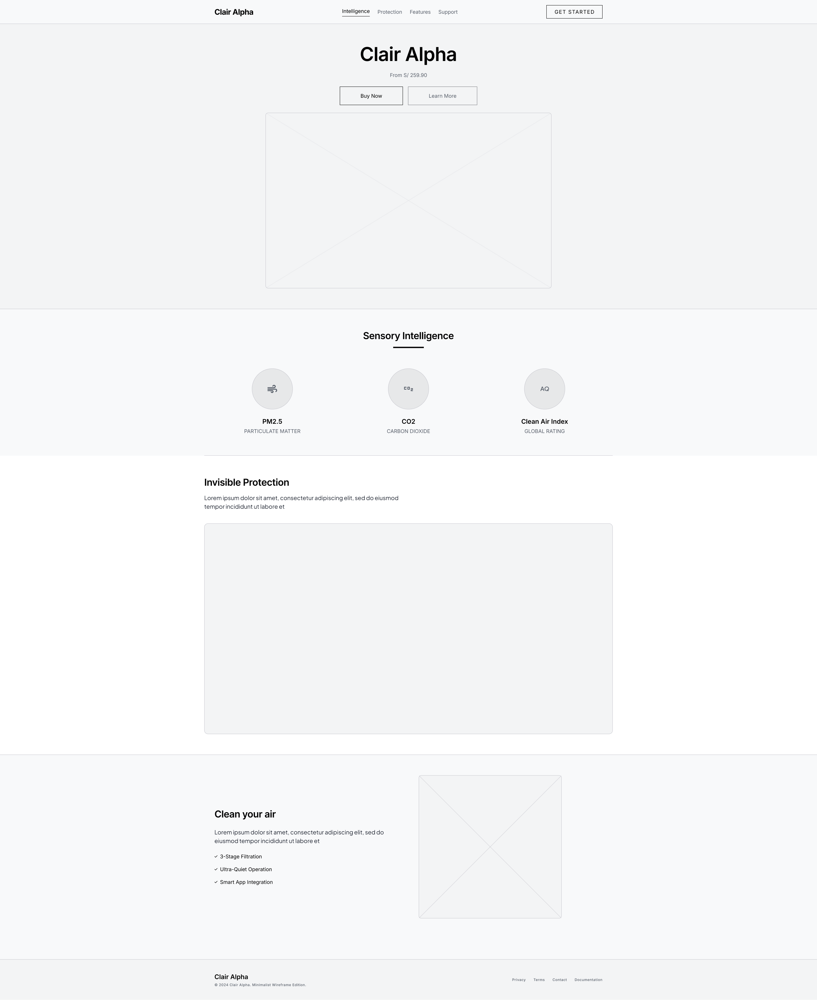

Presentación principal de Clair Alpha. Este esquema define la jerarquía principal del sitio. En la parte superior, se establece un Hero Section con mensajes claros y botones de conversión inmediata.

La sección central de Sensory Intelligence utiliza una estructura de tres columnas para presentar las métricas clave (PM2.5, CO₂ e Índice de Aire), permitiendo que el usuario entienda el valor del monitoreo de un vistazo. Finaliza con bloques de imagen y texto alternados para explicar la integración del dispositivo en espacios físicos.

**Product**

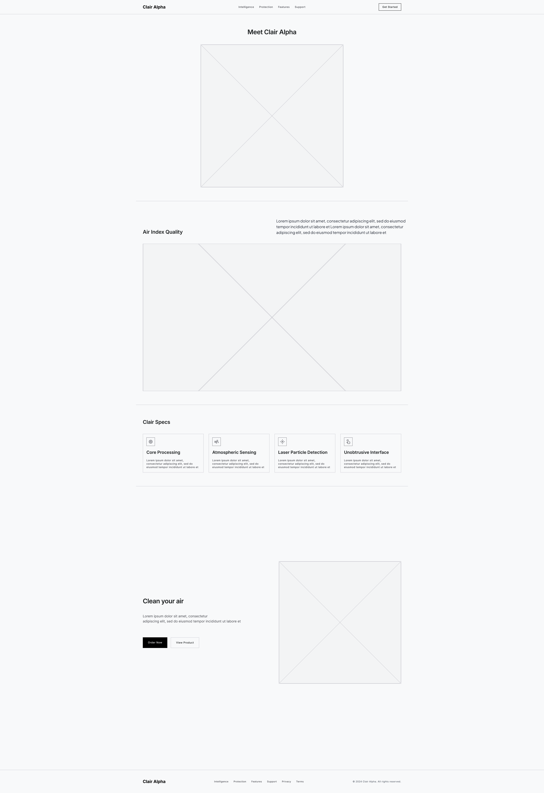

Detalle técnico y funcional del dispositivo. Se enfoca en la arquitectura técnica del dispositivo. Utiliza un layout de rejilla (grid) para organizar las "Clair Specs", donde cada tarjeta contiene un icono, un título y una descripción breve. Este diseño está pensado para descomponer conceptos complejos (como sensores láser o procesamiento de datos) en fragmentos de información digeribles. Incluye un pie de página con un CTA de refuerzo para incentivar la compra tras leer las especificaciones.

**Pricing**

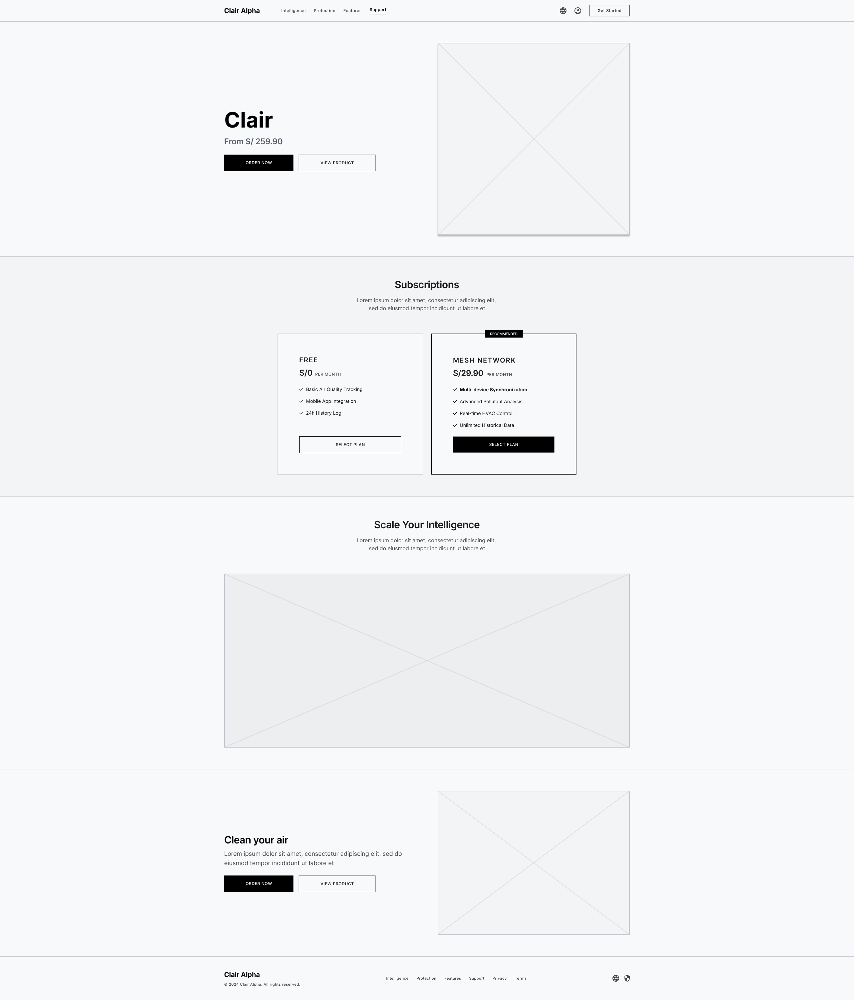

Estructura de costos de los servicios de Clair Alpha. La estructura está diseñada para facilitar la comparativa de servicios. Presenta dos contenedores principales que separan el plan gratuito del plan avanzado ("Mesh Network").

Cada contenedor detalla mediante una lista de viñetas las funcionalidades incluidas, permitiendo al usuario diferenciar rápidamente entre el monitoreo local y la gestión centralizada multidispositivo. Además, el diseño ofrece una visualización limpia de los costos.

**About**

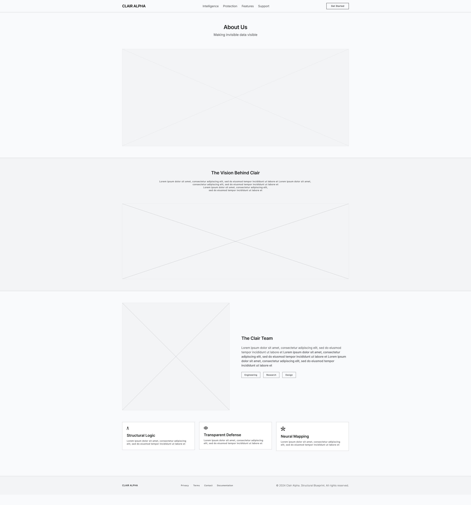

Sección dedicada a la visión de la empresa y el equipo. En la parte inferior, se reserva un espacio para el "Clair Team", organizando al equipo por etiquetas funcionales (Ingeniería, Diseño, Investigación) para proyectar confianza y multidisciplinariedad.

### 4.3.2. Landing Page Mock-up.

**Home**

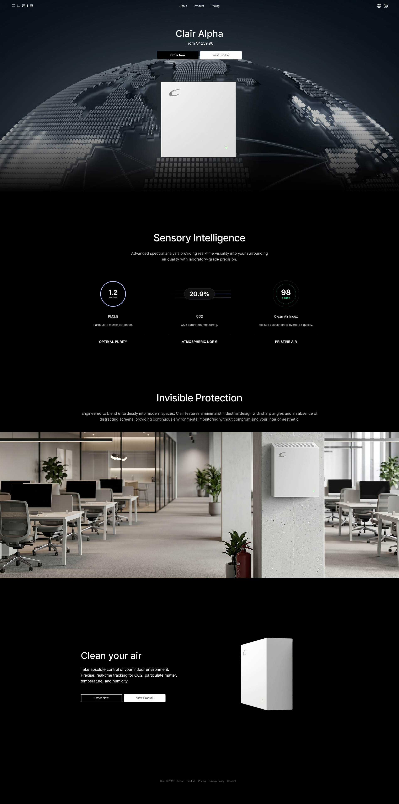

Implementación visual final con un estilo minimalista y tecnológico. Se sustituyen los contenedores vacíos por imágenes fotorrealistas que muestran el dispositivo integrado en oficinas.

Los indicadores de calidad del aire ahora incluyen micro-interacciones visuales, como anillos de progreso y estados de color (verde para "Pristine Air"), que permiten una lectura intuitiva y rápida del estado ambiental.

**Product**

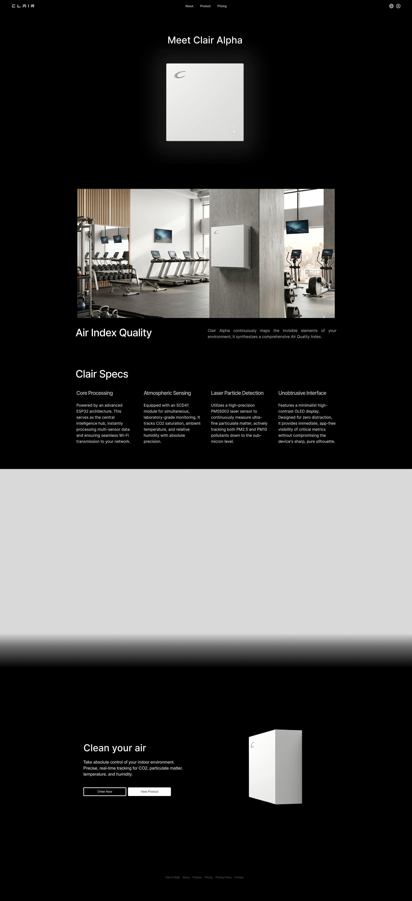

Diseño detallado que muestra los componentes internos del ecosistema. Se detallan los componentes internos mediante una tipografía Space Grotesk y un espaciado amplio que evita la saturación visual.

Se han integrado los nombres específicos de los sensores (SCD41 y PMS5003) para dar credibilidad técnica al producto.

**Pricing**

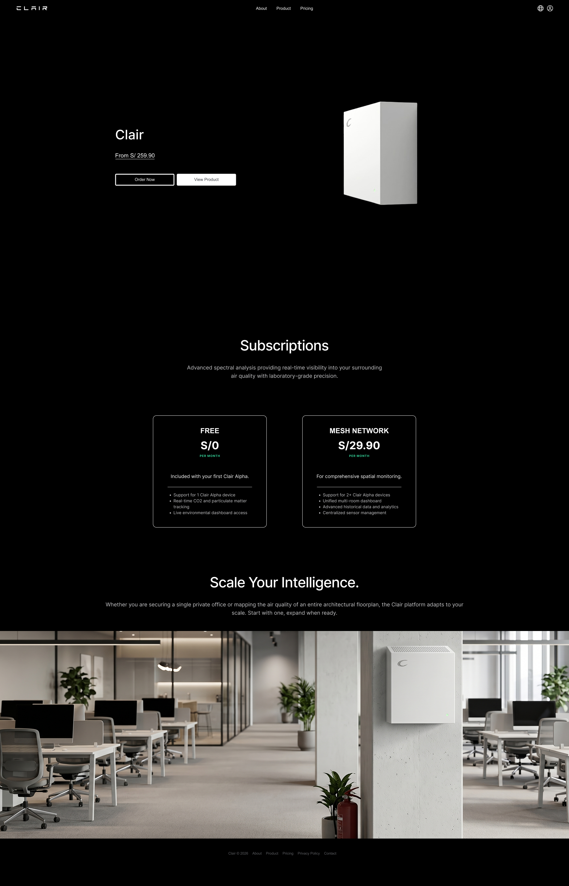

Interfaz de suscripción con un enfoque limpio y directo. Se utilizan tarjetas con bordes definidos y botones de acción claros. Los iconos de moneda y los botones de compra (CTA) siguen una estética de alto contraste (blanco sobre negro), asegurando que el proceso de selección de plan sea visualmente directo y libre de distracciones.

**About**

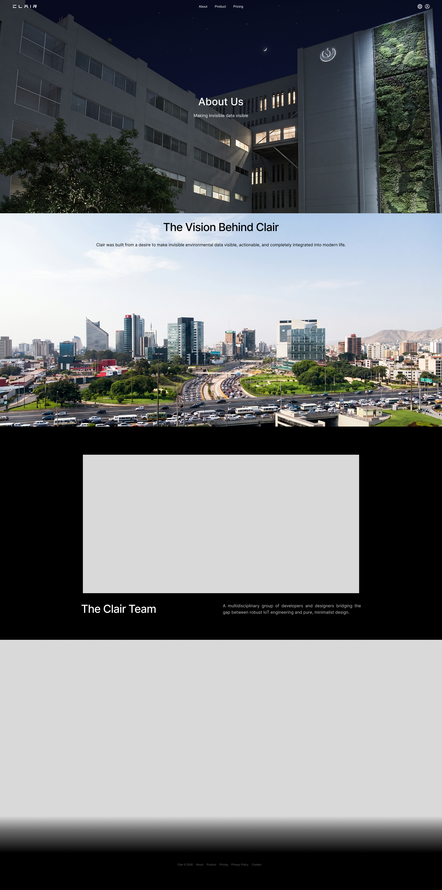

Este mock-up utiliza la fotografía de alto impacto como eje central para conectar emocionalmente con el usuario. La sección presenta al equipo multidisciplinario con un diseño elegante que equilibra el espacio en blanco y el contenido textual.

## 4.4. Mobile Applications UX/UI Design.

Esta sección está dedicada al diseño de la experiencia de usuario (UX) y la interfaz de usuario (UI) de la aplicación móvil que forma parte de la solución Clair. El objetivo es crear interfaces funcionales, accesibles y visualmente coherentes que respondan a las necesidades y expectativas de los usuarios finales en un entorno mobile-first.

### 4.4.1. Mobile Applications Wireframes.

En esta sección se presentan los wireframes de la aplicación móvil, los cuales muestran el diseño estructural y la disposición de los elementos clave para la experiencia de usuario en dispositivos móviles.

**Login**

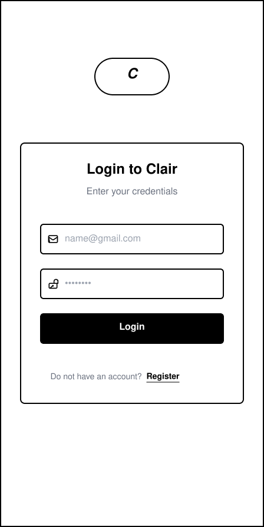

La interfaz de autenticación móvil adopta un diseño vertical y centrado, adaptado a la ergonomía del pulgar. El wireframe simplifica los elementos a un campo de correo electrónico, un botón de acción primario ("Login") de alto contraste y un enlace textual para el registro de nuevos usuarios. Este enfoque minimalista reduce la carga cognitiva y acelera el acceso a la plataforma, manteniendo la estética limpia y tecnológica característica de Clair en un entorno mobile-first.

**Register**

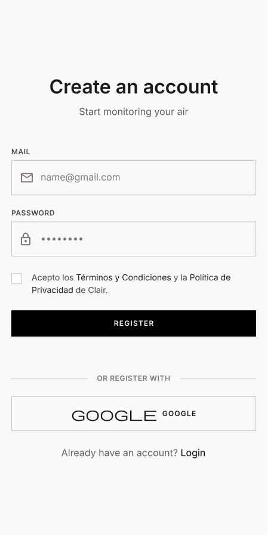

El flujo de registro en dispositivos móviles prioriza la eficiencia y la seguridad mediante una estructura de pasos clara. El wireframe incorpora campos de entrada para correo electrónico y contraseña, acompañados de un componente de verificación (checkbox) para la aceptación de términos legales. Adicionalmente, se integran botones de autenticación con Google para facilitar el proceso, culminando con un enlace de navegación para usuarios ya registrados, todo ello dentro de un contenedor de bordes redondeados que sugiere una interfaz amigable y moderna.

**Dashboard**

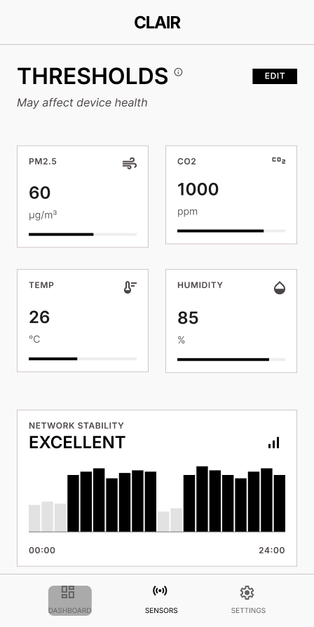

La pantalla principal de la aplicación presenta un panel de control resumido pero altamente informativo, ideal para la supervisión rápida del estado ambiental desde un dispositivo móvil.

**Sensor Selection**

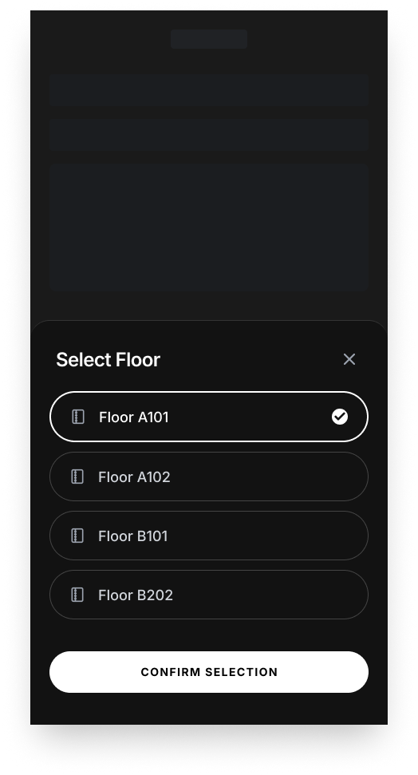

La interfaz de selección de ubicación o dispositivo utiliza un patrón de navegación jerárquica común en móviles: una lista de selección que ocupa la mayor parte de la pantalla. Este patrón modal o de pantalla dedicada guía al usuario a través de la estructura física de la organización (Edificio → Piso) antes de visualizar datos específicos, reduciendo la complejidad y enfocando la atención en la decisión actual.

**Sensor Detail**

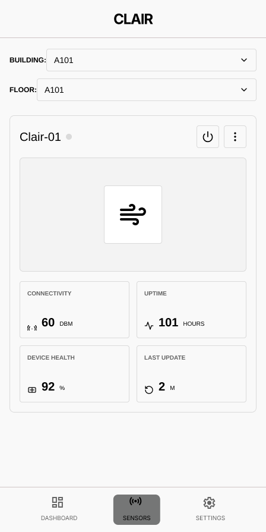

La vista de detalle de un sensor específico concentra la información técnica más relevante en una sola pantalla optimizada para consultas rápidas. Este diseño de alta densidad de información, pero visualmente ordenado, permite a los técnicos y administradores evaluar el estado operativo de un sensor de forma inmediata desde su dispositivo móvil.

**Settings**

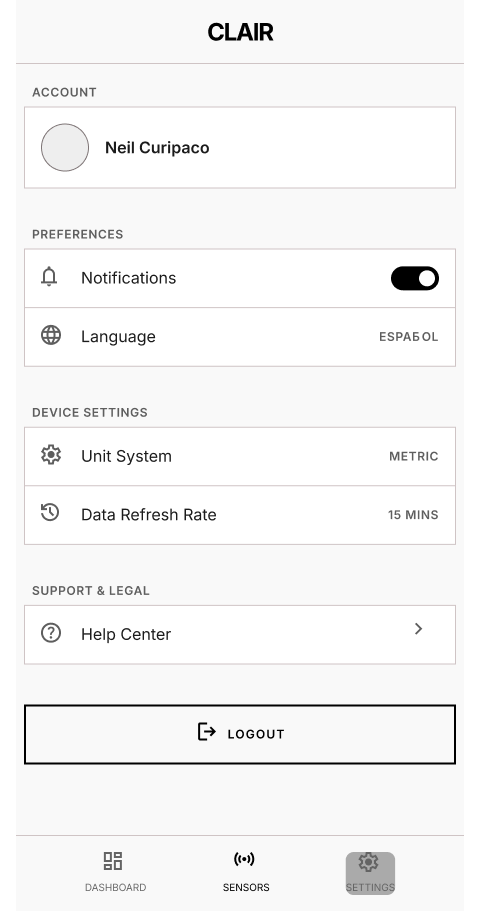

La pantalla de configuración sigue el estándar de plataformas móviles (iOS/Android) mediante una vista de lista desplazable (table view) agrupada por categorías funcionales. La presencia de un botón de "LOGOUT" claramente diferenciado al final de la lista refuerza las normas de usabilidad y seguridad en aplicaciones móviles, ofreciendo un control total sobre la sesión del usuario.

**Alerts**

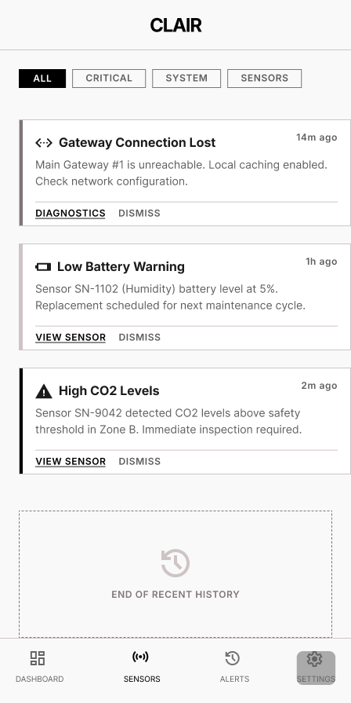

La pantalla de alertas consolida las notificaciones generadas por el sistema Clair, organizadas por niveles de prioridad para facilitar la atención diferenciada por parte del usuario. Cada alerta presenta un encabezado descriptivo, un mensaje contextual y un par de acciones rápidas que permiten responder de manera inmediata o ignorar la notificación. Refleja una arquitectura de notificaciones que equilibra la urgencia operativa con el mantenimiento programado, siguiendo las mejores prácticas de diseño de centros de control y monitoreo en aplicaciones móviles industriales o de seguridad.

### 4.4.2. Mobile Applications Wireflow Diagrams.

Esta sección presenta los diagramas de flujo (wireflows) de la aplicación móvil, que ilustran la navegación y las interacciones del usuario entre las diferentes pantallas, facilitando la comprensión del recorrido dentro del sistema.

**User Goals**

| ID | User Goal | Descripción operativa |
|:---:|:---|:---|
| **UG01** | Garantizar la salud ambiental | Mantener un aire fresco y libre de viciamento para que los clientes permanezcan más tiempo en el local. |
| **UG04** | Controlar síntomas crónicos | Reducir la frecuencia de episodios de rinitis alérgica, asma o dolores de cabeza asociados al ambiente cargado. |
| **UG06** | Crear un refugio seguro | Garantizar que, a pesar de la contaminación exterior de la ciudad, el interior de su hogar sea un espacio de respiración pura. |

**Wireflow: Gestión de alertas y activación de respuestas**

**User Goals cubiertos:**

| ID | User Goal |
|:---|:---|
| UG01 | Garantizar la salud ambiental: Mantener un aire fresco y libre de viciamento para que los clientes permanezcan más tiempo en el local |
| UG04 | Controlar síntomas crónicos: Reducir la frecuencia de episodios de rinitis alérgica, asma o dolores de cabeza asociados al ambiente cargado |

El usuario ingresa a la aplicación y visualiza el Dashboard principal, donde se muestran los indicadores de calidad del aire en tiempo real y el estado general por zonas. El sistema monitorea continuamente los sensores y, cuando detecta una condición crítica (UG01: CO₂/VOC elevado) o la superación de un umbral personalizado configurado desde la Web App (UG04), genera una notificación emergente en la parte superior de la pantalla.

El usuario ingresa a la lista de alerts mediante un tap en el ícono de campana o directamente en la notificación, accediendo a la pantalla Alerts donde la alerta aparece destacada con información contextual. El sistema muestra cada alerta con título, mensaje y botones de acción ("Activar respuesta" si está configurada, "Descartar", "Ver más").

Si el usuario realiza tap en el botón "Activar respuesta" correspondiente a la alerta, siempre que la acción haya sido preconfigurada desde la Web App, el sistema ejecuta la acción correctiva de inmediato (por ejemplo, activar ventilación o enviar notificación al administrador), muestra un toast o snackbar de confirmación y marca la alerta como "En proceso" o "Resuelta". Opcionalmente, el usuario puede tap en "Descartar" o "Recordar más tarde", en cuyo caso la alerta se archiva o se programa para reaparecer después de un tiempo definido.

UG01 y UG04 comparten el mismo wireflow para Mobile Application, ya que ambos flujos se detonan por una alerta automática o preventiva y conducen a la misma pantalla Alerts para la gestión de la respuesta. La diferencia radica en el origen de la regla: UG01 responde a reglas por defecto del sistema, mientras que UG04 responde a reglas personalizadas configuradas desde Web App. En ambos casos, la experiencia de usuario en mobile es idéntica.

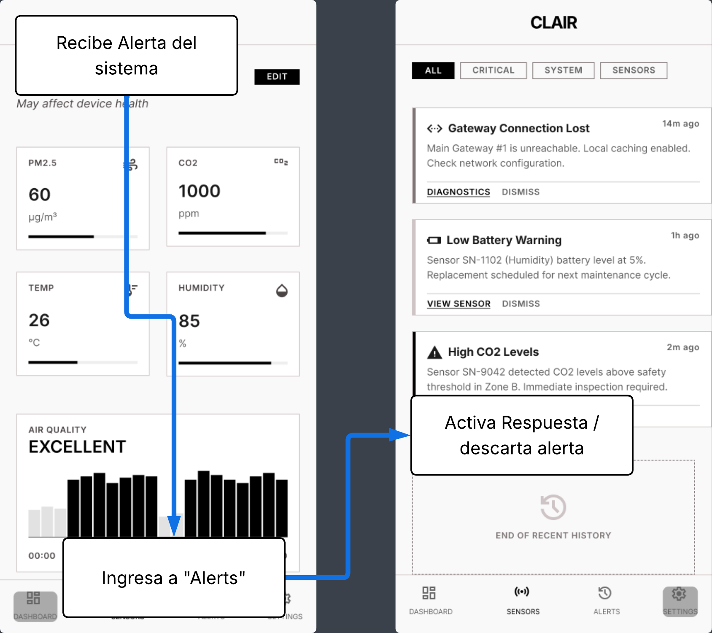

**Wireflow: Verificación de calidad del aire (Refugio seguro)**

**User Goals cubiertos:**

| ID | User Goal |
|:---|:---|
| UG06 | Crear un refugio seguro: Garantizar que, a pesar de la contaminación exterior de la ciudad, el interior de su hogar sea un espacio de respiración pura |

El usuario ingresa a la aplicación y visualiza el Dashboard principal. En esta pantalla, el sistema muestra los indicadores de calidad del aire (CO₂, VOC, temperatura, humedad), el estado general por zonas y el indicador AQI (Bueno/Moderado/Malo). El usuario visualiza el AQI y los valores de los sensores directamente en el Dashboard.

El sistema presenta el estado actual del aire, indicando si es saludable o no. Al observar que los indicadores están dentro de rangos saludables y que el AQI es "Bueno" o "Moderado", el usuario confirma que su hogar es un "refugio seguro", es decir, un espacio de respiración pura a pesar de la contaminación exterior del entorno urbano.

UG06 en Mobile se resuelve íntegramente en el Dashboard, ya que esta pantalla muestra el AQI y los valores de calidad del aire en tiempo real. No existe funcionalidad equivalente al widget de cumplimiento OMS en la versión mobile de Reports. El usuario valida que su hogar es un refugio seguro al observar indicadores saludables en el Dashboard.

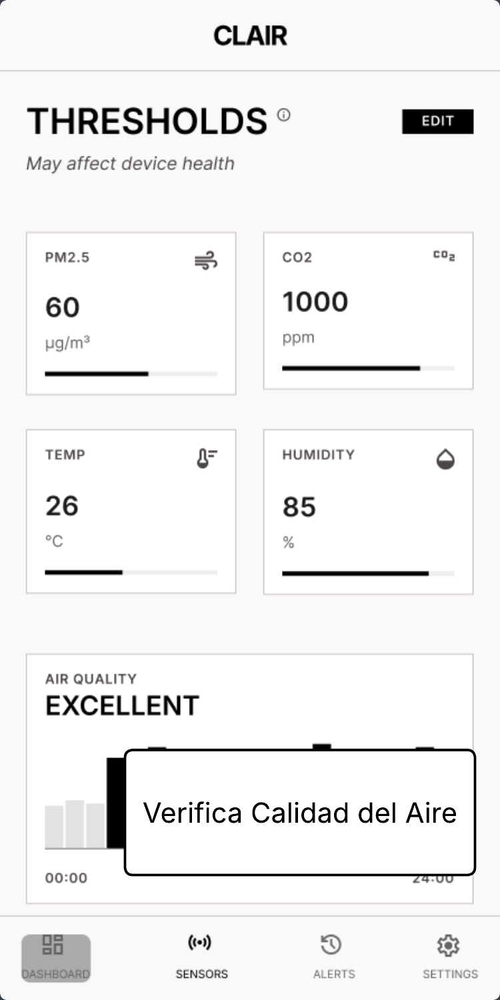

### 4.4.3. Mobile Applications Mock-ups.

**Login**

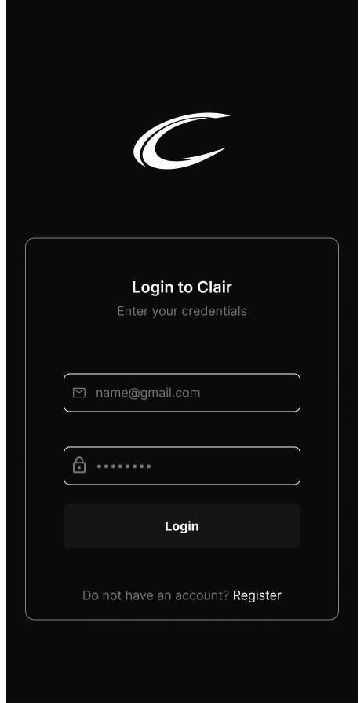

La pantalla de autenticación presenta una implementación visual final de estilo sobrio y corporativo, con fondo oscuro uniforme y el logotipo de Clair centrado en la parte superior. El mock-up dispone campos de entrada de bordes redondeados con etiquetas flotantes o internas, acompañados de un botón de acción primaria ("Login") de color de contraste moderado que ocupa el ancho completo. Un enlace textual secundario ("Register") permite la navegación al flujo de creación de cuenta, manteniendo una estética limpia, profesional y alineada con la identidad tecnológica de la marca en el ecosistema móvil.

**Register**

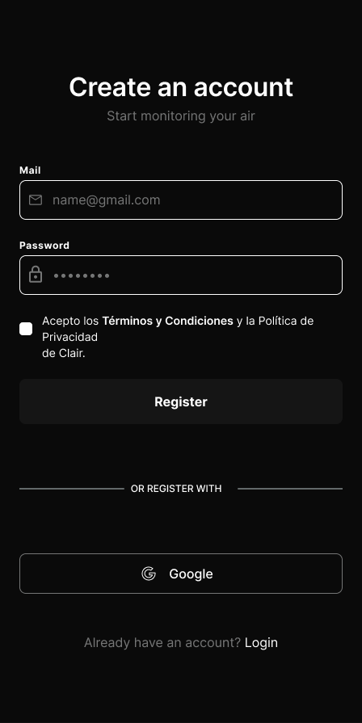

La interfaz de registro mantiene la coherencia visual con la pantalla de login, utilizando un fondo oscuro y una tarjeta central que organiza el contenido de forma vertical. El mock-up integra campos de entrada para correo electrónico y contraseña, este último con un indicador visual de caracteres enmascarados, acompañados de un componente de verificación para la aceptación de términos y condiciones. El botón de registro principal se complementa con una opción de autenticación con Google mediante un contenedor secundario. Finalmente, un enlace "Login" dirige a los usuarios ya registrados, completando un flujo de alta eficiente y visualmente consistente.

**Air Quality**

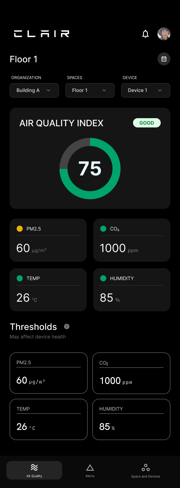

La pantalla de calidad del aire ofrece una visión centralizada y altamente legible del estado ambiental actual. En la parte superior, selectores desplegables permiten filtrar los datos por organización, espacio y dispositivo específico, lo cual se complementa con un indicador visual del "Air Quality Index" que clasifica la calidad del aire como "GOOD" con una puntuación numérica. Debajo, se despliegan tarjetas individuales para variables clave como material particulado (PM2.5), CO₂, temperatura y humedad, cada una con su valor actual y un indicador de estado. Finalmente, la sección de "Thresholds" proporciona una referencia clara de los límites operativos configurados para cada parámetro.

**Sensor Selection**

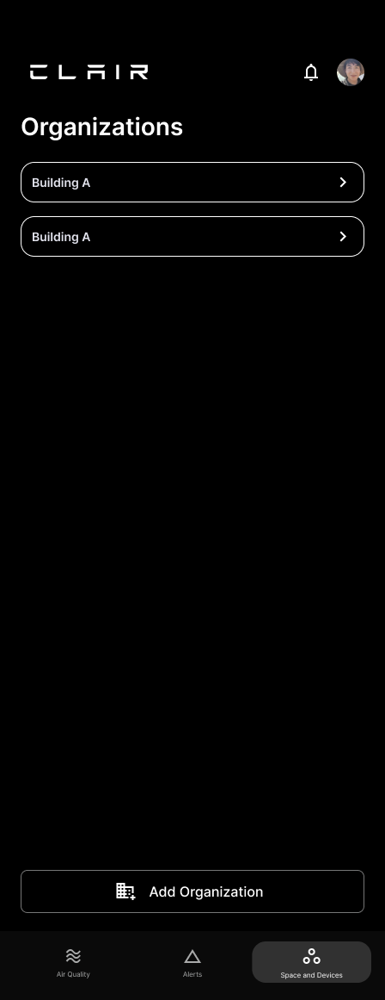

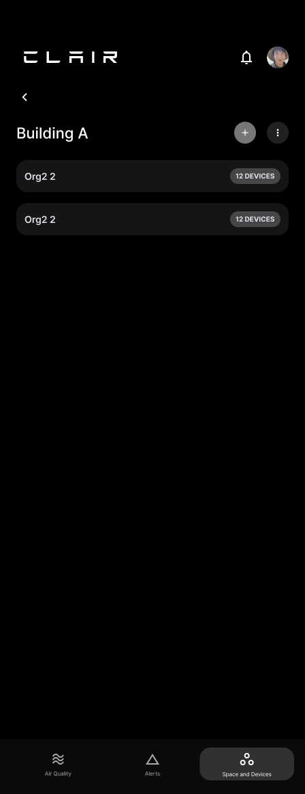

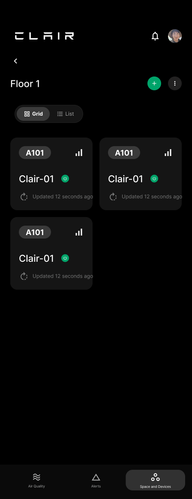

La estructura de selección de sensores en Clair sigue una jerarquía de navegación lógica, diseñada para gestionar grandes despliegues de infraestructura de forma intuitiva. El sistema guía al usuario a través de niveles de agregación progresiva: desde el despliegue general de organizaciones, pasando por edificios específicos y niveles de planta, hasta llegar a la gestión individual de los dispositivos. Esta arquitectura jerárquica permite al usuario alternar entre vistas de cuadrícula (grid) y lista, proporcionando flexibilidad visual para monitorear el estado operativo y la última actividad de múltiples dispositivos simultáneamente.

**Sensor Detail**

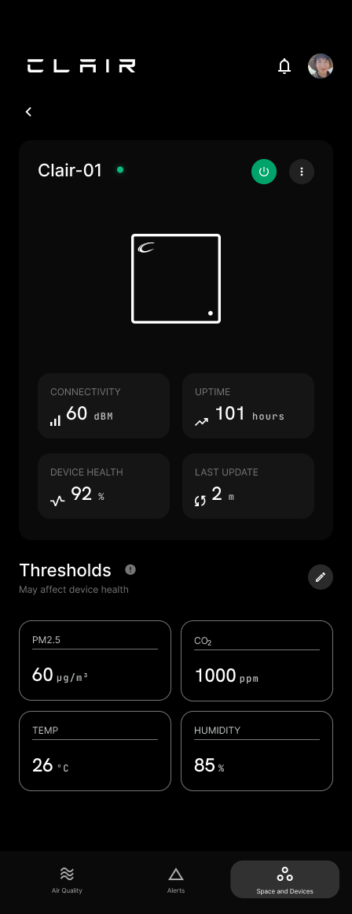

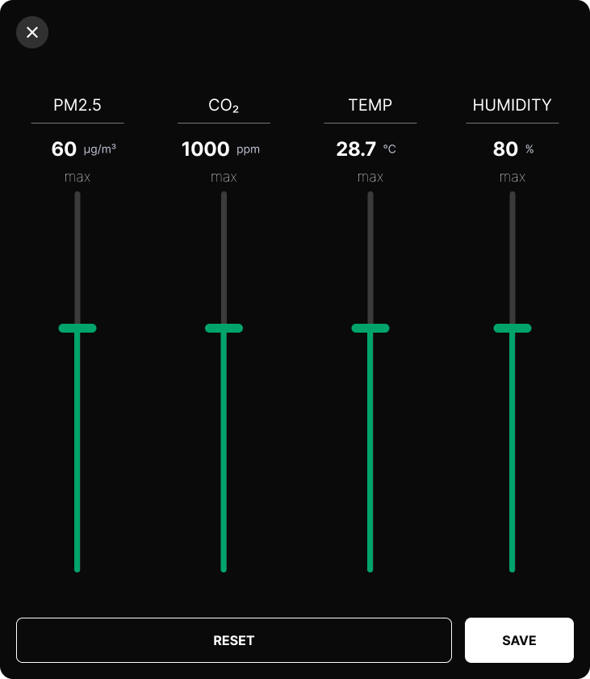

La interfaz de detalle del sensor "Clair-01" proporciona un diagnóstico técnico integral y una capacidad de configuración precisa del entorno monitorizado. La vista principal despliega métricas de estado operativo como conectividad, tiempo de actividad (uptime), salud general del dispositivo y la antigüedad de la última actualización. Bajo este, la sección de umbrales permite el ajuste granular de parámetros críticos de calidad ambiental, como material particulado (PM2.5), CO₂, temperatura y humedad, a través de una interfaz interactiva de deslizadores.

**Settings**

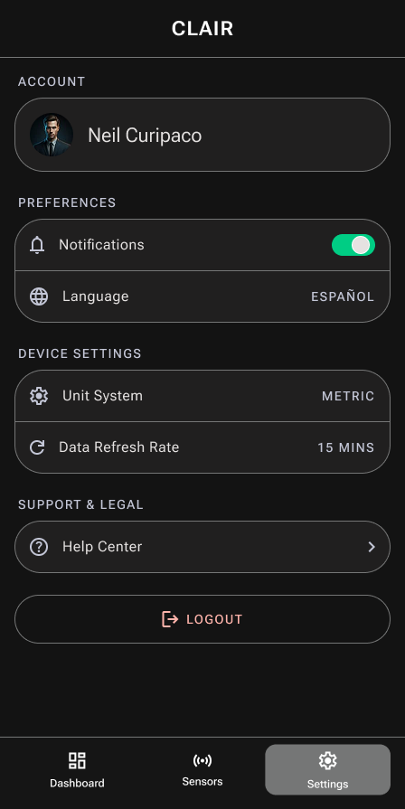

La pantalla de configuración sigue el estándar de plataformas móviles mediante una vista de lista desplazable (table view) agrupada por categorías funcionales. El mock-up organiza las opciones en secciones claramente diferenciadas: "ACCOUNT", "PREFERENCES", "DEVICE SETTINGS" y "SUPPORT & LEGAL". Finalmente, un botón "LOGOUT" claramente diferenciado permite el cierre de sesión.

**Alerts**

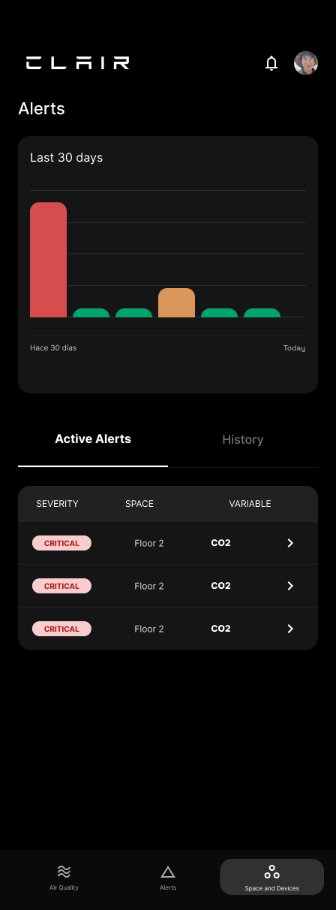

La pantalla de alertas presenta un panel de control dentro del sistema Clair dedicado al monitoreo de alertas. En la parte superior, destaca un gráfico de barras que resume la frecuencia de eventos durante los últimos 30 días, permitiendo visualizar tendencias de actividad a lo largo del tiempo. Debajo, una interfaz tabulada divide la información en "Active Alerts" e "History", enfocándose en la gestión inmediata de incidencias críticas mediante una tabla organizada por severidad, ubicación y variable afectada, e integrando una navegación intuitiva con barra inferior para acceso rápido a otras funciones del sistema.

### 4.4.4. Mobile Applications User Flow Diagrams.

Esta sección presenta los diagramas de flujo de los usuarios en la aplicación móvil, los cuales ilustran las rutas y procesos que siguen dentro de Clair, facilitando la comprensión de la navegación y las interacciones clave.

**Mobile Application User Flow**

**User Flow: Gestión de alertas y activación de respuestas**

User Goals cubiertos:

| ID | User Goal |
|:---|:---|
| UG01 | Garantizar la salud ambiental: Mantener un aire fresco y libre de viciamento para que los clientes permanezcan más tiempo en el local |
| UG04 | Controlar síntomas crónicos: Reducir la frecuencia de episodios de rinitis alérgica, asma o dolores de cabeza asociados al ambiente cargado |

Ambos User Goals comparten el mismo flujo de interacción en Mobile Application. El usuario recibe una notificación emergente en el Dashboard cuando el sistema detecta una condición crítica (UG01) o la superación de un umbral personalizado (UG04). El usuario ingresa a la pantalla Alerts, visualiza la alerta destacada, y puede activar una respuesta preconfigurada, si está disponible desde Web App, o descartarla. La diferencia radica en el origen de la regla: UG01 responde a reglas por defecto del sistema, mientras que UG04 responde a reglas personalizadas configuradas desde Web App. En ambos casos, la experiencia de usuario en mobile es idéntica.

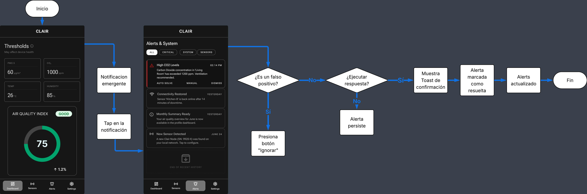

**User Flow: Verificación de calidad del aire (Refugio seguro)**

User Goals cubiertos:

| ID | User Goal |
|:---|:---|
| UG06 | Crear un refugio seguro: Garantizar que, a pesar de la contaminación exterior de la ciudad, el interior de su hogar sea un espacio de respiración pura |

El usuario accede al Dashboard de Mobile Application. En esta pantalla, se muestran los indicadores de calidad del aire (CO₂, VOC, temperatura, humedad) y el indicador AQI (Bueno/Moderado/Malo). El usuario visualiza estos indicadores y verifica que el aire interior es saludable. Al observar que el AQI es "Bueno" o "Moderado" y que los valores están dentro de rangos saludables, el usuario confirma que su hogar es un "refugio seguro". No existe funcionalidad equivalente al widget de cumplimiento OMS en la versión mobile.

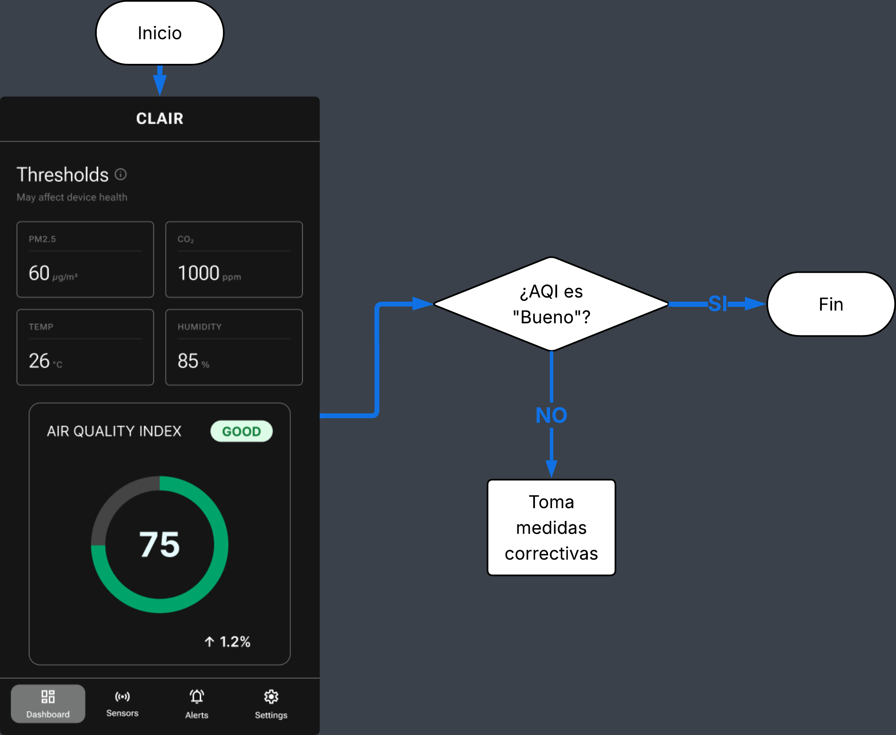

## 4.5. Mobile Applications Prototyping.

En esta sección se presentan los prototipos interactivos de la aplicación móvil, que permiten visualizar y probar la experiencia de usuario antes del desarrollo final. Estos prototipos materializan los wireframes, mock-ups, wireflows y user flows definidos previamente para validar la navegación, la ergonomía táctil y la coherencia entre las diferentes pantallas operativas del sistema Clair en formato móvil.

### 4.5.1. Android Mobile Applications Prototyping.

El prototipo Android de la aplicación móvil representa la materialización interactiva de los wireframes, mock-ups, wireflows y user flows diseñados para dispositivos móviles. Este prototipo simula la experiencia táctil del usuario final en un entorno Android, permitiendo validar la ergonomía, la navegación entre pantallas y la coherencia visual de las principales secciones operativas del sistema Clair.

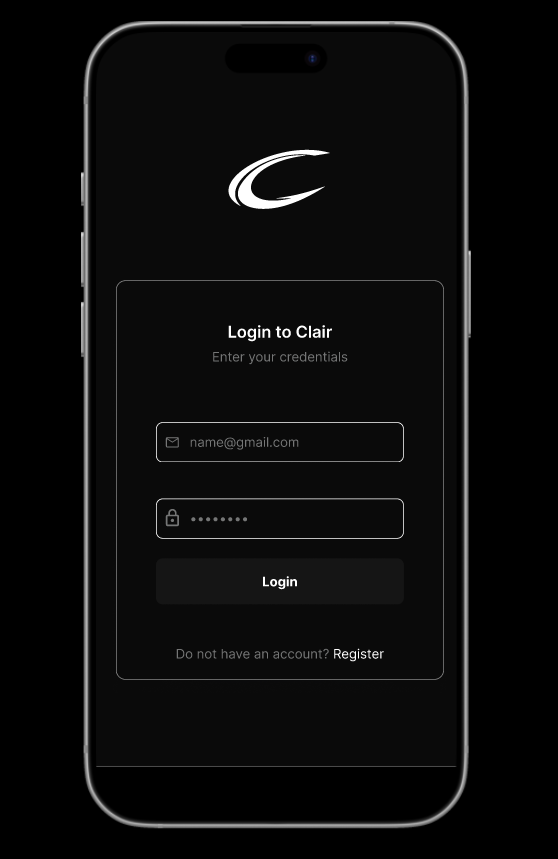

Android Mobile Application Prototype: https://sl1nk.com/s0e7d73

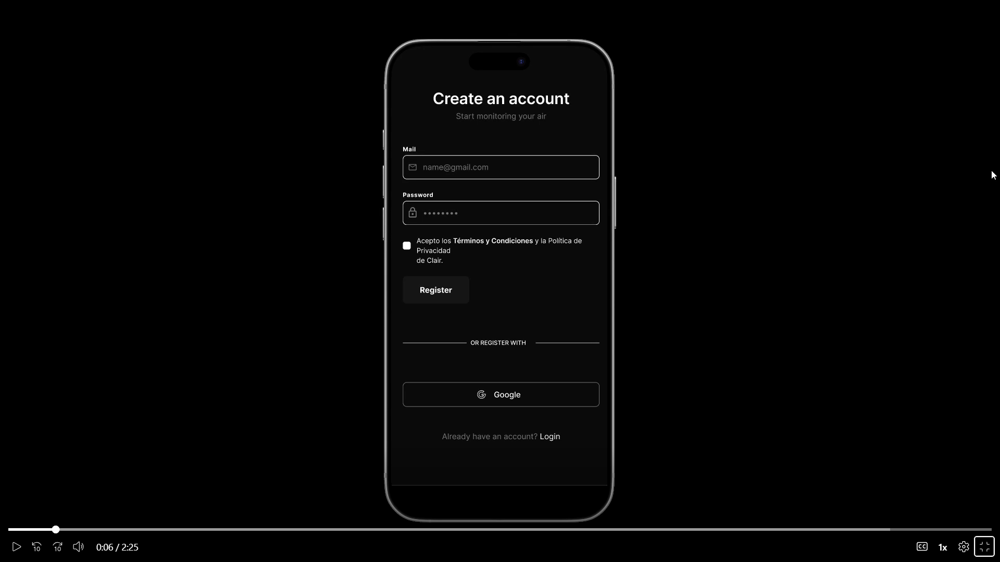

Video de presentación del prototipo Android Mobile Application: https://bit.ly/43bBBh7

### 4.5.2. iOS Mobile Applications Prototyping.

El prototipo iOS de la aplicación móvil representa la validación interactiva de la experiencia de Clair en dispositivos Apple. A partir de los wireframes, mock-ups, wireflows y user flows previamente definidos, este prototipo permite comprobar la consistencia de navegación, la lectura de indicadores ambientales y la interacción táctil con pantallas clave como Dashboard, Alerts, Sensor Selection, Sensor Detail y Settings.


iOS Mobile Application Prototype: https://sl1nk.com/s0e7d73


Video de presentación del prototipo iOS Mobile Application: https://bit.ly/43bBBh7

## 4.6. Web Applications UX/UI Design.

Esta seccion esta dedicada al diseno de la experiencia de usuario (UX) y la interfaz de usuario (UI) de la aplicacion web que conforma la solucion. El objetivo es crear una interfaz funcional, accesible y visualmente coherente que responda a las necesidades y expectativas de los usuarios finales.

### 4.6.1. Web Applications Wireframes.

En esta seccion se presentan los wireframes de la aplicacion web, que muestran el diseno estructural y la disposicion de los elementos clave para la experiencia de usuario.

**Web Application**

**Login**

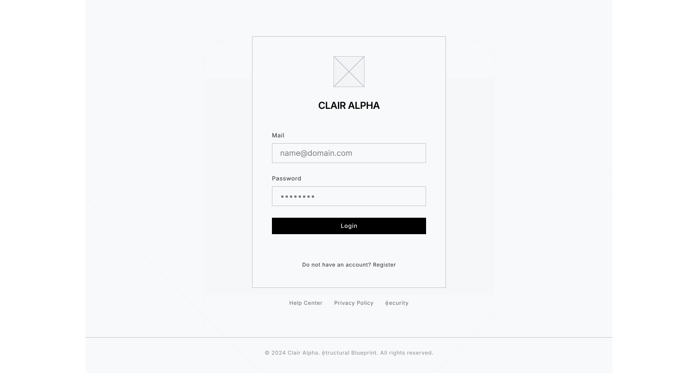

La interfaz de autenticacion presenta un diseno centralizado y minimalista que prioriza la claridad funcional. El wireframe utiliza un contenedor de bordes definidos sobre un fondo neutro, integrando campos de entrada directos para credenciales y un boton de accion de alto contraste, lo que refuerza una estetica tecnologica y ordenada coherente con el ecosistema de Clair.

**Register**

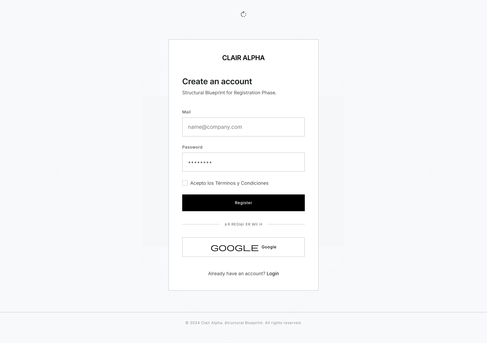

El diseno de registro mantiene la coherencia visual mediante una estructura vertical limpia que facilita el flujo de los usuarios. Este wireframe integra campos de entrada estandar, un selector para terminos legales y una opcion de autenticacion social con Google, logrando un equilibrio entre simplicidad y funcionalidad bajo una estetica tecnica y minimalista.

**Overview**

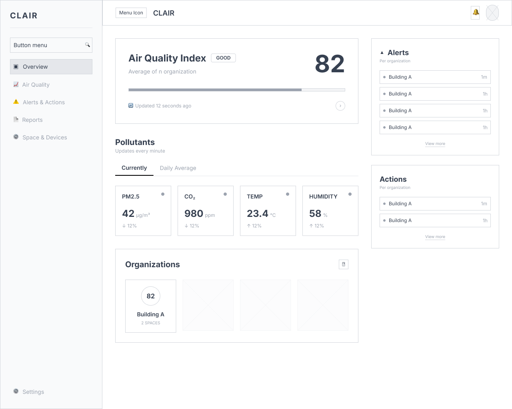

La interfaz principal despliega un tablero de control avanzado con un estilo "dark mode" que resalta metricas criticas de calidad de aire mediante una jerarquia visual clara. El diseno utiliza tarjetas modulares para organizar contaminantes como PM2.5 y CO2, integrando graficos de barras de estado y paneles laterales de alertas en tiempo real, lo que ofrece una experiencia analitica, tecnica y altamente funcional para la gestion de multiples organizaciones.

**Space & Devices**

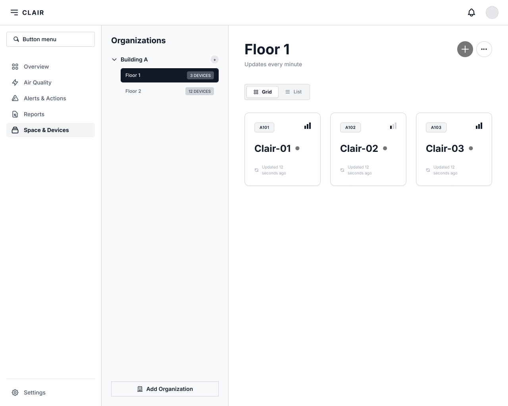

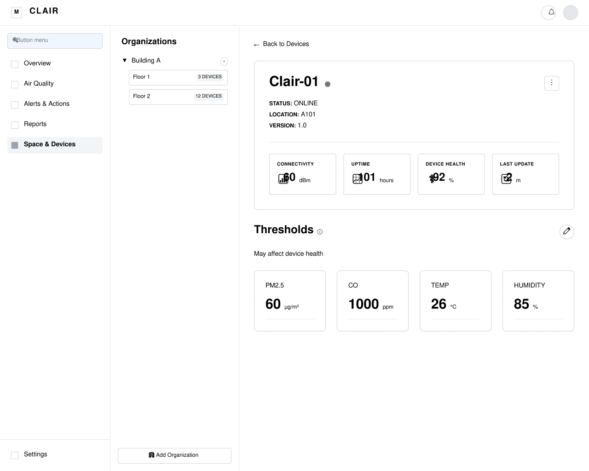

La interfaz de gestion de dispositivos presenta una estructura organizada mediante un panel de navegacion jerarquico que facilita la administracion de organizaciones y espacios. El diseno utiliza tarjetas de inventario detalladas y una vista individual para monitorear el estado tecnico de cada sensor, integrando indicadores de conectividad, salud del dispositivo y umbrales personalizados bajo una estetica limpia y profesional.

**Air Quality**

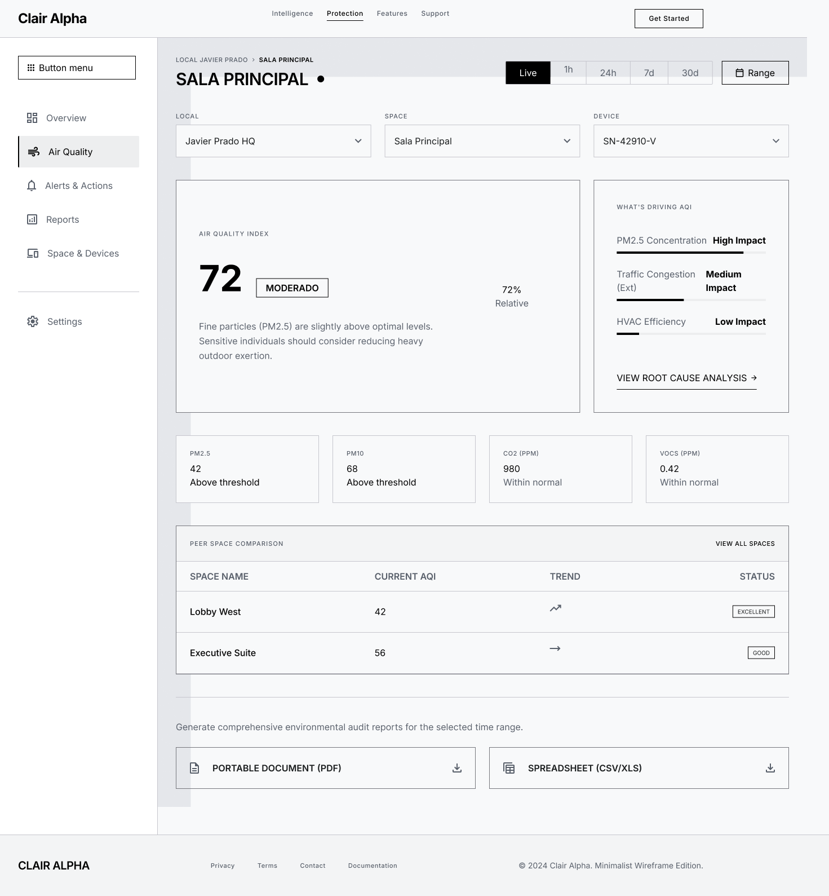

La interfaz de analisis ambiental presenta un tablero detallado que permite la visualizacion de metricas en tiempo real y periodos historicos mediante selectores de tiempo y ubicacion. El diseno integra tarjetas de diagnostico para multiples contaminantes, un panel de analisis de causa raiz y una comparativa entre espacios, culminando en una seccion de generacion de reportes tecnicos en formatos PDF y CSV que refuerza el enfoque profesional y orientado a datos del ecosistema Clair.

**Alerts & Actions**

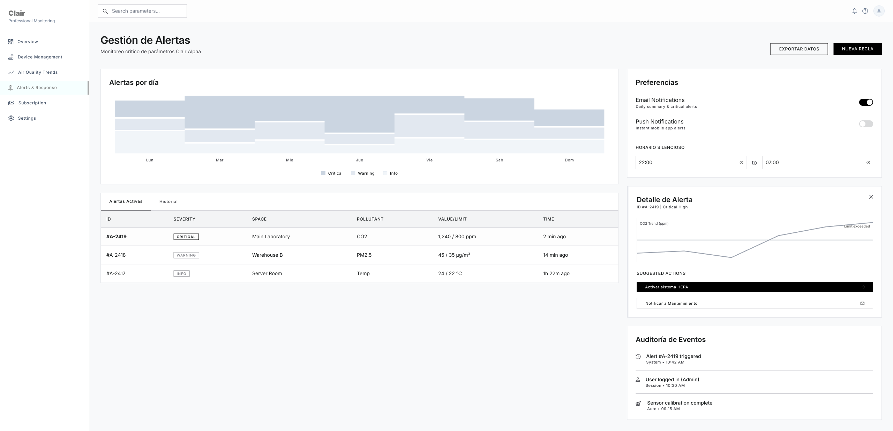

La interfaz de gestion de alertas ofrece un centro de control operativo que combina el monitoreo critico con la capacidad de respuesta inmediata. El diseno destaca un grafico de distribucion semanal de incidencias y una tabla detallada de alertas activas, integrando paneles laterales para la configuracion de notificaciones, visualizacion de tendencias especificas por evento y un registro de auditoria, lo que permite una administracion proactiva y tecnica de las contingencias ambientales en el ecosistema Clair.

**Reports**

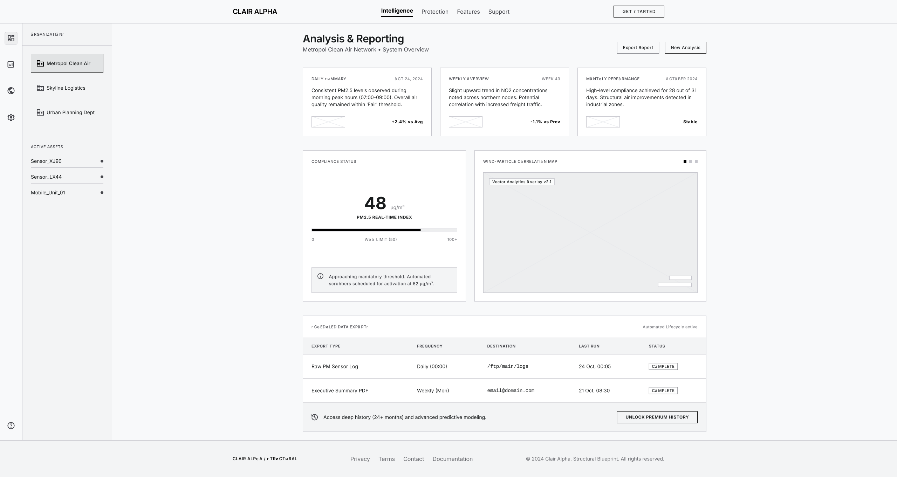

La interfaz de reportes presenta un panel analitico robusto disenado para la interpretacion de datos estrategicos y el cumplimiento normativo. El wireframe organiza la informacion mediante tarjetas de resumen diario, semanal y mensual, integrando visualizaciones de correlacion de particulas y un gestor de exportaciones automatizado que detalla la frecuencia y el estado de los registros. Este diseno facilita una supervision integral del ecosistema Clair, permitiendo desde el analisis tecnico profundo hasta la generacion de resumenes ejecutivos con una estetica limpia y profesional.

### 4.6.2. Web Applications Wireflow Diagrams.

Esta seccion presenta los diagramas de flujo (wireflows) de la aplicacion web, que ilustran la navegacion y las interacciones del usuario entre las diferentes pantallas, facilitando la comprension del recorrido dentro del sistema.

**Web Application**

**Wireflow: Generacion y gestion de reportes**

User Goals cubiertos:

| ID | User Goal |
|:---|:---|
| UG02 | Demostrar salubridad: Contar con evidencia tangible de que el local cumple con estandares de aire seguro para clientes y fiscalizaciones |
| UG05 | Validar acciones preventivas: Saber con certeza si los habitos de limpieza y ventilacion estan funcionando para mejorar la calidad del aire |

El usuario accede al Overview y navega a la seccion Reports mediante un clic en el menu lateral. En Reports selecciona el tipo de reporte deseado, configura el rango de fechas y las zonas a incluir, y hace clic en "Generar reporte". El sistema recopila los datos, muestra una barra de progreso y genera el reporte con graficos, metricas clave y comparativas con estandares. Finalmente, el usuario puede exportarlo en formato PDF o compartirlo, recibiendo una confirmacion de que la accion fue exitosa y quedando registrada en el historial.

UG02 y UG05 comparten el mismo wireflow para Web Application. La diferencia radica en el proposito: UG02 busca evidencia para terceros, mientras que UG05 busca validacion personal. En ambos casos, el flujo de generacion de reportes es identico.

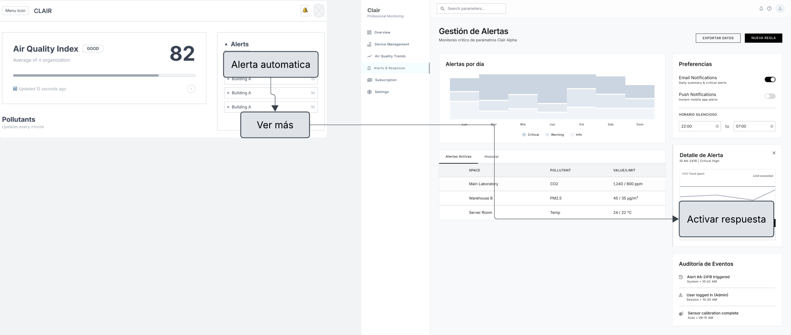

**Wireflow: Generacion y gestion de reportes**

El usuario accede al Overview y visualiza el Dashboard principal con los indicadores de calidad del aire en tiempo real. Desde alli navega a Reports, selecciona el tipo de reporte, configura los parametros y genera el reporte. El sistema muestra un mensaje de confirmacion y registra la accion en el historial del usuario.

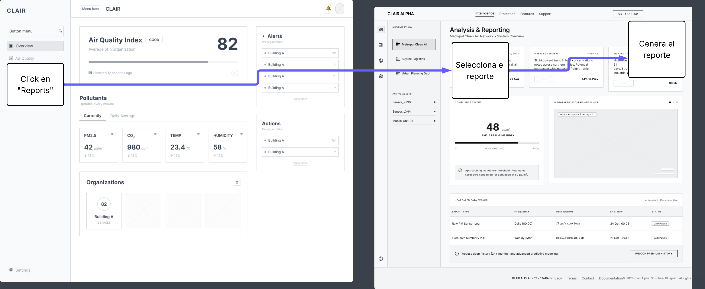

**Wireflow: Configuracion de umbrales personalizados (Rules Builder)**

User Goals cubiertos:

| ID | User Goal |
|:---|:---|
| UG04 | Controlar sintomas cronicos: Reducir la frecuencia de episodios asociados al ambiente cargado |

El usuario accede al Overview y navega a Alerts & Actions. Dentro de Rules Builder crea una regla personalizada seleccionando una metrica, un operador, un umbral numerico y una accion asociada. El sistema valida y guarda la regla, monitorea los sensores en tiempo real y, cuando se supera el umbral, dispara la accion configurada y genera una alerta preventiva en el Dashboard y en Alerts & Actions.

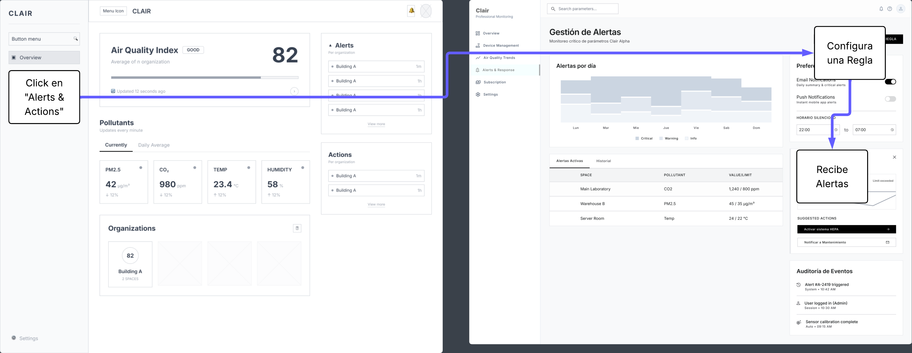

**Wireflow: Verificacion de calidad del aire y cumplimiento de estandares**

User Goals cubiertos:

| ID | User Goal |
|:---|:---|
| UG06 | Crear un refugio seguro: Garantizar que el interior del hogar sea un espacio de respiracion pura a pesar de la contaminacion exterior |

El usuario accede al Overview y navega a Air Quality para consultar los registros de los sensores Clair y el indicador AQI. Opcionalmente, navega a Reports para consultar el cumplimiento de los estandares de la Organizacion Mundial de la Salud. El sistema presenta una comparativa entre las metricas actuales y los limites recomendados, permitiendo verificar que el aire interior es saludable.

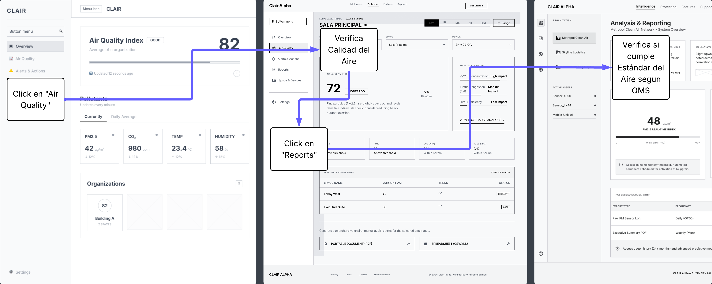

### 4.6.3. Web Applications Mock-ups.

La aplicacion web cuenta con mock-ups de alta fidelidad que representan la implementacion visual final de sus principales pantallas.

**Web Application**

**Login**

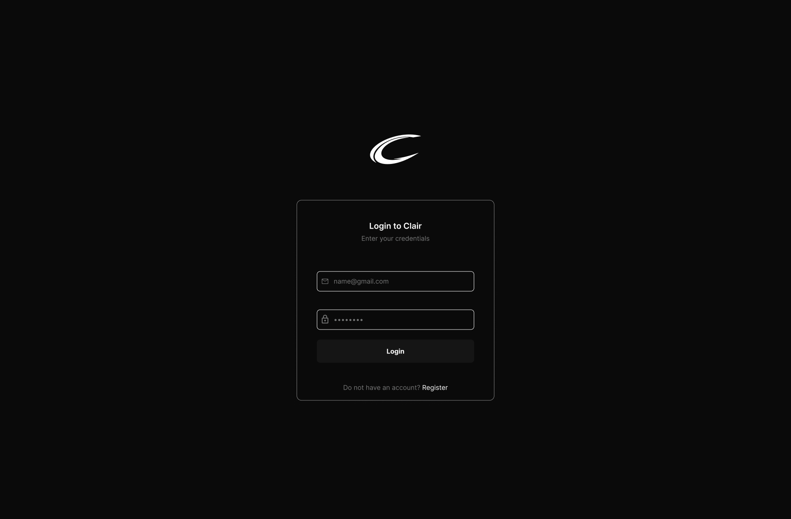

La interfaz de inicio de sesion presenta un estilo sofisticado, minimalista y tecnologico. El mock-up utiliza un fondo oscuro que resalta un contenedor de bordes sutiles y el logotipo central de Clair, integrando campos de entrada con iconos descriptivos y un boton de accion principal de contraste moderado.

**Register**

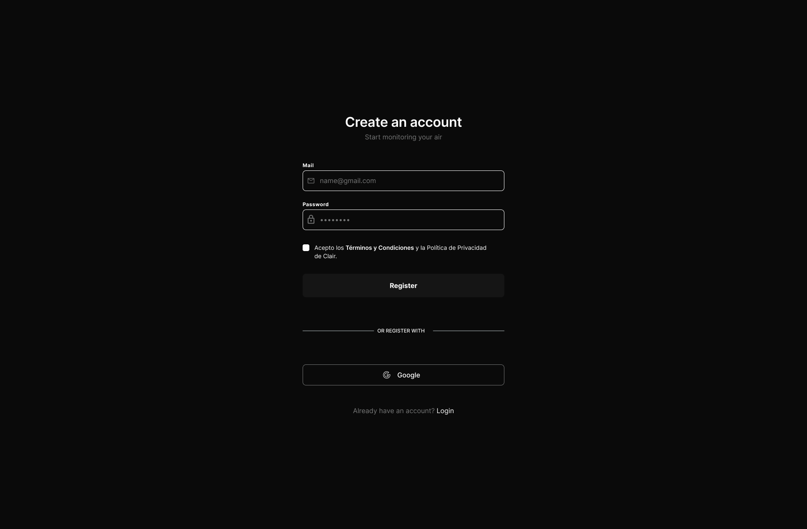

La interfaz de creacion de cuenta mantiene la coherencia visual con Login. Integra campos de entrada, selectores de terminos legales y una opcion de autenticacion social con Google, logrando una experiencia sobria y profesional.

**Overview**

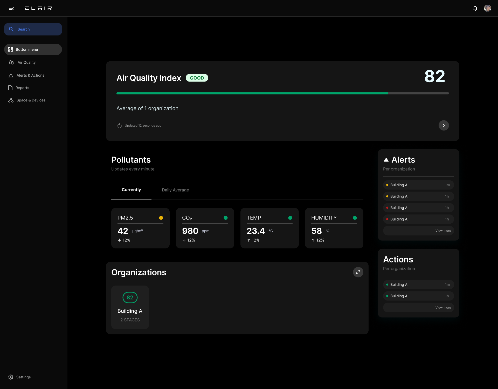

El tablero principal utiliza un fondo oscuro para resaltar los indicadores de calidad de aire. Organiza el AQI y contaminantes especificos como CO2 y PM2.5 mediante tarjetas modulares de alto contraste, integrando paneles de alertas y acciones en tiempo real.

**Space & Devices**

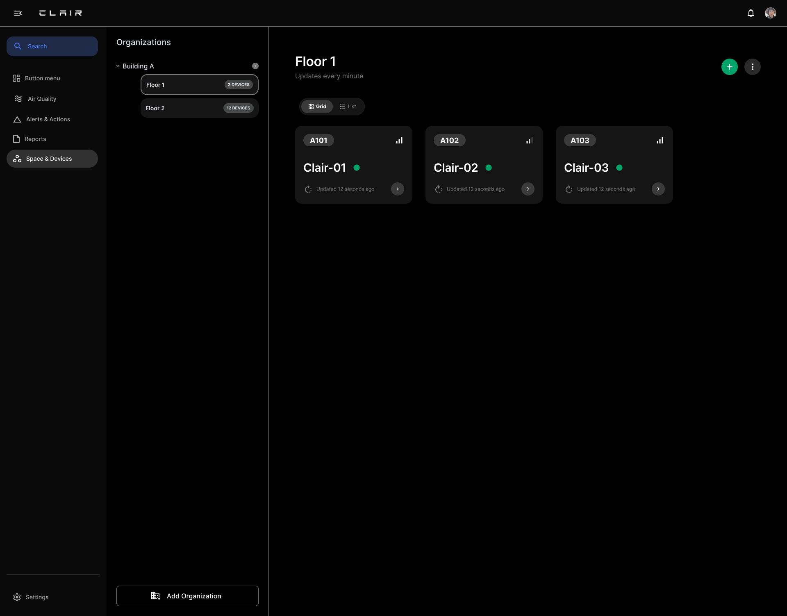

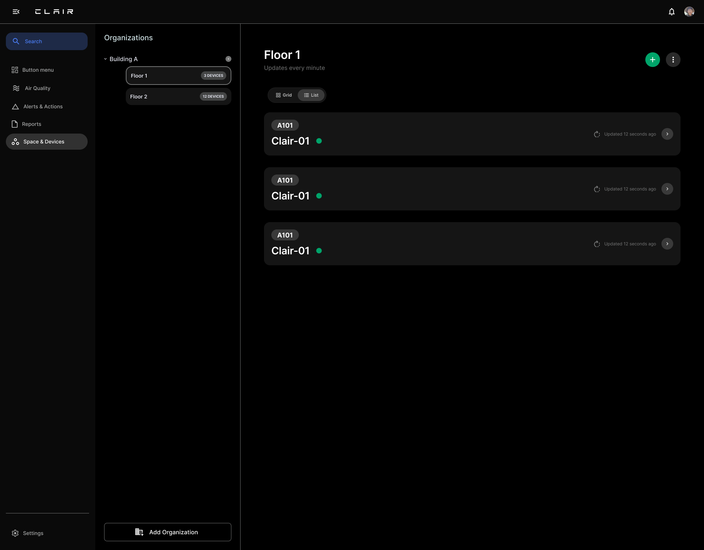

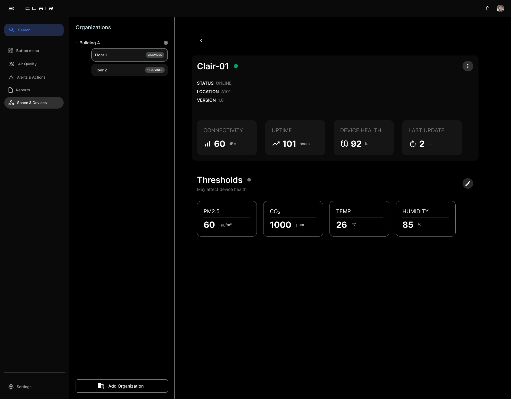

La seccion permite navegar por organizaciones, edificios y plantas, proporcionando control sobre el despliegue de sensores. El usuario puede visualizar dispositivos en formato Grid o List y consultar el estado, ubicacion, version, conectividad, uptime, salud y umbrales de cada dispositivo.

**Air Quality**

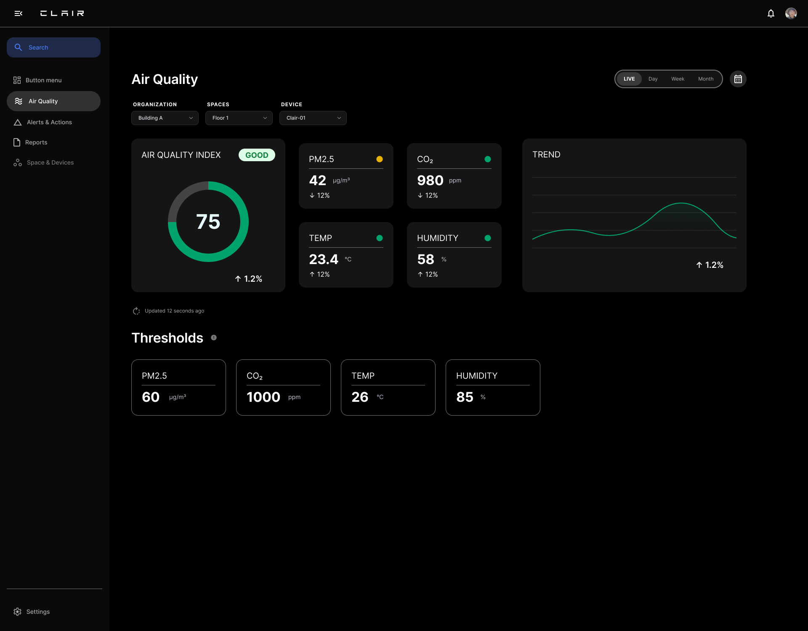

La pantalla ofrece una vision integral del estado ambiental mediante filtros por organizacion, espacio y dispositivo. Incluye el indicador Air Quality Index, tarjetas de metricas como PM2.5, CO2, temperatura y humedad, y un grafico de tendencias con vistas en tiempo real, dia, semana o mes.

**Alerts & Actions**

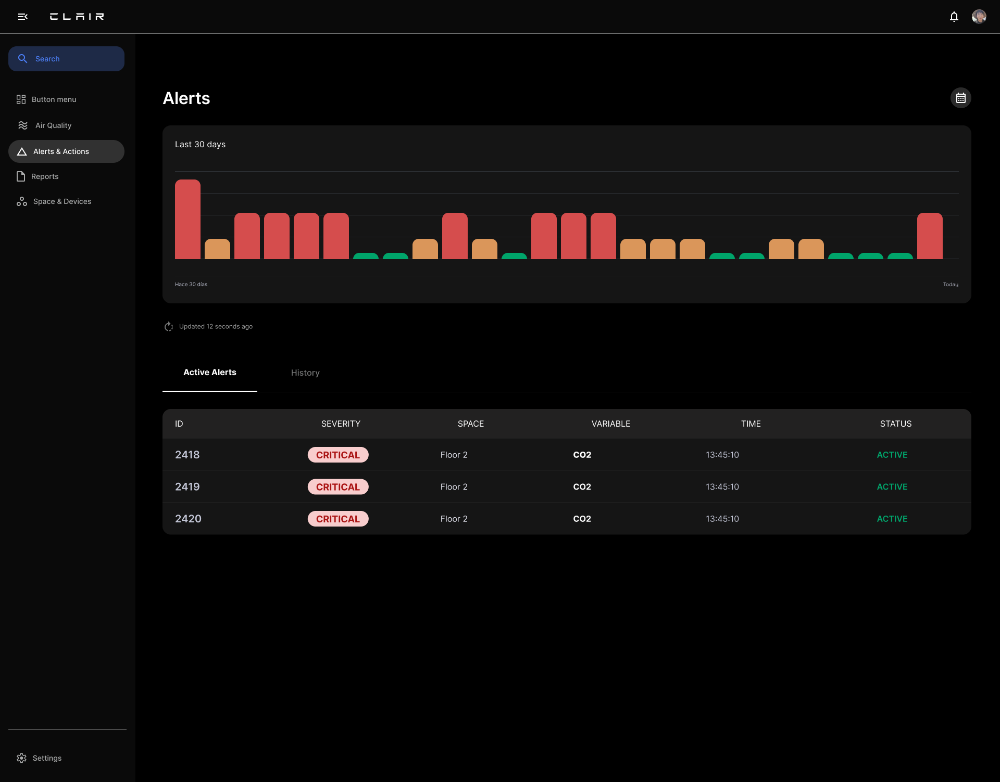

La pantalla centraliza el monitoreo de incidentes. Presenta un grafico de frecuencia y severidad de alertas, una tabla de alertas activas con identificador, severidad, ubicacion, variable, fecha y estado, y acceso a funciones de calidad del aire y reportes.

**Reports**

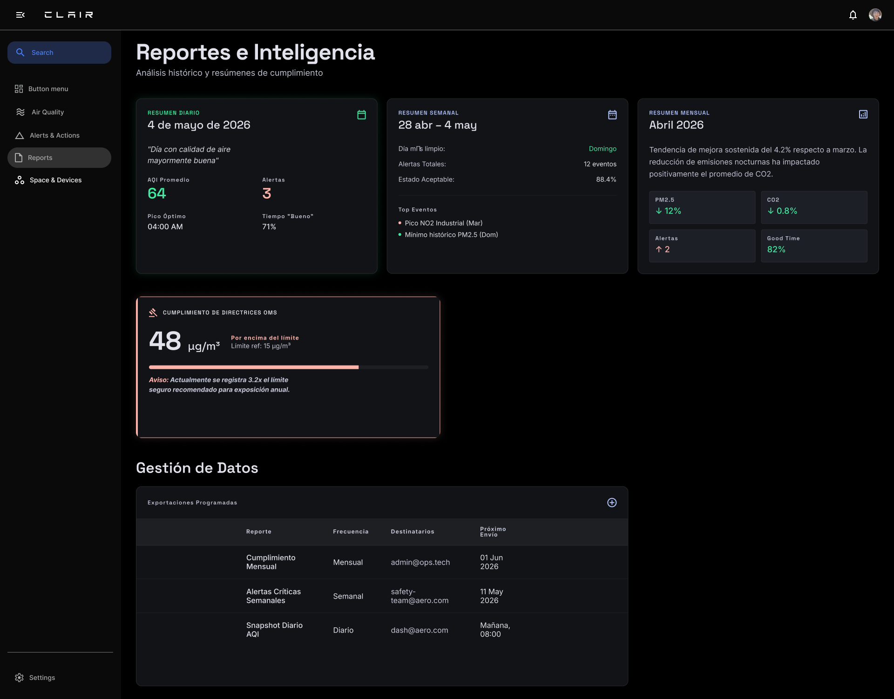

La seccion transforma datos complejos en resumenes estrategicos de cumplimiento. Utiliza tarjetas temporales para resumenes diarios, semanales y mensuales, visualizaciones de correlacion de particulas y un panel de exportaciones programadas dentro de una estetica dark mode profesional.

### 4.6.4. Web Applications User Flow Diagrams.

Esta seccion presenta los diagramas de flujo de los usuarios de la aplicacion web. Estos ilustran las rutas y procesos que siguen los usuarios dentro del sistema, facilitando la comprension de la navegacion y las interacciones clave.

**Web Application User Flow**

**User Flow: Gestion de alertas y acciones correctivas**

User Goals cubiertos:

| ID | User Goal |
|:---|:---|
| UG01 | Garantizar la salud ambiental: Mantener un aire fresco y libre de viciamento para que los clientes permanezcan mas tiempo en el local |
| UG03 | Optimizar la productividad: Evitar que los empleados sufran de fatiga o perdida de concentracion por mala ventilacion |

Ambos User Goals comparten el mismo flujo de interaccion. El usuario recibe una alerta automatica por niveles elevados de CO2 o VOC, accede a la pantalla Alerts & Actions y activa una respuesta correctiva preconfigurada. La diferencia radica en el proposito, pero la experiencia de usuario es identica.

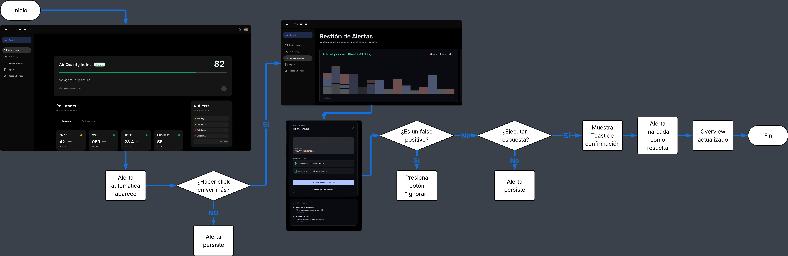

**User Flow: Generacion y gestion de reportes**

User Goals cubiertos:

| ID | User Goal |
|:---|:---|
| UG02 | Demostrar salubridad: Contar con evidencia tangible de que el local cumple con estandares de aire seguro para clientes y fiscalizaciones |
| UG05 | Validar acciones preventivas: Saber con certeza si los habitos de limpieza y ventilacion estan funcionando para mejorar la calidad del aire |

Ambos User Goals comparten el mismo flujo de interaccion. El usuario accede a Reports, selecciona el tipo de reporte, configura los parametros, genera el reporte y lo exporta. La diferencia radica en el proposito, pero la experiencia de usuario es identica.

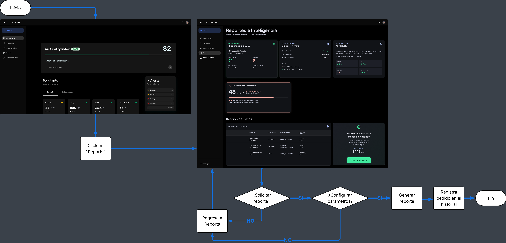

**User Flow: Configuracion de umbrales personalizados (Rules Builder)**

User Goals cubiertos:

| ID | User Goal |
|:---|:---|
| UG04 | Controlar sintomas cronicos: Reducir la frecuencia de episodios asociados al ambiente cargado |

El usuario accede a Alerts & Actions, navega a Rules Builder y configura reglas personalizadas basadas en sus alergias o sintomas. Define una metrica, un operador, un umbral especifico y una accion asociada. El sistema monitorea continuamente los sensores y, cuando se supera el umbral, dispara la accion configurada y genera una alerta preventiva en el Dashboard y en Alerts & Actions.

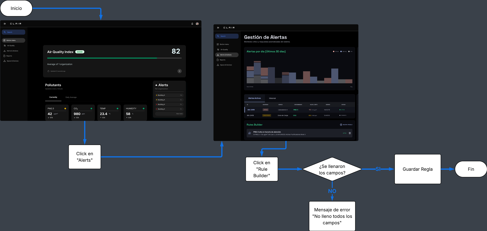

**User Flow: Verificacion de calidad del aire y cumplimiento de estandares**

User Goals cubiertos:

| ID | User Goal |
|:---|:---|
| UG06 | Crear un refugio seguro: Garantizar que el interior del hogar sea un espacio de respiracion pura a pesar de la contaminacion exterior |

El usuario accede a Air Quality para visualizar el indicador AQI y los registros de los sensores Clair. Opcionalmente, navega a Reports para consultar el widget de cumplimiento de directrices de la Organizacion Mundial de la Salud, que compara los valores actuales con los limites recomendados. Al verificar que el AQI es saludable y que se cumplen los estandares, confirma que el interior del hogar es un refugio seguro.

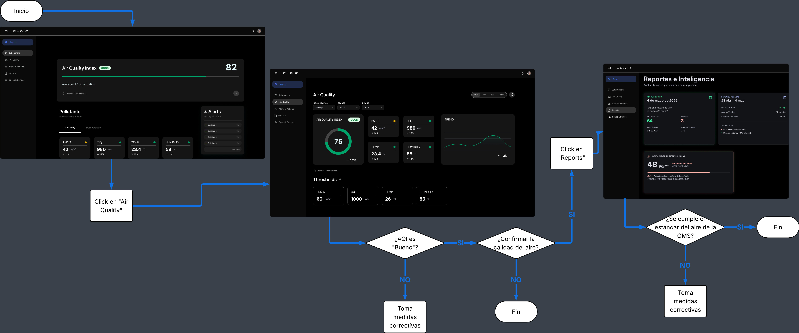

## 4.7. Web Applications Prototyping.

El prototipo de la aplicación web muestra la estructura general de navegación, el diseño de las principales vistas y las funcionalidades clave que tendrá la plataforma. Permite simular el flujo de navegación de los usuarios y visualizar cómo interactúan con los distintos módulos del sistema.

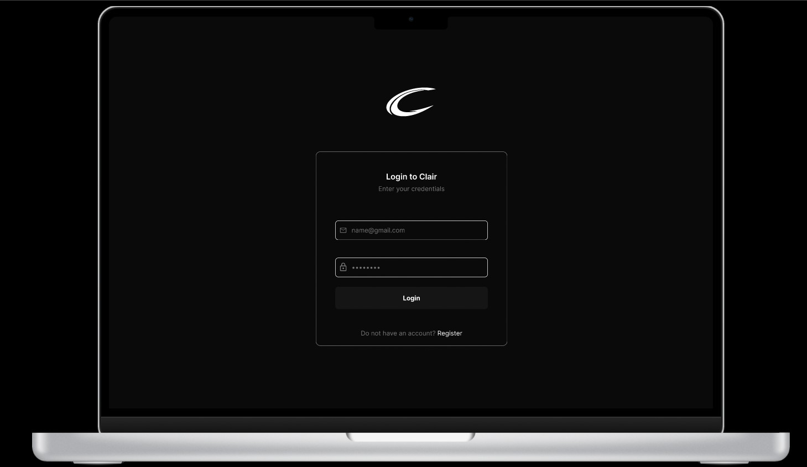

Web Application Prototype: https://sl1nk.com/1a68tor

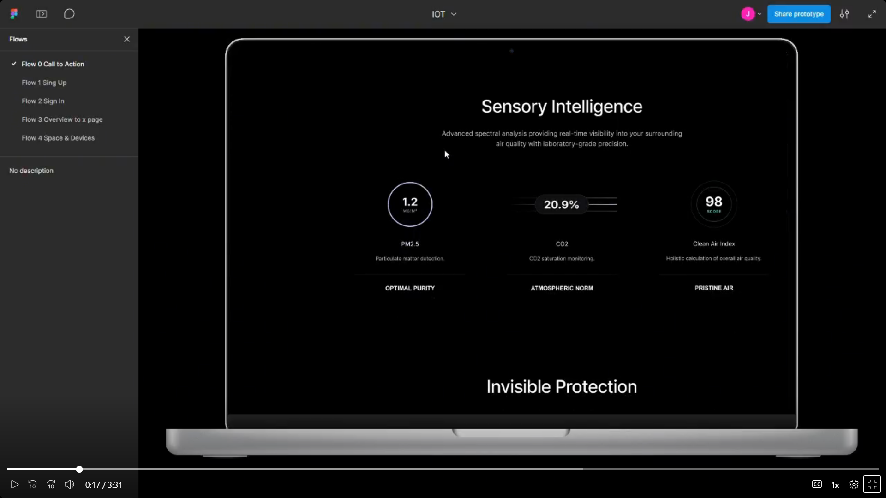

Video de presentación del prototipo Web Application: https://bit.ly/3Q84l7g

## 4.8. Domain-Driven Software Architecture.

### 4.8.1. Software Architecture Context Diagram.

El diagrama de contexto de sistema (System Context Diagram) representa el nivel de abstracción más alto de la arquitectura C4 para la plataforma **Vanana**. Este modelo delimita las fronteras del sistema de software principal, identificando sus interacciones directas con los actores y con los sistemas externos integrados en el ecosistema.

<p align="center">
  
</p>

Las interacciones clave representadas en el diagrama de contexto son las siguientes:

*   **Actores del Sistema:**
    *   **Home User y Facility Admin:** Interactúan directamente con la plataforma para la monitorización ambiental de sus respectivos entornos (hogares y locales comerciales). Ambos perfiles delegan la autenticación de sus credenciales al sistema externo de **Google** y la gestión de planes y transacciones monetarias al servicio de **Stripe**.
*   **Dispositivos de Hardware (Clair Hardware):**
    *   Los sensores y actuadores físicos establecen una comunicación bidireccional con la plataforma central, transmitiendo datos de telemetría de calidad del aire (CO₂, material particulado y temperatura) y ejecutando comandos automáticos de ventilación en respuesta a las evaluaciones ambientales.
*   **Servicios Externos de Soporte:**
    *   **Google OAuth2:** Provee el servicio de autenticación federada y validación de identidad.
    *   **Stripe:** Administra los flujos de cobro, procesamiento de pagos y el ciclo de vida de las suscripciones.
    *   **OneSignal:** Recibe peticiones de la plataforma para despachar notificaciones push a los dispositivos móviles de los usuarios.
    *   **Resend:** Gestiona el envío de correos electrónicos transaccionales con alertas críticas y reportes de analítica periódica.

### 4.8.2. Software Architecture Container Diagrams.

El **Container Diagram** (Diagrama de Contenedores) representa el Nivel 2 del modelo C4. Este diagrama detalla la composición interna de **Vanana Platform**, ilustrando cómo se distribuyen las responsabilidades del sistema entre los diferentes componentes ejecutables (aplicaciones web, móviles, bases de datos, brokers de mensajería y firmware embebido), especificando las tecnologías seleccionadas y los protocolos de comunicación utilizados.

<p align="center">
  
</p>

**Descripción de Contenedores y Decisiones Tecnológicas:**

*   **Aplicaciones Cliente (Frontend):**
    *   **Landing Page (HTML / CSS / JavaScript):** Sitio web estático público que presenta la propuesta de valor de la plataforma.
    *   **Single Page Application (SPA - Angular):** Aplicación web autenticada que permite a los administradores de instalaciones (Facility Admins) configurar espacios físicos, definir umbrales de alerta y visualizar paneles analíticos de calidad de aire en tiempo real.
    *   **Mobile App (Flutter):** Aplicación móvil multiplataforma orientada al usuario del hogar (Home User) para el monitoreo ágil y la recepción de notificaciones de alerta inmediata.
*   **Capa de Servicios de Backend:**
    *   **API Gateway (Spring Cloud Gateway / Java):** Punto único de entrada al backend encargado de la seguridad perimetral, balanceo de carga y enrutamiento de peticiones.
    *   **Platform API (Spring Boot / Java 25):** Núcleo de servicios empresariales que implementa las reglas de negocio críticas, incluyendo IAM, gestión de locales, e ingesta y evaluación de telemetría.
*   **Capa de Mensajería y Desacoplamiento:**
    *   **Kafka Message Broker (Apache Kafka):** Broker de mensajería asíncrona que desacopla la ingesta masiva de datos en el Edge del procesamiento interno de la plataforma, garantizando tolerancia a fallos y alta escalabilidad.
*   **Bases de Datos de la Plataforma:**
    *   **Platform PostgreSQL Database:** Almacenamiento relacional principal para entidades transaccionales (instalaciones, dispositivos asociados, históricos y preferencias).
    *   **Platform Redis Database:** Almacenamiento clave-valor en memoria utilizado para la gestión rápida de sesiones activas, tokens de seguridad temporales y control de tasas de peticiones (rate limiting).
*   **Capa IoT (Edge y Dispositivos Embebidos):**
    *   **Clair Embedded Application (Firmware Embebido):** Corre directamente sobre el microcontrolador físico del sensor. Mide los niveles ambientales y transmite los payloads localmente.
    *   **Clair Edge Station Application (Flask / Python):** Estación local que actúa como pasarela (Gateway local) para coordinar múltiples sensores Clair. Almacena temporalmente los datos en una **Edge SQLite Database** para garantizar la continuidad operativa ante pérdidas de conexión a Internet (sincronización offline).

**Protocolos y Mecanismos de Comunicación:**

*   **REST/HTTPS (JSON):** Utilizado para la comunicación síncrona entre las aplicaciones de cliente (Angular, Flutter, Edge Station) y el backend a través del API Gateway.
*   **Kafka Wire Protocol (TCP):** Utilizado para el envío asíncrono de lotes de telemetría desde la estación Edge hacia el broker de mensajería en la nube.
*   **JDBC/SQL:** Conexión nativa de base de datos para la persistencia transaccional entre Spring Boot y PostgreSQL.
*   **Redis Protocol (RESP):** Utilizado para operaciones de caché de baja latencia.

### 4.8.3. Software Architecture Components Diagrams.

#### 4.8.3.1 Bounded Context: Identity & Access (IAM)

Dentro del contenedor **Platform API**, el contexto acotado de **IAM** se organiza internamente siguiendo el patrón de arquitectura hexagonal estructurada en las cuatro capas tácticas (Interfaces, Application, Domain e Infrastructure).

<p align="center">
  
</p>

*   **IAM Interfaces (Component):** Recibe las solicitudes HTTP/HTTPS provenientes del API Gateway y las delega al servicio correspondiente en la capa de aplicación. Utiliza Spring Security para interceptar peticiones y validar los JWT de acceso de forma perimetral.
*   **IAM Application (Component):** Orquesta los casos de uso llamando a los modelos de dominio. Envía eventos e interactúa con el componente de infraestructura.
*   **IAM Domain (Component):** Mantiene los modelos enriquecidos de dominio y define las interfaces que actúan como contratos de persistencia.
*   **IAM Infrastructure (Component):** Implementa las interfaces de repositorio de dominio mediante tecnologías específicas (Spring Data JPA conectando a la base de datos relacional PostgreSQL, e integraciones con Redis y el SDK de Google).

#### 4.8.3.2 Bounded Context: Billing

A nivel de contenedores en la API principal, el contexto de Billing descompone sus responsabilidades a través de componentes en capas:

<p align="center">
  
</p>

*   **Billing Interfaces (Component):** Expone los controladores de checkout y recepción de webhooks de Stripe.
*   **Billing Application (Component):** Orquesta los comandos de creación de cobros y escucha de registros de usuarios.
*   **Billing Domain (Component):** Contiene el modelo lógico de cobro y límites del plan de usuario.
*   **Billing Infrastructure (Component):** Implementa la integración técnica con el SDK de Stripe y la base de datos PostgreSQL.

#### 4.8.3.3 Bounded Context: Device & Space Management

Organización de capas de componentes en el contenedor principal de la API para Device & Space Management:

<p align="center">
  
</p>

*   **DeviceSpace Interfaces (Component):** Expone las API HTTP REST para la manipulación de la organización y emparejamiento de hardware.
*   **DeviceSpace Application (Component):** Orquesta los casos de uso llamando al dominio y disparando publicadores.
*   **DeviceSpace Domain (Component):** Aloja las reglas de asignación y jerarquías lógicas de espacios.
*   **DeviceSpace Infrastructure (Component):** Implementa el acceso físico a las tablas relacionales y el encolamiento de eventos en Kafka.

#### 4.8.3.4 Bounded Context: Air Quality Evaluation

Dentro del backend de Platform API, las capas tácticas de Air Quality Evaluation se representan bajo los siguientes componentes organizados:

<p align="center">
  
</p>

*   **AirQuality Interfaces (Component):** Expone las API HTTP y la Fachada interna de consulta del aire.
*   **AirQuality Application (Component):** Procesa de forma reactiva los eventos procedentes de Kafka y ejecuta comandos de persistencia.
*   **AirQuality Domain (Component):** Modela la estructura lógica de los gases y partículas finas.
*   **AirQuality Infrastructure (Component):** Implementa el repositorio conectándose a PostgreSQL para almacenar el histórico ambiental.

#### 4.8.3.5  Bounded Context: Alerting & Response

Estructuración de componentes internos para Alerting & Response en el contenedor principal de la API:

<p align="center">
  
</p>

*   **Alerting Interfaces (Component):** Expone las API HTTP REST para la auditoría y gestión de alertas.
*   **Alerting Application (Component):** Consume lecturas e inicia la evaluación y despacho de eventos de incidentes.
*   **Alerting Domain (Component):** Define las reglas lógicas de incidentes y estados de severidad.
*   **Alerting Infrastructure (Component):** Conecta a PostgreSQL para almacenamiento y encola avisos en el broker de Kafka.

#### 4.8.3.6 Bounded Context: Analytics & Reporting

Organización de capas de componentes en el contenedor principal de la API para Analytics & Reporting:

<p align="center">
  
</p>

*   **Analytics Interfaces (Component):** Expone las API HTTP REST y gestiona las conexiones abiertas para streams SSE.
*   **Analytics Application (Component):** Orquesta los schedulers, consume del bus de Kafka y escribe en memoria caché.
*   **Analytics Domain (Component):** Modela las fórmulas oficiales de AQI y agregaciones estadísticas.
*   **Analytics Infrastructure (Component):** Persiste los reportes e históricos de snapshots en las tablas relacionales de PostgreSQL.

#### 4.8.3.7 Bounded Context: Analytics & Notifications

Organización de componentes en el Platform API para el contexto acotado de Notifications:

<p align="center">
  
</p>

*   **Notifications Interfaces (Component):** Expone las interfaces REST y fachadas de llamadas internas.
*   **Notifications Application (Component):** Procesa eventos de incidentes de Kafka y formatea los templates de emails.
*   **Notifications Domain (Component):** Modela el estado lógico de envíos de alertas y correos.
*   **Notifications Infrastructure (Component):** Implementa el cliente SMTP, la integración HTTP de OneSignal y la persistencia JPA a PostgreSQL.

## 4.9. Software Object-Oriented Design.

### 4.9.1. Class Diagrams.

#### 4.9.1.1 Bounded Context: Identity & Access (IAM)

##### 4.9.1.1.1 Domain Layer

La capa de dominio de IAM contiene las reglas fundamentales de negocio independientes de cualquier infraestructura. Define las entidades críticas del ciclo de vida de usuario y las abstracciones de persistencia (puertos).

<p align="center">
  
</p>

*   **Entities y Aggregates:** `User` actúa como la raíz de agregado que mantiene la identidad de la persona y sus vinculaciones externas (como Google). `TokenSession` es la entidad que administra la sesión del usuario a nivel de tokens JWT, permitiendo su revocación inmediata (`invalidate()`). `RegistrationSession` resguarda de manera temporal la contraseña encriptada y el código de verificación del flujo de registro.
*   **Value Objects:** `EmailAddress`, `Password` y `VerificationCode` encapsulan las restricciones estructurales y aseguran la validez y encapsulamiento de los datos del dominio desde el momento de su instanciación.
*   **Ports (Interfaces):** `UserRepository`, `TokenSessionRepository` y `RegistrationSessionRepository` definen las operaciones lógicas de almacenamiento sin depender de tecnologías específicas como JPA o Redis.

##### 4.9.1.1.2 Interface Layer

La capa de interfaz expone las API REST del contexto acotado, traduciendo las peticiones JSON HTTP externas en comandos de aplicación fuertemente tipados.

<p align="center">
  
</p>

*   **AuthenticationController:** Expone endpoints HTTP estándar para el registro local (`signUp`), confirmación vía código por correo (`confirmSignUp`), inicio de sesión (`signIn`), renovación de tokens (`refreshToken`) y cierre de sesión (`signOut`).
*   **GoogleOAuthController:** Administra el flujo federado de OpenID Connect. Redirecciona al usuario al servidor de autorización de Google y recibe el código de autorización en el endpoint de callback para autenticar la sesión.
*   **UserController:** Controlador simple que recupera los datos del perfil del usuario autenticado con base en la sesión de seguridad actual.

##### 4.9.1.1.3 Application Layer

Esta capa actúa como el orquestador principal del contexto acotado. Implementa los casos de uso definidos del sistema, interactuando con las interfaces de dominio y coordinando el flujo de las transacciones sin contener lógica de negocio directa.

<p align="center">
  
</p>

*   **Command Handlers:** `UserCommandServiceImpl` implementa la lógica para iniciar el registro enviando un código de confirmación asíncrono (`InitiateRegistrationCommand`) y para validar el código y persistir definitivamente al usuario en el sistema (`ConfirmRegistrationCommand`).
*   **TokenCommandServiceImpl:** Orquesta las transacciones relacionadas con la sesión de tokens, controlando la persistencia de las firmas de tokens de refresco y su rotación segura para mitigar ataques de replay.
*   **GoogleOAuthCallbackApplicationService:** Orquesta el flujo de inicio de sesión social. Convierte el código de Google en un perfil de usuario verificado y delega la creación de tokens en el servicio de tokens de la aplicación.
*   **AsyncNotificationService (Port):** Interfaz que permite al servicio de aplicación delegar el envío de correos electrónicos a un sistema de mensajería asíncrono o un proveedor de correo externo sin acoplarse directamente a este.

##### 4.9.1.1.4 Infrastructure Layer

La capa de infraestructura implementa las interfaces de dominio (puertos) y provee los adaptadores concretos para interactuar con bases de datos relacionales, almacenamiento en memoria caché Redis, servicios OAuth2 y generadores de tokens criptográficos.

<p align="center">
  
</p>

*   **Adaptadores de Persistencia:** `JpaUserRepository` utiliza Spring Data JPA e Hibernate para persistir usuarios en la base de datos central PostgreSQL. Para las sesiones de tokens y registro temporal de alta volatilidad, `RedisTokenSessionRepository` y `RedisRegistrationSessionRepository` encapsulan el acceso mediante `StringRedisTemplate`, configurando tiempos de expiración automáticos (TTL).
*   **GoogleTokenVerifierImpl:** Adaptador que consume las librerías cliente de Google para validar de forma criptográfica la autenticidad del ID Token recibido durante el flujo de OAuth2.
*   **JwtTokenEncoder:** Clase de infraestructura encargada de firmar algoritmos criptográficos HMAC-SHA256 para generar los Access Tokens (de corta duración) y Refresh Tokens (de larga duración).

#### 4.9.1.2 Bounded Context: Billing

##### 4.9.1.2.1 Domain Layer

La capa de dominio de Billing resguarda la consistencia del modelo de monetización y límites de la plataforma.

<p align="center">
  
</p>

*   **Entities y Aggregates:** `UserPlan` mantiene las reglas de upgrade/downgrade temporal, determinando si el periodo de cobro ha expirado. `PaymentRecord` almacena el estado de cada pago (`PENDING`, `COMPLETED`, `FAILED`).
*   **Value Objects:** `Money` encapsula el monto y divisa de transacciones, mientras que `UserId` e `PlanType` regulan tipados y accesos.
*   **Ports:** `PaymentGateway` abstrae la lógica del cobro para no depender directamente de las librerías de Stripe a nivel de dominio.

##### 4.9.1.2.2 Interface Layer

Se encarga de recibir peticiones de cobro web y registrar webhooks provenientes de la pasarela de pagos.

<p align="center">
  
</p>

*   **SubscriptionController:** Permite a los clientes iniciar la pasarela de checkout redirigiendo al portal de Stripe.
*   **StripeWebhookController:** Endpoint de escucha perimetral que recibe y valida firmas HMAC de Stripe para autorizar el cobro y aprovisionar el plan del usuario de forma asíncrona.
*   **BillingContextFacade:** Puerto expuesto internamente que permite a contextos externos (como Device Management) consultar los límites del plan (`getMaxDevices()`) para denegar emparejamientos si el plan del usuario es Freemium y ya alcanzó su cupo.

##### 4.9.1.2.3 Application Layer

Se encarga de recibir peticiones de cobro web y registrar webhooks provenientes de la pasarela de pagos.

<p align="center">
  
</p>

*   **SubscriptionController:** Permite a los clientes iniciar la pasarela de checkout redirigiendo al portal de Stripe.
*   **StripeWebhookController:** Endpoint de escucha perimetral que recibe y valida firmas HMAC de Stripe para autorizar el cobro y aprovisionar el plan del usuario de forma asíncrona.
*   **BillingContextFacade:** Puerto expuesto internamente que permite a contextos externos (como Device Management) consultar los límites del plan (`getMaxDevices()`) para denegar emparejamientos si el plan del usuario es Freemium y ya alcanzó su cupo.

##### 4.9.1.2.4 Infrastructure Layer

Provee la comunicación externa con Stripe y la persistencia de datos financieros.

<p align="center">
  
</p>

*   **StripePaymentGatewayAdapter:** Consume la API externa de Stripe para generar enlaces de pago de manera dinámica.
*   **Adaptadores de base de datos:** `JpaUserPlanRepository` y `JpaPaymentRecordRepository` realizan la persistencia relacional en PostgreSQL para garantizar transacciones ACID.

#### 4.9.1.3 Bounded Context: Device & Space Management

##### 4.9.1.3.1 Domain Layer

La capa de dominio define el inventario físico y la jerarquía organizacional del sistema.

<p align="center">
  
</p>

*   **Entities y Aggregates:** `Device` es el agregado de hardware. `DeviceAssignment` es la raíz de agregado que controla si un dispositivo está online/offline y en qué espacio físico y usuario está asignado. `DeviceCommand` controla el ciclo de vida de confirmación de órdenes. `Organization` y `Space` estructuran la geografía física de los sensores.
*   **Value Objects:** `HardwareId` (ID físico MAC/serie) y `ApiKey` (clave criptográfica de comunicación del sensor).
*   **Ports:** Interfaces de repositorio (`DeviceRepository`, `DeviceAssignmentRepository`, `DeviceCommandRepository`, `OrganizationRepository`, `SpaceRepository`).

##### 4.9.1.3.2 Interface Layer

Provee la interfaz REST para la gestión física del hardware y la estructuración espacial.

<p align="center">
  
</p>

*   **DeviceController:** Registra y empareja dispositivos en el sistema.
*   **DeviceThresholdController:** Endpoint para configurar los límites seguros de las lecturas.
*   **OrganizationController y SpaceController:** API para configurar la estructura de locales y áreas.

##### 4.9.1.3.3 Application Layer

Orquesta los flujos de configuración del entorno e ingesta/acciones del hardware.

<p align="center">
  
</p>

*   **DeviceCommandServiceImpl:** Coordina el emparejamiento seguro de dispositivos, validando las existencias de espacio y publicando en Kafka los cambios de asignación.
*   **DeviceControlCommandServiceImpl:** Administra el envío y despacho de comandos asíncronos para activar extractores o ventanas de ventilación inteligentes.
*   **SpaceCommandServiceImpl:** Orquesta el ciclo de vida del local, verificando a través del servicio externo `BillingContextFacade` (comunicación inter-contexto) si el plan del usuario tiene permisos para crear nuevos espacios.

##### 4.9.1.3.4 Infrastructure Layer

Proporciona persistencia SQL relacional para la configuración e integra mensajería Kafka.

<p align="center">
  
</p>

*   **Adaptadores de Persistencia:** Repositorios Spring Data JPA que implementan los puertos de dominio para PostgreSQL.
*   **Kafka Publishers:** Adaptadores `ProvisioningDevicesChangedKafkaPublisher` y `DeviceCommandsPendingKafkaPublisher` que formatean y transmiten los payloads hacia las colas correspondientes de Apache Kafka.

#### 4.9.1.4 Bounded Context: Air Quality Evaluation

##### 4.9.1.4.1 Domain Layer

La capa de dominio modela las especificaciones físicas de calidad del aire y la integridad de las lecturas ambientales.

<p align="center">
  
</p>

*   **Entities y Aggregates:** `TelemetryEvaluation` representa el agregado principal que encapsula el estado físico del aire medido en un punto temporal específico.
*   **Value Objects:** `AirQuality` (parámetros de gases y ambiente), `ParticulateMatter` (concentración de polvo PM1.0, PM2.5, PM10), `Connectivity` (diagnóstico de señal), `Location` (país de reporte) y `DeviceId`.
*   **Ports:** `TelemetryEvaluationRepository` es el puerto de repositorio para guardar y recuperar mediciones.

##### 4.9.1.4.2 Interface Layer

Provee los endpoints HTTP y fachadas internas para consultar las evaluaciones y estados ambientales.

<p align="center">
  
</p>

*   **TelemetryEvaluationController:** Expone endpoints RESTful para obtener la telemetría en tiempo real de un dispositivo o su histórico paginado de evaluaciones.
*   **EvaluationContextFacade:** Fachada de comunicación interna utilizada por el contexto acotado de Analytics & Reporting para recuperar consolidados de telemetría horaria sin acoplarse a los repositorios de este contexto.

##### 4.9.1.4.3 Application Layer

Orquesta la ingesta de eventos de telemetría y ejecuta los flujos de consulta ambiental.

<p align="center">
  
</p>

*   **TelemetryRecordedKafkaConsumer (Event Handler):** Suscriptor de Kafka que escucha de forma reactiva y no bloqueante los eventos del bus de mensajería asíncrona cuando un sensor Clair reporta telemetría.
*   **TelemetryEvaluationCommandServiceImpl:** Recibe el comando de validación, realiza los cálculos de salubridad y guarda la evaluación con base en los umbrales configurados.
*   **ExternalDeviceService (Port):** Puerto para interactuar de forma segura con el contexto de `Device Management` y validar la existencia y propietario de los sensores.

##### 4.9.1.4.4 Infrastructure Layer

Provee el acceso físico al motor de series temporales/PostgreSQL.

<p align="center">
  
</p>

*   **JpaTelemetryEvaluationRepository:** Adaptador que traduce las consultas y escrituras del dominio en sentencias SQL a través de Spring Data JPA sobre PostgreSQL.

#### 4.9.1.5 Bounded Context: Alerting & Response

##### 4.9.1.5.1 Domain Layer

La capa de dominio gestiona la lógica del ciclo de vida de los incidentes y las reglas de severidad del aire.

<p align="center">
  
</p>

*   **Entities y Aggregates:** `Alert` actúa como agregado que encapsula los datos puntuales del incidente, implementando los métodos de negocio `acknowledge()` (acuse de recibo humano) y `resolve()` (cierre técnico de la alerta).
*   **Value Objects / Enums:** Enums `MetricType` (CO₂, PM2.5, temperatura, humedad), `AlertStatus` y `AlertSeverity`.
*   **Ports:** `AlertRepository` define el contrato para almacenar y consultar alertas activas de sensores.

##### 4.9.1.5.2 Interface Layer

Expone las API para la consulta de incidentes y provee fachadas para la interacción inter-contextos.

<p align="center">
  
</p>

*   **AlertController:** Controlador REST para listar alertas e incidentes históricos o activos por local o dispositivo.
*   **AlertingContextFacade:** Fachada de comunicación directa utilizada para que otros contextos de la aplicación consulten la gravedad de un incidente específico de forma rápida.

##### 4.9.1.5.3 Application Layer

Orquesta la evaluación reactiva de las lecturas físicas e inicia el despacho de notificaciones de incidentes.

<p align="center">
  
</p>

*   **AlertingTelemetryRecordedKafkaConsumer:** Listener asíncrono que procesa las lecturas de telemetría emitidas en el broker.
*   **AlertCommandServiceImpl:** Resuelve el caso de uso central: analiza la lectura recibida contra los umbrales configurados (obtenidos mediante `ExternalAlertingThresholdService`). Si hay transgresión y no existe una alerta activa para esa métrica, crea un nuevo incidente `Alert` y publica un evento `AlertIncidentChangedIntegrationEvent` en Kafka.
*   **Ports de consulta:** `ExternalAlertingDeviceService` y `ExternalAlertingThresholdService` resuelven datos de otros contextos de forma desacoplada.

##### 4.9.1.5.4 Infrastructure Layer

Provee almacenamiento relacional SQL y control del encolamiento de eventos de incidentes.

<p align="center">
  
</p>

*   **JpaAlertRepository:** Adaptador concreto que persiste los registros de incidentes en PostgreSQL.
*   **AlertIncidentsChangedKafkaPublisher:** Adaptador que despacha los eventos de integración de alertas abiertas/resueltas a colas de Apache Kafka.

#### 4.9.1.6 Bounded Context: Analytics & Reporting

##### 4.9.1.6.1 Domain Layer

La capa de dominio de Analytics implementa las estructuras estadísticas y cálculos matemáticos para reportes y AQI.

<p align="center">
  
</p>

*   **Entities y Aggregates:** `DeviceDailySummary` y `DeviceMonthlySummary` son los agregados a largo plazo que consolidan el historial de calidad del aire. `DeviceAnalyticsSnapshot` es la entidad utilizada para agrupar lecturas en micro-ventanas de análisis.
*   **Value Objects:** `MetricStats` (mín/máx/promedio), `AqiCategoryBreakdown` (distribución de riesgo diario), `AirQualityIndex` e `DeviceId`.
*   **Domain Services:** `AqiCalculationDomainService` (calcula el índice oficial de calidad del aire), `MetricsAggregationDomainService` (funciones estadísticas de agregación) y `TrendAnalysisDomainService` (análisis de variación de contaminantes).

##### 4.9.1.6.2 Interface Layer

Provee interfaces para la visualización en vivo de métricas y la descarga de resúmenes estructurados.

<p align="center">
  
</p>

*   **AnalyticsController:** Provee endpoints tradicionales para consultar métricas, así como conexiones asíncronas persistentes basadas en Server-Sent Events (SSE) a través de `SseEmitter` para empujar lecturas en vivo a las aplicaciones cliente sin sobrecargar el servidor.
*   **AnalyticsOverviewController:** Consolida los indicadores de salud y estados de conexión para la vista del panel principal.
*   **ReportController:** Expone la obtención de reportes diarios y mensuales, validando la autorización mediante llamadas desacopladas.

##### 4.9.1.6.3 Application Layer

Orquesta los flujos de analítica en tiempo real y el procesamiento diferido de reportes por lotes (*batch*).

<p align="center">
  
</p>

*   **KpiLiveMetricsCommandServiceImpl:** Recibe eventos de Kafka en caliente, actualiza un caché rápido en memoria `KpiLiveMetricsCache` y transmite la información vía SSE.
*   **Daily/Monthly Report Aggregation Service:** Tareas del sistema que leen de forma asíncrona datos del día/mes anterior para consolidar métricas transaccionales masivas.
*   **SnapshotAggregationScheduler:** Componente temporizado que ejecuta periódicamente promedios de telemetría y los guarda en base de datos.

##### 4.9.1.6.4 Infrastructure Layer

Implementa la persistencia a largo plazo para agregados analíticos.

<p align="center">
  
</p>

*   **Adaptadores de Repositorio:** `JpaDeviceAnalyticsSnapshotRepository`, `DeviceDailySummaryRepository` y `DeviceMonthlySummaryRepository` implementan los puertos de dominio persistiendo en PostgreSQL.

#### 4.9.1.7 Bounded Context: Analytics & Notifications

##### 4.9.1.7.1 Domain Layer

La capa de dominio de Notifications contiene los modelos para auditoría de entrega de mensajes y los puertos de infraestructura.

<p align="center">
  
</p>

*   **Entities y Aggregates:** `EmailLog` (auditoría de correos enviados, registrando errores si fallan) y `PushNotificationLog` (auditoría de notificaciones móviles con su respectivo ID externo del proveedor).
*   **Value Objects:** `EmailRecipient` (correo destinatario), `EmailSubject` y `EmailContent`.
*   **Ports:** Interfaces de servicios técnicos (`EmailDeliveryService`, `PushNotificationDeliveryService`) e interfaces de repositorio (`EmailLogRepository`, `PushNotificationLogRepository`).

##### 4.9.1.7.2 Interface Layer

Expone las fachadas internas del sistema para delegar envíos de forma rápida.

<p align="center">
  
</p>

*   **NotificationController:** Endpoint REST utilitario de prueba.
*   **NotificationsContextFacade:** Fachada de comunicación directa que permite al contexto de IAM gatillar el envío de códigos de confirmación de forma síncrona sin acoplarse a SMTP.

##### 4.9.1.7.3 Application Layer

Orquesta los flujos de mensajería y procesa los eventos procedentes del bus asíncrono.

<p align="center">
  
</p>

*   **AlertIncidentChangedKafkaConsumer:** Listener asíncrono que reacciona de forma inmediata a los eventos de incidentes modificados. Cuando una alerta crítica es detectada, consulta al contexto de dispositivo (`ExternalDeviceService`) para obtener al propietario y despacha la notificación push.
*   **EmailCommandServiceImpl:** Recibe comandos para formatear plantillas de correos electrónicos transaccionales y delega la transmisión física al servicio de entrega.

##### 4.9.1.7.4 Infrastructure Layer

Conecta la aplicación a servidores de correo electrónico y servicios externos de mensajería push.

<p align="center">
  
</p>

*   **SmtpEmailService:** Adaptador SMTP estándar.
*   **OneSignalPushNotificationService:** Adaptador que realiza peticiones HTTP seguras a la API de OneSignal para encolar las alertas push móviles.
*   **Repositorios JPA:** Adaptadores Spring Data JPA para la persistencia del log histórico en PostgreSQL.

### 4.9.2. Class Dictionary.

#### 4.9.2.1 Bounded Context: Identity & Access (IAM)

El contexto acotado de **Identity & Access Management (IAM)** gestiona el registro de nuevos usuarios, la autenticación segura, el control de acceso basado en roles y el inicio de sesión federado (Google OAuth2). Asegura que los recursos de la plataforma Vanana estén protegidos y que solo los usuarios autorizados puedan interactuar con los sensores y actuadores.

**Diccionario de Clases del Contexto IAM**

A continuación, se detallan las clases principales identificadas para este contexto, clasificadas por capa de arquitectura:

| Nombre de la Clase              | Capa            | Propósito / Responsabilidad                                  | Atributos Principales                                        | Métodos Clave                                                | Relaciones de Asociación / Dependencia                       |
| :------------------------------ | :-------------- | :----------------------------------------------------------- | :----------------------------------------------------------- | :----------------------------------------------------------- | :----------------------------------------------------------- |
| **User**                        | Dominio         | Representa la entidad de usuario en la plataforma. Actúa como raíz de agregado (*Aggregate Root*). | `id` (UUID), `email` (EmailAddress), `password` (Password), `status` (UserStatus), `googleUserId` (GoogleUserId) | `confirm()`, `linkGoogleAccount(googleUserId)`               | Contiene `EmailAddress` y `Password`.                        |
| **TokenSession**                | Dominio         | Representa una sesión activa de JWT emitida para un usuario específico. | `jti` (TokenJti), `userId` (UserId), `refreshToken` (String), `tokenType` (TokenType), `expiresAt` (Instant) | `invalidate()`                                               | Contiene `UserId`.                                           |
| **RegistrationSession**         | Dominio         | Entidad temporal que mantiene el estado de registro de un usuario pendiente de confirmación. | `id` (RegistrationSessionId), `email` (EmailAddress), `password` (Password), `verificationCode` (VerificationCode), `expiresAt` (Instant) | *N/A*                                                        | Contiene `EmailAddress`, `Password` y `VerificationCode`.    |
| **EmailAddress**                | Dominio         | Objeto de Valor (*Value Object*) que encapsula la lógica de validación del correo electrónico. | `value` (String)                                             | *N/A*                                                        | Composición en `User` y `RegistrationSession`.               |
| **Password**                    | Dominio         | Objeto de Valor que maneja el hash encriptado de la contraseña. | `encryptedValue` (String)                                    | *N/A*                                                        | Composición en `User` y `RegistrationSession`.               |
| **VerificationCode**            | Dominio         | Objeto de Valor que representa el código de 6 dígitos enviado por email. | `value` (String)                                             | *N/A*                                                        | Composición en `RegistrationSession`.                        |
| **UserRepository**              | Dominio         | Interfaz (Puerto) que define los métodos de persistencia del Agregado `User`. | *N/A*                                                        | `save()`, `findById()`, `findByEmail()`, `findByGoogleUserId()` | Utilizado por `UserCommandServiceImpl` e `UserQueryServiceImpl`. |
| **TokenSessionRepository**      | Dominio         | Interfaz (Puerto) para gestionar el ciclo de vida de persistencia rápida de `TokenSession`. | *N/A*                                                        | `save()`, `findByJti()`, `deleteByJti()`                     | Utilizado por `TokenCommandServiceImpl` y `TokenQueryServiceImpl`. |
| **GoogleTokenVerifier**         | Dominio         | Interfaz (Servicio de Dominio) para verificar tokens de identidad emitidos por Google. | *N/A*                                                        | `verify(idToken)`                                            | Utilizado por `GoogleAuthenticationCommandServiceImpl`.      |
| **AuthenticationController**    | Interfaz        | Controlador REST de entrada para flujos de autenticación local. | `userCommandService`, `tokenCommandService`                  | `signUp()`, `confirmSignUp()`, `signIn()`, `refreshToken()`, `signOut()` | Depende de `UserCommandServiceImpl` y `TokenCommandServiceImpl`. |
| **GoogleOAuthController**       | Interfaz        | Controlador REST para manejar la redirección y el callback de Google OAuth2. | `googleOAuthStateManager`, `googleOAuthCallbackApplicationService` | `redirectToGoogle()`, `handleCallback()`                     | Depende de `GoogleOAuthCallbackApplicationService`.          |
| **UserCommandServiceImpl**      | Aplicación      | Servicio de aplicación que orquesta el registro inicial y la confirmación mediante código. | `userRepository`, `registrationSessionRepository`, `asyncNotificationService` | `handle(InitiateRegistrationCommand)`, `handle(ConfirmRegistrationCommand)` | Usa `UserRepository`, `RegistrationSessionRepository` y `AsyncNotificationService`. |
| **TokenCommandServiceImpl**     | Aplicación      | Servicio de aplicación para la creación, rotación e invalidación de tokens JWT. | `tokenSessionRepository`, `userRepository`, `jwtTokenEncoder` | `handle(CreateTokenSessionCommand)`, `handle(RotateRefreshTokenCommand)`, `handle(InvalidateTokenSessionCommand)` | Usa `TokenSessionRepository`, `UserRepository` y `JwtTokenEncoder`. |
| **JpaUserRepository**           | Infraestructura | Adaptador concreto de persistencia relacional que interactúa con PostgreSQL mediante JPA. | *N/A*                                                        | `findByEmail()`, `existsByEmail()`                           | Implementa `UserRepository`.                                 |
| **RedisTokenSessionRepository** | Infraestructura | Adaptador concreto para almacenar y verificar sesiones de tokens de forma rápida en caché Redis. | `redisTemplate`, `objectMapper`                              | `save()`, `findByJti()`, `deleteByJti()`, `revokeAllTokensForUser()` | Implementa `TokenSessionRepository`.                         |

#### 4.9.2.2 Bounded Context: Billing

El contexto acotado de **Billing** es responsable de administrar el modelo de monetización de la plataforma. Controla las pasarelas de pago, los límites operativos impuestos a los usuarios según su plan (Freemium o Premium) y el procesamiento de suscripciones mensuales, integrándose de forma directa con la API externa de Stripe.

**Diccionario de Clases del Contexto Billing**

A continuación, se detallan las clases principales identificadas para este contexto, clasificadas por capa de arquitectura:

| Nombre de la Clase                 | Capa            | Propósito / Responsabilidad                                  | Atributos Principales                                        | Métodos Clave                                                | Relaciones de Asociación / Dependencia                       |
| :--------------------------------- | :-------------- | :----------------------------------------------------------- | :----------------------------------------------------------- | :----------------------------------------------------------- | :----------------------------------------------------------- |
| **UserPlan**                       | Dominio         | Entidad raíz que define el plan de suscripción asignado a un usuario y sus fechas de vigencia. | `id` (UUID), `userId` (UserId), `planType` (PlanType), `startDate` (LocalDate), `endDate` (LocalDate) | `upgradeToPremium()`, `downgradeToFreemium()`, `isPremiumExpired()` | Contiene `UserId` y `PlanType`.                              |
| **PaymentRecord**                  | Dominio         | Entidad que registra el historial de cobros y transacciones de los usuarios. | `id` (UUID), `userId` (UserId), `amount` (Money), `status` (PaymentStatus), `stripePaymentIntentId` (String) | `markAsCompleted()`                                          | Contiene `UserId`, `Money` y `PaymentStatus`.                |
| **PaymentGateway**                 | Dominio         | Interfaz (Puerto) que define los métodos de interacción con pasarelas de cobro externas. | *N/A*                                                        | `createCheckoutSession()`, `createPaymentIntent()`           | Implementado por `StripePaymentGatewayAdapter`.              |
| **UserPlanRepository**             | Dominio         | Interfaz de repositorio para persistir y consultar el plan de un usuario. | *N/A*                                                        | `save()`, `findByUserId()`                                   | Utilizado por los servicios de comando y consulta de suscripciones. |
| **PaymentRecordRepository**        | Dominio         | Interfaz de repositorio para persistir transacciones financieras. | *N/A*                                                        | `save()`, `findByStripePaymentIntentId()`, `findByUserId()`  | Utilizado por los servicios de comando y consulta de suscripciones. |
| **SubscriptionController**         | Interfaz        | Controlador REST que expone endpoints para iniciar checkouts, degradar cuentas y ver planes activos. | `subscriptionCommandService`, `subscriptionQueryService`     | `createCheckoutSession()`, `getSubscriptionsByUserId()`, `downgradeToFreemium()` | Depende de `SubscriptionCommandServiceImpl` y `SubscriptionQueryServiceImpl`. |
| **StripeWebhookController**        | Interfaz        | Controlador de entrada que procesa eventos asíncronos enviados por webhooks de Stripe. | `subscriptionCommandService`, `stripeWebhookSecret`          | `handleWebhook()`                                            | Depende de `SubscriptionCommandServiceImpl`.                 |
| **BillingContextFacade**           | Interfaz        | Fachada expuesta para que otros contextos consulten límites de negocio (suscripción activa del usuario). | *N/A*                                                        | `getMaxOrganizations()`, `getMaxSpaces()`, `getMaxDevices()` | Implementado por `BillingContextFacadeImpl`.                 |
| **SubscriptionCommandServiceImpl** | Aplicación      | Servicio de aplicación que procesa comandos para actualizar suscripciones y registrar pagos exitosos. | `paymentGateway`, `paymentRecordRepository`, `userPlanRepository` | `handle(CreateCheckoutSessionCommand)`, `handle(FulfillSubscriptionCommand)` | Usa `PaymentGateway`, `PaymentRecordRepository` y `UserPlanRepository`. |
| **SubscriptionQueryServiceImpl**   | Aplicación      | Servicio de aplicación para consultar registros de pago e historial de planes activos. | `userPlanRepository`, `paymentRecordRepository`              | `handle(GetSubscriptionByIdQuery)`, `resolveUserPlan()`      | Usa `UserPlanRepository` y `PaymentRecordRepository`.        |
| **StripePaymentGatewayAdapter**    | Infraestructura | Adaptador que implementa el puerto `PaymentGateway` utilizando el SDK de Stripe. | `stripeApiKey`                                               | `createCheckoutSession()`, `createPaymentIntent()`           | Implementa `PaymentGateway`.                                 |
| **JpaUserPlanRepository**          | Infraestructura | Adaptador JPA que implementa `UserPlanRepository` para almacenar planes en PostgreSQL. | *N/A*                                                        | *N/A*                                                        | Implementa `UserPlanRepository`.                             |

#### 4.9.2.3 Bounded Context: Device & Space Management

El contexto acotado de **Device & Space Management** gestiona el inventario de hardware y la organización espacial lógica de la plataforma. Permite registrar dispositivos de sensores (`Device`), asignar ubicaciones organizacionales (`Organization` y `Space`), controlar las vinculaciones físicas (`DeviceAssignment`), registrar comandos enviados al hardware (`DeviceCommand`) y definir los umbrales personalizados de alerta por dispositivo.

**Diccionario de Clases del Contexto Device & Space Management**

A continuación, se detallan las clases principales identificadas para este contexto, clasificadas por capa de arquitectura:

| Nombre de la Clase                           | Capa            | Propósito / Responsabilidad                                  | Atributos Principales                                        | Métodos Clave                                             | Relaciones de Asociación / Dependencia                       |
| :------------------------------------------- | :-------------- | :----------------------------------------------------------- | :----------------------------------------------------------- | :-------------------------------------------------------- | :----------------------------------------------------------- |
| **Device**                                   | Dominio         | Representa el sensor físico registrado en el sistema global. | `id` (UUID), `serialNumber` (String), `name` (String), `hardwareId` (HardwareId), `apiKey` (ApiKey) | `rotateApiKey()`, `updateName()`                          | Contiene `HardwareId` y `ApiKey`.                            |
| **DeviceAssignment**                         | Dominio         | Entidad que modela el emparejamiento físico de un sensor a un espacio y usuario específico. | `id` (UUID), `device` (Device), `ownerUserId` (UserId), `spaceId` (UUID), `status` (DeviceStatus), `claimToken` (ClaimToken) | `claimToSpace()`, `markOnline()`, `markOffline()`         | Contiene `Device`.                                           |
| **DeviceCommand**                            | Dominio         | Entidad que almacena el historial y estado de comandos enviados a un actuador. | `id` (UUID), `deviceId` (UUID), `commandType` (String), `payload` (String), `status` (String) | `acknowledge()`                                           | Vinculado a `Device` por ID.                                 |
| **Organization**                             | Dominio         | Representa la agrupación lógica superior (empresa o cuenta principal) para locales comerciales. | `id` (UUID), `name` (String), `ownerUserId` (UserId)         | `updateName()`                                            | Vinculado a `UserId`.                                        |
| **Space**                                    | Dominio         | Representa un espacio o zona física específica asociada a una organización (ej: "Sala A"). | `id` (UUID), `name` (String), `organizationId` (UUID)        | `updateName()`                                            | Asociado a `Organization` por ID.                            |
| **DeviceRepository**                         | Dominio         | Interfaz de persistencia para el inventario de sensores registrados. | *N/A*                                                        | `save()`, `findById()`, `findByHardwareId()`              | Utilizado por `DeviceCommandServiceImpl`.                    |
| **DeviceAssignmentRepository**               | Dominio         | Interfaz de persistencia para los emparejamientos y estados de conexión en tiempo real. | *N/A*                                                        | `save()`, `findByDeviceId()`, `findBySpaceId()`           | Utilizado por los servicios de comando de dispositivos y espacios. |
| **DeviceController**                         | Interfaz        | Controlador REST para emparejar, reclamar, listar y renombrar dispositivos sensores. | `deviceCommandService`, `deviceQueryService`                 | `pairDevice()`, `claimDevice()`, `getDevices()`           | Depende de los servicios de aplicación de dispositivos.      |
| **DeviceCommandController**                  | Interfaz        | Controlador REST que permite emitir acciones o comandos manuales hacia los actuadores. | `deviceControlCommandService`                                | `createDeviceCommand()`, `getDeviceCommand()`             | Depende de `DeviceControlCommandServiceImpl`.                |
| **DeviceThresholdController**                | Interfaz        | Controlador REST para registrar y eliminar los umbrales de advertencia específicos de métricas de aire. | `thresholdCommandService`                                    | `writeThreshold()`, `removeThreshold()`                   | Depende de `DeviceThresholdCommandServiceImpl`.              |
| **OrganizationController**                   | Interfaz        | Controlador REST para crear, renombrar y eliminar organizaciones. | `organizationCommandService`                                 | `createOrganization()`, `updateOrganizationName()`        | Depende de `OrganizationCommandServiceImpl`.                 |
| **SpaceController**                          | Interfaz        | Controlador REST para crear y administrar los espacios de monitoreo. | `spaceCommandService`                                        | `createSpace()`, `updateSpaceName()`                      | Depende de `SpaceCommandServiceImpl`.                        |
| **DeviceCommandServiceImpl**                 | Aplicación      | Servicio de aplicación para el aprovisionamiento, vinculación y desvinculación de hardware Clair. | `deviceRepository`, `deviceAssignmentRepository`, `spaceRepository`, `publisher` | `handle(PairDeviceCommand)`, `handle(ClaimDeviceCommand)` | Usa repositorios y publica eventos vía Kafka.                |
| **DeviceControlCommandServiceImpl**          | Aplicación      | Servicio para emitir comandos y despachar colas de acciones pendientes hacia los sensores. | `deviceCommandRepository`, `publisher`                       | `handle(CreateDeviceCommandCommand)`                      | Usa `DeviceCommandRepository` y Kafka.                       |
| **ProvisioningDevicesChangedKafkaPublisher** | Infraestructura | Adaptador para publicar eventos de integración de cambio de dispositivos en Apache Kafka. | `kafkaTemplate`                                              | `publish()`                                               | Implementa el puerto de mensajería para eventos de aprovisionamiento. |
| **JpaDeviceRepository**                      | Infraestructura | Adaptador JPA que implementa `DeviceRepository` para la base de datos PostgreSQL. | *N/A*                                                        | `findByHardwareId()`                                      | Implementa `DeviceRepository`.                               |

#### 4.9.2.4 Bounded Context: Air Quality Evaluation

El contexto acotado de **Air Quality Evaluation** es el encargado de procesar, analizar y almacenar la telemetría en tiempo real recibida desde los sensores físicos. Realiza la validación de integridad técnica de los datos y la posterior evaluación de las métricas ambientales de salubridad ($CO_2$, material particulado, temperatura y humedad) contra los umbrales configurados para cada espacio.

**Diccionario de Clases del Contexto Air Quality Evaluation**

A continuación, se detallan las clases principales identificadas para este contexto, clasificadas por capa de arquitectura:

| Nombre de la Clase                        | Capa            | Propósito / Responsabilidad                                  | Atributos Principales                                        | Métodos Clave                                                | Relaciones de Asociación / Dependencia                       |
| :---------------------------------------- | :-------------- | :----------------------------------------------------------- | :----------------------------------------------------------- | :----------------------------------------------------------- | :----------------------------------------------------------- |
| **TelemetryEvaluation**                   | Dominio         | Entidad raíz del agregado que consolida los datos ambientales de un sensor e indica su estado de salud general. | `id` (UUID), `deviceId` (DeviceId), `airQuality` (AirQuality), `particulateMatter` (ParticulateMatter), `connectivity` (Connectivity), `location` (Location) | *N/A*                                                        | Contiene `DeviceId`, `AirQuality`, `ParticulateMatter`, `Connectivity` y `Location`. |
| **DeviceId**                              | Dominio         | Objeto de Valor (*Value Object*) que tipa de manera fuerte el identificador único del sensor. | `value` (UUID)                                               | *N/A*                                                        | Composición en `TelemetryEvaluation`.                        |
| **AirQuality**                            | Dominio         | Objeto de Valor que encapsula los niveles medidos de dióxido de carbono, temperatura y humedad. | `co2` (Double), `temperature` (Double), `humidity` (Double)  | *N/A*                                                        | Composición en `TelemetryEvaluation`.                        |
| **ParticulateMatter**                     | Dominio         | Objeto de Valor que agrupa la densidad medida de polvo y partículas suspendidas. | `pm1_0` (Double), `pm2_5` (Double), `pm10` (Double)          | *N/A*                                                        | Composición en `TelemetryEvaluation`.                        |
| **Connectivity**                          | Dominio         | Objeto de Valor que almacena datos de diagnóstico del hardware (señal, red, estado). | `status` (String), `network` (String), `signalStrength` (Double) | *N/A*                                                        | Composición en `TelemetryEvaluation`.                        |
| **Location**                              | Dominio         | Objeto de Valor que identifica la localización geográfica del dispositivo reportado. | `country` (String)                                           | *N/A*                                                        | Composición en `TelemetryEvaluation`.                        |
| **TelemetryEvaluationRepository**         | Dominio         | Interfaz (Puerto) que define los métodos de persistencia para el histórico de evaluaciones ambientales. | *N/A*                                                        | `save()`, `findByDeviceId()`, `findFirstByDeviceIdValueOrderByRecordedAtDesc()` | Utilizado por los servicios de comando y consulta de telemetría. |
| **TelemetryEvaluationController**         | Interfaz        | Controlador REST para solicitar evaluaciones manuales y obtener históricos o la última lectura de un dispositivo. | `telemetryEvaluationQueryService`, `telemetryEvaluationCommandService` | `evaluateTelemetry()`, `getLatestEvaluationByDevice()`       | Depende de `TelemetryEvaluationCommandServiceImpl` y `TelemetryEvaluationQueryServiceImpl`. |
| **EvaluationContextFacade**               | Interfaz        | Fachada expuesta para que otros contextos consulten históricos agregados (como el módulo de Analytics). | *N/A*                                                        | `getLatestEvaluationRecordedAt()`, `getHourlyTelemetryAggregation()` | Implementado por `EvaluationContextFacadeImpl`.              |
| **TelemetryEvaluationCommandServiceImpl** | Aplicación      | Servicio de aplicación que procesa el comando de ingesta, evalúa los umbrales y guarda el registro. | `telemetryEvaluationRepository`                              | `handle(EvaluateTelemetryCommand)`                           | Usa `TelemetryEvaluationRepository` para persistir la evaluación. |
| **TelemetryEvaluationQueryServiceImpl**   | Aplicación      | Servicio de aplicación para consultar evaluaciones históricas de forma paginada o el último registro recibido. | `telemetryEvaluationRepository`                              | `handle(GetEvaluationsByDeviceQuery)`, `handle(GetLatestEvaluationByDeviceQuery)` | Usa `TelemetryEvaluationRepository`.                         |
| **TelemetryRecordedKafkaConsumer**        | Aplicación      | Consumidor (Listener) de Kafka que procesa asíncronamente los mensajes de telemetría e inicia la evaluación. | `telemetryEvaluationCommandService`, `externalDeviceService` | `consume()`                                                  | Recibe datos crudos, resuelve el ID mediante `ExternalDeviceService` y delega a `TelemetryEvaluationCommandService`. |
| **ExternalDeviceService**                 | Aplicación      | Interfaz (Puerto de comunicación inter-contexto) para validar la existencia y pertenencia de un dispositivo. | *N/A*                                                        | `findDeviceIdByHardwareId()`, `isDeviceOwnedByUser()`        | Consumido por el controlador y el consumidor Kafka.          |
| **JpaTelemetryEvaluationRepository**      | Infraestructura | Adaptador JPA que implementa `TelemetryEvaluationRepository` para PostgreSQL. | *N/A*                                                        | *N/A*                                                        | Implementa `TelemetryEvaluationRepository`.                  |

#### 4.9.2.5 Bounded Context: Alerting & Response

El contexto acotado de **Alerting & Response** es responsable del ciclo de vida de los incidentes de calidad del aire. Evalúa de forma continua la telemetría recibida contra los umbrales específicos de seguridad, dispara alertas ante transgresiones de límites de contaminantes, gestiona el acuse de recibo de los operadores y despacha comandos de respuesta hacia los dispositivos inteligentes de forma autónoma.

**Diccionario de Clases del Contexto Alerting & Response**

A continuación, se detallan las clases principales identificadas para este contexto, clasificadas por capa de arquitectura:

| Nombre de la Clase                         | Capa            | Propósito / Responsabilidad                                  | Atributos Principales                                        | Métodos Clave                                                | Relaciones de Asociación / Dependencia                       |
| :----------------------------------------- | :-------------- | :----------------------------------------------------------- | :----------------------------------------------------------- | :----------------------------------------------------------- | :----------------------------------------------------------- |
| **Alert**                                  | Dominio         | Entidad raíz del agregado que modela el ciclo de vida de un incidente ambiental (abierto, reconocido, cerrado). | `id` (UUID), `deviceId` (UUID), `spaceId` (UUID), `metric` (MetricType), `thresholdValue` (BigDecimal), `actualValue` (BigDecimal), `message` (String), `status` (AlertStatus), `severity` (AlertSeverity), `occurredAt` (Instant), `resolvedAt` (Instant) | `acknowledge()`, `resolve(resolvedAt)`                       | Contiene `MetricType`, `AlertStatus` y `AlertSeverity`.      |
| **MetricType**                             | Dominio         | Enumeración que define las métricas propensas a generar alertas. | *N/A*                                                        | *N/A*                                                        | Composición en `Alert`.                                      |
| **AlertSeverity**                          | Dominio         | Enumeración que indica la gravedad de la alerta (Low, Warning, Critical). | *N/A*                                                        | *N/A*                                                        | Composición en `Alert`.                                      |
| **AlertStatus**                            | Dominio         | Enumeración para controlar el estado de atención del incidente (Active, Acknowledged, Resolved). | *N/A*                                                        | *N/A*                                                        | Composición en `Alert`.                                      |
| **AlertRepository**                        | Dominio         | Interfaz (Puerto) que define los métodos de persistencia para las alertas. | *N/A*                                                        | `save()`, `findById()`, `findFirstByDeviceIdAndMetricAndStatusIn()` | Utilizado por los servicios de aplicación de alertas.        |
| **AlertController**                        | Interfaz        | Controlador REST para consultar alertas de dispositivos, espacios y obtener resúmenes. | `alertQueryService`                                          | `getAlertsByDevice()`, `getAlertsBySpace()`, `getDailySummary()` | Depende de `AlertQueryServiceImpl`.                          |
| **AlertingContextFacade**                  | Interfaz        | Fachada interna expuesta para que otros contextos consulten detalles específicos de incidentes. | *N/A*                                                        | `findAlertDetailsById()`                                     | Implementado por `AlertingContextFacadeImpl`.                |
| **AlertCommandServiceImpl**                | Aplicación      | Servicio de aplicación para evaluar telemetría, generar incidentes o resolverlos automáticamente. | `alertRepository`, `externalThresholdService`, `externalDeviceService`, `publisher` | `handle(EvaluateTelemetryForAlertsCommand)`                  | Usa `AlertRepository`, puertos externos de consulta y publica en Kafka. |
| **AlertQueryServiceImpl**                  | Aplicación      | Servicio de consulta para obtener historiales de incidentes filtrados y resúmenes diarios. | `alertRepository`, `externalDeviceService`                   | `handle(GetAlertsByDeviceQuery)`, `handle(GetAlertsByOwnerQuery)` | Usa `AlertRepository` y `ExternalAlertingDeviceService`.     |
| **AlertingTelemetryRecordedKafkaConsumer** | Aplicación      | Consumidor asíncrono de Kafka que procesa lecturas reportadas para gatillar la detección de alertas. | `alertCommandService`                                        | `consume()`                                                  | Delega a `AlertCommandServiceImpl` la evaluación del payload recibido. |
| **ExternalAlertingDeviceService**          | Aplicación      | Interfaz (Puerto de comunicación inter-contexto) para obtener nombres y localizaciones del hardware. | *N/A*                                                        | `fetchSpaceIdByDeviceId()`, `fetchDeviceNameByDeviceId()`    | Utilizado por `AlertCommandServiceImpl`.                     |
| **ExternalAlertingThresholdService**       | Aplicación      | Interfaz (Puerto de comunicación inter-contexto) para obtener los umbrales habilitados por sensor. | *N/A*                                                        | `fetchEnabledThresholdsByDeviceId()`                         | Utilizado por `AlertCommandServiceImpl`.                     |
| **JpaAlertRepository**                     | Infraestructura | Adaptador JPA que implementa `AlertRepository` para almacenar alertas en PostgreSQL. | *N/A*                                                        | *N/A*                                                        | Implementa `AlertRepository`.                                |
| **AlertIncidentsChangedKafkaPublisher**    | Infraestructura | Adaptador que publica eventos de integración de cambio de estado de alertas en Apache Kafka. | `kafkaTemplate`                                              | `publish()`                                                  | Publica eventos consumidos por otros contextos (como notificaciones). |

#### 4.9.2.6 Bounded Context: Analytics & Reporting

El contexto acotado de **Analytics & Reporting** se encarga de estructurar el análisis retrospectivo del aire, consolidar métricas de telemetría en series temporales agregadas (diarias y mensuales), y generar los reportes de salubridad y dashboards interactivos. Utiliza técnicas de Server-Sent Events (SSE) para servir telemetría en tiempo real y programadores de tareas en segundo plano (*schedulers*) para consolidar reportes históricos.

**Diccionario de Clases del Contexto Analytics & Reporting**

A continuación, se detallan las clases principales identificadas para este contexto, clasificadas por capa de arquitectura:

| Nombre de la Clase                    | Capa            | Propósito / Responsabilidad                                  | Atributos Principales                                        | Métodos Clave                                            | Relaciones de Asociación / Dependencia                       |
| :------------------------------------ | :-------------- | :----------------------------------------------------------- | :----------------------------------------------------------- | :------------------------------------------------------- | :----------------------------------------------------------- |
| **DeviceAnalyticsSnapshot**           | Dominio         | Entidad que almacena promedios ambientales calculados para un sensor en una ventana temporal (ej: 1 hora). | `id` (UUID), `deviceId` (DeviceId), `timeWindowStart` (Instant), `averageCo2` (Double), `calculatedAqi` (AirQualityIndex) | *N/A*                                                    | Contiene `DeviceId` y `AirQualityIndex`.                     |
| **DeviceDailySummary**                | Dominio         | Entidad raíz del agregado para reportes históricos consolidados de un día. | `id` (UUID), `deviceId` (DeviceId), `summaryDate` (LocalDate), `co2` (MetricStats), `pm2_5` (MetricStats), `averageAqi` (Integer) | *N/A*                                                    | Contiene `DeviceId`, `MetricStats` y `AqiCategoryBreakdown`. |
| **DeviceMonthlySummary**              | Dominio         | Entidad raíz del agregado para consolidados históricos por mes. | `id` (UUID), `deviceId` (DeviceId), `summaryMonth` (LocalDate), `daysCovered` (int) | *N/A*                                                    | Contiene `DeviceId` y `MetricStats`.                         |
| **MetricStats**                       | Dominio         | Objeto de Valor (*Value Object*) que agrupa estadísticas mínimas, máximas y promedio de una métrica. | `avg` (Double), `min` (Double), `max` (Double)               | *N/A*                                                    | Composición en los resúmenes diario y mensual.               |
| **AqiCategoryBreakdown**              | Dominio         | Objeto de Valor que segmenta la cantidad de horas en que el aire estuvo en cada estado de riesgo. | `good` (Long), `moderate` (Long), `hazardous` (Long)         | `plus()`, `dominant()`                                   | Composición en los resúmenes diario y mensual.               |
| **AirQualityIndex**                   | Dominio         | Objeto de Valor que encapsula la escala y categoría oficial de AQI (Índice de Calidad del Aire). | `value` (Double), `category` (AqiCategory)                   | *N/A*                                                    | Composición en `DeviceAnalyticsSnapshot`.                    |
| **AqiCalculationDomainService**       | Dominio         | Servicio de Dominio que implementa las fórmulas oficiales EPA para calcular el nivel de AQI. | *N/A*                                                        | `calculateAqi(pm2_5, co2)`                               | Utilizado por los generadores de reportes y schedulers.      |
| **DeviceAnalyticsSnapshotRepository** | Dominio         | Interfaz de repositorio para almacenar y recuperar snapshots temporales. | *N/A*                                                        | `save()`, `findByDeviceIdAndTimeWindowStartBetween()`    | Utilizado por servicios de consulta de tendencias.           |
| **AnalyticsController**               | Interfaz        | Controlador REST para servir streams en tiempo real vía SSE e históricos de tendencias. | `kpiDashboardMetricsQueryService`, `analyticsSseService`     | `getLiveMetrics()`, `streamLiveMetrics()`, `getTrends()` | Depende de los servicios de aplicación del dashboard.        |
| **ReportController**                  | Interfaz        | Controlador REST que exporta los resúmenes en formato de reportes diarios y mensuales. | `dailyReportQueryService`, `externalBillingService`          | `getDailyReport()`, `getMonthlyReport()`                 | Valida permisos llamando a `ExternalBillingService`.         |
| **KpiLiveMetricsCommandServiceImpl**  | Aplicación      | Servicio de aplicación que procesa la telemetría en caliente, refresca la caché y transmite vía SSE. | `kpiLiveMetricsCache`, `analyticsSseService`                 | `handle(ProcessTelemetryAnalyticCommand)`                | Actualiza la caché y activa difusión SSE.                    |
| **DailyReportAggregationService**     | Aplicación      | Generador programado por lotes que procesa lecturas diarias anteriores para emitir reportes históricos. | `dailySummaryRepository`, `aqiCalculationDomainService`      | `aggregatePreviousDay()`                                 | Ejecuta agregación SQL masiva e inserta reportes en PostgreSQL. |
| **TelemetryAnalyticKafkaConsumer**    | Aplicación      | Consumidor de Kafka que escucha la telemetría recibida para actualizar de forma asíncrona la caché KPI. | `kpiLiveMetricsCommandService`                               | `consume()`                                              | Transmite datos al procesador de métricas en vivo.           |
| **ExternalBillingService**            | Aplicación      | Interfaz (Puerto de comunicación inter-contexto) para validar límites del plan antes de servir reportes. | *N/A*                                                        | `canAccessMonthlyReports()`                              | Consumido por el `ReportController`.                         |
| **DeviceDailySummaryRepository**      | Infraestructura | Puerto (Interfaz de persistencia relacional) para guardar y buscar reportes de resumen diario. | *N/A*                                                        | `findByDeviceIdAndDate()`, `existsByDeviceIdAndDate()`   | Implementado en la capa de infraestructura.                  |

#### 4.9.2.7 Bounded Context: Analytics & Notifications

El contexto acotado de **Notifications** unifica el envío de mensajes a los usuarios a través de múltiples canales, incluyendo correos electrónicos transaccionales y notificaciones push en dispositivos móviles. Actúa como un módulo puramente utilitario y reactivo que responde a eventos disparados por otros contextos de la aplicación (como alertas críticas o códigos de registro).

**Diccionario de Clases del Contexto Notifications**

A continuación, se detallan las clases principales identificadas para este contexto, clasificadas por capa de arquitectura:

| Nombre de la Clase                    | Capa            | Propósito / Responsabilidad                                  | Atributos Principales                                        | Métodos Clave                                                | Relaciones de Asociación / Dependencia                       |
| :------------------------------------ | :-------------- | :----------------------------------------------------------- | :----------------------------------------------------------- | :----------------------------------------------------------- | :----------------------------------------------------------- |
| **EmailLog**                          | Dominio         | Entidad que registra el historial, estado y errores de los envíos de correos electrónicos. | `id` (UUID), `recipient` (EmailRecipient), `subject` (EmailSubject), `content` (EmailContent), `status` (String), `sentAt` (Instant) | *N/A*                                                        | Contiene `EmailRecipient`, `EmailSubject` y `EmailContent`.  |
| **PushNotificationLog**               | Dominio         | Entidad que registra las notificaciones push despachadas a los dispositivos de los usuarios. | `id` (UUID), `userId` (UUID), `title` (String), `message` (String), `status` (String), `sentAt` (Instant), `externalId` (String) | *N/A*                                                        | Vinculado a `UserId` por ID.                                 |
| **EmailDeliveryService**              | Dominio         | Interfaz (Puerto) que define la firma técnica para despachar correos electrónicos. | *N/A*                                                        | `send()`                                                     | Implementado por `SmtpEmailService` o adaptadores externos.  |
| **PushNotificationDeliveryService**   | Dominio         | Interfaz (Puerto) que define el envío de alertas push directas al smartphone. | *N/A*                                                        | `sendPush()`                                                 | Implementado por `OneSignalPushNotificationService`.         |
| **EmailRecipient**                    | Dominio         | Objeto de Valor (*Value Object*) para encapsular la dirección de correo destinataria. | `value` (String)                                             | *N/A*                                                        | Composición en `EmailLog`.                                   |
| **EmailSubject**                      | Dominio         | Objeto de Valor que encapsula el asunto o título del correo. | `value` (String)                                             | *N/A*                                                        | Composición en `EmailLog`.                                   |
| **EmailContent**                      | Dominio         | Objeto de Valor para el cuerpo y formato del correo.         | `value` (String)                                             | *N/A*                                                        | Composición en `EmailLog`.                                   |
| **EmailLogRepository**                | Dominio         | Interfaz de persistencia para auditar el historial de emails enviados. | *N/A*                                                        | `save()`                                                     | Utilizado por `EmailCommandServiceImpl`.                     |
| **PushNotificationLogRepository**     | Dominio         | Interfaz de persistencia para auditar las alertas push.      | *N/A*                                                        | `save()`                                                     | Utilizado por `AlertIncidentChangedKafkaConsumer`.           |
| **NotificationController**            | Interfaz        | Controlador REST utilitario para realizar tests rápidos de conectividad y envíos. | *N/A*                                                        | `testEmail()`                                                | Depende de `EmailCommandServiceImpl`.                        |
| **NotificationsContextFacade**        | Interfaz        | Fachada expuesta internamente para ordenar envíos rápidos de emails de verificación. | *N/A*                                                        | `sendVerificationCode()`                                     | Implementado por `NotificationsContextFacadeImpl`.           |
| **EmailCommandServiceImpl**           | Aplicación      | Servicio de aplicación que procesa comandos de envío de correos (código, bienvenida). | `emailDeliveryService`, `emailLogRepository`                 | `handle(SendVerificationCodeCommand)`, `handle(SendWelcomeEmailCommand)` | Usa `EmailDeliveryService` y `EmailLogRepository`.           |
| **AlertIncidentChangedKafkaConsumer** | Aplicación      | Consumidor asíncrono de Kafka que escucha cambios en incidentes de alertas para despachar notificaciones push. | `pushNotificationDeliveryService`, `externalDeviceService`, `externalAlertingService` | `consume()`                                                  | Resuelve detalles de hardware e incidentes y envía push a través del SDK. |
| **SmtpEmailService**                  | Infraestructura | Adaptador concreto que despacha correos utilizando SMTP local o servidor de correo de Spring. | `mailSender`                                                 | `send()`                                                     | Implementa `EmailDeliveryService`.                           |
| **OneSignalPushNotificationService**  | Infraestructura | Adaptador que implementa `PushNotificationDeliveryService` utilizando la API de OneSignal. | `oneSignalApiKey`                                            | `sendPush()`                                                 | Implementa `PushNotificationDeliveryService`.                |

## 4.10. Database Design.

### 4.10.1. Relational/Non-Relational Database Diagram.

Dado que la arquitectura del backend sigue un enfoque de monolito modular, todos los Bounded Contexts comparten una única base de datos relacional PostgreSQL. El siguiente diagrama presenta el diseño completo de la base de datos, incluyendo las tablas, columnas, tipos de datos, constraints (primary keys, foreign keys) y las relaciones entre tablas que permiten la persistencia de información para los contextos del sistema.

<p align="center">
  
</p>
