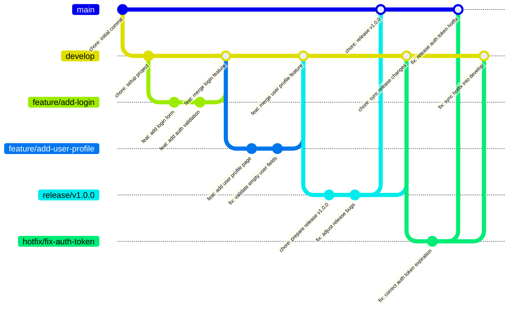

# Capítulo V: Product Implementation

## 5.1. Software Configuration Management.

### 5.1.1. Software Development Environment Configuration.

Esta sección establece el ecosistema de herramientas y servicios seleccionados para garantizar un flujo de trabajo estandarizado, facilitando la colaboración entre los miembros del equipo y la integración de los componentes IoT.

| **Nombre del Producto**     | **Propósito de Uso**       | **Descripción de Uso en el Proyecto**                        | **Ruta de Referencia / Descarga**                            |
| --------------------------- | -------------------------- | ------------------------------------------------------------ | ------------------------------------------------------------ |
| **Trello**                  | Project Management         | Gestión de tareas mediante tableros Kanban y seguimiento de Sprints. | https://trello.com/                                          |
| **Figma**                   | Product UX/UI Design       | Diseño de interfaces de usuario, wireframes y prototipos de alta fidelidad. | https://figma.com/                                           |
| **Git**                     | Software Development       | Control de versiones distribuido para seguimiento de cambios en el código fuente. | https://git-scm.com/                                         |
| **GitHub**                  | Software Development       | Alojamiento del repositorio de código fuente y colaboración en equipo. | https://github.com/                                          |
| **HTML / CSS / JavaScript** | Landing Page Development   | Desarrollo de la landing page estática y componentes frontend básicos. | https://developer.mozilla.org/es/docs/Web                    |
| **Bruno**                   | API Testing                | Cliente ligero para validación de endpoints y pruebas de integración de la API REST. | https://www.usebruno.com/                                    |
| **Spring Boot (Java)**      | Backend Development        | Framework principal para el desarrollo de la API y lógica del negocio. | https://spring.io/projects/spring-boot                       |
| **OpenAPI / Swagger**       | Software Documentation     | Generación de documentación interactiva y técnica de los endpoints del backend. | https://swagger.io/                                          |
| **C++ (Arduino IDE)**       | Embedded App               | Programación de la lógica de sensores y conectividad en hardware físico. | https://www.arduino.cc/en/software                           |
| **Wokwi**                   | IoT Simulation             | Simulador online para prototipado y pruebas de circuitos ESP32 y sensores sin hardware físico. | https://wokwi.com/                                           |
| **Cirkit Designer**         | Circuit Design             | Plataforma web para diseño de circuitos electrónicos y prototipos IoT. | https://app.cirkitdesigner.com                               |
| **Python**                  | Automation & Analytics     | Scripts para análisis de datos ambientales y automatización de tareas. | https://www.python.org/downloads/                            |
| **Flask**                   | Edge IoT Framework         | Framework ligero para desarrollo del Edge Station, recepción de telemetría y sincronización con la nube. | https://flask.palletsprojects.com/                           |
| **Google OAuth2**           | Identity & Access          | Servicio para la autenticación segura de usuarios mediante cuentas de Google. | https://console.cloud.google.com/                            |
| **Stripe**                  | Billing & Subscription     | Pasarela de pagos para la gestión de suscripciones y transacciones. | https://stripe.com/                                          |
| **Resend**                  | Notifications              | Plataforma para el envío de correos electrónicos y alertas críticas a usuarios. | https://resend.com/                                          |
| **OneSignal**               | Push Notifications         | Servicio de notificaciones push multiplataforma para el envío de alertas en tiempo real a dispositivos móviles. | https://onesignal.com/                                       |
| **Angular**                 | Web App Development        | Framework principal para el desarrollo de la aplicación web SPA de Clair. | https://angular.dev/                                         |
| **TypeScript**              | Web App Development        | Lenguaje tipado utilizado en el desarrollo de la aplicación web Angular y lógica del frontend. | https://www.typescriptlang.org/                              |
| **Bun**                     | JavaScript Runtime         | Entorno de ejecución y gestor de paquetes ultrarrápido utilizado para el desarrollo de la aplicación web. | https://bun.sh/                                              |
| **Java**                    | Backend Development        | Lenguaje de programación principal para el desarrollo del backend con Spring Boot. | https://www.oracle.com/java/technologies/downloads/          |
| **Maven**                   | Build Automation           | Herramienta de gestión de dependencias y automatización de compilación del proyecto backend Java. | https://maven.apache.org/                                    |
| **Nix**                     | Environment Management     | Gestor de paquetes y entornos reproducibles para garantizar consistencia en los entornos de desarrollo del equipo. | https://nixos.org/                                           |
| **PostgreSQL**              | Database                   | Sistema de gestión de base de datos relacional utilizado para la persistencia de datos del monolito modular. | https://www.postgresql.org/                                  |
| **Redis**                   | Caching & Messaging        | Almacén de datos en memoria utilizado como caché y broker de mensajes para eventos en tiempo real. | https://redis.io/                                            |
| **Docker**                  | Deployment                 | Contenedorización de microservicios para asegurar la portabilidad del sistema. | https://www.docker.com/products/docker-desktop               |
| **Vercel**                  | Deployment                 | Plataforma de despliegue serverless para la landing page y aplicación web Angular. | https://vercel.com/                                          |
| **Cloudflare Tunnel**       | Deployment                 | Túnel seguro para exponer la API Gateway y servicios Spring Boot sin IP pública. | https://www.cloudflare.com/products/tunnel/                  |
| **Tailscale**               | Networking                 | Red privada virtual (VPN) para conexión segura entre la API local y dispositivos IoT. | https://tailscale.com/                                       |
| **Azure IoT Hub**           | IoT Cloud Platform         | Servicio de Azure para conectividad, monitoreo y gestión de dispositivos IoT en la nube. | https://azure.microsoft.com/services/iot-hub/                |
| **Flutter SDK**             | Mobile Development         | Framework multiplataforma para el desarrollo de la aplicación móvil de Clair. | [docs.flutter.dev](https://docs.flutter.dev/get-started/install) |
| **Angular CLI**             | Web Development            | Herramienta de línea de comandos para la creación y gestión de la aplicación web. | https://angular.io/cli                                       |
| **Material Design 3**       | UI Framework               | Librería de componentes y tokens de diseño para la interfaz de la web app. | https://m3.material.io/                                      |
| **Dart DevTools**           | Debugging                  | Conjunto de herramientas para el perfilado y depuración de la app en Flutter. | https://dart.dev/tools/dart-devtools                         |
| **Caddy**                   | Web Server & Reverse Proxy | Servidor web con HTTPS automático usado como proxy inverso para enrutar el tráfico de los servicios web. | https://caddyserver.com/                                     |
| **Cloudflare**              | DNS & Security             | Plataforma de DNS, seguridad de red y proxy inverso para proteger y acelerar la entrega de las aplicaciones. | https://www.cloudflare.com/                                  |

### 5.1.2. Source Code Management.

Para la gestión y seguimiento de las modificaciones del proyecto, el equipo utilizará GitHub como plataforma centralizada y sistema de control de versiones distribuido. A continuación, se detallan las rutas de acceso a los repositorios correspondientes a cada componente del sistema:

* Landing Page: https://github.com/Vanana-Desarrollo-de-Soluciones-IOT/site

* Web Services: https://github.com/Vanana-Desarrollo-de-Soluciones-IOT/clair-core 

(Este repositorio incluye el código fuente del API, así como las suites de pruebas unitarias, de integración y de aceptación).

* Frontend Web Applications: https://github.com/Vanana-Desarrollo-de-Soluciones-IOT/clair-ui

El equipo implementará el modelo GitFlow para gestionar el ciclo de vida del desarrollo. Se mantendrán dos ramas principales de larga duración: main, que alojará exclusivamente código en estado de producción, y develop, que servirá como rama de integración para el desarrollo activo. Para la implementación de nuevas funcionalidades, correcciones o preparaciones de versiones, se utilizarán ramas temporales que se fusionarán siguiendo la lógica del modelo de Vincent Driessen.

Para garantizar la trazabilidad y el orden en el repositorio, se establecen las siguientes convenciones de nomenclatura:

* Feature Branches: Se utilizará el prefijo feature/ seguido de una descripción breve en minúsculas y guiones (ej. feature/user-authentication). Cada nueva característica deberá desarrollarse en su propia rama.

* Release Branches: Se utilizará el prefijo release/ seguido del número de versión correspondiente (ej. release/v1.0.0).

* Hotfix Branches: Se utilizará el prefijo hotfix/ seguido de una descripción corta del error corregido (ej. hotfix/login-error).

El proyecto adoptará el estándar de Semantic Versioning 2.0.0 (SemVer) para el etiquetado de versiones, utilizando el formato MAYOR.MENOR.PARCHE (ej. v1.2.4). Asimismo, el registro de cambios en el historial de Git se realizará bajo la convención de Conventional Commits, estructurando los mensajes con un tipo descriptivo (feat, fix, docs, style, refactor, test, chore) seguido de una descripción concisa, facilitando así la lectura del historial y la generación automática de changelogs.

| Branch          | Type      | Description                                                  |
| --------------- | --------- | ------------------------------------------------------------ |
| **`main`**      | Core      | Stable production branch for released code.                  |
| **`develop`**   | Core      | Integration branch where completed work lands before release. |
| **`feature/*`** | Temporary | Created from `develop` and merged back into `develop` once the feature is done. |
| **`release/*`** | Temporary | Created from `develop` and merged into `main` after polishing and final checks. |
| **`hotfix/*`**  | Temporary | Created from `main` and merged into both `main` and `develop` to fix urgent production issues. |

| Type        | Meaning                                                     |
| ----------- | ----------------------------------------------------------- |
| `feat:`     | new feature                                                 |
| `fix:`      | bug fix                                                     |
| `docs:`     | documentation changes                                       |
| `style:`    | formatting, spaces, commas, no logic changes                |
| `refactor:` | internal code change without adding or fixing functionality |
| `test:`     | add or update tests                                         |
| `chore:`    | maintenance tasks                                           |
| `build:`    | build system or dependency changes                          |
| `ci:`       | continuous integration changes                              |
| `perf:`     | performance improvement                                     |
| `revert:`   | revert a previous commit                                    |

### 5.1.3. Source Code Style Guide & Conventions.

Para garantizar la mantenibilidad, escalabilidad y legibilidad del ecosistema tecnológico de **Clair**, el equipo ha adoptado un conjunto de directrices estrictas basadas en estándares internacionales de la industria. Una decisión fundamental de diseño es que toda la nomenclatura (nombres de clases, variables, métodos y comentarios) se realizará exclusivamente en inglés, asegurando la consistencia técnica y facilitando la integración de servicios de terceros.

A continuación, se describen las convenciones y guías de estilo adoptadas para los lenguajes principales de la solución:

- **Java (Backend):** Se seguirá estrictamente la **Google Java Style Guide**. Se empleará *UpperCamelCase* para los nombres de clases y *lowerCamelCase* para métodos y variables. Al utilizar **Spring Boot**, se respetarán sus convenciones de estructura de paquetes orientada a dominios y el uso de anotaciones para la inyección de dependencias, garantizando un código limpio y desacoplado.
- **C++ (Embedded App):** Para la lógica de los dispositivos físicos, se aplican convenciones de nombrado claras que reflejen acciones físicas del hardware, como la captura de telemetría. Se utilizará *SCREAMING_SNAKE_CASE* para constantes y macros, manteniendo una estructura que facilite el rastreo de cambios en el código de sensores.
- **TypeScript & Angular (Web App):** Se implementará la **Angular Coding Style Guide** oficial. Se prioriza el uso de tipos estrictos en TypeScript y el nombrado de componentes siguiendo el patrón `nombre.component.ts`. La interfaz se construirá bajo los estándares de **Material Design 3**, utilizando sus tokens de diseño para garantizar la consistencia visual.
- **HTML & CSS:** Se implementará la **Google HTML/CSS Style Guide**. Las clases de estilo se nombrarán bajo la metodología BEM (Block Element Modifier) en inglés, buscando evitar la confusión visual y optimizar la reutilización de componentes de UI.
- **Dart & Flutter (Mobile App):** Se adoptan las **Effective Dart** guidelines. Se utilizará *UpperCamelCase* para clases y *lowerCamelCase* para variables y funciones. Para la estructura de archivos, se seguirá la convención de *snake_case* y se aplicará una arquitectura de estados limpia para asegurar la reactividad de la interfaz.
- **Python (Automation & Data):** Se seguirá el estándar **PEP 8** para todos los scripts de análisis y automatización. Esto asegura que las visualizaciones técnicas y el procesamiento de datos ambientales mantengan un estándar de calidad profesional.
- **Gherkin (.feature files):** Para la automatización de pruebas y especificación de requerimientos, se utilizarán las **Gherkin Conventions for Readable Specifications**. Todas las historias de usuario y criterios de aceptación se redactarán en inglés empleando las palabras clave *Given, When, Then* para describir el comportamiento esperado del sistema.

Esta uniformidad en todos los niveles del stack tecnológico permite que cualquier miembro del equipo pueda intervenir en los diferentes módulos de la solución con una curva de aprendizaje reducida, manteniendo siempre un estándar de calidad profesional en el repositorio de **GitHub**.

### 5.1.4. Software Deployment Configuration.

La configuración del despliegue de la plataforma Vanana se basa en una arquitectura de microservicios y contenedores orientada a garantizar la escalabilidad y la interoperabilidad entre los dispositivos IoT y la infraestructura en la nube. El sistema se distribuye en distintos entornos, desde servidores centralizados hasta dispositivos embebidos instalados en el sitio del usuario. Esta estrategia permite que componentes críticos, como la API Gateway y los servicios backend, operen en entornos Linux mediante contenedores Docker, facilitando la portabilidad, el aislamiento de procesos y una gestión eficiente de los recursos.

Para la lógica central de la solución, se utiliza un clúster backend que aloja la Platform API desarrollada en Java 25. Este entorno se integra con alguna API Gateway encargado de centralizar y redirigir el tráfico de red, asegurando una comunicación segura y fluida entre clientes y servicios internos. La persistencia de datos se gestiona de manera híbrida: PostgreSQL 16 almacena información transaccional, configuración de dispositivos y datos de usuario, mientras que Redis administra sesiones y memoria caché para optimizar los tiempos de respuesta.

Los productos orientados al usuario web, como la Landing Page y la Web Application desarrollada en Angular, se despliegan en plataformas especializadas para frontend como Vercel. Esta infraestructura permite distribuir globalmente los activos estáticos y la Single Page Application (SPA), reduciendo la latencia y mejorando la experiencia del usuario. Además, al desacoplar la capa de presentación del backend, se incrementa la resiliencia del sistema y se simplifican los procesos de actualización y despliegue de nuevas versiones.

En el ámbito móvil, la Mobile Application desarrollada en Flutter se distribuye para Android e iOS. La aplicación incorpora SQLite como base de datos local, permitiendo almacenar preferencias y telemetría histórica directamente en el dispositivo. Gracias a ello, la aplicación puede seguir operando incluso con conectividad limitada, sincronizando la información de manera asíncrona con la API Gateway cuando el acceso a internet se restablece.

La solución integra una capa de computación perimetral (Edge) y aplicaciones embebidas para la gestión directa del hardware. La Edge Station se despliega en nodos físicos locales utilizando Python y Flask, funcionando como un punto intermedio de procesamiento que deduplica y sincroniza la información capturada. Por otro lado, la aplicación embebida en C++ se distribuye como firmware dentro de los sensores físicos de Clair Hardware, permitiendo la captura de métricas ambientales en tiempo real. El ecosistema se complementa con servicios SaaS para autenticación mediante Google OAuth2, procesamiento de pagos con Stripe y mensajería transaccional a través de Resend.

  

## 5.2. Product Implementation & Deployment.

### 5.2.1. Sprint Backlogs.

En la presente sección se consolida el Sprint Backlog integral desarrollado a lo largo de las iteraciones del proyecto Clair. Este registro unificado detalla la totalidad de las Historias de Usuario implementadas en los sucesivos Sprints, estructuradas desde la construcción de la Landing Page pública y los servicios base de gestión de identidad y acceso (IAM), pasando por la gestión jerárquica de organizaciones, espacios físicos y dispositivos IoT, el procesamiento y transmisión de telemetría ambiental en tiempo real en los componentes perimetrales y embebidos (Edge y Embedded), hasta el control remoto de hardware, el motor de reglas y alertas tempranas, el análisis de tendencias históricas de calidad de aire y la integración con la pasarela de pagos y suscripciones de Stripe.

| N | Story ID | Título | Descripción | Story Points |
|---|----------|--------|-------------|--------------|
| 1 | LP-US-01 | Conocer la propuesta de valor y precio base | Como Visitante, quiero conocer el nombre del dispositivo, su beneficio de sensado y su costo inicial, para que pueda comprender el propósito de Clair Alpha de inmediato. | 2 |
| 2 | LP-US-02 | Evaluar las especificaciones del dispositivo y su diseño | Como Visitante, quiero conocer el rendimiento de sensado y la ausencia de pantallas en el dispositivo, para que pueda evaluar su funcionalidad e integración estética en mi espacio. | 2 |
| 3 | LP-US-03 | Comparar las opciones de precios y suscripciones | Como Visitante, quiero comparar el costo de adquisición frente a los beneficios de los planes básico y multi-dispositivo, para que pueda elegir la opción que se ajuste a mi presupuesto y cantidad de sensores. | 3 |
| 4 | LP-US-04 | Conocer la trayectoria y los profesionales detrás del proyecto | Como Visitante, quiero conocer la misión de la marca y la experiencia del equipo de desarrollo, para que pueda confiar en la calidad del sensor. | 2 |
| 5 | LP-US-05 | Obtener canales de atención comercial y horarios | Como Visitante, quiero conocer los medios de contacto y disponibilidad del equipo de ventas, para que pueda planificar mis consultas preventa. | 2 |
| 6 | WA-US-01 | Registro con Correo y Contraseña | Como Visitante, quiero registrar una cuenta nueva proporcionando mi correo electrónico y una contraseña, para iniciar mi registro en la plataforma. | 3 |
| 7 | WA-US-02 | Verificación de Cuenta | Como Visitante, quiero introducir el código enviado a mi correo electrónico, para confirmar mi dirección y activar mi cuenta. | 2 |
| 8 | WA-US-03 | Inicio de Sesión con Credenciales | Como Visitante, quiero iniciar sesión con mi correo electrónico y contraseña, para acceder a la plataforma como Usuario. | 3 |
| 9 | WA-US-04 | Alternar Visibilidad de Contraseña | Como Visitante o Usuario, quiero poder visualizar u ocultar los caracteres de mi contraseña al escribirla, para verificar que es correcta. | 2 |
| 10 | WA-US-05 | Autenticación con Google (SSO) | Como Visitante, quiero iniciar sesión o registrarme usando mi cuenta de Google, para acceder a la plataforma de forma rápida. | 3 |
| 11 | WA-US-06 | Renovación Automática de Sesión | Como Usuario, quiero que mi sesión se renueve de forma automática antes de expirar, para poder continuar con mis actividades sin interrupciones. | 3 |
| 12 | WA-US-07 | Restricción de Acceso a Secciones Privadas | Como Usuario, quiero que las secciones de la plataforma estén protegidas contra accesos no autorizados, para asegurar que nadie pueda ver mi información sin iniciar sesión. | 2 |
| 13 | WA-US-08 | Cierre de Sesión Seguro | Como Usuario, quiero cerrar mi sesión activa, para asegurar que mis datos queden protegidos al dejar de usar la plataforma. | 2 |
| 14 | WS-US-01 | Iniciar Registro de Usuario | Como Desarrollador, quiero iniciar el registro de un nuevo usuario a través de una API, para crear una sesión de validación temporal y despachar un código de verificación. | 3 |
| 15 | WS-US-02 | Confirmar Registro de Usuario | Como Desarrollador, quiero confirmar un registro de usuario validando el código de verificación a través de una API, para persistir definitivamente la cuenta del usuario. | 3 |
| 16 | WS-US-03 | Iniciar Sesión con Contraseña | Como Desarrollador, quiero autenticar las credenciales de correo y contraseña a través de una API, para emitir los tokens de acceso JWT. | 3 |
| 17 | WS-US-04 | Autenticar mediante Token de Google | Como Desarrollador, quiero autenticar usuarios mediante su ID token de Google OAuth a través de una API, para permitir inicios de sesión directos federados. | 3 |
| 18 | WS-US-05 | Iniciar Flujo de Autorización de Google | Como Desarrollador, quiero iniciar el flujo de autorización de Google OAuth a través de una API, para redirigir al usuario al formulario de consentimiento oficial de Google. | 5 |
| 19 | WS-US-06 | Procesar Callback de Google OAuth | Como Desarrollador, quiero recibir y procesar el código devuelto por Google en el callback a través de una API, para generar las credenciales de acceso y devolver al usuario al frontend. | 2 |
| 20 | WS-US-07 | Cerrar Sesión del Usuario | Como Desarrollador, quiero revocar la validez de los tokens del usuario a través de una API, para asegurar el cierre de sesión de la cuenta. | 5 |
| 21 | WS-US-08 | Refrescar Token de Acceso | Como Desarrollador, quiero emitir un nuevo token de acceso a partir de un token de refresco válido a través de una API, para extender el tiempo de sesión del usuario. | 5 |
| 22 | WS-US-09 | Verificar Validez del Token | Como Desarrollador, quiero validar la vigencia de un token de acceso a través de una API, para permitir la verificación de sesiones en servicios externos. | 5 |
| 23 | WA-US-09 | Crear Organización | Como Usuario, quiero crear una organización nueva proporcionando un nombre, para agrupar mis espacios y dispositivos bajo una entidad. | 3 |
| 24 | WA-US-10 | Renombrar Organización | Como Usuario, quiero actualizar el nombre de una de mis organizaciones, para mantener precisa la información de mi cuenta. | 2 |
| 25 | WA-US-11 | Eliminar Organización | Como Usuario, quiero eliminar una organización de mi cuenta, para quitar las agrupaciones que ya no son necesarias. | 2 |
| 26 | WA-US-12 | Ver Mis Organizaciones | Como Usuario, quiero obtener el listado de mis organizaciones asociadas, para poder seleccionar sobre cuál navegar y trabajar. | 2 |
| 27 | WA-US-13 | Crear Espacio | Como Usuario, quiero crear un espacio físico dentro de una organización, para agrupar mis dispositivos por área o sala de monitoreo. | 3 |
| 28 | WA-US-14 | Renombrar Espacio | Como Usuario, quiero modificar el nombre de un espacio físico existente, para mantener actualizada la información de mis ubicaciones. | 2 |
| 29 | WA-US-15 | Eliminar Espacio | Como Usuario, quiero eliminar un espacio físico de mi organización, para quitar las ubicaciones que ya no utilizo. | 2 |
| 30 | WA-US-16 | Ver Espacios por Organización | Como Usuario, quiero consultar los espacios físicos que pertenecen a una organización, para poder seleccionar uno de ellos y ver sus dispositivos. | 2 |
| 31 | WA-US-17 | Reclamar Dispositivo para un Espacio | Como Usuario, quiero reclamar un dispositivo utilizando un token de reclamo y asignarlo a un espacio, para registrarlo en mi cuenta y comenzar a monitorear la calidad del aire. | 3 |
| 32 | WA-US-18 | Emparejar Dispositivo por ID de Hardware | Como Usuario, quiero vincular un dispositivo físico utilizando su identificador de hardware, para registrarlo en la plataforma. | 3 |
| 33 | WA-US-19 | Renombrar Dispositivo | Como Usuario, quiero cambiar el nombre de un dispositivo registrado, para poder identificarlo fácilmente por su ubicación o función. | 2 |
| 34 | WA-US-20 | Eliminar Dispositivo | Como Usuario, quiero dar de baja un dispositivo registrado en la plataforma, para quitar del sistema los sensores que ya no utilizo. | 2 |
| 35 | WA-US-21 | Restablecer Asignación de Espacio del Dispositivo | Como Usuario, quiero desvincular un dispositivo de su espacio actual sin eliminarlo de la plataforma, para poder reasignarlo a otro espacio en el futuro. | 2 |
| 36 | WA-US-22 | Ver Dispositivos por Espacio | Como Usuario, quiero obtener el listado de dispositivos registrados en un espacio físico determinado, para conocer qué sensores están asignados a dicha área. | 2 |
| 37 | WA-US-23 | Ver Detalles del Dispositivo | Como Usuario, quiero consultar la configuración y los parámetros del sistema de un dispositivo registrado, para evaluar sus detalles técnicos. | 2 |
| 38 | WA-US-24 | Monitorear el Estado en Tiempo Real del Dispositivo | Como Usuario, quiero conocer el estado de conexión actual de un dispositivo en tiempo real, para saber si está activo, inactivo o en falla. | 2 |
| 39 | WA-US-25 | Ver Reporte de Telemetría de Dispositivo | Como Usuario, quiero obtener las lecturas de telemetría de comunicación más recientes de un dispositivo, para evaluar la calidad de su señal Wi-Fi y su estado de salud de hardware. | 2 |
| 40 | WA-US-26 | Ver Consolidado de Telemetría para Dispositivos de un Espacio | Como Usuario, quiero obtener un resumen de telemetría de todos los dispositivos asignados a un espacio, para identificar rápidamente sensores con problemas de conexión o de hardware. | 2 |
| 41 | WS-US-10 | Pair Physical Device | Como Desarrollador, quiero emparejar un dispositivo físico a través de una API, para que esté disponible para el flujo de inicialización del dispositivo. | 3 |
| 42 | WS-US-11 | Claim Device Ownership | Como Desarrollador, quiero reclamar la propiedad de un dispositivo emparejado a través de una API, para poder asignarlo a un espacio del usuario. | 3 |
| 43 | WS-US-12 | Retrieve Space Devices | Como Desarrollador, quiero obtener la lista de dispositivos de un espacio a través de una API, para que las aplicaciones clientes puedan renderizar los dispositivos activos. | 3 |
| 44 | WS-US-13 | View Device Details | Como Desarrollador, quiero consultar los detalles de un dispositivo por su ID a través de una API, para inspeccionar su configuración y atributos. | 3 |
| 45 | WS-US-14 | Monitor Device Status | Como Desarrollador, quiero consultar el estado de conexión de un dispositivo a través de una API, para verificar si se encuentra en línea. | 3 |
| 46 | WS-US-15 | Update Device Name | Como Desarrollador, quiero actualizar el nombre de un dispositivo a través de una API, para poder reflejar cambios de identificación en el sistema. | 3 |
| 47 | WS-US-16 | Reset Device Assignment | Como Desarrollador, quiero desasignar un dispositivo de su espacio actual a través de una API, para dejarlo disponible para futuras configuraciones. | 3 |
| 48 | WS-US-24 | Create Organization | Como Desarrollador, quiero crear una organización a través de una API, para poder estructurar y segmentar los espacios de trabajo de los usuarios. | 3 |
| 49 | WS-US-25 | Retrieve Organization Details | Como Desarrollador, quiero obtener los detalles de una organización por su ID a través de una API, para inspeccionar sus atributos de auditoría y propiedad. | 3 |
| 50 | WS-US-26 | Retrieve User Organizations | Como Desarrollador, quiero listar las organizaciones pertenecientes a un usuario a través de una API, para permitir la navegación multi-inquilino en la aplicación cliente. | 3 |
| 51 | WS-US-27 | Delete Organization | Como Desarrollador, quiero eliminar una organización a través de una API, para poder depurar espacios obsoletos. | 2 |
| 52 | WS-US-28 | Update Organization Name | Como Desarrollador, quiero renombrar una organización a través de una API, para mantener actualizada su identificación en la plataforma. | 2 |
| 53 | WS-US-29 | Create Space | Como Desarrollador, quiero crear un espacio físico dentro de una organización a través de una API, para agrupar y ubicar los dispositivos sensores. | 3 |
| 54 | WS-US-30 | Retrieve Space Details | Como Desarrollador, quiero obtener los detalles de un espacio específico a través de una API, para validar su relación de pertenencia organizacional. | 3 |
| 55 | WS-US-31 | Retrieve Spaces by Organization | Como Desarrollador, quiero obtener la lista de espacios asociados a una organización a través de una API, para estructurar los selectores en las pantallas de administración. | 3 |
| 56 | WS-US-32 | Delete Space | Como Desarrollador, quiero eliminar un espacio a través de una API, para permitir la limpieza de zonas de monitoreo inactivas. | 2 |
| 57 | WS-US-33 | Update Space Name | Como Desarrollador, quiero cambiar el nombre de un espacio a través de una API, para corregir o actualizar la etiqueta de ubicación física. | 3 |
| 58 | WS-US-49 | Registrar Telemetría del Dispositivo | Como Desarrollador, quiero almacenar y evaluar lecturas de sensores de un dispositivo en el borde a través de una API, para registrar la calidad del aire histórica y el estado de salud del hardware. | 3 |
| 59 | WS-US-50 | Obtener Historial de Evaluaciones de Telemetría | Como Desarrollador, quiero obtener una lista paginada de registros de telemetría de un dispositivo a través de una API, para permitir la auditoría e inspección de reportes previos. | 5 |
| 60 | WS-US-51 | Obtener Último Registro de Telemetría | Como Desarrollador, quiero recuperar la lectura de telemetría más reciente de un dispositivo a través de una API, para mostrar el estado instantáneo actual de la calidad del aire. | 5 |
| 61 | MA-US-01 | Iniciar Registro de Cuenta | Como Visitante, quiero iniciar mi registro proporcionando mis datos básicos, para que el sistema comience mi proceso de alta en la plataforma. | 3 |
| 62 | MA-US-02 | Confirmar Registro con Código | Como Visitante, quiero ingresar mi código de verificación recibido, para que mi cuenta de usuario quede activada de manera definitiva. | 3 |
| 63 | MA-US-03 | Iniciar Sesión con Correo y Contraseña | Como Visitante, quiero iniciar sesión con mi correo electrónico y contraseña, para que pueda acceder de forma segura a mi cuenta. | 3 |
| 64 | MA-US-04 | Autenticar con Cuenta de Google | Como Visitante, quiero iniciar sesión usando mi cuenta de Google, para que pueda acceder de forma simplificada sin recordar contraseñas adicionales. | 3 |
| 65 | MA-US-05 | Cerrar Sesión | Como Usuario, quiero cerrar mi sesión activa, para que mis credenciales se invaliden y se evite el acceso no autorizado en mi dispositivo. | 3 |
| 66 | MA-US-06 | Crear Organización | Como Usuario, quiero crear una organización, para que pueda comenzar a organizar mis espacios y dispositivos bajo un grupo dedicado. | 3 |
| 67 | MA-US-07 | Actualizar Nombre de Organización | Como Usuario, quiero actualizar el nombre de una organización, para que pueda mantener su etiqueta de grupo de manera precisa. | 3 |
| 68 | MA-US-08 | Eliminar Organización | Como Usuario, quiero eliminar una organización, para que pueda remover grupos que ya no son necesarios. | 2 |
| 69 | MA-US-09 | Crear Espacio | Como Usuario, quiero crear un espacio en una organización, para que pueda agrupar dispositivos en una ubicación física o lógica. | 3 |
| 70 | MA-US-10 | Actualizar Nombre de Espacio | Como Usuario, quiero actualizar el nombre de un espacio, para que pueda renombrar ubicaciones y reflejar mejor su uso. | 2 |
| 71 | MA-US-11 | Eliminar Espacio | Como Usuario, quiero eliminar un espacio, para que pueda remover ubicaciones que ya no están en uso. | 2 |
| 72 | MA-US-12 | Vincular Dispositivo | Como Usuario, quiero vincular un dispositivo a mi cuenta usando su ID de hardware y token de vinculación, para que pueda ser authorized y registrado. | 5 |
| 73 | MA-US-13 | Reclamar Dispositivo a un Espacio | Como Usuario, quiero reclamar un dispositivo a un espacio específico usando su token de reclamo, para que el dispositivo quede enlazado a una ubicación física. | 5 |
| 74 | MA-US-14 | Actualizar Nombre de Dispositivo | Como Usuario, quiero actualizar el nombre de un dispositivo, para que pueda identificarlo fácilmente. | 3 |
| 75 | MA-US-15 | Eliminar Dispositivo | Como Usuario, quiero eliminar un dispositivo, para que pueda darlo de baja o removerlo de mi espacio. | 2 |
| 76 | MA-US-23 | Ver Métricas Actuales del Dashboard | Como Usuario, quiero ver las métricas actuales de calidad del aire del dispositivo, para que pueda conocer el estado actual de mi entorno de manera rápida. | 2 |
| 77 | MA-US-24 | Monitorear Telemetría en Tiempo Real | Como Usuario, quiero ver lecturas de telemetría en tiempo real con un indicador en vivo, para que pueda reaccionar ante cambios inmediatos en el entorno. | 2 |
| 78 | ES-US-01 | Autenticación de Credenciales de Dispositivo | Como Desarrollador, quiero que el sistema valide el identificador de hardware y la clave de API del dispositivo físico, para que la autenticación esté disponible al construir solicitudes seguras para mis aplicaciones. | 5 |
| 79 | ES-US-02 | Monitoreo de Presencia y Transición de Estado a Fuera de Línea | Como Desarrollador, quiero que el sistema identifique dispositivos inactivos en segundo plano y publique sus cambios de estado, para que los eventos de conectividad actualizados estén disponibles para mis aplicaciones. | 3 |
| 80 | ES-US-03 | Sincronizar Evento de Aprovisionamiento de Dispositivos | Como Desarrollador, quiero que el sistema consuma y procese eventos de cambio de dispositivos desde un tema de Kafka, para que la información del dispositivo esté disponible para mis aplicaciones en el caché local. | 5 |
| 81 | ES-US-04 | Ingestar Telemetría de Dispositivos | Como Desarrollador, quiero enviar datos de telemetría a través de la API REST, para que estén disponibles al construir funcionalidades en mis aplicaciones. | 5 |
| 82 | EMB-US-01 | Leer Datos de CO2 y Clima | Como Usuario, quiero que el dispositivo mida el CO2, la temperatura y la humedad relativa a intervalos periódicos, para poder monitorear los indicadores estándar de la calidad del aire interior. | 3 |
| 83 | EMB-US-02 | Leer Material Particulado | Como Usuario, quiero que el dispositivo mida los niveles de concentración de polvo fino (PM1.0, PM2.5 y PM10) a intervalos periódicos, para poder monitorear la contaminación por partículas respirables. | 3 |
| 84 | EMB-US-03 | Visualizar Métricas en Pantalla | Como Usuario, quiero ver las últimas lecturas de los sensores en la pantalla OLED, para poder conocer el estado ambiental a simple vista sin tener que ingresar a un panel web. | 2 |
| 85 | EMB-US-05 | Conectar a Red WiFi Local | Como Administrador, quiero ingresar las credenciales de WiFi en el dispositivo, para permitir la comunicación remota con el servidor de la plataforma. | 3 |
| 86 | EMB-US-06 | Sincronizar Hora con Servidor NTP | Como Administrador, quiero que el sistema obtenga la hora de un servidor NTP, para que el historial de telemetría de mi dispositivo tenga marcas de tiempo exactas. | 5 |
| 87 | EMB-US-08 | Solicitar Reporte de Telemetría en Tiempo Real | Como Administrador, quiero forzar el envío inmediato de un reporte de telemetría bajo demanda, para poder verificar el estado del entorno de manera instantánea. | 5 |
| 88 | WA-US-27 | Cambiar Dispositivo a Standby | Como Usuario, quiero enviar un comando de reposo a un dispositivo activo, para reducir su consumo de energía cuando no se requiera monitoreo. | 3 |
| 89 | WA-US-28 | Despertar Dispositivo de Standby | Como Usuario, quiero enviar un comando de activación a un dispositivo en reposo, para reanudar el monitoreo ambiental. | 3 |
| 90 | WA-US-29 | Reiniciar Dispositivo | Como Usuario, quiero enviar un comando de reinicio a un dispositivo, para intentar recuperarlo de un estado de error o falta de respuesta. | 3 |
| 91 | WA-US-30 | Crear Umbral para Métrica del Dispositivo | Como Usuario, quiero configurar un límite de alerta para una métrica del aire en un dispositivo, para que el sistema controle las condiciones ambientales de forma automática. | 3 |
| 92 | WA-US-31 | Actualizar Umbral de Métrica del Dispositivo | Como Usuario, quiero modificar un límite de alerta configurado previamente, para ajustar las reglas de monitoreo ambiental. | 3 |
| 93 | WA-US-32 | Eliminar Umbral de Métrica del Dispositivo | Como Usuario, quiero borrar una regla de umbral configurada en un dispositivo, para quitar reglas de alertas obsoletas. | 2 |
| 94 | WA-US-33 | Ver Umbrales del Dispositivo | Como Usuario, quiero consultar todas las reglas de umbrales configuradas en un dispositivo, para revisar las reglas de alerta activas para PM2.5, CO₂, temperatura y humedad. | 2 |
| 95 | WA-US-34 | Ver Alertas Activas | Como Usuario, quiero consultar las alertas que se encuentran activas en la plataforma, para identificar qué dispositivos están superando actualmente los límites de calidad del aire configurados. | 2 |
| 96 | WA-US-35 | Identificar la Gravedad de la Alerta | Como Usuario, quiero conocer el nivel de gravedad de las alertas del sistema, para priorizar mi atención en las anomalías más críticas de la calidad del aire. | 2 |
| 97 | WA-US-36 | Navegar por la Lista de Alertas | Como Usuario, quiero paginar los registros de la lista de alertas, para poder revisar todos los eventos cuando el volumen total supere la capacidad de visualización del sistema. | 2 |
| 98 | WA-US-37 | Ver Historial de Alertas Resueltas | Como Usuario, quiero consultar las alertas que han vuelto a condiciones normales y se encuentran resueltas, para evaluar el histórico de incidentes ambientales. | 2 |
| 99 | WA-US-38 | Distinguir Alertas Activas de Resueltas | Como Usuario, quiero alternar mis consultas entre alertas activas e historial de alertas resueltas, para separar las tareas pendientes de atención de los registros pasados. | 2 |
| 100 | WA-US-39 | Ver Resumen Diario de Alertas | Como Usuario, quiero obtener un resumen diario del recuento de alertas generadas en la plataforma, para identificar de forma global los patrones de anomalías a lo largo de los días. | 2 |
| 101 | WA-US-40 | Ver Resumen Global de ICA | Como Usuario, quiero obtener el Índice de Calidad del Aire (ICA) promedio y los valores agregados de todos mis dispositivos, para conocer la calidad del aire global. | 2 |
| 102 | WA-US-41 | Ver Resumen de Infraestructura | Como Usuario, quiero obtener los recuentos totales de mi despliegue de IoT, para conocer la escala de mi infraestructura en la plataforma. | 2 |
| 103 | WA-US-42 | Ver ICA por Espacio | Como Usuario, quiero consultar el estado de la calidad del aire clasificado por cada uno de mis espacios físicos y organizaciones, para detectar áreas críticas de contaminación. | 2 |
| 104 | WA-US-43 | Ver Alertas Activas en el Consolidado | Como Usuario, quiero obtener la lista de las alertas críticas activas más recientes de mi plataforma, para estar enterado de anomalías en curso sin necesidad de ir a la sección de alertas. | 2 |
| 105 | WA-US-44 | Identificar la Frescura de los Datos | Como Usuario, quiero conocer qué tan recientes son los datos analíticos calculados, para evaluar la confiabilidad de la información presentada. | 2 |
| 106 | WA-US-45 | Ver Métricas Agregadas para un Dispositivo | Como Usuario, quiero consultar las métricas de calidad del aire agregadas para un dispositivo en un período de tiempo determinado, para comprender su comportamiento. | 2 |
| 107 | WA-US-46 | Consultar Variación Porcentual de Métricas | Como Usuario, quiero conocer la variación porcentual de cada métrica en comparación con el período de tiempo anterior, para evaluar si las condiciones del aire están mejorando o empeorando. | 2 |
| 108 | WA-US-47 | Clasificar la Calidad del Aire por Métrica | Como Usuario, quiero que el sistema categorice de forma lógica el nivel de seguridad de cada métrica de calidad de aire en base a umbrales, para saber si los parámetros individuales están en rangos saludables. | 3 |
| 109 | WA-US-48 | Actualización Automática de Datos | Como Usuario, quiero que los cálculos analíticos del dispositivo se actualicen periódicamente de forma automática, para disponer de datos actualizados de calidad del aire. | 3 |
| 110 | WA-US-49 | Obtener Tendencia de Métricas Históricas | Como Usuario, quiero obtener las series temporales de datos históricos de un dispositivo para un período de tiempo, para analizar la evolución temporal de la calidad del aire. | 3 |
| 111 | WA-US-50 | Segmentar Tendencia por Métrica Específica | Como Usuario, quiero solicitar el histórico del dispositivo filtrando por un único indicador, para focalizar mi análisis en una métrica específica de la calidad del aire. | 3 |
| 112 | WA-US-51 | Filtrar Tendencias por Rango Predefinido | Como Usuario, quiero solicitar el histórico del dispositivo utilizando rangos de tiempo predefinidos (en vivo, día, semana, mes), para simplificar la consulta de datos comunes. | 3 |
| 113 | WA-US-52 | Filtrar Tendencias por Rango de Fechas Personalizado | Como Usuario, quiero definir fechas de inicio y fin específicas para consultar el histórico del dispositivo, para analizar la calidad del aire en ventanas de tiempo precisas. | 3 |
| 114 | WA-US-53 | Consultar Último Reporte de Telemetría | Como Usuario, quiero obtener la telemetría más reciente registrada por el dispositivo, para evaluar su estado de comunicación física e integridad actual en paralelo a los datos históricos. | 5 |
| 115 | WA-US-54 | Filtrar Analíticas por Organización | Como Usuario, quiero seleccionar una organización para limitar las búsquedas analíticas a sus elementos relacionados, para gestionar mi información de forma ordenada. | 8 |
| 116 | WA-US-55 | Filtrar Analíticas por Espacio Físico | Como Usuario, quiero seleccionar un espacio físico perteneciente a la organización activa, para limitar las búsquedas analíticas a los sensores de esa zona. | 8 |
| 117 | WA-US-56 | Seleccionar Dispositivo para Análisis | Como Usuario, quiero seleccionar un dispositivo específico perteneciente al espacio físico activo, para cargar toda su información de métricas y tendencias. | 3 |
| 118 | WA-US-57 | Ver Planes Disponibles | Como Usuario, quiero ver los planes de suscripción disponibles en el sistema, para comparar sus características y precios antes de tomar una decisión. | 2 |
| 119 | WA-US-58 | Revisar Características del Plan Free | Como Usuario, quiero revisar las características del plan Free, para comprender qué capacidades de monitoreo puedo acceder sin costo. | 2 |
| 120 | WA-US-59 | Revisar Características del Plan Premium | Como Usuario, quiero revisar las características del plan Premium, para evaluar si las capacidades adicionales justifican el coste mensual. | 2 |
| 121 | WA-US-60 | Iniciar Proceso de Suscripción Premium | Como Usuario, quiero iniciar el proceso de suscripción al plan Premium, para proceder al pago y activar mi cuenta. | 5 |
| 122 | WA-US-61 | Confirmar Resumen del Pedido | Como Usuario, quiero verificar el resumen de mi suscripción antes de realizar el pago, para confirmar el nombre del plan, el coste y el monto total debido. | 5 |
| 123 | WA-US-62 | Ver Fecha de Auto-Renovación | Como Usuario, quiero conocer la fecha en la que se renovará mi suscripción, para prever los cargos automáticos. | 2 |
| 124 | WA-US-63 | Proporcionar Información de Pago | Como Usuario, quiero ingresar los detalles de mi tarjeta de pago de manera segura, para proceder con la transacción de suscripción. | 5 |
| 125 | WA-US-64 | Completar Pago de Suscripción Premium | Como Usuario, quiero completar la transacción de pago, para activar mi suscripción Premium de inmediato. | 5 |
| 126 | WA-US-65 | Control de Fallos en el Pago | Como Usuario, quiero recibir detalles sobre fallos en mi transacción de pago, para poder corregir la información o utilizar otro medio. | 5 |
| 127 | WA-US-66 | Consultar Plan de Usuario Actual | Como Usuario, quiero comprobar mi tipo de plan activo y su estado de validez, para saber si mi cuenta se encuentra en el nivel Free, Freemium o Premium. | 3 |
| 128 | WS-US-17 | View Device Thresholds | Como Desarrollador, quiero recuperar todos los umbrales de métricas asociados a un dispositivo a través de una API, para evaluar las reglas activas de alerta. | 3 |
| 129 | WS-US-18 | Create Device Threshold | Como Desarrollador, quiero registrar un nuevo umbral de métrica para un dispositivo a través de una API, para establecer alertas automatizadas de calidad del aire. | 3 |
| 130 | WS-US-19 | Update Device Threshold | Como Desarrollador, quiero actualizar un umbral de métrica existente para un dispositivo a través de una API, para modificar los límites de alerta. | 3 |
| 131 | WS-US-20 | Remove Device Threshold | Como Desarrollador, quiero eliminar un umbral de métrica de un dispositivo a través de una API, para desactivar el monitoreo de esa métrica en particular. | 2 |
| 132 | WS-US-21 | Create Device Command | Como Desarrollador, quiero enviar comandos de control a un dispositivo a través de una API, para habilitar operaciones remotas de hardware. | 5 |
| 133 | WS-US-22 | Retrieve Device Command | Como Desarrollador, quiero consultar el estado de un comando por su ID a través de una API, para verificar el estado de ejecución en el hardware. | 5 |
| 134 | WS-US-23 | Retrieve Latest Command | Como Desarrollador, quiero obtener el último comando enviado a un dispositivo a través de una API, para comprobar la instrucción activa más reciente. | 3 |
| 135 | WS-US-34 | Obtener Alertas del Usuario | Como Desarrollador, quiero obtener la lista de alertas del usuario autenticado a través de una API, para poder visualizarlas en el panel de notificaciones principal. | 3 |
| 136 | WS-US-35 | Obtener Resumen Diario de Alertas del Usuario | Como Desarrollador, quiero obtener un resumen diario de ocurrencia de alertas del usuario a través de una API, para alimentar gráficos de volumen de fallos históricos. | 3 |
| 137 | WS-US-36 | Obtener Alertas por Dispositivo | Como Desarrollador, quiero obtener las alertas pertenecientes a un dispositivo específico a través de una API, para permitir diagnósticos detallados por hardware en la aplicación cliente. | 5 |
| 138 | WS-US-37 | Obtener Alertas por Espacio | Como Desarrollador, quiero obtener las alertas de un espacio a través de una API, para que los usuarios puedan identificar problemas en ubicaciones físicas particulares. | 3 |
| 139 | WS-US-38 | Obtener Resumen Diario de Alertas por Espacio | Como Desarrollador, quiero obtener el resumen diario agregador de alertas de un espacio a través de una API, para alimentar los gráficos de métricas físicas locales. | 3 |
| 140 | WS-US-39 | Obtener Métricas en Tiempo Real | Como Desarrollador, quiero obtener las métricas clave de rendimiento en tiempo real a través de una API, para poder renderizar inmediatamente los valores de telemetría en el panel de control. | 5 |
| 141 | WS-US-40 | Transmitir Telemetría en Vivo mediante SSE | Como Desarrollador, quiero establecer un canal de Server-Sent Events (SSE) para un dispositivo a través de una API, para transmitir flujos de datos en tiempo real al navegador. | 5 |
| 142 | WS-US-41 | Obtener Métricas Históricas | Como Desarrollador, quiero consultar métricas de rendimiento históricas agrupadas por períodos a través de una API, para permitir análisis retrospectivos del entorno físico. | 3 |
| 143 | WS-US-42 | Obtener Tendencias Históricas del Dispositivo | Como Desarrollador, quiero recuperar series temporales de datos históricos de un dispositivo a través de una API, para alimentar los gráficos de tendencias temporales en el frontend. | 3 |
| 144 | WS-US-43 | Obtener Resumen General de Analíticas | Como Desarrollador, quiero obtener una vista global unificada de espacios, dispositivos y alertas recientes a través de una API, para renderizar la página principal del dashboard del usuario. | 8 |
| 145 | WS-US-44 | Crear Intento de Pago en Stripe | Como Desarrollador, quiero crear un intento de pago en Stripe a través de una API, para iniciar flujos de pago integrados directos. | 3 |
| 146 | WS-US-45 | Obtener Suscripciones del Usuario | Como Desarrollador, quiero consultar el historial de suscripciones de un usuario a través de una API, para poder renderizar su estado de pagos en su perfil. | 5 |
| 147 | WS-US-46 | Obtener Plan del Usuario | Como Desarrollador, quiero resolver el plan de servicios activo de un usuario a través de una API, para validar sus límites de uso en otros módulos. | 2 |
| 148 | WS-US-47 | Degradación de Plan a Freemium | Como Desarrollador, quiero degradar manualmente o por vencimiento el plan de un usuario a Freemium a través de una API, para suspender los beneficios premium. | 3 |
| 149 | WS-US-48 | Procesar Notificaciones de Stripe mediante Webhook | Como Desarrollador, quiero procesar los eventos de confirmación de pago de Stripe mediante una API de webhook, para activar o extender de forma automatizada las suscripciones de los usuarios. | 5 |
| 150 | WS-US-52 | Obtener Historial de Notificaciones Push del Usuario | Como Desarrollador, quiero recuperar la lista paginada de registros de notificaciones push enviadas a un usuario a través de una API, para mostrar su historial de alertas en el panel de control. | 3 |
| 151 | WS-US-53 | Generar Resúmenes Diarios de Calidad del Aire | Como Desarrollador, quiero que el sistema calcule y persista diariamente un resumen consolidado de calidad del aire para cada dispositivo, para evitar procesar lecturas brutas repetidamente. | 5 |
| 152 | WS-US-54 | Obtener Reporte Diario de Calidad del Aire | Como Desarrollador, quiero obtener el resumen diario de calidad del aire de un dispositivo a través de una API, para renderizar reportes diarios históricos en el cliente. | 3 |
| 153 | WS-US-55 | Generar Resúmenes Mensuales de Calidad del Aire | Como Desarrollador, quiero que el sistema cascade y consolide mensualmente los resúmenes diarios de cada dispositivo, para mantener un histórico de largo plazo eficiente. | 5 |
| 154 | WS-US-56 | Obtener Reporte Mensual de Calidad del Aire | Como Desarrollador, quiero obtener el reporte mensual de calidad del aire de un dispositivo a través de una API, para permitir a los usuarios premium analizar tendencias mensuales. | 5 |
| 155 | MA-US-16 | Configurar Umbral de Métrica de Dispositivo | Como Usuario, quiero establecer una configuración de umbral para una métrica de dispositivo, para que pueda definir rangos operativos seguros para las lecturas de telemetría. | 3 |
| 156 | MA-US-17 | Remover Umbral de Métrica de Dispositivo | Como Usuario, quiero remover un umbral de una métrica de dispositivo, para que la métrica ya no esté restringida a rangos operativos específicos. | 2 |
| 157 | MA-US-18 | Enviar Comando de Control a Dispositivo | Como Usuario, quiero encolar un comando para un dispositivo, para que pueda activar acciones como actualizar su estado de energía. | 3 |
| 158 | MA-US-19 | Ver Lista Completa de Alertas | Como Usuario, quiero ver la lista completa de alertas generadas en mi plataforma, para que pueda conocer todas las notificaciones de problemas en mis dispositivos. | 2 |
| 159 | MA-US-20 | Filtrar Alertas por Dispositivo o Espacio | Como Usuario, quiero filtrar las alertas por un dispositivo o espacio específico, para que pueda enfocar mi atención en áreas particulares del sistema. | 3 |
| 160 | MA-US-21 | Ver Resumen Diario de Alertas | Como Usuario, quiero ver un resumen diario del conteo de alertas generadas, para que pueda comprender la frecuencia y evolución de las incidencias en el tiempo. | 2 |
| 161 | MA-US-22 | Reconocer Alerta Activa | Como Usuario, quiero reconocer una alerta activa en el sistema, para que quede registrado que la incidencia ha sido revisada o atendida. | 2 |
| 162 | MA-US-25 | Visualizar Gráfico de Tendencias | Como Usuario, quiero ver un gráfico de tendencias de las métricas del dispositivo, para que pueda identificar patrones o anomalías visualmente. | 2 |
| 163 | MA-US-26 | Filtrar Tendencias por Rango de Fechas | Como Usuario, quiero seleccionar un rango de fechas para el gráfico de tendencias, para que pueda analizar datos históricos en un intervalo específico de tiempo. | 3 |
| 164 | MA-US-27 | Ver Lista de Notificaciones | Como Usuario, quiero ver el listado de mis notificaciones recibidas, para que pueda enterarme de los avisos del sistema y eventos ocurridos. | 2 |
| 165 | ES-US-05 | Obtener Comandos Pendientes | Como Desarrollador, quiero obtener la lista de comandos pendientes de un dispositivo a través de la API REST, para que el dispositivo edge pueda consultar las acciones que debe ejecutar. | 3 |
| 166 | ES-US-06 | Confirmar Ejecución de Comando | Como Desarrollador, quiero enviar una confirmación de ejecución de comando a través de la API REST, para que el estado de ejecución quede registrado y disponible para las aplicaciones. | 3 |
| 167 | ES-US-07 | Consultar Estado de Conexión del Dispositivo | Como Desarrollador, quiero consultar el estado de conexión de un dispositivo a través de la API REST, para verificar si un equipo está en línea o fuera de línea al construir paneles de control. | 3 |
| 168 | EMB-US-04 | Parpadear LED por Incidentes Activos | Como Usuario, quiero que una luz de advertencia parpadee cuando se detecten incidentes activos de calidad del aire, para recibir una notificación visual directa aunque no esté mirando la pantalla OLED. | 3 |
| 169 | EMB-US-07 | Activar y Desactivar Modo Standby | Como Usuario, quiero que el dispositivo entre en un estado de bajo consumo donde la pantalla y el LED de alarma estén apagados, para que el dispositivo no me perturbe durante la noche. | 3 |
| 170 | EMB-US-09 | Visualizar Estado de Salud del Dispositivo | Como Administrador, ver el estado de salud calculado del dispositivo en el panel de control, para identificar rápidamente unidades que tengan problemas de conexión o fallas en los sensores. | 2 |

### 5.2.2. Implemented Landing Page Evidence

Para el despliegue de la Landing Page, se creó una cuenta en **Vercel** y se configuró el proyecto vinculado al repositorio de GitHub (`Vanana-Desarrollo-de-Soluciones-IOT/site`). Se configuró el dominio personalizado y se establecieron las variables de entorno necesarias para la internacionalización (i18n). La Landing Page fue desplegada como sitio estático, aprovechando la infraestructura global de CDN de Vercel para garantizar baja latencia y alta disponibilidad. El sitio incluye múltiples **Call-to-Action (CTA)** estratégicamente ubicados para guiar a los visitantes hacia el registro.

**URL de producción:** https://site-beige-mu.vercel.app/

 

### 5.2.3. Implemented Frontend-Web Application Evidence

Para la Web Application desarrollada en Angular, se creó un proyecto en **Vercel** vinculado al repositorio (`Vanana-Desarrollo-de-Soluciones-IOT/clair-ui`). Se configuró el pipeline de despliegue automático a partir de la rama `main`, de modo que cada fusión de código genera automáticamente una nueva versión en el entorno de producción. La aplicación se despliega como Single Page Application (SPA) con pre-rendering estático.

 

**URL de producción:** https://clair-ui.vercel.app/

### 5.2.4. Acuerdo de Servicio - SaaS (SaaS Agreement)

Esta sección establece los derechos, obligaciones y restricciones aplicables a los usuarios de la plataforma **Clair**, garantizando total transparencia en el uso del servicio SaaS. El presente acuerdo se encuentra integrado públicamente en la sección **"Terms and Conditions"** (Términos de Uso) del website oficial del producto ([https://site-beige-mu.vercel.app/privacy.html#terms](https://site-beige-mu.vercel.app/privacy.html#terms)), cumpliendo con los criterios de claridad, accesibilidad, disponibilidad permanente y cumplimiento normativo en materia de servicios digitales y protección de datos.

1. **Partes y Aceptación de los Términos**

El presente Acuerdo de Servicio de Software como Servicio (en adelante, el "Acuerdo" o "SaaS Agreement") es celebrado entre el equipo de desarrollo de la solución **Clair / Vanana** (en adelante, el "Proveedor") y cualquier persona natural o jurídica (en adelante, el "Usuario" o "Cliente") que cree una cuenta, acceda a los servicios web o móviles, o vincule dispositivos de sensado ambiental a la infraestructura del sistema.

Al acceder a la Landing Page, registrarse en la Web Application, iniciar sesión en la Mobile Application o conectar dispositivos IoT físicos o perimetrales (Edge Station / ESP32), el Usuario manifiesta su consentimiento libre, previo, expreso e informado respecto a la totalidad de las cláusulas aquí estipuladas. Si el Usuario no está de acuerdo con estos términos, deberá abstenerse de utilizar el servicio y solicitar la baja inmediata de su cuenta.

2. **Definiciones del Ecosistema**

Para efectos de la correcta interpretación del presente documento, se definen los siguientes términos:
- **Plataforma SaaS Clair:** Ecosistema digital compuesto por la API REST central en Java/Spring Boot (`clair-core`), la aplicación web en Angular (`clair-ui`), la aplicación móvil en Flutter (`mobile`), la estación perimetral en Python/Flask (`edge`) y el firmware embebido en C++ (`embedded`).
- **Dispositivo IoT / Clair Alpha:** Sensor de monitoreo ambiental físico basado en microcontroladores ESP32, encargado de la captura de telemetría de dióxido de carbono ($CO_2$), material particulado ($PM1.0$, $PM2.5$, $PM10$), temperatura y humedad relativa.
- **Edge Station:** Nodo de procesamiento perimetral intermedio encargado de autenticar dispositivos de campo, almacenar telemetría en búfer local ante pérdidas de red y sincronizar eventos con la nube.
- **Organización y Espacio:** Jerarquías lógicas multi-inquilino creadas por el Usuario para agrupar y administrar salas, habitaciones o sucursales físicas donde operan los sensores.
- **Telemetría:** Mediciones continuas y marcas temporales transmitidas por los dispositivos hacia la nube para su evaluación y visualización analítica.

**3. Alcance y Modalidades del Servicio**

El Proveedor otorga al Usuario una licencia no exclusiva, revocable, intransferible y limitada para acceder y utilizar la plataforma SaaS de acuerdo con el plan de suscripción contratado:
- **Plan Free / Freemium:** Permite el registro de un número acotado de dispositivos y espacios, visualización de telemetría en tiempo real y recepción de alertas críticas locales, con una retención histórica limitada.
- **Plan Premium:** Habilita la vinculación extendida de sensores en múltiples organizaciones, analítica retrospectiva avanzada con consolidación diaria y mensual, acceso a canales en vivo mediante Server-Sent Events (SSE), exportación de reportes de cumplimiento y configuración ilimitada de umbrales en el constructor de reglas (*Rules Builder*).

**4. Gestión de Cuentas, Autenticación y Seguridad**

1. **Registro e Identidad:** El Usuario puede registrarse mediante correo electrónico y contraseña o mediante autenticación única federada (*Single Sign-On*) provista por Google OAuth 2.0. Las cuentas requieren verificación de dirección mediante código de validación transaccional despachado por el servicio Resend.
2. **Custodia de Credenciales:** El Usuario es el único responsable de mantener la confidencialidad de sus credenciales de acceso, contraseñas y tokens de sesión JWT. Cualquier actividad realizada desde la cuenta autenticada se atribuirá directamente a su titular.
3. **Notificación de Brechas:** En caso de detectar o sospechar de un acceso no autorizado o vulneración de credenciales, el Usuario se compromete a notificar de inmediato al Proveedor a través de los canales de soporte.

**5. Requisitos de Hardware, Conectividad y Telemetría**

1. **Entorno Operativo:** La captura y transmisión de datos dependen de la disponibilidad de conectividad a internet (Wi-Fi 802.11 b/g/n en banda 2.4 GHz) y del acceso a servidores de sincronización horaria mediante protocolo NTP.
2. **Proceso de Emparejamiento (Claiming):** La vinculación de cada sensor físico a un espacio requiere un identificador único de hardware (*Hardware ID*) y un token de reclamo temporal emitido por la plataforma, garantizando que un dispositivo pertenezca a una única organización a la vez.
3. **Disponibilidad Perimetral:** En caso de desconexión del enlace a internet, la Edge Station conservará registros de telemetría de forma transitoria en su almacenamiento local y los sincronizará una vez restablecida la conectividad. El Proveedor no se hace responsable por la pérdida de datos provocada por cortes de energía locales prolongados o fallas en el enrutador del Usuario.

**6. Facturación, Pagos y Políticas de Cancelación**

1. **Pasarela de Pagos Externa:** La suscripción a planes pagos se gestiona mediante la integración directa con la pasarela de pagos internacional **Stripe**. El Proveedor no procesa ni almacena números completos de tarjetas de crédito o códigos CVV en sus bases de datos, delegando el cumplimiento de la normativa PCI-DSS en dicha pasarela.
2. **Renovación Automática:** Salvo que el Usuario cancele su suscripción antes de la fecha de corte facturable, el plan Premium se renovará automáticamente por períodos mensuales consecutivos mediante cargo al método de pago registrado.
3. **Cancelación y Degradación de Servicio:** El Usuario puede cancelar su suscripción en cualquier momento desde el panel de facturación de la Web App. Al cancelarse el plan, el Usuario conservará los beneficios Premium hasta el fin del ciclo de facturación pagado, tras lo cual su cuenta será degradada automáticamente al nivel Freemium sin cobros adicionales.
4. **Política de Reembolsos:** Las tarifas abonadas por suscripciones SaaS vencidas o en curso no son reembolsables, salvo disposición legal imperativa en materia de protección al consumidor.

**7. Política de Uso Aceptable (AUP) y Restricciones**

El Usuario se compromete a hacer uso de la plataforma conforme a la ley, la moral y las buenas costumbres. Queda expresamente prohibido:
- Intentar descompilar, realizar ingeniería inversa, desensamblar o alterar el código binario de la Web App, Mobile App o del firmware embebido de los sensores.
- Ejecutar pruebas de penetración, escaneos de vulnerabilidades no autorizados o ataques de denegación de servicio (DoS/DDoS) contra los endpoints de la API en `clair-core` o la red perimetral de Cloudflare Tunnel.
- Manipular maliciosamente las peticiones REST o flujos de SSE para inyectar mediciones ficticias o alterar los algoritmos de cálculo del Índice de Calidad del Aire (ICA).
- Revender, alquilar, sublicenciar o utilizar el servicio como parte de una oferta comercial para terceros ajenos a la organización registrada sin el consentimiento previo por escrito del Proveedor.

El incumplimiento de cualquiera de estas restricciones facultará al Proveedor a suspender cautelarmente o cancelar definitivamente la cuenta del infractor, sin derecho a indemnización alguna.

**8. Propiedad Intelectual y Titularidad de los Datos**

1. **Derechos del Proveedor:** Todos los derechos de propiedad intelectual e industrial sobre el software Clair, código fuente en repositorios GitHub, arquitecturas de software, marcas, logotipos, documentación OpenAPI, interfaces de usuario en Figma y librerías embebidas son de titularidad exclusiva de Vanana y su equipo creador.
2. **Propiedad de los Datos del Cliente:** El Usuario mantiene en todo momento la titularidad y dominio sobre los datos de telemetría ambiental sin procesar y sobre la estructura de espacios creada en su cuenta.
3. **Licencia Operativa sobre los Datos:** El Usuario otorga al Proveedor una licencia mundial, libre de regalías y no exclusiva para almacenar, transformar, consultar y procesar dichos datos exclusivamente con el fin de prestar las funciones del servicio SaaS (generación de gráficos, cálculo de promedios, despacho de alertas y emisión de reportes). Asimismo, el Proveedor podrá utilizar datos estadísticos anonimizados y agregados para el entrenamiento y mejora continua de los modelos de detección de anomalías ambientales.

**9. Nivel de Servicio (SLA) y Mantenimiento**

1. **Disponibilidad Objetivo:** El Proveedor realiza sus mejores esfuerzos técnicos para brindar una disponibilidad mensual de la plataforma web y API de al menos el **99.5%**, sustentada en la infraestructura elástica de contenedores Docker en Contabo y la red global de entrega de contenido (CDN) de Vercel.
2. **Mantenimiento Programado:** Las tareas de mantenimiento preventivo, despliegue de nuevas versiones o migraciones de base de datos se programarán preferentemente en horarios de bajo tráfico, siendo notificadas con un mínimo de veinticuatro (24) horas de anticipación a través de la aplicación web o correo electrónico.
3. **Exclusiones de Disponibilidad:** No computarán como tiempo de inactividad de la plataforma las fallas atribuibles a caídas de telecomunicaciones globales, proveedores de nube de terceros (AWS/Vercel/Cloudflare), interrupciones del suministro eléctrico local del Usuario o deficiencias en la red Wi-Fi donde operan los sensores.

**10. Descargo de Responsabilidad Técnica y Médica**

1. **Naturaleza del Dispositivo:** Los sensores Clair Alpha y el software SaaS son herramientas diseñadas para el monitoreo, concientización y gestión ambiental orientativa en hogares y locales comerciales. **Clair no constituye un dispositivo médico, clínico ni de diagnóstico de enfermedades respiratorias, ni tampoco un sistema certificado de seguridad industrial para detección de incendios o fugas químicas letales.**
2. **Límites de Responsabilidad:** Las recomendaciones automáticas del sistema (tales como ventilar ambientes o abrir ventanas ante picos de $CO_2$) poseen carácter meramente informativo. El Proveedor no asume responsabilidad civil, comercial ni legal por daños patrimoniales, lesiones, afectaciones de salud o perjuicios consecuenciales resultantes de la toma o falta de toma de decisiones humanas basadas en las lecturas de los sensores.
3. **Tope Indemnizatorio:** En la medida máxima permitida por la legislación aplicable, la responsabilidad económica acumulada total del Proveedor frente al Usuario por cualquier causa relacionada con este Acuerdo se limitará al importe efectivamente pagado por el Usuario en los últimos tres (3) meses de servicio SaaS.

**11. Protección de Datos Personales y Privacidad**

El Proveedor garantiza el tratamiento confidencial y seguro de la información personal suministrada en virtud de la **Ley N° 29733 (Ley de Protección de Datos Personales de la República del Perú)** y normas internacionales aplicables:
- **Cifrado de Comunicaciones:** Todos los datos transmitidos entre las aplicaciones cliente (Web/Móvil), la API Gateway y los sensores físicos se protegen mediante protocolos criptográficos modernos (TLS 1.3 y túneles seguros Cloudflare Tunnel).
- **Derechos ARCO:** El Usuario puede ejercer sus derechos de Acceso, Rectificación, Cancelación y Oposición sobre sus datos personales mediante solicitud enviada a los canales de atención designados.

**12. Modificaciones al Acuerdo de Servicio**

El Proveedor se reserva el derecho de actualizar o modificar los presentes términos para reflejar mejoras tecnológicas, ajustes regulatorios o nuevas características del producto. Cualquier cambio sustancial será comunicado al Usuario con al menos quince (15) días de antelación a su entrada en vigor, mediante publicación en la Landing Page o notificación vía correo electrónico. El uso continuado de los servicios tras dicha notificación constituirá la aceptación tácita de los términos enmendados.

**13. Ley Aplicable y Jurisdicción**

El presente Acuerdo se rige e interpreta conforme a las leyes de la República del Perú. Para cualquier litigio, controversia o discrepancia derivada del cumplimiento o interpretación de este documento, las partes se someten expresamente a la competencia territorial de los Jueces y Tribunales del Distrito Judicial de Lima Cercado, renunciando a cualquier otro fuero que pudiera corresponderles.

**14. Integración y Publicación en el Website**

En estricto cumplimiento con las buenas prácticas de diseño de software y transparencia hacia el consumidor, el contenido de este Acuerdo de Servicio SaaS ha sido integrado de manera permanente y accesible en la Landing Page oficial de Clair:

| Parámetro de Integración | Especificación Técnica |
|---|---|
| **Ruta Web Oficial** | [https://site-beige-mu.vercel.app/privacy.html#terms](https://site-beige-mu.vercel.app/privacy.html#terms) |
| **Repositorio Fuente** | [https://github.com/Vanana-Desarrollo-de-Soluciones-IOT/site](https://github.com/Vanana-Desarrollo-de-Soluciones-IOT/site) (`privacy.html`) |
| **Sección en Sitio** | Módulo interactivo "Terms of Use / Términos de Uso" enlazado desde el pie de página (*Footer*) de todas las vistas y en la barra de navegación lateral (*Sidebar Legal*). |
| **Accesibilidad e Internacionalización** | Soporte de renderizado dinámico bilingüe (Español e Inglés) mediante `i18n.js` y contraste visual adaptable conforme a las pautas WCAG 2.1 nivel AA. |
| **Canal de Soporte Legal** | Correo electrónico directo: `support@clair-iot.com` y sección de contacto web ([https://site-beige-mu.vercel.app/contact.html](https://site-beige-mu.vercel.app/contact.html)). |

### 5.2.5. Implemented Native-Mobile Application Evidence

Para la Web Application desarrollada en Angular, se creó un proyecto en **Firebase** vinculado al repositorio (`Vanana-Desarrollo-de-Soluciones-IOT/mobile`). Se configuró el pipeline de despliegue automático a partir de la rama `main`, de modo que cada fusión de código genera automáticamente una nueva versión en el entorno de producción. La aplicación se despliega como Single Page Application (SPA) con pre-rendering estático.

 

### 5.2.6. Implemented RESTful API and/or Serverless Backend Evidence

### 5.2.7. RESTful API documentation

### 5.2.8. Team Collaboration Insights

## 5.3. Video About-the-Product.
