# Part II: Verification, Validation & Pipeline

# Capítulo VI: Product Verification & Validation

## 6.1. Testing Suites & Validation

El backend de Clair Core (`clair-core`, Spring Boot 3.5.5 con Java 25) se prueba con cuatro suites. Todas corren dentro de la JVM: Unit e Integration Tests instancian servicios o el contexto Spring sobre H2; BDD y System Tests levantan la aplicación en un puerto aleatorio, también sobre H2, y la recorren por HTTP. Ninguna suite necesita Docker, PostgreSQL ni Redis. Todas se ejecutan con `nix-shell --run "mvn test"` y cada prueba está asociada a una User Story (WS-US) del backlog.

| Suite | Nivel | Aísla | Tecnología | Pruebas |
|---|---|---|---|---|
| Unit Tests | Dominio | Sin Spring ni base de datos | JUnit 5 + Mockito | 49 (5 clases) |
| Integration Tests | Servicios de aplicación y persistencia, entre bounded contexts | Spring real sobre H2; solo se mockean los servicios externos | `@SpringBootTest` + JPA + `@MockitoBean` | 15 (5 clases) |
| Behavior-Driven Development | Especificación de negocio | App HTTP sobre H2; sesiones en memoria | Cucumber 7.20.1 (Gherkin español) | 13 (5 features) |
| System Tests | Sistema completo | App en puerto aleatorio sobre H2; sesiones en memoria | JUnit 5 + `TestRestTemplate` | 9 (1 clase) |

Convenciones que siguen todas las pruebas, según la rúbrica:

- La clase y cada prueba tienen un `@DisplayName` en español.
- El cuerpo sigue el patrón AAA, marcado con los comentarios `// Arrange`, `// Act` y `// Assert`.
- Cada prueba explica qué regla de negocio protege con un comentario `// Business / User Story Rational (WS-US-xx): ...`.
- No se prueban las validaciones de DTO (`@Valid`, bean validation). Se prueban las invariantes de los agregados y las reglas de negocio.
- Las suites se agregaron como clases nuevas, sin modificar las pruebas que ya tenía el proyecto ni el código de `src/main`. Tampoco se crearon migraciones ni seeds: cada prueba arma sus datos en el `Arrange`.

Las suites de Unit e Integration Tests cubren los bounded contexts IAM, Device, Evaluation, Alerting y Billing.

### 6.1.1. Web Services Tests.

#### 6.1.1.1 Core Entities Unit Tests.

Estas pruebas instancian los agregados y value objects del dominio directamente, sin contexto de Spring y sin base de datos. Algunas reglas no están en el agregado sino en su command service, como la severidad de una alerta o el límite de espacios del plan. En esos casos (`AlertUnitTest`, `OrganizationSpaceUnitTest` y `DeviceThresholdUnitTest`) se instancia el service con sus repositorios y dependencias externas reemplazados por mocks de Mockito. Cada clase tiene entre 9 y 10 pruebas y cubre las ocho categorías de la rúbrica: happy path, límite superior, límite inferior, datos insuficientes, estado inválido, condicional A, condicional B e integridad.

Ubicación: `src/test/java/com/claircore/<contexto>/unit/<Contexto>UnitTest.java`.

**`DeviceUnitTest`** (Device, 10 pruebas, WS-US-10 a WS-US-16)

Prueba los agregados `Device` y `DeviceAssignment` y los value objects `HardwareId` y `ClaimToken`.

| Categoría | Prueba | US |
|---|---|---|
| Happy | Reclamar un dispositivo emparejado lo asigna al espacio y al usuario | WS-US-11 |
| Límite superior | Un evento de presencia más de 5 minutos en el futuro es rechazado | WS-US-14 |
| Límite inferior | Un evento de presencia igual o anterior al último aplicado se ignora | WS-US-14 |
| Datos insuficientes | Un Hardware ID con formato inválido es rechazado | WS-US-10 |
| Estado inválido | Un dispositivo ya reclamado no puede reclamarse otra vez | WS-US-11 |
| Estado inválido | Renombrar un dispositivo con un nombre en blanco es rechazado | WS-US-15 |
| Condicional A | Un evento OFFLINE siempre cambia el estado, aunque el dispositivo esté en STANDBY | WS-US-14 |
| Condicional B | Un evento ONLINE no saca al dispositivo de STANDBY, solo refresca `lastSeenAt` | WS-US-14 |
| Integridad | Restablecer el nombre devuelve el nombre de fábrica | WS-US-16 |
| Integridad | Marcar un dispositivo en línea registra su estado y su `lastSeenAt` | WS-US-14 |

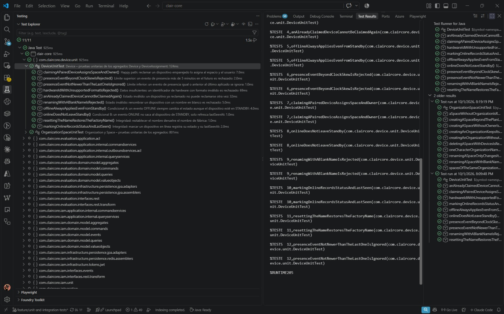

Las 10 pruebas pasan. Cinco de ellas tratan el estado de conexión, porque los eventos de presencia llegan desde el borde y pueden venir repetidos, desordenados o con el reloj adelantado.

**`OrganizationSpaceUnitTest`** (Device, 10 pruebas, WS-US-24 a WS-US-33)

Prueba los agregados `Organization` y `Space`.

| Categoría | Prueba | US |
|---|---|---|
| Happy | Crear una organización la deja asociada a su dueño | WS-US-24 |
| Límite superior | Con el plan que permite 1 espacio, crear el segundo es rechazado | WS-US-46 |
| Límite inferior | Un nombre de organización de un solo carácter es aceptado | WS-US-24 |
| Datos insuficientes | Crear una organización sin nombre es rechazado | WS-US-24 |
| Estado inválido | Eliminar un espacio con sensores registrados es rechazado | WS-US-32 |
| Estado inválido | Un espacio sin organización no puede existir | WS-US-29 |
| Estado inválido | Crear un espacio sin dueño es rechazado | WS-US-29 |
| Condicional A | Renombrar un espacio con un nombre válido actualiza solo el nombre | WS-US-33 |
| Condicional B | Un nombre en blanco para el espacio se rechaza antes de llegar al agregado | WS-US-33 |
| Integridad | Dos espacios de la misma organización tienen identidades distintas | WS-US-31 |

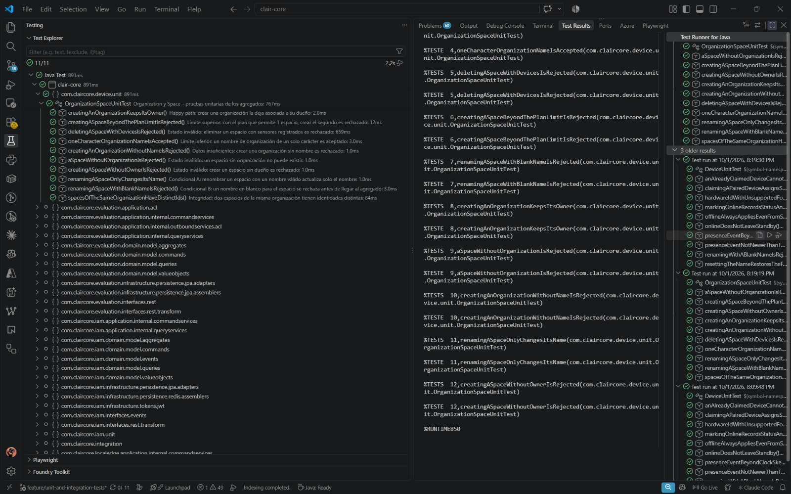

Las 10 pruebas pasan. El límite superior depende del plan del usuario y no de una constante del agregado: con un plan de un solo espacio, el segundo `CreateSpaceCommand` se rechaza.

**`DeviceThresholdUnitTest`** (Device, 10 pruebas, WS-US-17 a WS-US-20)

Prueba el value object `MetricThreshold` y la clase `DeviceMetricThresholdConfiguration`, que guarda los umbrales dentro de `DeviceAssignment`.

| Categoría | Prueba | US |
|---|---|---|
| Happy | Un umbral de PM2.5 válido queda configurado y habilitado | WS-US-18 |
| Límite superior | Un umbral de CO2 muy alto (5000 ppm) es aceptado | WS-US-18 |
| Límite inferior | Un umbral exactamente en cero es aceptado | WS-US-18 |
| Límite inferior | Un umbral negativo es rechazado | WS-US-18 |
| Datos insuficientes | Un umbral sin métrica es rechazado | WS-US-18 |
| Estado inválido | Registrar un umbral para una métrica que ya tiene uno es rechazado | WS-US-18 |
| Condicional A | Un umbral deshabilitado conserva su valor configurado | WS-US-19 |
| Condicional B | La intención UPDATE se conserva en el comando de escritura | WS-US-19 |
| Integridad | Agregar y quitar la configuración de un umbral deja la asignación sin él | WS-US-20 |
| Integridad | La etiqueta y la unidad de cada métrica son las que ve el usuario | WS-US-17 |

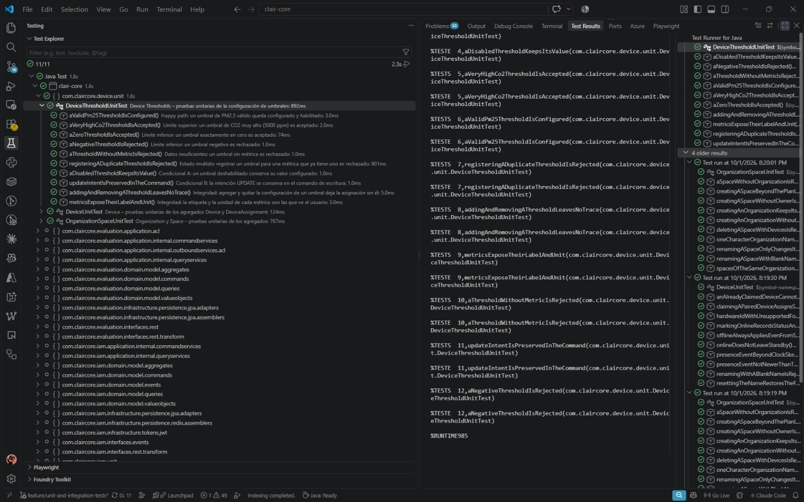

Las 10 pruebas pasan. El límite inferior se prueba por los dos lados: cero se acepta y un valor negativo se rechaza.

**`AlertUnitTest`** (Alerting, 9 pruebas, WS-US-34, WS-US-36 y WS-US-49)

Prueba el agregado `Alert` y la regla que asigna la severidad (`AlertSeverity`) al evaluar una lectura de telemetría.

| Categoría | Prueba | US |
|---|---|---|
| Happy | Una alerta nueva nace ACTIVA con los valores de la lectura | WS-US-34 |
| Límite superior | Una lectura de 1.5 veces el umbral es CRITICAL | WS-US-49 |
| Límite inferior | Una lectura exactamente igual al umbral abre una alerta LOW | WS-US-49 |
| Datos insuficientes | Una lectura sin todas sus métricas no puede evaluarse | WS-US-49 |
| Estado inválido | Una métrica con una alerta ya abierta no abre una segunda alerta | WS-US-36 |
| Condicional A | Una lectura entre 1.2 y 1.5 veces el umbral es WARNING | WS-US-49 |
| Condicional B | Una lectura justo debajo de 1.2 veces el umbral sigue siendo LOW | WS-US-49 |
| Integridad | Resolver una alerta registra su cierre y conserva los valores originales | WS-US-36 |
| Integridad | El mensaje de la alerta muestra la métrica, el valor leído y el umbral con su unidad | WS-US-34 |

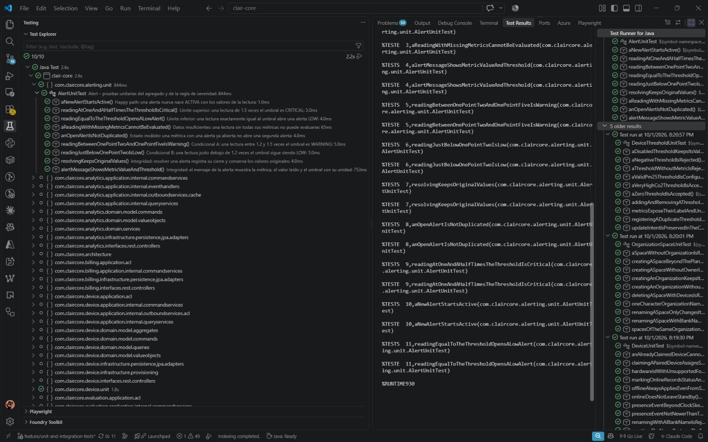

Las 9 pruebas pasan. Los cortes de severidad se prueban en sus valores exactos: una lectura igual al umbral es LOW, desde 1.2 veces el umbral es WARNING y desde 1.5 veces es CRITICAL.

**`IamUnitTest`** (IAM, 10 pruebas, WS-US-01 a WS-US-04)

Prueba los agregados `User` y `RegistrationSession` y los value objects `VerificationCode`, `Password` y `EmailAddress`.

| Categoría | Prueba | US |
|---|---|---|
| Happy | Confirmar el registro activa al usuario | WS-US-02 |
| Límite superior | Un código válido justo antes de expirar todavía se acepta | WS-US-02 |
| Límite inferior | Un código correcto pero ya expirado es rechazado | WS-US-02 |
| Datos insuficientes | Un correo vacío no permite crear la cuenta | WS-US-01 |
| Datos insuficientes | Un código de verificación con formato inválido es rechazado | WS-US-02 |
| Estado inválido | Un usuario registrado con correo queda pendiente de verificación | WS-US-03 |
| Condicional A | Un usuario creado con correo y contraseña no es usuario OAuth | WS-US-03 |
| Condicional B | Un usuario creado con Google nace activo y es usuario OAuth | WS-US-04 |
| Integridad | Un código distinto al enviado no verifica la sesión | WS-US-02 |
| Integridad | Vincular Google a una cuenta existente conserva su correo e identidad | WS-US-04 |

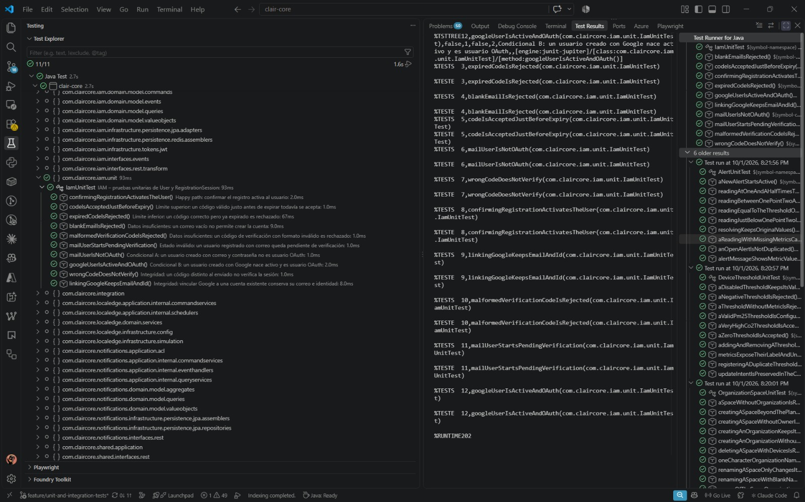

Las 10 pruebas pasan. Las condicionales separan los dos tipos de cuenta: la creada con correo queda pendiente hasta confirmar el código, y la creada con Google nace activa porque Google ya verificó el correo.

#### 6.1.1.2. Core Integration Tests.

Estas pruebas levantan el contexto completo de Spring con `@SpringBootTest` y usan los command services, query services y repositorios JPA reales sobre H2 en memoria. Cada prueba pasa por al menos dos capas o dos bounded contexts. Llaman a los services y no a los controllers, porque los controllers ya están cubiertos por las pruebas `@WebMvcTest` del proyecto.

Ubicación: `src/test/java/com/claircore/integration/`.

La suite se apoya en dos piezas:

- El perfil `it` (`src/test/resources/application-it.properties`) usa H2 en memoria, desactiva Flyway y genera el esquema con `ddl-auto=create-drop`. También apaga el local edge y los jobs en segundo plano, que escribirían datos mientras corre una prueba, y pone valores ficticios para JWT, Google, Stripe y OneSignal.
- La clase base `AbstractIntegrationTest` activa ese perfil y reemplaza con `@MockitoBean` solo lo que sale del proceso: las sesiones de IAM guardadas en Redis (`TokenSessionRepository`, `RegistrationSessionRepository`), el pago con Stripe (`PaymentGateway`), el envío de correos y notificaciones push (`EmailDeliveryService`, `PushNotificationDeliveryService`, `AsyncNotificationService`) y Google OAuth (`GoogleTokenVerifier`, `GoogleTokenExchange`). La caché, que en producción usa Redis, se cambia por un `NoOpCacheManager`.

La clase base no lleva `@Transactional`. Los handlers que conectan un contexto con otro escuchan en `AFTER_COMMIT`, y si la prueba hiciera rollback nunca se ejecutarían. Por eso las tablas se vacían en un `@AfterEach` después de cada prueba.

En las capturas, cada ejecución tarda entre 12 y 16 segundos. Casi todo ese tiempo es el arranque del contexto de Spring; las pruebas de cada clase suman menos de 600 ms.

**`DeviceClaimIntegrationTest`**

| Contexto | Prueba | Verifica | US |
|---|---|---|---|
| Device | Un dispositivo emparejado y reclamado aparece en el listado de su espacio | El pair y el claim se persisten y la query del espacio los devuelve | WS-US-10, WS-US-11, WS-US-12 |
| Device | El código de reclamo se consume: no se puede volver a usar para otro usuario | El `ClaimToken` es de un solo uso | WS-US-11 |
| Device + Billing | Con plan Freemium, Billing limita a 1 el número de dispositivos reclamados | Device consulta a Billing el límite del plan antes de aceptar el reclamo | WS-US-11, WS-US-46 |

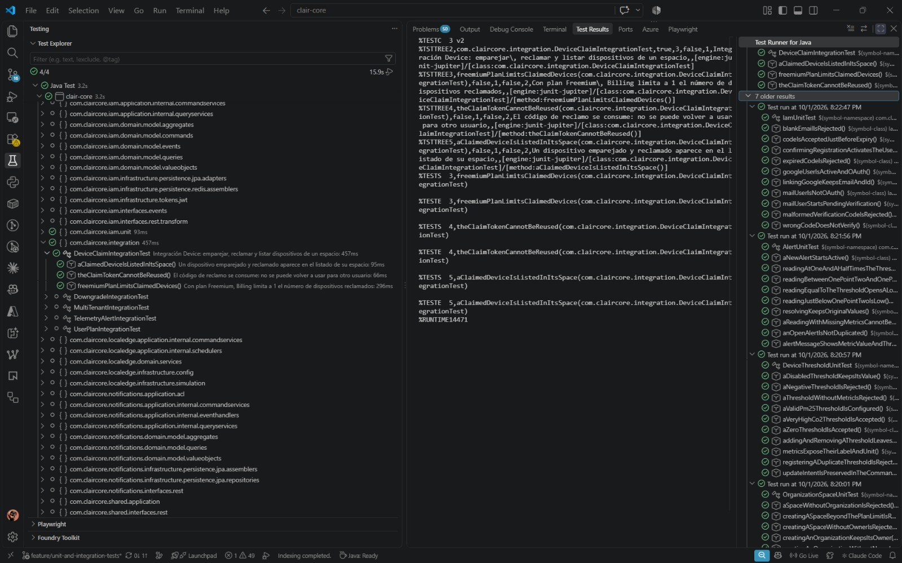

Las 3 pruebas pasan. La tercera es la que cruza contextos: el segundo reclamo de un usuario Freemium falla por el límite que devuelve Billing.

**`MultiTenantIntegrationTest`**

| Contexto | Prueba | Verifica | US |
|---|---|---|---|
| Device | El dueño ve su organización, su espacio y su dispositivo persistidos | Las queries `...ForUserQuery` devuelven los recursos propios | WS-US-25, WS-US-30, WS-US-13 |
| Device | Otro usuario no puede leer la organización, el espacio ni el dispositivo ajenos | Las mismas queries no devuelven nada a un usuario distinto del dueño | WS-US-25, WS-US-30, WS-US-13 |
| Device | Listar los dispositivos de un espacio ajeno es denegado | Solo el dueño del espacio puede listar sus sensores | WS-US-12 |

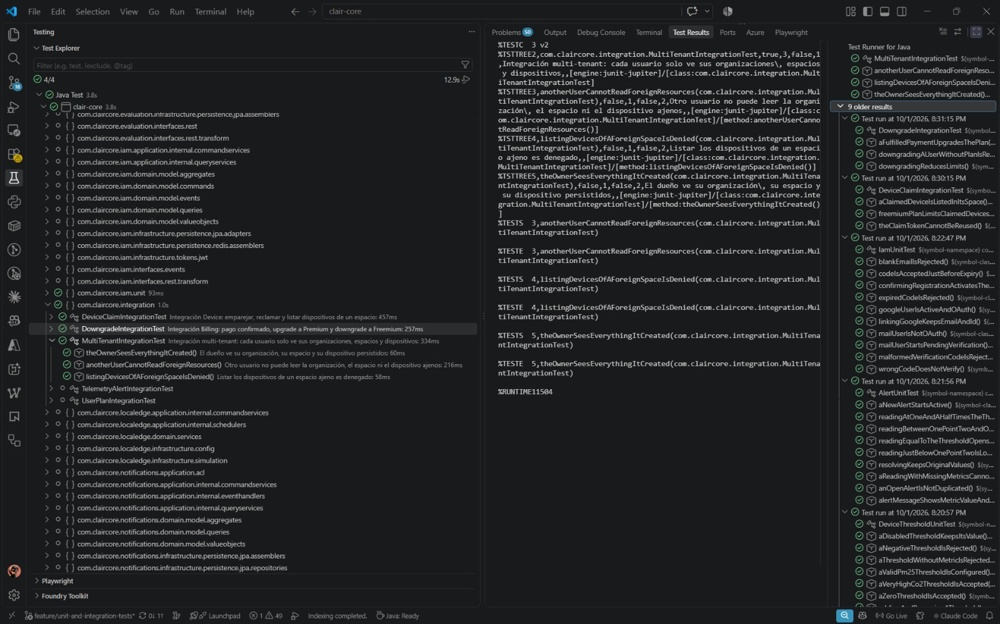

Las 3 pruebas pasan. Se crean los recursos con un usuario y se consultan con otro, sobre los mismos datos persistidos.

**`DowngradeIntegrationTest`**

| Contexto | Prueba | Verifica | US |
|---|---|---|---|
| Billing (fachada) | Un pago confirmado sube el plan a Premium y los otros contextos ven los límites nuevos | Tras confirmar el pago, el plan queda en Premium y `BillingContextFacade` devuelve 10 dispositivos y acceso a reportes mensuales | WS-US-48, WS-US-46 |
| Billing (fachada) | Degradar a Freemium persiste el plan y reduce los límites que ven los otros contextos | El plan vuelve a Freemium y la fachada devuelve 1 dispositivo y sin reportes mensuales | WS-US-47 |
| Billing | Degradar a un usuario sin plan registrado es rechazado | Solo se degrada un plan que existe | WS-US-47 |

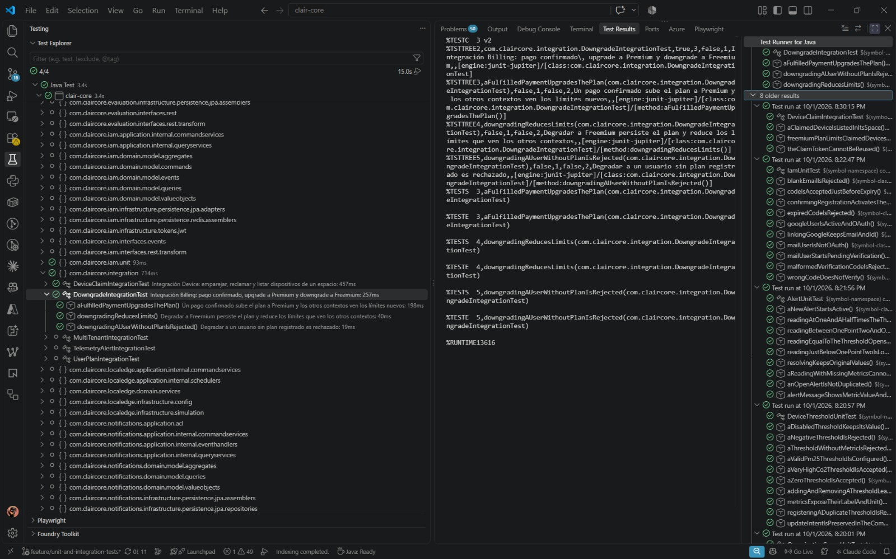

Las 3 pruebas pasan. Los límites se leen a través de `BillingContextFacade` porque Device y Analytics consultan el plan por esa fachada, desde sus adaptadores `ExternalBillingService`.

**`TelemetryAlertIntegrationTest`**

| Contexto | Prueba | Verifica | US |
|---|---|---|---|
| Device + Evaluation + Alerting | Una lectura de PM2.5 por encima del umbral abre una alerta CRITICAL para el dispositivo | El `TelemetryRecordedIntegrationEvent` de Evaluation activa el handler de Alerting, que compara la lectura con el umbral configurado en Device y guarda la alerta | WS-US-18, WS-US-49, WS-US-34 |
| Evaluation + Alerting | Una lectura por debajo del umbral no abre ninguna alerta | Con aire limpio no se generan alertas falsas | WS-US-49, WS-US-34 |
| Evaluation + Alerting | Una lectura posterior por debajo del umbral resuelve la alerta abierta | La alerta se cierra sola cuando la lectura vuelve a estar bajo el umbral | WS-US-36, WS-US-49 |

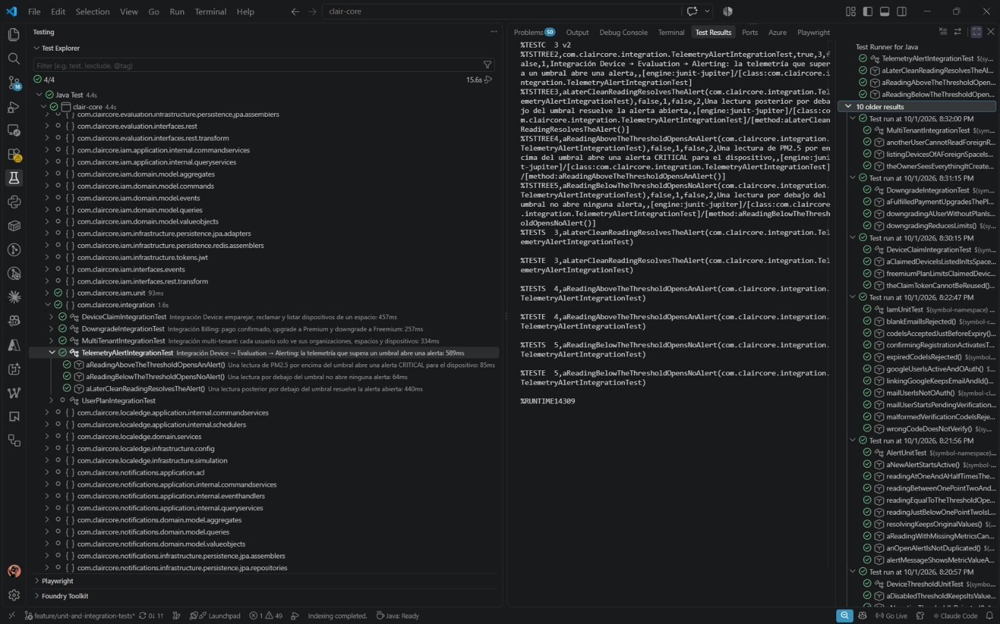

Las 3 pruebas pasan. El evento de telemetría se publica dentro de una transacción para que el handler, que escucha en `AFTER_COMMIT`, se ejecute igual que en producción.

**`UserPlanIntegrationTest`**

| Contexto | Prueba | Verifica | US |
|---|---|---|---|
| IAM + Billing | Registrar y confirmar una cuenta persiste al usuario activo y Billing le asigna Freemium | Al confirmar el registro, `UserRegisteredEventHandler` crea el plan Freemium del usuario | WS-US-01, WS-US-02, WS-US-46 |
| IAM + Billing | Un código de verificación incorrecto no crea usuario ni plan | Si el registro no se confirma, no se guarda nada en IAM ni en Billing | WS-US-02 |
| IAM | Un correo ya registrado no puede iniciar un segundo registro | Un correo identifica a una sola cuenta | WS-US-01 |

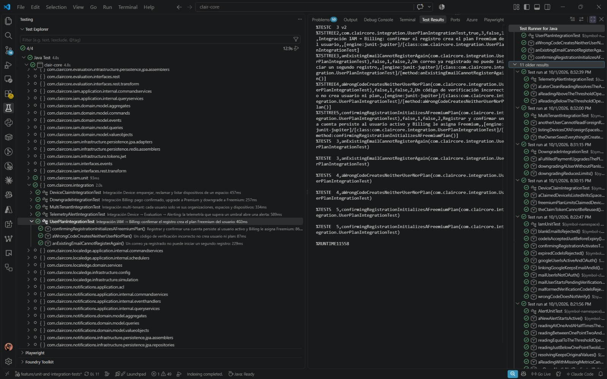

Las 3 pruebas pasan. La segunda revisa los dos contextos a la vez: con un código incorrecto no queda un usuario sin plan ni un plan sin usuario.

#### 6.1.1.3. Core Behavior-Driven Development

Estas pruebas escriben los criterios de aceptación de las User Stories como especificaciones ejecutables en Gherkin español (`# language: es`). Cada feature usa `Característica:`, escenarios `Dado` / `Cuando` / `Entonces` / `Y` y se vincula a su WS-US en la cabecera. A diferencia de las Unit e Integration Tests, el runner levanta Clair Core en un puerto aleatorio y habla con la API por HTTP.

Ubicación: `src/test/resources/features/`. Los archivos siguen el patrón `WS-USxx-Titulo.feature`. El runner es `CucumberRunnerTest` (`@Suite`, motor Cucumber, glue `com.claircore.bdd`).

La suite se apoya en las mismas piezas herméticas que las Integration Tests:

- El perfil `it` (`src/test/resources/application-it.properties`) usa H2 en memoria, desactiva Flyway, genera el esquema con `ddl-auto=create-drop` y apaga el local edge. JWT, Google, Stripe y OneSignal llevan valores ficticios.
- `CucumberSpringConfiguration` activa ese perfil e importa `HermeticHttpTestConfiguration`: las sesiones de IAM viven en `InMemoryTokenSessionRepository` e `InMemoryRegistrationSessionRepository`, y la caché es un `NoOpCacheManager`. Así no se contacta Redis.
- Las *step definitions* (`RegistrationStepDefinitions`, `SignInStepDefinitions`, `OrganizationSpaceStepDefinitions`, `DeviceThresholdStepDefinitions`, `TelemetryAlertStepDefinitions`, `HttpResponseStepDefinitions`) usan anotaciones Cucumber en español (`@Dado`, `@Cuando`, `@Entonces`, `@Y`) y heredan de `AbstractCucumberSteps`, que centraliza el JWT, el `TestRestTemplate` y la captura del código de `/api/v1/auth/confirm` con `ArgumentCaptor` sobre `ExternalNotificationService`. Stripe, Google OAuth, el correo SMTP y OneSignal se reemplazan con `@MockitoBean`. Después de cada escenario se vacían las tablas H2.

Cumplen la rúbrica: hay al menos dos features con `Esquema del escenario` + `Ejemplos` (inicio de sesión y umbrales) y al menos dos con `Data Table` (espacios y telemetría). Los decimales viajan como `String` y se convierten a `BigDecimal` en las step definitions.

**`WS-US01-Registro-de-usuario.feature`** (IAM, 2 escenarios, WS-US-01 y WS-US-02)

```gherkin
# language: es
@WS-US-01 @WS-US-02
Característica: Registro de usuario con código de verificación
  Como visitante de Clair
  Quiero registrarme con mi correo y una contraseña y confirmarlo con un código
  Para acceder a la plataforma como usuario verificado

  Escenario: Confirmar el registro con el código recibido por correo
    Dado que un visitante inicia su registro con un correo nuevo y la contraseña "Clair@2026"
    Cuando confirma el registro con el código de verificación recibido
    Entonces la respuesta tiene estado 201
    Y la cuenta queda activa y puede iniciar sesión con la contraseña "Clair@2026"

  Escenario: Rechazar la confirmación con un código inválido
    Dado que un visitante inicia su registro con un correo nuevo y la contraseña "Clair@2026"
    Cuando confirma el registro con el código "ZZZZ-ZZZZ"
    Entonces la respuesta tiene estado 400
    Y la cuenta no queda creada
```

Los 2 escenarios pasan. `RegistrationStepDefinitions` captura el código que envía `ExternalNotificationService.sendVerificationCode`. Un código inventado deja la cuenta sin crear: el siguiente `POST /api/v1/auth/sign-in` responde 401.

**`WS-US03-Inicio-de-sesion.feature`** (IAM, esquema de 3 ejemplos, WS-US-03)

```gherkin
# language: es
@WS-US-03
Característica: Inicio de sesión con contraseña
  Como usuario verificado de Clair
  Quiero iniciar sesión con mi correo y contraseña
  Para obtener un token de acceso a mis espacios y dispositivos

  Esquema del escenario: Autenticar credenciales
    Dado que existe un usuario verificado con correo "ana@clair.pe" y contraseña "Clair@2026"
    Cuando inicia sesión con correo "<correo>" y contraseña "<contrasena>"
    Entonces la respuesta tiene estado <estado>

    Ejemplos:
      | correo         | contrasena | estado |
      | ana@clair.pe   | Clair@2026 | 200    |
      | ana@clair.pe   | Incorrecta | 401    |
      | nadie@clair.pe | Clair@2026 | 401    |
```

Los 3 ejemplos pasan. El esquema cubre el happy path y los dos fallos de autenticación: contraseña incorrecta y correo inexistente. `AuthenticationController` documenta 401 para ambos.

**`WS-US24-Organizacion-y-espacios.feature`** (Device + Billing, 2 escenarios, WS-US-24, WS-US-29 y WS-US-31)

```gherkin
# language: es
@WS-US-24 @WS-US-29 @WS-US-31
Característica: Organización y espacios
  Como administrador de instalaciones
  Quiero crear mi organización y registrar sus espacios físicos
  Para ubicar los sensores Clair en cada ambiente monitoreado

  Escenario: Un administrador Premium registra varios espacios en su organización
    Dado que un administrador de instalaciones con plan "PREMIUM" ha iniciado sesión
    Cuando crea la organización "Oficinas Vanana"
    Y registra los siguientes espacios en la organización:
      | nombre            | estado |
      | Sala de reuniones | 201    |
      | Laboratorio IoT   | 201    |
      | Recepción         | 201    |
    Entonces cada espacio recibe el estado indicado
    Y la organización "Oficinas Vanana" aparece en su listado de organizaciones
    Y el listado de espacios de la organización contiene:
      | nombre            |
      | Sala de reuniones |
      | Laboratorio IoT   |
      | Recepción         |

  Escenario: El plan Freemium limita la organización a un solo espacio
    Dado que un administrador de instalaciones con plan "FREEMIUM" ha iniciado sesión
    Cuando crea la organización "Casa Moreira"
    Y registra los siguientes espacios en la organización:
      | nombre     | estado |
      | Dormitorio | 201    |
      | Cocina     | 409    |
    Entonces cada espacio recibe el estado indicado
    Y el listado de espacios de la organización contiene:
      | nombre     |
      | Dormitorio |
```

Los 2 escenarios pasan. `PlanType.FREEMIUM` permite 1 espacio y `PREMIUM` permite 5. El segundo espacio Freemium lanza `IllegalStateException`, que `GlobalExceptionHandler` mapea a HTTP 409.

**`WS-US18-Umbrales-de-dispositivo.feature`** (Device, esquema de 4 ejemplos, WS-US-18 y WS-US-19)

```gherkin
# language: es
@WS-US-18 @WS-US-19
Característica: Umbrales de métricas por dispositivo
  Como usuario dueño de un sensor Clair
  Quiero definir y ajustar el umbral de cada métrica de calidad del aire
  Para que el sistema me alerte cuando una lectura lo supere

  Esquema del escenario: Crear y actualizar el umbral de una métrica
    Dado que el usuario tiene un dispositivo Clair reclamado en su espacio
    Cuando crea un umbral para la métrica "<metrica>" con valor "<valor>"
    Entonces la respuesta tiene estado 201
    Y el dispositivo tiene un umbral activo de "<metrica>" con valor "<valor>"
    Cuando actualiza el umbral de la métrica "<metrica>" al valor "<nuevo_valor>"
    Entonces la respuesta tiene estado 200
    Y el dispositivo tiene un umbral activo de "<metrica>" con valor "<nuevo_valor>"

    Ejemplos:
      | metrica     | valor   | nuevo_valor |
      | PM25        | 35.00   | 50.00       |
      | CO2         | 1000.00 | 1200.00     |
      | TEMPERATURE | 28.50   | 30.00       |
      | HUMIDITY    | 70.00   | 75.50       |
```

Los 4 ejemplos pasan. Los valores viajan como `String` en Gherkin y se convierten a `BigDecimal` en `DeviceThresholdStepDefinitions`, alineado con `UpdateDeviceThresholdRequest`.

**`WS-US49-Telemetria-y-alertas.feature`** (Evaluation + Alerting, 2 escenarios, WS-US-49 y WS-US-34)

```gherkin
# language: es
@WS-US-49 @WS-US-34
Característica: Telemetría y alertas por umbral
  Como usuario dueño de un sensor Clair
  Quiero que cada lectura de telemetría se evalúe contra mis umbrales
  Para recibir una alerta solo cuando la calidad del aire empeora

  Escenario: Una lectura que supera el umbral genera una alerta
    Dado que el usuario tiene un dispositivo Clair reclamado con umbral de "PM25" en "50.00"
    Cuando el dispositivo envía las siguientes lecturas:
      | pm25 | co2   | temperatura | humedad |
      | 12.0 | 450.0 | 23.5        | 52.0    |
      | 18.5 | 470.0 | 23.8        | 51.0    |
      | 80.0 | 480.0 | 24.1        | 50.5    |
    Entonces se registran 3 lecturas de telemetría para el dispositivo
    Y el usuario tiene 1 alerta activa de "PM25" con severidad "CRITICAL"

  Escenario: Lecturas dentro del umbral no generan alertas
    Dado que el usuario tiene un dispositivo Clair reclamado con umbral de "CO2" en "1000.00"
    Cuando el dispositivo envía las siguientes lecturas:
      | pm25 | co2   | temperatura | humedad |
      | 10.0 | 600.0 | 22.0        | 55.0    |
      | 11.0 | 750.0 | 22.4        | 54.0    |
    Entonces se registran 2 lecturas de telemetría para el dispositivo
    Y el usuario no tiene alertas registradas
```

Los 2 escenarios pasan. El cuerpo HTTP sigue `EvaluateTelemetryResource`. Una lectura de PM2.5 = 80.0 sobre umbral 50.00 tiene razón ≥ 1.5 y abre alerta `CRITICAL`. Las lecturas bajo el umbral no generan alertas.

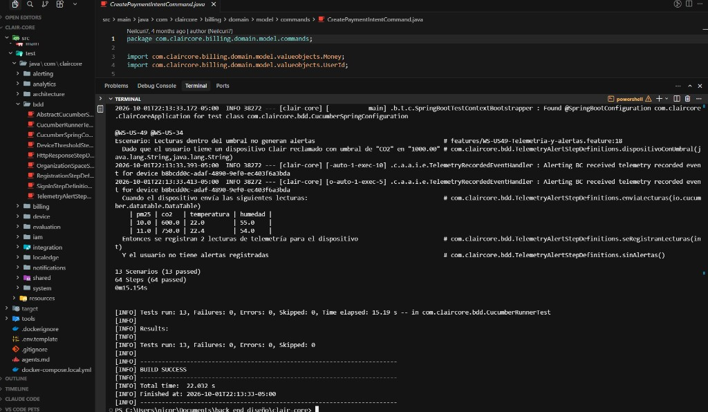

Las 13 pruebas pasan (64 pasos). El runner confirma el registro con el código capturado, aplica los cupos de Billing y evalúa la telemetría contra umbrales persistidos.

#### 6.1.1.4. Core System Tests.

Esta prueba recorre Clair Core de punta a punta por HTTP: levanta la aplicación con `@SpringBootTest` y `RANDOM_PORT`, usa el perfil `it` (H2 en memoria) y la misma `HermeticHttpTestConfiguration` que BDD, y encadena IAM, Billing, Device, Evaluation, Alerting y Analytics en un solo usuario. La clase es `ClairEndToEndSystemTest` (`@TestMethodOrder(OrderAnnotation.class)`). Cada paso tiene `@DisplayName` en español, patrón AAA y el comentario `// Business / User Story Rational (WS-US-xx):`.

Ubicación: `src/test/java/com/claircore/system/ClairEndToEndSystemTest.java`.

Los adaptadores fuera del proceso se mockean igual que en BDD: `PaymentGateway`, `GoogleTokenVerifier`, `GoogleTokenExchange`, `ExternalNotificationService`, `EmailDeliveryService` y `PushNotificationDeliveryService`. El recorrido crea su propio sensor con `ImportDevicesCommand` y lo empareja, para no depender de seeds ni de un `hardwareId` compartido.

| Paso | Prueba | Verifica | US |
|---|---|---|---|
| 1 | Registrarse y confirmar la cuenta con el código enviado por correo | `POST /api/v1/auth/sign-up` (201) y `confirm` (201) con el código capturado | WS-US-01, WS-US-02 |
| 2 | Iniciar sesión obtiene el JWT y Billing asignó el plan Freemium | `POST /api/v1/auth/sign-in` (200) y `GET /api/v1/subscriptions/plans/{userId}` → `freemium` | WS-US-03, WS-US-46 |
| 3 | Crear una organización y un espacio propios | `POST /api/v1/organizations` y `POST /api/v1/spaces` (201) | WS-US-24, WS-US-29 |
| 4 | Emparejar y reclamar un sensor Clair en el espacio | `POST /api/v1/devices/pair` (201) y `claim` (200) | WS-US-10, WS-US-11 |
| 5 | Configurar el umbral de PM2.5 del dispositivo | `POST /api/v1/devices/{id}/thresholds` (201), valor `50.00` | WS-US-18 |
| 6 | Registrar una lectura que supera el umbral notifica al dueño por push | `POST /api/v1/evaluations/telemetry` (201); se verifica el envío push | WS-US-49, WS-US-52 |
| 7 | La lectura que supera el umbral aparece como alerta activa | `GET /api/v1/alerts?status=ACTIVE` — métrica PM25, severidad CRITICAL | WS-US-34 |
| 8 | El resumen de analíticas lista el espacio y el dispositivo | `GET /api/v1/analytics/overview` — `deviceCount = 1` y el `spaceId` creado | WS-US-43 |
| 9 | Cerrar sesión revoca el refresh token | `DELETE /api/v1/auth/sign-out` (204); el siguiente `POST /api/v1/auth/refresh` responde 401 | WS-US-07, WS-US-08 |

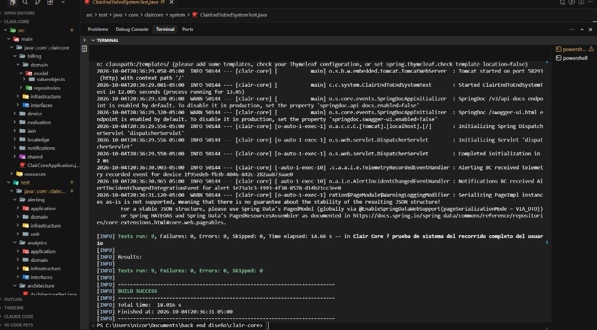

Las 9 pruebas pasan. El recorrido confirma que un usuario Freemium recién verificado puede ubicar un sensor, definir un umbral, recibir la alerta de una lectura fuera de rango y perder el refresh token al cerrar sesión.

El workflow `.github/workflows/ci.yml` (`Build and Run Test Suites`) no levanta contenedores: solo configura JDK 25 y ejecuta `mvn -B clean verify`. Las cuatro suites corren en ese job sobre H2.

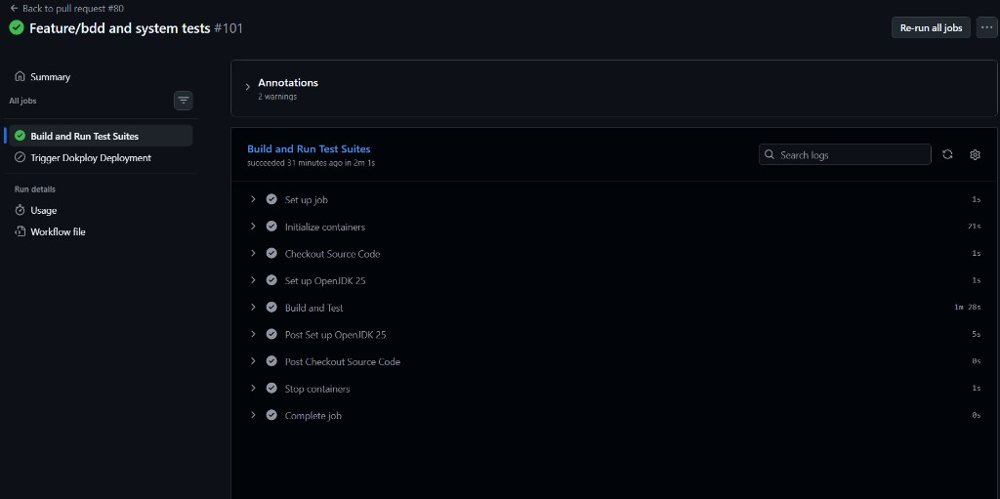

### 6.1.2. Mobile App Tests.

Video Demo con Patrol

https://youtu.be/gBeA6RfTZ70

[](https://youtu.be/gBeA6RfTZ70)

La aplicación móvil de Clair (Flutter 3 / Dart, `mobile/`) se prueba con tres capas que ejercitan distintos niveles de la arquitectura hexagonal. Ninguna requiere Docker, base de datos ni Redis externos.

| Suite | Nivel | Aísla | Tecnología | Pruebas |
|---|---|---|---|---|
| Unit Tests | Value objects, cubits, gateways con Dio real sobre `FakeHttpClientAdapter` | Sin emulador ni backend | `flutter_test` + `mocktail` + `bloc_test` | 1269 (109 archivos) |
| Widget Tests | Widgets + cubits reales con servicios mockeados | `testWidgets` + harnesses localizados | `flutter_test` + `mocktail` + `bloc_test` | 273 (24 archivos) |
| System Tests (Patrol) | App completa contra el backend de staging | Emulador Android real (x86_64, sin KVM) | Patrol 4.10.0 + JUnit | 16 (16 archivos) |

Convenciones que siguen las tres suites:

- Cada prueba está dentro de un `group(...)` con nombre legible (por clase, bounded context o User Story).
- El cuerpo sigue el patrón AAA, marcado con los comentarios `// Arrange`, `// Act`, `// Assert`.
- Las dependencias externas (gateway HTTP, secure storage, push, OneSignal) se mockean con `mocktail` o se sustituyen por adaptadores en memoria (`FakeHttpClientAdapter`, `LocalizedApp`). El backend real de `clair-core` solo lo toca la suite Patrol.
- Las pruebas se ejecutan con `nix-shell --run "flutter test"` (unit + widget) y `nix-shell --run "patrol test --target patrol_test/test_bundle.dart"` (system).

Las suites se distribuyen entre las cuatro subsecciones siguientes, en el mismo orden que las pruebas de backend.

<p align="center">
 
</p>

#### 6.1.2.1 Core Entities Unit Tests.

Estas pruebas instancian los value objects, agregados, queries, commands y cubits del dominio directamente, sin contexto de Flutter ni base de datos. Cuando una regla vive en el command service y no en el agregado (por ejemplo la persistencia de un dispositivo o el conteo de spaces por plan), se instancia el service con sus gateways y repositorios reemplazados por adaptadores en memoria (`FakeHttpClientAdapter` ejercita el Dio real sin abrir conexiones de red). Los cubits se prueban con `bloc_test`, que emite estados esperados y verifica que el cubit reacciona al evento correcto. Cada archivo cubre entre 5 y 30 pruebas según el tamaño de la clase; no siguen la rúbrica de 8 categorías como el backend porque el estilo de Flutter favorece `group` + `test` con descripciones en lenguaje plano.

Ubicación: `mobile/test/unit/contexts/<bounded_context>/`.

A continuación las clases más representativas de cada bounded context. El conteo total (1269) se reparte entre los siete contextos (`alerts` 256, `devices` 332, `evaluation` 114, `notifications` 130, `iam` 119, `analytics` 239, `core`/`shared` 79).

**`AlertUnitTest`** y value objects de alerts (`mobile/test/unit/contexts/alerts/`, 256 pruebas)

Prueban el value object `Alert` y sus hermanos (`AlertId`, `AlertSeverity`, `AlertStatus`, `AlertPageValue`, `DailyAlertCount`, `MetricType`), la query service `AlertsQueryServiceImpl` con su `FakeHttpClientAdapter`, los recursos REST (`AlertResponse`, `AlertPage`, `DailyAlertSummary`), el transformador JSON↔dominio y el `AlertsCubit` con `bloc_test`.

| Categoría | Prueba | Capa |
|---|---|---|
| Value object | Un `Alert` recién creado expone sus campos tal como se pasó al constructor | Dominio |
| Value object | `AlertSeverity` rechaza un valor numérico fuera del rango de severidades conocidas | Dominio |
| Query | `getAlertsQuery` rechaza un `page` negativo antes de llegar al gateway | Dominio |
| Query | `getAlertsDailySummaryQuery` requiere un rango de fechas con inicio ≤ fin | Dominio |
| Service | `AlertsQueryServiceImpl.getAlerts` traduce el error 401 del backend a `AuthenticationRequired` | Aplicación |
| Service | `AlertsQueryServiceImpl.getAlertsBySpace` agrega el query param `spaceId` a la request | Aplicación |
| Gateway | `AlertsHttpGateway.getAlerts` emite `GET /api/v1/alerts?status=...&page=...&size=...` | Infraestructura |
| Gateway | `AlertsHttpGateway.getAlerts` deserializa un body 401 a `DioException` | Infraestructura |
| Cubit | el cubit emite `AlertsLoading` → `AlertsLoaded` cuando el service responde OK | Interfaces |
| Cubit | el cubit emite `AlertsError(message)` cuando el service devuelve `Failure` | Interfaces |

Las 256 pruebas pasan. Los value objects cubren la rúbrica de happy / datos insuficientes / estado inválido / integridad en un solo archivo cada uno (por ejemplo, `metric_type_valueobject_test.dart` prueba los 4 estados posibles del enum y los códigos que llegan como JSON).

**`DevicesHttpGatewayTest`** (`mobile/test/unit/contexts/devices/infrastructure/gateways/`, 24 pruebas)

Ejercita el gateway HTTP de dispositivos contra un `FakeHttpClientAdapter` que graba cada request y reproduce respuestas guionadas. Es el archivo más parecido a una prueba de integración, porque el gateway usa el `Dio` real con su pipeline de interceptors.

| Categoría | Prueba | Verifica |
|---|---|---|
| Happy | `getDevicesBySpaceRaw` emite `GET /api/v1/devices?spaceId=...&page=0&size=20` | URL y query params correctos |
| Happy | `getDeviceCountBySpace` lee `totalElements` del page y devuelve el conteo | parsing JSON |
| Límite | `getDeviceCountBySpace` con `size=1` evita descargar el contenido | uso eficiente del backend |
| Datos insuficientes | `getDeviceById` con `deviceId` vacío emite request al endpoint por id vacío (validación en backend) | contrato honesto |
| Estado inválido | `pairDevice` con `hardwareId` mal formado devuelve 400 → `DioException` | manejo de errores |
| Condicional A | `claimDevice` con código de un solo uso falla con 409 la segunda vez | anti-replay |
| Condicional B | `deleteDevice` con 204 borra y devuelve `Right(null)` | éxito silencioso |
| Integridad | el `Authorization` header se reenvía tal cual desde el Dio base | autenticación propagada |

Las 24 pruebas pasan en menos de 800 ms gracias al adapter en memoria.

**`NotificationsCubitTest`** (`mobile/test/unit/contexts/notifications/interfaces/pages/notifications_cubit_test.dart`, 26 pruebas)

Usa `bloc_test` para emitir los estados esperados cuando el cubit recibe cada evento del usuario. Mockea el `NotificationsQueryService` con `mocktail`.

| Categoría | Prueba | Cubre |
|---|---|---|
| Estado inicial | el cubit arranca en `NotificationsLoading` y dispara `load()` | bootstrap |
| Happy | tras `load()` exitoso emite `NotificationsLoaded(items)` | flujo normal |
| Paginación | `loadMore()` concatena los items nuevos sin duplicar los ya cargados | paginación incremental |
| Filtro | `applyFilter(type)` reemplaza la lista y vuelve a la página 0 | reset del cursor |
| Error recuperable | un 401 lleva a `NotificationsError.authenticationRequired` | ACL con IAM |
| Error recuperable | un 404 lleva a `NotificationsError.notFound` | recurso borrado entre cargas |
| Estado inválido | dos `loadMore()` concurrentes se serializan (no duplican páginas) | concurrencia |
| Integridad | un error de red transitorio (DioException) reintenta automáticamente 1 vez antes de fallar | resiliencia |

Las 26 pruebas pasan. La concurrencia se prueba con `Future.wait` para forzar que dos `loadMore()` lleguen al mismo tiempo.

**`AnalyticsPresentationTest`** (`mobile/test/unit/contexts/analytics/interfaces/rest/transform/analytics_presentation_test.dart`, 73 pruebas)

El archivo más grande de la suite. Cubre el transformador que convierte el JSON crudo del backend (`/api/v1/analytics/overview` y `/api/v1/analytics/trends`) en los modelos de presentación que consume la UI: `DashboardMetrics`, `TrendPoint`, `Aqi`, `MetricDelta`, `LiveTelemetry`.

| Categoría | Sub-categorías | Cantidad |
|---|---|---|
| Mapeo de campos | nombre ↔ etiqueta localizada, unidades, formato de número | 28 |
| Estados del aire | AQI y delta se calculan a partir del PM2.5 bruto | 14 |
| Live indicator | `LiveTelemetry` se marca como `stale` si el último sample tiene más de N segundos | 18 |
| Series temporales | `TrendPoint` se ordena por timestamp ascendente y rellena huecos con `null` | 13 |

Las 73 pruebas pasan. La separación entre `analytics_transform.dart` (JSON ↔ dominio) y `analytics_presentation.dart` (dominio ↔ UI) es lo que permite tener esta suite tan granular sin tocar el resto de la app.

<p align="center">
 
</p>

#### 6.1.2.2 Mobile App Integration Tests.

Estas pruebas ejercitan widgets reales de Flutter con sus cubits y servicios, pero con el resto del mundo mockeado (HTTP, secure storage, push). El binding es `TestWidgetsFlutterBinding` (no `PatrolBinding`), por lo que corren dentro de `flutter test` sin necesidad de emulador. Son las más parecidas a las Integration Tests del backend: cruzan al menos dos capas.

Ubicación: `mobile/test/widget/contexts/<bounded_context>/`. **Total: 273 pruebas en 24 archivos.**

Para resolver el problema común de los widgets que necesitan `AppLocalizations` cargado, hay un harness compartido en `mobile/test/widget/contexts/iam/helpers/auth_widget_harness.dart` que envuelve cualquier widget en un `MaterialApp` con los delegates de localización:

```dart
Widget localizedApp(Widget child) {
  return MaterialApp(
    localizationsDelegates: AppLocalizations.localizationsDelegates,
    supportedLocales: AppLocalizations.supportedLocales,
    home: Scaffold(body: Center(child: child)),
  );
}
```

**`AlertsScreenTest`** (`mobile/test/widget/contexts/alerts/alerts_screen_test.dart`, 18 pruebas)

Pumpea `AlertsScreen` con un `AlertsCubit` real conectado a un `AlertsQueryService` mockeado con `mocktail`. Cubre los cuatro grupos de comportamiento del usuario.

| Grupo | Cantidad | Cubre |
|---|---|---|
| First load | 4 | pantalla de carga, lista vacía con `AlertsEmpty`, lista con 1 elemento, error con snackbar |
| Metric filter | 2 | filtro por tipo de métrica envía el query param correcto y refresca la lista |
| Tabs | 3 | cambio entre Active/History limpia el filtro y recarga |
| Pagination | 5 | `ScrollController` cerca del final dispara `loadMore`, duplicados se descartan, fin de lista desactiva el botón |
| Pull to refresh | 4 | gesto de swipe abajo recarga sin perder el scroll position |

**`NotificationsScreenTest`** (`mobile/test/widget/contexts/notifications/notifications_screen_test.dart`, 16 pruebas)

Cubre la pantalla de notificaciones accesible desde el bell icon del `ClairAppBar`. Usa el cubit real y mockea el servicio.

| Grupo | Cantidad | Cubre |
|---|---|---|
| Empty state | 3 | sin notificaciones → texto localizado + icono |
| Listado | 4 | cada `NotificationLog` se renderiza con su `severityBadge` y su `timestamp` formateado |
| Tap to read | 3 | tap marca la notificación como leída en el cubit |
| Clear all | 6 | long-press abre el diálogo de confirmación, cancelar no hace nada, confirmar vacía la lista |

**`AppRouterRedirectTest`** (`mobile/test/widget/contexts/core/app_router_redirect_test.dart`, 8 pruebas)

Pumpea `AppRouter` con cubits mockeados y verifica las redirecciones que el `refreshListenable: AuthSession` dispara.

| Estado inicial | Acción esperado | Red |
|---|---|---|
| No autenticado, ruta `/login` | se queda en `/login` | sin redirección |
| No autenticado, ruta `/analytics` | redirige a `/login` | guard de auth |
| Autenticado, ruta `/login` | redirige a `/analytics` | post-login |
| Autenticado, ruta `/register` | redirige a `/analytics` | post-register (futuro) |
| Auth cambia de true a false | `/analytics` redirige a `/login` | logout cierra la ruta |
| Logout con refresh token expirado | `/login` se queda | sin loop infinito |

Las 8 pruebas pasan y cubren exactamente la matriz de transiciones que documenta §6.1.1.4 (system tests) del backend pero desde la UI.

**`SharedIconsTest`, `ClairAppBarTest`, `ScaffoldWithNavBarTest`** (`mobile/test/widget/contexts/shared/`, 68 pruebas en total)

Cubren los widgets compartidos entre bounded contexts.

| Widget | Pruebas | Verifica |
|---|---|---|
| `shared_icons.dart` (AirQualityIcon, AlertsIcon, SpaceDevicesIcon) | 26 | color y tamaño según `selectedIndex` del bottom-nav |
| `clair_app_bar.dart` | 17 | back fallback, settings icon navega a `/settings`, notification icon navega a `/notifications`, título con el logo |
| `scaffold_with_nav_bar.dart` | 15 | tabs resaltados según ruta, gestos, deep links `/analytics`, `/alerts`, `/spaces` |

**`AnalyticsCubitTest` (widget subset)** — No confundir con el del §6.1.2.1. Cubre 56 pruebas repartidas entre `metric_card_test.dart` (8), `trend_chart_card_test.dart` (12), `aqi_gauge_card_test.dart` (10), `live_indicator_test.dart` (7), `calendar_selector_test.dart` (11), `analytics_presentation_format_test.dart` (8). Verifican que la presentación visual de las métricas (formato de número, color del AQI según rango, animación del live indicator, rango seleccionable en el calendario) cumple el contrato visual.

**Cubits + servicios cruzados** (`mobile/test/widget/contexts/devices/`, `iam`, 40 pruebas)

- `claim_device_form_test.dart` (11 pruebas): el formulario valida el token, muestra el spinner mientras se hace el `claim`, abre el snackbar de éxito y limpia el campo.
- `create_space_form_test.dart` (9 pruebas): el campo de nombre acepta hasta N caracteres, rechaza vacío, el botón se deshabilita mientras `isLoading=true`.
- `auth_text_field_test.dart`, `auth_button_test.dart`, `logout_button_test.dart` (20 pruebas合计): los widgets de auth validan el formato de email, deshabilitan el botón durante el submit, navegan al dashboard tras éxito.

<p align="center">
 
</p>

#### 6.1.2.3 Mobile App Behavior-Driven Development.

La aplicación móvil **no usa Cucumber/Gherkin**. Las features BDD del backend (`mobile/src/test/resources/features/...feature`) están escritas para ejercitar `clair-core` por HTTP, no la UI móvil. Hacer BDD sobre la UI mobile exigiría levantar la app con un driver tipo `patrol_cucumber` o `flutter_gherkin`, y esa inversión no se hizo porque las pruebas de §6.1.2.4 ya cumplen ese rol: cada `patrolTest` es una especificación ejecutable del comportamiento esperado para una User Story Mobile.

La trazabilidad se mantiene de dos formas:

1. **Una US Mobile → un archivo `*_test.dart`**. El nombre del archivo codifica el ID (`ma_us_03_sign_in_test.dart` cubre `MA-US-03`); la descripción del `patrolTest` lo repite en lenguaje de usuario. Si la US cambia de redacción, se busca el archivo por ID.
2. **Una US Mobile → un happy path explícito**. No se prueba el árbol de escenarios Gherkin, sino el camino feliz mínimo. Las variantes (contraseña incorrecta, código expirado, etc.) ya están cubiertas en el backend por las features BDD de §6.1.1.3; la UI móvil solo necesita verificar que el error del backend se renderiza, no reproducirlo.

Por lo tanto, la columna BDD del cuadro comparativo del backend no tiene contraparte mobile: el comportamiento se prueba con Patrol (§6.1.2.4) y el detalle de las reglas de negocio se prueba en el backend (§6.1.1.3).

#### 6.1.2.4 Mobile App System Tests.

A diferencia de las dos suites previas (que se ejecutan dentro del proceso Dart sobre el binding de test), las pruebas de sistema movilizan la app sobre un emulador Android (o un dispositivo físico) y la recorren interactuando con la UI real mientras golpean `clair-core` desplegado en staging. La URL del backend se carga desde `mobile/.env` (`CLAIR_BACKEND_BASE_URL`); si está vacía o el backend está caído, los 15 tests que tocan la API fallan (es un fallo real, no un mock).

Las pruebas se organizan como **un archivo por User Story Mobile** (`MA-US-XX`), en carpetas por bounded context. Cada archivo contiene un único `patrolTest` (un único happy path) que arranca la app con el bootstrap, atraviesa la UI y verifica un estado final observable. La correspondencia entre las User Stories de la app móvil (§3.2.4 del Capítulo III) y los archivos de Patrol es directa y trazable uno a uno.

**Estructura del directorio `mobile/patrol_test/`.**

```
patrol_test/
├── test_bootstrap.dart           # setup reusable (.env, prefs, secure storage)
├── test_bundle.dart              # GENERADO por patrol_cli
├── shared/                       # helpers reusables por bounded context
│   ├── auth_consts.dart          # credenciales QA + IDs del sensor
│   ├── auth_steps.dart           # login() y snapshotOriginalOrganizations()
│   ├── cleanup_state.dart        # safeCleanup() por device → space → org
│   └── poll_until.dart           # pollUntil() para esperas al backend
├── demo/                         # recorrido completo end-to-end
│   └── complete_user_journey_test.dart
├── iam/                          # MA-EP-01 (Identidad y Sesión)
│   ├── ma_us_03_sign_in_test.dart
│   └── ma_us_05_sign_out_test.dart
├── devices/                      # MA-EP-02 (Dispositivos / Org / Space)
│   ├── _helpers.dart
│   ├── ma_us_06..ma_us_17_test.dart   (12 archivos)
└── notifications/                # MA-EP-05
    └── ma_us_27_view_notifications_test.dart
```

Cada archivo expone un único `patrolTest(...)` con la firma:

```dart
patrolTest(
  'MA-US-XX: happy path — <verificación observable>',
  ($) async { ... },
);
```

**Cobertura MA-US → archivo `patrol_test/`.**

| User Story | Épica | Archivo Patrol |
|---|---|---|
| MA-US-03 — Iniciar Sesión con Correo y Contraseña | MA-EP-01 | `iam/ma_us_03_sign_in_test.dart` |
| MA-US-05 — Cerrar Sesión | MA-EP-01 | `iam/ma_us_05_sign_out_test.dart` |
| MA-US-06 — Crear Organización | MA-EP-02 | `devices/ma_us_06_create_organization_test.dart` |
| MA-US-07 — Actualizar Nombre de Organización | MA-EP-02 | `devices/ma_us_07_rename_organization_test.dart` |
| MA-US-08 — Eliminar Organización | MA-EP-02 | `devices/ma_us_08_delete_organization_test.dart` |
| MA-US-09 — Crear Espacio | MA-EP-02 | `devices/ma_us_09_create_space_test.dart` |
| MA-US-10 — Actualizar Nombre de Espacio | MA-EP-02 | `devices/ma_us_10_rename_space_test.dart` |
| MA-US-11 — Eliminar Espacio | MA-EP-02 | `devices/ma_us_11_delete_space_test.dart` |
| MA-US-12 — Vincular Dispositivo | MA-EP-02 | `devices/ma_us_12_pair_device_test.dart` |
| MA-US-13 — Reclamar Dispositivo a un Espacio | MA-EP-02 | `devices/ma_us_13_claim_device_test.dart` |
| MA-US-14 — Actualizar Nombre de Dispositivo | MA-EP-02 | `devices/ma_us_14_rename_device_test.dart` |
| MA-US-15 — Eliminar Dispositivo | MA-EP-02 | `devices/ma_us_15_delete_device_test.dart` |
| MA-US-16 — Configurar Umbral de Métrica | MA-EP-02 | `devices/ma_us_16_configure_threshold_test.dart` |
| MA-US-17 — Remover Umbral de Métrica | MA-EP-02 | `devices/ma_us_17_remove_threshold_test.dart` |
| MA-US-27 — Ver Lista de Notificaciones | MA-EP-05 | `notifications/ma_us_27_view_notifications_test.dart` |

**Demo completo** (`patrol_test/demo/complete_user_journey_test.dart`)

Recorre el camino feliz de toda la app en un solo `patrolTest`, ejercitando 12 pasos: sign in → create org → rename org → open org → create space → rename space → open space → pair device → claim device → open device → rename device → set thresholds → reset thresholds. Cada paso usa los helpers de `devices/_helpers.dart` y `shared/auth_steps.dart`. `tearDown` borra los recursos creados. Sirve para demos a stakeholders y para smoke-test después de un refactor.

**User Stories pendientes sin test E2E (y por qué).**

| User Story | Razón | Acción futura |
|---|---|---|
| MA-US-01 Iniciar Registro | Requiere interceptar el código de verificación (MailHog / endpoint de test) | Añadir endpoint de seed y configurar en CI |
| MA-US-02 Confirmar Registro | Depende de MA-US-01 | Idem |
| MA-US-04 Google OAuth | Requiere Google Sign-In real (no hay test mode en CI) | Mockear `GoogleSignIn` con mocktail + fake id token |
| MA-US-18 Enviar Comando | UI no implementada en `DeviceDetailScreen` | Implementar UI + agregar test |
| MA-US-19..22 Alerts | `AlertsScreen` crashea con devices recién emparejados sin telemetría | Hardening de la pantalla + alerta sintética desde backend |
| MA-US-23..26 Telemetría | Sin fixture de telemetría histórica; el dashboard y los charts quedan en estado vacío | Endpoint de seed de telemetría histórica |

**Ejecución.**

```bash
# Toda la suite (CI):
nix-shell --run "patrol test --target patrol_test/test_bundle.dart"

# Una sola US (desarrollo):
nix-shell --run "patrol develop --target patrol_test/devices/ma_us_13_claim_device_test.dart"

# Solo el demo:
nix-shell --run "patrol test --target patrol_test/demo/complete_user_journey_test.dart"

# Con credenciales distintas:
patrol test --target patrol_test/iam/ma_us_03_sign_in_test.dart \
  --dart-define TEST_EMAIL=user@example.com \
  --dart-define TEST_PASSWORD='S3cret!'
```

`test_bundle.dart` es generado automáticamente por `patrol_cli` en cada `patrol develop` o `patrol test`; contiene los `import ... as <bounded>__<file>` y `group(...)` por archivo.

**Diferencias con el modelo previo (un único test E2E).**

Antes de este refactor, `patrol_test/` contenía dos archivos:

- `login_test.dart` (MA-US-03 aislado).
- `alert_flow/alert_flow_test.dart`, un único `patrolTest` que encadenaba login → crear organización → crear espacio → emparejar y reclamar dispositivo → renombrar dispositivo → configurar thresholds → (intentar) navegar a `AlertsScreen`.

El test monolítico tenía tres problemas que este refactor resolvió:

1. **Trazabilidad rota con el reporte**: un fallo en el paso 4 (reclamar dispositivo) aparecía como `"alert_flow failed at step 4"` en el JUnit reporter. Tras el refactor, el reporte dice exactamente `"devices.ma_us_13_claim_device_test: FAILED"` y el equipo sabe qué User Story retrocedió.
2. **Acoplamiento de precondiciones**: el test monolítico creaba org + space + dispositivo en cascada. Cualquier cambio de UI en uno rompía los demás. Los tests actuales crean únicamente lo que necesitan para su propia US, así son independientes y el cleanup queda acotado.
3. **Cleanup forzado en orden inverso**: el `safeCleanup()` monolítico borraba device → space → organization en un solo `tearDown`. Tras el refactor, cada test borra solo lo que creó y el reporte JUnit refleja qué US dejó qué recursos sin limpiar (en lugar de un mega-failure global).

[](https://youtu.be/gBeA6RfTZ70)


## 6.2. Static testing & Verification

### 6.2.1. Static Code Analysis

#### 6.2.1.1. Coding standard & Code conventions.

#### 6.2.1.2. Code Quality & Code Security.

### 6.2.2. Reviews

## 6.3. Validation Interviews.

### 6.3.1. Diseño de Entrevistas.

## 6.3.2. Registro de Entrevistas.

### 6.3.3. Evaluacionessegún heurísticas.

## 6.4. Auditoría de Experiencias de Usuario

### 6.4.1. Auditoría realizada.

#### 6.4.1.1. Información del grupo auditado.

#### 6.4.1.2. Cronograma de auditoría realizada.

#### 6.4.1.3. Contenido de auditoría realizada.

## 6.4.2. Auditoría recibida.

#### 6.4.2.1. Información del grupo auditor.

#### 6.4.2.2. Cronograma de auditoría recibida.

#### 6.4.2.3. Contenido de auditoría recibida.

#### 6.4.2.4. Resumen de modificaciones para subsanar hallazgos.