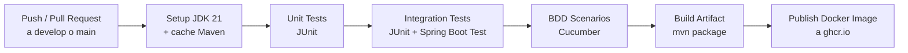
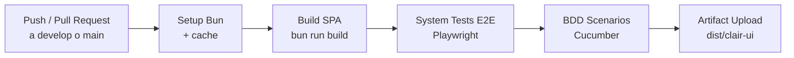
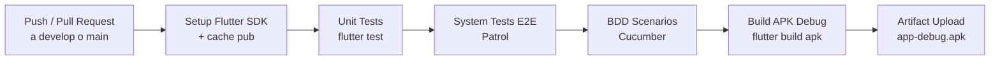

# Capítulo VII: DevOps Practices

## 7.1. Continuous Integration

### 7.1.1. Tools and Practices.

Esta sección define las herramientas que sostienen el flujo de Continuous Integration del proyecto Clair, abarcando el control de versiones, el orquestador de pipelines, la plataforma de despliegue del backend y la plataforma de despliegue del frontend.

| **Nombre del Producto** | **Propósito de Uso** | **Descripción de Uso en el Proyecto** | **Ruta de Referencia / Descarga** |
| --- | --- | --- | --- |
| **GitHub** | Source Code Management | Alojamiento centralizado de los repositorios del proyecto (landing page, `clair-core`, `clair-ui`, aplicación móvil y edge IoT) bajo la organización del equipo. Soporta el modelo GitFlow con Pull Requests, branch protection rules y required status checks, habilitando la integración continua sobre `develop` y `main`. | https://github.com/Vanana-Desarrollo-de-Soluciones-IOT |
| **GitHub Actions** | Continuous Integration & Deployment | Orquestador del pipeline de CI/CD. Dispara workflows ante eventos `push` y `pull_request` para ejecutar de forma automática análisis estático, pruebas unitarias, pruebas de integración, compilación de artefactos y publicación de imágenes Docker. Tras un merge exitoso en `develop`/`main`, también ejecuta el **auto-deploy de la aplicación web Angular hacia Dokploy** (no se limita a ejecutar pruebas y delegar el deploy a Vercel). | https://github.com/features/actions |
| **Dokploy** | Self-hosted Deployment Platform | Plataforma PaaS autoalojada que actúa como destino del auto-deploy del frontend Angular y del backend `clair-core` orquestado por GitHub Actions. Aprovisiona los contenedores Docker en entornos de staging y producción con proxy inverso integrado, HTTPS y dominios personalizados. | https://dokploy.com/ |
| **Vercel** | Deployment & Hosting | Plataforma serverless utilizada únicamente para el despliegue continuo de la landing page estática del proyecto, con CDN global, HTTPS automático y previews por Pull Request. El deploy de la aplicación web Angular se realiza sobre Dokploy, no sobre Vercel. | https://vercel.com/ |

**Prácticas de Ingeniería de Software Adoptadas:**

- **Estrategia de Ramificación (GitFlow):** Se aplica estrictamente el modelo GitFlow. Las funcionalidades se desarrollan de manera aislada en ramas del tipo `feature/*` y se integran exclusivamente a la rama `develop` mediante Pull Requests validados.

- **Estándar de Trazabilidad (Conventional Commits):** Cada modificación en el código debe seguir la especificación de Conventional Commits (ej. `feat:`, `test:`, `fix:`), asegurando un historial auditable y legible.

- **Versionado Semántico (Semantic Versioning 2.0.0):** Se utiliza la nomenclatura `MAJOR.MINOR.PATCH` para el control riguroso de los lanzamientos (releases) de la plataforma, correlacionando el estado del reporte con las etiquetas del repositorio.

- **Integración sin Pérdida de Historial:** Queda estrictamente restringido el uso de comandos destructivos como `force push`. La sincronización de código se realiza mediante merges controlados y revisiones por pares para salvaguardar la integridad de la base de código.

### 7.1.2. Build & Test Suite Pipeline Components.

El pipeline de Integración Continua está estructurado en componentes y etapas secuenciales automatizadas mediante scripts de configuración de GitHub Actions. Esto asegura que ningún fragmento de código sea integrado a la rama común sin haber superado con éxito los umbrales de compilación y pruebas de calidad. A continuación se detallan los componentes del pipeline por cada producto de la plataforma Clair.

**Web Services — `clair-core` (Spring Boot + Maven)**

El repositorio `clair-core` aloja el backend monolito modular desarrollado en Java con Spring Boot. Su pipeline garantiza que el artefacto ejecutable solo se construya si todas las verificaciones dinámicas pasan.

| Stage | Job | Comando / Acción | Herramienta | Salida / Artefacto |
| --- | --- | --- | --- | --- |
| Trigger | — | `on: push / pull_request` a `develop`/`main` | GitHub Actions | Workflow run |
| Setup | `setup-backend` | `actions/checkout` + `setup-java` (JDK 21) + `actions/cache` (`~/.m2`) | GitHub Actions | Entorno JDK 21 reproducible |
| Unit Tests | `unit-tests` | `mvn -B test` | JUnit | Reporte de pruebas unitarias |
| Integration Tests | `integration-tests` | `mvn -B verify` | JUnit, Spring Boot Test | Reporte de pruebas de integración |
| BDD | `bdd-tests` | ejecución de features Cucumber | Cucumber | Reporte de escenarios BDD |
| Build | `package` | `mvn package -DskipTests` | Maven | `target/clair-core-*.jar` |
| Publish | `docker-publish` | `docker buildx build --push` | Docker | `ghcr.io/.../clair-core:<sha>` |

**Etapa de Construcción Automatizada (Build Stage):**
- **Desencadenamiento del Pipeline:** El flujo se activa de forma automática tras el registro de un `push` o la apertura de un `pull_request` hacia las ramas `develop` o `main`.
- **Entorno de Compilación Backend:** El componente de **Maven** ejecuta de forma aislada la descarga de dependencias del archivo `pom.xml`, compila las clases de Java y empaqueta el servicio web en un archivo ejecutable JAR, validando la ausencia de errores sintácticos o de configuración.

**Etapa de Validación e Inyección de Pruebas (Test Suite Stage):**
- **Ejecución de Core Entities Unit Tests:** El pipeline corre las pruebas unitarias con **JUnit** en aislamiento absoluto. En el backend, valida las restricciones de atributos de dominio y reglas de negocio del contexto Clair.
- **Ejecución de Core Integration Tests:** Se levanta un entorno controlado en la nube de CI para simular transacciones completas con **JUnit + Spring Boot Test**. Se comprueba el flujo integral de ingesta de lecturas de sensores, generación de alertas por umbral de calidad de aire y el cumplimiento estricto del aislamiento multi-tenancy entre organizaciones de la plataforma.
- **Ejecución de Core BDD:** Los escenarios de comportamiento definidos en **Cucumber** se ejecutan contra el backend empaquetado, validando que las historias de usuario cumplan con los criterios de aceptación en lenguaje natural.

**Web Application — `clair-ui` (Angular + Bun)**

El repositorio `clair-ui` aloja la Single Page Application web de Clair construida con Angular y gestionada con Bun. Su pipeline produce el bundle estático de producción que luego es desplegado por Dokploy.

| Stage | Job | Comando / Acción | Herramienta | Salida / Artefacto |
| --- | --- | --- | --- | --- |
| Trigger | — | `on: push / pull_request` a `develop`/`main` | GitHub Actions | Workflow run |
| Setup | `setup-frontend` | `actions/checkout` + `oven-sh/setup-bun` + `actions/cache` | GitHub Actions | Entorno Bun reproducible |
| Build | `build-spa` | `bun run build` | Angular CLI, Bun | `dist/clair-ui/browser/` |
| System Tests | `e2e-system` | `playwright test` | Playwright | Reporte HTML Playwright |
| BDD | `bdd-tests` | ejecución de features Cucumber | Cucumber | Reporte de escenarios BDD |
| Artifact Upload | `upload-artifact` | `actions/upload-artifact` con `dist/` | GitHub Actions | `clair-ui-build-<run_id>` |

**Etapa de Construcción Automatizada (Build Stage):**
- **Desencadenamiento del Pipeline:** El flujo se activa de forma automática ante `push` o `pull_request` hacia `develop` o `main`. Un cambio en el directorio raíz del frontend dispara únicamente este workflow, sin acoplarlo al build del backend.
- **Entorno de Compilación Frontend:** El runtime de **Bun** instala las dependencias declaradas en `package.json`, ejecuta el compilador de Angular y produce el bundle estático de producción en `dist/clair-ui/browser/`, validando la ausencia de errores de tipado TypeScript y de compilación de templates.

**Etapa de Validación e Inyección de Pruebas (Test Suite Stage):**
- **Ejecución de Core System Tests (E2E):** Utilizando el framework **Playwright**, configurado e implementado para la aplicación Angular, el pipeline ejecuta pruebas automatizadas End-to-End / System Testing que cubren los principales flujos funcionales del sistema desde la perspectiva del usuario: navegación entre vistas, formularios de registro e inicio de sesión, validaciones de campos, renderizado de gráficos de calidad de aire, consumo del backend `clair-core` y comunicación con la API de suscripciones de Stripe. Esta tarea es implementada por **Luis Anderson** y se reporta como evidencia en la sección **6.1.4 Core System Tests**.
- **Ejecución de Core BDD:** Los escenarios de comportamiento definidos en **Cucumber** se ejecutan contra la aplicación desplegada, validando que las historias de usuario cumplan con los criterios de aceptación en lenguaje natural.

**Mobile Application (Flutter)**

El repositorio móvil de Clair contiene la aplicación multiplataforma escrita en Dart/Flutter. Su pipeline garantiza que el binario (APK) solo se genere si las pruebas unitarias y las pruebas E2E finalizan con éxito.

| Stage | Job | Comando / Acción | Herramienta | Salida / Artefacto |
| --- | --- | --- | --- | --- |
| Trigger | — | `on: push / pull_request` a `develop`/`main` | GitHub Actions | Workflow run |
| Setup | `setup-mobile` | `actions/checkout` + `subosito/flutter-action` + `actions/cache` | GitHub Actions | Entorno Flutter reproducible |
| Unit Tests | `unit-tests` | `flutter test` | flutter_test | Reporte de pruebas unitarias |
| System Tests | `e2e-system` | `patrol test` | Patrol | Reporte HTML Patrol |
| BDD | `bdd-tests` | ejecución de features Cucumber | Cucumber | Reporte de escenarios BDD |
| Build | `build-apk` | `flutter build apk --debug` | Flutter SDK | `build/app/outputs/flutter-apk/app-debug.apk` |
| Artifact Upload | `upload-artifact` | `actions/upload-artifact` | GitHub Actions | `clair-mobile-debug-<run_id>` |

**Etapa de Construcción Automatizada (Build Stage):**
- **Desencadenamiento del Pipeline:** El flujo se activa de forma automática ante cualquier `push` o `pull_request` sobre `develop` o `main`. El job se ejecuta en un runner Ubuntu con el SDK de Flutter estable.
- **Entorno de Compilación Móvil:** El pipeline inicializa el entorno de **Flutter**, realiza la limpieza de caché (`flutter clean`), descarga los paquetes definidos en el archivo `pubspec.yaml` y ejecuta la pre-compilación del código Dart para asegurar la compatibilidad estructural de la aplicación móvil.

**Etapa de Validación e Inyección de Pruebas (Test Suite Stage):**
- **Ejecución de Core Entities Unit Tests:** El pipeline corre las pruebas unitarias automatizadas en aislamiento absoluto. En el entorno móvil, comprueba la correcta creación, modificación y serialización de las entidades de Lecturas de Calidad de Aire, Sensores, Alertas y Organización.
- **Ejecución de Core System Tests (E2E):** Utilizando el framework especializado **Patrol**, configurado e integrado en Flutter, el pipeline ejecuta pruebas automatizadas de sistema de extremo a extremo que validan la navegación por la interfaz, la interacción con componentes, los formularios, el consumo real del backend `clair-core` y los escenarios críticos del usuario (sincronización de lecturas, registro de dispositivos del Edge Station, alertas en primer plano, comportamiento sin conexión). Esta tarea forma parte de la sección **6.1.4 Core System Tests**.
- **Ejecución de Core BDD:** Los escenarios de comportamiento definidos en **Cucumber** se ejecutan contra la aplicación móvil, validando que las historias de usuario cumplan con los criterios de aceptación en lenguaje natural.

## 7.2. Continuous Delivery

### 7.2.1. Tools and Practices.

Para asegurar un flujo de lanzamientos eficiente y desacoplado, el equipo de Bananawire ha adoptado la práctica de Entrega Continua (CD) para la plataforma Clair. Esta práctica garantiza que cualquier incremento de software que haya superado la etapa de Integración Continua (CI) sea empaquetado y preparado automáticamente para su puesta en producción en la nube.

**Herramientas de la Suite de Entrega Continua:**

- **Orquestador de Despliegue Autoalojado:** Dokploy actúa como motor de CD para los servicios web backend (`clair-core`), el frontend Angular (`clair-ui`) y el servicio edge IoT (Flask), integrándose de forma directa a nivel de repositorio con la organización `Vanana-Desarrollo-de-Soluciones-IOT` mediante su mecanismo nativo de detección de eventos sobre GitHub.
- **Distribución de la Solución Móvil:** Firebase App Distribution opera como canal de Entrega Continua para el cliente nativo en Flutter, automatizando la distribución de versiones ejecutables de prueba al equipo de desarrollo y a los evaluadores.
- **Despliegue de la Landing Page:** Vercel se emplea para la entrega continua del sitio estático institucional de Clair, gestionando previews automáticos por cada Pull Request.
- **Persistencia Integrada:** PostgreSQL opera como motor de base de datos relacional para el entorno de staging, provisionado como contenedor gestionado dentro de Dokploy.
- **Caché y Mensajería:** Redis se despliega como contenedor complementario para los entornos de staging, evitando acoplamiento con los servicios de producción.
- **Distribución de Artefactos:** GitHub Container Registry (ghcr.io) almacena las imágenes Docker inmutables producidas por el pipeline de CI, listas para ser promovidas a staging.

**Prácticas de Entrega Automatizada:**

- **Despliegue Basado en Eventos (Git-Driven Deployment):** Se restringe cualquier tipo de intervención manual o configuraciones locales en los computadores del equipo. El entorno de staging se sincroniza directamente con la rama `develop` y el de producción con la rama `main`.
- **Automatización por Confirmación:** Al aprobarse un Pull Request e integrarse los cambios en la rama correspondiente, Dokploy detecta automáticamente el evento de `push` mediante webhooks internos, iniciando la construcción del contenedor y el aprovisionamiento del servicio de manera inmediata.
- **Inmutabilidad del Artefacto:** Cada build de CI produce una imagen Docker etiquetada con el SHA del commit (`ghcr.io/.../clair-core:<sha>`), garantizando que el mismo binario que pasó todas las pruebas sea el promovido a staging.
- **Aislamiento del Entorno de Staging:** Cada promoción a staging se realiza contra una URL independiente del entorno productivo, permitiendo validar la liberación sin afectar a los establecimientos que ya usan Clair.

### 7.2.2. Stages Deployment Pipeline Components.

El pipeline de Entrega Continua opera de forma automatizada y transparente. El equipo ha estructurado un pipeline optimizado sobre Dokploy basado en su comportamiento nativo de detección de eventos en GitHub:

**Etapa de Detección e Integración en la Nube (Cloud Detection Stage):**

- **Monitoreo de Staging:** Dokploy mantiene un escucha activo (listener) sobre los repositorios `clair-core`, `clair-ui` y el servicio edge IoT. Al consolidarse el código en la rama `develop`, la plataforma jala automáticamente los últimos cambios hacia sus servidores de empaquetamiento.

**Etapa de Construcción y Puesta en Operación (Build & Live Stage):**

- **Empaquetamiento Backend Remoto:** El servidor de Dokploy inicializa un entorno aislado, descarga la imagen Docker del backend desde GitHub Container Registry y levanta el contenedor de Spring Boot directamente en la nube, garantizando que el artefacto binario esté optimizado para el entorno de staging.
- **Empaquetamiento Frontend Remoto:** Para la SPA de Angular, Dokploy sirve el bundle estático de producción construido por el pipeline de CI dentro del contenedor, expuesto a través de **Caddy** como proxy inverso.
- **Despliegue Transparente (Zero-Downtime):** Una vez concluida la compilación, Dokploy levanta el nuevo servicio en paralelo y realiza la transición de tráfico sin interrumpir la disponibilidad de Clair para los establecimientos monitoreados, manteniendo la consistencia de los datos en PostgreSQL.
- **Distribución Móvil:** Firebase App Distribution recibe automáticamente el APK firmado generado en el pipeline de CI y lo pone a disposición del equipo de validación interna.

## 7.3. Continuous deployment

### 7.3.1. Tools and Practices.

El proceso de Despliegue Continuo (CD) en la plataforma Clair representa la automatización absoluta del flujo de liberación. Una vez que los incrementos de software son consolidados en la rama `main`, el sistema despliega las modificaciones de forma inmediata hacia los entornos de producción sin intervención manual, garantizando una alta disponibilidad y resiliencia de los servicios bajo el modelo SaaS de Clair.

**Prácticas de Despliegue Automatizado en Producción:**

- **Despliegue de Extremo a Extremo (Git-Triggered Production):** Cada fusión exitosa (merge) sobre la rama `main` activa la actualización inmediata del ecosistema productivo en Dokploy y en Vercel.
- **Estrategia de Despliegue Impecable (Zero-Downtime Deployment):** Dokploy y Vercel aprovisionan contenedores e instancias en paralelo. El tráfico de los usuarios no se interrumpe, ya que la versión anterior solo se apaga cuando la nueva está completamente operativa (Live y Healthy).
- **Inyección Dinámica de Variables de Entorno:** Las credenciales de producción se inyectan en tiempo de ejecución en Dokploy, aislando por completo los secretos comerciales del código fuente público.

### 7.3.2. Production Deployment Pipeline Components.

Esta sección describe la topología y los componentes de infraestructura en la nube donde reside operando la solución Clair en su entorno de producción definitivo:

**Componentes del Entorno Productivo del Backend (API REST en Dokploy):**

- **Source Control & Trigger:** Repositorio centralizado `clair-core` (rama `main`).
- **Runtime Environment:** Servidor remoto ejecutando OpenJDK 21 y embebiendo la arquitectura de Spring Boot dentro de un contenedor Docker gestionado por Dokploy.
- **Persistencia Transaccional:** Base de datos relacional PostgreSQL administrada mediante migraciones automáticas con **Flyway** durante el pipeline de despliegue, vinculada de forma segura mediante variables de entorno cifradas.
- **Caché y Broker de Mensajes:** Servicio Redis desplegado como contenedor complementario para la gestión de caché de consultas y la publicación de eventos en tiempo real.
- **Túnel Seguro de Exposición:** **Cloudflare Tunnel** expone el servicio públicamente sin requerir IP pública, complementado con **Tailscale** para la conexión privada con la red del Edge Station IoT.

**Componentes del Entorno Productivo del Frontend (SPA Angular en Dokploy):**

- **Source Control & Trigger:** Repositorio centralizado `clair-ui` (rama `main`).
- **Hosting & Reverse Proxy:** Dokploy con **Caddy** como proxy inverso, configurado para gestionar HTTPS automático y optimizar la entrega del bundle estático Angular a los usuarios finales administradores de Clair.

**Componentes del Entorno Productivo de la Landing Page:**

- **Source Control & Trigger:** Repositorio `site` (rama `main`).
- **Hosting & CDN Edge:** Infraestructura global de **Vercel**, configurada para optimizar el SEO y garantizar tiempos de carga mínimos para los visitantes y posibles clientes de Clair.

**Componentes del Entorno Productivo del Edge Station (Flask + Azure IoT Hub):**

- **Source Control & Trigger:** Repositorio del servicio edge (rama `main`).
- **Runtime Environment:** Contenedor Python/Flask desplegado en Dokploy, encargado de la recepción de telemetría desde los sensores ESP32 y de la sincronización con `clair-core` a través de **Azure IoT Hub**.
- **Conectividad Resiliente:** Implementación de cola local en el edge para tolerar desconexiones y reintento automático de sincronización ante pérdida temporal de conectividad.

**Integración de Servicios Externos en el Entorno de Producción:**

- **Pasarela de Pagos:** **Stripe** opera como microservicio en la nube para la gestión de suscripciones y transacciones de los administradores de establecimientos que adoptan planes comerciales de Clair.
- **Notificaciones Transaccionales:** **Resend** se encarga del envío de correos electrónicos críticos (confirmaciones de pago, recuperación de cuenta, alertas de mantenimiento programado).
- **Notificaciones Push en Tiempo Real:** **OneSignal** se integra como canal de alertas inmediatas para los administradores cuando los sensores detectan condiciones de aire interior que requieren atención.
- **Identidad y Acceso:** **Google OAuth2** opera como proveedor de identidad federada para el inicio de sesión seguro de los usuarios administradores.

## 7.4. Continuous Monitoring

### 7.4.1. Tools and Practices

### 7.4.2. Monitoring Pipeline Components

### 7.4.3. Alerting Pipeline Components

### 7.4.4. Notification Pipeline Components.